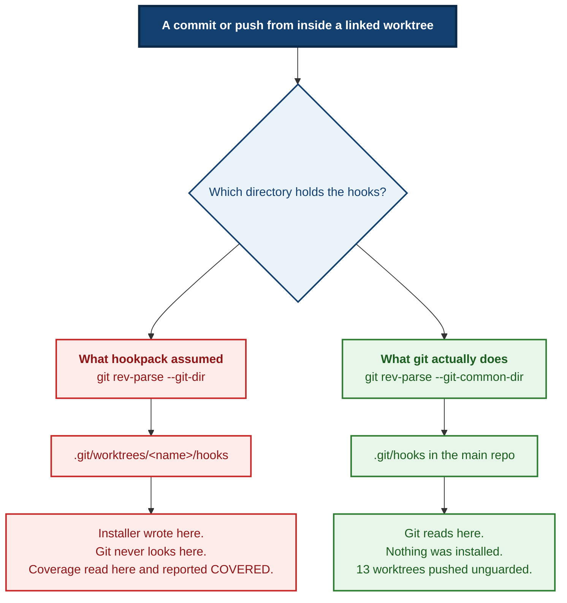
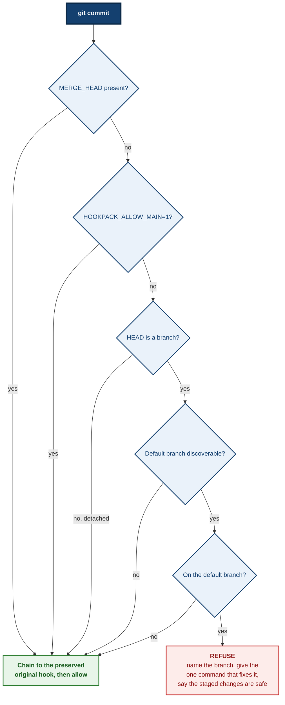

# What I want

`hookpack` stamps git hooks into every repository on this machine. As of tonight
it is installed in **53 hooks directories** and gates **every commit and every
push** the user, his agents, and his other AI tools make.

**It has been reviewed by exactly one person: me, its author.** That is the
pattern this whole toolchain exists to prevent — a check built by the person it
was meant to catch — and it is why you are being asked.

I want **defects**, not a summary. For each one: what breaks, under what
conditions, and what the user loses. Rank by how bad the outcome is, not by how
clever the finding is.

## Where I think the risk actually is

Spend yourself here rather than on style:

1. **Fail-open paths in `hooks/pre-commit`.** Every early `exit 0` is a commit
   that skips the guard. I believe each is justified. Find one that is not, or
   an input that reaches one unintentionally. Note the escape hatch
   `HOOKPACK_ALLOW_MAIN=1` is deliberate.

2. **`hooks/pre-push` is a SECURITY control** — it blocks pushes carrying a
   non-allowlisted committer email or a secret gitleaks recognises. It is
   supposed to fail CLOSED. I changed how it resolves the chained-hook path.
   Did I weaken anything? Can a push get through unscanned?

3. **The `--git-common-dir` change.** Both bin scripts used `--git-dir`; git
   reads hooks from the common dir, so inside a linked worktree the installer
   wrote hooks git never ran while coverage reported those worktrees covered.
   13 worktrees were unguarded. My fix is in `lib/common.sh`. Is the resolution
   correct for every case — submodules, nested worktrees, a `.git` file, a
   bare repo, a repo whose common dir is outside the scanned root?

4. **The marker/version split.** `HOOKPACK_MARKER` decides "is this hook ours"
   and `HOOKPACK_VERSION_LINE` decides "is it current". They used to be one
   string, which would have made the first version bump treat every installed
   hook as foreign and chain the new hook to the old one forever. Is the split
   complete, or does a path still conflate them?

5. **The installer is destructive.** It `cp`s over existing hooks and `mv`s
   foreign ones aside. Can it lose a hook? Double-chain? Leave a repo with a
   hook that never runs? What happens if it is interrupted halfway?

6. **Do the tests actually test what they claim?** This is the one I most want
   a second opinion on. `test_main_guard_mutations.sh` applies mutations to a
   COPY of the hook and asserts each behaviour flips. Is any assertion
   satisfiable without the mechanism it names? A test that cannot fail on its
   own defect is the failure mode this project is organised against, and I
   wrote these tests and the code they check.

## What I already know, so you do not spend on it

- `git revert`, `git cherry-pick`, `git merge` and `git rebase --continue` do
  NOT invoke `pre-commit` (measured, git 2.43.0). The guard covers *authoring*
  on the default branch, deliberately. It is documented in the hook header,
  the README and the ADR, and pinned as assertions. Do not report it as a gap —
  but DO tell me if the documented scope is stated in a way that misleads.
- `bash` is not on `failure-atlas`'s runner allowlist, so its mutation tool
  could not run these shell tests. I did not widen that allowlist on purpose.
- The suite is 50 assertions across 8 files, all green.

## What to be sceptical of specifically

I made five successive measurement errors in an unrelated task earlier tonight,
each producing a confident wrong number, each caught only by refusing to accept
a green result. **Assume the same failure mode is present here.** Where a test
asserts success, ask what else would also produce that success.

## Format

For each defect: a one-line claim, the exact trigger, the consequence, and the
file and line. Then a short list of things you checked and found sound, so I
know what the review actually covered. If your top finding is "the risk is
somewhere other than where he pointed", say that first.

---

# The code

Every file is complete and current as of the merge of PR #2.

Repository HEAD: `c8455100134aea419d586094ce0a15e503d142d6 Merge pull request #3 from tom2025b/chore/gitignore-journal-staging`

## `hooks/pre-commit`

*The new guard. THE main review target.* — 133 lines

```bash
#!/usr/bin/env bash
# hookpack pre-commit — refuse a commit that authors new work directly on the
# repository's default branch. Installed by bin/hookpack-install.
# HOOKPACK_VERSION=2
#
# WHY THIS EXISTS
#
# The standing rule on this box is that every change starts on its own branch
# and reaches the default branch through a pull request, and that branches are
# never deleted afterwards so the history stays walkable. That rule is correct,
# is written down, and was still broken on 2026-08-20 by an agent that knew it,
# mid-session, while concentrating on something else. A rule that lives only in
# a document is enforced by whoever read the document last.
#
# So it moves here, where forgetting is impossible. Same reasoning as buildlock
# (two builds cannot coordinate by intention, so flock arbitrates) and as this
# pack's own pre-push identity gate (a careful human still leaked a gmail
# address twice in ten days).
#
# WHAT IT COVERS, MEASURED RATHER THAN ASSUMED
#
# Git does not route every commit-creating command through `pre-commit`. On
# git 2.43.0, probed directly (see docs/adr/0002 for the harness):
#
#   git commit .......................... hook RUNS      -> guarded
#   git commit --amend .................. hook RUNS      -> guarded
#   git commit finishing a merge ........ hook RUNS      -> ALLOWED, see below
#   git revert .......................... hook NOT run   -> unguarded
#   git cherry-pick ..................... hook NOT run   -> unguarded
#   git merge (true merge) .............. hook NOT run   -> uses pre-merge-commit
#   git rebase --continue ............... hook NOT run   -> unguarded
#   git stash push ...................... hook NOT run   -> unguarded
#
# That is a coherent scope, not an accident: this guard stops you AUTHORING new
# work on the default branch. Integration operations — reverting a bad commit,
# cherry-picking a fix, completing a merge, finishing a rebase — pass straight
# through and are meant to. Reverting something broken on main is sometimes
# urgent, and a guard that made an urgent revert need an override variable
# would be a guard people turn off.
#
# State it plainly wherever this is described: **this does not prevent every
# commit on the default branch.** A check that is believed to cover more than
# it does is worse than no check, which is the lesson this whole pack is built
# around.
#
# THE MERGE CARVE-OUT IS LOAD-BEARING
#
# Finishing a conflicted merge is the one commit-creating path that does reach
# this hook while legitimately belonging on the default branch. Without the
# MERGE_HEAD check, every conflicted `git merge` into main would dead-end at a
# refusal with the merge half-applied. Verified present in the probe above.
#
# THE ESCAPE HATCH IS DELIBERATE
#
#   HOOKPACK_ALLOW_MAIN=1 git commit ...
#
# A hook that cannot be overridden gets disabled wholesale the first time it
# blocks something legitimate, and then it guards nothing. The variable is
# per-command rather than a config setting, so using it is a decision made once
# at the moment it applies, not a switch left on.

set -euo pipefail

# Resolve the common git dir, not `--git-dir`: inside a linked worktree those
# differ, and everything hook-related lives in the common one.
git_common="$(git rev-parse --git-common-dir 2>/dev/null)" || exit 0
case "$git_common" in
  /*) : ;;
  *) git_common="$(pwd)/$git_common" ;;
esac

# Run whatever hook this repo had before hookpack was installed, then leave.
# Called on every exit path that permits the commit, so installing this guard
# never silently disables a repo's own checks.
chain_and_exit() {
  local chained="$git_common/hooks/pre-commit.hookpack-original"
  if [ -x "$chained" ]; then
    "$chained" "$@"
  fi
  exit 0
}

# This commit IS a merge being completed. Never block it.
if [ -e "$git_common/MERGE_HEAD" ]; then
  chain_and_exit "$@"
fi

if [ "${HOOKPACK_ALLOW_MAIN:-}" = "1" ]; then
  chain_and_exit "$@"
fi

# Detached HEAD (bisect, a rebase replay, an explicit checkout of a sha) has no
# branch to compare against. Nothing to say, so say nothing.
branch="$(git symbolic-ref --quiet --short HEAD 2>/dev/null)" || chain_and_exit "$@"
[ -n "$branch" ] || chain_and_exit "$@"

# The default branch as this repository actually reports it. origin/HEAD is the
# authoritative answer when it exists; the main/master fallback covers repos
# that were never cloned (git remote add does not create origin/HEAD).
default=""
if remote_head="$(git symbolic-ref --quiet --short refs/remotes/origin/HEAD 2>/dev/null)"; then
  default="${remote_head#origin/}"
elif git show-ref --verify --quiet refs/heads/main; then
  default="main"
elif git show-ref --verify --quiet refs/heads/master; then
  default="master"
fi

# A repository with no discoverable default branch — including a fresh `git
# init` before its first commit, where you cannot branch yet — is left alone.
# Guessing here would block the one commit that has no alternative.
if [ -z "$default" ] || [ "$branch" != "$default" ]; then
  chain_and_exit "$@"
fi

cat >&2 <<EOF

  hookpack pre-commit: BLOCKED - refusing to author a commit on '$branch'.

  Every change starts on its own branch and reaches '$branch' through a pull
  request. Branches are never deleted afterwards, so the history stays
  walkable.

      git checkout -b <branch-name>

  Your staged changes are untouched — the branch carries them with you.

  If this commit genuinely belongs on '$branch':

      HOOKPACK_ALLOW_MAIN=1 git commit ...

EOF
exit 1

```

## `lib/common.sh`

*New. Shared by both bin scripts so they cannot disagree.* — 67 lines

```bash
# Shared by bin/hookpack-install and bin/hookpack-coverage.
#
# The whole point of this file is that the installer and the coverage report
# must derive the hook list and the target directory from the SAME code. A
# coverage report that checks a different set of hooks, or a different
# directory, than the installer writes is the failure this box keeps
# producing: a monitor blind to part of its job, reporting green.
#
# Source it with HOOKPACK_ROOT set to the repo root, or let it work that out
# from its own location.

# The marker says "hookpack wrote this", stable across versions, and is what
# decides whether a pre-existing hook is FOREIGN and must be preserved.
# The version says "and it is the current body", and is what decides whether a
# repo needs reinstalling. Keying both off one string was a latent bug: bumping
# the version would have made every already-installed hook look foreign, so the
# installer would have moved it to .hookpack-original and chained to it forever.
HOOKPACK_MARKER="# HOOKPACK_VERSION="
HOOKPACK_VERSION_LINE="# HOOKPACK_VERSION=2"

hookpack_root() {
  if [ -n "${HOOKPACK_ROOT:-}" ]; then
    printf '%s\n' "$HOOKPACK_ROOT"
    return
  fi
  cd "$(dirname "${BASH_SOURCE[0]}")/.." && pwd
}

# Every hook this pack ships, by name, read from the hooks/ directory itself.
# Adding hooks/pre-merge-commit tomorrow needs no edit here or in either bin
# script — which is the only way the two stay in agreement.
hookpack_hook_names() {
  local root; root="$(hookpack_root)"
  local f
  for f in "$root"/hooks/*; do
    [ -f "$f" ] || continue
    basename "$f"
  done
}

# Where git ACTUALLY reads hooks for a given working directory.
#
# Not `--git-dir`. Inside a linked worktree `--git-dir` is
# .git/worktrees/<name>, but git resolves hooks through the COMMON dir — so
# installing into --git-dir writes a hook git never runs, while a coverage
# check reading the same path calls the worktree covered. Measured on git
# 2.43.0, not assumed; the probe is in tests/test_worktree_hookdir.sh.
hookpack_hooks_dir() {
  local repo_dir="$1" common
  common="$(git -C "$repo_dir" rev-parse --git-common-dir 2>/dev/null)" || return 1
  case "$common" in
    /*) : ;;
    *) common="$repo_dir/$common" ;;
  esac
  # Several worktrees share one common dir; the caller deduplicates on this.
  printf '%s\n' "$(cd "$common" && pwd)/hooks"
}

# Emit the hooks dir of every git working tree under ROOT, deduplicated, so a
# repo with a dozen linked worktrees is visited once rather than a dozen times.
hookpack_each_hooks_dir() {
  local root="$1"
  find "$root" -name .git \( -type d -o -type f \) -print0 2>/dev/null |
  while IFS= read -r -d '' gitpath; do
    hookpack_hooks_dir "$(dirname "$gitpath")" || continue
  done | sort -u
}

```

## `bin/hookpack-install`

*Rewritten: multi-hook, common-dir, dedup.* — 55 lines

```bash
#!/usr/bin/env bash
# Stamp every hook in hooks/ into every git working tree under ROOT.
#
# Per-repo copies in the repo's own hooks directory — NOT core.hooksPath, which
# is global and silently clobbers whatever hooks a repo already had.
#
# Idempotent: re-running overwrites with the current hook body, and chains a
# FOREIGN hook only once (a previous hookpack version is not foreign, so a
# version bump replaces it rather than preserving it as an "original").
#
# Linked worktrees resolve to their repository's COMMON hooks directory, which
# is the one git actually reads. Several worktrees therefore share one target
# and are visited once.
set -euo pipefail

SCRIPT_DIR="$(cd "$(dirname "${BASH_SOURCE[0]}")" && pwd)"
# shellcheck source=../lib/common.sh
source "$SCRIPT_DIR/../lib/common.sh"

ROOT="${1:-$HOME/projects}"
HOOK_DIR_SRC="$(hookpack_root)/hooks"

install_one() {
  local hooks_dir="$1" name="$2"
  local src="$HOOK_DIR_SRC/$name"
  local target="$hooks_dir/$name"

  # A hook that is not ours gets preserved once, and the hookpack hook chains
  # to it. A hook of ours — any version — is simply replaced.
  if [ -f "$target" ] && ! grep -qF "$HOOKPACK_MARKER" "$target"; then
    if [ ! -e "$hooks_dir/$name.hookpack-original" ]; then
      mv "$target" "$hooks_dir/$name.hookpack-original"
      chmod +x "$hooks_dir/$name.hookpack-original"
      echo "preserved: $hooks_dir/$name.hookpack-original"
    fi
  fi

  cp "$src" "$target"
  chmod +x "$target"
  echo "installed: $target"
}

mapfile -t HOOK_NAMES < <(hookpack_hook_names)
if [ "${#HOOK_NAMES[@]}" -eq 0 ]; then
  echo "hookpack-install: no hooks found in $HOOK_DIR_SRC - refusing to report success" >&2
  exit 1
fi

while IFS= read -r hooks_dir; do
  [ -n "$hooks_dir" ] || continue
  mkdir -p "$hooks_dir"
  for name in "${HOOK_NAMES[@]}"; do
    install_one "$hooks_dir" "$name"
  done
done < <(hookpack_each_hooks_dir "$ROOT")

```

## `bin/hookpack-coverage`

*Rewritten to match the installer.* — 48 lines

```bash
#!/usr/bin/env bash
# Report every git working tree under ROOT that is missing, or running a stale
# copy of, any hook this pack ships.
#
# The hook list and the target directory both come from lib/common.sh, the same
# source bin/hookpack-install uses. That is deliberate and is the point of this
# script: a coverage report that checks a different set of hooks, or a
# different directory, than the installer writes would report green over a gap.
# It did exactly that until 2026-08-20 — it checked only pre-push, and looked
# for it in --git-dir, which for a linked worktree is a path git never reads
# hooks from. Thirteen worktrees on this box reported covered while being
# unguarded.
set -euo pipefail

SCRIPT_DIR="$(cd "$(dirname "${BASH_SOURCE[0]}")" && pwd)"
# shellcheck source=../lib/common.sh
source "$SCRIPT_DIR/../lib/common.sh"

ROOT="${1:-$HOME/projects}"

mapfile -t HOOK_NAMES < <(hookpack_hook_names)
if [ "${#HOOK_NAMES[@]}" -eq 0 ]; then
  echo "hookpack-coverage: no hooks found to check for - refusing to report coverage" >&2
  exit 1
fi

gaps=0
while IFS= read -r hooks_dir; do
  [ -n "$hooks_dir" ] || continue
  for name in "${HOOK_NAMES[@]}"; do
    hook="$hooks_dir/$name"
    if [ ! -f "$hook" ]; then
      echo "MISSING  $name  $hooks_dir"
      gaps=$((gaps + 1))
    elif ! grep -qF "$HOOKPACK_VERSION_LINE" "$hook"; then
      # Present but not the current body: either a foreign hook that was never
      # displaced, or an older hookpack version. Both need a reinstall, and
      # neither is coverage.
      echo "STALE    $name  $hooks_dir"
      gaps=$((gaps + 1))
    fi
  done
done < <(hookpack_each_hooks_dir "$ROOT")

if [ "$gaps" -eq 0 ]; then
  echo "all hooks current in every git working tree under $ROOT"
fi
exit 0

```

## `tests/test_main_guard.sh`

*New. 20 assertions.* — 194 lines

```bash
#!/usr/bin/env bash
# The pre-commit default-branch guard: what it refuses, what it lets through,
# and — just as important — what it CANNOT see.
#
# The last group is not padding. A guard believed to cover more than it does is
# worse than no guard, so the paths that bypass it are pinned here as assertions
# rather than left as prose in the hook's header. If a future git version starts
# routing `git revert` through pre-commit, this file goes red and somebody reads
# the scope statement again.
set -euo pipefail
HERE="$(cd "$(dirname "${BASH_SOURCE[0]}")" && pwd)"
# shellcheck source=lib/harness.sh
source "$HERE/lib/harness.sh"
HOOK="$HERE/../hooks/pre-commit"

# A fixture repo with the guard installed and one commit on main already.
guarded_repo() {
  local repo
  repo="$(new_fixture_repo)"
  mkdir -p "$repo/.git/hooks"
  cp "$HOOK" "$repo/.git/hooks/pre-commit"
  chmod +x "$repo/.git/hooks/pre-commit"
  echo "$repo"
}

# Stage a unique change so every commit attempt has real content.
stage_change() {
  local repo="$1" name="${2:-file.txt}"
  echo "$RANDOM$RANDOM" >> "$repo/$name"
  hermetic_git "$repo" add -A
}

commit_count() { hermetic_git "$1" rev-list --count HEAD 2>/dev/null || echo 0; }

try_commit() {
  local repo="$1" msg="$2"
  set +e
  hermetic_git "$repo" commit -q -m "$msg" >/dev/null 2>&1
  local rc=$?
  set -e
  echo "$rc"
}

# --- 1. a commit that AUTHORS work on the default branch is refused ----------
repo="$(guarded_repo)"
stage_change "$repo"
hermetic_git "$repo" commit -q -m root >/dev/null 2>&1 || true   # first commit: no default yet
stage_change "$repo"
before="$(commit_count "$repo")"
rc="$(try_commit "$repo" "on main")"
assert_eq "1" "$rc" "commit on the default branch is refused"
assert_eq "$before" "$(commit_count "$repo")" "and no commit was created"

# --- 2. the staged changes survive the refusal -------------------------------
staged="$(hermetic_git "$repo" diff --cached --name-only | wc -l | tr -d ' ')"
assert_eq "1" "$staged" "the refusal leaves the staged changes intact"

# --- 3. the same commit on a branch goes through -----------------------------
hermetic_git "$repo" checkout -q -b feature/x
before="$(commit_count "$repo")"
rc="$(try_commit "$repo" "on a branch")"
assert_eq "0" "$rc" "commit on a non-default branch is permitted"
assert_eq "$((before + 1))" "$(commit_count "$repo")" "and the commit was created"

# --- 4. the override lets a deliberate commit onto the default branch -------
hermetic_git "$repo" checkout -q main
stage_change "$repo"
before="$(commit_count "$repo")"
set +e
HOOKPACK_ALLOW_MAIN=1 hermetic_git "$repo" commit -q -m "deliberate" >/dev/null 2>&1
rc=$?
set -e
assert_eq "0" "$rc" "HOOKPACK_ALLOW_MAIN=1 permits a deliberate commit on main"
assert_eq "$((before + 1))" "$(commit_count "$repo")" "and that commit was created"

# --- 5. finishing a conflicted merge on the default branch is permitted ------
# The load-bearing carve-out: this is the one commit-creating path that both
# reaches pre-commit AND legitimately belongs on the default branch. Without it
# every conflicted merge into main dead-ends with the merge half-applied.
repo="$(guarded_repo)"
echo base > "$repo/conflict.txt"; hermetic_git "$repo" add -A
HOOKPACK_ALLOW_MAIN=1 hermetic_git "$repo" commit -q -m base >/dev/null 2>&1
hermetic_git "$repo" checkout -q -b side
echo side > "$repo/conflict.txt"; hermetic_git "$repo" add -A
hermetic_git "$repo" commit -q -m side >/dev/null 2>&1
hermetic_git "$repo" checkout -q main
echo mine > "$repo/conflict.txt"; hermetic_git "$repo" add -A
HOOKPACK_ALLOW_MAIN=1 hermetic_git "$repo" commit -q -m mine >/dev/null 2>&1
hermetic_git "$repo" merge --no-edit side >/dev/null 2>&1 || true
echo resolved > "$repo/conflict.txt"; hermetic_git "$repo" add -A
set +e
hermetic_git "$repo" commit -q --no-edit >/dev/null 2>&1
rc=$?
set -e
assert_eq "0" "$rc" "finishing a conflicted merge on main is permitted"
# NOT a commit count: a merge makes the whole side branch reachable, so the
# count jumps by more than one and an off-by-one assertion here would be
# measuring reachability, not whether a commit was made. Ask the direct
# question instead — does HEAD have a second parent?
set +e
hermetic_git "$repo" rev-parse --verify --quiet HEAD^2 >/dev/null 2>&1
is_merge=$?
set -e
assert_eq "0" "$is_merge" "and HEAD is now a merge commit"

# --- 6. origin/HEAD is authoritative over the main/master fallback -----------
# A repo whose default branch is neither 'main' nor 'master' must still be
# guarded, and its 'main' branch must be treated as an ordinary topic branch.
repo="$(guarded_repo)"
stage_change "$repo"
HOOKPACK_ALLOW_MAIN=1 hermetic_git "$repo" commit -q -m root >/dev/null 2>&1
hermetic_git "$repo" branch trunk
hermetic_git "$repo" update-ref refs/remotes/origin/trunk "$(hermetic_git "$repo" rev-parse HEAD)"
hermetic_git "$repo" symbolic-ref refs/remotes/origin/HEAD refs/remotes/origin/trunk
hermetic_git "$repo" checkout -q trunk
stage_change "$repo"
rc="$(try_commit "$repo" "on trunk")"
assert_eq "1" "$rc" "a default branch named by origin/HEAD is guarded, not just main/master"
hermetic_git "$repo" checkout -q main
rc="$(try_commit "$repo" "on main, which is not the default here")"
assert_eq "0" "$rc" "and 'main' is an ordinary branch when origin/HEAD names another"

# --- 7. the very first commit in a fresh repo is never blocked ---------------
# There is no branch to move to before the first commit exists. Blocking here
# would refuse the one commit that has no alternative.
repo="$(guarded_repo)"
stage_change "$repo"
before="$(commit_count "$repo")"
rc="$(try_commit "$repo" "first ever commit")"
assert_eq "0" "$rc" "the first commit in a repo with no history is permitted"
assert_eq "1" "$(commit_count "$repo")" "and it landed"

# --- 8. a preserved foreign hook still runs ---------------------------------
# Installing this guard must never silently disable a repo's own pre-commit.
repo="$(guarded_repo)"
marker="$repo/original-ran"
printf '%s\n' '#!/usr/bin/env bash' "touch $marker" 'exit 0' \
  > "$repo/.git/hooks/pre-commit.hookpack-original"
chmod +x "$repo/.git/hooks/pre-commit.hookpack-original"
stage_change "$repo"
HOOKPACK_ALLOW_MAIN=1 hermetic_git "$repo" commit -q -m root >/dev/null 2>&1
hermetic_git "$repo" checkout -q -b feature/y
stage_change "$repo"
rm -f "$marker"
hermetic_git "$repo" commit -q -m chained >/dev/null 2>&1
[ -f "$marker" ] \
  && { pass_count=$((pass_count + 1)); echo "  ok: the preserved original pre-commit hook still runs"; } \
  || { fail_count=$((fail_count + 1)); echo "  FAIL: the preserved original pre-commit hook did not run"; }

# --- 9. a preserved foreign hook can still VETO ------------------------------
# Chaining is worthless if the chained hook's exit code is discarded.
stage_change "$repo"
printf '%s\n' '#!/usr/bin/env bash' 'exit 1' \
  > "$repo/.git/hooks/pre-commit.hookpack-original"
chmod +x "$repo/.git/hooks/pre-commit.hookpack-original"
before="$(commit_count "$repo")"
rc="$(try_commit "$repo" "original vetoes")"
assert_eq "1" "$rc" "a refusal from the preserved original hook still blocks the commit"
assert_eq "$before" "$(commit_count "$repo")" "and no commit was created"

# --- 10. what the guard CANNOT see, pinned so nobody overstates it -----------
# These commands create commits on the default branch without ever reaching
# pre-commit (measured on git 2.43.0). They are deliberately permitted: an
# urgent revert on main must not need an override. If any of these starts
# being blocked, git changed and the hook's scope statement needs rewriting.
repo="$(guarded_repo)"
echo one > "$repo/a.txt"; hermetic_git "$repo" add -A
HOOKPACK_ALLOW_MAIN=1 hermetic_git "$repo" commit -q -m root >/dev/null 2>&1
echo two > "$repo/a.txt"; hermetic_git "$repo" add -A
HOOKPACK_ALLOW_MAIN=1 hermetic_git "$repo" commit -q -m second >/dev/null 2>&1
before="$(commit_count "$repo")"
set +e
hermetic_git "$repo" revert --no-edit HEAD >/dev/null 2>&1
rc=$?
set -e
assert_eq "0" "$rc" "git revert on the default branch bypasses pre-commit (documented, not a bug)"
assert_eq "$((before + 1))" "$(commit_count "$repo")" "and the revert commit exists"

repo="$(guarded_repo)"
echo one > "$repo/a.txt"; hermetic_git "$repo" add -A
HOOKPACK_ALLOW_MAIN=1 hermetic_git "$repo" commit -q -m root >/dev/null 2>&1
hermetic_git "$repo" checkout -q -b side
echo side > "$repo/b.txt"; hermetic_git "$repo" add -A
hermetic_git "$repo" commit -q -m side >/dev/null 2>&1
hermetic_git "$repo" checkout -q main
before="$(commit_count "$repo")"
set +e
hermetic_git "$repo" cherry-pick side >/dev/null 2>&1
rc=$?
set -e
assert_eq "0" "$rc" "git cherry-pick onto the default branch bypasses pre-commit (documented)"
assert_eq "$((before + 1))" "$(commit_count "$repo")" "and the cherry-picked commit exists"

test_summary

```

## `tests/test_main_guard_mutations.sh`

*New. Proves the guard's tests can go red.* — 127 lines

```bash
#!/usr/bin/env bash
# Prove the assertions in test_main_guard.sh can actually go red.
#
# A test that names a defect it cannot fail on is worse than no test: it buys
# confidence and delivers nothing. Roughly five of seven recorded incidents on
# this box were that shape. So each mutation below removes one real mechanism
# from the guard and asserts the behaviour flips — if it does not, the matching
# assertion in test_main_guard.sh is decorative.
#
# WHY NOT failure-atlas's mutation_check, which exists for exactly this
#
# That server clones the repo into a throwaway workspace and physically cannot
# touch the checkout, which is strictly better than doing it by hand. But its
# runner allowlist is (cargo, pytest, unittest, npm, go) — bash is not on it,
# and widening an allowlist to make your own tool fit turns the allowlist into
# a no-op while leaving it looking intact. That is the documented reason its
# own `buildlock` prefix is applied in trusted code rather than allowlisted.
#
# So this file borrows the property instead of the tool: every mutation is
# applied to a COPY of the hook in a temp directory. hooks/pre-commit in the
# working tree is read and never written, so a mutation cannot survive a
# crashed run — which is the failure mode that cost two pieces of work on
# 2026-08-20, when a checkout was restored from a stale index mid-mutation.
set -euo pipefail
HERE="$(cd "$(dirname "${BASH_SOURCE[0]}")" && pwd)"
# shellcheck source=lib/harness.sh
source "$HERE/lib/harness.sh"
HOOK="$HERE/../hooks/pre-commit"

# Install a mutated copy of the hook into a fresh fixture repo. `old`/`new` are
# python str.replace arguments and must match exactly once — a mutation that
# did not apply would leave a healthy hook and score a false pass, which is the
# single most likely way this file could lie.
mutated_repo() {
  local old="$1" new="$2" label="$3"
  local repo tmp
  repo="$(new_fixture_repo)"
  tmp="$(mktemp -d)/pre-commit"
  if ! python3 - "$HOOK" "$tmp" "$old" "$new" <<'PY'
import sys, pathlib
src, dst, old, new = sys.argv[1:5]
s = pathlib.Path(src).read_text()
if s.count(old) != 1:
    sys.exit(f"mutation matched {s.count(old)} times, expected exactly 1")
pathlib.Path(dst).write_text(s.replace(old, new))
PY
  then
    fail_count=$((fail_count + 1))
    echo "  FAIL: mutation '$label' did not apply - no verdict earned"
    return 1
  fi
  mkdir -p "$repo/.git/hooks"
  cp "$tmp" "$repo/.git/hooks/pre-commit"
  chmod +x "$repo/.git/hooks/pre-commit"
  echo "$repo"
}

stage() { echo "$RANDOM$RANDOM" >> "$1/file.txt"; hermetic_git "$1" add -A; }

# --- baseline: the unmutated hook refuses a commit on main -------------------
# Without this, a mutation that "flips" the behaviour might be flipping nothing,
# because the guard was never refusing in the first place.
repo="$(new_fixture_repo)"
mkdir -p "$repo/.git/hooks"; cp "$HOOK" "$repo/.git/hooks/pre-commit"
chmod +x "$repo/.git/hooks/pre-commit"
stage "$repo"; HOOKPACK_ALLOW_MAIN=1 hermetic_git "$repo" commit -q -m root >/dev/null 2>&1
stage "$repo"
set +e; hermetic_git "$repo" commit -q -m baseline >/dev/null 2>&1; rc=$?; set -e
assert_eq "1" "$rc" "baseline: the unmutated guard refuses a commit on main"

# --- Mutation 1: the branch comparison never matches -------------------------
if repo="$(mutated_repo \
    '[ "$branch" != "$default" ]' \
    '[ "$branch" != "$default" ] || [ 1 = 1 ]' \
    'branch comparison')"; then
  stage "$repo"; HOOKPACK_ALLOW_MAIN=1 hermetic_git "$repo" commit -q -m root >/dev/null 2>&1
  stage "$repo"
  set +e; hermetic_git "$repo" commit -q -m mutated >/dev/null 2>&1; rc=$?; set -e
  assert_eq "0" "$rc" "removing the branch comparison lets a main commit through (guard is load-bearing)"
fi

# --- Mutation 2: the MERGE_HEAD carve-out is gone ----------------------------
if repo="$(mutated_repo \
    'if [ -e "$git_common/MERGE_HEAD" ]; then' \
    'if [ -e "$git_common/MERGE_HEAD_DISABLED" ]; then' \
    'merge carve-out')"; then
  echo base > "$repo/conflict.txt"; hermetic_git "$repo" add -A
  HOOKPACK_ALLOW_MAIN=1 hermetic_git "$repo" commit -q -m base >/dev/null 2>&1
  hermetic_git "$repo" checkout -q -b side
  echo side > "$repo/conflict.txt"; hermetic_git "$repo" add -A
  hermetic_git "$repo" commit -q -m side >/dev/null 2>&1
  hermetic_git "$repo" checkout -q main
  echo mine > "$repo/conflict.txt"; hermetic_git "$repo" add -A
  HOOKPACK_ALLOW_MAIN=1 hermetic_git "$repo" commit -q -m mine >/dev/null 2>&1
  hermetic_git "$repo" merge --no-edit side >/dev/null 2>&1 || true
  echo resolved > "$repo/conflict.txt"; hermetic_git "$repo" add -A
  set +e; hermetic_git "$repo" commit -q --no-edit >/dev/null 2>&1; rc=$?; set -e
  assert_eq "1" "$rc" "removing the MERGE_HEAD carve-out strands a conflicted merge (carve-out is load-bearing)"
fi

# --- Mutation 3: the chain call is dropped from the permitting path ----------
if repo="$(mutated_repo \
    '  if [ -x "$chained" ]; then' \
    '  if [ -x "$chained" ] && [ -n "${HOOKPACK_NEVER_SET:-}" ]; then' \
    'chain call')"; then
  marker="$repo/original-ran"
  printf '%s\n' '#!/usr/bin/env bash' "touch $marker" 'exit 0' \
    > "$repo/.git/hooks/pre-commit.hookpack-original"
  chmod +x "$repo/.git/hooks/pre-commit.hookpack-original"
  stage "$repo"; HOOKPACK_ALLOW_MAIN=1 hermetic_git "$repo" commit -q -m root >/dev/null 2>&1
  hermetic_git "$repo" checkout -q -b feature/z
  stage "$repo"; rm -f "$marker"
  hermetic_git "$repo" commit -q -m chained >/dev/null 2>&1
  [ -f "$marker" ] \
    && { fail_count=$((fail_count + 1)); echo "  FAIL: the original hook ran even with the chain call removed"; } \
    || { pass_count=$((pass_count + 1)); echo "  ok: removing the chain call silences the preserved hook (chaining is load-bearing)"; }
fi

# --- the working tree was never written to ----------------------------------
# The whole safety claim of this file in one assertion.
if git -C "$HERE/.." diff --quiet -- hooks/pre-commit 2>/dev/null; then
  pass_count=$((pass_count + 1)); echo "  ok: hooks/pre-commit in the working tree is unmodified"
else
  fail_count=$((fail_count + 1)); echo "  FAIL: hooks/pre-commit was modified - a mutation escaped into the checkout"
fi

test_summary

```

## `tests/test_worktree_hookdir.sh`

*New. The worktree hook-resolution claim.* — 102 lines

```bash
#!/usr/bin/env bash
# Linked worktrees: hooks live in the repository's COMMON git dir, not in the
# per-worktree one.
#
# This is the bug this test was written for. Until 2026-08-20 both bin scripts
# resolved `git rev-parse --git-dir`, which inside a linked worktree is
# .git/worktrees/<name> — a directory git never reads hooks from. So the
# installer wrote hooks nowhere, and the coverage report, reading the same
# wrong path, called the worktree covered. Thirteen worktrees on this box were
# unguarded while reporting green: pushes from them were never identity- or
# secret-scanned.
#
# The first case below is the empirical claim the fix rests on. It does not
# exercise hookpack at all — it asks git directly, so that if a future git
# changes where it looks, this file says so rather than the fix silently
# becoming wrong again.
set -euo pipefail
HERE="$(cd "$(dirname "${BASH_SOURCE[0]}")" && pwd)"
# shellcheck source=lib/harness.sh
source "$HERE/lib/harness.sh"
INSTALLER="$HERE/../bin/hookpack-install"
COVERAGE="$HERE/../bin/hookpack-coverage"

root="$(mktemp -d)"
main_repo="$root/repo"
mkdir -p "$main_repo/.fakehome"
hermetic_git "$main_repo" init -q -b main >/dev/null
echo one > "$main_repo/a.txt"
hermetic_git "$main_repo" add -A
hermetic_git "$main_repo" commit -q -m root >/dev/null
wt="$root/wt"
hermetic_git "$main_repo" worktree add -q "$wt" -b wt-branch >/dev/null 2>&1
mkdir -p "$wt/.fakehome"

wt_gitdir="$(hermetic_git "$wt" rev-parse --absolute-git-dir)"
wt_common="$(cd "$wt" && cd "$(hermetic_git "$wt" rev-parse --git-common-dir)" && pwd)"

# --- 1. which directory does git actually read hooks from? -------------------
mkdir -p "$wt_gitdir/hooks" "$wt_common/hooks"
printf '%s\n' '#!/usr/bin/env bash' "touch $root/ran-from-gitdir" 'exit 0' \
  > "$wt_gitdir/hooks/pre-commit"
printf '%s\n' '#!/usr/bin/env bash' "touch $root/ran-from-common" 'exit 0' \
  > "$wt_common/hooks/pre-commit"
chmod +x "$wt_gitdir/hooks/pre-commit" "$wt_common/hooks/pre-commit"

echo two > "$wt/b.txt"
hermetic_git "$wt" add -A
hermetic_git "$wt" commit -q -m "in the worktree" >/dev/null 2>&1

[ -f "$root/ran-from-common" ] \
  && { pass_count=$((pass_count + 1)); echo "  ok: git runs the hook in the COMMON git dir for a linked worktree"; } \
  || { fail_count=$((fail_count + 1)); echo "  FAIL: the common-dir hook did not run"; }
[ -f "$root/ran-from-gitdir" ] \
  && { fail_count=$((fail_count + 1)); echo "  FAIL: the per-worktree git-dir hook ran (git changed; the fix needs revisiting)"; } \
  || { pass_count=$((pass_count + 1)); echo "  ok: git ignores a hook in the per-worktree git dir"; }

rm -rf "$wt_gitdir/hooks" "$wt_common/hooks"

# --- 2. the installer targets the directory git reads ------------------------
bash "$INSTALLER" "$root" >/dev/null
[ -f "$wt_common/hooks/pre-commit" ] \
  && { pass_count=$((pass_count + 1)); echo "  ok: the installer writes into the common hooks dir"; } \
  || { fail_count=$((fail_count + 1)); echo "  FAIL: the installer did not write into the common hooks dir"; }
[ -f "$wt_gitdir/hooks/pre-commit" ] \
  && { fail_count=$((fail_count + 1)); echo "  FAIL: the installer wrote into the per-worktree dir git ignores"; } \
  || { pass_count=$((pass_count + 1)); echo "  ok: the installer does not write into the dir git ignores"; }

# --- 3. and the guard therefore actually fires from inside a worktree --------
# The end-to-end claim. A hook installed in the right place but not reached by
# a real commit would still be a gap.
hermetic_git "$wt" checkout -q -B main 2>/dev/null || hermetic_git "$wt" checkout -q main 2>/dev/null || true
current="$(hermetic_git "$wt" symbolic-ref --quiet --short HEAD)"
if [ "$current" = "main" ]; then
  echo three > "$wt/c.txt"
  hermetic_git "$wt" add -A
  set +e
  hermetic_git "$wt" commit -q -m "should be refused" >/dev/null 2>&1
  rc=$?
  set -e
  assert_eq "1" "$rc" "the guard refuses a default-branch commit made from inside a worktree"
else
  # A linked worktree cannot check out a branch another worktree holds. If the
  # main worktree still has main, say so rather than reporting a pass we did
  # not earn.
  fail_count=$((fail_count + 1))
  echo "  FAIL: could not put the worktree on 'main' (got '$current') - case not exercised"
fi

# --- 4. coverage reports a gap it can actually see ---------------------------
rm -f "$wt_common/hooks/pre-commit"
report="$(bash "$COVERAGE" "$root")"
echo "$report" | grep -q "MISSING  pre-commit" \
  && { pass_count=$((pass_count + 1)); echo "  ok: coverage reports the removed hook as missing"; } \
  || { fail_count=$((fail_count + 1)); echo "  FAIL: coverage stayed silent about a removed hook"; }

# --- 5. one common dir is visited once, not once per worktree ----------------
# Thirteen Git-Vista worktrees share one hooks dir; reporting each separately
# turns one real gap into thirteen lines and buries the rest of the report.
lines="$(echo "$report" | grep -c "MISSING  pre-commit" || true)"
assert_eq "1" "$lines" "a repo and its worktree produce one report line, not two"

test_summary

```

## `docs/adr/0002-pre-commit-default-branch-guard.md`

*The decision record.* — 250 lines

````markdown
# ADR 0002: A `pre-commit` default-branch guard, and hooks resolved through the common git dir

## Context

On 2026-08-20, during a long Git-Vista session, an agent committed directly to
`main` instead of a feature branch. Nothing was pushed and the local branch was
reset, so nothing was lost. The agent knew the rule. The rule is written down in
three places. It was broken anyway, mid-session, while concentrating on
something else.

That is the same shape as the two gmail-identity leaks that produced ADR 0001:
a correct rule, a careful person, and no mechanism. ADR 0001's conclusion was
that a rule living only in a document is enforced by whoever read the document
last, and that the fix is to put the constraint where forgetting is impossible.
This ADR applies that conclusion to a second rule.

**ADR 0001 explicitly rejected a `pre-commit` hook**, and that rejection stands
for the purpose it was written about. Identity and secret scanning belong at
push time, because `pre-push` sees the whole outgoing range while `pre-commit`
sees one commit at a time and would miss a bad commit that is already local. So
this ADR is not a reversal — it adds a `pre-commit` hook for a concern
`pre-push` structurally cannot serve. By the time a push happens, the commit has
already been authored on the default branch; there is nothing left to prevent,
only history to rewrite. The question "where is this work being authored?" can
only be asked while the commit is being made.

A second problem surfaced while implementing the first, and is folded in here
because it was found by, and is fixed by, the same change. `bin/hookpack-install`
and `bin/hookpack-coverage` both resolved `git rev-parse --git-dir`. Inside a
**linked worktree** that is `.git/worktrees/<name>`, which git never reads hooks
from — it resolves hooks through the common git dir. So the installer wrote
hooks into a directory nothing executes, and the coverage report, reading the
same wrong path, called those worktrees covered.

That was not hypothetical. A survey of `~/projects` on 2026-08-20 found **66 git
working trees, 13 of them linked worktrees** — including every Git-Vista
worktree. All thirteen reported covered by `hookpack-coverage` while their
pushes were never identity- or secret-scanned. The pack built to close a
coverage gap had one, and its own monitor was blind to it.

The diagram at the end of this section shows what the pack believed versus what
git actually does.



## Decision

### 1. Ship a `pre-commit` hook that refuses to author work on the default branch

The refusal names the branch, tells you the one command that fixes it, and says
the staged changes are untouched. It resolves the default branch from
`origin/HEAD` when that exists, falling back to `main` then `master`, and leaves
a repository with no discoverable default branch alone entirely — including a
fresh `git init` before its first commit, where you cannot branch yet.

### 2. Scope it to authoring, and measure that scope rather than assume it

Git does not route every commit-creating command through `pre-commit`. The
coverage was probed directly on git 2.43.0 rather than recalled:

| command | creates a commit | reaches `pre-commit` |
|---|---|---|
| `git commit` | yes | **yes** |
| `git commit --amend` | rewrites one | **yes** |
| `git commit` finishing a conflicted merge | yes | **yes** |
| `git revert` | yes | no |
| `git cherry-pick` | yes | no |
| `git merge` (true merge) | yes | no — uses `pre-merge-commit` |
| `git rebase --continue` | yes | no |
| `git stash push` | yes, internally | no |

This guard therefore stops you **authoring new work** on the default branch.
Integration operations pass straight through, and that is the intended design
rather than a gap to apologise for: reverting something broken on `main` is
sometimes urgent, and a guard that made an urgent revert require an override
variable is a guard people switch off permanently.

**It must never be described as preventing every commit on the default branch.**
A check believed to cover more than it does is the failure this whole pack
exists to refuse. The bypassing paths are pinned as assertions in
`tests/test_main_guard.sh`, so if a future git starts routing `revert` through
`pre-commit`, the suite goes red and somebody re-reads the scope statement.

### 3. Carve out the merge completion, because it is load-bearing

Finishing a conflicted merge is the one commit-creating path that both reaches
`pre-commit` and legitimately belongs on the default branch. Without the
`MERGE_HEAD` check, every conflicted merge into `main` would dead-end at a
refusal with the merge half-applied. Mutation-proved: removing the carve-out
strands the merge.

### 4. Provide a per-command escape hatch

`HOOKPACK_ALLOW_MAIN=1 git commit ...`. A hook that cannot be overridden gets
disabled wholesale the first time it blocks something legitimate, and then it
guards nothing. An environment variable on one command is a decision made at the
moment it applies; a config setting is a switch left on.

### 5. Resolve hooks through `--git-common-dir`, in shared code

Both `bin` scripts now source `lib/common.sh`, which owns the hook list (read
from `hooks/` itself) and the target directory. The installer and the coverage
report can no longer disagree about what is installed or where, because they no
longer each decide.

Several worktrees share one common dir, so targets are deduplicated: thirteen
Git-Vista worktrees produce one line in the report rather than thirteen.

### 6. Separate "is it ours" from "is it current"

`HOOKPACK_MARKER` (`# HOOKPACK_VERSION=`) decides whether a pre-existing hook is
foreign and must be preserved as `.hookpack-original`. `HOOKPACK_VERSION_LINE`
(`# HOOKPACK_VERSION=2`) decides whether an installed hook is stale.

Keying both off one string was a latent bug with no symptom yet: the first
version bump would have made every already-installed hookpack hook look foreign,
so the installer would have moved it aside and chained the new hook to the old
one forever. The bump in this change is the first one, so the bug would have
fired now.

### 7. A clean coverage run says so out loud

It used to print nothing. "No gaps" and "the checker fell over before checking
anything" were indistinguishable — the exact three-state collapse the fleet's
tools are built to refuse.

The diagram at the end of this section traces the hook's decision path, with
every permitting exit routed through the chain call.



## Alternatives considered

- **A `pre-push` check that refuses to push the default branch.** Rejected: by
  push time the commit already exists on `main`, so the only remedies are a
  reset or a history rewrite. It also breaks the legitimate case — merging a PR
  locally and pushing `main` is normal.

- **`git config branch.main.pushRemote` tricks, or protected branches on
  GitHub.** Rejected as insufficient rather than wrong. Branch protection is
  worth having and does not help here: it governs what reaches the remote, and
  the failure being closed is local. It also does not exist for the repos on
  this box that have no remote at all.

- **A Claude Code `PreToolUse` hook**, like the existing gmail guard. Rejected
  for exactly the reason ADR 0001 gives: it fires only when Claude runs `git
  commit` through the Bash tool. It does not cover codex, subagents that shell
  out independently, or Tom typing by hand — and Tom types by hand often.

- **Blocking `revert` and `cherry-pick` too, via `pre-merge-commit` and a
  `prepare-commit-msg` hook.** Rejected: it would make an urgent revert on
  `main` require an override, and the cost of that friction lands exactly when
  something is already on fire. Stated scope beats maximal coverage.

- **Widening failure-atlas's runner allowlist so `mutation_check` could run this
  pack's bash test suite.** Rejected on that server's own recorded reasoning:
  allowlisting a runner that executes arbitrary argv makes the allowlist a no-op
  while leaving it looking intact. The mutations are instead applied to a *copy*
  of the hook in a temp directory, borrowing the property that matters — the
  checkout is read and never written — without breaking the other tool.

## Consequences

**47 of 66 working trees under `~/projects` currently sit on their default
branch, 13 of them with uncommitted changes.** Installing this guard means the
next `git commit` in those 13 is refused until the author branches or sets the
override. That is the intended behaviour and the refusal message says exactly
what to do, but it is a real interruption to in-flight work and the install
should be a deliberate, announced act rather than a side effect.

The version bump to `2` makes `hookpack-coverage` report every
already-installed repo as `STALE` until it is reinstalled. This is correct:
those repos are running the old `pre-push`, whose chained-hook path was hardcoded
to `$repo_root/.git/hooks/` and therefore silently skipped chaining inside a
worktree.

Thirteen worktrees stop being silently unguarded on push. That is the largest
practical effect of this change and it has nothing to do with the guard that
motivated it.

The hook adds one `git symbolic-ref` and at most one `git show-ref` to every
commit — microseconds, and it does no network and reads no config file.

**Signed:** max · 2026-08-20T21:40:00-04:00

````

## `hooks/pre-push` — the only change, as a diff

*The rest of this 200-line file is pre-existing scanning logic and is unchanged. This block is what to review for question 2.*

```diff
diff --git a/hooks/pre-push b/hooks/pre-push
index 8db62d0..f5f53cf 100755
--- a/hooks/pre-push
+++ b/hooks/pre-push
@@ -1,6 +1,6 @@
 #!/usr/bin/env bash
 # hookpack pre-push — identity + secret gate. Installed by bin/hookpack-install.
-# HOOKPACK_VERSION=1
+# HOOKPACK_VERSION=2
 #
 # Reads the standard pre-push stdin protocol:
 #   <local ref> <local sha> <remote ref> <remote sha>
@@ -94,7 +94,17 @@ for range in "${ranges[@]:-}"; do
 done
 
 # ---- chain to a pre-existing hook, if the installer preserved one ----
-chained="$repo_root/.git/hooks/pre-push.hookpack-original"
+# Resolve through --git-common-dir, not "$repo_root/.git": inside a linked
+# worktree .git is a FILE and the hooks live in the repository's common dir.
+# The old literal path simply did not exist there, so chaining was skipped in
+# silence — a preserved hook that never runs is a disabled hook.
+git_common="$(git -C "$repo_root" rev-parse --git-common-dir 2>/dev/null)" \
+  || fail "cannot resolve git common dir (chaining)"
+case "$git_common" in
+  /*) : ;;
+  *) git_common="$repo_root/$git_common" ;;
+esac
+chained="$git_common/hooks/pre-push.hookpack-original"
 if [ -x "$chained" ]; then
   "$chained" "$remote_name" "$remote_url" < "$stdin_buf"
 fi
```
