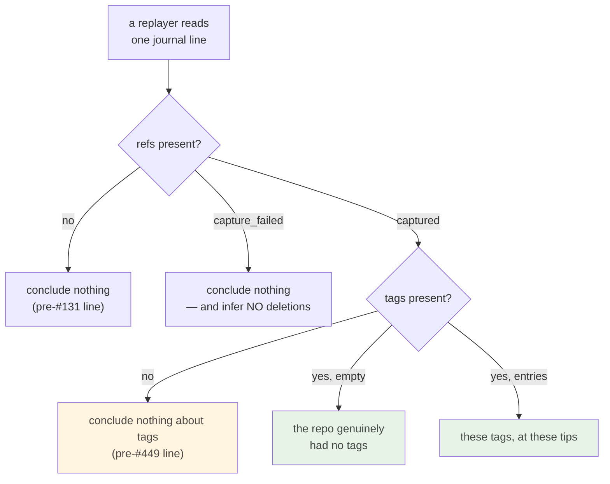

# CLOUD-1 handoff — #449 design: what `capture_refs` must record

- **Date:** 2026-08-23
- **Status:** Design complete, ready for review. **No production code changed.**
- **Issue:** [#449](https://github.com/tom2025b/git-vista/issues/449) — the #131 snapshot
  records branches only; the #136 scrubber replays from exactly this data.
- **Branch:** `claude/capture-refs-design-2fj9i6`
- **Session:** cloud (CLOUD-1). Fresh container, fresh clone at `22a7b17`.
- **Sequencing:** #449 is gated on M4 closing. This document is the design that lands first;
  the implementation is a separate, later branch.

## What this session actually did

Read the source, then **verified the load-bearing claims by running code** rather than
reasoning about them. Two probes, both executed here, both reproduced below with their real
output:

1. A standalone serde crate holding the proposed wire shape side by side with today's, to
   settle forward/backward journal compatibility (§ Evidence A).
2. A temporary test inside `crates/git-vista-git/src/refs.rs` that asks `gix` what it
   actually returns for HEAD in five repository states (§ Evidence B). **The probe has been
   reverted; `git status` is clean.**

Probe 2 found something the design would otherwise have got wrong, and a pre-existing
inconsistency nobody has filed (§ Findings).

Every file:line citation below was opened in this session. Nothing is quoted from memory.

## The gap, restated against source

`capture_refs` (`crates/git-vista-server/src/journal.rs:61-88`) reads every ref via
`read_refs`, then throws most of them away at `journal.rs:72`:

```rust
.filter(|r| r.kind == RefKind::Branch)
```

`RefKind` has four members — `Head`, `Branch`, `RemoteBranch`, `Tag`
(`crates/git-vista-core/src/model.rs:80-85`). Three are discarded. So the per-event snapshot
whose own doc comment (`crates/git-vista-core/src/activity.rs:124-128`) says it exists so a
"future time scrubber can replay history *losslessly*" cannot replay:

- **HEAD** — the one thing "watch the HEAD move" needs;
- **tags**;
- **remote-tracking refs** — so no ahead/behind story over time.

The fill-in happens once, centrally, in `append` (`journal.rs:108`), so fixing `capture_refs`
fixes every write endpoint at once. That is the good news: the blast radius is one function
plus its type.

## Design

### D1 — Shape: add siblings to `Captured`, never reshape it

`RefsAtEvent` (`crates/git-vista-core/src/activity.rs:154-173`) is an internally-tagged enum
(`#[serde(tag = "status", rename_all = "snake_case")]`) with `Captured { branches,
truncated_at }` and `CaptureFailed { reason }`.

**Decision: `branches` and `truncated_at` keep their names, positions and meanings exactly.
Everything new is an additional optional field.** The journal is append-only; a line written
last month must keep meaning what it meant when it was written. Renaming `branches` to a
uniform `refs` map would silently reinterpret every existing line.

```rust
#[derive(Debug, Clone, PartialEq, Eq, Serialize, Deserialize)]
#[serde(tag = "at", rename_all = "snake_case")]
pub enum HeadAtEvent {
    /// HEAD is symbolic and resolves: the full ref name it names, plus the commit.
    OnBranch { symbolic: String, oid: String },
    /// Detached and resolving: a commit, and deliberately no name.
    Detached { oid: String },
    /// Symbolic, pointing at a ref that has no commit yet (a fresh repo, a new
    /// orphan branch). A name with nothing behind it — not a branch at zero.
    Unborn { symbolic: String },
    /// Neither a name nor a commit. Reachable (Evidence B, case 4); recorded
    /// rather than smoothed into one of the three above.
    Unresolvable,
}

/// A captured ref map plus its own truncation count, so one kind overflowing
/// can never be mistaken for another kind's completeness.
#[derive(Debug, Clone, PartialEq, Eq, Serialize, Deserialize)]
pub struct CapturedRefs {
    pub entries: BTreeMap<String, String>,
    #[serde(default, skip_serializing_if = "Option::is_none")]
    pub truncated_at: Option<usize>,
}

pub enum RefsAtEvent {
    Captured {
        branches: BTreeMap<String, String>,          // unchanged
        #[serde(default, skip_serializing_if = "Option::is_none")]
        truncated_at: Option<usize>,                 // unchanged: branches' count
        #[serde(default, skip_serializing_if = "Option::is_none")]
        head: Option<HeadAtEvent>,                   // None = not recorded
        #[serde(default, skip_serializing_if = "Option::is_none")]
        tags: Option<CapturedRefs>,                  // None = not recorded
        #[serde(default, skip_serializing_if = "Option::is_none")]
        remotes: Option<CapturedRefs>,               // None = not recorded
    },
    CaptureFailed { reason: String },
}
```

The wire shape below is **printed by a real `serde_json` round-trip run in this session**, not
hand-written (Evidence A):

```json
{
  "status": "captured",
  "branches": { "feature": "b2", "main": "a1" },
  "head": { "at": "on_branch", "symbolic": "refs/heads/main", "oid": "a1" },
  "tags": { "entries": { "v1.0": "c3" } },
  "remotes": { "entries": { "origin/main": "a1" } }
}
```

and the three other HEAD states serialize as
`{"at":"detached","oid":"a1"}`, `{"at":"unborn","symbolic":"refs/heads/main"}`,
`{"at":"unresolvable"}`.

**Cost of D1, stated plainly:** the shape is asymmetric — `branches` is a bare map with a
sibling `truncated_at`, while `tags` and `remotes` are `CapturedRefs`. That is ugly, and it is
the price of not rewriting the meaning of lines already on disk. Uniformity is available only
by breaking them.

### D2 — The three-state honesty is a property of *every* field, not just the enum

This is the part it would be easiest to get wrong, so it is stated as the governing rule:

> A new field must distinguish **"not recorded"** from **"recorded as empty"**, or it
> reintroduces at the field level exactly the defect `RefsAtEvent` exists to prevent at the
> record level.

`RefsAtEvent`'s own doc comment (`activity.rs:138-153`) spends fifteen lines on why an empty
map must never stand in for a failed read. If `tags` were declared `BTreeMap<String, String>`
with `#[serde(default)]`, then **every journal line written before #449 would deserialize as a
confident observation that the repository had zero tags** — a claim never made, produced by
the least informative line available. That is the same failure, one level down.

This is not a hypothetical. Evidence A includes a test that instantiates the rejected shape and
watches it lie:

```
test tests::the_rejected_bare_map_shape_would_have_lied ... ok
```

Hence `Option<CapturedRefs>` and `Option<HeadAtEvent>`: `None` means *this line predates the
field*, and a replayer must conclude nothing from it.



### D3 — HEAD is an enum of four states, and all four are reachable

The issue asks for "symbolic target + resolved oid". Recording that as two independent
`Option`s would be the flag-pair shape ADR 0068 was written against: four combinations, a
reader who must remember which are possible, and a renderer free to assert a fact the data
never carried. An enum makes the four states total and named.

Evidence B ran all four against real repositories:

| repo state | `head_symbolic_full` | `resolved_head` | variant |
|---|---|---|---|
| `git init -b main`, no commits | `Some("refs/heads/main")` | `None` | `Unborn` |
| on `main` with commits | `Some("refs/heads/main")` | `Some(31c429a5…)` | `OnBranch` |
| `checkout --detach HEAD~1` | `None` | `Some(8c99b27d…)` | `Detached` |
| `.git/HEAD` = a nonexistent oid | `None` | `None` | `Unresolvable` |

The fourth row is why `Unresolvable` exists. Before running the probe this design had three
variants and would have had to force a broken HEAD into `Detached { oid }` with no oid to put
there.

`symbolic` is stored **full** (`refs/heads/main`), matching `HistoryMaterials::head_symbolic_full`
(`crates/git-vista-git/src/refs.rs:108`), not shortened. A symbolic ref names a full ref path,
and a short name would collide with a same-named tag.

### D4 — Tags are recorded peeled, and the loss is recorded too

`read_refs` peels every ref to a commit (`crates/git-vista-git/src/refs.rs:76`). Evidence B
confirms an annotated tag's own object id differs from the commit it peels to:

```
git rev-parse annot          -> 16963f83116bb0a8ce4a6879c70e8467af451049   (tag object)
git rev-parse annot^{commit} -> 31c429a5a17c570ad624e23b6068ca31598bbc26   (the commit)
```

**Decision: record the peeled commit.** It is what the graph badges, what #136 replays, and
what keeps the capture consistent with every other ref reader in the app.

**The loss, stated so nobody rediscovers it as a bug:** in the capture, a lightweight tag and
an annotated tag on the same commit are indistinguishable, and the tag object's own id is not
recoverable. A replay can show *that* `v1.0` pointed at commit X; it cannot show the tag's
message or tagger. If #136 ever needs that, it is a follow-up that adds a field — not a reason
to store unpeeled ids now and make every consumer peel.

### D5 — Remote-tracking refs: **capture them**, in their own map

The issue requires this decided deliberately either way. **Decision: capture.**

- The teaching story #136 exists to tell is largely *divergence* — "your branch moved, origin
  did not". Local branches alone cannot tell it. Dropping remotes would leave the scrubber
  able to replay only half of the thing it is for, and the journal is append-only: the half
  not captured today is unrecoverable tomorrow.
- `read_refs` already reads them and already skips `refs/remotes/<remote>/HEAD`
  (`crates/git-vista-git/src/refs.rs:67`), so the symbolic default-branch pointer stays out for
  free.
- The cost is bytes, and bytes are bounded by D6.

They go in their **own** map rather than being merged with branches: a fork of a busy upstream
can hold hundreds of remote-tracking refs, and merged into one map under one cap they would
evict the local branches — the data of record — to make room for refs that change rarely.
Separate maps also remove short-name collisions between a branch and a tag of the same name.

### D6 — One cap, applied per map

`REFS_PER_EVENT_CAP = 500` (`crates/git-vista-core/src/activity.rs:179`) stays 500 and is
applied **independently to each of the three maps**, each carrying its own `truncated_at`.
Branches keep exactly the guarantee they have today; no other kind can shrink it.

Worst case: 1500 entries × ~60 bytes ≈ **90 KB for one event**. Typical repo (10 branches, 30
tags, 20 remotes) ≈ **3.5 KB**, against roughly 1 KB today. The cap is a bound, not a
forecast — but see the read-path finding in § Findings before treating 90 KB as free.

### D7 — Read HEAD and refs from one open, via one shared pass

`read_refs` cannot supply HEAD's symbolic target: it emits HEAD only as a `RefKind::Head` badge
with a resolved oid and no name (`crates/git-vista-git/src/refs.rs:31-39`).
`read_history_materials` (`refs.rs:126-226`) already returns everything #449 needs —
`head_symbolic_full`, `head_branch`, `resolved_head`, and every classified ref — from a single
`gix` open, so all of it describes one moment.

Two things stop this from being a one-line swap:

1. `read_history_materials` also reads `$GIT_DIR/shallow` and treats malformed shallow metadata
   as a hard `RepoError` (`refs.rs:210-214`). Calling it from `capture_refs` would make a
   corrupt shallow file turn every event's capture into `CaptureFailed` for a reason that has
   nothing to do with refs.
2. The classification loop is already duplicated **verbatim** between `refs.rs:60-74` and
   `refs.rs:171-182`. Adding a third copy for #449 is how a codebase ends up with three ref
   readers that disagree — and Evidence B shows two of them already do (§ Findings).

**Decision: extract the shared body, do not add a third reader.** A new
`read_refs_at(path) -> Result<RefsAt, RepoError>` returns refs + the three HEAD facts and
nothing else; `read_history_materials` calls it and adds shallow; `read_refs` calls it and
returns just the `Vec<GitRef>`; `capture_refs` calls it directly. One classification pass, one
`gix` open per caller, no shallow coupling in the journal path.

This is a refactor inside `git-vista-git` with no behaviour change of its own, and it should
land as its **own commit** ahead of the #449 commit so a bisect can separate them.

## Alternatives considered, and why they lost

**Replace `branches` with one uniform `refs: BTreeMap<full_ref_name, oid>`.**
Genuinely attractive: one map, no kind asymmetry, full names so `v1.0`-the-tag and
`v1.0`-the-branch cannot collide, and #136 could iterate one structure. **Rejected because the
journal is append-only.** Every line already on disk has `branches`; under a rename they
either vanish or need a compatibility alias, and an alias means the "uniform" shape has a
second spelling anyway. It also destroys the free by-kind partition a replayer wants (draw
branch labels, draw tag badges) and has no place at all for HEAD's symbolic-ness.

**Bare maps with `#[serde(default)]` instead of `Option<CapturedRefs>`.**
Less nesting, less noise in the JSON. **Rejected because it lies about every pre-#449 line** —
see D2, and the test in Evidence A that watches it happen.

**Two `Option<String>`s for HEAD instead of an enum.**
Simplest possible diff. **Rejected under ADR 0068**: it is the deletion-flags shape, where the
four combinations are implicit and a consumer is free to render a fact the data never carried.
The probe's fourth row (both `None`) is precisely the combination such a consumer would
mis-render.

**Skip remote-tracking refs; capture HEAD and tags only.**
Tempting on size, and remotes only move on fetch. **Rejected because it fails the same test
#449 itself applies to the status quo:** the journal is append-only, so "add it later" means
the divergence story is missing from exactly the history the scrubber will be asked to show
first. The size objection is answered by per-map caps, not by dropping the data.

**One shared 500-entry budget across all three maps, filled branches-first.**
Bounds the worst case at today's number. **Rejected because truncation becomes order-dependent
and hard to read**: whether tags were truncated would depend on how many branches happened to
exist, and a single `truncated_at` could not say which kind lost entries. Three independent
caps make each map's honesty self-contained.

**Extend `refs.json` (the snapshot) to match.**
**Rejected as out of scope**: the snapshot's only job is noticing local-branch deletions that
happened outside the app (`crates/git-vista-server/src/activity.rs:86-120`). Nothing about
HEAD or tags serves that job, and widening it would add a second, differently-shaped ref
record to keep in sync.

## Call sites that must change

| file:line | what | why |
|---|---|---|
| `crates/git-vista-core/src/activity.rs:154-173` | add `head`/`tags`/`remotes` to `Captured`; add `HeadAtEvent`, `CapturedRefs` | the shape |
| `crates/git-vista-core/src/activity.rs:138-153` | extend the doc-comment table to cover the new per-field third state | the table *is* the contract |
| `crates/git-vista-core/src/activity.rs:179` | `REFS_PER_EVENT_CAP` doc: "per map", and the new worst case | it no longer means what it says |
| `crates/git-vista-git/src/refs.rs:21-226` | extract `read_refs_at`; both existing readers call it (D7) | one classification pass |
| `crates/git-vista-server/src/journal.rs:61-88` | `capture_refs` reads via `read_refs_at`, partitions by kind, caps each map | the fix |
| `crates/git-vista-server/src/activity.rs:106-112` | synthesized external-deletion event sets `head`/`tags`/`remotes` to **`None`** | it reconstructs a past moment from a branches-only snapshot; it genuinely does not know the rest, and attaching the live present would be a new lie |
| `crates/git-vista-server/src/journal.rs:392-414` | `a_caller_supplied_capture_is_never_overwritten` constructs `Captured { .. }` literally — will not compile | mechanical |

`crates/git-vista/src/api/activity.rs:19-31` needs **no** change: the frontend deserializes the
same `git-vista-core` type, so wire and type move together.

## Test plan — every claim mutation-proven two ways

House convention: a `/// MUTATION:` line per test naming the specific edit that turns it red
(82 such tests exist today). Per the standing rule, each claim below is pinned by two mutations
that fail differently — one that removes the mechanism, one that keeps it but corrupts it.

1. **HEAD on a branch is captured with both halves.**
   M-a: drop the `head` fill-in → red on `head == None`.
   M-b: record `OnBranch { symbolic: head_branch }` (short) instead of the full name → red on
   the exact-string assertion. *(This mutation is why the assertion must compare the full
   string, not `.contains("main")`.)*
2. **Detached HEAD records `Detached`, not a fabricated name.**
   M-a: map a `None` symbolic to `OnBranch { symbolic: "HEAD" }` → red.
   M-b: fall through to `Unresolvable` when the oid is present → red.
3. **Unborn HEAD records `Unborn` and empty branches** (strengthens the existing
   `a_repo_with_no_branches_captures_an_empty_map_not_a_failure`, `journal.rs:367`).
   M-a: treat a `None` resolved head as `CaptureFailed` → red.
   M-b: treat it as `Unresolvable`, discarding the symbolic name → red.
4. **A broken HEAD records `Unresolvable` while the rest of the capture survives.**
   M-a: `panic!`/`CaptureFailed` on the both-`None` case → red.
   M-b: collapse it into `Detached { oid: String::new() }` → red on the empty oid.
5. **Tags are captured, peeled, and both tag flavours land.** Fixture: one lightweight, one
   annotated, asserting the annotated tag's recorded value equals `git rev-parse annot^{commit}`
   and **not** `git rev-parse annot`.
   M-a: drop `RefKind::Tag` from the partition → red.
   M-b: record the unpeeled id → red on the second assertion.
6. **Absent ≠ empty, at field level.** A hand-written pre-#449 journal line parses with
   `tags == None` and `remotes == None`; a real repo with no tags captures `Some(empty)`.
   M-a: change `Option<CapturedRefs>` to a `#[serde(default)]` bare map → red on the first
   half. M-b: emit `None` for a genuinely tagless repo → red on the second.
   **This is the test that pins D2, and the one most worth writing first.**
7. **Remote-tracking refs are captured, and `origin/HEAD` is not.** Fixture with a real
   `git clone` (so `refs/remotes/origin/HEAD` exists).
   M-a: drop `RefKind::RemoteBranch` → red. M-b: remove the `/HEAD` skip at `refs.rs:67` → red
   on the exclusion assertion.
8. **Caps are per map.** 501 tags plus 2 branches: `tags.truncated_at == Some(501)`,
   `branches.len() == 2`, `branches`' `truncated_at == None`.
   M-a: share one budget across maps → red (branches evicted).
   M-b: cap without setting `truncated_at` → red (the silent-truncation defect the cap comment
   at `activity.rs:162-168` names).
9. **The lossless promise extends to the new kinds** — mirroring
   `a_deleted_branch_survives_in_the_event_that_predates_its_deletion` (`journal.rs:304`):
   journal an event, then `git tag -d`, and the tag is still in that event's capture.
   M-a: have the replay read live refs → red. M-b: capture after the mutation instead of
   before → red.
10. **`CaptureFailed` still wins over a partial capture.** The existing test at `journal.rs:342`
    must keep passing unchanged — no head-only or tags-only partial record.

**A caution for whoever writes these** (the standing rule about green tests that prove
nothing): tests 1–4 must assert against `git rev-parse` / `git symbolic-ref` output taken from
the fixture, never against a second call to the capture code. Asserting `capture_refs()` agrees
with `capture_refs()` is the "assert a mapping by calling the function that defines it" trap.

## Findings discovered while verifying

**F1 — `read_refs` and `read_history_materials` disagree about a dangling HEAD.**
Evidence B, case 4 (`.git/HEAD` containing an oid no object matches):

```
PROBE dangling_detached: symbolic=None branch=None resolved=None refs_kinds=[]
PROBE dangling_detached read_refs: ["Head:HEAD"]
```

`read_refs` emits a HEAD badge — `repo.head()` hands back the raw unvalidated oid at
`refs.rs:31-38` — while `read_history_materials` emits nothing, because `repo.head_id()`
(`refs.rs:140`) refuses to resolve it. Two readers, same repository, different answers about
whether HEAD exists. Nothing in #449 depends on which is right, and D7's shared pass would
force the question to be answered once. **Recommend filing separately**; do not let it grow
this issue.

**F2 — `read_all` reads the entire journal on every feed request.**
`journal.rs:142` is `std::fs::read_to_string(&path)` over the whole file; the
`JOURNAL_READ_CAP = 1_000` window (`journal.rs:33`, applied at `journal.rs:146`) is taken
*after* the read. That is already unbounded; #449 multiplies the per-line payload by roughly
three (D6). At 10,000 events a typical repo goes from ~10 MB to ~35 MB read and parsed on
every `/api/activity` call. **This is not a reason to shrink the capture** — it is a reason to
make `read_all` a tail read. **Recommend filing separately, before #449 lands**, so the
capture change does not get blamed for a latency regression that predates it.

**F3 — the issue's empirical census could not be re-checked here.** #449 cites a 4-event
journal on Tom's box with `refs` absent in all. This container has no `.git/git-vista/`
directory at all (fresh clone), so that census is carried forward as the issue's claim, not as
something re-verified. It does not affect any decision above: every one of them holds whether
or not history exists to protect.

## Out of scope, deliberately

- `refs.json` (the deletion-detection snapshot) — see the rejected alternative.
- Tag messages / taggers / unpeeled tag-object ids — D4.
- Stash refs, notes, worktree-private refs, `refs/replace` — `read_refs` skips them
  (`refs.rs:73`) and the scrubber has no story for them. Excluded by inheritance, not by
  oversight; if that is wrong, it is a separate decision.
- Any change to #136's viewer. This design only makes the data exist.

## For Tom — decisions to confirm before implementation

1. **D5 (capture remote-tracking refs).** The issue demanded a deliberate call; this is it, and
   it is the one with a real size cost. Confirm or overturn.
2. **D6 worst case.** 90 KB for a single event in a pathological repo (1500 refs). Acceptable
   as a bound, or should tags/remotes get a smaller cap than branches?
3. **D7's refactor landing as its own commit** ahead of the feature commit.
4. **F1 and F2 as separate issues** — happy to open both, not opened yet.
5. **Where this document lives.** `/design-docs/` is ignored (`.gitignore:71`, "session
   artifacts, not product docs"). A cloud session has no local disk that outlives the
   container, so an untracked handoff would simply not exist for the next session — this file
   is therefore `git add -f`'d, following the precedent of `ed9a18d` ("bank the map phase's
   drafts before the network drops"), which did the same for
   `design-docs/2026-08-18-wf-78-map-results.md`. The ignore rule itself is unchanged. If you
   would rather this be a product doc, `git mv` it to
   `docs/superpowers/specs/2026-08-23-449-capture-refs-design.md` — nothing in it depends on
   the location.

## ADR to write with the implementation

`docs/adr/0070-*.md` (0069 is the highest today), recording D2, D4 and D5 — the three
decisions a later reader would otherwise re-litigate. Per ADR 0031 it must carry the
alternatives and why they lost; the § Alternatives section above is drafted to be moved there
largely intact. Suggested title, in the house's sentence style:

> **0070 — A ref capture says which kinds it recorded, and stays silent about the rest**

## Evidence

### Evidence A — journal compatibility, both directions

Standalone crate (`serde 1.0.229`, `serde_json 1.0.151`), the proposed enum beside today's:

```
running 4 tests
test tests::old_line_parses_new_shape_as_not_recorded ... ok
test tests::new_line_still_parses_in_the_old_shape ... ok
test tests::print_the_wire_shape ... ok
test tests::the_rejected_bare_map_shape_would_have_lied ... ok
test result: ok. 4 passed; 0 failed
```

- **Backward:** `{"status":"captured","branches":{"main":"aaa"}}` parses into the new shape with
  `head`, `tags`, `remotes` all `None`. Old lines keep their exact meaning.
- **Forward:** a line written by the new shape parses in the old one — serde ignores the
  unknown fields (no `deny_unknown_fields` anywhere on these types, checked). A journal
  outlives the binary that wrote it; this matters when a branch is bisected across the change.
- **The rejected shape:** the same old line, read through a `#[serde(default)]` bare map,
  yields a confident empty tag set. D2's defect, reproduced.

### Evidence B — what `gix` really returns for HEAD

Temporary test in `crates/git-vista-git/src/refs.rs` against `gix =0.84.0`, five real
repositories, run once and reverted:

```
PROBE unborn:             symbolic=Some("refs/heads/main") branch=Some("main") resolved=None            refs=[]
PROBE on_branch:          symbolic=Some("refs/heads/main") branch=Some("main") resolved=Some(31c429a5…) refs=[Head:HEAD, Branch:feature, Branch:main, Tag:annot, Tag:light]
PROBE detached:           symbolic=None                    branch=None         resolved=Some(8c99b27d…) refs=[Head:HEAD, Branch:feature, Branch:main, Tag:annot, Tag:light]
PROBE dangling_detached:  symbolic=None                    branch=None         resolved=None            refs=[]        (read_refs disagrees — F1)
PROBE garbage_head:       ERR could not open a git repository …                                          (→ CaptureFailed)
PROBE annot rev-parse:    16963f83…  (tag object)   31c429a5…  (peeled commit)
```

`garbage_head` reproduces the existing `an_unreadable_repo_records_capture_failed_never_an_empty_map`
test (`journal.rs:342`) and confirms it reaches `CaptureFailed` through `gix`'s *open* failure,
not a ref-listing failure — worth knowing, because D7 must not accidentally make that path
succeed with an empty capture.
