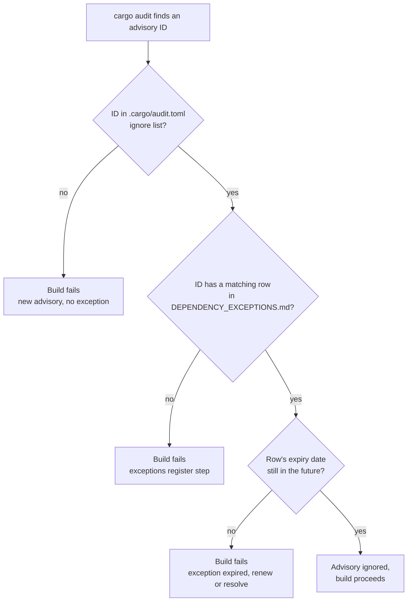

# Dependency exceptions register

`cargo audit` runs as its own CI check (see `.github/workflows/ci.yml`) and is
configured to fail the build on any advisory — including "unmaintained"
warnings, not just CVSS-scored vulnerabilities (`--deny warnings`, see the
audit job). An accepted exception does not mean "ignore forever": it means
"ignore until the date below," after which the build fails again unless the
row is renewed with a fresh look and a new expiry.

## How this stays in sync with `.cargo/audit.toml`

`.cargo/audit.toml`'s `[advisories].ignore` list is the mechanism cargo-audit
actually reads. This file is the human-readable record of *why* each entry
exists, who owns it, and when it expires — cargo-audit's config format has no
concept of expiry. The two files are kept in sync **by hand**, entry for
entry, and the CI job enforces that "by hand" doesn't quietly turn into
"drifted":

- The "Dependency exceptions register" step in `.github/workflows/ci.yml`
  parses both files, fails if an advisory ID appears in one but not the
  other, and fails if any row's expiry date has passed (regardless of what
  `.cargo/audit.toml` still says — an expired row fails the build even though
  the config file still lists it as ignored, until someone removes it or
  renews the date in both places).

## Current exceptions

As of 2026-07-27, `cargo audit` against this workspace's `Cargo.lock` (325
crate dependencies) finds **no CVSS-scored vulnerabilities** — only three
"unmaintained" informational warnings, all transitive dependencies of
`leptos` 0.6.15 (the frontend framework), pulled in via its proc-macro chain.
None are reachable from attacker input independent of the crates they ship
in; they are listed because `--deny warnings` treats "unmaintained" as build
-failing, not because a vulnerability was found.

| Advisory ID | Crate | Why accepted | Owner | Expiry |
| --- | --- | --- | --- | --- |
| [RUSTSEC-2024-0436](https://rustsec.org/advisories/RUSTSEC-2024-0436) | `paste` 1.0.15 | Unmaintained-crate notice, not a vulnerability. Transitive dep of `leptos` 0.6.15 via `leptos_dom`/`leptos_reactive`; no direct fix exists short of a `leptos` major-version upgrade, which is a bigger decision than this task's scope. | Tom | 2026-10-27 |
| [RUSTSEC-2024-0370](https://rustsec.org/advisories/RUSTSEC-2024-0370) | `proc-macro-error` 1.0.4 | Unmaintained-crate notice. Transitive dep of `leptos` 0.6.15 via `syn_derive` → `rstml` → `leptos_hot_reload`/`leptos_macro`. | Tom | 2026-10-27 |
| [RUSTSEC-2026-0173](https://rustsec.org/advisories/RUSTSEC-2026-0173) | `proc-macro-error2` 2.0.1 | Unmaintained-crate notice. Transitive dep of `leptos` 0.6.15 via `leptos_macro`. | Tom | 2026-10-27 |

The 90-day expiry (2026-10-27) is a re-look date, not a promise the crates
will have moved by then — it exists so the build re-raises the question
instead of a `[advisories].ignore` entry silently outliving anyone's memory
of why it's there. Renewing past that date requires an owner to actually
re-check `cargo audit`'s output and either extend the date with a reason or
resolve the upgrade.

## Adding a new exception

1. Confirm with `cargo audit` (or the CI job's failure output) which advisory
   ID needs an exception, and why it's genuinely acceptable to defer rather
   than fix now.
2. Add the ID to `.cargo/audit.toml`'s `ignore` list.
3. Add a matching row here: advisory ID, affected crate, the reason, an
   owner (a person, not a team), and an expiry date. No exception ships
   without an expiry — an exception without one is a permanent hole with
   paperwork.
4. Both files must be part of the same commit; the CI cross-check will fail
   the PR otherwise.

---

**Signed:** thomas2010 · 2026-07-27T20:51:16-04:00
