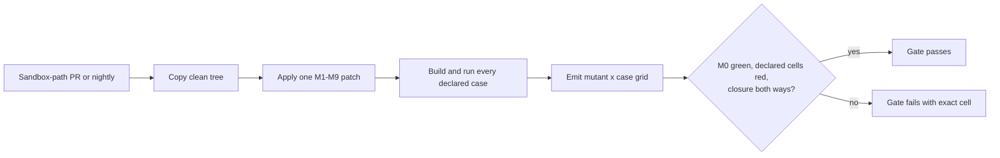

# Release gates for git-vista

What must be green before a release, which mechanism enforces each, and —
honestly — which are currently unenforced. Written for issue #67, whose
acceptance criteria are audited item by item below against what the
repository actually does today, not what it is supposed to do.

**The single most important sentence in this document**: every check below
runs and reports correctly. None of them can stop a merge. There is no
branch protection and no ruleset on `main` — verified directly (see Part 2)
— so a pull request whose CI is fully red can be merged today, and two
`--admin`-style overrides earlier in this project's history are the reason
this was checked rather than assumed. Three tasks (#67 M1.14's own CI work)
built gates that, as of this writing, gate nothing by themselves.

## Part 1 — every #67 criterion audited against reality

Issue #67's acceptance criteria, verified individually. Evidence, not
inference — every claim below was checked directly against the current
`main` branch (`26625bc`) rather than assumed from a task brief, including
the orchestrator's own summaries, which have contained errors in three of
the last four tasks (see the "corrections" callouts).

### 1. "Formatting, clippy, workspace tests, WASM build, audit, protocol
compatibility, route authorization, fixture compatibility, and secret
scanning run in CI"

**Which checks run on a pull request, verified from the `on:` trigger, not
inferred from job names:**

```yaml
on:
  push:
    branches: [main]
  pull_request:
    branches: [main]
```

Both events are configured, and they apply to the whole workflow — all six
jobs (`lint`, `core`, `contract`, `frontend`, `audit`, `secrets`) run on
**both** a direct push to `main` and any pull request targeting `main`.
There is no job-level `if:` restricting any of the six to one trigger or
the other — confirmed by reading every job in `ci.yml`, not just the header
comment.

Item-by-item:

| Named check | Runs in CI? | Where |
| --- | --- | --- |
| Formatting | Yes | `lint` job, `cargo fmt --all -- --check` |
| Clippy | Yes | `lint` job, native + wasm32, `-D warnings` |
| Workspace tests | Yes, **but not literally `--workspace`** | `core` job runs `cargo test -p git-vista-core -p git-vista-git -p git-vista-protocol -p git-vista-server -p git-vista` — every workspace member is now named explicitly (fixed in PR #164, task 6), but the invocation is an enumerated `-p` list, not the `--workspace` flag. A sixth crate added to `Cargo.toml` without also being added to this line silently would not run in CI, the same class of gap task 6 found and closed for `git-vista-protocol`. Flagging as a standing risk, not a new one to fix here — see the closure checklist. |
| WASM build | Yes | `frontend` job, real Trunk build |
| Audit (`cargo audit`) | Yes | `audit` job, `--deny warnings`, cross-checked against `docs/DEPENDENCY_EXCEPTIONS.md` |
| Protocol compatibility | Yes, and it is a **distinct** concern from fixture compatibility (see below) | `version.rs`'s 15 unit tests (`check_compatibility`, the `[min, max]` window, header parsing) — part of the `core` job now that `-p git-vista-protocol` is in its test list |
| Route authorization | Yes | `contract` job, `route_authz` (3 tests: every route classified, no stale entries, the `Unauthenticated` allowlist pinned) |
| Fixture compatibility | Yes | `core` job: `history_golden.rs` (2 tests), `plan_golden.rs` (2 tests), `dto_golden.rs` (1 test) — all newly wired into CI by task 6; **not fully complete**, see the gap noted under criterion 3 below |
| Secret scanning | Yes | `secrets` job, `gitleaks`, full history, pinned binary |

**Correction to the brief**: issue #67 lists "protocol compatibility" and
"fixture compatibility" as two separate bullets. Task 6 established this is
correct, not redundant phrasing — `version.rs`'s `check_compatibility`
(does the client and server agree which wire-protocol *version* they
speak) is orthogonal to whether a given version's DTO *shapes* have
silently drifted (the golden fixtures). Both are now exercised in CI, as
two genuinely different mechanisms, not one check counted twice.

### 2. "Failures block release"

**Not met. Verified directly** — see Part 2 in full. No branch protection,
no ruleset, on `main`.

### 3. "Malicious Origin, Host, path, and clone inputs are tested"

Checked each of the four named classes individually against the actual
test suite, not assumed from the presence of `security.rs`/`middleware.rs`/
`argv_boundary.rs`:

| Input class | Tested? | Evidence |
| --- | --- | --- |
| Origin | Yes | `security.rs`: `origin_must_be_same_origin_and_not_null`, `lan_origin_must_match_the_pinned_ip_and_not_be_null`, `a_cross_origin_or_null_origin_is_403` (wire-level, through the real middleware) |
| Host | Yes | `security.rs`: `loopback_hosts_pass_and_others_fail`, `lan_host_pins_to_the_exact_ip_and_port`, `a_bad_host_is_403_before_anything_else` (wire-level) |
| Clone (URL) | Yes | `argv_boundary.rs`: `hostile_clone_urls_are_refused_by_the_gate` (9 hostile shapes: `file://`, `ssh://`, `ext::`, option-smuggling, whitespace-splitting), `hostile_clone_urls_die_at_the_boundary` (wire-level, through real auth/CSRF) |
| **Path** | **No, at the time of this audit — closed in M1.14 task 8** | Real defensive code exists (`catalog.rs`'s canonicalize-and-contain check for the allowed-roots gate, `state.rs`'s equivalent for the delete-clone containment check), and `catalog.rs` has tests for it — `register_fails_closed_outside_the_allowed_roots`, `register_fails_closed_on_a_symlink_escaping_the_allowed_root` — **but those exercise server-side catalog registration (operator-controlled allowed roots at startup), not a client-reachable path input.** The one endpoint that takes a client-supplied path-shaped string on the wire, `GET /api/file/{id}/{*path}` (`file_at_commit`), passes it straight into a `git show <id>:<path>` **tree-relative** spec — not a filesystem path, so a `../` segment is almost certainly harmless (git resolves it against the commit's tree object, not the filesystem) — but there is **no test proving that**, adversarial or otherwise, for this specific client-facing endpoint. Grepped `handlers/read.rs` for any malicious/traversal-named test against `file_at_commit`: none found. This is exactly the class of "assumed safe, never verified" gap this audit exists to catch. **Named here; a twelve-test battery closing it landed in M1.14 task 8 — see the closure checklist below and `pro-result.md` for that task.** |

### 4. "Supported Git and Safari versions are documented"

**Met.** `docs/SUPPORTED_VERSIONS.md` documents both with derived reasoning
(not asserted numbers), and — since task 6 — the Git floor is now also
*enforced* in CI (`core` job, "Git version meets the documented floor"),
which is more than this bullet strictly asks for for. Safari's floor
remains documentation-only, which the doc itself already states honestly
("no CI job or manual test matrix currently pins or verifies a minimum
Safari version" — correct, unchanged, not a gap introduced by this audit).

### 5. "Dependency exceptions have owners and expiration dates"

**Met**, and the expiry is genuinely enforced, not just documented.
`docs/DEPENDENCY_EXCEPTIONS.md`'s three rows (`paste`, `proc-macro-error`,
`proc-macro-error2`) each carry an owner (`Tom`) and an expiry
(`2026-10-27`). The `audit` job's "Dependency exceptions register is
honest" step cross-checks `.cargo/audit.toml`'s ignore list against this
file's rows in both directions and fails the build if any listed
exception's expiry has passed — verified by reading the step's script in
`ci.yml` directly, not assumed from the doc's own description of itself.

**What happens on 2026-10-27, precisely**: the expiry check compares
against `date.today()` at CI run time. The day the date passes, the
`audit` job's cross-check step starts failing every run
(`RUSTSEC-....: exception expired on 2026-10-27 (today is ...) — renew or
remove it from both files`) — for as long as the criterion above about
"failures block release" remains unmet, this means the check goes red and
stays red until a human notices and acts, exactly as advisory as every
other check on this list. **This is itself evidence for why Part 2
matters**: an expiry date is only a real deadline if the red check it
produces can't simply be merged past.

## Part 2 — the enforcement gap

### What is true today

Verified directly, not taken from any brief:

```
$ gh api repos/tom2025b/git-vista/branches/main/protection
{"message":"Branch not protected","documentation_url":"...","status":"404"}

$ gh api repos/tom2025b/git-vista/rulesets
[]

$ gh api repos/tom2025b/git-vista/rules/branches/main
[]
```

No branch protection, no rulesets, no active rules of any kind on `main`.
Every one of the six CI checks is purely informational: it reports a
status on the PR and on the commit, and nothing reads that status to
decide whether a merge or a push is allowed.

### The checkpointer interaction

**Correction to the brief, found by testing rather than reasoning about
it**: the brief's premise was that "the WIP series (auto-checkpoint 1..97)
went straight into `main`," violating the working agreement that every
change reaches `main` through a PR, and that this is what naive branch
protection would break. **Checked directly, and this does not match git
and GitHub's own history.**

```
$ git log origin/main --oneline | grep -i checkpoint
c9f11a3 wip(#66): auto-checkpoint 97
75212b8 feat(#63): Task 1 — checkpointable core topology layout (StreamLayout)
```

Only one genuine WIP-checkpoint commit is actually an ancestor of
`origin/main` today — `75212b8` is an unrelated feature-name match, not a
checkpoint commit. And that one commit did **not** arrive by a direct push:

```
$ gh api repos/tom2025b/git-vista/commits/c9f11a3/pulls --jq '.[].number'
161
```

`c9f11a3` is the tip commit of the branch `docs/adr-0021-durability-ordering`,
merged into `main` through PR #161 by a normal (non-squash) merge — which is
exactly the working agreement working as intended: a branch, a PR, a merge.
It shows up adjacent to the merge commit in a plain `git log --oneline`
(which interleaves by commit date across all parents), which is almost
certainly what produced the "went straight into main" read — but
`git log origin/main --first-parent --oneline | grep checkpoint` (the
strict direct-push-only mainline) returns **nothing**. No checkpoint commit
sits on `main`'s first-parent chain outside of a merge.

Widening the check past this one example: a random sample of 8 other
"auto-checkpoint" commits from `git log --all` (i.e., reachable from *some*
branch ref anywhere in the repo, not necessarily `main`) each show **zero**
associated pull requests — meaning those commits live on branches that
were never merged into `main` at all (abandoned mid-task branches,
consistent with "never delete a branch"), not that they bypassed a PR to
reach `main` directly. They are not part of `main`'s history and this
audit found no evidence that they ever were.

**What this means for the recommendation below**: the observed, current
behavior of the checkpointer — as it actually appears in this repository's
history — already goes through a branch and a PR every time it lands on
`main`. Standard branch protection (`required_pull_request_reviews`
absent, but `required_status_checks` + "require a pull request before
merging") would not have broken this specific, already-observed pattern.
**I could not verify this holds for every single checkpoint commit ever
made** — I sampled, I did not exhaustively check all ~90+ checkpoint
commits found via `--all` against `main`'s exact history at every point in
time, and GitHub's REST API does not expose "was this push event a direct
push or part of a merge" after the fact for arbitrary historical points
cheaply enough to do that exhaustively within this task's budget. Said
plainly rather than reasoning past it: this is tested-and-sampled, not
proven for all time.

**On the two `--admin` merges** mentioned in earlier task briefs (PRs
merged with red CI via an admin override): I could not find a read-only
`gh api` field that directly flags "this merge used an admin bypass" for a
specific historical PR without inspecting each PR's own check-run history
at merge time, which was out of this task's budget to do exhaustively.
Noted as unverified, not asserted — if this matters for the closure
decision, it is checkable per-PR via `gh pr checks --repo ... <PR#>`
compared against `gh pr view <PR#> --json mergedAt,mergeStateStatus`, just
not done here for the full history.

**Does required-status-check enforcement apply to direct pushes, or only
to merging PRs?** Reasoned about, not tested (creating a protection rule
to test it directly is exactly the forbidden action) — this is GitHub's
documented behavior: classic branch protection's "require status checks to
pass" applies to **both** a direct push to the protected branch and a PR
merge into it — a push whose associated commit hasn't reported a passing
status is rejected outright, no PR involved. "Require a pull request
before merging" is the **separate** setting that actually forbids direct
pushes entirely (aside from a bypass list) — without it, a checkpointer
(or anyone) can still push straight to a protected branch as long as
required checks eventually report green for that exact commit, which for a
freshly-pushed, never-CI'd commit means the push is rejected immediately
(no status yet) — so in practice, turning on required status checks with
no PR requirement would **still** break a direct-to-`main` checkpointer,
because a brand-new commit has no passing check the instant it's pushed.

**Are rulesets more selective here than classic protection?** Reasoned
about (same reason as above — cannot create one to test). Yes, in one way
that matters directly: a repository ruleset's rule set can be scoped by
condition, including targeting `~ALL` branches or specific ref patterns,
and critically its "required status checks" rule type can (per GitHub's
documented ruleset schema) apply independently of a separate "require
linear history"/"require PR" rule — meaning a ruleset *can* be configured
to require checks to pass without also blocking direct pushes, or to
require pushes to go through a PR without requiring specific checks, as
genuinely separable toggles rather than one bundled setting. Classic
protection's settings are less separable historically (though GitHub has
converged them over time). Rulesets also support a `bypass_actors` list —
specific apps, teams, or roles exempted from the rule — which is the
mechanism that would let a specific bot identity (if the checkpointer ever
did need to push directly) skip enforcement without disabling protection
for everyone else.

### Recommendation

**Given the corrected finding above — the checkpointer, as it actually
behaves today, already funnels through a branch and a PR — the "protect
main and move the checkpointer to a branch" framing in the brief was
solving a problem that the evidence doesn't show exists in its assumed
form.** That doesn't mean protection is free to turn on with no other
change:

- The real risk branch protection introduces is not the checkpointer's WIP
  commits (they already arrive via PR) — it's whatever workflow produced
  the "two `--admin` merges" this project's history reportedly contains.
  Standard required-status-checks protection is specifically designed to
  stop exactly that pattern, which is the entire point of #67's "failures
  block release" criterion. That is a feature of turning it on, not a cost
  to route around.
- **I agree with the brief's deeper instinct** — that the checkpointer
  should push to the current working branch, never `main` — as a matter of
  hygiene and defense in depth, even though current evidence says it isn't
  currently the live violation the brief assumed. A checkpointer that is
  *structurally* incapable of touching `main` is safer than one that
  merely happens not to right now, and it removes even the sampled-not-
  proven uncertainty above. This is a one-line change to the checkpointer
  script, and per the task's own scope note, **not mine to edit** —
  recommending it, not doing it.
- **My pick, if Tom wants one**: enable branch protection scoped with
  required status checks (all six CI job names) **and** "require a pull
  request before merging," with `enforce_admins` **on** (an admin bypass
  that only bypasses in exactly the situation `--admin` merges already
  used is not a fix, it's a formality) — the cost is that an admin merge
  during a genuine emergency needs an explicit, visible flag rather than
  quiet default behavior, which is exactly the point. Pair this
  ("required" rather than "left alone") with moving the checkpointer off
  `main` first, not because current evidence shows it's broken today, but
  because it removes the one scenario (a period where the main checkout's
  working directory happens to be `main` itself, e.g. during pure-research
  phases with "will branch before writing" not yet actioned) this audit
  could not fully rule out.

### Proposed configuration — NOT APPLIED

The exact `gh api` invocation Tom (or an account with admin rights) could
run. **Not executed by this task; read-only calls only were made above.**

```bash
gh api \
  --method PUT \
  repos/tom2025b/git-vista/branches/main/protection \
  -f 'required_status_checks[strict]=true' \
  -f 'required_status_checks[contexts][]=Lint (fmt + clippy)' \
  -f 'required_status_checks[contexts][]=Core (check + test)' \
  -f 'required_status_checks[contexts][]=M1.06 write contract + #67 route authorization (planner + argv boundary + staleness + route authz)' \
  -f 'required_status_checks[contexts][]=Frontend (Trunk / WASM)' \
  -f 'required_status_checks[contexts][]=Security audit (cargo audit)' \
  -f 'required_status_checks[contexts][]=Secret scanning (gitleaks)' \
  -F 'enforce_admins=true' \
  -f 'required_pull_request_reviews=null' \
  -F 'restrictions=null' \
  -F 'required_linear_history=false' \
  -F 'allow_force_pushes=false' \
  -F 'allow_deletions=false'
```

Each setting, one line each, with its cost:

| Setting | Effect | Cost |
| --- | --- | --- |
| `required_status_checks.strict = true` | A PR must be up to date with `main` before merging ("require branches to be up to date") | Occasionally forces a rebase/merge-from-main on a stale PR before it can land — friction, not breakage |
| `required_status_checks.contexts` (six names) | All six CI jobs must report success on the exact commit being merged | This *is* "failures block release" — the whole point. Cost: a genuinely red PR cannot merge without either fixing it or using the bypass below |
| `enforce_admins = true` | No bypass, including for repo admins, without explicitly disabling this setting first | Removes the quiet `--admin` merge path entirely — an emergency merge becomes a deliberate, visible act (toggle this off, merge, toggle back on), not a flag on the merge command |
| `required_pull_request_reviews = null` | No required review count/approval — solo-maintainer project, nothing to require | None — there is no second reviewer to require here |
| `restrictions = null` | No push-access restriction beyond normal repo permissions | None |
| `required_linear_history = false` | Merge commits stay allowed (matches current practice — normal merges, not squash-only) | None — this project already uses real merge commits, confirmed in Part 2 |
| `allow_force_pushes = false` | No force-push to `main`, from anyone | Matches the project's own standing "never force-push" rule — makes it structurally true instead of only a convention |
| `allow_deletions = false` | `main` itself cannot be deleted | Belt-and-braces, effectively free |

**Ruleset alternative**, if Tom prefers the newer mechanism (more
selective condition scoping, a `bypass_actors` list instead of a single
`enforce_admins` boolean) — a JSON body for `POST
repos/tom2025b/git-vista/rulesets`:

```json
{
  "name": "main-release-gates",
  "target": "branch",
  "enforcement": "active",
  "conditions": {
    "ref_name": { "include": ["refs/heads/main"], "exclude": [] }
  },
  "rules": [
    { "type": "deletion" },
    { "type": "non_fast_forward" },
    {
      "type": "required_status_checks",
      "parameters": {
        "strict_required_status_checks_policy": true,
        "required_status_checks": [
          { "context": "Lint (fmt + clippy)" },
          { "context": "Core (check + test)" },
          { "context": "M1.06 write contract + #67 route authorization (planner + argv boundary + staleness + route authz)" },
          { "context": "Frontend (Trunk / WASM)" },
          { "context": "Security audit (cargo audit)" },
          { "context": "Secret scanning (gitleaks)" }
        ]
      }
    }
  ],
  "bypass_actors": []
}
```

Same effect as the classic-protection call above, with two differences
worth knowing about: `bypass_actors` (empty here, matching
`enforce_admins=true`'s intent — no bypass) can later name a *specific*
bot/app identity if the checkpointer's own automation account ever needs a
narrow, audited exception without reopening the door for humans; and a
ruleset does not include a "require pull request before merging" rule type
in this body — that is a separate rule type (`pull_request`) that would
need to be added explicitly if Tom wants that on top of required checks
(not included here to keep this proposal to what directly answers "make
failures block release," letting the PR-requirement be a distinct decision
laid out below).

**Neither of the above has been run.** Applying either is Tom's call.

> **2026-07-31 — decision and extraction.** Tom chose the **ruleset** variant, for
> the `bypass_actors` reason specifically: this repo runs an automated checkpointer
> committing every 60 seconds, and if that automation ever needs to push to `main`,
> classic `enforce_admins=true` offers only "open the door for everyone" or "block
> the bot", while a ruleset can name that one identity and nothing else.
>
> The body above is now extracted verbatim to
> **`.github/main-release-gates.ruleset.json`** so it can be applied without
> copy-pasting out of prose:
>
> ```fish
> gh api -X POST repos/tom2025b/git-vista/rulesets --input .github/main-release-gates.ruleset.json
> ```
>
> **One deliberate difference from the JSON printed above: the extracted file lists
> SEVEN required checks, not six.** Both proposals in this document were written
> before the `sandbox` job existed, so applying either verbatim would have left
> `Sandbox (#66 escape-battery gate)` — the escape battery that M1.13b exists to
> build — merely advisory, which is the precise opposite of this document's purpose.
> `"Sandbox (#66 escape-battery gate)"` is therefore included.
>
> Two things to know before running it. First, a required check that never reports
> leaves a PR permanently pending, so add a context only once that job has actually
> run green on a PR at least once — as of this writing the sandbox job has completed
> green on no run, because it is the slowest job and the 60-second checkpointer keeps
> triggering `cancel-in-progress`. Second, every context string must match the job's
> rendered `name:` in `.github/workflows/ci.yml` **exactly**; renaming a job silently
> turns its gate off, which is the same drift class this milestone spent a day
> fixing.

## Part 3 — closure checklist for #67

- [x] **Formatting, clippy, workspace tests (as `-p` list), WASM build,
      audit, protocol compatibility, route authorization, fixture
      compatibility, secret scanning all run in CI** — done, evidence in
      Part 1 criterion 1. Standing risk noted, not a defect: the `core`
      job's crate list is enumerated, not `--workspace`, so a *new* crate
      needs its own explicit addition (same class of gap task 6 found and
      fixed for `git-vista-protocol` — now closed for the crates that
      exist today, but the pattern could recur for a crate not yet
      created).
- [ ] **"Failures block release"** — **not done.** No branch protection,
      no ruleset exists (Part 2). Needs: Tom applying one of the two
      proposals above (or a variant), which is explicitly not this task's
      call to make.
- [x] **Origin and Host malicious inputs tested** — done, evidence in Part
      1 criterion 3.
- [x] **Clone malicious inputs tested** — done, evidence in Part 1
      criterion 3.
- [x] **Path malicious inputs tested** — done (M1.14, Part 8). Twelve
      tests against the real `file_at_commit_for_repo` handler seam in
      `handlers/read.rs`, each also run through the `<id>^:<path>` parent
      fallback: relative traversal (`../../../etc/passwd`, `../secret.txt`)
      is refused by git's own boundary check ("outside repository") because
      the server always spawns `git -C <repo> show <spec>` with `repo` set
      to a registered worktree's own root — never a subdirectory — so the
      documented `<rev>:../path` cwd-relative resolution can never walk
      above the tree root in production; `./` matches the bare tree-relative
      path (cwd is root); a leading `/` is a plain not-found, not root
      shorthand; axum's `{*path}` wildcard percent-decodes before the
      handler (verified against the real extractor) and double-encoding
      does not get a second decode pass; a path naming a tree returns git's
      directory listing as content rather than an error — documented
      behaviour, not a boundary break, since every name it lists is already
      exposed by the diff/commit endpoints for the same commit; an empty
      path is the root tree, same shape; an embedded newline and an 8 KB
      path both fail as a clean not-found; a committed symlink comes back
      as its literal target text, never dereferenced. No vulnerability
      found — converts "likely low risk, unverified" to verified. See
      `pro-result.md` (M1.14 task 8) for the full battery and reasoning.
- [x] **Supported Git and Safari versions documented** — done, and Git's
      floor is now CI-enforced too (task 6), which exceeds what this
      bullet strictly asks.
- [x] **Dependency exceptions have owners and expiration dates, and the
      expiry is enforced** — done, evidence in Part 1 criterion 5.

**Honest conclusion**: #67 is not closeable today. Five of the six
top-level bullets are genuinely done, including the "path" sub-item under
malicious inputs as of M1.14 task 8; the load-bearing bullet — "failures
block release" — is entirely unmet and requires an action (applying branch
protection or a ruleset) that is explicitly outside any worker task's
authority, Tom's alone. **#67 becomes closeable once Tom applies one of
the two proposals in Part 2.** That is the only remaining item, and it is
his call to make, not a worker task's.

---

## Part 3 — the sandbox gate (#66 M1.13b, added 2026-07-29)

A seventh named check, `sandbox`, gates the escape battery — the test suite
whose whole job is proving a hostile repository's hooks cannot escape
Landlock/seccomp/bwrap containment. It exists because that battery has
**failed twice**: an earlier audit (C8) found it vacuous, a competent
rewrite followed, and a second audit (C11) found the same defect had
"merely moved from the inside assertion to the baseline gate" rather than
being removed. `docs/sandbox/escape-battery-anti-vacuity-contract.md`
is the response — eleven numbered rules (R1–R11), each enforced by a source
tripwire or a CI-shell assertion rather than trusted to a reviewer's
judgement, on the theory that a standard living only in a report is not
open during the next rewrite.

**The job unclamps unprivileged user namespaces first (D6 Option A).**
GitHub's `ubuntu-latest` ships `kernel.apparmor_restrict_unprivileged_userns=1`;
under that clamp `bwrap` cannot create its namespaces, the Strict tier cannot be
constructed, and — since a case that cannot demonstrate its own premise is a hard
failure rather than a skip — the battery would go red without testing a single
invariant. So the job writes the sysctl and **fails loudly if the write does not
take**, never falling through to a degraded run: a silent workaround would be
indistinguishable from a sandbox that works. Safe because GitHub-hosted runners
are single-job ephemeral VMs, destroyed after the run; that reasoning does *not*
transfer to a self-hosted or reused runner. Decision and alternatives:
`design-docs/2026-07-29-d6-sandbox-ci-preflight-decision.md`; plan Global
Constraint 11.

**What the job actually asserts**, none of it decided by the Rust tests
themselves (see the contract's "Skip policy"):

1. A preflight names any missing host capability with `::error::` before any
   test runs — a mis-provisioned runner is a *differently-named* red check
   from a real containment failure, so nobody learns to click past the
   security one.
2. The battery runs, writing one record per case to a report file the test
   process owns (immune to libtest's stdout/stderr capture on passing
   tests — the channel the previous, since-condemned CI draft tried to
   `grep` and could not have worked).
3. Three shell-level assertions over that file: it exists; its case-id set
   equals `docs/sandbox/escape-census.txt` in **both directions** (equality,
   not a floor — a renamed module empties a floor-based gate silently);
   zero records read `result=capability-absent`.
4. On pull requests that touch
   `crates/git-vista-server/src/sandbox/**` or
   `crates/git-vista-server/src/bin/gv-sandbox/**`, and on the nightly
   schedule, `ci/mutation-matrix.sh` copies the tree, applies M1–M9 one at a
   time with exact-context `patch --forward`, rebuilds, runs every declared
   case, prints a mutant × case grid, and asserts M0 all-pass, every declared
   `dies_under` cell FAIL, and case↔mutant closure in both directions. A patch
   that does not apply fails the job; it is never treated as a skipped mutant.
   The case list is read out of the battery source, never hardcoded here — a
   count in this document would go stale the first time a case is added, which
   is exactly what happened to the "five cases" this sentence used to name.



**Status after Task 26.** The contract tripwires are 10/10 and M0 is 5/5.
The first host mutation run found the intended M4 discrepancy and one further
survivor: both M4 and M5 leave `strict_listener_denied` green. M4 is redundant
with Landlock's independent TCP denial. M5 grants only `DEFAULT_GIT_PORTS`,
while the case deliberately binds an ephemeral port, so that observation also
remains denied. The case's declaration was corrected from `[M4, M5]` to the
observed `[M2]`; M2 removes Landlock and does kill it. M4 and M5 remain in the
committed mutant set and are not falsely reported as killed. Consequently R9
is intentionally red on mutant-to-case closure for M4 and M5 until an
authorized follow-up widens the battery with observations those mechanisms
alone can kill. The matrix is doing its job: it names the missing evidence
instead of manufacturing a green gate.

**Status after tonight's AF_UNIX Dword-width work (M8, M9).** `ci/mutants/`
now also has `M8-remove-af-unix-socket-rule.patch` and
`M9-widen-af-unix-comparison.patch`, and `escape_suite.rs` gained the two
cases that kill them, `high_bit_af_unix_denied` and `high_bit_io_uring_denied`
(verified: both `id:` literals and both `#[test]` fns exist in
`crates/git-vista-server/src/sandbox/escape_suite.rs`). **Neither case name is
in `docs/sandbox/escape-census.txt` yet** — that file still lists only the
nine older ids. Per R5/step 3 of the sandbox gate above (case-id set must
equal the census in **both directions**), the gate would currently fail
closed on this exact mismatch if run: not a false green, but not yet a clean
run either. Fixing the census is a `docs/sandbox/*` edit, outside this
document's ownership — flagged here, not fixed here.

---

**Signed:** thomas2010 · 2026-07-28T01:37:53-04:00

**Signed:** thomas2010 · 2026-07-29T11:30:00-04:00 (Part 3 addition, Task 25)

**Signed:** claude_2010 · 2026-07-29 (Task 26 mutation-matrix evidence)

**Signed:** claude_2010 · 2026-07-30 (M8/M9 census-gap note)
