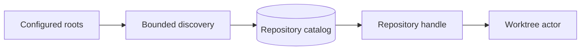

# Remote Linux Architecture

Status: proposed for V2

The primary remote workflow is deliberately simple:

```text
iPad browser or installed PWA
        |
        | HTTP over an SSH local port forward
        v
Git-Vista bound to 127.0.0.1 on Linux
        |
        v
Real repositories, Git credential helpers, SSH agent, forge APIs
```

Git-Vista runs where the repositories live. It does not mount a Linux filesystem
into the browser and it does not proxy arbitrary shell access.

## Operating Modes Are Separate Products

### Local mode

```text
git-vista serve --mode local /allowed/root
```

- Bind only to `127.0.0.1` and optionally `::1`.
- Browser and repository service run on the same machine.
- Use an ephemeral launch session and same-origin protections.
- Suitable for Linux, macOS, and Windows desktop browsers.

### SSH tunnel mode

```text
# On Linux
git-vista serve --mode tunnel /home/tom/projects

# From an SSH client with local forwarding
ssh -N -L 8080:127.0.0.1:8080 linux-host
```

- Git-Vista still binds only to loopback on Linux.
- SSH supplies encryption, host authentication, and network access control.
- Git-Vista still requires its own browser session and CSRF protections.
- This is the recommended iPad-to-Linux mode.
- A companion CLI may print a QR/pairing URL after the tunnel is established, but
  it must not expose a reusable bearer token in logs or shell history.

Current M1.05 support uses `gv` as that companion CLI: plain `gv` keeps the
Linux listener on loopback, `gv --token` prints a single-use localhost-fragment
link for the forwarded browser, and `gv doctor` reports the real listener,
health/protocol, launch/catalog roots, token metadata, UFW state, and tunnel
recipe without printing a secret. The browser session survives a dropped tunnel;
reconnect the same local forward and reload. `contrib/systemd/git-vista.service`
is the editable user-service example for supervised startup.

### LAN paired mode

```text
git-vista serve --mode lan --tls ... /allowed/root
```

- Explicit opt-in, HTTPS required, selected interface required.
- One-time local pairing code and revocable device session.
- Intended for a trusted home network, touchscreen, or classroom display.
- Not a shortcut for SSH mode and never anonymous.

### Team mode, future

- Reverse-proxy deployment, OIDC/passkeys, users, repository grants, audit policy,
  and isolated worktrees.
- A different operational commitment, not part of the V2 default binary behavior.

## Why SSH Tunnel First

- Reuses the user's existing Linux account and SSH security posture.
- Keeps Git-Vista off the LAN and public interfaces.
- Avoids shipping certificate lifecycle and account administration in the first
  serious client release.
- Lets Git and forge commands use the Linux host's existing SSH agent and
  credential helpers.
- Works with private repositories that are not reachable from the iPad directly.
- Makes remote Linux the execution location without turning Git-Vista into a
  general remote execution protocol.

## Session Bootstrap

1. The service starts on loopback and creates a one-time bootstrap secret.
2. The CLI displays a local URL or code.
3. The user establishes the SSH local port forward.
4. The iPad opens the forwarded local URL.
5. The bootstrap secret is exchanged once for an HttpOnly, SameSite session.
6. The URL is replaced so refresh/history do not retain the secret.
7. A CSRF token is held in PWA memory and renewed with the session.

The session belongs to Git-Vista, not to SSH. This protects against malicious web
origins reaching the forwarded port from the same browser.

## Repository Catalog

The server receives allowlisted roots at startup. It discovers repositories below
those roots to a configured depth and assigns opaque IDs.



Catalog responsibilities:

- Canonical path, git-dir, common-dir, bare/worktree classification.
- Display name and non-sensitive location label.
- Stable repository and worktree IDs.
- Capability detection: writable, remote configured, sequencer state, LFS,
  submodules, sparse checkout, signing, and provider identity.
- Active handle/reference count so managed clones cannot be deleted while in use.

## API Shape

Use an explicitly versioned API:

```text
GET  /api/v2/repositories
GET  /api/v2/repositories/{repo}/worktrees
GET  /api/v2/worktrees/{worktree}/snapshot
GET  /api/v2/repositories/{repo}/history?cursor=...
GET  /api/v2/repositories/{repo}/events
POST /api/v2/worktrees/{worktree}/plans
POST /api/v2/worktrees/{worktree}/operations
GET  /api/v2/operations/{operation}
POST /api/v2/operations/{operation}/cancel
POST /api/v2/operations/{operation}/undo-plan
```

Use JSON for control data, streaming bodies for large file/diff content, and SSE
for progress/invalidation. Do not encode repository paths into URLs.

## Performance Architecture

Remote interaction quality is latency-sensitive even when Git runs quickly.

- Return the app shell immediately and load repository panels independently.
- Send one compact `RepositorySnapshot` rather than several race-prone status calls.
- Use repository generations and ETags to return `304` for unchanged snapshots.
- Page history and extend graph layout incrementally.
- Cache immutable commits, trees, and blobs by OID.
- Bound and stream diffs; virtualize both file lists and diff lines.
- Run blocking `gix`/filesystem operations on a blocking pool.
- Put mutations in the worktree actor, not on Tokio request workers.
- Debounce filesystem watcher hints and coalesce refresh events.
- Use optimistic UI only for selection and panel state, never for claiming a Git
  mutation succeeded.
- Surface network state and operation progress continuously; mobile Safari can
  suspend and resume tabs.

## Long-Running Operations

Clone, fetch, pull, push, rebase, and some searches may outlive an HTTP request.

- Create an operation record before starting work.
- Return `202 Accepted` with an operation ID.
- Stream progress via SSE.
- Persist enough state to report completion after the PWA reconnects.
- Define cancellation per operation; cancellation is best-effort and must report
  whether Git was terminated before or after repository state changed.
- On startup, detect interrupted sequencer states and offer continue/abort/recovery
  rather than pretending no operation existed.

## External Changes

SSH-first users will continue using terminal Git, editors, and automation. This is
a feature, not an error condition.

- Watch git-dir, common-dir, index, and worktree paths as hints.
- Increment the repository generation only after a coherent re-read.
- Emit one coalesced snapshot event.
- Invalidate plans created against the previous generation.
- Show "changed outside Git-Vista" in the activity view when attribution is known.
- Never lock the repository merely to keep the UI snapshot stable.

## Credentials

Git network operations should behave like terminal Git on the Linux host:

- Reuse SSH agent forwarding only when the user has intentionally configured it.
- Reuse Git credential helpers through the standard credential protocol.
- Disable interactive terminal prompts; provide a structured challenge flow only
  for credential types the UI explicitly supports.
- Keep forge API tokens in server-side secure storage.
- Never store secrets in the PWA service-worker cache or IndexedDB.

## Reliability

- Health endpoint distinguishes process health from repository health.
- Startup validates allowed roots, Git version, writable state directory, and mode.
- Graceful shutdown stops accepting operations, waits/cancels by policy, flushes
  the operation store, and leaves recovery markers for interrupted work.
- Managed clones use leases and expiry, not eager deletion on repository switch.
- Backup requirements cover only Git-Vista state; repositories retain their own
  normal backup strategy.

## Deployment Recommendations

V2 should ship:

- One static server binary containing or locating the version-matched PWA assets.
- A systemd user-service example for Linux.
- A foreground mode for development and a supervised mode for normal use.
- `gv doctor` for Git version, roots, ports, credentials, worktrees, and browser
  secure-context diagnostics.
- `gv session new`, `gv session list`, and `gv session revoke`.
- Clear SSH tunnel recipes for common iPad SSH clients without endorsing one vendor.

Avoid the current pattern of force-killing every matching process name. Use a PID
file or service manager and support multiple configured instances on different ports.

## Future Multi-User Boundary

The local-first architecture prepares for multi-user use by carrying an actor in
operation records and by keeping repository authorization at the service boundary.
It does not implement users now. Future Team mode can replace the local session
provider and catalog policy without changing typed Git operations.

The critical future change is workspace isolation: two users should not share one
writable worktree. Team mode must allocate linked worktrees or disposable clones per
user/task and coordinate shared refs explicitly.
