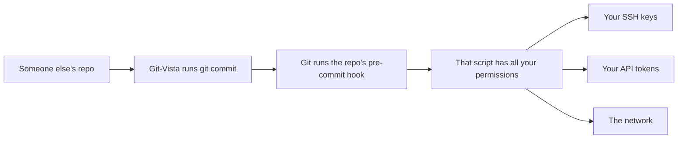
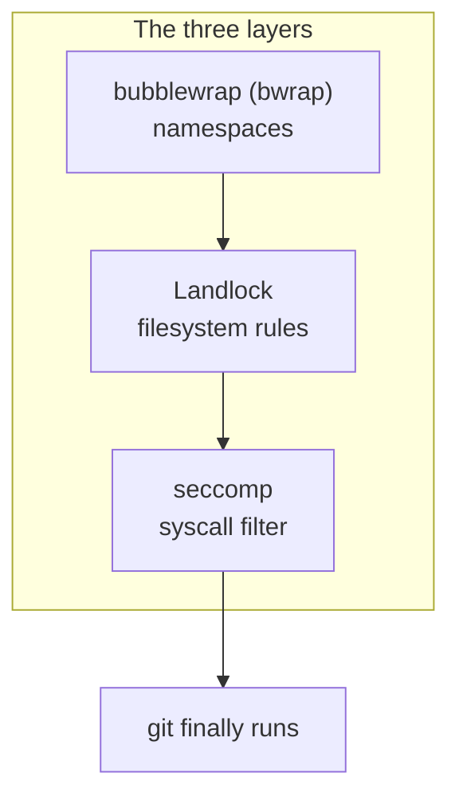
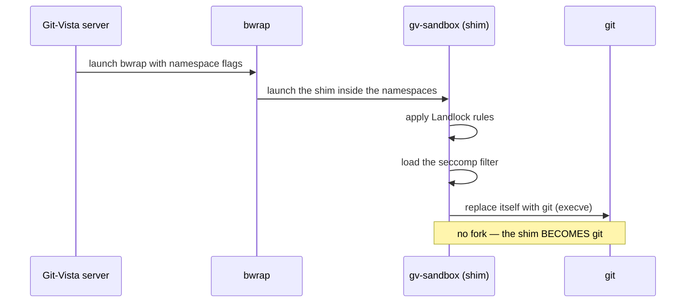
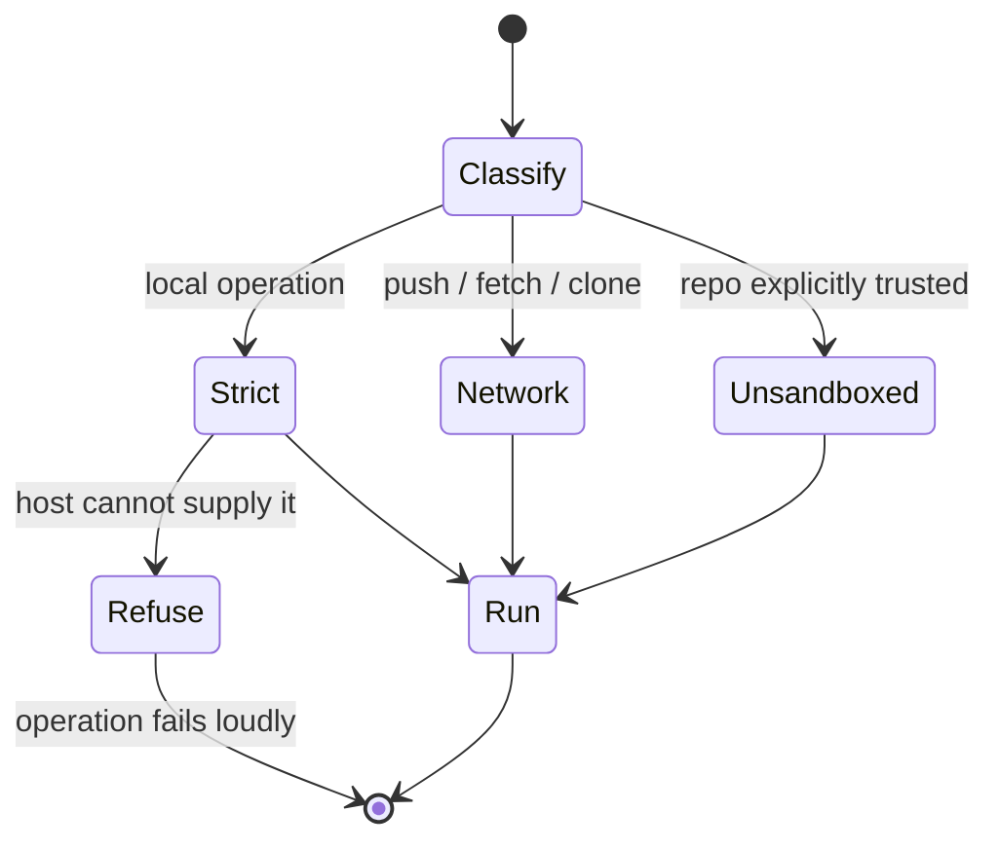
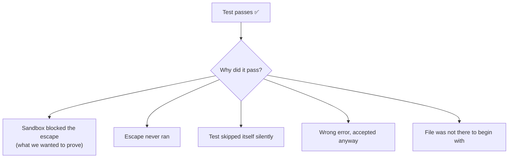
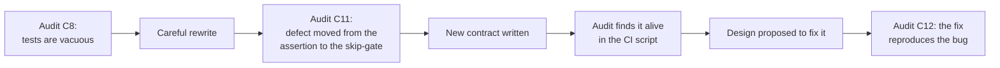
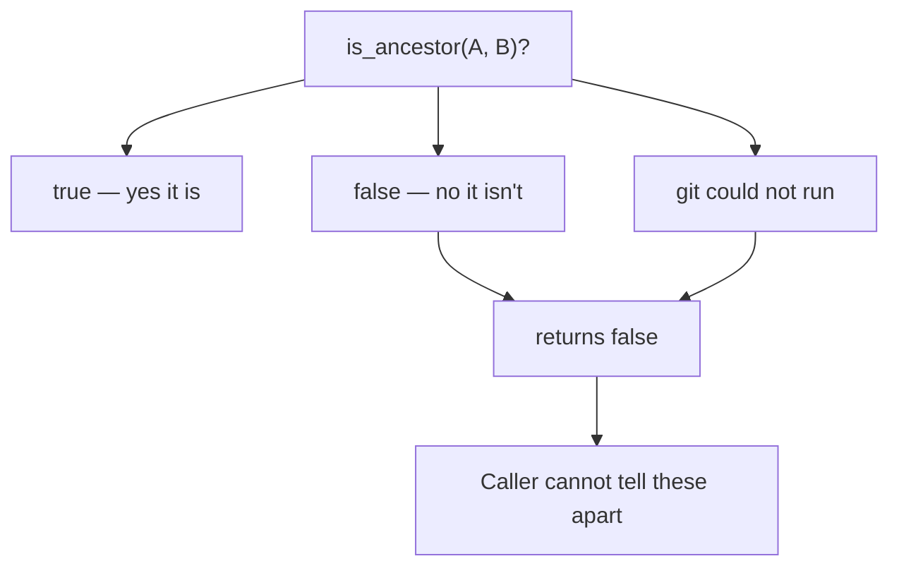
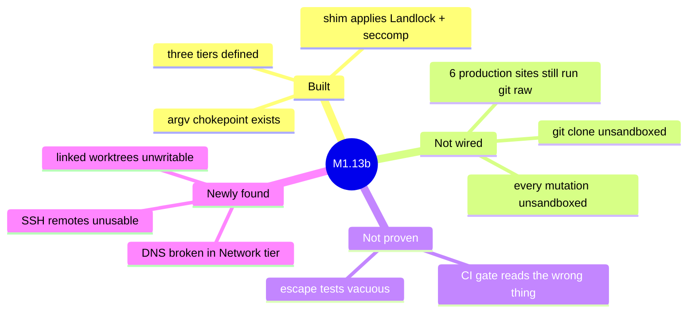

# The Git-Vista Sandbox, Explained From Scratch

*A plain-English guide to what M1.13b is, why it is hard, and what all the jargon means.*

You do not need to read the plan document, the contract, or any of the audit reports to
follow this. It assumes you know what git is and nothing else.

---

## 1. The problem, in one paragraph

Git-Vista runs `git` commands on your behalf. Git has a feature called **hooks**: scripts
that live *inside a repository* and run automatically when certain commands happen. A
`pre-commit` hook runs every time someone commits. Those scripts are ordinary programs with
your full permissions.

That is fine when the repository is yours. It stops being fine the moment Git-Vista touches a
repository someone else wrote — a clone, a shared project, anything off the internet. Then
"repository content" and "code that runs on your machine" are the same thing.

The sandbox exists to cut the arrows on the right-hand side.

---

## 2. What "the sandbox" actually is

It is not one thing. It is three separate operating-system features stacked, each closing a
door the others cannot.

**bubblewrap** gives the process a private view of the world — its own process list, its own
network stack, its own `/dev/shm`. A script inside it cannot see or signal your other
programs, and with the network namespace unshared it has no network at all.

**Landlock** is a kernel feature that says which files and directories a process may read or
write. This is what keeps a hook out of `~/.ssh` even though the hook is running as you.

**seccomp** filters *system calls* — the individual requests a program makes to the kernel.
It is the backstop for things Landlock does not cover, like `io_uring` (a newer, faster I/O
mechanism that can be used to sidestep file-based checks).

You need all three. Namespaces alone do not stop a hook reading `~/.ssh/id_rsa`. Landlock
alone does not stop it opening a network socket. Neither stops `io_uring`.

### How they get applied

There is a small helper program called **the shim** (`gv-sandbox`). The chain is:

That last step matters. The shim does not start git as a child and supervise it; it *turns
into* git. There is no moment where a supervisor could be killed and leave git running
unprotected.

---

## 3. The three tiers

Not every git command can run under maximum lockdown. `git push` needs the network. So there
are three levels:

| Tier | Network? | Used for |
|---|---|---|
| **Strict** | No — network namespace unshared | Every local operation: commit, status, diff, branch |
| **Network** | Yes, but only specific ports | push, fetch, clone |
| **Unsandboxed** | No sandbox at all | Only repos you explicitly marked trusted |

The rule the project committed to is **fail-closed**: if something cannot be classified, it
gets the *stricter* tier, never the looser one. And if the machine cannot provide the Strict
tier at all (no bubblewrap installed, kernel feature disabled), the operation **refuses to
run** rather than quietly downgrading. That decision is called INV-13, and the accepted price
is that Git-Vista is unusable on a machine without bubblewrap.

---

## 4. The genuinely hard part

Building the cage was not the hard part. **Proving the cage works** is the hard part, and it
is where this milestone has spent most of its effort.

Here is the trap, and it is worth reading twice.

You write a test: *"put a hostile script in a repo, run it under the sandbox, check that it
failed to read `~/.ssh/id_rsa`."* The test passes. What did you just prove?

You proved *the read failed*. You did **not** prove the sandbox is why. The read could have
failed because:

- the file was not there
- the script had a typo and never ran
- the sandbox was never actually applied, because the test quietly skipped itself
- the test checked for "an error" and got a completely unrelated error

A test that passes without demonstrating the thing it claims is called **vacuous**. It is
worse than no test, because it shows up green and everybody stops worrying.

An independent audit scored the project's escape tests **0 proves, 4 vacuous, 1 uncertain**.
Not one of them demonstrated containment.

---

## 5. The pattern that keeps coming back

This is the single most important thing to understand about the last few days, and it is not
really about sandboxes at all.

**Every time the defect was fixed, it moved instead of dying.**

Concretely:

1. The tests asserted too loosely. Fixed.
2. So the looseness moved into the *gate that decides whether to run the test at all*.
3. That gate was replaced with a report file. But the CI script never reads the report file —
   it still greps text output, and text output from *passing* tests is thrown away by the test
   runner. So the guard reads the same whether everything passed or nothing ran.
4. Separately, a design was proposed to make git commands carry their arguments through the
   sandbox properly. The audit found the design hands back a *mutable* object, so a caller can
   still add arguments afterwards — the exact hole the design existed to close.

The conclusion the project reached from this: **care is not sufficient.** Every one of these
was written by someone competent who was paying attention. The answer is to build things
where the mistake **cannot be expressed** — where the compiler or a tripwire refuses it,
rather than where a reviewer is expected to notice it.

That is why the current rules look bureaucratic. For example: every test case must be a plain
data declaration, and every test body must be exactly one line calling a shared runner. That
seems like pointless ceremony until you see the reason — *you cannot grep for "this assertion
is too loose", because that needs a human to read and judge it. You absolutely can grep for
"there are no assertions in this file at all."* One place a defect can live is a place that
stays reviewable forever.

---

## 6. A second failure, same shape, in the main code

While auditing the design, three separate reviewers independently found the same class of bug
in code that has nothing to do with sandboxes.

There are helper functions that answer questions like *"is this commit an ancestor of that
one?"* They return `true` or `false`. But when the underlying git command **fails to run at
all**, they also return `false`.

So "no, it isn't an ancestor" and "I could not find out" are the same answer.

The worst instance: before deleting a branch, the code records where that branch pointed, so
"Restore branch" can undo it later. If the lookup fails, it records *nothing* — and then
deletes the branch anyway. The undo entry is written with no restore point. The branch is
gone, and Git-Vista's own recovery route for it is gone too, silently.

That bug **already exists today**, with no sandbox involved. The sandbox work did not create
it; it just made three auditors look closely enough to find it.

---

## 7. Where things actually stand

The sandbox is **built but barely connected**. Only five read-only helper calls go through it.
The six places that matter most — including `git clone`, which is the one operation that
fetches someone else's content, and the executor behind every change Git-Vista makes — still
run git with no sandbox at all.

That is why the ordering decision matters: connecting the sandbox to the *read* helpers first
would pay the full speed cost (measured at **+17 to +24 milliseconds per git command**, about
three times the original estimate) while protecting almost nothing.

Three new bugs also turned up, found by actually running the shim rather than reading it:

- **DNS does not work in the Network tier.** The file that tells programs how to look up
  hostnames lives under `/run`, which the sandbox never grants. Every push, fetch and clone
  would break the moment it goes through the sandbox.
- **SSH remotes cannot work as designed.** The sandbox deliberately hides `~/.ssh` — that is
  the whole point — but git needs it to verify a server's identity. Security and usability are
  in direct conflict here and it needs a real decision, not a patch.
- **Linked worktrees cannot be written** at any tier.

None of these were caught earlier for the same underlying reason as everything else: nothing
was actually exercising the sandbox.

---

## 8. Glossary

| Term | Plain meaning |
|---|---|
| **hook** | A script stored inside a repository that git runs automatically. The threat. |
| **bubblewrap / bwrap** | Tool that gives a process a private view of processes, network, and shared memory. |
| **namespace** | The kernel feature bubblewrap uses. "Your own private copy of some system resource." |
| **Landlock** | Kernel feature restricting which files a process may touch. |
| **seccomp** | Kernel feature filtering which system calls a process may make. |
| **syscall** | A request from a program to the kernel — open a file, send a packet, start a process. |
| **io_uring** | A fast modern I/O mechanism that can bypass file-based checks. Blocked by seccomp. |
| **the shim** | `gv-sandbox`. Applies Landlock and seccomp, then turns itself into git. |
| **argv** | The exact list of command-line arguments a program is launched with. |
| **chokepoint** | One single function every git launch must pass through, so rules cannot be bypassed. |
| **tier** | Which level of sandbox an operation gets: Strict, Network, or Unsandboxed. |
| **vacuous** | A test that passes without demonstrating what it claims. The central enemy here. |
| **fail-closed** | When unsure, refuse or restrict. The opposite is fail-open, which is how holes appear. |
| **tripwire** | An automated check that makes a mistake fail the build instead of relying on review. |
| **TOCTOU** | "Time of check to time of use" — the gap between verifying something and relying on it. |
| **INV-*, F-*, R-*, C-*** | Numbered invariants, findings, rules, and audits. Just labels for tracking. |

---

## 9. If you remember three things

1. **The sandbox is three layers, and it works by *becoming* git rather than watching it.**
   That is what makes it fail-closed: if the cage cannot be built, git never starts.

2. **The hard problem is proof, not construction.** A green test that proves nothing is the
   failure mode this whole milestone is organised around.

3. **The same defect kept reappearing in new clothes, so the project stopped trusting care and
   started building tripwires.** That is why the rules feel heavy. They are heavy on purpose,
   and they are heavy in exactly one place so the rest can be light.

---

**Signed:** thomas2025 · 2026-07-29T10:52:16-04:00
