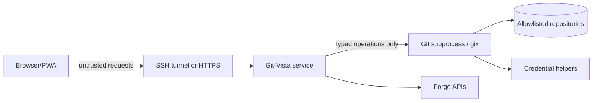
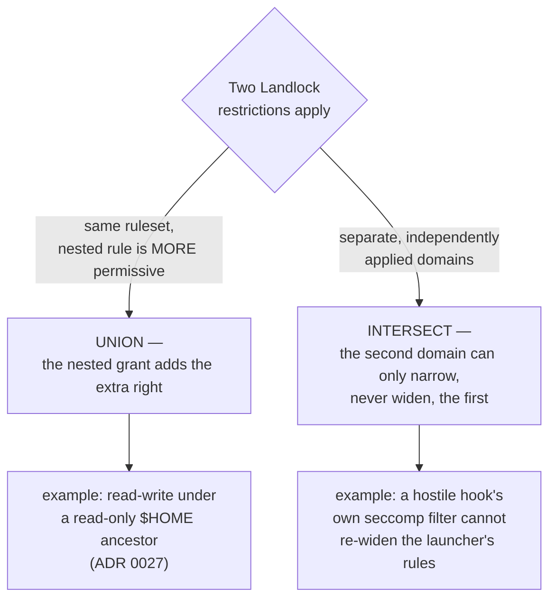

# Git-Vista Security Model

Status: proposed for V2

Git-Vista is local-first and primarily single-user, but it controls real Git
repositories and can execute destructive operations. "Only for me" reduces the
identity problem; it does not remove browser-origin attacks, stale tabs, malicious
LAN clients, credential leakage, or command races. Repository *content* is also
untrusted input: names, messages, refs and paths are treated as hostile and are
validated. Repository *code* — hooks, filters, and any config key that names an
executable — is a different matter. It runs under bounded, irreversible kernel
restrictions, tiered by operation kind: Landlock filesystem rules wherever
repository code runs, Landlock network rules that scope the network tier to a
fixed TCP port list — never to a destination host, see ADR 0028 — seccomp
syscall filtering, and, outside the network tier, a `bwrap` namespace boundary.
**This enforcement has shipped (ADR 0030).** Every local git operation the
server spawns for an untrusted repository now runs inside `Tier::Strict` or
`Tier::Network` — bwrap namespaces, then Landlock, then seccomp, applied by the
`gv-sandbox` shim after `exec`, reached through a sealed argv chokepoint a
caller cannot append to. `Tier::Unsandboxed` exists for operator-trusted
repositories only and is reachable by rule, not yet by any handler-facing
route. What a session's hooks actually run under is disclosed per repository
as one of four named values — `Strict`/`Network`/`Unsandboxed`/`Blocked` —
matching the real tiers directly, not the old `Allow`/`Restricted` labels
(ADR 0025, amended by ADR 0030); an undisclosed policy is the field's
*absence*, never a value that claims more than was measured. It does not claim
isolation from a same-uid adversary, and it cannot: see Known Non-Goals and
Sandbox Mechanism Boundaries below for exactly what each layer covers and
where it does not.

## Security Objectives

- A website opened in the same browser cannot command the local Git-Vista server.
- A LAN device cannot discover and mutate repositories without explicit pairing.
- No browser or API request can directly supply arbitrary paths, Git argv,
  environment variables, or a shell — enforced at the browser/API surface
  (ADR 0017). Repository code itself — hooks, filters, configured
  executables — has its own execution authority once Git invokes it, and is
  governed separately; see Command Execution and Known Non-Goals.
- A stale or replayed request cannot repeat a mutation silently.
- Provider and Git credentials never enter logs, URLs, API payloads, or browser
  storage unnecessarily.
- Git-Vista's own read paths cap memory use, output size, and process
  lifetime — quantified ceilings on what Git-Vista itself spawns, not a
  blanket bound on the repository. *(Implemented for history and file reads:
  ADR 0022, #63 — every git read goes through `git_vista_git::git_stdout_capped`,
  which streams under a per-kind cap (8 MiB diff metadata → 413, 200 KB per
  patch within 5 MB, 2 MB per file) and carries `kill_on_drop`, so a
  disconnected client kills the child instead of letting it finish into a
  buffer. History is paged rather than buffered whole, and paging keeps
  **no** per-client server state: the entire state of a scroll is one signed
  offset in the client's cursor, so memory is independent of both repository
  size and the number of connected clients. The frontend culls to at most
  2,000 live rows regardless of camera. The memory bound is a
  denial-of-service control, not merely a performance measure. **Disk use
  and a hook's own child processes are not bounded by any of this** —
  repository code executes as the real uid (ADR 0025) with no ceiling of its
  own, and same-uid resource exhaustion is a Known Non-Goal, not a gap in
  this control.)*
- Recovery data is protected at least as strongly as the repository itself.
- Security remains understandable for one person to operate.

## Assets

- Repository objects, refs, worktrees, index, stashes, and uncommitted changes.
- SSH keys, Git credential-helper material, forge OAuth tokens, and cookies.
- Operation history and recovery refs.
- Repository paths and file contents.
- The ability to push, force-push, create PRs, and modify remote state.

## Trust Boundaries



The browser is not trusted merely because it served the UI. Every mutation goes
through authentication, origin validation, repository authorization, generation
checks, operation planning, and the per-worktree queue.

## Operating Modes

| Mode | Bind | Transport | Authentication | Intended use |
|---|---|---|---|---|
| Local | `127.0.0.1` | HTTP localhost | Launch/session secret + same-origin | Browser on the Linux/macOS/Windows host |
| SSH tunnel | `127.0.0.1` on Linux | SSH encrypted forwarding | SSH plus Git-Vista session | Primary iPad-to-Linux workflow |
| LAN view | One explicit interface | Plain HTTP | Single-use bootstrap token, view-scoped read-only routes, rate-limited sign-in | Backup path when the SSH tunnel is unavailable, trusted home LAN only (ADR 0005) |
| LAN paired, future | Explicit interface | HTTPS | One-time pairing and device session | Trusted private network without SSH tunnel, full read/write |
| Team, future | Reverse proxy/private network | HTTPS | OIDC/passkeys plus RBAC | Explicit multi-user deployment, not V2 default |

Modes are configuration profiles, not a boolean `--public` switch. Each profile
has different startup checks and refuses to start when required controls are absent.

## Local and SSH Session Design

Implemented by the session + request-protection layer (M1.04,
`git-vista-server::{session,security}`; ADR 0004). The bootstrap token is written
`0600` and delivered via the `gv` setup link's URL *fragment* (never the server,
never a log); everything below is enforced by the `require_auth` layer.

- Generate a high-entropy session secret at every service start unless a durable
  paired-device session is explicitly configured. *(256-bit `getrandom` token per
  start; the in-memory store means a restart is a full revocation. Durable paired
  sessions deferred to the LAN/paired milestone.)*
- Print/open a bootstrap URL whose one-time secret is exchanged for an HttpOnly,
  SameSite=Strict session cookie. Remove secrets from the visible URL immediately.
  *(`gv` prints `…/#s=<token>`; the SPA `POST`s it and strips the fragment with
  `history.replaceState`. The token is single-use — redeeming it rotates a fresh
  one — and expires.)*
- Require a separate CSRF token on every state-changing request. *(Per-session
  token echoed in `x-git-vista-csrf`, compared constant-time; missing/invalid on a
  live session is a `403`.)*
- Validate `Origin`, `Host`, and content type. Reject `Origin: null` mutations.
  *(Host must be a loopback literal — the anti-DNS-rebinding check; `Origin`, when
  present, must be same-origin and non-`null`; a present content type on a write
  must be JSON, blocking form-encoded CSRF.)*
- Set a strict Content Security Policy and deny framing with `frame-ancestors 'none'`.
  *(See "Browser Security Headers" — stamped on every response by
  `security_headers`.)*
- Bind only to loopback in Local and SSH modes. *(Default bind is `127.0.0.1`; the
  Host/Origin policy is derived from the bind address.)*
- Treat localhost as vulnerable to malicious webpages and DNS rebinding; binding
  loopback is necessary but not sufficient. *(The reason the Host allowlist and
  session gate exist at all.)*
- Expire operation approval tokens quickly and bind them to session, repository,
  worktree, operation hash, and repository generation. *(Session/bootstrap expiry
  landed here; per-operation approval tokens are a later milestone.)*

## LAN View Profile (implemented, ADR 0005)

`gv --lan-view [path]` starts the existing loopback server plus a second
listener, bound to one explicit, operator-confirmed LAN IP:

- The second listener serves a structurally reduced router: GET read routes
  plus `POST`/`DELETE /api/session` only. Every write, `/api/select`,
  `/api/rescan`, `/api/clone`, and `/api/delete-clone` route is never
  registered on it — absence, not a runtime check (`crates/git-vista-server/
  src/main.rs::api_router`).
- `Host`/`Origin` on this listener are pinned to the one sanctioned LAN
  IP:port (`security::HostPolicy::lan`); neither `localhost` nor any other
  address the machine answers on is accepted, so a DNS-rebinding attempt
  against the LAN listener fails closed the same way the loopback listener's
  Host check does.
- Sign-in (`POST /api/session`) on this listener is rate-limited per source
  IP (`crates/git-vista-server/src/ratelimit.rs`); the loopback listener's
  sign-in is unaffected.
- Auth is otherwise the same single-use bootstrap-token flow as loopback,
  sharing one in-memory session store; a session established via either
  listener carries a `via_lan` flag purely so the UI can hide the Active
  option — the actual write boundary is the LAN router's absent routes.
  *(Implemented: ADR 0024, #64 — the frontend's CSRF token and `via_lan` flag,
  formerly two independent `thread_local!`s with no rule tying them together,
  now live together in one `SessionCore` with a typed
  `SessionRejection::UiModeChangeWhileLan`, so "a LAN-view session may not
  select Active mode" is answerable from one place. This is a client-side
  UI affordance only, reinforcing — not replacing — the write boundary
  above, which remains the LAN router's absent routes.)*
- Accepted, documented risk: plain HTTP means repo contents and the session
  cookie are readable by anyone on the same network. Suitable for a trusted
  home LAN, never a guest or shared network — the startup banner and `gv
  doctor` say so explicitly.
- `gv doctor` and the launch-time exposed-listener kill-check learn the
  sanctioned second socket: with `--lan-view`, exactly {loopback, the
  recorded LAN ip} on port 8080 is healthy; anything else is still a
  SECURITY ERROR that stops the server. Without the flag, behavior is
  unchanged from M1.05.

## LAN Mode (future, paired HTTPS — write-capable)

The read-only LAN view profile above (ADR 0005) is what's implemented today;
this section covers the *different*, still-future write-capable LAN mode —
the "LAN paired" row in the Operating Modes table.

No current *write-capable* LAN mode exists: the server is hard-limited to
`127.0.0.1:8080` plus the read-only LAN view listener above, and the earlier
plain-HTTP `--lan` compatibility path was removed. This future mode is a
separate paired-HTTPS profile, not a convenience switch, and must:

- Require HTTPS so service workers, credentials, and browser security semantics
  operate on a secure origin.
- Display a short-lived pairing code locally on the server terminal.
- Pair a browser into a revocable device session; do not use a permanent URL token.
- Show bound interfaces and active paired devices at startup.
- Support revocation and session expiry from the server CLI.
- Rate-limit pairing, authentication, cloning, search, diff, and provider requests.
- Warn that guest Wi-Fi and shared classroom networks are not trusted boundaries.

## Future Team Mode

Do not implement Team mode as "LAN mode with more cookies." It requires:

- External identity through OIDC or passkeys/WebAuthn.
- Per-user repository grants and operation attribution.
- Separate workspaces/worktrees for users who may edit concurrently.
- Administrator-controlled repository roots and provider credentials.
- Audit retention, session revocation, quotas, and reverse-proxy deployment.
- A decision about whether Git commits use service identity or user identity.

These concerns are intentionally outside the V2 local-first implementation.

## Repository Isolation

Implemented by the server-owned catalog (M1.03, `git-vista-server::catalog`;
ADR 0003). The catalog is the only path→id resolver and fails closed on anything
it did not itself register.

- Configure one or more allowlisted repository roots. *(Catalog `AllowedRoots`;
  the clones root is always allowed, and a server-launched repo allows its own
  root.)*
- Canonicalize discovered paths and reject escapes through symlinks. *(Registration
  canonicalises the repository root and checks component-wise containment, so a
  `../` traversal or a symlink escaping an allowed root is rejected.)*
- Give the browser opaque repository IDs, not arbitrary filesystem paths.
  *(Requests select a worktree by `WorktreeId`; `GET /api/catalog` reports
  capabilities by id. A malformed id is a `400`, an unknown id a `404`.)*
- Resolve git-dir and common-dir through Git/gix for normal, bare, and linked
  worktree repositories. *(`git_vista_git::read_repo_facts` classifies each as
  bare / main / linked and derives the canonical root.)*
- Never follow a browser-provided path to open a file or repository. *(No endpoint
  accepts a path; ids resolve only against the registered set.)*
- Report capabilities without exposing absolute paths by default. *(Descriptors
  and the graph label carry only a base name unless `GIT_VISTA_EXPOSE_PATHS` is
  set.)*
- Scope operation stores and recovery refs to the canonical repository identity.
  *(Deferred to M1.09.)*
- Treat submodules as separate repositories with explicit opt-in traversal.
  *(Deferred.)*
- Never serve `.git` internals as static files.

## Command Execution

- Every Git-Vista-owned spawn site uses direct argv execution; never a shell.
  *(Enforced by a tripwire test: ADR 0017, #144 —
  `git-vista-server::argv_boundary` scans both native crates and fails on any
  process-spawn site that is not allowlisted or does not name `git` literally.
  This governs Git-Vista's own spawn sites only: once invoked, `git` may run a
  repository hook, filter, or credential helper that itself invokes a shell —
  that execution is Git's, not a Git-Vista spawn site, and is addressed by
  the hook-policy bullet below and ADR 0025, not this tripwire.)*
- Build argv only from typed operation planners and validated domain values.
  *(Extended to read state: ADR 0022, #63 — a paging cursor is server-authored
  and HMAC-SHA256 signed. The client may echo it back but may not author it. It
  is validated in a fixed order — length guard, single dot, bounded base64,
  constant-time tag comparison, only then JSON parse — so a forged or foreign
  cursor is rejected before `serde_json` sees attacker-shaped bytes and before
  any repository walk opens. A cursor scoped to a different repository or
  worktree returns the generic `400`, deliberately not a distinguishing error, so
  probing cannot confirm that another target exists.)*
  *(Implemented for every served-repository mutation: ADR 0015/0016, #142/#143 —
  write handlers build a typed `GitOperation`, and `git-vista-server::planner`
  is the only place a mutating git argv is constructed. Proven at the API
  boundary by adversarial fixtures: ADR 0017, #144 — no route deserializes a
  raw command string or argv array, and hostile bodies die at the extractor.)*
- Pass `--` where Git supports it and validate full refnames with Git.
- Clear or explicitly set child environment variables. Disable terminal prompts,
  editors, pagers, and hooks where the operation semantics permit.
- Decide hook policy explicitly. Running repository hooks may execute arbitrary
  local code; local mode may allow them, but the UI must report that fact and Team
  mode should default to a restricted policy. *(Implemented: ADR 0025 (declared +
  disclosed) amended by ADR 0030 (enforced) — `sandbox::tier_for` decides the real
  tier per operation and `sandbox::hook_policy::hook_policy_for_repo` only renames
  that answer to the wire vocabulary, never re-derives it, so disclosure cannot
  drift from enforcement. `RepositoryDescriptor.hook_policy` and
  `SessionInfo.hook_policy` carry it to the client; `via_lan` has no bearing on the
  value reported (`session_hook_policy_for`, `crates/git-vista-server/src/handlers/
  session.rs`) — see the ADR 0025 amendment. The client reports the
  per-repository value on every picker row and on the mode screen where a
  repository is opened (`hook_policy_disclosure.rs` + `picker.rs`, #208), with
  an absent value shown as "not disclosed" and styled as a warning. The
  separate **session**-level banner is still the pre-#202 view and its fixed
  text is wrong for `Blocked` and `Network`; see ADR 0030 Consequences.)*
- Apply timeouts, cancellation, stdout/stderr limits, process-group termination,
  and concurrency quotas.
- Convert raw Git errors into structured safe errors; retain detailed stderr only
  in local protected logs with credential redaction.

## Sandbox Mechanism Boundaries

The Command Execution and Known Non-Goals sections state *what* is
restricted and disclosed. The enforcing shim now ships and runs (ADR 0030);
this section states what each mechanism actually covers when it does, because
a boundary that is silently narrower than it sounds is worse than one stated
plainly — and every limit below is a live limit, not a forecast. ADR 0027
(filesystem) and ADR 0028 (network) are the durable record behind each item
below.

- **Landlock network rules authorize TCP ports, never hosts.** A single
  rule granting a port permits `connect()` to that port on *every*
  destination; the kernel's rule type carries no address field at all. The
  network tier's port list (ADR 0028) blocks reaching an arbitrary *local*
  port — a stray loopback service, a resolver, this server's own port — and
  cannot confine which remote host a permitted port reaches.
- **UDP and `AF_UNIX` are not mediated by these Landlock network rules at
  all.** Only the strict tier's network namespace blocks UDP egress, by
  removing network access entirely; the network tier's Landlock port rules
  pass UDP and Unix-domain traffic through unmediated, in either direction.
- **`AF_UNIX` in the strict tier is denied by seccomp, and by nothing else.**
  *Implemented* (2026-07-29) in `seccomp_filter::af_unix_rule` as an
  argument-scoped `EPERM` on `socket(2)`/`socketpair(2)` when the address family
  is `AF_UNIX`, installed for `--net-deny` (strict) only. It is worth being
  explicit about why every other layer misses this, because for a period the
  design claimed the denial while the build did not have it (measured: both
  entry points succeeded inside the full strict stack, identical to the bare
  host, while a `ptrace` control in the same run returned `EPERM`).
  `LANDLOCK_SCOPE_ABSTRACT_UNIX_SOCKET` mediates *connecting* to an abstract
  socket created outside the domain — not socket construction — and Landlock ABI
  8 does not mediate **pathname** sockets at all; the IPC and network namespaces
  do not cover `AF_UNIX` either. Without the seccomp rule a hostile hook in the
  strict tier reached `/run/docker.sock`, `ssh-agent`, `gpg-agent` and the D-Bus
  session bus. The **network tier deliberately still permits `AF_UNIX`**: git
  over SSH wants an agent socket and the carve-out is deferred (issue #188), so
  that tier's filter is unchanged. Proven by `af_unix_socket_denied` and
  `af_unix_socketpair_denied` in the escape battery, which die under
  `ci/mutants/M8-remove-af-unix-socket-rule.patch`. The rule's `Dword`
  comparison width carries its own guard: `high_bit_af_unix_denied` issues a raw
  `syscall(SYS_socket, AF_UNIX | 1<<32, …)` — libc's `int`-typed wrapper would
  truncate the hostile bits before the seccomp-visible register held them — and
  dies under `ci/mutants/M9-widen-af-unix-comparison.patch`.
- **A seccomp denylist keyed on bare syscall numbers does not cover the x32
  ABI, and the filter's arch check does not catch it either.** x32 has no
  `AUDIT_ARCH` of its own: it reports `AUDIT_ARCH_X86_64` and marks itself by
  setting `__X32_SYSCALL_BIT` (`0x4000_0000`) in `seccomp_data.nr`. seccompiler
  emits one `BPF_JEQ` per bare key against the raw `nr` with `mismatch_action =
  Allow` as the fallthrough, so an x32-numbered call matched no key and fell
  through — and because the miss happens at the shared `nr` load, it voided the
  **entire** map at once: io_uring, `unshare`/`setns`, `seccomp` (the C1 stacking
  denial), `ptrace`, and the AF_UNIX rules together. Measured 2026-07-29 with
  hand-built cBPF of seccompiler's exact shape; the sibling i386 vector *is*
  closed, and closed fatally (`AUDIT_ARCH_I386` mismatch →
  `SECCOMP_RET_KILL_PROCESS`). Not exploitable on the development host — its
  kernel has `# CONFIG_X86_X32_ABI is not set`, so every x32-numbered call
  returns `ENOSYS` and no x32 binary can even be exec'd — but that is one
  kernel-config line away from live, and the sandbox neither controls nor
  observes the setting. `seccomp_filter::rules_with_x32_aliases` therefore
  inserts every key twice, bare and `__X32_SYSCALL_BIT`-set. Seccomp evaluates
  before the kernel's x64/x32 dispatch split, so the fix is verifiable on a host
  where the exploit is not: `high_bit_io_uring_denied` observes `ENOSYS` outside
  the sandbox and `EPERM` inside, and dies under
  `ci/mutants/M1-apply-seccomp-empty.patch`.
- **A Landlock `path_beneath` rule carrying a directory-only right is rejected
  outright when the target is a regular file — there is no partial grant.** The
  accepted set for a non-directory is Landlock's own `ACCESS_FILE`
  (`EXECUTE`, `WRITE_FILE`, `READ_FILE`, `TRUNCATE`, `IOCTL_DEV`); anything else
  fails the whole rule with `EINVAL`, and an empty mask fails with `ENOMSG`.
  Measured 2026-07-29 (ABI 8). This is why the shim masks every grant to the
  rights its target can carry (`gv-sandbox`'s `rights_for_target`) and why a
  rejected rule now **refuses the launch** rather than being discarded: a
  `--ro`/`--rw` entry naming a file used to grant nothing and report success,
  which is not failing closed — it is a weaker sandbox wearing the costume of a
  configured one. An unopenable path stays tolerated, because a host without
  `/run/resolvconf` is not a grant failure.
- **Landlock (ABI 8, this host) does not mediate metadata operations —
  `chmod`, `chown`, `utime`, `setxattr`, `flock`, `chdir`, `stat`, `access`.**
  A sandboxed process can change the mode, owner, or timestamps of a file in
  a tree the sandbox holds no right over at all; demonstrated first-party
  during round-4 probing, where a hook's `chmod 777` against a file outside
  every granted tree succeeded and followed the symlink. Accepted, documented
  non-coverage, not an unstated gap — the blast radius has not been
  enumerated by anyone.
- **Landlock rules bind resolved inodes, not path strings.** A name excluded
  from a grant is only actually withheld if the enumeration that builds the
  grant set resolves symlinks and matches hard-link inodes before deciding
  what to grant; a granted alias re-opens the excluded file by its own
  canonical path too. See ADR 0027 for the measured mechanism and the
  enumerate-and-skip algorithm this requires.
- **A Landlock domain is inherited through `fork` and preserved through
  `execve`, irreversibly.** This is *why* a hook or grandchild process stays
  under the same restriction as its parent — the property the Command
  Execution and hook-policy sections above depend on.
- **Rule composition differs by scope.** More-permissive nested rules
  *union* within one Landlock ruleset (a read-write grant nested under a
  read-only ancestor adds the extra right); independently applied Landlock
  domains *intersect* instead (stacking a second, separate restriction can
  only narrow what the first already granted, never widen it). Treating the
  two as interchangeable produces a policy that is wrong in one direction or
  the other.
- **`/run/docker.sock` is withheld by filesystem policy plus seccomp and
  descriptor discipline, not by any network rule.** uid 1000's `docker`
  group membership makes that socket passwordless root once reached;
  nothing about Landlock's network mediation is what keeps it out of reach.
- **A hook shares its uid with every other process on the host, and can act
  on one of them through any writable file that process watches and treats
  as instructions — a confused deputy over a deliberately writable object.**
  Neither the AF_UNIX denial nor Landlock touches this, and no unprivileged
  sandbox can. It is the reason "a hostile repository cannot harm you" is not
  purchasable, and it is written here rather than engineered against.



None of the above is a defect introduced by this document; each is a true
property of the underlying kernel mechanism that the sections above did not
previously state.

## Remote and Forge Credentials

- Prefer existing Git credential helpers and SSH agents on the Linux host.
- Never ask the browser to upload an SSH private key.
- Store forge tokens server-side using the OS keyring or an encrypted local store.
- Prefer fine-grained, short-lived provider credentials. GitHub recommends GitHub
  Apps over OAuth apps for tighter permissions and short-lived tokens.
- Request provider scopes per capability and show them before authorization.
- Redact URL userinfo, HTTP authorization, query tokens, and credential-helper
  output from logs and operation records.
- Make provider logout revoke/delete local credentials.

See [GitHub's app authentication guidance](https://docs.github.com/en/enterprise-cloud%40latest/apps/oauth-apps/building-oauth-apps/differences-between-github-apps-and-oauth-apps).

## Request Integrity

Every mutation request contains:

- Session and CSRF proof.
- Repository and worktree IDs.
- Expected repository generation.
- An idempotency key generated by the client.
- A typed operation body.
- For risky actions, a short-lived approval token from a prior plan.

The server records idempotency results for a bounded period. A retried mobile
request returns the original result rather than performing the action twice.

*(Generation, hash and expiry are enforced at execution time: ADR 0018, #145 —
`planner::validate` refuses a tampered operation hash and an expired plan, and
`planner::enforce_fresh` recomputes the repository generation (HEAD, all refs,
worktree status) and re-verifies every build-time-held precondition against
the live repository immediately before execution. Any drift refuses with a 409
and a client-facing reason — the TOCTOU gap fails closed. Client-supplied
generation/idempotency fields arrive with the review roundtrip, M2+.)*

## Operation Risk Classes

| Class | Examples | Required control |
|---|---|---|
| Read | History, diff, blame | Authentication, limits, path isolation |
| Local reversible | Stage, branch create | Serialized operation, generation check |
| History rewrite | Reset, rebase, amend | Preview, explicit confirmation, recovery ref |
| Worktree destructive | Clean, discard, checkout overwrite | Preview, typed file impact, safety checkpoint |
| Remote visible | Push, PR create/comment | Explicit target and identity confirmation |
| Remote destructive | Force-push, remote branch delete | Strong warning, lease/CAS, re-auth option |

No gesture, pressure threshold, swipe, or double-tap directly executes a destructive
operation. Touch gestures may select or open a plan; final confirmation is explicit.

## Clone and Network Controls

- Restrict clone schemes by operating mode and configuration.
- Block loopback, link-local, cloud metadata, and private-network destinations when
  arbitrary URL cloning is exposed beyond local mode, unless explicitly allowlisted.
- Apply clone size/time quotas and stream progress without buffering complete output.
- Store temporary clones under a managed root with ownership metadata and expiry.
  *(Implemented: ADR 0008, #121 — clones persist under `$XDG_DATA_HOME/git-vista/
  clones`, not a wiped-at-startup temp dir; deletion is explicit via
  `POST /api/delete-clone`, guarded to paths that canonicalize inside that root.)*
- Never delete a clone while an active repository handle references it.
  *(Implemented: ADR 0008, #121 — `delete_clone` refuses the currently open
  selection with `409`.)*
- Treat remote URLs as secrets because they can contain credentials.

## Browser Security Headers

At minimum:

```text
Content-Security-Policy: default-src 'self'; object-src 'none'; base-uri 'none';
  frame-ancestors 'none'; form-action 'self'; connect-src 'self'
Cross-Origin-Opener-Policy: same-origin
Cross-Origin-Resource-Policy: same-origin
Referrer-Policy: no-referrer
X-Content-Type-Options: nosniff
Permissions-Policy: camera=(), microphone=(), geolocation=()
Cache-Control: no-store                 # authenticated API responses
```

Static fingerprinted assets may be immutable. Do not apply `no-store` blindly to
the PWA shell and destroy offline startup.

Implemented by `security_headers` (M1.04; ADR 0004), stamped on every response. Two
deviations from the baseline above, both documented in ADR 0004: the CSP's
`script-src` adds `'wasm-unsafe-eval'` (required by the WebAssembly runtime) and
`'unsafe-inline'` (Trunk boots the wasm with an inline module script whose hash
changes each build, and the server sets a static header), and `img-src`/`font-src`
are widened to `'self' data:` / `'self'` for the inline SVG favicon and the bundled
Nerd Font. `Cache-Control: no-store` is applied to API responses only; the SPA
shell keeps `no-cache` so offline startup (a later PWA milestone) survives.

## Data at Rest

- Operation history may expose commit messages, branches, and repository paths.
- Default to user-only filesystem permissions on the Linux host.
- Keep browser persistence minimal and clearable.
- Do not cache private diffs/file contents offline by default.
- Recovery refs and safety stashes require retention limits and visible cleanup.
- Provider tokens and device sessions must not be stored in the Git repository.

## Audit and Logging

Log structured events with operation ID, repository ID, worktree ID, risk class,
duration, result code, and before/after generation. Do not log request bodies by
default. Local logs should be useful without exposing credentials or complete file
contents.

## Security Testing

- Route tests for missing/invalid session, CSRF, Origin, Host, content type, and
  repository access.
- Concurrency tests for clone switching, stale generations, duplicate requests,
  rebase/reset interleaving, and two browser tabs.
- Property/fuzz tests for ref, path, status, diff, and provider parsers.
- Tests for symlink escapes, linked worktrees, bare repositories, submodules, and
  repositories with hostile names/messages.
- Output-limit and timeout tests using intentionally noisy/slow child processes.
- Browser tests for cookie and service-worker update behavior.
- Dependency, license, secret, and vulnerability scanning in release CI.

## Known Non-Goals

- Protecting a repository from its own Unix account owner.
- **Fully** sandboxing arbitrary Git hooks in Local mode. Enforcement has
  landed (ADR 0030): an untrusted repository's local operations run inside a
  Landlock+seccomp+bwrap tier, and the tier actually in force is disclosed —
  never a stronger one than what ran (ADR 0025's amendment). What "fully"
  still excludes, documented in Sandbox Mechanism Boundaries above: Landlock
  does not mediate metadata operations (`chmod`, `chown`, `utime`, `stat`,
  `flock`, ...) at all; the network tier confines ports, never destination
  hosts; and a same-uid adversary with access to a root-owned daemon socket,
  or to a writable file some outside process treats as instructions, is out
  of scope regardless of tier.
- Providing tenant isolation in V2.
- Making remote force-push universally undoable.
- Securing plain HTTP LAN mode; it should not exist as a supported write mode.

## Security Release Gate

No release should claim safe remote or LAN write access until:

- Loopback is the default bind.
- SSH tunnel mode is documented and tested on iPad.
- Every mutation has session, CSRF, origin, generation, and serialization checks.
- Repository paths are allowlisted and opaque to the browser.
- Child processes have time/output limits and credential redaction.
- Recovery behavior is documented for each destructive operation.
- A `SECURITY.md` vulnerability-reporting policy exists.
