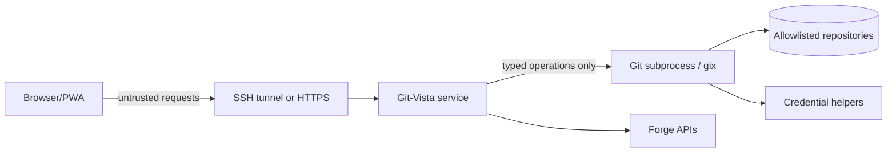

# Git-Vista Security Model

Status: proposed for V2

Git-Vista is local-first and primarily single-user, but it controls real Git
repositories and can execute destructive operations. "Only for me" reduces the
identity problem; it does not remove browser-origin attacks, hostile repositories,
stale tabs, malicious LAN clients, credential leakage, or command races.

## Security Objectives

- A website opened in the same browser cannot command the local Git-Vista server.
- A LAN device cannot discover and mutate repositories without explicit pairing.
- The UI cannot request arbitrary paths, Git argv, environment variables, or shell.
- A stale or replayed request cannot repeat a mutation silently.
- Provider and Git credentials never enter logs, URLs, API payloads, or browser
  storage unnecessarily.
- A repository cannot cause unbounded memory, disk, child-process, or render use.
- Recovery data is protected at least as strongly as the repository itself.
- Security remains understandable for one person to operate.

## Assets

- Repository objects, refs, worktrees, index, stashes, and uncommitted changes.
- SSH keys, Git credential-helper material, forge OAuth tokens, and cookies.
- Operation history and recovery refs.
- Repository paths and file contents.
- The ability to push, force-push, create PRs, and modify remote state.

## Trust Boundaries



The browser is not trusted merely because it served the UI. Every mutation goes
through authentication, origin validation, repository authorization, generation
checks, operation planning, and the per-worktree queue.

## Operating Modes

| Mode | Bind | Transport | Authentication | Intended use |
|---|---|---|---|---|
| Local | `127.0.0.1` | HTTP localhost | Launch/session secret + same-origin | Browser on the Linux/macOS/Windows host |
| SSH tunnel | `127.0.0.1` on Linux | SSH encrypted forwarding | SSH plus Git-Vista session | Primary iPad-to-Linux workflow |
| LAN paired | Explicit interface | HTTPS | One-time pairing and device session | Trusted private network without SSH tunnel |
| Team, future | Reverse proxy/private network | HTTPS | OIDC/passkeys plus RBAC | Explicit multi-user deployment, not V2 default |

Modes are configuration profiles, not a boolean `--public` switch. Each profile
has different startup checks and refuses to start when required controls are absent.

## Local and SSH Session Design

Implemented by the session + request-protection layer (M1.04,
`git-vista-server::{session,security}`; ADR 0004). The bootstrap token is written
`0600` and delivered via the `gv` setup link's URL *fragment* (never the server,
never a log); everything below is enforced by the `require_auth` layer.

- Generate a high-entropy session secret at every service start unless a durable
  paired-device session is explicitly configured. *(256-bit `getrandom` token per
  start; the in-memory store means a restart is a full revocation. Durable paired
  sessions deferred to the LAN/paired milestone.)*
- Print/open a bootstrap URL whose one-time secret is exchanged for an HttpOnly,
  SameSite=Strict session cookie. Remove secrets from the visible URL immediately.
  *(`gv` prints `…/#s=<token>`; the SPA `POST`s it and strips the fragment with
  `history.replaceState`. The token is single-use — redeeming it rotates a fresh
  one — and expires.)*
- Require a separate CSRF token on every state-changing request. *(Per-session
  token echoed in `x-git-vista-csrf`, compared constant-time; missing/invalid on a
  live session is a `403`.)*
- Validate `Origin`, `Host`, and content type. Reject `Origin: null` mutations.
  *(Host must be a loopback literal — the anti-DNS-rebinding check; `Origin`, when
  present, must be same-origin and non-`null`; a present content type on a write
  must be JSON, blocking form-encoded CSRF.)*
- Set a strict Content Security Policy and deny framing with `frame-ancestors 'none'`.
  *(See "Browser Security Headers" — stamped on every response by
  `security_headers`.)*
- Bind only to loopback in Local and SSH modes. *(Default bind is `127.0.0.1`; the
  Host/Origin policy is derived from the bind address.)*
- Treat localhost as vulnerable to malicious webpages and DNS rebinding; binding
  loopback is necessary but not sufficient. *(The reason the Host allowlist and
  session gate exist at all.)*
- Expire operation approval tokens quickly and bind them to session, repository,
  worktree, operation hash, and repository generation. *(Session/bootstrap expiry
  landed here; per-operation approval tokens are a later milestone.)*

## LAN Mode

No current LAN mode exists: the server is hard-limited to `127.0.0.1:8080`, and
the earlier plain-HTTP `--lan` compatibility path was removed. Any future LAN
mode is a separate paired-HTTPS profile, not a convenience switch, and must:

- Require HTTPS so service workers, credentials, and browser security semantics
  operate on a secure origin.
- Display a short-lived pairing code locally on the server terminal.
- Pair a browser into a revocable device session; do not use a permanent URL token.
- Show bound interfaces and active paired devices at startup.
- Support revocation and session expiry from the server CLI.
- Rate-limit pairing, authentication, cloning, search, diff, and provider requests.
- Warn that guest Wi-Fi and shared classroom networks are not trusted boundaries.

## Future Team Mode

Do not implement Team mode as "LAN mode with more cookies." It requires:

- External identity through OIDC or passkeys/WebAuthn.
- Per-user repository grants and operation attribution.
- Separate workspaces/worktrees for users who may edit concurrently.
- Administrator-controlled repository roots and provider credentials.
- Audit retention, session revocation, quotas, and reverse-proxy deployment.
- A decision about whether Git commits use service identity or user identity.

These concerns are intentionally outside the V2 local-first implementation.

## Repository Isolation

Implemented by the server-owned catalog (M1.03, `git-vista-server::catalog`;
ADR 0003). The catalog is the only path→id resolver and fails closed on anything
it did not itself register.

- Configure one or more allowlisted repository roots. *(Catalog `AllowedRoots`;
  the clones root is always allowed, and a server-launched repo allows its own
  root.)*
- Canonicalize discovered paths and reject escapes through symlinks. *(Registration
  canonicalises the repository root and checks component-wise containment, so a
  `../` traversal or a symlink escaping an allowed root is rejected.)*
- Give the browser opaque repository IDs, not arbitrary filesystem paths.
  *(Requests select a worktree by `WorktreeId`; `GET /api/catalog` reports
  capabilities by id. A malformed id is a `400`, an unknown id a `404`.)*
- Resolve git-dir and common-dir through Git/gix for normal, bare, and linked
  worktree repositories. *(`git_vista_git::read_repo_facts` classifies each as
  bare / main / linked and derives the canonical root.)*
- Never follow a browser-provided path to open a file or repository. *(No endpoint
  accepts a path; ids resolve only against the registered set.)*
- Report capabilities without exposing absolute paths by default. *(Descriptors
  and the graph label carry only a base name unless `GIT_VISTA_EXPOSE_PATHS` is
  set.)*
- Scope operation stores and recovery refs to the canonical repository identity.
  *(Deferred to M1.09.)*
- Treat submodules as separate repositories with explicit opt-in traversal.
  *(Deferred.)*
- Never serve `.git` internals as static files.

## Command Execution

- Use direct argv execution; never invoke a shell.
- Build argv only from typed operation planners and validated domain values.
- Pass `--` where Git supports it and validate full refnames with Git.
- Clear or explicitly set child environment variables. Disable terminal prompts,
  editors, pagers, and hooks where the operation semantics permit.
- Decide hook policy explicitly. Running repository hooks may execute arbitrary
  local code; local mode may allow them, but the UI must report that fact and Team
  mode should default to a restricted policy.
- Apply timeouts, cancellation, stdout/stderr limits, process-group termination,
  and concurrency quotas.
- Convert raw Git errors into structured safe errors; retain detailed stderr only
  in local protected logs with credential redaction.

## Remote and Forge Credentials

- Prefer existing Git credential helpers and SSH agents on the Linux host.
- Never ask the browser to upload an SSH private key.
- Store forge tokens server-side using the OS keyring or an encrypted local store.
- Prefer fine-grained, short-lived provider credentials. GitHub recommends GitHub
  Apps over OAuth apps for tighter permissions and short-lived tokens.
- Request provider scopes per capability and show them before authorization.
- Redact URL userinfo, HTTP authorization, query tokens, and credential-helper
  output from logs and operation records.
- Make provider logout revoke/delete local credentials.

See [GitHub's app authentication guidance](https://docs.github.com/en/enterprise-cloud%40latest/apps/oauth-apps/building-oauth-apps/differences-between-github-apps-and-oauth-apps).

## Request Integrity

Every mutation request contains:

- Session and CSRF proof.
- Repository and worktree IDs.
- Expected repository generation.
- An idempotency key generated by the client.
- A typed operation body.
- For risky actions, a short-lived approval token from a prior plan.

The server records idempotency results for a bounded period. A retried mobile
request returns the original result rather than performing the action twice.

## Operation Risk Classes

| Class | Examples | Required control |
|---|---|---|
| Read | History, diff, blame | Authentication, limits, path isolation |
| Local reversible | Stage, branch create | Serialized operation, generation check |
| History rewrite | Reset, rebase, amend | Preview, explicit confirmation, recovery ref |
| Worktree destructive | Clean, discard, checkout overwrite | Preview, typed file impact, safety checkpoint |
| Remote visible | Push, PR create/comment | Explicit target and identity confirmation |
| Remote destructive | Force-push, remote branch delete | Strong warning, lease/CAS, re-auth option |

No gesture, pressure threshold, swipe, or double-tap directly executes a destructive
operation. Touch gestures may select or open a plan; final confirmation is explicit.

## Clone and Network Controls

- Restrict clone schemes by operating mode and configuration.
- Block loopback, link-local, cloud metadata, and private-network destinations when
  arbitrary URL cloning is exposed beyond local mode, unless explicitly allowlisted.
- Apply clone size/time quotas and stream progress without buffering complete output.
- Store temporary clones under a managed root with ownership metadata and expiry.
  *(Implemented: ADR 0008, #121 — clones persist under `$XDG_DATA_HOME/git-vista/
  clones`, not a wiped-at-startup temp dir; deletion is explicit via
  `POST /api/delete-clone`, guarded to paths that canonicalize inside that root.)*
- Never delete a clone while an active repository handle references it.
  *(Implemented: ADR 0008, #121 — `delete_clone` refuses the currently open
  selection with `409`.)*
- Treat remote URLs as secrets because they can contain credentials.

## Browser Security Headers

At minimum:

```text
Content-Security-Policy: default-src 'self'; object-src 'none'; base-uri 'none';
  frame-ancestors 'none'; form-action 'self'; connect-src 'self'
Cross-Origin-Opener-Policy: same-origin
Cross-Origin-Resource-Policy: same-origin
Referrer-Policy: no-referrer
X-Content-Type-Options: nosniff
Permissions-Policy: camera=(), microphone=(), geolocation=()
Cache-Control: no-store                 # authenticated API responses
```

Static fingerprinted assets may be immutable. Do not apply `no-store` blindly to
the PWA shell and destroy offline startup.

Implemented by `security_headers` (M1.04; ADR 0004), stamped on every response. Two
deviations from the baseline above, both documented in ADR 0004: the CSP's
`script-src` adds `'wasm-unsafe-eval'` (required by the WebAssembly runtime) and
`'unsafe-inline'` (Trunk boots the wasm with an inline module script whose hash
changes each build, and the server sets a static header), and `img-src`/`font-src`
are widened to `'self' data:` / `'self'` for the inline SVG favicon and the bundled
Nerd Font. `Cache-Control: no-store` is applied to API responses only; the SPA
shell keeps `no-cache` so offline startup (a later PWA milestone) survives.

## Data at Rest

- Operation history may expose commit messages, branches, and repository paths.
- Default to user-only filesystem permissions on the Linux host.
- Keep browser persistence minimal and clearable.
- Do not cache private diffs/file contents offline by default.
- Recovery refs and safety stashes require retention limits and visible cleanup.
- Provider tokens and device sessions must not be stored in the Git repository.

## Audit and Logging

Log structured events with operation ID, repository ID, worktree ID, risk class,
duration, result code, and before/after generation. Do not log request bodies by
default. Local logs should be useful without exposing credentials or complete file
contents.

## Security Testing

- Route tests for missing/invalid session, CSRF, Origin, Host, content type, and
  repository access.
- Concurrency tests for clone switching, stale generations, duplicate requests,
  rebase/reset interleaving, and two browser tabs.
- Property/fuzz tests for ref, path, status, diff, and provider parsers.
- Tests for symlink escapes, linked worktrees, bare repositories, submodules, and
  repositories with hostile names/messages.
- Output-limit and timeout tests using intentionally noisy/slow child processes.
- Browser tests for cookie and service-worker update behavior.
- Dependency, license, secret, and vulnerability scanning in release CI.

## Known Non-Goals

- Protecting a repository from its own Unix account owner.
- Sandboxing arbitrary Git hooks in Local mode.
- Providing tenant isolation in V2.
- Making remote force-push universally undoable.
- Securing plain HTTP LAN mode; it should not exist as a supported write mode.

## Security Release Gate

No release should claim safe remote or LAN write access until:

- Loopback is the default bind.
- SSH tunnel mode is documented and tested on iPad.
- Every mutation has session, CSRF, origin, generation, and serialization checks.
- Repository paths are allowlisted and opaque to the browser.
- Child processes have time/output limits and credential redaction.
- Recovery behavior is documented for each destructive operation.
- A `SECURITY.md` vulnerability-reporting policy exists.
