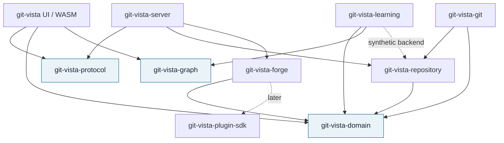
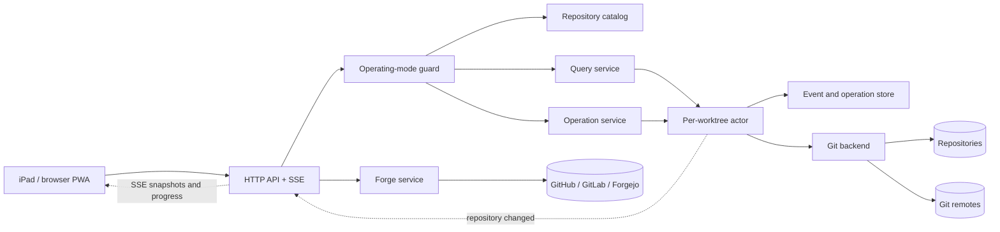
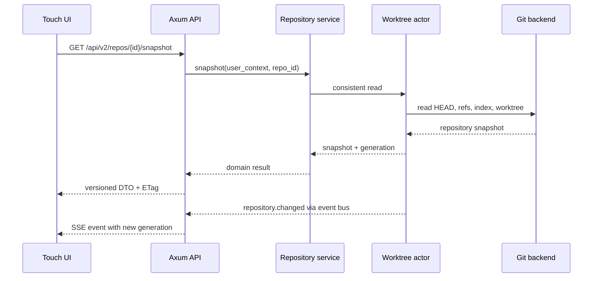
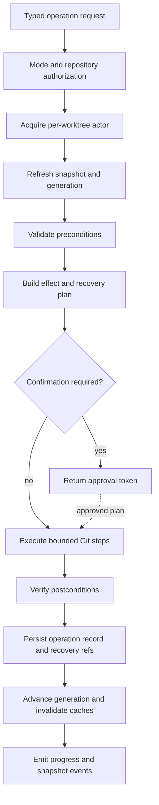

# Git-Vista V2 Architecture

Status: proposed

This document defines the target architecture for Git-Vista as a serious,
local-first, browser-based Git client. The primary product is a professional
client for an individual developer using an iPad to work with repositories on a
Linux machine. Teaching capabilities are built on the same operation and event
model; they do not define the base architecture.

## Product Boundary

Git-Vista V2 is:

- A professional Git client whose frontend happens to be a web application.
- Touch-first, Apple Pencil-aware, and usable with a keyboard and mouse.
- Local-first and single-user by default.
- Designed to run beside the repositories it controls.
- Designed for remote Linux access through SSH port forwarding.
- Self-hostable without requiring a Git-Vista cloud account.
- Extensible to GitHub, GitLab, Forgejo, and later forge providers.
- A platform on which teaching, simulation, and classroom features can be built.

Git-Vista V2 is not:

- A hosted source-code service.
- A replacement Git implementation.
- A remote shell exposed through a browser.
- A multi-user collaboration server in its default mode.
- An IDE or general-purpose code editor.
- An offline Git engine running inside WASM.

## Architectural Principles

1. **Git remains authoritative.** Repositories, refs, the index, worktrees, and
   standard Git recovery mechanisms remain the source of truth.
2. **The browser is a client platform, not a trust boundary.** All repository
   authorization and validation happen on the service.
3. **Queries and commands are different.** Reads may run concurrently from a
   consistent snapshot; mutations are serialized per worktree.
4. **Every mutation is typed.** The server never accepts arbitrary Git argv or a
   shell command from the browser.
5. **Destructive actions are previewed.** Plans state preconditions, effects,
   warnings, recovery options, and expected repository generation.
6. **Undo is evidence-based.** Git-Vista only offers undo when it has enough
   recorded state to perform a checked inverse safely.
7. **Touch is the baseline.** Hover and keyboard shortcuts enhance the product
   but never gate a workflow.
8. **Local-first stays simple.** Accounts, tenancy, and distributed locking do
   not enter V2 merely because future multi-user deployment is possible.
9. **Provider integrations are capabilities.** GitHub-specific data must not
   leak into the repository domain model.
10. **Teaching reuses professional semantics.** A simulator implements the same
    command contracts against a synthetic backend.

## Current Architecture Assessment

The existing four-crate workspace is appropriate for a visualizer prototype. It
correctly keeps native `gix` code out of the WASM build and places reusable graph
and transport models in a shared crate. That is a useful starting constraint, not
a sufficient V2 architecture.

The present pressure points are:

- `git-vista-core` combines wire models with unrelated graph, color, status,
  activity, diff, seed, and networking concepts. At larger scale it becomes the
  dependency everyone imports and therefore the crate nobody can change safely.
- `git-vista-server` owns HTTP routing, global repository selection, Git process
  execution, journal behavior, filesystem policy, and application workflows.
  New commands will repeat validation and recovery behavior unless an application
  operation layer is extracted.
- Browser DTOs are the shared domain model. Transport compatibility, internal
  invariants, and persistence evolution will become coupled.
- Mutation endpoints are command-shaped but do not yet share a typed,
  generation-checked operation pipeline or per-worktree coordinator.
- One globally selected repository cannot model a catalog, linked worktrees,
  concurrent tabs, or long operations cleanly.
- Frontend source modules separate several rendering concerns, but the product
  needs explicit repository-session, query, operation, reconnect, and adaptive
  navigation state boundaries before professional features multiply.

At 100,000 lines, the painful failure mode would not be compilation time first.
It would be cross-cutting changes: adding one rebase or worktree state would touch
shared DTOs, global server state, endpoint-specific Git spawning, journal strings,
and a large frontend state graph simultaneously. The target layout below is
designed to stop that coupling without introducing network services or empty
abstractions today.

## Risk Register

| Severity | Risk | Required response |
| --- | --- | --- |
| High | Current write endpoints remain unauthenticated; explicit `--lan` mode exposes them beyond loopback | Implement session/origin/CSRF controls and retire unauthenticated LAN writes before broader client claims |
| High | Endpoint-specific writes can race across tabs or external Git clients | Add repository generations, typed plans, idempotency, and per-worktree serialization |
| High | Contextual undo can overstate safety as operation breadth grows | Replace generic undo with checked recovery classes and durable evidence |
| High | Unbounded history/diff/process output can exhaust server or WASM memory | Page history, stream bounded content, virtualize, cancel, and enforce limits |
| Medium | Shared core models couple transport, domain, and frontend evolution | Extract domain and versioned protocol deliberately |
| Medium | Global current-repository state prevents correct worktree/catalog semantics | Introduce opaque catalog identities and worktree-scoped sessions |
| Medium | Blocking Git/gix work inside request handling reduces responsiveness | Put native operations behind explicit blocking pools/actors and cancellation policy |
| Medium | Desktop-shaped feature additions could make the iPad UI a cramped port | Establish adaptive shell and interaction rules before feature expansion |
| Medium | Early provider/plugin generalization could create abstractions without evidence | Build provider-neutral capabilities, then prove them with built-in adapters |
| Low now, High later | Multi-user assumptions could leak into the personal server without a threat model | Keep team mode separate until explicitly designed and funded |

These severities describe the gap between the current implementation and the
professional-client claim. They are not a claim that every target control is
already implemented.

## Target Crate Layout

The current four crates are a sound prototype layout. They are not sufficient
for a five-year client because shared models, transport types, application
workflows, and Git adapters will otherwise grow into one another.

```text
crates/
|-- git-vista-domain/       Pure value types and operation vocabulary
|-- git-vista-protocol/     Versioned HTTP/event DTOs and API errors
|-- git-vista-graph/        Pure DAG ordering, layout, color, and graph queries
|-- git-vista-repository/   Application services, ports, plans, operation log
|-- git-vista-git/          gix reads plus constrained Git CLI implementation
|-- git-vista-forge/        Forge capability API and built-in provider adapters
|-- git-vista-server/       Axum transport, modes, auth, routing, static PWA
|-- git-vista/              Leptos PWA and adaptive touch UI
|-- git-vista-learning/     Later: simulator, lessons, assessment contracts
`-- git-vista-plugin-sdk/   Later: versioned out-of-process plugin protocol
```

Do not create all crates immediately. Extract them in this order:

1. `git-vista-domain` and `git-vista-protocol` when the API is versioned.
2. `git-vista-repository` when the server state/router is made testable.
3. `git-vista-graph` when layout moves out of the miscellaneous core crate.
4. `git-vista-forge` when a second provider is implemented.
5. Learning and plugin crates only when their first production feature begins.

The existing `git-vista-core` becomes a migration source, not a permanent
catch-all. It should disappear or become a narrow compatibility facade by 2.0.

## Crate Dependency Diagram



Dependency rules:

- `domain`, `protocol`, and `graph` compile for WASM and have no Tokio, Axum,
  filesystem, Leptos, or `gix` dependencies.
- `repository` owns use cases and ports, never HTTP details.
- `git` implements repository ports. It does not know about Axum or UI DTOs.
- `server` translates transport requests into application commands.
- `ui` never sees filesystem paths, child-process output, or credentials.
- `forge` depends on provider-neutral domain types and exposes capabilities.

## Service Diagram



For V2, these are logical services inside one process. Do not introduce network
microservices. The service boundaries exist for testing, ownership, and later
deployment choices, not for operational complexity.

## Core Domain Model

The domain should name Git concepts rather than HTTP endpoints:

```rust
pub struct RepositoryId(Uuid);
pub struct WorktreeId(Uuid);
pub struct RepositoryGeneration(u64);
pub struct ObjectId(String); // Validated algorithm + hex on construction.

pub struct RepositorySnapshot {
    pub repository: RepositoryId,
    pub worktree: WorktreeId,
    pub generation: RepositoryGeneration,
    pub head: HeadState,
    pub status: WorktreeStatus,
    pub refs: Vec<RefSummary>,
    pub operation: Option<InProgressOperation>,
}

pub enum GitOperation {
    Stage(StageSpec),
    Unstage(UnstageSpec),
    Commit(CommitSpec),
    CreateBranch(CreateBranchSpec),
    Checkout(CheckoutSpec),
    Fetch(FetchSpec),
    Pull(PullSpec),
    Push(PushSpec),
    Stash(StashSpec),
    CherryPick(CherryPickSpec),
    Rebase(RebaseSpec),
    ResolveConflict(ResolveConflictSpec),
    Worktree(WorktreeSpec),
    Bisect(BisectSpec),
}
```

An operation enum is preferable to one trait per Git verb. The enum provides a
closed, auditable command vocabulary; operation-family services can still use
internal traits where implementations genuinely vary.

## Repository Abstraction

Avoid a single enormous `Repository` trait. Split ports by responsibility:

```rust
#[async_trait]
pub trait RepositoryReader {
    async fn snapshot(&self, worktree: WorktreeId) -> Result<RepositorySnapshot>;
    async fn history(&self, query: HistoryQuery) -> Result<HistoryPage>;
    async fn diff(&self, query: DiffQuery, sink: &mut dyn ByteSink) -> Result<DiffMeta>;
    async fn blame(&self, query: BlameQuery) -> Result<BlamePage>;
}

#[async_trait]
pub trait OperationPlanner {
    async fn plan(&self, request: OperationRequest) -> Result<OperationPlan>;
}

#[async_trait]
pub trait OperationExecutor {
    async fn execute(
        &self,
        approved: ApprovedPlan,
        progress: &dyn ProgressSink,
    ) -> Result<OperationResult>;
}
```

The concrete Git adapter should use:

- `gix` for object reads, refs, revision traversal, and other mature read paths.
- The system `git` executable for porcelain-sensitive writes and complex
  sequencer operations until a pure-Rust implementation is demonstrably safer.
- Machine-readable Git output (`-z`, porcelain v2, explicit formats).
- `git credential` helpers for remote authentication, never credentials sent by
  the browser with every request.
- Repository discovery through Git/gix, including git-dir and common-dir, rather
  than assuming `.git` is a directory.

## Request Flow



The browser addresses repositories by opaque `RepositoryId`, never arbitrary
paths. The repository catalog maps IDs to canonical, allowlisted paths.

## Git Operation Pipeline

All mutations use the same pipeline:



An `OperationPlan` contains:

- The repository and worktree IDs.
- The expected repository generation.
- Normalized operation parameters.
- Preconditions such as clean worktree, attached HEAD, or upstream existence.
- A human-readable effect summary.
- A structured list of refs/files/commits expected to change.
- Risk classification: read-only, reversible, history-rewriting, destructive,
  remote-visible, or credential-requiring.
- Recovery strategy and whether automatic undo can be offered.
- A short-lived approval token bound to the plan hash and generation.

Execution rejects a stale approval token rather than applying an old plan to a
new repository state. Every request also carries an idempotency key so a mobile
reconnect cannot accidentally repeat a commit, push, or branch operation.

## Concurrency Model

- One actor/queue exists per worktree, not one global mutex for the process.
- Mutations for a worktree are strictly serialized.
- Read queries may run concurrently against a captured generation.
- Operations affecting shared refs across linked worktrees acquire the repository
  coordination lock in addition to the worktree actor.
- Long network operations report progress but retain a clear cancellation policy.
- UI tabs are untrusted concurrent clients. Generation checks prevent stale tabs
  from mutating state silently.
- External terminal changes are expected. A filesystem watcher is only a hint;
  the service always re-reads authoritative Git state before planning a command.

## Undo and Recovery Model

Do not market a universal Undo button. Use four explicit recovery classes:

| Class | Examples | Recovery |
|---|---|---|
| Direct inverse | Stage/unstage, create/delete unpushed branch | Checked inverse with generation/CAS |
| Ref restoration | Commit, reset, rebase, local branch delete | Retained recovery ref plus checked ref update |
| Safety checkpoint | Checkout/rebase with dirty worktree | Explicit autostash/checkpoint created before execution |
| Not automatically reversible | Push, force-push, PR comment, remote delete | Explain remediation; never claim one-click undo |

Replace the JSONL journal with a small transactional store, likely SQLite in the
application state directory. Store operation ID, actor, timestamps, typed request,
plan hash, before/after generations, relevant object IDs, step outcomes, and undo
eligibility. Retain recovery objects under names such as
`refs/git-vista/recovery/<operation-id>` with a documented expiry policy.

Undo is itself a planned `GitOperation`. It must verify that current refs and the
worktree still satisfy the inverse plan. If they do not, it offers a manual
recovery explanation instead of forcing state backward.

## Query, Cache, and History Model

- Replace the fixed 5,000-commit response with `HistoryQuery` and `HistoryPage`.
- Cursor by a stable traversal continuation, not an array offset alone.
- Return commits, refs, and topology data; calculate presentation layout in the
  WASM-safe graph crate so filtering and orientation do not require a server call.
- Cache immutable objects by OID and mutable snapshots by repository generation.
- Use ETags for snapshots and history pages.
- Stream bounded diff/file content instead of buffering complete child output.
- Add server-side search indexes only after Git-native queries are insufficient.

## Plugin and Forge Architecture

V2 provider support should be built-in adapters behind a capability interface:

```rust
pub trait ForgeProvider {
    fn capabilities(&self) -> ForgeCapabilities;
    async fn repository(&self, remote: &RemoteIdentity) -> Result<ForgeRepository>;
    async fn change_requests(&self, query: ChangeRequestQuery) -> Result<Vec<ChangeRequest>>;
    async fn create_change_request(&self, spec: CreateChangeRequest) -> Result<ChangeRequest>;
    async fn checks(&self, revision: &ObjectId) -> Result<Vec<CheckRun>>;
}
```

Use provider-neutral language internally (`ChangeRequest`) while preserving the
provider's user-facing term (pull request or merge request). GitHub, GitLab, and
Forgejo have authenticated APIs suitable for this boundary.

Do not load arbitrary Rust dynamic libraries into the Git-Vista process. A later
third-party plugin system should be out-of-process JSON-RPC over stdio or a WASI
sandbox with a versioned SDK, declared permissions, bounded resources, and no
direct repository or credential access. First prove the interface with three
built-in forge adapters.

## Synchronization and Live Updates

V2 synchronization means keeping one user's tabs aligned with repository state;
it does not mean cloud synchronization.

- POST/PUT endpoints submit commands.
- Server-Sent Events deliver snapshot invalidations, progress, completion, and
  forge-status changes. SSE is preferable to a mandatory WebSocket because it
  reconnects naturally and the command direction already uses HTTP.
- Events carry repository ID, generation, operation ID, and monotonic sequence.
- `Last-Event-ID` supports reconnect without inventing distributed consensus.
- A tab that misses the event retention window fetches a fresh snapshot.
- Multi-device preference sync is deferred; export/import a settings file first.

## Offline and PWA Model

The PWA can be useful offline without pretending to be a Git client offline:

- Cache the versioned application shell and static assets.
- Store UI preferences and optionally recent graph metadata in IndexedDB.
- Mark every cached repository view with its generation and last-updated time.
- Disable all repository and forge mutations while disconnected.
- Never queue commit, push, rebase, or conflict-resolution requests for replay.
- Do not cache private file contents or diffs by default; make any offline content
  cache explicit, bounded, erasable, and documented.
- On reconnection, discard stale operation plans and reconcile snapshots.
- Provide a manifest, standalone display mode, icons, safe-area handling, and an
  update flow that does not strand an old UI against a new API version.

Home Screen web apps on current iPadOS can use service workers and web push, but
push is an optional notification enhancement, not a correctness mechanism. See
[Apple's web push documentation](https://developer.apple.com/documentation/UserNotifications/sending-web-push-notifications-in-web-apps-and-browsers).

## Migration Strategy

### Stage A: Make the current server testable

- Move router construction into a library.
- Replace `OnceLock` state with explicit `AppState`.
- Capture one repository handle per request.
- Add a per-worktree mutation queue and route integration tests.

### Stage B: Introduce domain and protocol

- Define validated IDs, snapshots, typed errors, API versioning, and generation.
- Convert one feature family at a time; do not perform a flag-day rewrite.
- Keep compatibility endpoints until the V2 frontend has migrated.

### Stage C: Introduce operation planning

- Start with branch, stage, commit, checkout, and reset operations.
- Add effect previews, idempotency keys, operation records, and recovery refs.
- Convert rebase and reset only after the pipeline is proven.

### Stage D: Move layout and add pagination

- Extract the graph crate.
- Return incremental history pages.
- Build client-side graph extension and search/filter UX.

### Stage E: Expand the client

- Implement feature groups in `GIT_CLIENT_ROADMAP.md`.
- Add forge adapters only after daily local Git work is reliable.
- Add the learning backend after operation contracts are stable.

## Rejected Alternatives

- **Tauri as the primary client:** loses the zero-install iPad and display story.
- **One handler per Git command forever:** duplicates validation, locking, errors,
  progress, recovery, and tests.
- **Pure `gix` for all writes immediately:** increases correctness risk for complex
  porcelain before the product has sufficient conformance tests.
- **Arbitrary Git command endpoint:** turns a local service into remote code
  execution and makes the UI protocol impossible to reason about.
- **Microservices:** unnecessary operational cost for a local-first application.
- **Multi-user tenancy in V2:** not justified for the primary personal workflow.
- **Offline mutation replay:** stale Git operations are unsafe and non-idempotent.
- **In-process third-party plugins:** an unacceptable repository and credential
  trust boundary for a self-hosted Git client.

## Definition of V2 Architectural Success

V2 architecture is successful when:

- A full daily workflow can be completed from an iPad through an SSH tunnel.
- Every mutation is typed, serialized, previewable where risky, and tested.
- A stale tab cannot silently overwrite newer repository state.
- Linked worktrees and external terminal changes are first-class.
- History and diffs scale without fixed whole-repository payloads.
- GitHub, GitLab, and Forgejo can be integrated without provider types entering
  core Git services.
- The same professional operation model can drive a synthetic teaching repo.
- No cloud account or multi-user subsystem is required for the primary product.

## References

- [Git worktree documentation](https://git-scm.com/docs/git-worktree.html)
- [W3C Pointer Events](https://www.w3.org/TR/pointerevents3/)
- [GitHub pull request API](https://docs.github.com/en/rest/pulls/pulls)
- [GitLab merge request API](https://docs.gitlab.com/api/merge_requests/)
- [Forgejo API usage](https://forgejo.org/docs/latest/user/api-usage/)
