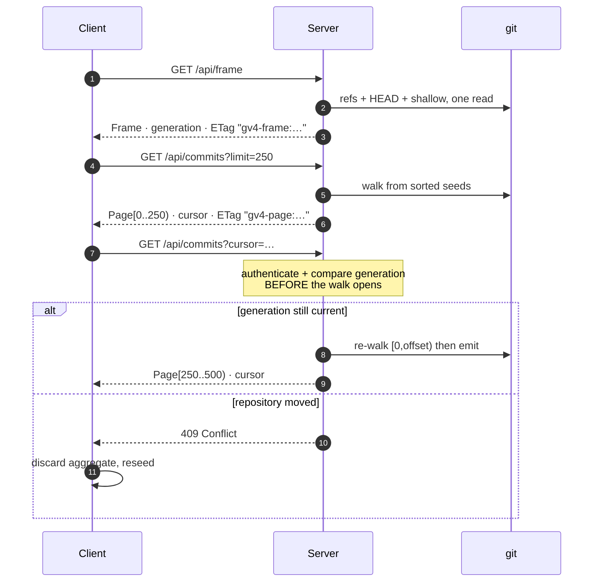
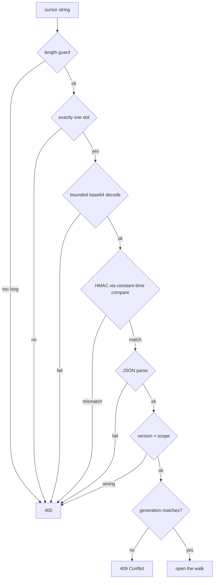

# 0022 — Paged history and bounded reads

- **Status:** Accepted
- **Date:** 2026-07-26
- **Milestone / issue:** M1.10 — Introduce Paged History and Bounded Diff APIs (#63)
- **Supersedes:** nothing. **Amends:** the 5,000-commit ceiling assumed by earlier
  read paths.
- **Related:** [0012](0012-unscrollable-shell-and-camera-navigation.md) (camera
  navigation), [0018](0018-plan-staleness-enforcement.md) (generation tokens for
  writes), [0021](0021-durable-operation-journal-and-recovery-refs.md).

## Context

Git-Vista loaded history in one shot. Every read — the graph, a diff, a file at a
commit — buffered its entire result in memory before answering, and the graph walk
stopped dead at 5,000 commits. Three problems followed from that shape:

1. **A hard cliff.** A repository past 5,000 commits was silently truncated. The
   user was not told; the history simply ended.
2. **Unbounded memory.** A large diff or a big file could be read entirely into
   the server's address space. On the target hardware — an 8 GB box serving an
   iPad over an SSH forward — that is a denial of service against the machine the
   user is sitting at.
3. **No way to say "this is still the same history."** A client holding half a
   graph had no way to know the repository had moved underneath it.

The obvious fix — keep a server-side session holding an open walk per client —
was rejected. It puts unbounded, client-controlled state in a process that is
supposed to be a thin view over git, and it makes correctness depend on session
lifetime rather than on the repository.

## Decision

**Paging is stateless. The entire server-side state of a scroll is one signed
integer.**

A read is split into two resources:

- **Frame** — refs, branch colours, HEAD, repository metadata. Cheap, no commits.
- **Page** — one window of rows, edges and stubs, plus a cursor for the next.

Both carry a **generation token**, `history-v1:<decimal>`, digested from the
recipe discriminator, both halves of HEAD keyed by full symbolic name, every ref
under its full name, and one field per shallow boundary. A cursor is a fixed-size
signed offset — no retained walk, no session, no server memory that grows with
the number of connected clients.

### Cursors are signed, and validated before any work

A cursor is `BASE64URL(json) "." BASE64URL(HMAC-SHA256 tag[0..16])`. It is
checked in a fixed order, cheapest and most hostile first:

A forged, foreign or stale cursor costs one HMAC and never opens a repository
walk. Scope mismatch deliberately returns the generic 400, not a distinguishing
error: a client probing for other repositories must not learn whether it guessed
a real target.

### ETags are strong, and type-separated

Each representation is hashed over **the exact bytes sent** — `"gv4-frame:<hex>"`
and `"gv4-page:<hex>"`. The prefixes are not decoration. A Frame and a Page that
happened to serialise identically are still different resources with different
conditional semantics, so one must never satisfy the other's `If-None-Match`.
This is enforced, and drives live: a Page offered the Frame's ETag returns 200
with a full body, not 304.

### Reads are bounded and cancellable

`git_stdout_capped` streams and enforces a cap per read kind — 8 MiB of diff
metadata (413 past that), 200 KB per patch within a 5 MB total, 2 MB for a file.
It uses `kill_on_drop`, so a client that disconnects mid-read kills the child
process instead of leaving it to finish into a buffer nobody will read.

### The client aggregate is all-or-nothing

The frontend validates a candidate page entirely in temporaries and commits only
if every check passes: contiguous row numbers, unique OIDs, unique edge
identities, forward edges, and destination-page ownership. A rejected page leaves
the aggregate byte-for-byte unchanged. Client-side geometry grows monotonically,
so an append can widen a label but never make an earlier row jump.

## Consequences

**Accepted costs.**

- **A full scroll is quadratic.** A page at row *n* re-walks `[0, n)` from the
  same seeds. Paging to the end of a 5,497-commit repository costs 22 walks, and
  the last is the whole history. This was chosen knowingly: predictable server
  memory is worth more than optimal scroll cost on a machine that is also running
  the user's desktop. If it ever hurts, the fix is a resumable checkpoint in the
  cursor, not a session.
- **A moving repository interrupts a scroll.** Any ref move, HEAD change or
  shallow deepen changes the generation and turns the next page into a 409. The
  client discards and reseeds. This is deliberate: silently splicing pages from
  two different histories would produce a graph that never existed.
- **Protocol 4 is a hard break.** The compatibility window is `[4, 4]`; an older
  client is told to upgrade rather than served a shape it will misread.

**What this buys.**

- No 5,000-commit cliff. Drive-verified: 5,497 commits, 22 pages, rows contiguous
  `0..5496`, zero duplicate commits, zero duplicate edges.
- Server memory independent of both repository size and client count.
- A generation that covers the shallow boundary set, so a repository that
  deepened underneath a cursor is caught even though no ref moved.

## Alternatives considered

| Alternative | Why not |
| --- | --- |
| Server-side walk sessions | Unbounded client-controlled state; correctness becomes a function of session lifetime rather than of the repository. |
| Cursor carries the traversal frontier | Tried and reverted (D15 → corrective amendment). `gix` cannot resume correctly from a frontier alone; the resulting order was not reproducible. |
| Weak ETags / no validators | Loses conditional requests entirely, and `Cache-Control: no-store` alone gives the client no way to revalidate cheaply. |
| Raise the commit ceiling to a bigger number | Moves the cliff, does not remove it, and leaves memory unbounded. |
| Timestamp or index-based cursors | Not stable under rewrite; a rebased history silently changes what a cursor means. A signed offset plus a generation cannot drift undetected. |

## Deviations from the plan, accepted

1. **Edge validation order.** The plan numbers identity-uniqueness before
   forwardness and destination-page ownership, but its own prose and its own test
   name require a repeated prefix edge to report `EdgeDestinationOutsidePage`.
   Under the literal order it would report `DuplicateEdge`. Implemented as
   forward → destination → identity; all seven checks still run, still in
   temporaries, still before any mutation. Only the error a *doubly*-invalid edge
   reports differs. See `crates/git-vista/src/history.rs:269`.
2. **Paged `lane_offset` uses row-order numbering** (D18), not the legacy
   priority-sorted seed order, so a stub's column is computable from the page it
   arrives in.
3. **`HistorySnapshot::resolved_head` is read only by tests.** Kept because the
   snapshot is specified to pin both halves of HEAD; marked
   `#[cfg_attr(not(test), allow(dead_code))]` rather than deleted or
   blanket-allowed.

## Where this is implemented

| Concern | Path |
| --- | --- |
| generation, ETags, cursor codec | `crates/git-vista-server/src/history.rs` |
| Frame/Page handlers | `crates/git-vista-server/src/handlers/read.rs` |
| bounded, cancellable git reads | `crates/git-vista-git/src/lib.rs` (`git_stdout_capped`) |
| resumable layout | `crates/git-vista-core/src/layout/stream.rs` |
| wire types | `crates/git-vista-protocol/src/history.rs` |
| client aggregate + invariants | `crates/git-vista/src/history.rs` |
| live evidence | `docs/superpowers/evidence/2026-07-25-m1.10-live-drive.md` |

---

**Signed:** thomas2025 · 2026-07-26
