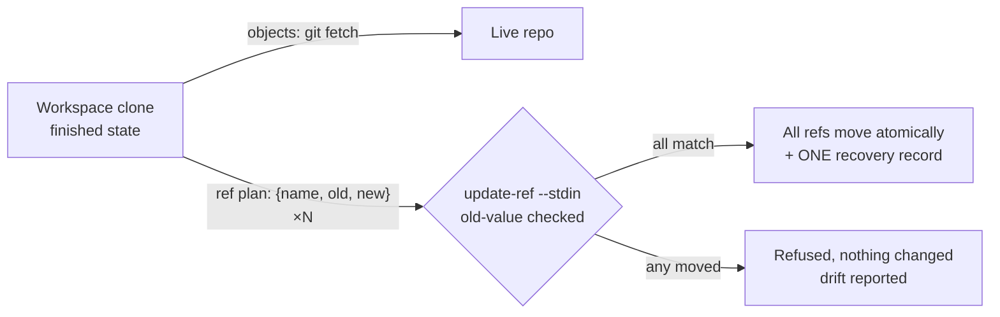

# ADR 0023 — Rehearsal workspaces promote results, atomically

- **Status:** Proposed — direction accepted 2026-07-27; implementation scheduled
  after M1.11 (#64)
- **Date:** 2026-07-27
- **Milestone / issue:** post-M1.11 direction (issue to be opened when the
  milestone band is cut)
- **Supersedes / superseded by:** — (builds on ADR 0015/0016/0018/0019/0020/0021's
  write pipeline and ADR 0008's persistent clones; extends ADR 0005's structural
  read-only-ness from the LAN listener to the live repo itself)

## Context

The operator's real workflow is not "mutate the live repo carefully" — it is
"rehearse the surgery somewhere disposable, then make it real once it's right."
Today git-vista offers only the careful-mutation model: every operation acts on
the served repo directly, and undo reverses one operation at a time because each
operation only knows how to reverse itself.

Three pressures converge:

1. **Complex operations want a rehearsal space.** A multi-step rebase/merge/
   cleanup sequence should be attemptable, inspectable and discardable without
   the live repo ever being at risk.
2. **Undo wants to be one action.** After a rehearsed sequence goes live, "put
   everything back" should not require unwinding N operations in reverse order,
   each with its own preconditions and its own ways to fail mid-unwind.
3. **The credential story wants a smaller target.** A token that authorizes
   *any* write is a big secret. A token that authorizes exactly one atomic,
   undoable operation is a small one — and the operator wants read-only to be
   the default mode, with the sign-in token never printed to a terminal at all.

## Decision

Adopt the **rehearsal workspace** model: work happens in a managed clone; the
live repo is served read-only; one privileged operation — **promotion** —
moves the finished state onto the live repo.

### Promotion transplants the result, never replays commands

The workspace's command history is an audit record, not an execution plan.
Promotion is:

1. `git fetch <workspace-path>` — the objects travel (local path remote).
2. One atomic ref transaction — `git update-ref --stdin` with **old-value
   checks** on every ref being moved. All refs move or none does; the
   transaction refuses if any ref is not where the promotion plan recorded it.

Replaying the rehearsed command list against live would mean N re-executions,
each able to fail against a repo that moved, with half-applied history surgery
as the failure mode. The workspace already holds the finished state; moving
state is one step, moving *process* is N.

### One promotion ⇒ one recovery record ⇒ undo-all

Because promotion is a single ref transaction, its recovery strategy (ADR 0021)
is a single record — the pre-promotion OID of every moved ref — applied as one
old-value-checked transaction in the other direction. The operator's requested
"master undo-all" is therefore promotion's *native* undo, not a new mechanism
layered over per-operation undo.

### Drift refuses, first

If live moved since the promotion plan was built, promotion refuses — the
generation gate (ADR 0018) plus the transaction's own old-value checks, which
enforce it even against races inside the execution window. Presenting the drift
and offering choices is future work; auto-rebasing the promotion is rejected
(it reintroduces replay's partial-failure problem).

### Read-only becomes structural for the live repo

The live repo's serve mode registers no write routes — the same mechanism that
makes LAN sessions read-only today (ADR 0005), now applied by repo role rather
than by listener. Promotion is the one privileged route, guarded by the strong
credential; absent that credential the app falls closed to a fully functional
read-only view. The sign-in token stops being printed to the terminal
(delivery mechanism to be designed; the operator already runs a 0600-file
Docker wrapper pattern for secrets of this shape).

## Alternatives considered

- **Replay the rehearsed command list onto live.** Rejected: N failure points,
  partial-application failure mode, and undo-all becomes an N-step unwind that
  can itself strand. Kept only as the audit display and as input to a future
  re-plan flow.
- **Auto-rebase the promotion when live drifted.** Rejected for now: same
  partial-failure shape as replay. Refusal is honest and cheap; choice UIs can
  come later.
- **Mutate live directly, harder (status quo).** Rejected as the *default*
  workflow by the operator's own usage: rehearse-then-promote is how he already
  works with clones by hand.
- **Shared object store for workspaces (`--shared`/`--reference`) from day
  one.** Deferred: real `gc` pruning hazard against the origin. Plain clones
  first; sharing is an optimization that needs its own safety argument.

## Consequences

- The write pipeline (ADR 0015–0021) gains one operation kind: promotion. It
  is planned, guarded, journaled, idempotent and streamed like every other
  write — nothing about the pipeline changes shape.
- The M1.11 frontend operations store gains its most important customer: a
  promotion in flight, its outcome, and its one-touch undo are exactly the
  state it was built to hold.
- Live-repo write routes eventually disappear from the default serve mode —
  a breaking change to be sequenced deliberately, not slipped in.
- Workspace lifecycle (creation, naming, cleanup), promoted-ref scope, and the
  no-print token delivery are open sub-designs; the milestone that implements
  this ADR must resolve them.
- The #64 plan reserved "ADR 0023" for the frontend feature boundaries record;
  that record now lands as **ADR 0024** (numbers are assigned at creation
  time).

## Where this is implemented

Not yet implemented. Direction record; the full design conversation and
diagrams live in `design-docs/2026-07-27-rehearsal-workspace-promotion.md`
(untracked working note). Implementation begins after M1.11 (#64) closes.

**Signed:** thomas2025 · 2026-07-27T01:44:04-04:00
