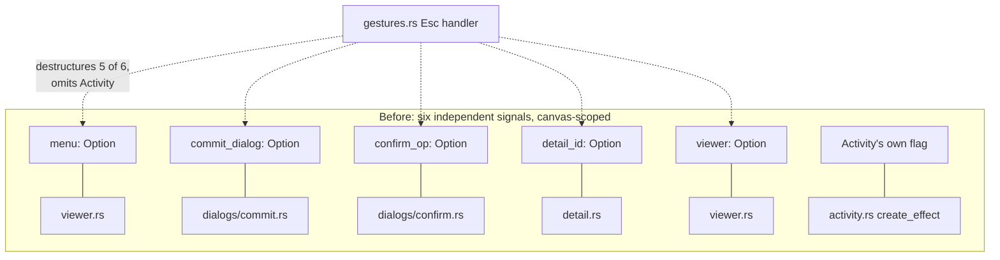
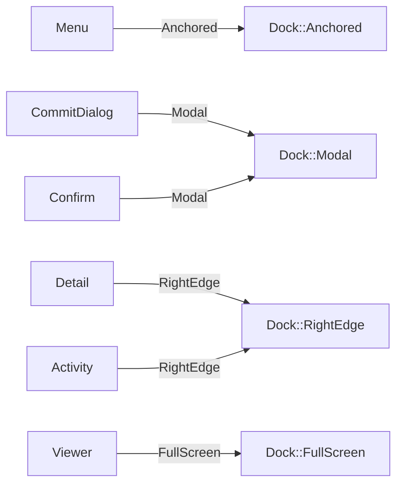
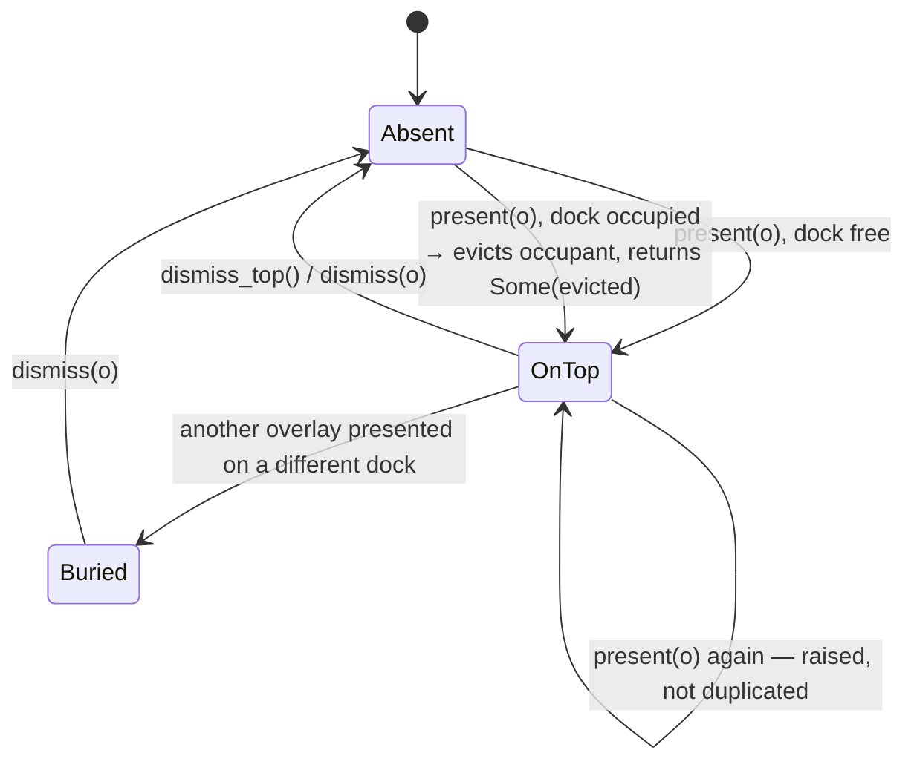
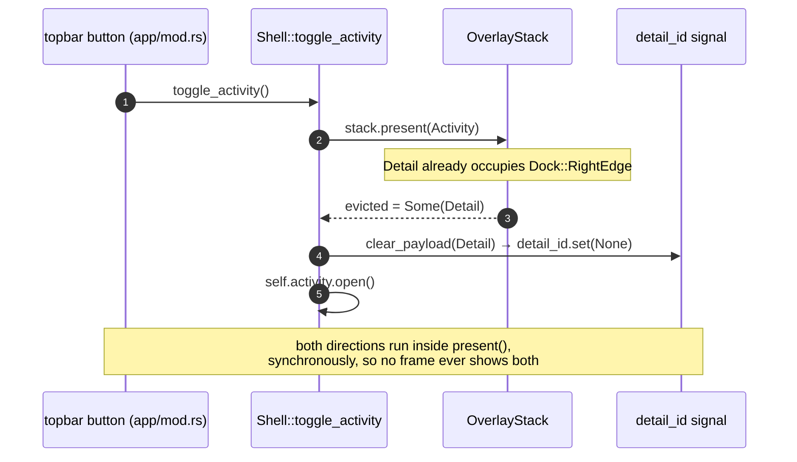
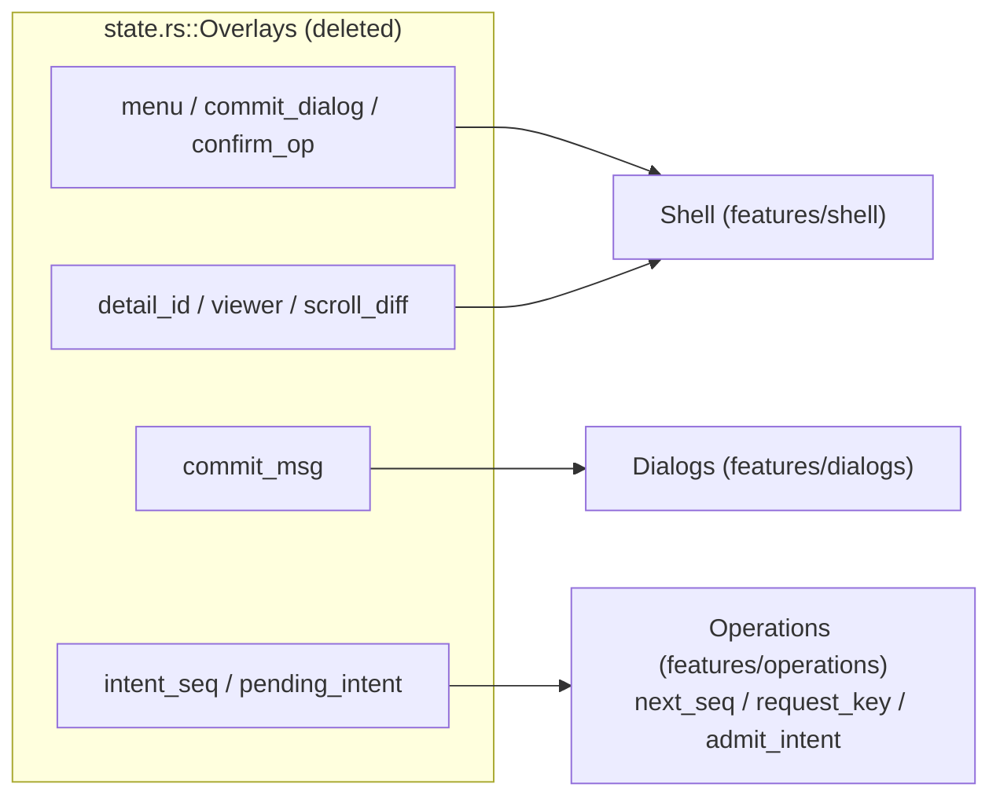
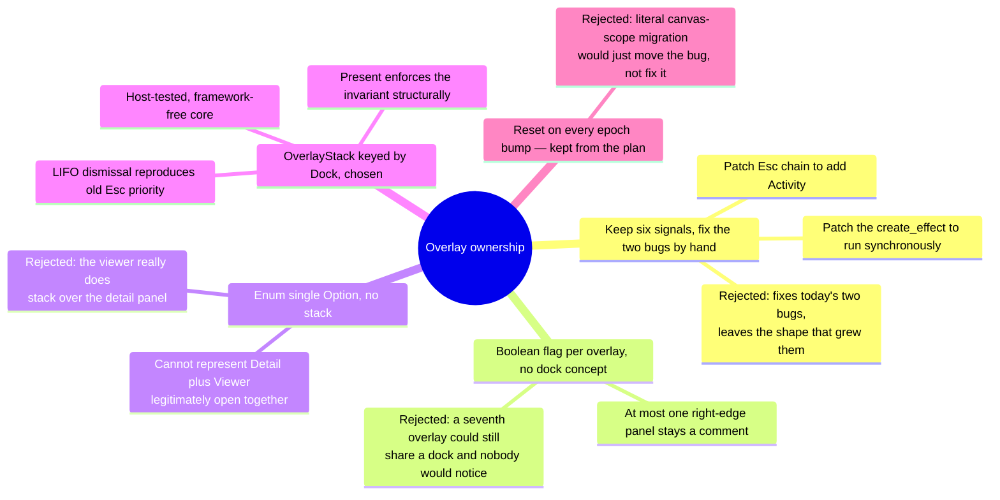

# 0024 — Frontend overlay state moves into a `Dock`-keyed `OverlayStack`

- **Status:** Accepted
- **Date:** 2026-07-27
- **Milestone / issue:** M1.11 — Refactor frontend state into feature boundaries (#64)
- **Supersedes:** nothing. **Amends:** the ad-hoc `Overlays` bundle in `state.rs` that
  held six independent overlay signals with no rule tying them together.
- **Related:** [0012](0012-unscrollable-app-shell.md) (the app shell), ADR 0005 /
  0014 (LAN-view read-only affordances — see "Where this is implemented" for the
  session-side half of this refactor).

## Context

Before M1.11, "what's currently covering the canvas" had no single owner. Six
independent signals played that role — `Overlays::menu`, `commit_dialog`,
`confirm_op`, `detail_id`, `viewer`, and `Activity`'s own open flag — each opened
and closed by whichever call site happened to touch it, all born inside canvas
scope so an epoch bump destroyed and recreated them.

Two bugs fell straight out of that shape, and neither was a one-off mistake —
both were structural:

1. **Esc could not close the Activity panel.** `gestures.rs`'s Esc handler
   destructured `menu, commit_dialog, confirm_op, detail_id, viewer` in a
   hand-written five-way `if/else if` chain. Activity was simply the field
   nobody remembered to add — there was no list of overlays to be incomplete
   against.
2. **Two right-edge panels could render together for one frame.** The Activity
   panel and the commit detail panel both dock the right edge of the screen.
   `Overlays::open_detail_panel` closed Activity *synchronously* when the
   detail panel opened. The reverse direction ran from a `create_effect` in
   `activity.rs` that fired one reactive tick *after* Activity's visibility
   flipped — so opening Activity while the detail panel was open left both
   visible for a frame, and the asymmetry between "synchronous" and "next
   tick" was exactly the kind of fact that stops being true the next time
   either call site is touched.

## Decision

Give every overlay a single stack, keyed by **where it docks**, and make
"at most one overlay per dock" a type-level invariant rather than a habit
maintained by hand at each call site.

### `Overlay` and `Dock` — framework-free, host-tested

`Overlay` (`Menu`, `CommitDialog`, `Confirm`, `Detail`, `Viewer`, `Activity`)
maps to one of four `Dock`s (`RightEdge`, `Modal`, `Anchored`, `FullScreen`).
Two overlays that resolve to the same dock cannot coexist; two on different
docks can — which is exactly how the context menu (`Anchored`) legitimately
floats over a right-docked panel today.

`OverlayStack::present` is the *only* way to add an overlay:

Dismissal is LIFO (`dismiss_top` pops the last element), which reproduces the
priority the old hand-written Esc chain spelled out — viewer, then menu, then
modals, then detail panel — not by copying that order as a constant but
because it is exactly the order the real open sequences produce: the viewer
only ever opens *from* an already-open detail panel, a modal only ever opens
over whatever else is up. The one thing that *changes* rather than reproduces:
Activity is now reachable by Esc at all.

### `Shell` — the one place the stack and the payloads move together

`features/shell/signals.rs`'s `Shell` holds the stack signal plus the six
overlay payload signals (`menu`, `commit_dialog`, `confirm_op`, `detail_id`,
`viewer_doc`, and a handle to `Activity`), **all private**. The public entry
points that touch the stack are `open_*` and `toggle_activity` (which call
`present`), `close_*` (which call `dismiss`), `dismiss_top`, and reads.
`present`, `dismiss` and `dismiss_top` are the only three functions that call
`clear_payload`, so a payload can never go stale relative to what the stack
says is showing.

That sequence is the fix for bug 2 above: before M1.11, "Activity evicts
Detail" ran a tick late because it lived in a `create_effect`; now both
directions of right-edge eviction are the same code path, `present`, so
there is no asymmetry left to drift.

### Where the six overlay signals now live

`Overlays` is gone from `state.rs`. Its thirteen fields are re-homed:

`Features` gains `shell` and loses `activity` — it is one of the six overlays
now, though `App` still holds the `Activity` handle directly too, because the
shared status read keys on it.

## Consequences

1. **Esc closes the Activity panel.** Proven by a host-side test
   (`escape_dismisses_the_activity_panel`), not just fixed by inspection.
2. **The two right-edge panels can never both be visible.** Both eviction
   directions run through the same synchronous `present`; the frame where
   both used to render is gone by construction, not by timing luck.
3. **Overlays now survive an epoch bump — a deliberate behavior change.**
   `Shell` is created once in `App`, above `graph_canvas`, for the same
   reason `Features` is. Before M1.11 the detail panel, viewer, menu and
   modals lived inside canvas scope and were destroyed on every epoch
   rebuild; now they are not. The detail panel's `Resource` re-keys and
   refetches on its own, so it self-heals or shows an honest error if the
   commit is gone across the rebuild. Same reasoning covers the commit draft
   (`commit_msg`) and the click-ordering pair: the old canvas-scope comment
   argued reset-on-rebuild was correct, but not resetting is equally correct
   here, because an intent from a previous epoch already fails
   `RequestKey::is_current` and sequences only increase — nothing downstream
   depends on the reset actually happening.
4. **`present` returns `Option<Overlay>`, not `()`.** This was a deliberate
   API choice, not an oversight: a `()` return would let eviction happen
   silently, and the caller — `Shell`, in this case — must know exactly
   which overlay was evicted so it can blank that overlay's payload signal.
   A silent eviction would leak a stale payload (e.g. a detail panel's commit
   id lingering in `detail_id` after Activity evicted it from the screen).
5. **`Dock` is new vocabulary the original plan did not name.** It is what
   turns "two overlays that occupy the same place cannot both be visible"
   into a type the compiler can check, instead of a rule stated only in a
   comment at each of four call sites.
6. **This is a client-side, host-testable refactor.** `core.rs` has no
   `wasm32` dependency and its eleven tests (including
   `at_most_one_overlay_per_dock_after_any_sequence`, which drives a mixed
   sequence of presents and dismisses and asserts the invariant on the
   resulting end state) run natively.
   `signals.rs` is `#[cfg(target_arch = "wasm32")]` only — the invariant is
   proven off-target, the wiring is wasm-only glue.
7. **A parallel, smaller instance of the same idea landed in
   `features/session`.** The frontend's CSRF token and `via_lan` flag used to
   be two independent `thread_local!`s in `api.rs` with no rule tying them
   together. `SessionCore` now holds both and adds a typed rejection,
   `SessionRejection::UiModeChangeWhileLan`, so "a LAN-view session may not
   select Active mode" is answerable from one place instead of an ad-hoc
   check. See "Where this is implemented" and the `SECURITY_MODEL.md`
   annotation below — this reinforces, client-side, the write-boundary ADR
   0005/0014 already establish server-side; it does not change that
   boundary, which remains the LAN router's absent write routes.

## Alternatives considered

| Alternative | Why not |
| --- | --- |
| Patch the two bugs in place, keep `Overlays` | Fixes today's symptoms; leaves the shape — thirteen ungoverned fields — that produced them and will produce the next one. |
| A boolean/`Option` per overlay with no `Dock` concept | "At most one right-edge panel" stays a fact enforced by memory at each call site, exactly the failure mode this ADR exists to remove. |
| Reset overlay state on every epoch bump, as the plan's literal Step migration implied | Rejected as *the* fix for Task 6's deferred step — moving the six signals out of canvas scope necessarily changes when they die. The resource re-key argument (Consequence 3) makes not-resetting sound rather than merely convenient. |
| `present` returns `()` | Silent eviction — the exact shape of bug this ADR fixes for the *stack*, reintroduced one layer down for *payloads*. Rejected; see Consequence 4. |

## Deviations from the plan, accepted

1. **The plan's Step 1 test 2 could not be built as written.** It presents
   `Activity` then `Detail` and asserts Activity survives underneath. Under
   the eviction rule those two can never coexist — that *is* the fix. The
   test keeps its intent (LIFO dismissal) with a genuinely stacking pair,
   `Detail` then `Viewer` (the viewer really is opened *from* the detail
   panel). Test 3 likewise uses `Detail`/`Menu` — different docks, so nothing
   is evicted and the test is purely about raise-not-duplicate.
2. **`present` returns `Option<Overlay>`, not `()`.** See Consequence 4.
3. **Behavior change, deliberate: overlays now survive an epoch bump.** See
   Consequence 3. Before M1.11 the detail panel, viewer, menu and modals were
   destroyed on every canvas rebuild; now they are not, because moving the
   signals out of canvas scope has no other honest reading.
4. **`Dock` is new vocabulary the plan did not name.** It is what makes "two
   overlays that occupy the same place cannot both be visible" a type-level
   fact rather than a habit — see Consequence 5.

## Where this is implemented

| Concern | Path |
| --- | --- |
| `Overlay`, `Dock`, `OverlayStack`, eviction rule, 11 host tests | `crates/git-vista/src/features/shell/core.rs` |
| `Shell` — private payload signals, `present`/`dismiss`/`clear_payload` | `crates/git-vista/src/features/shell/signals.rs` (`#[cfg(target_arch = "wasm32")]`) |
| module wiring | `crates/git-vista/src/features/shell/mod.rs` |
| `Features` gains `shell`, loses `activity` as a direct field | `crates/git-vista/src/state.rs` |
| Esc → `shell.dismiss_top()`, replacing the five-way `if/else if` chain | `crates/git-vista/src/gestures.rs` |
| `Shell` created once, above `graph_canvas` | `crates/git-vista/src/app/mod.rs`, `crates/git-vista/src/app/canvas.rs` |
| call-site rewires (`menu.set(None)` → `shell.close_menu()`, 19 sites, etc.) | `crates/git-vista/src/menu.rs`, `detail.rs`, `viewer.rs`, `activity.rs`, `dialogs/commit.rs`, `dialogs/confirm.rs`, `render/nodes.rs`, `render/stubs.rs` |
| `commit_msg` re-homed | `crates/git-vista/src/features/dialogs/{core,signals}.rs` |
| `intent_seq`/`pending_intent` re-homed as `next_seq`/`request_key`/`admit_intent` | `crates/git-vista/src/features/operations/{core,signals}.rs` |
| the parallel `SessionCore` (CSRF token + `via_lan`, `SessionRejection::UiModeChangeWhileLan`) | `crates/git-vista/src/features/session/{core,signals}.rs`, wired from `crates/git-vista/src/session.rs`, `crates/git-vista/src/api.rs`, `crates/git-vista/src/picker.rs`, `crates/git-vista/src/app/mod.rs` |
| live evidence | `docs/superpowers/evidence/2026-07-27-m1.11-live-drive.md` (behaviours a/c/d driven live; b by code reading + host test) |

---

**Signed:** thomas2025 · 2026-07-27T09:00:00-04:00
