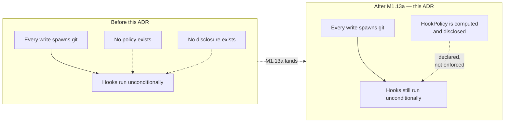
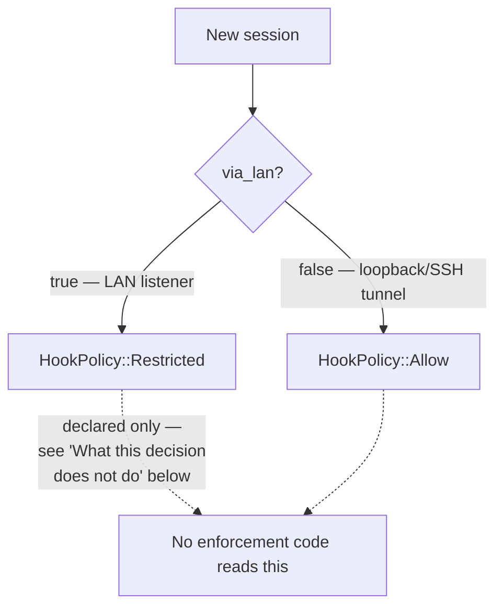
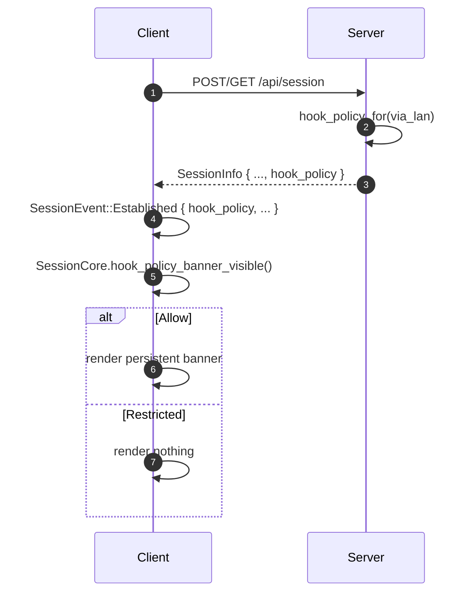

# 0025 — Hook policy: a declared, disclosed value, not yet enforced

- **Status:** Accepted
- **Date:** 2026-07-28
- **Milestone / issue:** M1.13a — hook policy + disclosure (#66, part of M1.13's
  round-4 verdict, `docs/superpowers/specs/2026-07-28-m1.13-round4-verdict.md` §7.3)
- **Supersedes:** nothing. **Amends:** nothing directly, but narrows
  `SECURITY_MODEL.md:236` from unimplemented prose to one implemented half.
- **Related:** [0015](0015-typed-operation-vocabulary-and-plan-schema.md) (closed
  vocabularies over booleans — the same reasoning `HookPolicy` follows),
  [0001](0001-repository-generation.md) (the additive-field, `#[serde(default)]`
  wire-compatibility convention this reuses for `SessionInfo.hook_policy`).

## Context

`SECURITY_MODEL.md:236` requires:

> Decide hook policy explicitly. Running repository hooks may execute arbitrary
> local code; local mode may allow them, but the UI must report that fact and
> Team mode should default to a restricted policy.

Before this ADR, **no code path anywhere in `git-vista-server` or `git-vista-git`
disabled, restricted, or even inspected repository hooks.** Every `git commit`,
`git merge`, and every other write this server spawns runs the repository's real
hooks, unconditionally — no `core.hooksPath` override, no `--no-verify`, no
policy of any kind. This ADR is not modifying existing hook-handling behaviour;
it establishes the first one.

Four earlier design rounds on M1.13 (the git-process-policy milestone this issue
belongs to) failed for the same underlying reason each time: a document or a plan
described more protection than the code actually delivered, and the gap between
the two was discovered late. The round-4 verdict's own diagnosis was that
`SECURITY_MODEL.md`'s "bounded, irreversible kernel restrictions" language was
being read as covering *hostile-repository* isolation — sandboxing what a
repository's own hooks and configuration can do to the host — when the model's
Known Non-Goals section (lines 367–368) had already declared that scope
explicitly out for Local mode. This ADR is written with that failure mode
directly in view: it says, in its own words below, exactly what is and is not
true of the code it describes.



## Decision

### `HookPolicy` — a closed, two-variant enum, not a `bool`

```rust
pub enum HookPolicy {
    Allow,
    Restricted,
}
```

Defined in `git-vista-protocol` (the wire-transport crate), alongside
`SessionInfo`. Not a `bool`, for the same reason ADR 0015 rejected booleans for
`GitOperation`: a closed, *named* vocabulary can grow a third state later — an
explicit per-hook allowlist is the obvious next step once M1.13b's sandbox
exists — without a breaking wire-format change. A `bool` would have to become an
enum eventually anyway; naming it now costs nothing and avoids that migration.

`HookPolicy::default()` is `Restricted` — a deliberate fail-closed choice, used
wherever the value might be legitimately absent (an older server's response
missing the field, deserialized by a newer client, via `SessionInfo`'s
`#[serde(default)]`; a frontend `SessionCore` that has not yet processed its
first `Established` event). If the value is ever unknown, assume the more
conservative one.

### The default: `via_lan` is a stand-in for "Team mode," which does not exist

`SECURITY_MODEL.md`'s own Operating Modes table lists Team mode as **future**,
not a V2 default. It does not exist in the codebase — there is no `Team` variant
anywhere in `git-vista-server`, only `RepoMode::{Active, Visualize}` (a
per-repository read-only distinction, unrelated to session trust) and a
session-level `via_lan: bool` (loopback/SSH-tunnel vs LAN-view, ADR 0005).

So the literal instruction — *"Team mode should default to restricted"* — has no
mode to key off yet. This ADR's decision: **use `via_lan` as the default's input,
narrowly and explicitly as a stand-in, not as an implementation of Team mode.**



The reasoning: a LAN-view session already carries reduced trust by construction
— a single-use bootstrap token, per-IP rate limiting (ADR 0005), and read-scoped
by the LAN router's own structurally-absent write routes (`main.rs` never
registers a write route on that listener at all). Defaulting `Restricted` there
is a defensible, narrow reading of "the less-trusted case should default
restricted," built from a distinction that is real and already load-bearing
elsewhere, rather than inventing new session state for this one purpose.

**This is explicitly a stand-in, not Team mode.** When Team mode is actually
designed and built, its own default plugs into the same `HookPolicy` type and
this `via_lan` mapping does not need to change to accommodate it — the type was
designed for that. A future ADR (not this one) is the right place to record what
Team mode's own default should be once it exists.

### Disclosure: API field plus a persistent banner, not a log line

`SECURITY_MODEL.md:236` requires the UI to *report* the fact, not merely record
it server-side.



- **API**: `hook_policy` is a field on `SessionInfo` — the same response the
  frontend already reads for `via_lan` and `csrf`, not a new endpoint. Additive
  (`#[serde(default)]`, no protocol version bump), matching the wire-compatibility
  convention `via_lan` itself already established (M1.02 rule).
- **UI**: a **persistent** top-of-viewport banner
  (`crates/git-vista/src/hook_policy_banner.rs`), shown for the whole duration a
  session is `Allow` — not a toast that disappears, not something buried in a
  settings panel. `Restricted` shows no banner, since nothing surprising is
  happening there *as disclosed* (see the caveat immediately below). The banner
  does not block interaction — a slim, non-modal bar, inline-styled the same way
  `update_required_view`/`not_connected_view` already are, so it needs neither a
  new `styles.css` rule nor a `features/shell/**` change (both under active,
  unrelated design work for #65 when this landed).

### What this decision does *not* do

**`HookPolicy` is declared and disclosed, not enforced.** Nothing in
`git_cmd.rs` or `git-vista-git` reads this value or suppresses hooks accordingly.
A session reporting `Restricted` today has its hooks run exactly as a session
reporting `Allow` would — the value correctly describes *intent*, not yet
*behaviour*. Real suppression (a `core.hooksPath` override, or an equivalent
mechanism, wired into the git-spawn chokepoint) is **M1.13b**, sized separately
in the round-4 verdict as the large sandbox piece (seccomp, Landlock, the argv
chokepoint, a 17-invariant escape-test battery) and explicitly not part of this
ADR's scope.

This is the exact gap the four earlier design rounds kept tripping on, stated
here in the ADR's own words rather than left implicit: **a reader of this
document alone must not come away believing hooks are actually restricted for
any session today.** They are not. What is true today is narrower and real:
the server now knows what policy *should* apply, and tells the user, honestly,
which one is currently in effect.

## Consequences

- `SECURITY_MODEL.md:236` is now genuinely half-satisfied: policy is decided and
  disclosed. The other half — actual enforcement — remains open, tracked as
  M1.13b.
- `SessionInfo`, `SessionCore`, and the two `session.rs` files (server and
  frontend) each gained one field/case, following patterns each already had
  (`via_lan`'s additive-field wire shape; `SessionEvent::Established`'s
  single-event-can't-half-apply shape from M1.11 #64).
- The banner appears for every loopback/SSH-tunnel session today, since `Allow`
  is the default there — this is expected and correct (that is genuinely the
  state SECURITY_MODEL.md:236 wants disclosed), not a bug to quiet by changing
  the default without also building real enforcement.
- Once M1.13b lands, `Restricted` becomes a real guarantee instead of a
  declaration, and this ADR's "not yet enforced" section becomes historical —
  worth a short amendment note at that point rather than editing this record.

## Alternatives considered

- **A `bool allow_hooks` field.** Rejected per ADR 0015's own reasoning: a
  boolean forecloses a future third state (per-hook allowlisting) without a
  breaking wire change. The cost of a named enum today is zero; the cost of
  migrating a `bool` later is a protocol version bump.
- **Invent a `SessionMode::Team` variant now, to satisfy the literal wording.**
  Rejected: `SECURITY_MODEL.md` itself lists Team mode as future work, not a V2
  requirement. Inventing it here — with no other part of the system that
  recognises it — would be exactly the "document says more than the code does"
  failure this ADR is written to avoid repeating a fifth time.
- **A dismissible toast instead of a persistent banner.** Rejected:
  `SECURITY_MODEL.md:236` says *"the UI must report that fact"*, present tense,
  for as long as the fact is true — a toast that disappears after a few seconds
  stops reporting it while the risk is still live.
- **Wait for M1.13b and ship policy + enforcement together.** Rejected by the
  round-4 verdict's own sizing (§7.3): M1.13a alone already satisfies the letter
  of `SECURITY_MODEL.md:236`, and M1.13b is large enough (a full sandbox, 17
  invariants, its own escape-test battery) that bundling them would have kept
  the disclosure half — the part users actually see — waiting on the much
  harder half for no requirement-driven reason.

## Deviations from the plan, accepted

- The task brief that produced this work sized `docs/RELEASE_GATES.md` and
  `SECURITY_MODEL.md` itself as forbidden territory for this task (already
  amended in a separate PR, #181, the same day) — this ADR is additive
  documentation only, consistent with that fence.

## Where this is implemented

- `crates/git-vista-protocol/src/dto.rs` — `HookPolicy`, `SessionInfo.hook_policy`.
- `crates/git-vista-server/src/handlers/session.rs` — `hook_policy_for(via_lan)`,
  wired into all three `SessionInfo` constructions
  (`create_session`/`session_status`/`revoke_session`).
- `crates/git-vista-server/src/security.rs` —
  `hook_policy_is_disclosed_over_the_wire_and_differs_by_router`, a wire-level
  test through the real router, not just the internal mapping function.
- `crates/git-vista/src/features/session/core.rs` — `SessionCore.hook_policy`,
  `SessionCore.hook_policy_banner_visible()`.
- `crates/git-vista/src/hook_policy_banner.rs` — the persistent banner view.
- `crates/git-vista/src/app/mod.rs` — mounted alongside the other top-level,
  session-driven notices (`update_required_view`, `not_connected_view`).

## Amendment (2026-07-30, M1.13b)

M1.13b (#66) built the enforcement half this ADR's "What this decision does
not do" section named as future work, and it changed two things this record
originally shipped. Recorded here, append-only — the text above is left as
written.

1. **`HookPolicy` widened from two variants to four.** `Allow`/`Restricted`
   named a permission, not a mechanism; once a real sandbox existed, "allow"
   and "restricted" were not the only outcomes a repository could report.
   The wire type now names the sandbox's own tiers directly —
   `Strict`/`Network`/`Unsandboxed` — plus `Blocked` for "hooks are not known
   to be running." The old wire strings (`allow`, `restricted`) still
   deserialize via `#[serde(alias = ...)]`; nothing emits them again.
2. **`CapabilityAbsent`/`FailOpen` refuse the operation; they do not map to
   `HookPolicy::Blocked`.** A host that cannot supply the tier a repository's
   operation needs returns an error, not a policy value that claims hooks
   ran (or didn't) under some guarantee nothing measured — the
   degrade-and-block-hooks posture the M1.13b plan initially proposed and
   ADR 0029 rejects by name. `sandbox::hook_policy`'s own tests assert this
   directly (`capability_absent_refuses_and_never_becomes_blocked`).

Two further decisions, from issue #202, landed after the above and are
recorded here for the same reason — append-only, nothing above rewritten:

3. **An undisclosed per-repository policy is the field's *absence*, never a
   `HookPolicy` value.** `RepositoryDescriptor.hook_policy` is
   `Option<HookPolicy>`, not `HookPolicy` (`git-vista-protocol/src/dto.rs`).
   The `HookPolicyRefused` case from point 2 above, and every other case
   where the server has not (yet) got a verdict for a repository, serializes
   as an absent key — never `null`, never a fabricated value — and
   `RepositoryDescriptor::hook_policy_requires_banner` folds `None` the same
   way it folds every non-`Strict` variant: banner shown
   (`self.hook_policy.is_none_or(HookPolicy::requires_banner)`). No refusal,
   no ADR-0029 capability gap, and no not-yet-computed state can be laundered
   into `Blocked` or any other named policy value — there is no `HookPolicy`
   member that honestly means "refused" or "unknown," on purpose, for the
   same reason point 2 gives.
4. **`via_lan` has no bearing on the disclosed policy — this retires this
   ADR's own "`via_lan` is a stand-in for Team mode" decision above, not
   merely its Team-mode framing.** `hook_policy_for(via_lan)` is gone;
   `handlers/session.rs`'s `session_hook_policy_for` takes no `via_lan`
   parameter at all, and derives the session-level value from the same
   per-repository tier dispatch (`sandbox::tier_for`) that governs
   enforcement — identically on the loopback and LAN-view listeners, proved
   by `security.rs`'s
   `hook_policy_is_disclosed_over_the_wire_and_does_not_differ_by_router`. If
   reduced LAN trust should ever narrow what a session can do, that belongs
   in `sandbox::tier_for` — an input to *enforcement* — never as a separate
   rule that changes only what gets *reported*. Reporting a stricter policy
   than what actually runs would be the same lie in the other direction as
   reporting a weaker one, and this ADR's original stand-in did exactly the
   inverse of that mistake: it let a session-level flag decide the *disclosed*
   value without the *enforced* one having any such input at all.

See [0029](0029-strict-tier-hard-fail-when-unavailable.md) for the refusal
decision in full and [0030](0030-git-process-sandbox.md) for the whole-sandbox
record this amendment is a footnote to.

---

**Signed:** thomas2025 · 2026-07-30T17:58:03-04:00
