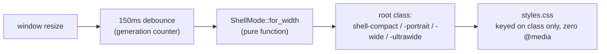

# 0026 — `ShellMode`: Rust owns the layout mode, CSS keys off one class

- **Status:** Accepted
- **Date:** 2026-07-28
- **Milestone / issue:** M1.12 — Build an Adaptive iPad Application Shell (#65),
  sub-project 1 of 6 (mode detection + the four layout skeletons)
- **Supersedes:** nothing — `styles.css` had zero responsive breakpoints before
  this. **Amends:** nothing directly, but establishes the pattern the remaining
  five #65 sub-projects (bottom sheet, accessibility, state preservation,
  external-monitor density, PWA) build against.
- **Related:** ADR 0024 (the `core.rs`/`signals.rs` split this reuses), the
  approved design at
  `docs/superpowers/specs/2026-07-28-m1.12-shell-mode-foundation-design.md`, the
  implementation plan at
  `docs/superpowers/plans/2026-07-28-m1.12-shell-mode-foundation.md`.

## Context

`crates/git-vista/styles.css` had exactly one layout, at every window width —
narrow Stage Manager split, iPad portrait, iPad landscape, external monitor, all
identical. `docs/IPAD_DESIGN.md:30` specifies four distinct layouts the product
needs. Nothing in the codebase decided which layout should be active or when.

Two designs were on the table for how the shell would learn its mode:

- **CSS-only** (`@media` queries own layout): cheapest, but Rust never learns the
  mode, so narrow mode's "one primary task at a time" and future bottom-sheet
  detents cannot be driven from application state.
- **A Rust/CSS hybrid**: CSS for pure layout, a Rust signal only where behaviour
  differs by mode. Rejected — see Alternatives Considered.

## Decision

A pure `ShellMode` enum lives in Rust
(`crates/git-vista/src/features/shell/core.rs`), decided from window width alone:

```rust
pub enum ShellMode { Compact, Portrait, Wide, UltraWide }

impl ShellMode {
    pub fn for_width(width: f64) -> Self { /* < 600 / 600-1023 / 1024-1439 / >= 1440 */ }
    pub fn css_class(self) -> &'static str { /* "shell-compact" etc. */ }
}
```

That value becomes a **single CSS class** on the app's root element. `styles.css`
keys off that class and uses **no `@media` queries for layout mode** — the
project's existing `@media print` block is the only exception, and it governs
print output, an orthogonal concern.



### Breakpoints

| Variant | Width | Derived from |
|---|---|---|
| `Compact` | < 600px | narrow Stage Manager / split (320–375pt) |
| `Portrait` | 600–1023px | iPad portrait (834pt), medium split (507–678pt) |
| `Wide` | 1024–1439px | iPad landscape (1194pt) |
| `UltraWide` | ≥ 1440px | external monitor |

`UltraWide` is named for what's actually knowable — a browser can observe a
width, never that a display is external.

**Accepted trade-off, not hedged:** 600px cuts through iPad's medium split-screen
band (507–678px), so the identical physical configuration can land in `Compact`
at 520px and `Portrait` at 650px. Chosen anyway: responding to actual available
space is more honest than a device label, and the cost — one Apple-named size
band tests as two layouts — is bounded to a single band.

### No hysteresis

`for_width` never consults the previous mode — the same width always answers the
same way. Stability under a resize drag comes from **debouncing** the signal
(`install_mode_signal` in `signals.rs`, 150ms, implemented as a generation
counter rather than a cancellable JS timer handle — each resize bumps the
counter and schedules a check; a check whose generation has been superseded by a
later resize is a silent no-op), not from sticky enter/exit thresholds.

Hysteresis was considered and rejected: it would fully suppress flip-flop during
a slow drag across a boundary, where debouncing only suppresses the
high-frequency case. But it makes mode a function of `(width, previous_mode)`
rather than `width` alone — the same width would have two possible answers
depending on approach direction, which is exactly the property that motivated
choosing Rust-owns-the-signal over the hybrid design in the first place. If real
device testing surfaces the slow-drag case as an actual problem, that is a
finding to bring back with evidence, not a risk to design around blind.

### No pre-hydration default class

Before the WASM bundle hydrates, `<main>` carries no mode class at all —
`index.html` was not touched. The bare stylesheet (no class present) is itself a
legitimate single-column layout at every width, just not the optimal one during
the hydration window. A hard-coded default class was rejected (wrong on the most
common device, iPad portrait, on every load); an inline `<script>` computing the
class from `innerWidth` before hydration was rejected because it relocates the
exact CSS/Rust breakpoint-duplication problem that got the hybrid design
rejected, into `index.html` instead.

## Consequences

- Every future #65 sub-project has one place to read the current mode
  (`ShellMode`, obtained via `install_mode_signal()`) and one place to add
  mode-scoped CSS (a `.shell-<mode>` selector prefix) — no second decider to keep
  in sync.
- `ShellMode::for_width` and `css_class` are host-testable with zero `#[cfg]` —
  six tests cover the boundaries, the midpoints, purity, and class distinctness,
  all running under plain `cargo test`, none requiring the wasm target.
- `install_mode_signal` is wasm-only glue with no automated test, matching this
  project's existing convention (`gestures.rs::install_resize_listener` has
  none either) — verified live in a browser instead, per this project's standing
  rule to drive real UI rather than trust unit tests for it alone. **That live
  verification was not performed during this sub-project's session** (budget
  constrained) — the wasm code compiles and the host-level logic is proven, but
  the actual resize behaviour in a browser has not yet been confirmed. Flagged
  here rather than silently assumed; do this before the next sub-project builds
  on top of it.

## Scope deliberately not covered here

The approved design's Wide/UltraWide layout describes three columns — a left
rail, the canvas, a right inspector. Checked against the real codebase while
planning: **no left rail exists in the DOM today**, and the existing right-docked
panel (`.detail-panel`) is `position: fixed`, not a grid column. Building an
actual rail is real, separate UI work with no design behind it yet.

This sub-project does not build one. It ships the mode signal (fully in scope)
and mode-scoped CSS on what already exists — `.detail-panel`'s width and
`.topbar`'s padding change per mode; nothing about the panel's docking
mechanism or a rail's existence changes. The real three-column skeleton is
follow-up scope for whichever future sub-project actually designs the rail,
not something this ADR should be read as having delivered.

Also out of scope, per the original six-way decomposition (`handoff.md`): bottom
sheet detents, accessibility (flagged there as its own milestone-sized piece),
state preservation across resize, external-monitor density tuning, and PWA
safe-area/offline behaviour.

## Alternatives considered

**CSS-only (`@media` owns layout).** Cheapest to build. Rejected: Rust never
learns the mode, so narrow mode's "one primary task at a time" and future
bottom-sheet detents cannot be driven from application state at all — this
sub-project exists specifically so later ones can do that.

**Hybrid — CSS for pure layout, Rust only for behavioural differences.**
Rejected: a breakpoint duplicated in both CSS and Rust (a `768px` in one, a
`760px` in the other) creates a band of widths where the two disagree about the
current mode — a bug that only reproduces at one exact window size and is
otherwise invisible in either language's own tests. One decider avoids the bug
class entirely rather than mitigating it.

**Hysteresis instead of debouncing.** See "No hysteresis" above.

## Where this is implemented

- `crates/git-vista/src/features/shell/core.rs` — `ShellMode`, `for_width`,
  `css_class`, six tests.
- `crates/git-vista/src/features/shell/signals.rs` — `install_mode_signal`.
- `crates/git-vista/src/app/mod.rs` — the root class binding.
- `crates/git-vista/styles.css` — `.shell-compact .topbar`,
  `.shell-wide .detail-panel` / `.shell-ultrawide .detail-panel`,
  `.shell-compact .detail-panel` / `.shell-portrait .detail-panel`.
