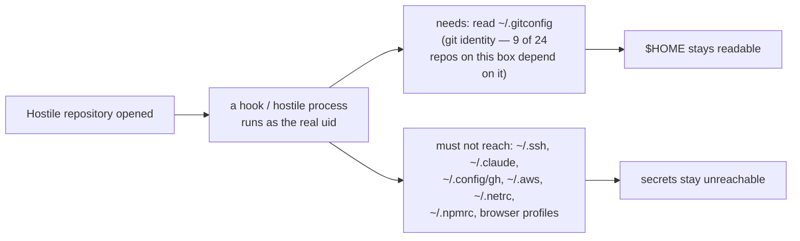
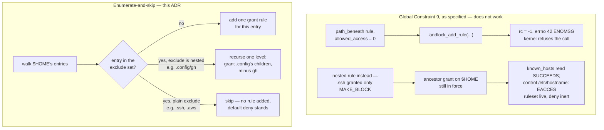
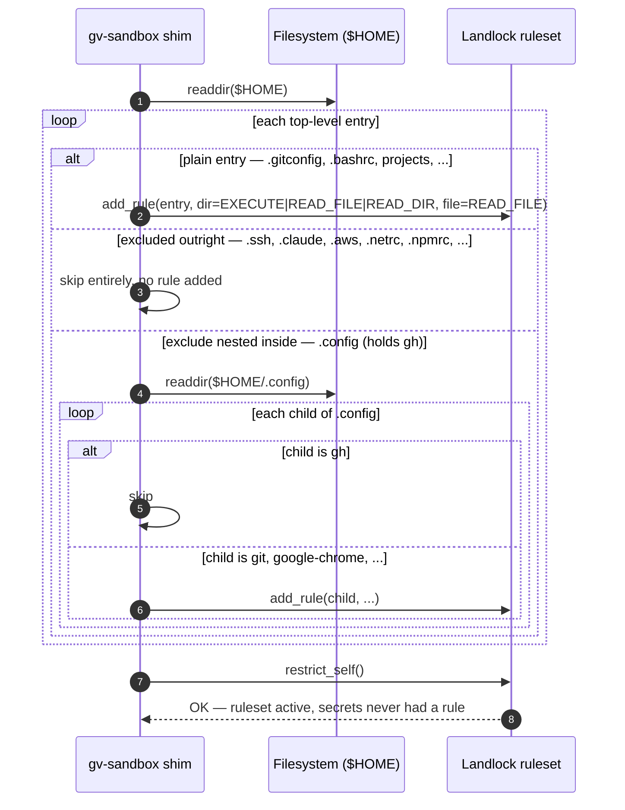
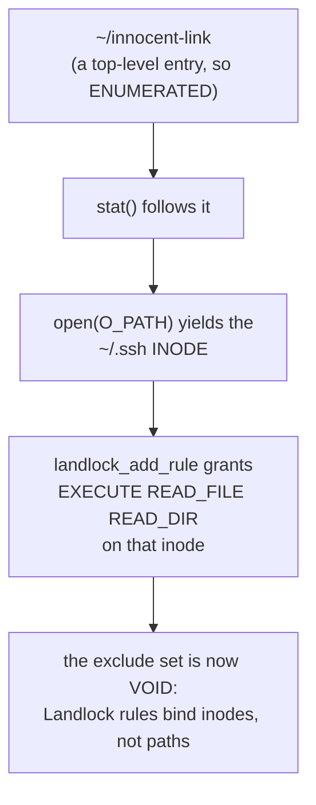
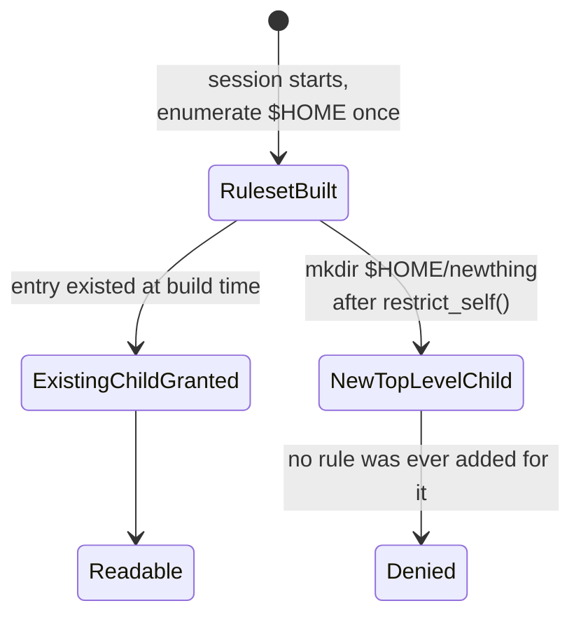
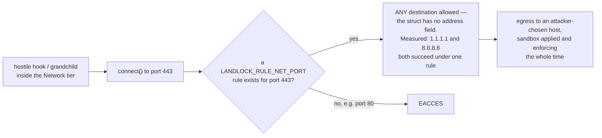

# 0027 — Secrets inside a granted `$HOME` are withheld by enumerate-and-skip, not a deny rule

- **Status:** Accepted
- **Date:** 2026-07-29
- **Milestone / issue:** M1.13b — the Git-process sandbox (#66). Corrects Global
  Constraint 9 of the round-4-settled plan
  (`docs/superpowers/plans/2026-07-28-m1.13b-sandbox.md`), ahead of Task 3 (the
  shim's Landlock enumeration, not yet built as of this ADR — see Consequences).
- **Supersedes:** Global Constraint 9 of the M1.13b plan, which specified the
  secret-withholding mechanism as *"a `path_beneath` rule with
  `allowed_access = 0`"*. That mechanism does not exist on this kernel — see
  Alternatives Considered. **Amends:** nothing directly. D5 Option B itself
  (read-allow `$HOME`, write-deny `$HOME`, plus an explicit secret list) is not
  re-litigated — only its enforcement mechanism is corrected.
- **Related:** [0025](0025-hook-policy-and-disclosure.md) (the same discipline —
  say plainly what is and is not true of the code — applied there to a
  half-shipped feature, applied here to a plan-level claim that turned out to be
  physically impossible); `docs/superpowers/specs/2026-07-28-m1.13-round4-verdict.md`
  (the settled design this plan implements); the M1.13b plan's own Task 18, which
  names its eventual whole-sandbox ADR `docs/adr/0026-git-process-sandbox.md` —
  that number is **already taken** by `0026-shell-mode-foundation.md` (confirmed
  by independent audit), so this ADR and any future whole-sandbox ADR both land
  above 0026, not at it. A reader who lands here from the plan's own text should
  not go looking for an "ADR 0026" that means this.

## Context

A hostile repository can reach code execution as the real uid through its own
hooks (`.git/hooks/*`). The sandbox's read side must let `git` read the operator's
real `$HOME` — nine of the twenty-four repositories inventoried on this box carry
no repo-local `user.name`/`user.email` and depend on `~/.gitconfig` for identity,
so a `$HOME` that isn't readable breaks ordinary commits, not just an edge case —
while a fixed set of secret locations inside that same `$HOME` (`~/.ssh`,
`~/.claude`, `~/.config/gh`, `~/.aws`, `~/.netrc`, `~/.npmrc`, the Chrome/Chromium
and Firefox profile directories) must stay unreachable to that same process.

The M1.13b plan's Global Constraint 9 (round 4, "D5 Option B") specified the
mechanism as a Landlock deny rule for the excluded paths. It does not exist:

1. **The kernel rejects it.** A `path_beneath` rule built with
   `allowed_access = 0` — the literal mechanism the plan named — is refused by
   `landlock_add_rule`: measured `rc = -1, errno = 42 (ENOMSG)`. The identical
   call with `READ_FILE` in place of `0` returns `0`. Since a non-zero return
   becomes `Err` and the shim's `restrict()` path uses `?`, shipping that
   mechanism as written would have aborted the shim on *every* launch on any
   host where `~/.ssh` exists — no sandboxed `git` process would ever run.
2. **The obvious alternative is inert.** A nested *lower-privilege* rule does
   **not** revoke rights an ancestor rule already granted. Measured: with
   `$HOME` granted `EXECUTE|READ_FILE|READ_DIR` and `$HOME/.ssh` separately
   granted only `MAKE_BLOCK`, reading `$HOME/.ssh/known_hosts` after
   `restrict_self()` returned `OK` **succeeded**, while the control
   `/etc/hostname` (no rule at all) correctly returned `EACCES` — proving the
   ruleset was live and the "deny" was simply inert, not that Landlock was
   disabled. Adding the nested rule before or after the parent grant changed
   nothing.

Landlock is deny-by-default. There is no rule shape that subtracts from an
already-granted tree — denial can only be expressed by **never granting** the
excluded path in the first place.

## Decision

Express denial as **not granting**. At policy-build time, enumerate the entries
of every tree the policy intends to grant (`$HOME`, foremost), and add one
Landlock rule per entry — never one rule for the whole tree — skipping any entry
that appears in the exclude set. Where an exclude sits *inside* a directory that
is otherwise granted (`.config/gh`, since `~/.config` itself must stay readable
for `~/.config/git/ignore`), recurse one level: grant that directory's children
individually, minus the excluded one.

### Walking the tree

Entries are classified with `stat()`, never `lstat()` — `open(O_PATH)` follows
symlinks too, so classifying by the link's own type rather than what it resolves
to would grant the wrong access mode. Directories are granted
`EXECUTE|READ_FILE|READ_DIR`; files, `READ_FILE` only.

### Symlinks — the enumeration MUST resolve them, or the exclude set is voided

An earlier revision of this ADR claimed a symlink could not route around the
exclude set. **That claim was wrong, and it was wrong in the most dangerous
direction.** It is corrected here rather than deleted, because the reasoning that
produced it is the reasoning a future reader is most likely to repeat.

The false claim rested on a true fact: Landlock does enforce on the final
resolved path. That fact is decisive for a symlink *inside* an already-granted
tree, where no rule is ever created for the link itself. It is irrelevant at an
**enumerated depth** — the top level of `$HOME`, and every child of `.config` —
because there the enumeration creates a rule *for the entry itself*, and it
classifies with `stat()`, which follows. So the rule is added on an fd opened on
the **resolved inode**.

Measured on this host (Landlock ABI 8), enumerating a fixture `$HOME` containing
`innocent_dir_link -> .ssh` and `.config/innocent_file_link -> .ssh/known_hosts`,
with `.ssh` correctly skipped by name:

| probe | result |
|---|---|
| `/etc/hostname` (no rule — liveness control) | DENIED |
| `normal/plain.txt` (granted — control) | OK |
| `.config/innocent_file_link` | **readable** |
| `innocent_dir_link/known_hosts` | **readable** |
| `~/.ssh/known_hosts` **by its own direct path** | **readable** |

The last row is the one that matters. Granting the `.ssh` inode through an alias
re-opens the *canonical* path too, because a Landlock rule is a property of the
inode. A symlink at an enumerated depth does not merely bypass the exclusion —
it **silently deletes it**, and every later assertion about `~/.ssh` being
unreachable becomes false while the ruleset still looks correct.

This is live on any real machine: this host has seven top-level `$HOME`
symlinks (`.bashrc`, `.gitconfig`, `.zshrc`, …), all pointing into a
dotfiles repository. None currently resolves into or above an excluded
directory, so there is no exposure today — but the mechanism is one `ln -s`
away from voiding the whole exclude set, with nothing to signal it.

**Therefore the enumeration must, after `stat()`, also `lstat()`, and for any
entry that is a symlink, `canonicalize()` it and skip the entry unless the
canonical target is a descendant of the tree being granted and is not equal to,
inside, or an ancestor of any exclude.** An entry resolving to `$HOME`, `/home`
or `/` must always be skipped: granting an ancestor of the secrets defeats the
exclusion by union-upward semantics even without naming a secret.

This check is a hard invariant of the mechanism, not a hardening extra. It needs
its own test, and the test must assert the direct-path row above — that
`~/.ssh/known_hosts` is *still* denied after a hostile alias exists.

### Where the enumeration runs

The enumeration and the `landlock_add_rule` calls it produces live in the
**shim** (`gv-sandbox`, Task 3 of the M1.13b plan — see Consequences for build
status), not in the pure policy builder (`sandbox::sandbox_argv`,
`crates/git-vista-server/src/sandbox/mod.rs`). Three reasons, all structural:

1. **`sandbox_argv` stays pure.** Task 1's whole premise is a policy builder with
   zero I/O and zero syscalls, host-testable everywhere. Reading `$HOME`'s
   directory contents to build the grant set is disk I/O; doing it inside the
   pure function would break that premise for every existing test.
2. **The argv stays short enough to review by eye.** `$HOME` has 172 entries on
   this box after recursing one level into `.config`. Passing one `--ro` per
   entry would make the launcher argv a wall of ~170 paths instead of the
   handful of tree roots and exclude paths it carries today.
3. **INV-16 keeps something fixed to compare against.** The argv tripwire
   asserts every sandboxed launcher argv ends in a fixed reviewed shape. What
   travels in the argv is the short, auditable **exclude list** — nine entries
   — not the (much longer, and host-dependent) grant list the shim derives from
   it at runtime. That is exactly the property D5 Option B was chosen for: the
   thing a reviewer reads is the secret list, not a several-hundred-line grant
   dump.

## Consequences

- **Rule count scales with `$HOME`'s entry count.** 172 rules for the real
  `$HOME` on this box today. Measured headroom: 300,000 rules were added to a
  single ruleset without failure — roughly **1744×** today's count — so this is
  a real coupling between "how much lives in `$HOME`" and "how many Landlock
  rules the shim builds," but it is not a constraint that bites at any size a
  home directory plausibly reaches.
- **A brand-new top-level `$HOME` child created after the ruleset is applied is
  denied.** Enumerate-and-skip grants `$HOME`'s *existing* children at
  policy-build time; it never grants `$HOME` itself. A directory created under
  an already-granted parent (e.g. a new file inside `~/projects`) is visible
  immediately, because the parent's own grant covers it — but a wholly new
  top-level entry (`~/newthing`) has no rule at all until the next time a
  ruleset is built, because nothing enumerated it. This is a real, accepted
  limitation, not an oversight to silently work around.

- **A related correction, same mechanism, different tree.** Repositories are not
  cloned under `~/projects` — `resolve_clones_root`
  (`crates/git-vista-server/src/state.rs`) resolves to
  `$XDG_DATA_HOME/git-vista/clones`, falling back to
  `~/.local/share/git-vista/clones`. `~/.local` is granted only **read-only** as
  a top-level entry by enumerate-and-skip, so the repository's own read-write
  path needs a **nested, more-permissive** rule under that read-only ancestor.
  Measured separately, and it is the mirror image of the failed deny-rule
  alternative: a nested rule **does** union upward when it grants *more* than
  its ancestor — a write under the RW-nested subtree succeeded while a sibling
  without that deeper grant stayed read-only. Landlock's most-specific-rule
  semantics work in the permissive direction; only the restrictive direction
  (Alternative 2, below) is inert.
- **The enumeration itself is not yet built.** This ADR fixes the mechanism the
  shim must implement (Task 3 of the M1.13b plan); the pure policy-builder half
  — `Policy.secret_excludes`, `DEFAULT_SECRET_EXCLUDES`, and `shim_argv` emitting
  one `--exclude <path>` per excluded entry — is built and tested today. The
  shim binary that actually calls `landlock_add_rule` per enumerated entry does
  not exist in the tree yet. Marking this ADR "Accepted" records the *decision*,
  proven correct by measurement against a first-party compiled probe and an
  independent adversarial re-run; it does not claim the production shim runs it
  yet — see ADR 0025 for why that distinction is written explicitly rather than
  left to be inferred.

## Alternatives considered

- **A `path_beneath` deny rule (`allowed_access = 0`).** The original plan's own
  mechanism. Rejected: the kernel refuses the call outright (`errno 42`,
  `ENOMSG`); shipping it would abort the shim's `restrict()` path via its `?`
  operator on every host where any excluded path exists.
- **A nested lower-privilege rule** (e.g., `$HOME/.ssh` granted only
  `MAKE_BLOCK`, hoping the more specific rule wins). Rejected: measured inert —
  the ancestor's grant on `$HOME` still applied, and the excluded file remained
  readable while an unrelated no-rule control correctly returned `EACCES`,
  proving the ruleset was live and the "deny" simply did nothing.
- **Blanket-deny-plus-allowlist** (grant nothing by default, allowlist every
  path git legitimately needs) — the shape round 4's earlier iterations tried
  before landing on D5 Option B. Rejected as a *general* strategy, not just for
  this decision: it needed three iterations to make one `git commit` succeed
  (round 4's F1 and F-NEW-2 findings), and would keep growing for every new
  credential helper, hook interpreter, or tool git shells out to. Enumerate-
  and-skip inverts this: start from "grant everything under `$HOME`" (what git
  actually needs, unconditionally) and subtract a short, named, human-reviewable
  list, instead of trying to enumerate everything git might ever touch.
- **Enumerating in the pure policy builder instead of the shim.** Considered and
  rejected for the three structural reasons under "Where the enumeration runs"
  above: it would make `sandbox_argv` impure, blow the argv up to roughly 170
  entries instead of a handful, and remove the fixed, reviewable shape INV-16's
  structural assertion depends on.

## Related, not decided here: the Network tier cannot confine egress by host

A structurally separate finding surfaced while measuring the Network tier's
Landlock net rules (M1.13b's D4 Option A), and it belongs in the record even
though **no decision has been made about it yet.**

`struct landlock_net_port_attr` — the type behind `LANDLOCK_RULE_NET_PORT` —
**carries no destination-address field at all.** A single rule granting
`connect()` on port 443 grants it to **every** destination on that port.
Measured live: one port-443 rule permitted `connect()` to both `1.1.1.1:443` and
`8.8.8.8:443`, while the same host's port 80 correctly stayed `EACCES` under the
same ruleset — identical behavior over IPv6. This was confirmed as a
*composition*, not inferred from the primitive alone: a hostile
`.git/hooks/pre-commit` grandchild process, running under the real Network-tier
ruleset alongside the real filesystem grants, read `~/.gitconfig` **and**
connected to `1.1.1.1:443` in the same run, while every other denied control
(secret file open, connect on an ungranted port) stayed `EACCES` at every
process level and every granted control stayed working. The filesystem boundary
from this ADR held throughout that same run — a hook binary placed outside every
granted tree was denied `execve` (`rc 126`) — so the exploit's only opening is
that `.git/hooks/` must itself live inside the granted, read-write repository
tree for git to run it at all.

**The consequence:** the Network tier — the one tier that must permit
`push`/`fetch`/`clone` to work at all — constrains *which ports* a sandboxed
process may reach, never *which hosts*. A compromised git process in that tier
can exfiltrate to an arbitrary host over any granted port.

**Tom has not chosen a response.** Three options are on the table: (A) accept
and document the limitation, amending `SECURITY_MODEL.md`; (B) build a real
egress boundary (a proxy or an allowlisted DNS/host gate) so the tier can
actually confine a compromised process to its own remote; (C) drop the net rules
from the Network tier's Landlock policy entirely, since a port-only rule that
cannot constrain the host it reaches may not be worth the complexity it adds.
**Nothing in this record should be read as having picked one.** This ADR states
the measured fact and marks the decision **PENDING** — it belongs in its own
ADR once Tom rules on A, B, or C; recorded here only so a later reader does not
have to re-derive the finding from scratch, or worse, assume the Network tier's
Landlock net rules provide host-level confinement they structurally cannot.

## Where this is implemented

- `crates/git-vista-server/src/sandbox/mod.rs` — `DEFAULT_SECRET_EXCLUDES`,
  `Policy.secret_excludes`, and the doc comment recording both measured kernel
  failures (`ENOMSG`, the inert nested rule) and the enumerate-and-skip
  replacement; `shim_argv` emitting one `--exclude <path>` per excluded entry.
- `crates/git-vista-server/src/sandbox/argv.rs` —
  `the_argv_never_names_a_deny_rule` (the tripwire: if `--deny` ever reappears in
  a launcher argv, the broken mechanism has been reinvented and the secret set
  is silently readable again), `grants_and_excludes_are_passed_through_as_separate_argv_entries`.
- **Not yet built:** the `gv-sandbox` shim binary itself (Task 3 of the M1.13b
  plan) — the process that actually walks `$HOME`'s entries and calls
  `landlock_add_rule` per the algorithm this ADR fixes. This ADR records the
  mechanism the shim must implement, ahead of that code existing, precisely so
  the mechanism is not re-derived (or re-broken) by whoever writes it.
- Measurement evidence: first-party compiled probes plus an independent
  adversarial re-run, referenced from `handoff.md` (repo root, gitignored — not
  the durable record; this ADR is).

---

**Signed:** thomas2025 · 2026-07-29T03:17:07-04:00
