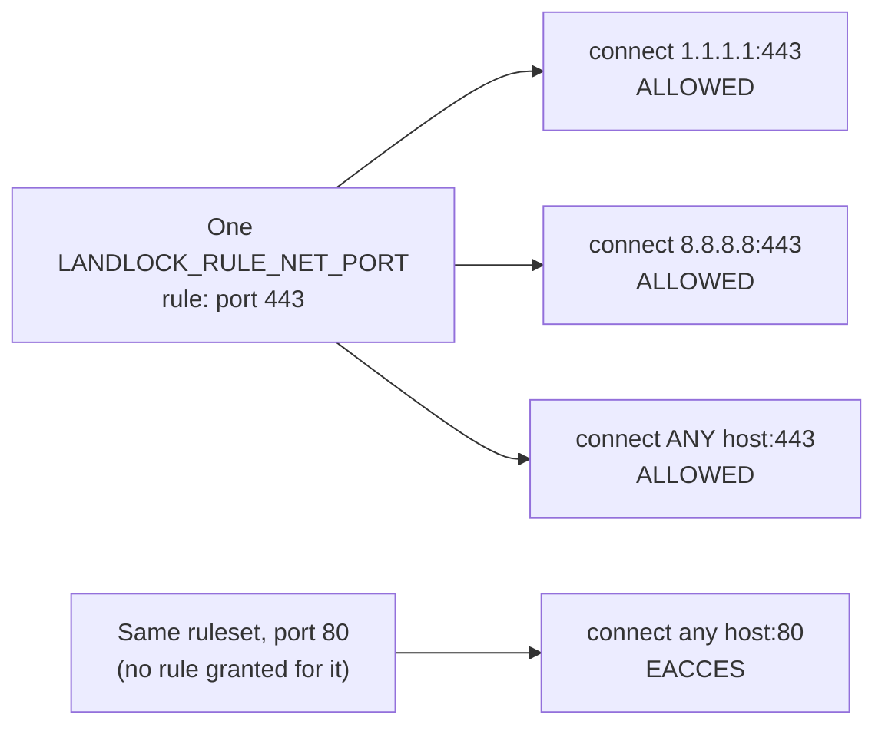
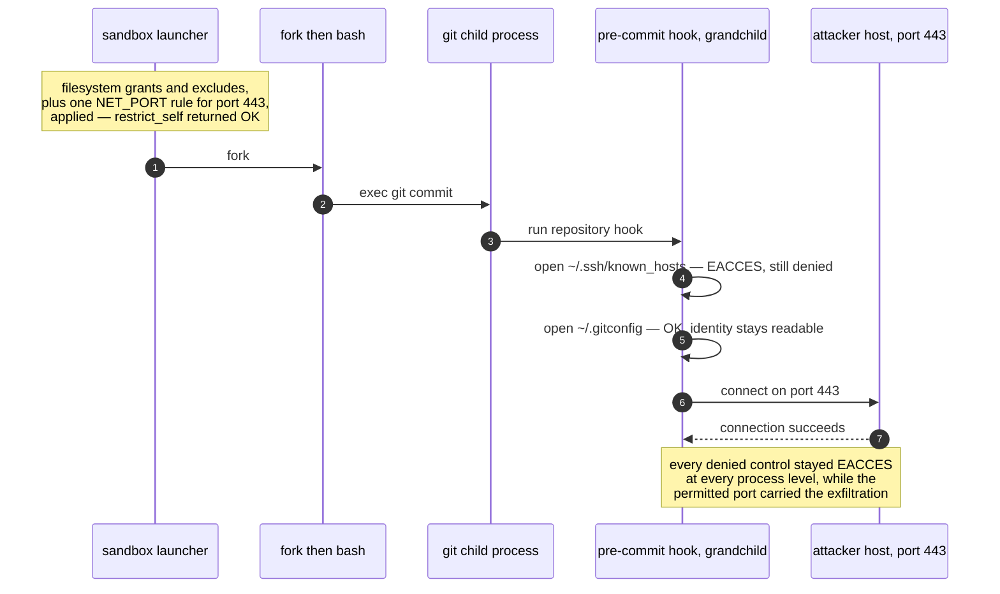
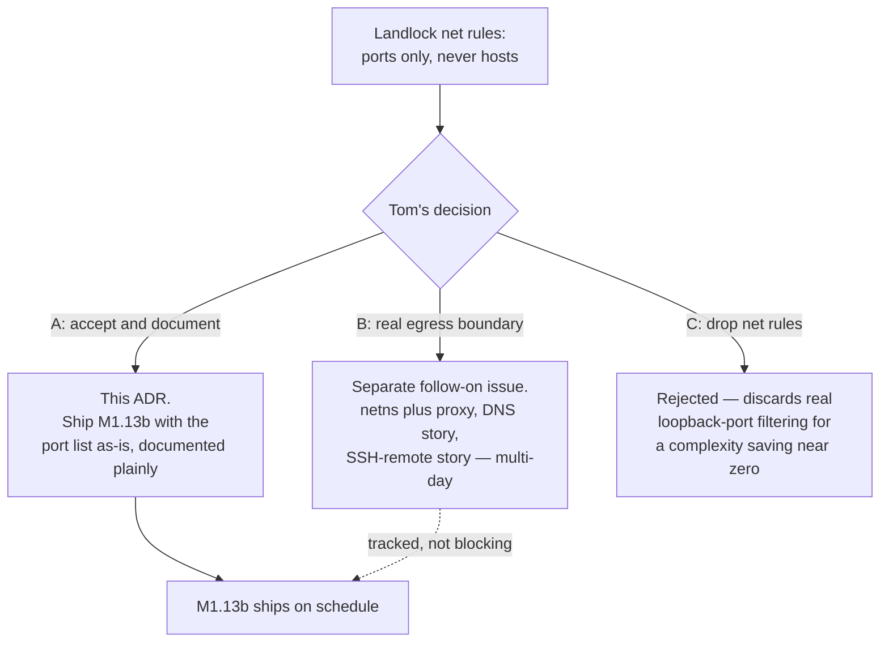
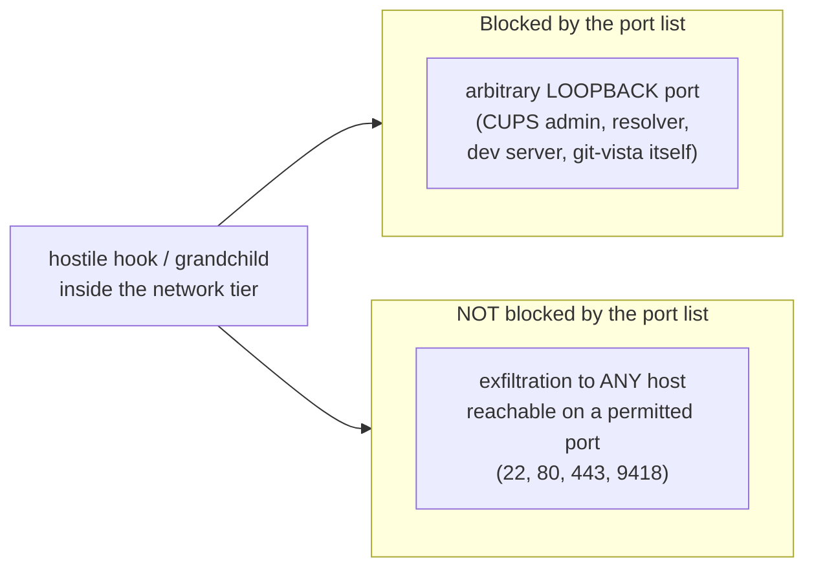
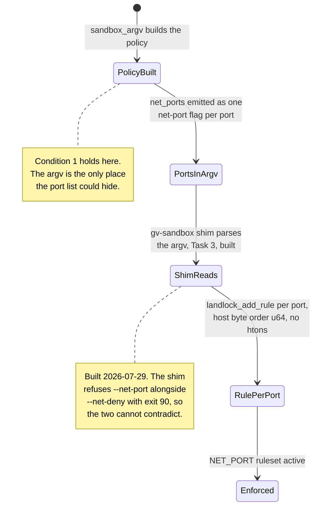
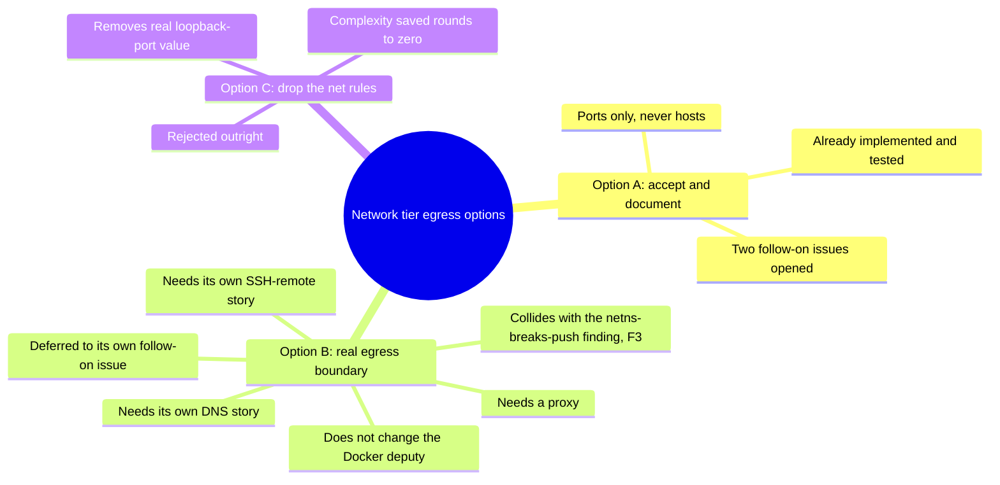

# 0028 — Accept that the network tier constrains ports, not hosts (Option A)

- **Status:** Accepted
- **Date:** 2026-07-29
- **Milestone / issue:** M1.13b — the Git-process sandbox (#66). Resolves the
  decision ADR 0027 left **PENDING** in its own final section, "Related, not
  decided here: the Network tier cannot confine egress by host" — Tom has
  now chosen **Option A**.
- **Supersedes:** nothing directly. **Amends:** `docs/SECURITY_MODEL.md`'s
  network-authority language, corrected in the same session this ADR was
  written (see "Where this is implemented").
- **Related:** [0027](0027-landlock-enumerate-and-skip.md) (the measured
  fact this ADR decides what to do about, and the source of the
  secret-exclusion mechanism Condition 3 below depends on);
  [0025](0025-hook-policy-and-disclosure.md) (the same declared-vs-enforced
  discipline, applied here to a network claim instead of a hook-policy
  claim); [0017](0017-no-arbitrary-argv-from-the-browser.md) (the same
  "what a sandbox permits must be auditable from the argv" reasoning,
  applied here to `Policy::net_ports` instead of the browser-argv boundary).

## Context

ADR 0027 recorded a measured fact about the network tier — the one sandbox
tier that must permit `push`/`fetch`/`clone` to work at all, since it is the
only tier with no network namespace (a namespace is what breaks DNS
resolution for those operations, per the round-4 verdict's F3) — and
deliberately left the response to it undecided. This ADR is that decision.

### The measured fact ADR 0027 left pending

`struct landlock_net_port_attr`, the type behind `LANDLOCK_RULE_NET_PORT`,
carries **no destination-address field of any kind**. A rule granting
`connect()` on a port grants it to every destination reachable on that port.

Measured: one port-443 rule permitted `connect()` to two different real
external hosts, while the same host's port 80 — no rule granted — returned
`EACCES` under the identical ruleset. Identical over IPv6 locally; this host
has no external IPv6 route, so external-IPv6 host discrimination is
unmeasured, not confirmed absent.

Three more structural facts sharpen what this means in practice:

- **`.port` is `__u64`, in plain host byte order.** A `__u16` field or a
  network-byte-order `htons()` call is a silent trap: `landlock_add_rule`
  returns `EINVAL` for either. Whoever builds the shim's rule-construction
  code (Task 3, not yet written — see ADR 0027's own Consequences) needs
  this stated plainly ahead of time, the same way ADR 0027 stated the
  `ENOMSG` and inert-nested-rule traps for the filesystem side before that
  code existed.
- **There are no range or prefix rules.** One `landlock_add_rule` call
  grants exactly one port; a policy that wants four ports adds four rules —
  which is exactly what `Policy::net_ports` plus one `--net-port <n>` argv
  entry per port already does (see "Where this is implemented").
- **UDP is entirely unmediated by this mechanism, and so is `AF_UNIX`.** A
  `LANDLOCK_RULE_NET_PORT` ruleset says nothing about either. A DNS query
  over UDP/53 needs no rule at all under the network tier; only a TCP/53
  fallback would ever consult the port list.

### The network tier's own default was separately broken

Independent of the host-vs-port question, the tier's specified default was
wrong: it declared `handled_access_net` with **zero** net rules, which
denies all TCP outright — including the push/fetch/clone traffic that is
the network tier's entire reason to exist. Any decision here has to leave
the tier actually usable; Option C, below, has to reckon with this too.

### The composed exploit is real, and was reproduced independently

The port-only gap is not a theoretical reading of one struct — it was
exercised end to end, composed with the filesystem controls ADR 0027
documents, and reproduced by a second, independent measurement pass.

Every denied control — the secret-file open, a connect on an ungranted port
— stayed `EACCES` at all three process levels (the shim, `bash`, `git`, and
the hook itself), and every granted control kept working, through `fork`
and two `execve`s. The same assertions were re-run with Landlock absent and
deliberately failed, which is what makes the passing run evidence that the
ruleset was live, not incidentally uninvolved.

**The filesystem boundary held throughout.** A hook binary placed outside
every granted tree was denied `execve` (`rc 126`). The exploit's only
opening is structural, not a filesystem hole: `.git/hooks/` must itself sit
inside the granted, read-write repository tree for git to run the hook at
all, so a hostile hook is unavoidably inside the grant no matter how tightly
everything else is drawn.

### What withholds `/run/docker.sock` is not this

On this host, uid 1000 is in the `docker` group, so a process that reaches
`/run/docker.sock` gets passwordless root through the daemon's own RPC
surface. Nothing about the network tier's port rules is what keeps that
socket closed — filesystem policy (the socket path is simply never granted)
plus seccomp (denying the `socket()`/`io_uring` classes that could otherwise
reach it another way) is the actual control. Crediting network authority for
this would repeat, on the network side, exactly the narrow-fact-reads-broad
mistake ADR 0027 was written to head off on the filesystem side.

## Decision

**Accept Option A: the network tier constrains ports, not hosts, and this is
documented rather than fixed inside M1.13b.** Building a real per-host
egress boundary (Option B) becomes its own follow-on issue, tracked
separately and out of scope for this milestone; dropping the port rules
altogether (Option C) is rejected outright. See Alternatives Considered.

### What the port list still buys — and it is not nothing

A hostile process inside the network tier cannot reach a service on an
*arbitrary loopback port* — a local CUPS admin socket, a resolver, a
developer's own dev server, git-vista's own port. That is a real, useful
restriction and it costs nothing extra to keep.

### What it cannot do, said plainly

It cannot stop exfiltration of repository contents, or of any credential
reachable by the same-uid process, to an arbitrary attacker-chosen host, as
long as that host is reached over a port the tier permits. Both halves —
what is blocked, what is not — must be stated together every time this is
described; stating only the first is how `SECURITY_MODEL.md`'s own
network-authority language came to overpromise, corrected in the same
session as this ADR.

### Conditions attached to accepting A

Option A is only honest if all four of these hold, and they are recorded
here as part of the decision, not as separate aspirations:

1. **The permitted port list must travel in the launcher argv, never be
   hardcoded in the shim**, so what the sandbox permits stays auditable from
   a command line — the same reasoning ADR 0017 applied to the browser-argv
   boundary and ADR 0027 applied to the secret-exclude list. **Already
   implemented:** `Policy::net_ports` plus one `--net-port <n>` flag per
   port, with tests asserting a port is never hardcoded and that a tier
   carrying no network (`Strict`, `Unsandboxed`) carries no port flag at
   all. See "Where this is implemented."
2. **Both structural gaps are documented, not one.** Ports-not-hosts, and
   TCP-not-UDP. A reader told only the first could still believe UDP DNS is
   confined by the same rule; it is not — that rule mediates TCP only — and
   the round-4 verdict's own A5 acceptance test is corrected in the same
   session this ADR lands, to say so by tier rather than in general (see
   "Where this is implemented").
3. **The secret-exclusion set becomes the load-bearing control.** Once a
   port is reachable to any host, the only thing standing between a hostile
   hook and exfiltrating a credential over that port is whether the hook can
   read the credential in the first place — i.e., ADR 0027's
   enumerate-and-skip mechanism. That mechanism's own inode/symlink/hard-link
   hole is fixed and measured (ADR 0027, "The fix is at inode identity, not
   at path"), and five credential paths missing from the original exclude
   set were added: `.git-credentials`, `.gnupg`, `.docker`, `.kube`, and
   `.claude.json`. Accepting Option A leans directly on that list being
   complete and its enforcement mechanism being sound — this is why ADR
   0027 is "Related," not incidental, to this decision.
4. **Follow-on, not done:** the port set should eventually be derived from
   the repository's own configured remotes, unioned with the defaults
   `{22, 80, 443, 9418}`, so a remote on a nonstandard port does not fail
   opaquely — a silent `EACCES` on `git push` to a correctly configured
   remote, for a reason invisible to the operator. Tracked as follow-on
   work, not implemented by this ADR.

### Build status, as of 2026-07-29

The `gv-sandbox` shim referred to above **now exists**
(`crates/git-vista-server/src/bin/gv-sandbox.rs`, Task 3), so this decision is
implemented rather than merely specified. What is measured working through the
composed launcher:

- the argv contract, including a hard refusal (exit 90) of `--net-port`
  alongside `--net-deny`, so a policy cannot express a contradiction;
- `--abi-floor` required rather than defaulted, refusing with exit 91 rather
  than applying a weaker policy;
- `landlock_net_port_attr` with a `__u64` port in **host byte order**, added
  one rule per port;
- ABI-6 scopes (`ABSTRACT_UNIX_SOCKET`, `SIGNAL`) enabled — measured A/B as the
  thing that actually withholds abstract-socket and signal deputies, and
  independent of the port list this ADR is about.

What remains unbuilt is the **seccomp filter** (Task 4). Until it lands, the
`io_uring` bypass recorded against round 4 of this design is expected to be
reachable, and no claim in this ADR should be read as covering it.

## Alternatives considered

- **Option B — build a real egress boundary** (a network namespace plus a
  trusted proxy or allowlisted DNS/host gate). Not rejected as a design —
  **deferred to its own follow-on issue**, out of scope for M1.13b, because:
  - It is multi-day work: a proxy needs its own DNS story (resolving inside
    a restricted namespace is exactly the F3 problem ADR 0027 and the
    round-4 verdict already measured — `git ls-remote` cannot resolve DNS
    inside `--unshare-net`) and its own SSH-remote story (a proxy that only
    understands HTTPS `CONNECT` does not cover `git+ssh`).
  - It collides directly with the measured reason the network tier has no
    namespace at all: a network namespace is what breaks push/fetch/clone
    (F3), so "add a namespace to the network tier" is not a small
    extension — it is undoing the reason the tier is shaped the way it is.
  - It would not change the same-uid Docker-deputy exposure either way — a
    proxy constrains network egress, not `/run/docker.sock`, which is
    already outside network authority's reach (see Context, above).
- **Option C — drop the network tier's net rules entirely.** Rejected, not
  deferred. The rules already exist, are already tested (see "Where this is
  implemented"), and block a real, if narrow, class of reachable services —
  arbitrary loopback ports. Removing them trades that real value for a
  complexity saving that rounds to zero: the code that would be deleted is a
  `Vec<u16>` field, one argv flag, and the tests pinning both. Rejected as a
  bad trade, not because the rules are sufficient on their own — they are
  not, which is the entire subject of this ADR.

## Consequences

- **Exfiltration to an arbitrary attacker-chosen host, over a permitted
  port, remains possible from a hostile hook in the network tier, and this
  is now documented rather than implied away.** `SECURITY_MODEL.md` is
  corrected in the same session to stop describing network authority in
  terms that read as host-level confinement.
- **This is a constrained-execution layer, not a host-security boundary** —
  the same framing ADR 0025 and ADR 0027 already apply to hook policy and
  filesystem exclusion respectively. Accepting Option A applies that framing
  to the network half too; nothing about this decision changes it.
- **Two follow-on issues are opened, not closed, by this decision:** Option
  B (a real egress boundary), tracked separately from M1.13b; and deriving
  the port set from configured remotes (Condition 4), tracked as a small
  follow-on against the default port list.
- **The round-4 verdict's A5 acceptance row is corrected in the same
  session** to say "strict tier only" rather than reading as a property of
  "the whole launcher" — UDP DNS is blocked by the strict tier's network
  namespace, not by anything the network tier's Landlock rules mediate. See
  `docs/superpowers/specs/2026-07-28-m1.13-round4-verdict.md`.
- **Conditions 1–4 above are binding, not aspirational.** Condition 1 is
  already implemented and tested; Conditions 2–3 are satisfied by this ADR
  and ADR 0027 existing and being cross-linked from `SECURITY_MODEL.md`;
  Condition 4 is explicitly open, tracked follow-on work.

## Where this is implemented

- `crates/git-vista-server/src/sandbox/mod.rs` — `DEFAULT_GIT_PORTS: &[u16] =
  &[22, 443, 80, 9418]`; `Policy.net_ports`; the doc comment recording the
  measured `landlock_net_port_attr` finding ahead of the shim code that will
  construct real rules from it; `shim_argv` emitting `--net-allow` /
  `--net-deny` per tier and one `--net-port <n>` per port, only ever after
  `--net-allow`.
- `crates/git-vista-server/src/sandbox/argv.rs` —
  `the_network_tier_names_every_permitted_port_in_the_argv` (Condition 1's
  test: every default port is a literal `--net-port` argv entry, never
  hardcoded), `no_tier_without_network_ever_carries_a_port` (a tier with no
  network carries no port flag), `network_tier_never_names_bwrap_and_never_unshares_net`
  (the network tier launches the shim directly — no namespace, per F3),
  `the_strict_tier_denies_network_and_unshares_it` (the strict tier's
  network denial is the namespace, not a port list).
- **Not yet built:** the `gv-sandbox` shim binary (Task 3 of the M1.13b
  plan) — the process that will read `--net-port` / `--net-allow` and call
  `landlock_add_rule` per port. This ADR fixes the decision and the
  byte-order / no-range-rules traps that code must not repeat, the same way
  ADR 0027 fixed the filesystem mechanism ahead of its own shim code
  existing.
- `docs/SECURITY_MODEL.md` — network-authority language corrected in the
  same session, cross-linking this ADR and ADR 0027.
- `docs/superpowers/specs/2026-07-28-m1.13-round4-verdict.md` — acceptance
  item A5 given a tier qualifier in the same session (true for the strict
  tier's netns only, not for the network tier).
- Measurement evidence: first-party compiled probes plus an independent
  adversarial re-run of the composed exploit, referenced from `handoff.md`
  (repo root, gitignored — not the durable record; this ADR is).

---

**Signed:** thomas2025 · 2026-07-29T04:22:58-04:00
