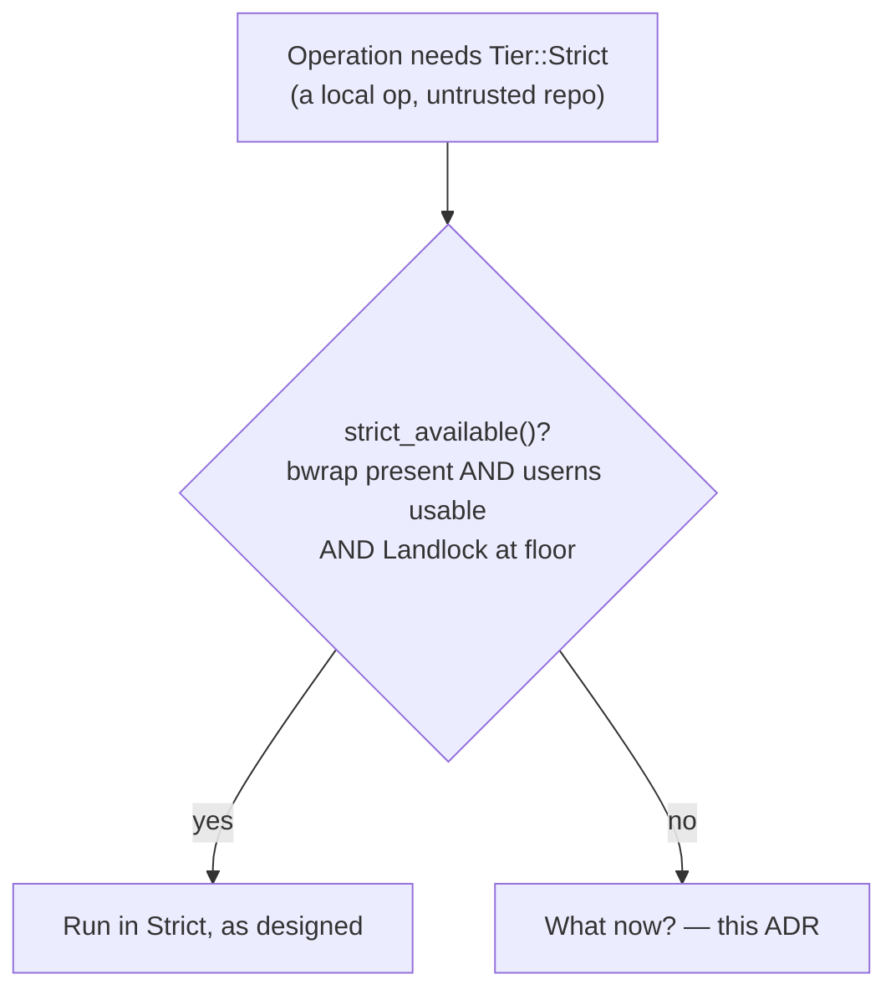
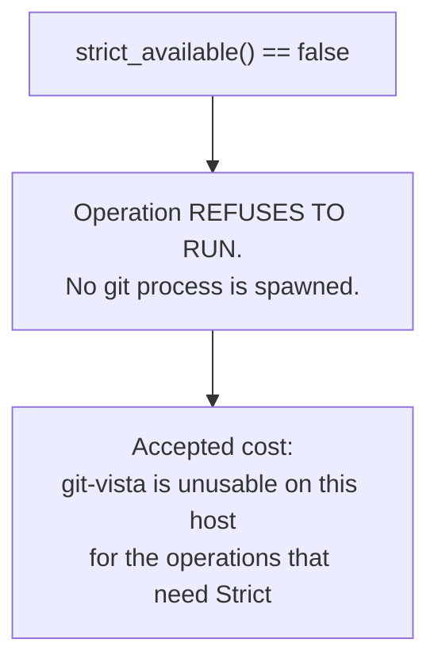
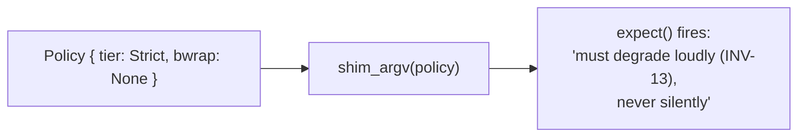
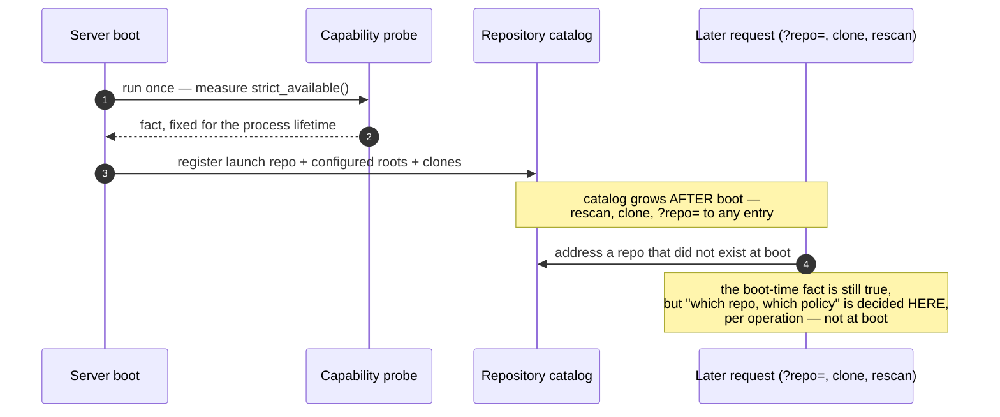
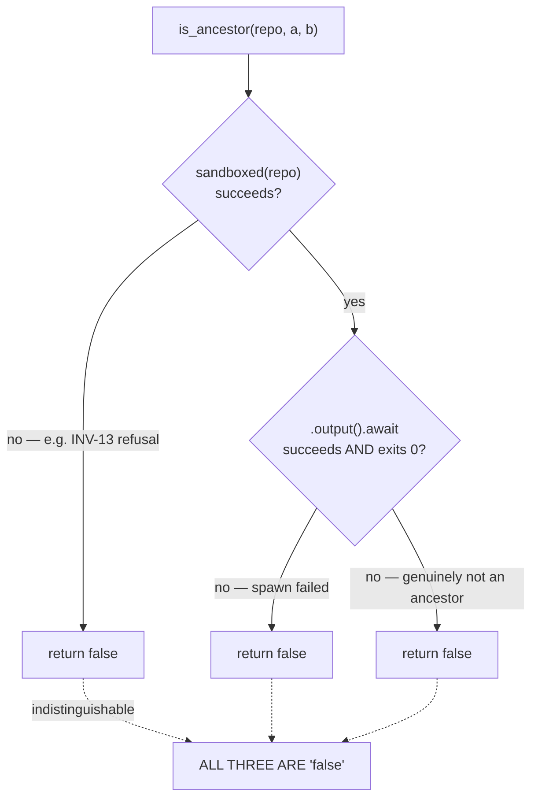
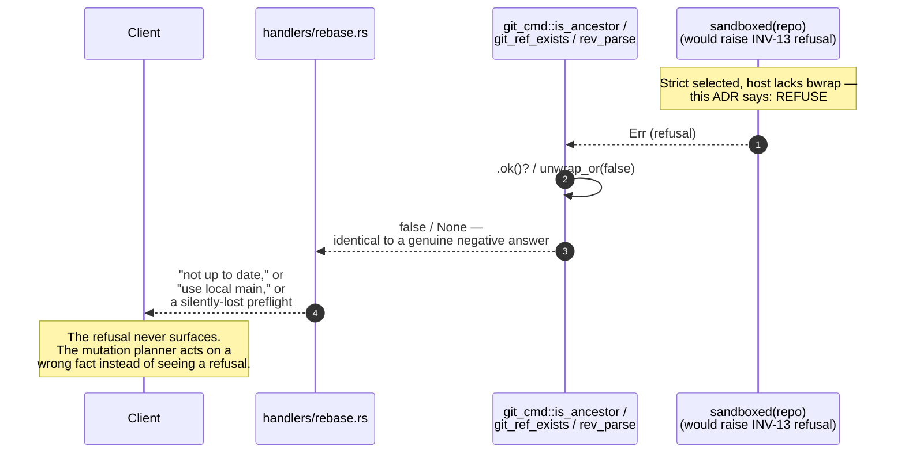
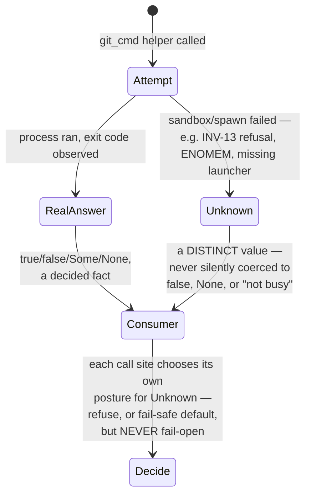
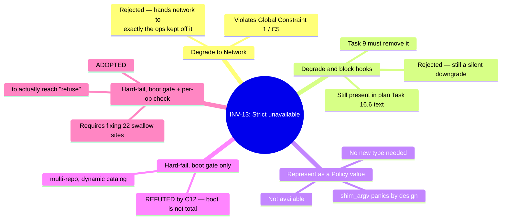

# 0029 — INV-13: hard-fail when the Strict tier is selected but unavailable

- **Status:** Accepted — implementation pending
- **Date:** 2026-07-29
- **Milestone / issue:** M1.13b — the Git-process sandbox (#66). Resolves
  INV-13, which the escape-battery anti-vacuity contract's ordered-work step 7
  listed as "BLOCKED ON TOM — not an agent's call"
  (`design-docs/2026-07-29-escape-battery-anti-vacuity-contract.md`). Load-
  bearing for plan Tasks 8, 9 and 16
  (`docs/superpowers/plans/2026-07-28-m1.13b-sandbox.md`), none of which have
  landed as of this ADR.
- **Supersedes:** nothing directly — this is the first ADR to state INV-13 as
  a decision rather than an open question. **Amends:** plan Task 16's current
  text for `hook_policy_for_repo`, which maps `CapabilityAbsent` to
  `HookPolicy::Blocked` — see "Where the plan still disagrees with this ADR,"
  below.
- **Related:** [0027](0027-landlock-enumerate-and-skip.md) and
  [0028](0028-network-tier-ports-not-hosts.md) (the same "say plainly what is
  and is not true of the code" discipline, applied here to a capability-
  detection claim instead of a filesystem or network one);
  [0025](0025-hook-policy-and-disclosure.md) (hook policy as a declared,
  disclosed value — the same framing this ADR extends to capability
  refusal); `docs/superpowers/evidence/2026-07-29-m1.13b-codex-C12-tier-dispatch-audit.md`
  (the audit that forced this ADR to say more than the one-line decision).

## Context

The M1.13b sandbox has three tiers. Strict (bwrap namespaces plus Landlock plus
seccomp) is the tier local operations on untrusted repositories run in — no
network, fullest isolation. Network (Landlock only, TCP allowed on enumerated
ports) is what remote operations need, because a network namespace breaks DNS
resolution for `push`/`fetch`/`clone` (the round-4 verdict's F3).
`Capabilities::strict_available()` (`crates/git-vista-server/src/sandbox/capabilities.rs:47-53`)
measures whether a host can actually provide Strict: Landlock at the ABI
floor, a `bwrap` binary found at an absolute reviewed path, and usable
unprivileged user namespaces — all three, because Strict's isolation is a
*composition* and a missing piece is not a weaker Strict tier, it is a
different, undeclared one.

Some hosts fail that check. The question this ADR answers: what does
git-vista do, on such a host, for an operation that needs the Strict tier?



## The decision, exactly as taken

**INV-13 → HARD-FAIL.** When the Strict tier is selected for an operation and
`bwrap` or unprivileged user namespaces are unavailable on the host, the
operation refuses to run. There is no degrade to the Network tier, and no
degrade-and-block-hooks posture. This is now plan **Global Constraint 15**
(`docs/superpowers/plans/2026-07-28-m1.13b-sandbox.md:93`). Tom accepted the
cost in plain words: git-vista is unusable on a host without bubblewrap.



## Alternatives considered, and why they lost

### Degrade Strict to Network

Rejected. Strict is selected precisely for local operations on untrusted
repositories, and Network grants TCP egress on enumerated ports
(`DEFAULT_GIT_PORTS`, `crates/git-vista-server/src/sandbox/mod.rs`). Degrading
would hand network access to exactly the operations the tier exists to keep
off the network — the best-effort security downgrade Global Constraint 1 (C5)
forbids: *"silently applying a weaker best-effort policy is incompatible with
any stated claim."* A silent downgrade under host variation is the failure
mode this whole milestone exists to eliminate.

### Degrade and block hooks

Rejected as an attempted middle path — run the operation in a weaker tier but
suppress `.git/hooks/*` so the missing isolation cannot be exploited through a
hook. This still degrades silently (a repository that asked for Strict gets a
different, weaker tier without refusing), and it does not survive contact with
the plan text: Task 16's `hook_policy_for_repo`
(`docs/superpowers/plans/2026-07-28-m1.13b-sandbox.md:4915-4923`) currently
maps `ProbeVerdict::CapabilityAbsent | ProbeVerdict::FailOpen` to
`HookPolicy::Blocked` — **this is the rejected posture, still present in the
plan.** The plan's own text at lines 3344-3352 already flags the
contradiction: *"once boot enforces INV-13/GC15, only `Contained` reaches
production... Task 16.6's `hook_policy_for_repo` maps `CapabilityAbsent |
FailOpen` to `HookPolicy::Blocked` — a degrade-and-block-hooks posture Global
Constraint 15 rejects by name."* Task 9's redesign has to remove that mapping;
see "Where the plan still disagrees with this ADR," below.

### Represent "Strict without bwrap" as a `Policy` value

Not available, and this is a useful consequence rather than a gap: `Policy`
cannot express it. `shim_argv` (`crates/git-vista-server/src/sandbox/mod.rs`)
panics if asked to:

```rust
// # Panics
//
// Never for `Tier::Unsandboxed` — both callers return before reaching here.
// Panics if a `Strict` policy carries no `bwrap` path; `Policy` construction
// is responsible for degrading to `Network` or reporting INV-13 instead of
// building a strict policy that cannot launch its own namespace boundary.
fn shim_argv(policy: &Policy) -> Vec<OsString> {
    ...
    if policy.tier == Tier::Strict {
        let bwrap = policy.bwrap.as_ref().expect(
            "a Strict policy must carry a resolved bwrap path; without namespaces it is \
             not the strict tier and must degrade loudly (INV-13), never silently",
        );
        ...
```

Confirmed by direct read of the current source. The hard-fail needs no new
type: the type system already refuses to build the degraded thing, and the
`.expect()` message already cites INV-13 by name, ahead of Task 8 wiring
tier dispatch to reach this path in production.



## The complication: "hard-fail" as a slogan does not survive contact with the code

An independent audit — C12,
`docs/superpowers/evidence/2026-07-29-m1.13b-codex-C12-tier-dispatch-audit.md`
— reviewed the recovered design for INV-13 and refused to approve it unchanged
for two structural reasons. Both were verified against current source for
this ADR; nothing below is asserted without a file:line citation.

### 1. A boot gate cannot be total

The server is multi-repository and dynamic, not a single boot-time subject
that a single capability check can stand in for:

- boot registers the launch repository, configured-root children, and
  persistent clones (`crates/git-vista-server/src/main.rs:134-164`, per the
  audit; not independently re-read line-for-line for this ADR, but consistent
  with the catalog design in ADR 0003/0009);
- reads can address **any** catalog entry via an opaque `?repo=` parameter
  (`crates/git-vista-server/src/handlers/read.rs`, per the audit);
- rescan adds repositories after launch
  (`crates/git-vista-server/src/handlers/select.rs`, per the audit);
- clone creates and registers a repository at runtime
  (`crates/git-vista-server/src/handlers/clone.rs`, per the audit);
- and `policy_for_repo` grants read-write to the *specific repo argument*
  passed to it (`crates/git-vista-server/src/sandbox/mod.rs:451-467`,
  confirmed by direct read for this ADR — `policy_for_repo(repo: &Path)`
  pushes `repo.to_path_buf()` into `rw_trees`).

One capability probe run once at boot answers "can this host provide Strict
at all" — a fact that does not change between requests — but it cannot stand
in for a per-operation, per-repository refusal, because the set of
repositories the server will be asked to operate on is not fixed at boot.



**Resolution this ADR adopts:** keep the boot capability gate (a host that
fails `strict_available()` when Strict is required at all should refuse to
start rather than fail silently later — this is INV-13/Global Constraint 15's
existing boot-gate half, plan Task 9), but pair it with a per-operation check:
every call to `policy_for_repo` (or its Task-8 successor that actually
dispatches tiers) must itself be able to refuse, for the repository and
operation in front of it, not only rely on a fact established once at
process start. A boot gate proves the host *can* supply Strict in principle;
it cannot prove *this* operation, on *this* repository, right now, gets it —
those are different questions, decided at different times, and conflating
them is exactly the gap C12 named.

### 2. Failure is currently swallowed into wrong answers, not refusals

This is the sharper problem, because it means "hard-fail" is not merely
unimplemented — the code that exists today does the *opposite* of failing
hard in several places, and the sandbox would add a new way to reach an
existing defect rather than invent a new one.

Verified directly against current source for this ADR (confirming C12's
claims 1-3 and the coordinator/planner swallow sites):

**`git_cmd.rs` collapses three distinct outcomes into one Boolean or one
`Option`:**

```rust
// crates/git-vista-server/src/git_cmd.rs:270-278
pub(crate) async fn is_ancestor(repo: &Path, ancestor: &str, rev: &str) -> bool {
    let Ok(mut cmd) = sandboxed(repo) else {
        return false;
    };
    cmd.args(["merge-base", "--is-ancestor", ancestor, rev])
        .output()
        .await
        .map(|o| o.status.success())
        .unwrap_or(false)
}
```

A genuine "not an ancestor," a policy-construction failure (which is exactly
what a Strict-tier hard-fail would raise), and a spawn failure are all `false`
here. `git_ref_exists` (`git_cmd.rs:303-314`) has the identical shape.
`rev_parse` (`git_cmd.rs:247-264`) does the same into `Option<String>` via
`.ok()?` twice — "ref absent" and "could not run git at all" are one `None`.



**Both callers of these two functions live in the rebase live gate**
(`crates/git-vista-server/src/handlers/rebase.rs`). Verified: `git_ref_exists`
at `rebase.rs:44` selects local `main` over `origin/main` when it returns
`false` — indistinguishable from "the remote-tracking ref genuinely doesn't
exist." `is_ancestor` at `rebase.rs:59` feeds `up_to_date`, which leaves the
rebase menu action enabled on failure (`crates/git-vista/src/menu.rs:578-607`)
— failure does not execute a rebase automatically, but it does not refuse the
UI action either, which a hard-fail invariant requires it to.

**`rev_parse` has 20 production call sites** (per C12's enumeration, spanning
`handlers/rebase.rs`, `handlers/commit.rs`, `activity.rs`, and roughly a
dozen sites in `planner.rs`) with genuinely different failure semantics. Two
are safety-relevant in ways worth restating here because they are the
starkest evidence that "just propagate the error" is not a one-line fix:

- **Branch delete loses its own undo record.** `Precondition::RefAbsent`
  accepts `rev_parse(...).is_none()` as satisfied (`planner.rs:539-575`, per
  audit), and a successful delete can journal `old_oid: None`
  (`planner.rs:1456-1489`, per audit) — which means `UndoAction::RestoreBranch`
  cannot be produced (`crates/git-vista-core/src/activity.rs:346-374`, per
  audit), a silent loss of the application's own restore route.
- **Merge and rebase compare two `Option`s.** Two independently-failed reads
  can be misreported as "nothing to do," and one failed read out of two can
  fabricate a phantom journal event (`planner.rs:1394-1428`, `:1497-1532`, per
  audit).

**Two more swallow sites, outside `git_cmd.rs`, confirmed by direct read for
this ADR:**

```rust
// crates/git-vista-server/src/coordinator.rs:117-129
async fn absolute_git_dir(repo: &Path) -> Option<PathBuf> {
    let output = tokio::process::Command::new("git")
        .arg("-C")
        .arg(repo)
        .args(["rev-parse", "--absolute-git-dir"])
        .output()
        .await
        .ok()?;
    if !output.status.success() {
        return None;
    }
    ...
}
```

`refuse_if_git_busy` (`coordinator.rs:103-105`) calls this and returns `None`
— "not busy" — on the identical failure that a Strict-tier refusal would
raise, silently disappearing the git-busy preflight (ADR 0019's own
serialization guarantee) rather than surfacing "I don't know."

```rust
// crates/git-vista-server/src/planner.rs, worktree_status (per C12, ~485-492)
// uses run_git(...).await.ok()?, then generation_token's unwrap_or_default()
// (planner.rs:394-408) folds that into an empty generation field — repeated
// failures can compare equal and let staleness checks pass.
```



This is the audit's central point, restated plainly: **on a host without
bwrap, the server would not currently refuse anything.** `is_ancestor → false`
reads as "a rebase onto this base would change something, proceed."
`git_ref_exists → false` reads as "the remote-tracking ref is absent, use
local `main`." Two wrong answers, not two refusals, feed the mutation
planner. Declaring INV-13 as hard-fail without touching these call sites
would make the words true at the boundary that raises the error and false
everywhere the error is consumed.

## The response this ADR adopts: one explicit "unknown observation" posture

The fix is not to rename `false`/`None` to some other default at each of the
~22 sites above — C12 explicitly warns against exactly that ("do not merely
rename `false`/`None` to another default"), and 20 individually-reasoned call
sites are 20 chances to relaunder "unknown" into "fact" again, differently,
at each site.

Instead: the planner needs **one explicit representation of "I don't know,"**
distinct from every real answer it could otherwise return, threaded through
from the point a sandbox/spawn failure occurs to every consumer, so a
consumer must choose what "unknown" means for its own precondition rather
than receiving a `false` or `None` that already looks like a decided fact.



This is deliberately a design direction, not a completed migration: Tasks 8,
9, and the `git_cmd`/`coordinator`/`planner` follow-on work are where the 20
`rev_parse` call sites, the two `is_ancestor`/`git_ref_exists` callers, and
the two additional swallow sites actually get this treatment. What this ADR
fixes is the *posture* — hard-fail at the boundary, and no site downstream of
that boundary is permitted to treat "unknown" as a decided fact — ahead of
that code existing, the same way ADR 0027 fixed the Landlock enumeration
mechanism ahead of the shim that implements it.

## Where the plan still disagrees with this ADR

Recorded plainly, because a decision record that does not name where the code
(or, here, the plan text describing not-yet-written code) still disagrees
with it is only half a record:

**Plan Task 16.6's `hook_policy_for_repo`**
(`docs/superpowers/plans/2026-07-28-m1.13b-sandbox.md:4915-4923`) currently
reads:

```rust
probe::ProbeVerdict::CapabilityAbsent { .. } | probe::ProbeVerdict::FailOpen { .. } => HookPolicy::Blocked,
```

This maps a capability-absent host to "run the operation, but block hooks" —
the degrade-and-block-hooks posture this ADR rejects by name. The plan's own
text already flags this at lines 3344-3352 as a consequence Task 16's edit
needs to resolve, not this one — quoted above under "Degrade and block
hooks." This ADR is the record that INV-13 does not leave that mapping a live
option: `CapabilityAbsent` for an operation that needs Strict must refuse the
operation, not run it with hooks suppressed. Task 9's redesign (the boot
gate plus per-operation check described above) is where this plan text gets
corrected before Task 16 is built.

## Consequences

- **Git-vista is unusable on a host without bubblewrap, for any operation
  that dispatches to the Strict tier.** Tom accepted this cost explicitly.
  There is no fallback mode; installing `bwrap` and enabling unprivileged
  user namespaces is the only path to running such an operation on that host.
- **A single boot-time capability check is necessary but not sufficient.**
  Task 9 must keep it, and Task 8's tier dispatch (or its policy-construction
  successor) must add a per-operation, per-repository check reachable from
  `?repo=` addressing, rescan, and clone — not only the boot-registered set.
- **The `git_cmd.rs`, `coordinator.rs`, and `planner.rs` swallow sites are now
  named defects, not incidental sloppiness.** They predate this ADR and are
  not created by it, but INV-13's hard-fail is not true in practice until they
  stop collapsing "the sandbox refused" into "false" or "not busy" or "no
  drift." This is follow-on work against Tasks 8/9, tracked here so it is not
  lost the way the INV-13 decision itself nearly was.
- **`hook_policy_for_repo`'s current plan text must change before Task 16 is
  built**, per "Where the plan still disagrees with this ADR."
- **No new type is needed to express "Strict selected, unavailable."**
  `shim_argv`'s existing panic already refuses to build that `Policy`; Task 8
  wiring real dispatch into `policy_for_repo` needs to turn that
  build-time-only invariant into a request-time `Result::Err` that reaches
  the handler as a proper refusal, not a panic reachable from a network
  request.
- **This ADR does not itself change any source file.** Tasks 8, 9, and 16 are
  where INV-13 is implemented; this record exists so the decision Tom already
  took, and the gaps C12 found in the naive version of it, survive to when
  those tasks are built, without being re-derived — or re-broken — by
  whoever builds them.

## Alternatives considered (summary)



## Where this will be implemented

- `crates/git-vista-server/src/sandbox/capabilities.rs` —
  `Capabilities::strict_available()`, the existing factual probe this
  decision consumes.
- `crates/git-vista-server/src/sandbox/mod.rs` — `policy_for_repo`,
  `shim_argv`'s existing panic (to become a request-time refusal once Task 8
  wires dispatch), `Tier`, `tier_for`.
- `docs/superpowers/plans/2026-07-28-m1.13b-sandbox.md` — Task 8 (tier
  dispatch), Task 9 (the boot probe and `ProbeVerdict`, INV-13/Global
  Constraint 15's boot-gate half), Task 16 (`hook_policy_for_repo`, to be
  corrected per "Where the plan still disagrees with this ADR").
- `crates/git-vista-server/src/git_cmd.rs` — `is_ancestor`, `git_ref_exists`,
  `rev_parse`: the swallow sites the "unknown observation" posture must
  reach.
- `crates/git-vista-server/src/coordinator.rs` — `absolute_git_dir`,
  `refuse_if_git_busy`: a further swallow site found during this decision's
  own verification.
- `crates/git-vista-server/src/planner.rs` — `worktree_status`,
  `generation_token`, and the ~14 `rev_parse` consumers enumerated by audit
  C12: where "unknown" currently becomes a decided-looking default.
- `docs/superpowers/evidence/2026-07-29-m1.13b-codex-C12-tier-dispatch-audit.md`
  — the audit this ADR responds to in full, including its six required
  design corrections.
- **Not yet built:** any of the above changes to `git_cmd.rs`, `coordinator.rs`,
  or `planner.rs`; Task 8's tier dispatch; Task 9's per-operation check
  alongside its boot gate; Task 16's corrected `hook_policy_for_repo`. This
  ADR records the decision and the shape its implementation must take, ahead
  of that code existing.

---

**Signed:** thomas2025 · 2026-07-29T12:50:40-04:00
