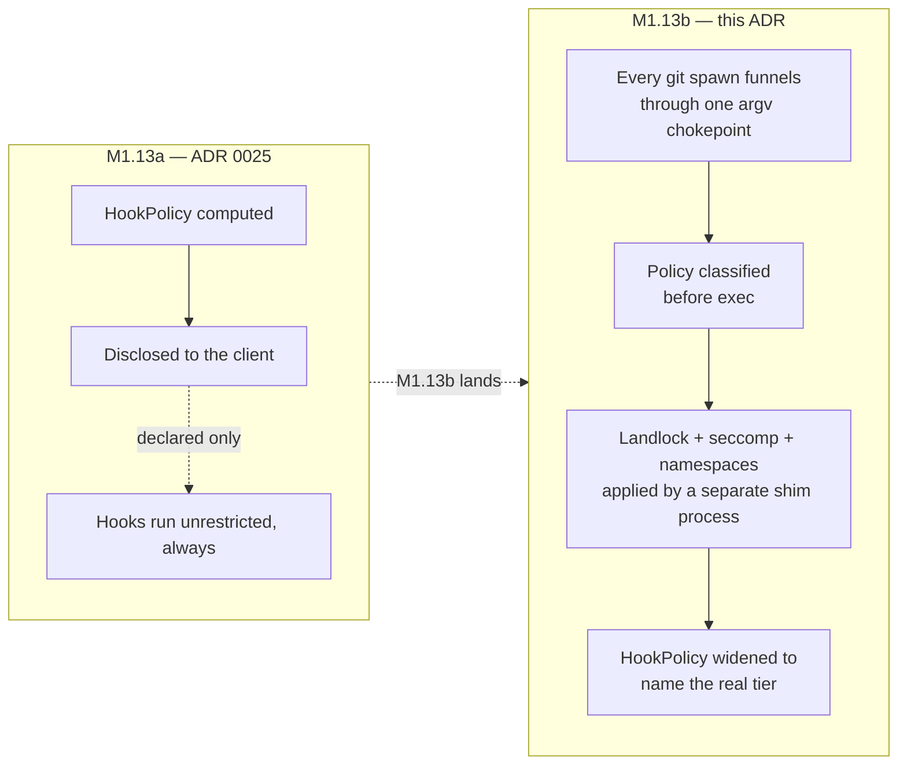
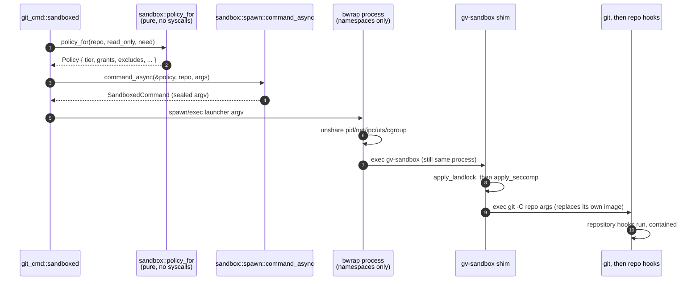
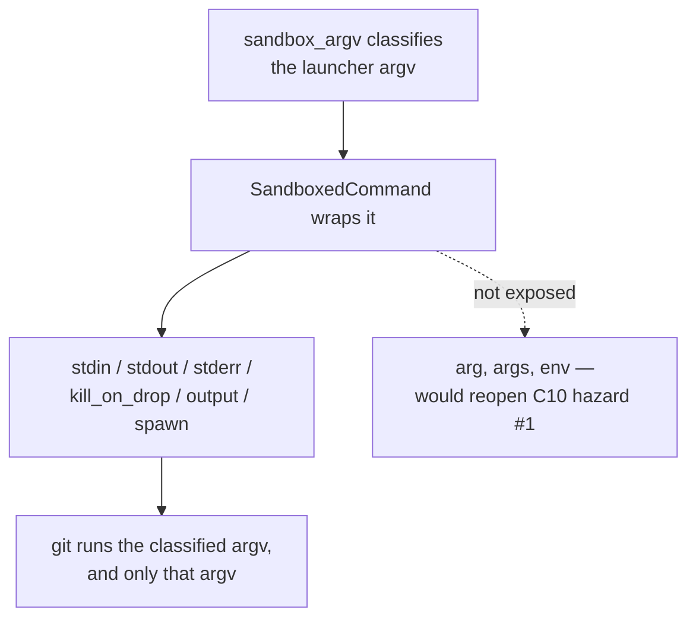
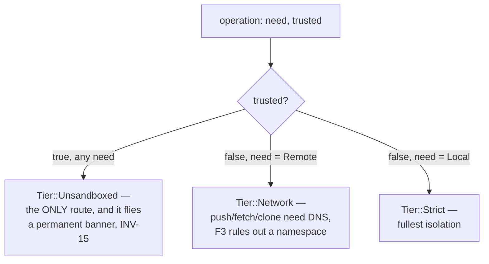
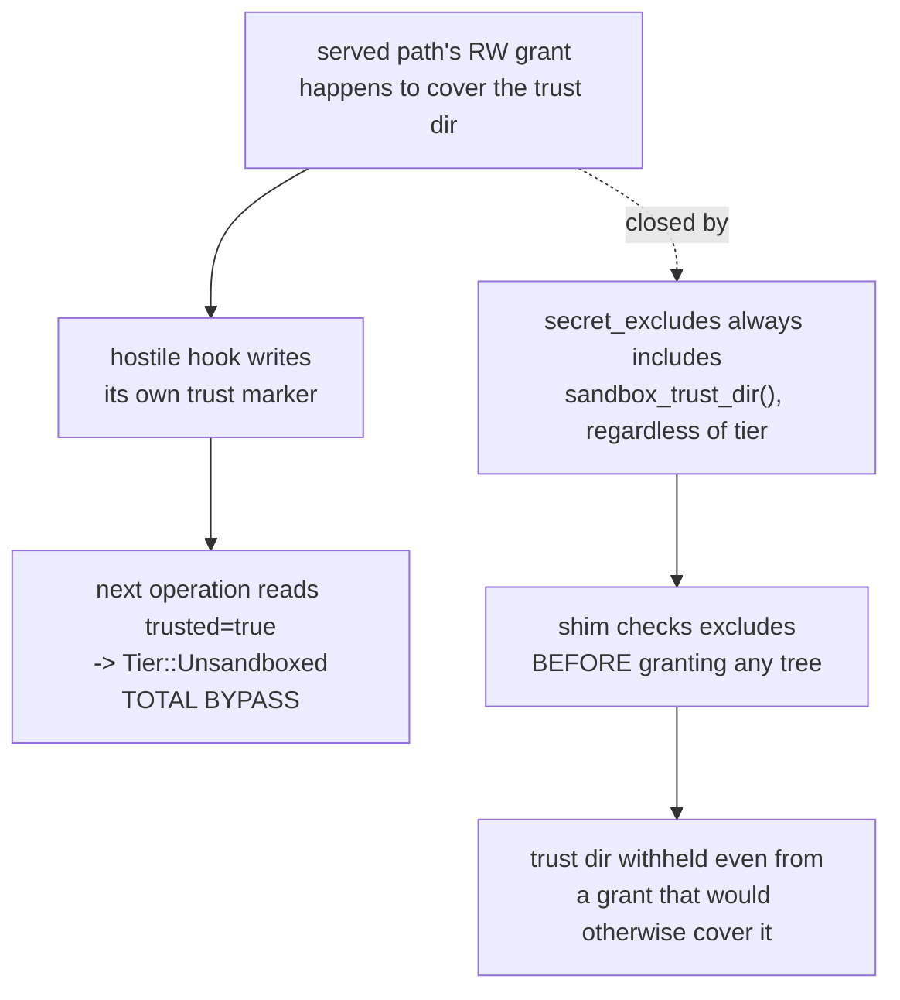
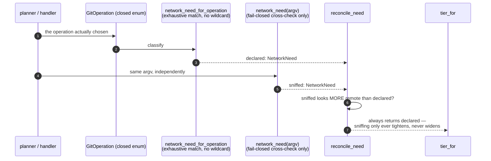
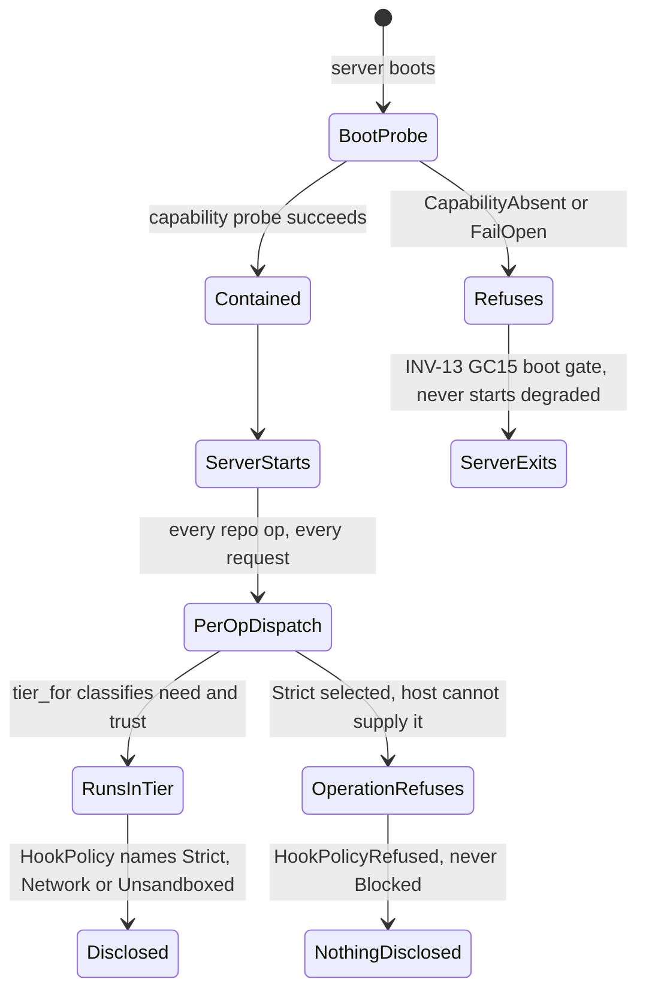
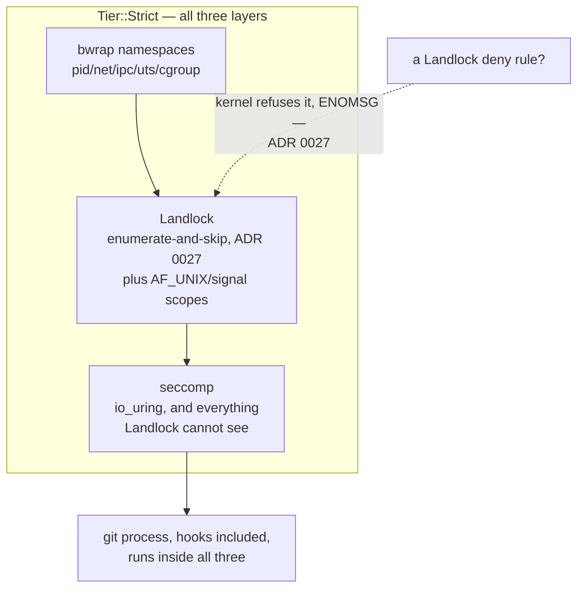
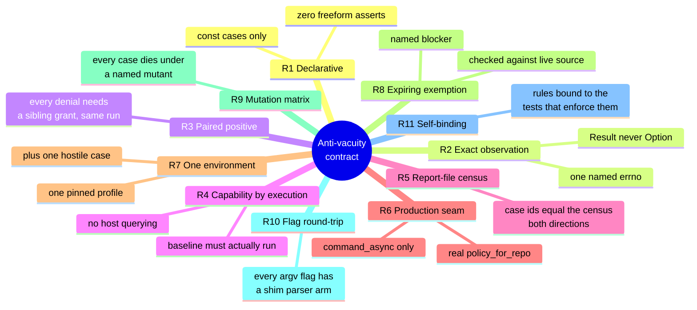
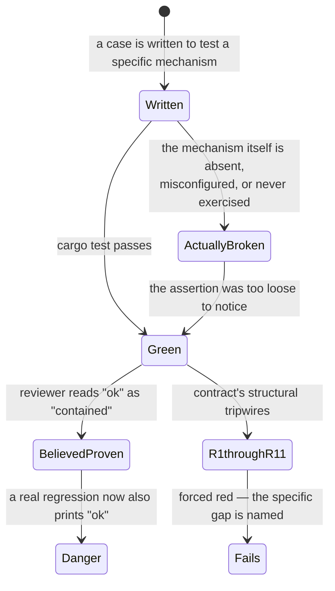

# 0030 — The git-process sandbox: a pure argv boundary, tiers by declared intent, and tests that prove their own premise

- **Status:** Accepted — core mechanism and INV-15 disclosure landed and tested
  at the wire, and both UI halves now render it: the per-repository policy in
  the frontend picker and the session-level banner's text as a function of the
  policy (#208, both landed). See Consequences.
- **Date:** 2026-07-30
- **Milestone / issue:** M1.13b — the git-process sandbox (#66). Written for issue
  #205 (Task 18, "the whole-sandbox ADR and security-model closure"), the record
  ADR 0027 already reserved a slot for when it warned a reader off looking for it
  at "ADR 0026."
- **Supersedes:** nothing directly — this is the cross-cutting record the four
  standalone M1.13b ADRs (0025 partially, 0027, 0028, 0029) each anticipated.
  **Amends:** ADR 0025, via the amendment appended to that file rather than an
  edit to it — `HookPolicy` widened from two variants to four, and the plan's
  `CapabilityAbsent → Blocked` mapping ADR 0029 rejected is now checked, not
  merely rejected in prose.
- **Related:** [0025](0025-hook-policy-and-disclosure.md) (declared-and-disclosed
  discipline, the pattern this whole milestone follows), [0015](0015-typed-operation-vocabulary-and-plan-schema.md)
  (closed vocabularies over booleans/strings — the reasoning `Tier`, `NetworkNeed`,
  `HookPolicy` and `GitOperation` all reuse), [0017](0017-no-arbitrary-argv-from-the-browser.md)
  (the same sealed-argv discipline, applied there to the browser boundary and
  here to the git-spawn boundary), [0027](0027-landlock-enumerate-and-skip.md)
  (the Landlock mechanism this ADR's "layered mechanisms" section summarizes
  rather than repeats), [0028](0028-network-tier-ports-not-hosts.md) (the network
  tier's accepted host-confinement gap), [0029](0029-strict-tier-hard-fail-when-unavailable.md)
  (INV-13 in full; this ADR restates only what the whole picture needs).

## Context

Before M1.13b, ADR 0025 shipped the *declared* half of `SECURITY_MODEL.md:236`:
a `HookPolicy` value computed and disclosed, with the explicit, load-bearing
caveat that "nothing in `git_cmd.rs` or `git-vista-git` reads this value or
suppresses hooks accordingly" — every git process the server spawned ran with no seccomp, no
Landlock, no sandbox of any kind, hooks included. M1.13b is the enforcement
half: contain what a hostile repository's own hooks can do to the host,
without breaking what git legitimately needs — identity from `~/.gitconfig`
(nine of twenty-four repositories on this box have no repo-local identity and
depend on it), and DNS resolution for `push`/`fetch`/`clone`, which a network
namespace breaks (round-4 verdict finding F3).



The rest of this record is organized around the properties that make the
enforcement trustworthy rather than merely present: the boundary is provably
the thing that runs (not a policy computed and then bypassed), trust is
structurally narrow (not a convenience escape hatch), and the tests that
claim containment are structurally prevented from passing for the wrong
reason — this milestone's escape battery was found vacuous by audit twice
before landing the contract described below.

## Decision

### 1. The sandbox is argv — a pure policy, one impure shim

`sandbox/mod.rs` builds a `Policy` and turns it into a launcher `Vec<OsString>`
(`sandbox_argv`) with **no syscall, no I/O, no async** (`mod.rs:1-8`). The two
genuinely impure steps — finding `bwrap` on disk, finding the `gv-sandbox`
shim — are pulled into their own submodules (`bwrap`, `shim`) for exactly this
reason: `sandbox_argv` stays a total function of its `Policy`. That purity is
what let the sync and async spawn wrappers collapse into one function; per
`spawn.rs:27-29`, "neither call style needs a `pre_exec` closure or a
`block_on`, because the sandbox is *argv*: the shim applies Landlock and
seccomp in its own process, after this one has already exec'd it."



The shim's own `main()` is `parse → validate → close_inherited_fds →
apply_landlock → apply_seccomp → exec("git")` (`bin/gv-sandbox/main.rs:735-762`)
— Landlock before seccomp, one process, `.exec()` never `.spawn()`, so the
shim never becomes a parent (enforced by a source tripwire on that same file,
`main.rs:10-13`).

### 2. A sealed argv — `SandboxedCommand` cannot be appended to

Purity upstream is not enough on its own: a bare `Command` returned from the
chokepoint could still have `.args(...)` called on it after classification —
this is exactly the shape the crate shipped before Task 5, where `sandboxed()`
built an *empty*-arg `Command` and every caller appended the real subcommand
afterward (spawn.rs:61-65). `SandboxedCommand` (`spawn.rs:77`) closes it by
type: its public API is `stdin`/`stdout`/`stderr`/`kill_on_drop`/`output`/
`spawn` — stdio configuration only. There is deliberately no `arg`, `args` or
`env` (spawn.rs:69-73): `GIT_DIR`, `GIT_SSH_COMMAND` and `GIT_EXTERNAL_DIFF`
redirect or execute, so an environment appended after classification is an
argv change wearing a different hat.



Rust has no stable negative-impl assertion, so this is enforced as a source
tripwire rather than a comment: `the_sandboxed_command_exposes_no_way_to_change_what_runs`
(`spawn.rs:265-295`) `include_str!`s `spawn.rs` itself, isolates the
`impl SandboxedCommand` block, and asserts no `pub(crate) fn` line contains
`arg`, `args` or `env` — with one named, test-gated exception
(`hermetic_env_for_test`) that production code cannot reach.

### 3. Three tiers, and `Unsandboxed` reachable only through persisted trust

`Tier::{Strict, Network, Unsandboxed}` (`mod.rs:404-414`). Dispatch is two
inputs, three outcomes, no wildcard on the untrusted side:

```rust
// mod.rs:781-792
pub(crate) fn tier_for(need: NetworkNeed, trusted: bool) -> Tier {
    match (trusted, need) {
        (true, _) => Tier::Unsandboxed,
        (false, NetworkNeed::Remote) => Tier::Network,
        (false, NetworkNeed::Local) => Tier::Strict,
    }
}
```



`(true, _)` uses a wildcard on purpose (trust is a property of the
repository, not the operation); the `false` side has none, so a new
`NetworkNeed` variant forces a new arm that cannot silently resolve to
`Unsandboxed` without an edit a reviewer would see (`mod.rs:758-767`).
`trusted` comes only from `repo_is_trusted → trust::is_trusted`, backed by a
marker file under the server's own state directory
(`state::sandbox_trust_dir()`, `$XDG_STATE_HOME/git-vista/trusted-repos` or
`~/.local/state/...`) — never inside a repository, and the only writer is
`trust::grant`, documented as callable "only from an explicit, authenticated
operator action" (`trust.rs:76-90`). As of this writing `trust::grant` has no
production (handler-reachable) caller — only test code exercises it
(`sandbox/dispatch.rs:616,648`, `sandbox/compat.rs:471`) — so `Unsandboxed` is
reachable by rule, not yet by any operator-facing route.

A read-only `$HOME` grant is not, by itself, what protects that marker:
serving a repository whose grant happens to cover
`~/.local/state` (or a served path pointing `XDG_STATE_HOME` inside itself)
would otherwise let a hostile hook write its own trust marker and promote
itself to `Unsandboxed` on the next operation — a total bypass, named
explicitly in source as the reason the fix is a hard exclude, not the RO
grant (`mod.rs:984-1010`). `secret_excludes` always carries
`sandbox_trust_dir()` in addition to the standard secret list
(`mod.rs:1011-1015`), and the shim's grant-building functions check excludes
*before* deciding whether or how to grant a tree at all
(`is_or_inside_exclude`/`is_ancestor_of_exclude`, `bin/gv-sandbox/main.rs:527-563`)
— the one mechanism in this sandbox that outranks a grant rather than
competing with it, tested directly by forging exactly that scenario
(`trust.rs:177-232`).



### 4. Declared intent outranks argv sniffing

`GitOperation` is a closed, data-carrying enum in `git-vista-protocol`
(`plan.rs:143-153`, ADR 0015's vocabulary reused). `network_need_for_operation`
is an exhaustive match over it with no wildcard arm (`mod.rs:593-621`) — a new
operation variant fails the build until someone states what network it needs,
rather than silently inheriting a default. The argv itself is also inspected
(`network_need`, `mod.rs:539-563`), but only as a fail-closed cross-check: the
reconciler `reconcile_need` always returns the *declared* value, only ever
logging/panicking-in-debug when the argv looks more remote than declared
(`mod.rs:661-679`, `mod.rs:657-660`: "the argv can only ever *complain*, never
decide").



### 5. INV-13 (already ADR 0029) and INV-15 disclosure, as they sit today

Restated only for the whole picture — ADR 0029 is the detailed record.
`policy_for` refuses *before* building any grant when `Strict` is selected
and the host cannot supply it (`strict_launcher`, `mod.rs:704-726`,
`ShimError::StrictUnavailable`), never degrading to `Network` and never
running with hooks suppressed. The disclosure seam makes the same refusal
honest at the wire: `hook_policy_for_repo`/`hook_policy_for_trusted_repo`
maps `ProbeVerdict::CapabilityAbsent`/`FailOpen` to
`Err(HookPolicyRefused::…)`, never to `HookPolicy::Blocked` — the exact
mapping the M1.13b plan proposed and ADR 0029 rejected by name. This is
checked, not merely documented: `capability_absent_refuses_and_never_becomes_blocked`
(`hook_policy.rs:249-264`) asserts both `is_err()` and
`assert_ne!(got.ok(), Some(HookPolicy::Blocked))`.



`HookPolicy` itself widened from ADR 0025's two variants to four
(`git-vista-protocol/src/dto.rs:141-185`): `Strict`, `Network`, `Unsandboxed`
name the three tiers directly; `Blocked` is wire-only ("hooks are not known
to be running" — `HookPolicy::default()`, `dto.rs:207-220`) with **no
production policy constructor emitting it**, checked by the escape
contract's own R8 scan. `requires_banner()` is `!matches!(self, Strict)`
(`dto.rs:202-204`) — INV-15's banner marks everything that is not the fullest
isolation, `Blocked` included, since "your hooks silently did not run" is a
surprise a user must be told about as much as "your hooks ran unsandboxed."
ADR 0025's old wire strings (`allow`/`restricted`) still deserialize via
`#[serde(alias)]`, a wire-compatibility guarantee kept deliberately separate
from the Rust-level transition constants, which have since been deleted now
that every call site spells a tier name directly.

### 6. Layered mechanisms, and why denial is expressed by omission

Strict composes three independent layers: bwrap namespaces (pid/net/ipc/uts/
cgroup), Landlock (filesystem and, since ABI 6, `AF_UNIX`/signal scopes), and
seccomp (syscall classes Landlock cannot mediate — `io_uring`, which submits
path opens from kernel space and bypasses Landlock's open-time checks
entirely). Landlock is deny-by-default with no rule shape that subtracts from
an already-granted tree (ADR 0027, measured: a `path_beneath` rule with
`allowed_access = 0` is refused by the kernel with `ENOMSG`; a nested
lower-privilege rule is simply inert). Denial is therefore expressed only by
**never granting** — enumerate the tree, add one rule per entry, skip
anything in the exclude set — which is also the mechanism Decision 3 above
leans on to protect the trust marker.



Denial-by-omission is why a path that is legitimately granted through an
alias — a symlink at an enumerated depth, a hard link to a secret — can
silently void an exclusion (ADR 0027's inode-identity fix); the AF_UNIX
seccomp gap (`socket`/`socketpair` unmediated, plan claimed otherwise in two
places, enforced in neither) was found and closed the same way, strict tier
only (`seccomp_filter.rs`, INV-4).

### 7. The anti-vacuity contract — R1 through R11

The escape battery failed audit twice before this landed: once found vacuous
(C8), rewritten, and the rewrite's io_uring case found vacuous again by a
second audit (C11: "0 PROVES, 4 VACUOUS, 1 UNCERTAIN") — the defect had
"merely moved from the inside assertion to the baseline gate," not been
removed. `docs/sandbox/escape-battery-anti-vacuity-contract.md` responds with
a checkable standard instead of a third rewrite guided by care: eleven rules,
each either a **source tripwire** (fails the build) or a **CI step** (fails
the gating job on an artifact both a real run and a broken one must produce
identically).



R3 is the rule that closes the sharpest hole: because Landlock exclusion is
implemented as omission-during-enumeration, a denial on an excluded path and
a denial on a path that was simply never granted are the *same kernel event*
— a test asserting only the denial cannot tell them apart, so every case must
also assert a sibling grant succeeds under the same policy, same run. R9's
mutation matrix is what turns "the mechanism is denied" into "*this specific*
case would notice if the mechanism broke": M8 removes only the strict tier's
AF_UNIX seccomp rules, leaving the rest of the filter installed, so only a
case that depends on that exact rule — not "some seccomp rule" — dies under
it.

### 8. Six tests that were green while proving nothing

The pattern the contract exists to stop, concretely — verified against
current source, with one correction to the popular retelling noted:



1. **TIME-WAIT residue voided a case.** `strict_tcp_bind_denied`'s baseline
   bound a fixed port; a TIME-WAIT socket left by an unrelated earlier test
   made the bind fail with `EADDRINUSE`, the case reported `CapabilityAbsent`,
   and `cargo test` printed `ok` while asserting nothing about containment
   (`escape_contract.rs:784-791`).
2. *(Reported elsewhere as "a module never compiled" — could not be confirmed
   against this repository's escape-battery material; see the Report at the
   end of this ADR.)*
3. **A chmod test almost proved its own grant permits writes.** An earlier
   draft of `landlock_does_not_mediate_chmod` pushed its own target directory
   into `policy.rw_trees` and then observed chmod succeeding there — which a
   read-write grant is supposed to allow regardless of the mechanism under
   test (`documented_gaps.rs:88-93`, F-NEW-3). Caught before landing; the
   surviving test asserts the target lies under no grant at all.
4. **A census silently drifted from the source it was meant to police.**
   `high_bit_af_unix_denied` and `high_bit_io_uring_denied` landed, both
   green, both writing report records the gating job would have diffed
   against a census that did not know about them — the gate would have gone
   red on the next CI run for a reason indistinguishable from a real
   regression (`escape_contract.rs:1171-1177`).
5. **A push test passed over a literal IP while DNS inside the sandbox was
   dead.** Before the network tier's DNS-resolver grant existed, `git
   ls-remote https://github.com/...` failed to resolve any host from inside
   it — but the push test in this crate used `git://127.0.0.1:9418`, which
   needs no resolver, and passed regardless: a green test over a broken
   feature (`mod.rs:275-283`).
6. **An AF_UNIX denial was claimed and enforced in neither of the places
   that claimed it.** Correction to the common retelling: it is one document
   making the claim twice (the M1.13b plan's Architecture section and its
   Task 4 text), not two independent documents — `seccomp_filter.rs` had no
   `SYS_socket`/`SYS_socketpair` rule at all. Measured inside the full strict
   stack: `socket(AF_UNIX, ...)` succeeded, byte-identical to the bare host.
   Closed 2026-07-29; the escape census now carries
   `af_unix_socket_denied`/`af_unix_socketpair_denied`, `dies_under: [M1, M8]`.

## Alternatives considered

- **Represent the trust marker as anything other than a path outside every
  repository, hard-excluded.** A permission-bit or uid check on the marker
  file was not built; the anti-forgery property is entirely
  path-and-exclude-based (never writable by a hook, given exclude precedence
  over grant). Sufficient because the marker's only writer is `trust::grant`,
  itself unreachable from request handling.
- **Query-based capability probing in the escape battery (R4).**
  `shim_cli::strict_available()` — "does a bwrap binary merely exist" — said
  yes on stock Ubuntu 24.04 while `capabilities::strict_available()` (the
  real check: Landlock floor **and** bwrap **and** usable userns) said no;
  bwrap then failed to launch and the loose check's case still printed `ok`.
  Rejected: execute the baseline and observe it, or record
  `CapabilityAbsent` — never ask the host a question the process is about to
  contradict.
- **A `--self-probe` shim mode (R10), to remove `None`-means-pass
  ambiguity.** Rejected: a self-probe never crosses `execve`, and `execve` is
  precisely where production always goes and where a policy can be lost — a
  perfect self-probe truth table is evidence about a process configuration
  production never runs. `R2`'s `Result`-typed parser plus a BEGIN/END nonce
  removes the same ambiguity with no shim change. `probe_argv` and its two
  tests were deleted rather than kept as a second, dead-on-contact route.
- **Decide test severity inside Rust (panic or early return on a missing
  capability).** The contract's own design (`escape-battery-anti-vacuity-contract.md`,
  "Skip policy") argues the opposite explicitly: "the tests never decide
  severity; the job does," by diffing a report-file census outside Rust,
  because libtest swallows stdout/stderr on a *passing* test, so a `SKIPPED`
  string never reaches a CI log without `--nocapture` — a gate built on that
  string is silently identical whether or not a skip occurred. Noted as a
  live tension in Consequences below: current source has since added a
  `panic!` on `CapabilityAbsent` in `run_case` for a specific reason (the
  TIME-WAIT incident), which the contract document's own prose has not been
  reconciled against.
- **Degrade Strict to Network, or degrade-and-block-hooks, when Strict is
  unavailable.** Both rejected by ADR 0029; not re-litigated here.
- **A Landlock deny rule for excluded paths, and per-host network confinement
  for the network tier.** Both rejected by ADR 0027 and ADR 0028
  respectively, for reasons specific to each; not re-litigated here.

## Consequences

- **Every local git operation the server spawns for an untrusted repository
  now runs inside a tier it never ran in before M1.13a/b — Strict or
  Network, never bare.** Verified directly: `git_cmd.rs`'s `sandboxed()`
  (the crate's sole production spawn seam) calls `sandbox::policy_for`, the
  real dispatcher, not a hardcoded stand-in (`git_cmd.rs:207-215`).
  `Unsandboxed` exists and is reachable by rule, but `trust::grant` has no
  handler wired to it yet — a real security lever with the safety catch
  still on, not a decorative one.
- **Extra latency on every sandboxed spawn, measured.** The strict-tier
  launcher (bwrap + Landlock + seccomp + network namespace) costs an extra
  17–24 ms per git process spawned versus unsandboxed (`design-docs/2026-07-29-m1.13b-escape-battery-25b.md:209-211`)
  — roughly 2.5–3.5x a ~7 ms unsandboxed baseline. Not measured anywhere in
  this repository: bwrap's cost under the streaming/high-frequency call
  sites in `git_cmd.rs`, or Strict running a real `git log`/`cat-file`
  workload rather than the `git add` the escape suite exercises.
- **The escape battery, run honestly, is not free.** R9's mutation matrix
  rebuilds two crates once per mutant against the full battery — the
  contract's own text calls this an "honest cost" and binds it to PRs
  touching `sandbox/**` plus nightly, not every push
  (`escape-battery-anti-vacuity-contract.md`, R9). No document in this repo
  states a wall-clock duration for a full run; that remains unmeasured.
- **CI must relax a kernel control to run the battery at all (D6, Option
  A).** GitHub-hosted runners ship `kernel.apparmor_restrict_unprivileged_userns=1`,
  which blocks the `unshare(CLONE_NEWUSER)` bwrap needs. The accepted fix —
  a CI preflight step, `sudo sysctl -w kernel.apparmor_restrict_unprivileged_userns=0`,
  failing the job loudly rather than degrading if the write fails
  (`design-docs/2026-07-29-d6-sandbox-ci-preflight-decision.md`) — is
  justified specifically because GitHub-hosted runners are single-job,
  ephemeral VMs with no "leaves the box weaker" concern. It is landed in
  `.github/workflows/ci.yml`.
- **INV-15 disclosure (issue #202/Task 16) — landed at the wire, and both UI
  halves have caught up (#208).** `HookPolicy`'s four variants,
  `RepositoryDescriptor.hook_policy: Option<HookPolicy>`, and the wiring that
  makes a repository's real tier reach that field are committed, not merely
  drafted: `catalog.rs`'s `disclosed_hook_policy` and `handlers/session.rs`'s
  `session_hook_policy_for` both call `sandbox::hook_policy::hook_policy_for_repo`
  — the real dispatch, not a stand-in — and `security.rs`'s
  `hook_policy_is_disclosed_over_the_wire_and_does_not_differ_by_router` proves
  the loopback and LAN-view listeners agree. The stale `via_lan →
  Restricted/Allow` session-level mapping ADR 0025 introduced is gone:
  `session_hook_policy_for` takes no `via_lan` parameter at all.

  The frontend now consumes the per-repository half: `#208` added
  `crates/git-vista/src/hook_policy_disclosure.rs` (the pure
  descriptor-to-wording map, host-tested) and `picker.rs` renders it twice —
  a badge on every catalog row and the full sentence on the mode screen, both
  as visible text rather than a `title=`/tooltip. `None` renders as
  "not disclosed" with the warning styling, so an absent field cannot read as
  a green light. **What that is and is not proof of:** the mapping is proved
  by host tests, and the call sites are proved to *exist* by the wasm clippy
  build; that the markup reaches a real user's eyes is not proved by anything,
  because this crate has no `wasm-bindgen-test` harness and nobody has driven
  the UI in a browser.

  The **session**-level banner has since caught up too (#208).
  `crates/git-vista/src/hook_policy_banner.rs` no longer carries the original
  M1.13a `Allow`/`Restricted`-era fixed text — that text used to say
  "Repository hooks run automatically for this session… execute with your
  permissions" for every warning state, which for `Blocked` was the opposite
  of the truth and for `Network` omitted the sandbox that was in fact
  containing it. `SessionCore::hook_policy_banner_visible` still decides
  *whether* the bar shows (`HookPolicy::requires_banner`, true for `Blocked`
  and `Network`), but the words are now
  [`crate::hook_policy_disclosure::for_session`], an exhaustive match on the
  policy with no `_` arm — the same host-tested, per-variant-wording
  discipline as the per-repository half. Both errors were in the
  over-warning direction, so this was always a credibility bug rather than a
  false-reassurance one, but INV-15's session half is now satisfied on the
  same terms as its per-repository half.
- **The anti-vacuity contract's own tripwires have rotted once, after
  landing.** R8's exemption-expiry check grepped `policy_for_repo`'s body for
  literal `Tier::Network`/`HookMode::Run`; when Task 8 removed that
  hard-code, the tokens survived by moving into `#[cfg(test)]`-only code, so
  the grep kept passing while the condition it stood for no longer existed
  (`escape_contract.rs:1319-1340`). The same disease this whole contract
  exists to catch, recurring inside the machinery built to catch it — this
  needs ongoing vigilance, not a one-time fix, and is tracked as its own
  issue (#206).
- **The skip-policy design and the shipped code disagree on where severity
  lives.** The contract document states plainly that "the tests never decide
  severity; the job does" (never a panic, never an early return). Current
  `run_case` panics on `Outcome::CapabilityAbsent`, added after the
  document was signed, in direct response to the TIME-WAIT incident (case 1
  above). The hardening is reasonable on its own terms; the document has not
  been updated to match, so a reader of the markdown contract alone would
  currently be wrong about this one point.
- **The gaps ADR 0027 and ADR 0028 already accepted are unchanged by this
  ADR.** The network tier still confines ports, not hosts; a compromised
  hook in the network tier can still exfiltrate to an arbitrary host over a
  permitted port. Both remain documented, not fixed, by design.

## Where this is implemented

- `crates/git-vista-server/src/sandbox/mod.rs` — `Tier`, `NetworkNeed`,
  `tier_for`, `policy_for`, `policy_for_repo`, `policy_for_clone`,
  `network_need_for_operation`, `network_need`, `reconcile_need`,
  `DEFAULT_SECRET_EXCLUDES`, `DEFAULT_GIT_PORTS`, `sandbox_argv`.
- `crates/git-vista-server/src/sandbox/spawn.rs` — `SandboxedCommand`,
  `command_async`, the source tripwire pinning its sealed API.
- `crates/git-vista-server/src/sandbox/trust.rs` — `grant`, `is_trusted`, the
  outside-every-repository marker location.
- `crates/git-vista-server/src/sandbox/capabilities.rs`,
  `crates/git-vista-server/src/sandbox/probe.rs` — the factual capability
  probe and the boot gate (`run_at_startup`, `boot_verdict`).
- `crates/git-vista-server/src/sandbox/hook_policy.rs` — `hook_policy_for_repo`,
  `hook_policy_for_trusted_repo`, `HookPolicyRefused`.
- `crates/git-vista-server/src/bin/gv-sandbox/main.rs`,
  `.../seccomp_filter.rs` — the shim: argv parsing/validation, Landlock
  enumerate-and-skip (`enumerate`, `is_or_inside_exclude`,
  `is_ancestor_of_exclude`), seccomp filter construction, the final `exec`.
- `crates/git-vista-protocol/src/dto.rs` — `HookPolicy` (four variants),
  `HookPolicy::requires_banner`/`default`, `RepositoryDescriptor.hook_policy`.
- `crates/git-vista-server/src/git_cmd.rs` — `sandboxed()`, the crate's one
  production spawn seam, calling `sandbox::policy_for` directly.
- `crates/git-vista-server/src/catalog.rs`,
  `crates/git-vista-server/src/handlers/session.rs` — INV-15 disclosure
  wiring (`disclosed_hook_policy`, `session_hook_policy_for`), landed and
  committed.
- `crates/git-vista/src/hook_policy_disclosure.rs`,
  `crates/git-vista/src/picker.rs` — the per-repository disclosure the client
  actually shows (#208): the pure wording map plus the row badge and the
  mode-screen sentence. Landed.
- `crates/git-vista/src/hook_policy_banner.rs` — the session-level banner
  from ADR 0025, now updated for the four-tier vocabulary (#208): its text is
  `hook_policy_disclosure::for_session(policy)`, not a constant. Landed.
- `crates/git-vista-server/src/sandbox/escape_contract.rs`,
  `.../escape_suite.rs`, `.../hook_mode_suite.rs`,
  `.../documented_gaps.rs` — the escape battery and its anti-vacuity harness.
- `docs/sandbox/escape-battery-anti-vacuity-contract.md`,
  `docs/sandbox/escape-census.txt` — the R1–R11 contract and its report-file
  census.
- `.github/workflows/ci.yml` — the D6 Option A preflight (kernel sysctl
  unclamp) and the gating `sandbox` job.
- `design-docs/2026-07-29-d6-sandbox-ci-preflight-decision.md`,
  `design-docs/2026-07-29-m1.13b-escape-battery-25b.md` — decision record and
  measurement for the two Consequences above; both untracked design-doc
  scratch, not the durable record (this ADR, and ADRs 0025/0027/0028/0029,
  are).

---

**Signed:** thomas2025 · 2026-07-30T20:00:57-04:00
