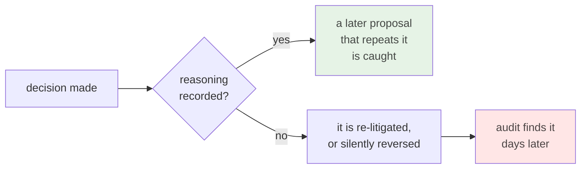

# ADR 0031 — Every ADR records its alternatives and why they lost

- **Status:** Accepted
- **Date:** 2026-07-30
- **Milestone / issue:** Cross-cutting; arose from M1.13b (#66)
- **Supersedes / superseded by:** Nothing. Applies to ADRs written **after** this one; existing ADRs are left as they are.

## Context

An ADR exists so a later reader can recover *why* a decision was made without re-deriving it.
Recording only the decision fails at that, because the expensive knowledge is usually not the
option that won — it is the options that lost, and the reason they lost.

M1.13b produced the evidence. Two cases, both real:

- **The rejected option came back.** ADR 0029 rejected *degrade-and-block-hooks* when the
  strict tier is unavailable. Because it named that option explicitly and said why, a later
  plan that proposed the same mapping was caught and refused — twice. Had 0029 recorded only
  "hard-fail," the reviewer would have had nothing to point at, and the seductive middle
  option would have landed.
- **A decision was silently reversed.** An implementer wired a sandbox write-grant to a
  catalog flag as defence in depth. That contradicted an accepted decision from days earlier
  which had *superseded* that flag — but the reasoning was thin enough that the conflict was
  invisible until a full audit surfaced it, a day later. The fix required stopping the work
  and writing a fresh decision document.

Both are the same failure: a decision that records its conclusion but not its reasoning cannot
defend itself.

## Decision

Every ADR written from now on includes:

1. **Alternatives considered** — the options that were genuinely on the table, stated well
   enough that a reader can see why each was tempting. An alternative described only well
   enough to dismiss is not an alternative, it is a straw man.
2. **Rejection reasoning** — for each, *why it lost*. Not "we chose X instead"; the specific
   cost, risk, or contradiction that ruled it out.
3. **Retrospective notes** — *optional*, added later. If a decision turns out wrong, or right
   for a reason nobody anticipated, that is appended rather than rewritten. The original record
   stays intact.

Existing ADRs are **not** retrofitted. Rewriting a historical record to a newer standard
destroys the thing that makes it a record.

## Alternatives considered, and why they lost

### Leave the format as it is
Several existing ADRs already do this well — 0029's rejected-options section is what caught a
repeat proposal. **Rejected because it was inconsistent.** The ADRs that carried their
reasoning worked; the ones that did not produced the silent-reversal incident above. A
convention that only sometimes holds provides no guarantee to a reader, and a reader cannot
tell which kind they are holding.

### Retrofit the existing ADRs to the new format
Tempting: uniformity, and the older records are genuinely thinner. **Rejected on two grounds.**
An ADR is a record of what was decided *at a time*, and reconstructing alternatives after the
fact writes fiction into a document whose whole value is that it is contemporaneous — the
reconstruction would be today's reasoning wearing an old date. And it is unbounded work with
no forcing function, so it would be half-done, leaving the same "which kind is this?"
ambiguity the change exists to remove.

### Require retrospective notes rather than making them optional
**Rejected because a mandatory field with nothing to say gets filled with noise.** Most
decisions never need one. Requiring it would produce a page of "no notes at this time" entries
that train readers to skip the section — including on the rare ADR where it matters.

### Adopt the full 13-section approval-document format for ADRs
That heavier format (executive summary, impact map, glossary, approval checklist) already
exists for decision packages needing sign-off, and works well there. **Rejected for ADRs**
because tracked repository docs are held to a terse-and-dense standard: an ADR is read by
someone who already has context and wants the reasoning, not by someone deciding whether to
approve. The two documents have different readers, and collapsing them would make the ADR
worse for its actual audience.

## Consequences

- ADRs get longer. That is the cost, accepted deliberately: the reader is a future maintainer
  with a question, not someone skimming.
- Writing one becomes harder in a useful way. Being unable to articulate why the alternatives
  lost is a signal the decision is not ready.
- Reviewers gain something to point at. "That option was rejected, here, for this reason" ends
  a re-litigation in one line.
- **The failure mode this does not fix:** a recorded decision can still drift from the code, as
  D6 did in M1.13b — the ADR said one thing while the CI file did the opposite for a day.
  Recording reasoning does not verify implementation. That remains a separate discipline.

## Where this is implemented

This document, in its own shape. ADR 0030 already conforms. The convention is enforced by
review, not by a tripwire — noted as a known weakness, given this project's own repeated
finding that reviewer-enforced invariants are the ones that quietly lapse.

---

**Signed:** thomas2025 · 2026-07-30T19:27:01-04:00
