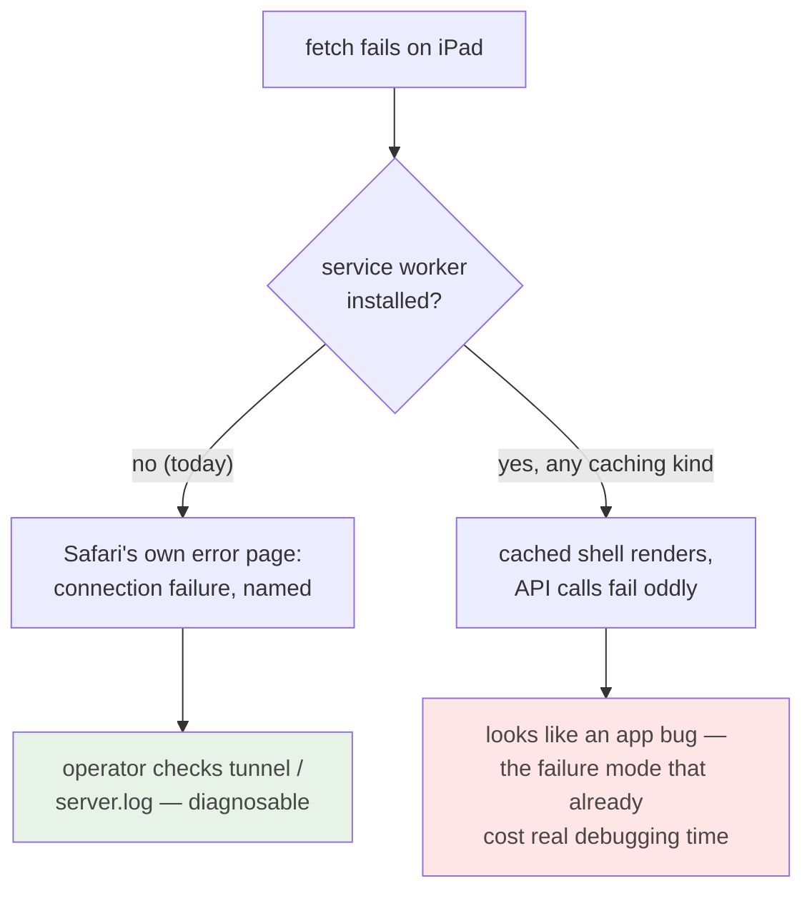

# ADR 0032 — No service worker: offline is a failure to surface, not to mask

- **Status:** Accepted
- **Date:** 2026-07-30
- **Milestone / issue:** M1.12 (#65), PWA sub-project
- **Supersedes / superseded by:** Nothing. Promotes the reasoning recorded in
  `crates/git-vista/index.html`'s service-worker comment to a durable decision,
  per that comment's own request.

## Context

The #65 PWA work landed a manifest, a real icon set, and `apple-touch-icon` —
home-screen installation on iOS works. The reflexive next step on any PWA
checklist is a service worker. This ADR records why that step is refused, and
why the refusal is a decision about *honesty*, not a deferred chore.

Four facts about this app, all verifiable in source:

1. **Every static byte is served `Cache-Control: no-cache`** (`main.rs`
   `build_app`), deliberately, so a rebuilt wasm hash is revalidated on next
   load. A precaching worker exists to defeat exactly that revalidation.
2. **Artifacts are content-hashed per build** (`git-vista-ui-<hash>_bg.wasm`)
   and this crate has no build step that could generate a precache manifest, so
   any hand-written list is stale after every `trunk build`.
3. **Nothing under `/api` may ever be cached.** The app is a live view of a
   working git repository; the server already sends `no-store`. A cached
   `/api/frame` showing a branch that has since moved is worse than any error.
4. **The transport is a loopback bind reached over an SSH forward** — plus one
   deliberate exception, the opt-in LAN view listener (`gv --lan-view`,
   ADR 0005; bootstrap-token, view-scoped, rate-limited). Under either
   transport, "offline" almost always means **the tunnel or the LAN path
   died**, not "the user left Wi-Fi coverage". This project has already paid
   real debugging time for a failure that looked like an app bug and was a
   dead tunnel (`ipad-tunnel-fragility`, project memory).

## Decision

**This app ships no service worker, permanently.** Not "not yet" — the four
facts above are structural, and standalone home-screen launch on iOS needs no
worker (only the `apple-mobile-web-app-capable` meta, already shipped), so
nothing is lost.

The decision is enforced two ways:

- the `index.html` comment at the registration's natural insertion point,
  addressed to whoever arrives to "finish the PWA";
- a tripwire test (`features::shell::pwa_guard`) that fails if a
  `serviceWorker` registration string appears in `index.html`, or if the
  deliberate-NO comment is removed without updating this record. The test
  guards the HTML vector only; a Rust-side registration would need
  `web_sys::ServiceWorkerContainer`, a name grep-able in review.

## Alternatives considered, and why they lost

### Precaching worker ("complete the PWA properly")
The checklist answer, and what every PWA tutorial produces. **Rejected because
it fights the server on purpose:** the whole point of `no-cache` static serving
is that a rebuild is picked up on next load, and precaching exists to prevent
exactly that. With content-hashed filenames and no manifest-generating build
step, the precache list is stale after every build — the best case is wasted
work, the worst case is a white screen pinned to a deleted hash.

### Runtime-caching worker (network-first, cache fallback)
The sophisticated-sounding middle option: never stale while online, "graceful"
when offline. **Rejected because the fallback *is* the masking failure mode.**
Serving the cached shell over a dead tunnel converts a diagnosable network
failure into an apparent app bug, and any fallback for `/api` responses
actively lies about repository state. The failure this "gracefully" handles is
precisely the one that must stay loud.

### Static-only worker with a build-generated manifest
Technically coherent: cache only hashed artifacts, generated per build, never
touch `/api`. **Rejected on the Future Me Check:** it requires a build step
that does not exist, to save round-trips to a server on the same box (or one
SSH hop away) — latency that was never the problem. Complexity has to earn its
place; this buys nothing measurable and installs a permanent update-lifecycle
liability (workers outlive the pages that registered them).

### Tiny no-cache worker, only to show a nicer offline page
The tempting small one: no caching, just intercept failures and render "your
tunnel is probably down". **Rejected because it is still a worker with all of
a worker's lifecycle risk** — a stale worker can outlive the reasoning baked
into its error page — and the marginal gain over Safari's own connection-error
page (which already names the network as the culprit) does not cover that
standing cost. A friendlier page about a dead tunnel is still a page masking
which layer died.

## Consequences

- Offline, the app fails loudly with the browser's own network error. That is
  the intended behaviour, and `docs/IPAD_DESIGN.md`'s matrix should test for
  it rather than for offline resilience.
- Add-to-home-screen, the manifest, and the icon set are unaffected.
- If the transport model ever changes fundamentally (a genuinely remote,
  internet-facing deployment), fact 4 falls and this ADR must be revisited —
  by a new ADR, not by quietly registering a worker; the tripwire makes the
  quiet path fail.
