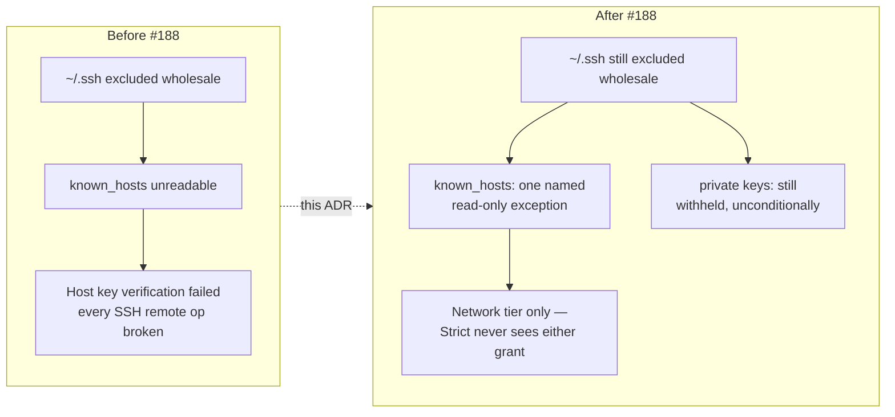
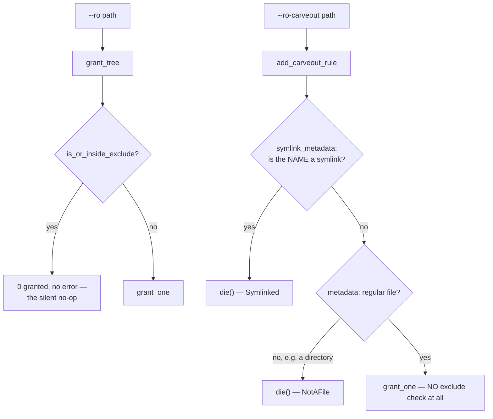
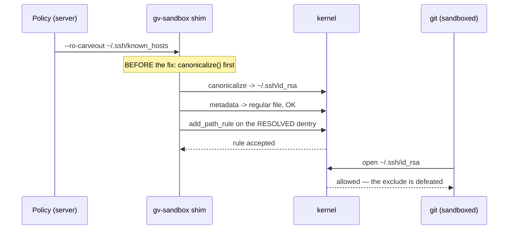
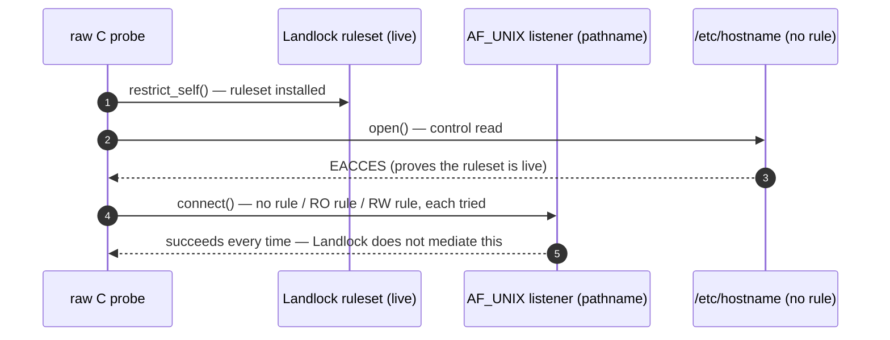
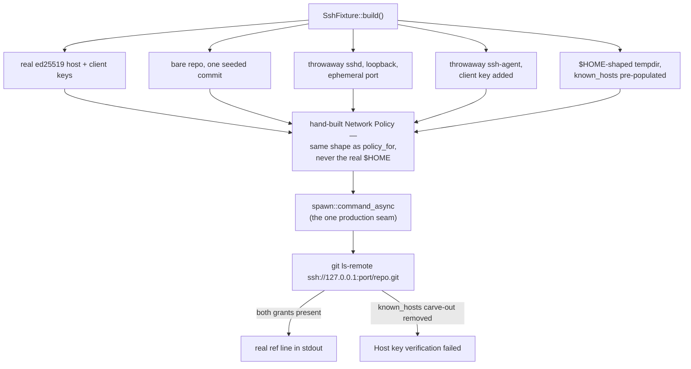

# 0033 — SSH remotes under the sandbox: a narrow, explicit carve-out through `secret_excludes`

- **Status:** Accepted — implemented and tested.
- **Date:** 2026-07-31.
- **Milestone / issue:** Follow-up to M1.13b (#66). Issue #188, "SSH remotes
  under the sandbox: narrow known_hosts + agent-socket carve-out (Network
  tier only)." Decided by Tom 2026-07-29 (do the carve-out, but later);
  built 2026-07-31 once #66's Task 6 migration (every production git spawn
  routed through the sandbox chokepoint) had landed and unblocked it.
- **Supersedes:** nothing. **Narrows** a boundary [0027](0027-landlock-enumerate-and-skip.md)
  and [0030](0030-git-process-sandbox.md) established: that `secret_excludes`
  outranks every grant, with no exception. This ADR records the one,
  deliberate, tier-gated exception to that rule.
- **Related:** [0027](0027-landlock-enumerate-and-skip.md) (the
  enumerate-and-skip mechanism this ADR adds a bypass beside, not inside),
  [0028](0028-network-tier-ports-not-hosts.md) (the network tier's accepted
  host-confinement gap — unrelated to, and unwidened by, this change),
  [0030](0030-git-process-sandbox.md) (the whole-sandbox record; §6 "layered
  mechanisms" and §7 "the anti-vacuity contract" are both extended here, not
  replaced).

## Context

The sandbox withholds `~/.ssh` outright — it is a whole-directory entry in
`DEFAULT_SECRET_EXCLUDES` (`sandbox/mod.rs`) and is one of the exact
things the threat model exists to protect: a hostile hook must never read a
private key. But git needs two things under `~/.ssh` to push, fetch, clone or
`ls-remote` over SSH at all — `~/.ssh/known_hosts`, to verify a server's
identity, and the socket named by `$SSH_AUTH_SOCK`, to authenticate without
the sandboxed process ever touching a private key directly. Reproduced
2026-07-29 by running the real `gv-sandbox` shim against a scratch repo:

```text
hostkeys_foreach failed for /home/tom/.ssh/known_hosts: Permission denied
Host key verification failed
```

So every SSH remote operation failed outright under the sandbox. Tom's
decision, recorded verbatim in the issue: carve out `known_hosts` read-only
and the agent socket, Network tier only, and accept two narrow, named costs —
`known_hosts` is public key material (it reveals *which* hosts the user
connects to, not a secret that grants access), and the agent socket grants
*use* of a key, never *extraction* of it. Neither grant reaches the Strict
tier, which is where hostile repository content actually runs; both apply
only to push/fetch/clone/`ls-remote`, which are user-initiated against a
remote the user chose.



## Decision

### 1. A new, narrow bypass mechanism — `Policy::ro_carveouts`

The obvious first attempt — add `~/.ssh/known_hosts` as an ordinary `--ro`
tree — does not work, and fails **silently**. `grant_tree`
(`bin/gv-sandbox/main.rs`) checks `is_or_inside_exclude` *before*
building any rule; `known_hosts` starts with the excluded `.ssh` path, so
`grant_tree` returns `0` granted with no error, no diagnostic, nothing. This
collides directly with `SECURITY_MODEL.md`'s existing invariant that
`secret_excludes` "outranks grants" — which was, until this issue, stated
with no exception.

So a new field, `Policy::ro_carveouts: Vec<PathBuf>` (`mod.rs`),
carries named, single-file exceptions that bypass `is_or_inside_exclude` and
`is_ancestor_of_exclude` entirely — not by special-casing them inside
`grant_tree`, but by never calling it. The shim's `add_carveout_rule`
(`bin/gv-sandbox/main.rs`) refuses — `die()`, never a silent no-op — unless
the named path passes **both** checks in §1a: its final component is not a
symlink, and it resolves to a regular file rather than a directory. Only then
does it call `add_path_rule` directly. `grant_carveout` (`main.rs`) is the
`die()`-wrapping caller, mirroring `grant_one`'s existing shape exactly: an
absent path is tolerated (a fresh `$HOME` with no SSH connections yet has no
`known_hosts`), any other failure refuses the launch rather than silently
granting nothing.



#### 1a. Two refusals, not one — the symlink guard

`NotAFile` alone is **not** a sufficient safety property, and the first
version of this ADR said it was. That version canonicalised the path first
and then asked only "is the result a regular file?", which rules out
*widening to a directory* but says nothing about *redirection to a different
file*. A Landlock `path_beneath` rule is anchored to the filesystem object
reached through the `O_PATH` descriptor `add_path_rule` opens — not to the
path string used to open it. So a `~/.ssh/known_hosts` that is a symlink to
`~/.ssh/id_rsa` passed every check and granted read access to **the private
key**, by its real path, while `--exclude ~/.ssh` still looked intact.



The fix is one check, placed **before** `canonicalize`, because canonicalising
first destroys the evidence: `real` is then the target and looks like a
perfectly ordinary regular file. `add_carveout_rule` now calls
`symlink_metadata` on the named path and refuses with a distinct
`CarveoutError::Symlinked` if the final component is a link.

Two things about the shape of that rule are deliberate:

- **It is stricter than containment.** `enumerate()` already guards the
  ordinary `--ro`/`--rw` tree walk with `real.starts_with(root)`, but that
  check cannot be reused here: the dangerous target (`~/.ssh/id_rsa`) sits in
  the *same directory* as the legitimate one, so containment would pass it.
  The carve-out's rule is that the named path must **be** the file, never
  point at one.
- **A dangling symlink refuses too**, rather than falling through to the
  tolerated `Absent` outcome. `canonicalize` reports exactly `NotFound` for a
  broken link, making the naive ordering indistinguishable from a host that
  genuinely has no `known_hosts` yet — and `Absent` waves the launch through.
  "The redirection is currently broken" is not the same fact as "this host
  has never connected over SSH", and only the second is safe to ignore.

Nothing inside any tier can create such a symlink — `.ssh` is excluded from
every policy — so the precondition is a link established outside the sandbox:
a dotfile manager that symlinks `~/.ssh/known_hosts` into a managed
repository, or an earlier compromise. The first is common enough that the
refusal is a real behaviour change: a `stow`/`chezmoi` user with a symlinked
`known_hosts` will now see the SSH clone refuse to launch, with a message
naming the link. That is the intended trade — a loud refusal is recoverable,
a silent key grant is not.

Closure is measured, not argued: deleting the `symlink_metadata` check makes
exactly two tests fail (`a_carveout_refuses_a_symlink_but_grants_its_target_named_directly`
and `a_carveout_refuses_a_dangling_symlink_rather_than_tolerating_it`) and no
others — the same narrow-kill shape M11 has for the carve-out itself. The
first of those carries its paired positive in-test: the very same target
file, named directly, is still granted in the same ruleset, so the refusal is
attributable to the symlink and not to an unusable fixture.

There is deliberately **no escape-battery case** for this. The battery
observes a sandboxed process's syscall outcomes, and `grant_carveout` refuses
the *launch* on a non-absent error — there is no process to observe. The
harness cannot express "the sandbox correctly declined to start", so a case
here would have to assert something weaker than the unit test already does.

A new argv flag, `--ro-carveout`, deliberately distinct from `--ro`
(`mod.rs`'s `shim_argv`, emitted after the `--exclude` loop so the argv reads
left to right as a narrative: grants, excludes, then the explicit, reviewed
exception to an exclude). A reviewer scanning a launcher command line sees
immediately which grants are the sanctioned exception rather than an
ordinary tree grant — the same D5 Option B auditability property every other
grant in this design already has. R10's flag-round-trip tripwire
(`escape_contract.rs`) requires — and confirms — that the flag has both a
`shim_argv` emitter and a `gv-sandbox::main::parse` arm.

`ssh_known_hosts_carveout(home)` (`mod.rs`) is the one populated case:
`vec![home.join(".ssh/known_hosts")]`, called from the Network branch of
**both** independent production `Policy` constructors — `policy_for`
(`mod.rs`) and `policy_for_clone` (`mod.rs`, hard-coded to
`Tier::Network` and does not call `policy_for` at all). Missing either site
was the single most likely way to ship this half-working: skipping
`policy_for_clone` would leave `git clone git@host:…` broken while
`push`/`fetch`/`ls-remote` on an already-cloned repository worked — the
issue's own three named operations, silently reduced to two.

**Measured, not assumed**, before committing to this shape: a hand-built
launcher argv (`--ro <fake $HOME> --exclude <fake $HOME>/.ssh --ro-carveout
<fake $HOME>/.ssh/known_hosts`) against a scratch fixture showed known_hosts
readable (no `Permission denied`, only a downstream content-parse error —
proof the *read* succeeded) while a private key in the same tree, under the
identical policy, stayed `Permission denied`; pointing `--ro-carveout` at the
parent directory itself was refused outright with a named diagnostic. All
four outcomes matched the design before a line of the `Policy`/`policy_for`
plumbing was written.

### 2. Why a per-filename exclude list was rejected

The alternative that keeps `.ssh` recursible (like `.config/gh`) and
individually re-excludes known key filenames (`id_rsa`, `id_ed25519`, …),
letting everything else — including `known_hosts` — fall through, was
considered and rejected as **unsound**. `~/.ssh` can hold a private key under
any name at all (`~/.ssh/my_deploy_key`), and `DEFAULT_SECRET_EXCLUDES` is
matched by exact path component, not by glob (`mod.rs`'s own doc) — no
fixed filename list can guarantee every private key stays denied. Only the
whole-directory-exclude-plus-explicit-override shape is sound for an
arbitrary keyset, which is why `ro_carveouts` names exactly one file
(`known_hosts`) rather than inverting the exclude's shape.

`ssh_known_hosts_carveout`'s escape-battery case
(`CASE_SSH_KNOWN_HOSTS_CARVEOUT`, below) is designed to catch a build that
took the unsound shortcut anyway: its denied leg targets `~/.ssh/id_ed25519`
— a plausible private-key filename an unsound per-name-exclude
implementation would have to enumerate correctly, and which this design does
not need to.

### 3. The agent socket — a grant that costs nothing and proves something unexpected

`policy_for`/`policy_for_clone`'s Network branch also adds `$SSH_AUTH_SOCK`
(when set) to `rw_trees` (`ssh_agent_socket_grant`, `mod.rs`). This
flows through the *ordinary* `rw_trees`/`grant_tree` path — `/tmp`, where an
agent socket almost always lives, carries no entry in
`DEFAULT_SECRET_EXCLUDES`, so there is no exclude here to bypass and
`ro_carveouts` is the wrong mechanism for it.

Two things were measured before this landed, and the second overturned the
plan's own working assumption:

* **The environment value needs no code change at all.** `spawn.rs`'s
  `command_async` — the crate's one production spawn seam — never touches
  the environment (its own doc comment says so explicitly); a `SSH_AUTH_SOCK`
  set in the server process is already inherited verbatim by every
  sandboxed child, in every tier. An earlier fact-sheet handed to the build
  session claimed otherwise (an env allowlist that would need extending) —
  checked directly against `spawn.rs` and found wrong before any code was
  written on that premise.
* **The filesystem grant is not what makes the socket reachable, on this
  kernel.** A raw Landlock probe — a real `AF_UNIX` `SOCK_STREAM` listener,
  a live ruleset (`HANDLED_FS` declared, the exact
  `LANDLOCK_SCOPE_ABSTRACT_UNIX_SOCKET | LANDLOCK_SCOPE_SIGNAL` scope the
  shim installs), proven live by a same-run control read of `/etc/hostname`
  that correctly came back `EACCES` — showed `connect()` to a **pathname**
  `AF_UNIX` socket succeeding identically whether the socket carried no
  Landlock rule at all, a read-only rule, or a read-write one. This matches,
  and was the direct trigger for actually believing, `seccomp_filter.rs`'s
  own existing note that "Landlock ABI 8 does not mediate **pathname**
  sockets at all" — `LANDLOCK_SCOPE_ABSTRACT_UNIX_SOCKET` covers only the
  *abstract* namespace, which `ssh-agent`'s filesystem socket is not.



So, **today**, what actually makes the agent socket reachable in the Network
tier is the pre-existing seccomp exemption — `seccomp_filter::af_unix_rule`
denies `socket(AF_UNIX, …)` in the **Strict** tier only, already landed with
an explicit `#188` comment anticipating this issue — plus the automatic env
inheritance above. The `rw_trees` grant is added anyway, for three reasons
that all survive that fact: it costs nothing (the kernel accepts the rule
regardless of whether it is presently consulted); it keeps this design's
D5 Option B property — what the sandbox permits is auditable from the argv
alone — intact for the one grant that would otherwise be invisible there;
and it keeps this working unchanged if a future Landlock ABI starts
mediating pathname `AF_UNIX` sockets. `ssh_agent_socket_grant`'s own doc
comment (`mod.rs`) and `sandbox::ssh_remote`'s
`ls_remote_still_succeeds_without_the_agent_socket_grant_on_this_kernel`
test both carry this reasoning and both will need revisiting — not
silencing — if a kernel upgrade ever flips that test red.

### 4. Tests: an EscapeCase, structural argv checks, and a real `sshd`

`CASE_SSH_KNOWN_HOSTS_CARVEOUT` (`escape_suite.rs`, test fn
`ssh_known_hosts_carveout`) is a real hostile-hook `EscapeCase`, through the same production
`policy_for_repo` dispatch and kernel-provenance checks (`Seccomp:`,
`NoNewPrivs:`) every other case in the battery uses. Its `probe_tag`
(`"SSHKEY"`) reads `~/.ssh/id_ed25519` and asserts `EACCES`; its mandatory
R3 paired positive (`"GRANTED"`) reads `~/.ssh/known_hosts` and asserts
`Errno(0)` — both under the same `~/.ssh` tree, in the same probe run, per
R3's literal requirement. `CASE_SECRET_READ_DENIED`
(`escape_suite.rs`) — which targeted exactly `known_hosts` as its
"must stay denied" leg before this issue — is repointed to
`~/.ssh/id_ed25519` (`secret_read_probe`) : its own claim (a secret
under `$HOME` stays denied) needed a target that stays true after #188, and
a private key is the more durable choice regardless of what else changes
under `~/.ssh`. Left unedited, that case would have started failing the
moment `known_hosts` became legitimately readable — a certain, not merely
possible, side effect, fixed in the same diff as the mechanism that caused
it.

R9's mutation matrix gained `MutantId::M11`
(`ci/mutants/M11-empty-ssh-known-hosts-carveout.patch`, `escape_contract.rs`),
which empties *only* `ssh_known_hosts_carveout`, leaving `secret_excludes`
and Landlock enforcement demonstrably intact. The two pre-existing mutants
M2 (Landlock never restricted) and M3 (`secret_excludes_for_home` emptied)
also kill `ssh_known_hosts_carveout`'s case, but neither is specific to this
mechanism — M11 is what makes the case's claim mechanical rather than
editorial, the same reasoning M8/M9/M10 already established for the AF_UNIX
and io_uring cases. Verified by hand (not via a full ten-mutant
`ci/mutation-matrix.sh` run, which rebuilds the crate once per mutant and was
judged too expensive for this session): the patch applies cleanly with the
script's own `--fuzz=0`/`--strict` flags, and, applied to a full rsync'd
copy of the tree, kills `ssh_known_hosts_carveout` (`ESCAPED — inside
GRANTED wanted errno 0 got 13`) while leaving `secret_read_denied`
untouched.

`argv.rs` gained five tests proving **production** `policy_for` and
`policy_for_clone` — not merely the pure `sandbox_argv` function — populate
both grants correctly per tier, including the literal "verified absent from
a Strict policy's argv" acceptance wording:
`production_policy_for_carries_the_known_hosts_carveout_in_network_only`,
`ssh_agent_socket_grant_is_network_tier_only_and_only_when_set`,
`production_policy_for_wires_the_agent_socket_grant_into_the_network_argv`,
`policy_for_clone_carries_both_188_grants`, plus the pre-existing synthetic-
fixture tests extended with the new field.

`sandbox::ssh_remote` (new file, `mod.rs`-declared `#[cfg(test)]`) is the
real end-to-end box: a throwaway loopback `sshd` (real ed25519 host key), a
throwaway `ssh-agent` holding a real client key, a bare repository with one
seeded commit, and a `$HOME`-shaped tempdir carrying exactly the
`known_hosts` line the carve-out is meant to expose — never the operator's
real `~/.ssh`. `a_real_ssh_ls_remote_succeeds_through_the_composed_launcher`
drives a real `git ls-remote ssh://…` through `spawn::command_async` and
asserts both exit success and the seeded ref's presence in real stdout — not
merely an exit code. `ls_remote_fails_without_the_known_hosts_carveout` is
the genuine negative control (host-key verification fails without the
grant); the agent-socket sibling test asserts the *opposite*, deliberately,
recording rather than hiding the finding in Decision §3.



Why this file builds its own `Policy` rather than calling `policy_for`
directly: `policy_for` reads the real `$HOME` (and, transitively through
`ssh_agent_socket_grant`, the real `SSH_AUTH_SOCK`), which many other tests
in this binary also read concurrently. Redirecting `$HOME` process-wide, or
mutating the operator's real `~/.ssh/known_hosts` (append a throwaway
host-key line, Drop-guarded removal), were both considered — the first
races every concurrently-running `policy_for` caller in this crate, far
wider than the single-key `SSH_AUTH_SOCK` mutation `argv.rs`'s tests already
do safely (verified nothing else touches that key); the second is a
genuinely new risk category for this crate's test suite (the first test to
touch a real dotfile outside a tempdir) and was flagged as a real design
fork rather than decided unilaterally. So `sandbox::ssh_remote` builds a
`Policy` field-for-field the same shape `policy_for` builds for the Network
tier, pointed at a fully throwaway `$HOME`. What that leaves genuinely
unexercised here — `policy_for`'s own env reads — is exactly what `argv.rs`'s
production-policy tests cover, against the real environment. Neither file
alone proves the full claim; both together do.

## Alternatives considered

- **A per-filename exclude allowlist inside `.ssh`, mirroring `.config/gh`.**
  Rejected as unsound for an arbitrarily-named private key — see Decision §2.
- **Loosen `grant_tree`'s exclude check globally** (e.g. a priority/override
  field consulted inside `is_or_inside_exclude` itself). Rejected: it would
  make every `--ro`/`--rw` call site a potential exclude-bypass site, when
  the actual need is exactly one file, in exactly one tier. A separate flag
  and a separate, non-`grant_tree` code path make the exception
  structurally impossible to reach by accident from an ordinary grant.
- **Widen the Strict tier to also carry these grants**, for uniformity.
  Rejected outright and by name in the issue: Strict is where hostile
  repository content actually runs, and neither grant is reachable from it
  in this design — `known_hosts` is absent from `ro_carveouts` in every
  non-Network tier (`mod.rs`), and Strict's seccomp filter denies
  `AF_UNIX` `socket()`/`socketpair()` unconditionally regardless of any
  Landlock grant, so even a mistaken Landlock rule there would not reopen
  the socket.
- **Assume the agent-socket grant is load-bearing and stop there.** The
  measurement in Decision §3 found this false on the current kernel. The
  grant was kept anyway (auditability, zero cost, future-proofing) rather
  than dropped, but the ADR records the honest finding instead of the
  assumption a build could have shipped without measuring.
- **Run the full ten-mutant `ci/mutation-matrix.sh` to validate M11.**
  Rejected for this session on cost grounds (a full crate rebuild per
  mutant); a targeted manual application of just the M11 patch, run against
  both the new and the sibling pre-existing case, was judged sufficient
  evidence for this change and is recorded as what was actually done, not
  overclaimed as the full matrix.

## Consequences

- **`SECURITY_MODEL.md`'s "secret_excludes … outranks grants" is no
  longer exceptionless.** Annotated in place with the one, narrow, tier-gated
  exception this ADR records, rather than left to read as an absolute a
  future reader could be surprised by.
- **A new mechanism, `Policy::ro_carveouts`, exists beside
  `secret_excludes`/`grant_tree` rather than inside it.** It is deliberately
  narrow (single files only, refused for anything else) and has exactly one
  populated caller today (`ssh_known_hosts_carveout`). Nothing about its
  shape prevents a second caller in the future, but nothing recommends one
  either — each addition should carry the same "measured, narrow, reviewed"
  bar this one did, not be treated as a general escape hatch now that the
  plumbing exists.
- **A carve-out is a *name*, not a path to a file.** §1a's symlink refusal is
  the price of the mechanism being safe at all, and it binds every future
  caller: a carve-out target that a dotfile manager symlinks will refuse the
  launch. Anyone adding a second `ro_carveouts` entry inherits that constraint
  and should say so in the same breath, because the failure it produces
  (a refused clone naming the link) looks like a bug until you know it is a
  deliberate guard.
- **Reviewing "resolve, then check" is now a house pattern with a known
  trap.** This bug and `enumerate()`'s `real.starts_with(root)` guard are the
  same class: canonicalising before validating discards the fact you needed
  to validate. Any future code that calls `canonicalize` on an
  operator-supplied path and then grants something based on the result should
  be read with that question first.
- **The agent-socket grant is currently inert at the Landlock layer, and
  that is now a tracked, tested fact, not a silent assumption.** A future
  kernel or Landlock ABI upgrade that starts mediating pathname `AF_UNIX`
  sockets will flip
  `ls_remote_still_succeeds_without_the_agent_socket_grant_on_this_kernel`
  from pass to fail — the intended signal that the grant has become
  load-bearing, at which point `ssh_agent_socket_grant`'s doc comment (and
  this ADR) need a follow-up, not a silenced test.
- **DNS/HTTPS resolution in the Network tier is confirmed working, not part
  of this issue.** The issue's own DNS note ("also broken in the Network
  tier, folded into Task 6 directly — check whether that landed") was
  checked directly this session: `git ls-remote https://github.com/git/git
  HEAD`, through the real composed Network-tier launcher argv shape,
  resolved and returned the real `HEAD` oid (exit 0). This matches
  `NETWORK_ONLY_RO_TREES`'s own measurement notes (`mod.rs`) and is
  recorded here purely as a scope boundary — out of #188 either way, and
  not touched by this change.
- **A pre-existing, unrelated defect was found and left unfixed, on
  purpose.** While verifying M11 (Decision §4), `ci/mutants/M3-empty-secret-excludes.patch`
  was found to already be stale against `git HEAD` — its hunk no longer
  applies with the `--fuzz=0`/`--strict` flags `ci/mutation-matrix.sh` uses,
  independent of anything in this change (confirmed by testing the patch
  against the pre-#188 committed source directly). `ci/mutation-matrix.sh`
  would therefore currently fail at the M3 step if run end to end. This is
  outside #188's scope and was not fixed here; recorded so it is not lost.
- **The two rejected/superseded costs the issue itself named are unchanged
  by anything in this ADR:** `known_hosts` is public key material (host
  identity, not a credential); the agent socket grants *use* of a key, never
  *extraction*. Both remain true regardless of the Landlock-mediation
  finding in Decision §3 — that finding is about *reachability*, not about
  what the socket, once reached, can be made to do.

## Where this is implemented

- `crates/git-vista-server/src/sandbox/mod.rs` — `Policy::ro_carveouts`,
  `ssh_known_hosts_carveout`, `ssh_agent_socket_grant`, both grants wired
  into `policy_for` and `policy_for_clone`, `shim_argv`'s `--ro-carveout`
  emission.
- `crates/git-vista-server/src/bin/gv-sandbox/main.rs` — `Args::ro_carveouts`,
  the `--ro-carveout` parser arm, `CarveoutError`, `add_carveout_rule`,
  `grant_carveout`, wired into `apply_landlock`; three new unit tests
  proving the bypass and its directory-refusal.
- `crates/git-vista-server/src/sandbox/escape_suite.rs` —
  `CASE_SSH_KNOWN_HOSTS_CARVEOUT`, `harness::ssh_known_hosts_carveout_probe`;
  `CASE_SECRET_READ_DENIED`/`harness::secret_read_probe` repointed to
  `id_ed25519`.
- `crates/git-vista-server/src/sandbox/escape_contract.rs` —
  `MutantId::M11`; `HOST_SETUP_TOKENS` gained `openssh-server` and
  `id_ed25519` entries.
- `crates/git-vista-server/src/sandbox/argv.rs` — the five structural tests
  named in Decision §4, plus `ro_carveouts` added to the existing synthetic
  `policy()` fixture.
- `crates/git-vista-server/src/sandbox/ssh_remote.rs` — new file, the real
  `sshd`/`ssh-agent` end-to-end fixture and its three tests.
- `crates/git-vista-server/src/sandbox/probe.rs`, `escape_contract.rs`
  (harness branch), `argv_boundary.rs` — `ro_carveouts: Vec::new()` added to
  every other `Policy { .. }` literal the new field's addition touched.
- `ci/mutants/M11-empty-ssh-known-hosts-carveout.patch`,
  `ci/mutation-matrix.sh` — the new mutant and its three registration points
  (the mutants array, the patch-path map, the Python parser's known-id set).
- `.github/actions/host-sandbox-setup/action.yml` — `openssh-server`
  installation and `~/.ssh/id_ed25519` baseline provisioning, alongside the
  existing `known_hosts` step.
- `docs/sandbox/escape-census.txt` — `ssh_known_hosts_carveout` added.
- `docs/SECURITY_MODEL.md` — annotated where implemented (see that file's
  own diff for the exact location).

---

**Signed:** thomas2025 · 2026-07-31T11:34:08-04:00
