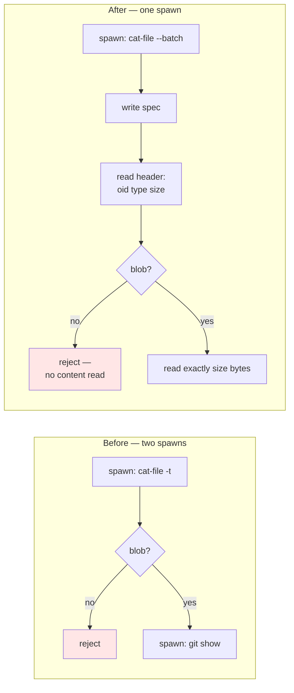

# ADR 0034 — File-at-commit reads go through one long-lived `cat-file --batch` process

- **Status:** Accepted
- **Date:** 2026-08-01
- **Milestone / issue:** M2 (#170); implemented as #221
- **Supersedes / superseded by:** Nothing superseded. Narrows the read path ADR 0027 and the
  #168/#169 work established, without changing what either guarantees.

## Context

`file_at_commit_for_repo` served one file from one commit with **two** git spawns:
`git cat-file -t <spec>` to learn the object's type, then `git show <spec>` for its content.
The type check exists because of #168: a path that resolves to a `tree`, `commit` or `tag`
must be *rejected*, never served as if it were file content. The second spawn only ran once
the first had proven the object was a blob.

Two spawns per file read is affordable when a read is a discrete user action. It stops being
affordable under M2.16's virtualized diff views (#69), where scrolling turns file reads into a
per-scroll cost. Every spawn also pays the sandbox launcher's fixed cost — measured at 17–24 ms
per process in M1.13b — so the overhead is structural, not incidental.

`git cat-file --batch` answers repeated queries on one held-open process: write `<spec>\n` to
stdin, read back `<oid> SP <type> SP <size> LF`, then exactly `<size>` content bytes, then a
trailing LF. One spawn can serve many reads.

The reason this needed a decision rather than a refactor is that the *safety* of the two-spawn
design was partly accidental. Each spawn was a fresh process with a fresh call stack, so
nothing from the first lookup could leak into the second. Collapsing to one stateful process
removes that accident and introduces a bug class that could not previously exist: a fallback
lookup reusing type information parsed from the *previous* query.

## Decision

`file_at_commit_for_repo` uses **one** `cat-file --batch` process for the whole read, including
the parent-fallback path (`<id>^:<path>` when `<id>:<path>` is missing), which writes to the
same still-open stdin rather than spawning again.

The security property is preserved **structurally, not by convention**: the batch wire format
puts the header before the content in the same stream, so the type is necessarily known before
any content byte exists to be read. The parser returns `NotABlob` from the header alone,
without consuming content. Each query parses its own header fresh — no type state carries
between the direct lookup and the fallback.

Supporting decisions, each load-bearing:

- **The cap is enforced from the parsed `size` field, before content is read.** An over-cap
  blob is refused from its header rather than streamed and truncated.
- **An embedded `\n` in a path is refused before spawning.** In a line-oriented protocol a
  newline would silently split one query into two, desynchronising every subsequent
  request/response pair on that process.
- **A path traversal is a process-level fatality, not a per-query miss.** Verified against git
  2.43: `../` makes `cat-file --batch` exit 128 and die rather than answer `missing`. This is
  handled as a distinct outcome, so no second write is attempted against a dead pipe.
- **`missing` is discriminated by the header's trailing shape, not by substring search**, so a
  file legitimately named `missing` still parses correctly.

`argv_boundary.rs`'s bounded-read census drops from five call sites to four, with its name, count
and rationale updated together rather than the number alone.

## Alternatives considered, and why they lost

### Keep two spawns and accept the cost
Genuinely tempting: the code was correct, the security property was proven by two existing
regression tests, and the accidental isolation between spawns was doing real safety work for
free. **Rejected because the cost is per-file and #69 is about to multiply the file count.**
A design that is fine at one read per user action is not fine at one read per scroll tick. The
17–24 ms sandbox launch cost is paid on every spawn regardless of how small the file is.

### One `cat-file --batch` process shared across requests, kept alive in server state
The natural next step, and where the real performance win lives — the spawn cost would be paid
once per repository rather than once per read. **Rejected for now on lifetime and isolation
grounds.** A long-lived child process outliving the request that created it needs an owner, a
cancellation story, and a policy for what happens when the repository changes underneath it —
none of which #221 was scoped to design. It also weakens the per-request sandbox posture: one
process serving many requests is one process whose policy was chosen for the *first* of them.
Worth revisiting deliberately, not as a side effect.

### `git cat-file --batch-check` first, then `--batch` for content
Preserves the "check type, then fetch" shape almost exactly, which makes it the smallest
conceptual diff from the existing code. **Rejected because it reintroduces the second spawn**
it was meant to remove, and buys nothing: `--batch` already emits the type in its header before
any content, so a separate check pass is redundant work for the same answer.

### Parse the type but read content optimistically in parallel
Would shave the header-parse latency on the common blob case. **Rejected because it inverts the
security property.** Reading content before the type is known is exactly the state #168 exists
to prevent, and "we discard it if the type turns out wrong" is a discipline claim, not a
structural one — the kind this project has been burned by seven times in one milestone.

## Consequences

- One spawn per file read, including the fallback. The parent-fallback path costs a second
  round-trip on the same pipe rather than a second process.
- The read path now depends on `cat-file --batch`'s wire framing. That format is documented and
  stable, but it is a protocol dependency where previously there was none — a future git that
  changed the header grammar would break reads rather than merely slow them.
- The parser is a genuinely separate, testable unit. The security property can be verified by
  reading it in isolation, rather than only inferred from two integration tests passing — and
  is, by a test whose synthetic stream contains *only* a header, so any accidental content read
  would hit EOF rather than silently succeed.
- The door is open for a shared, request-spanning batch process, and the reasons that was
  deferred are recorded above rather than left to be rediscovered.
