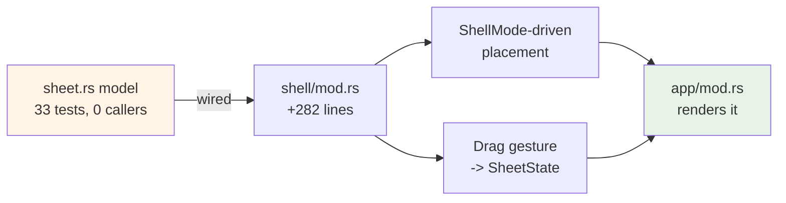

# ADR 0035 — The inspector bottom sheet is wired to `ShellMode`, following the finger during drag

- **Status:** Accepted — implemented and tested (no host verification of feel; see Consequences)
- **Date:** 2026-08-01
- **Milestone / issue:** M1.12 (#65)
- **Supersedes / superseded by:** Nothing superseded. Implements the layout half of #65's
  Goal that ADR-nothing had left as a built-but-uncalled model — see
  `design-docs/2026-08-01-issue-65-sheet-decision.md` for the three-option decision this
  resolves (Option A, wire it up, was chosen over B/descope and C/placement-only).

## Context

`crates/git-vista/src/features/shell/sheet.rs` was 916 lines and 33 host tests of
decision logic — `SheetState`, `SheetDetent`, `InspectorPlacement` — with zero callers.
Its own module doc said so explicitly: *"the model is settled and tested; the sheet does
not exist on screen."* `docs/IPAD_DESIGN.md:63` specifies the target in one sentence:
*"The bottom sheet has detents for summary, half-height, and full-height content."*

This ADR records the wiring work that closes that gap, done on a separate branch by a
second agent (Codex) after this session had already audited the situation and written
the decision document above. The audit's own caution applies directly here: `sheet.rs`
was built model-first specifically because this project cannot run browser tests, and
"decisions in a `web_sys` closure" is the exact failure mode that produced two defects
earlier the same night (#217's missing ARIA, #241's untested guard).

## Decision

The inspector's placement is now driven by `ShellMode` via `sheet.rs`'s existing
`default_placement_for(mode)`, rather than the fixed-position overlay every mode
previously shared. Where that resolves to a bottom sheet, the sheet renders and
consumes `SheetState` for its detent.

**The one interaction question this ADR settles explicitly, because #65's own audit left
it open:** the sheet **follows the finger during drag**, and resolves to a detent via
`SheetState` only on release — not "stay at the current detent until the gesture ends,
then jump." This matches the platform convention every iOS user already has muscle
memory for (Maps, Music, Files), and a sheet that didn't track the finger mid-drag would
read as broken on the one platform this feature is for.

This is implemented as a render-time transform only — the drag's live position is a
translation applied each frame, computed from `pointer_id`-tracked drag state in
`shell/mod.rs` (`take_matching`/`cancel_matching` on the active drag, keyed by pointer
id so a second, unrelated pointer can't hijack an in-progress gesture). `SheetState` is
consulted exactly once per gesture, on release, to resolve which detent the drag
actually lands on. **`sheet.rs` was not modified** to build this — the model's decision
surface was sufficient as designed.

## Alternatives considered, and why they lost

### Snap only at release, no visible tracking during drag
The behavior #65's original audit implicitly assumed by not raising the question — the
sheet stays at its current detent, then jumps to the resolved one when the finger lifts.
**Rejected.** It is cheaper (no per-frame transform) and would have avoided the
pointer-id bookkeeping above entirely, but it does not match how a bottom sheet behaves
anywhere else on iOS, and a sheet that visibly ignores the finger until release reads as
unresponsive rather than deliberate. The platform-convention cost of getting this wrong
is higher than the implementation cost of getting it right.

### Compute the resolved detent continuously during drag, not only on release
Would let the UI preview which detent a drag is heading toward mid-gesture (a common
iOS pattern — the sheet visibly "gives" toward the nearest stop). **Rejected for this
pass** as more interaction surface than #65 needs, and because it would mean
`SheetState` — the one part of this feature with real test coverage — gets consulted
continuously rather than at the one well-defined point (release) its 33 tests actually
exercise. The render-time-only tracking above stays entirely decoupled from the tested
model until the moment the model's own answer is needed.

## Consequences

- The compact-mode case — a `position: fixed` overlay on a phone-width viewport, the
  weakest part of the shell before this — now has a real bottom sheet.
- **Nothing about drag feel, gesture smoothness, or on-screen correctness is verified.**
  This was written and reviewed on a machine with no browser. 271 frontend tests pass and
  both clippy targets are clean, which proves the code is internally consistent — it does
  not prove the sheet is pleasant to use. A human iPad pass is required before #65 itself
  can close; merging this code is not that verification.
- `sheet.rs`'s 33 tests now have a real caller, closing the dead-code risk the original
  audit flagged — a future reader will not find 916 lines with nothing pointing at them
  and reasonably conclude they were abandoned.
