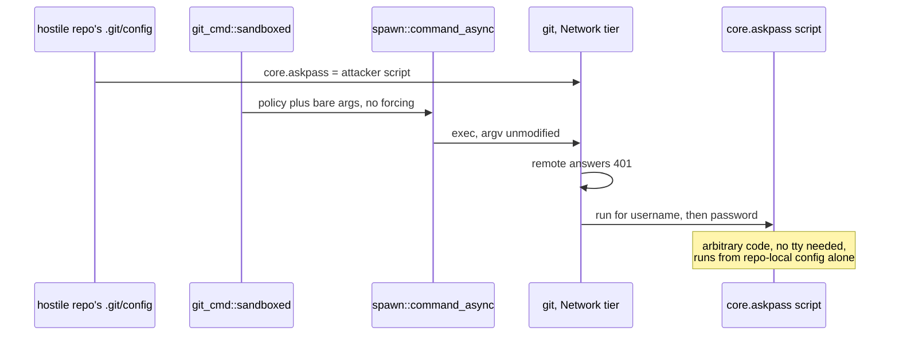
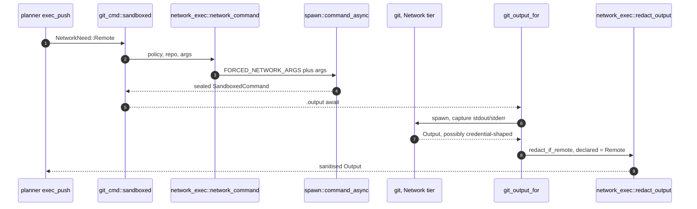
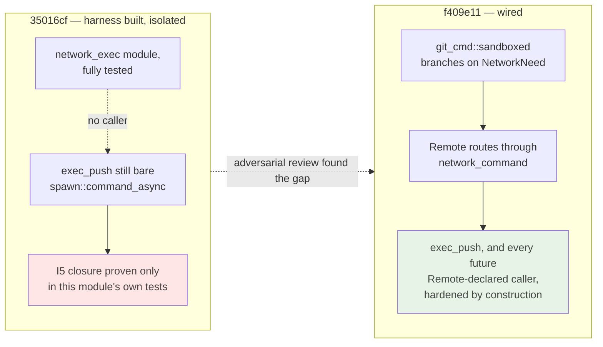
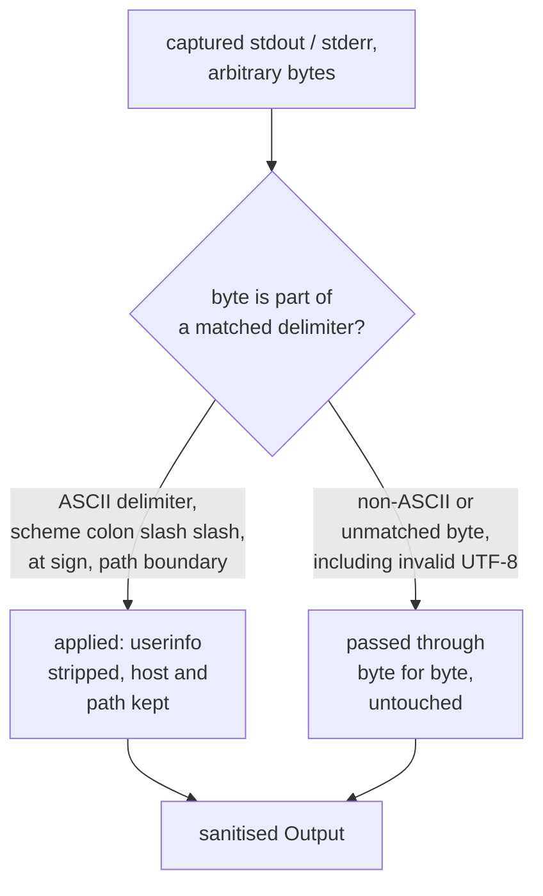

# ADR 0036 — The Network-tier exec harness: forced askpass hardening, byte-level redaction, and what stays open

- **Status:** Accepted — implemented and tested.
- **Date:** 2026-08-02.
- **Milestone / issue:** M2.20b, issue #228, "shared Network-tier exec harness — askpass
  hardening, redaction, real SSH e2e." Branch `feature/m2.20b-network-exec-harness`, two
  commits: `35016cf` (the harness) and `f409e11` (a same-branch fix after adversarial
  review found two redaction bypasses and a missing production wire — see Decision §3).
- **Supersedes:** nothing. **Narrows** [0030](0030-git-process-sandbox.md)'s single-spawn-chokepoint
  discipline by routing one more declared shape (`NetworkNeed::Remote`) through it rather
  than beside it, and reuses, without altering, the SSH grants [0033](0033-ssh-remote-carveout.md)
  added to the Network tier's `Policy`.
- **Related:** [0030](0030-git-process-sandbox.md) (`SandboxedCommand`'s sealed argv —
  this ADR explains why that seal was kept closed rather than widened),
  [0033](0033-ssh-remote-carveout.md) (the Network-tier `Policy` this harness's `network_command`
  wraps, unmodified), `docs/superpowers/evidence/m1.13-design-trail/m1.13-findings.md`
  finding I5 (the RCE this closes), `docs/SECURITY_MODEL.md`'s "Remote and Forge
  Credentials" section (annotated by this branch with an implemented-vs-aspirational table
  this ADR keeps in sync with).

## Context

M1.13's design-trail review (finding I5) named a live arbitrary-code-execution class:
`core.askpass` is a repo-local-settable git config key naming a program git executes to
obtain credentials, consulted **before** any terminal-prompt fallback. Reproduced directly
against this build (git 2.43.0, 2026-08-01): a repo-local `core.askpass` pointing at a
marker script ran — twice, once for username and once for password — against a remote that
merely answered `401 Unauthorized`, with no controlling terminal anywhere in the process
tree. Any hostile or compromised repository's own `.git/config` can plant that key. Nothing
in this crate's env-inheriting spawn model closed it: `spawn.rs`'s `command_async`
deliberately leaves the environment untouched (its own module doc says so), and before this
branch every Network-tier spawn — `git fetch`/`pull`/`push`/`ls-remote` — went through that
same bare launcher, unmodified, on every tier.



`docs/SECURITY_MODEL.md`'s "Remote and Forge Credentials" section had described the target
shape since it was written — reuse credential helpers, redact URL userinfo, redact
credential-helper output — but named no implementation, and #228's own scope was narrower
than the full bullet list: close I5, and "strip userinfo from URLs at minimum." The
implemented-vs-aspirational table this branch adds to that section exists so a reader does
not have to infer "shipped" from "described" — this ADR and that table are kept
consistent with each other on purpose.

## Decision

### 1. `network_command` — one forcing, delegated to the existing chokepoint

`sandbox::network_exec::network_command` (`network_exec.rs`) prepends
`FORCED_NETWORK_ARGS = ["-c", "core.askpass="]` ahead of the caller's own args and then
calls `spawn::command_async` — the same function every other tier's spawn already goes
through. It builds no parallel `Command`, opens no second path to argv or environment: the
returned value is the same sealed `SandboxedCommand` [0030](0030-git-process-sandbox.md)
established, with stdio-only configuration and no `arg`/`args`/`env`. `-c core.askpass=`
sits on the command line, which git's own precedence ranks above repo-local `.git/config`
regardless of read order — a hostile repository cannot re-open what an earlier command-line
flag already closed.

`-c` flags must precede the subcommand, and every caller in this crate already passes
`args` as `[subcommand, ...]`, so `FORCED_NETWORK_ARGS` is spliced in first with nothing to
lose a last-one-wins race against.

### 2. Wired at the one production chokepoint, not left beside it

`git_cmd.rs`'s `sandboxed()` — the crate's sole production spawn seam — now branches on the
declared need:

```rust
Ok(if need == crate::sandbox::NetworkNeed::Remote {
    crate::sandbox::network_exec::network_command(&policy, repo, args)
} else {
    crate::sandbox::spawn::command_async(&policy, repo, args)
})
```

That one branch is what makes `exec_push` (`planner.rs`'s one production caller today) get
the hardening by construction, and makes wiring `exec_fetch`/`exec_pull` on, once #227 adds
them, "declare `NetworkNeed::Remote`" rather than "remember to call this module." Section 3
below is the record of why that sentence needed to become literally true rather than stay a
design intention.



### 3. Found by review, fixed on the same branch: the harness had no production caller at all

The first commit (`35016cf`) built `network_exec` complete with its own `run_network_git`
production-entry candidate, proven exhaustively by that module's own tests — a real hostile
`core.askpass` marker script that provably runs without the forcing and provably does not
run with it; a real credential-helper leak, captured and redacted. Every one of those tests
was green. None of them proved the fix reached a real request: `exec_push` still spawned
through the old `git_cmd::sandboxed → spawn::command_async` path, unmodified, with no
forcing and no redaction. This is [0030](0030-git-process-sandbox.md) §8's own named failure
shape — "a case is written to test a specific mechanism, `cargo test` passes, a reviewer
reads `ok` as `contained`" — recurring in the very branch meant to close a different
instance of the same class.



Adversarial review of the same branch, before merge, found this gap plus two independent
redaction bypasses in the same pass — recorded honestly here rather than folded quietly into
"the harness," because the pattern (fully tested, unreached) is exactly the one this
project's own house standard exists to catch:

- **A password containing the literal text `://` defeated the authority scan.**
  `redact_url_userinfo`'s first version took the *first* `://` as the scheme boundary and
  stopped scanning the authority at the first `/` — so a crafted or reused credential value
  containing `://` truncated the scan before the real userinfo `@`, and the whole URL,
  secret included, passed through unredacted. Fixed by treating an embedded `://` found
  mid-scan as still-inside-the-authority rather than a second delimiter (see
  `redact_url_userinfo_strips_a_password_containing_a_scheme_separator`, paired with
  `unredacted_password_containing_a_scheme_separator_still_leaks` proving the old behavior
  on the same input).
- **One invalid UTF-8 byte anywhere in the buffer suppressed redaction of everything in it.**
  The first version validated the whole `stdout`/`stderr` buffer as UTF-8 before redacting
  anything and skipped redaction entirely on decode failure — so a single stray non-UTF-8
  byte, trivially producible by a hostile credential helper, hid an otherwise-plain-ASCII
  secret elsewhere in the same buffer. Fixed by operating on raw bytes directly (Decision
  §4 below).

### 4. Byte-level redaction, not string-level

`redact_url_userinfo_bytes` (`network_exec.rs`) scans `&[u8]`, not `&str` or `char`s. Every
delimiter it looks for — `:`, `/`, `?`, `#`, ASCII whitespace, the scheme-character class,
`@` — is a single ASCII byte, and a UTF-8 continuation or lead byte for any multi-byte code
point is always `>= 0x80`, so it can never be misread as one of these delimiters. The
function therefore never needs to know whether the buffer is valid UTF-8 at all: an invalid
byte simply matches nothing and passes through unchanged, while every legitimate delimiter
elsewhere in the same buffer is still found. `redact_output` applies this to both halves of
a spawn's captured `Output` unconditionally — no decode, no fallback, no whole-buffer gate.



## Alternatives considered, and why they lost

### Widen `SandboxedCommand`'s production surface with an `env()` method
The M1.13 finding's own acceptance box pins the exact string
`could not read Username for '<url>': terminal prompts disabled`, which requires
`GIT_TERMINAL_PROMPT=0` in the child's environment. `spawn::SandboxedCommand` deliberately
exposes no `env` method in production — [0030](0030-git-process-sandbox.md) §2 states this is
a compile-time guarantee, not a convention: argv and environment must not be settable after
`sandbox_argv` has classified the spawn, closing the exact hazard (`GIT_DIR`,
`GIT_SSH_COMMAND`, `GIT_EXTERNAL_DIFF` all redirect or execute) that motivated sealing it in
the first place. **Rejected** because adding one method to match a message string is not the
same trade as adding one to close a containment gap this crate's tests cannot reach another
way — the byte-exact pin is a nice-to-have for the acceptance criterion, not a security
property. What was proven instead: with no `core.askpass`, no succeeding credential helper,
and no controlling terminal — every real deployment of this server, since it is a headless
daemon — git tries `/dev/tty` directly regardless of `GIT_TERMINAL_PROMPT` and fails
immediately with `could not read Username for '<url>': No such device or address`. Same
behavior (fast, clean, no hang, no interactive fallback), different bytes. This is reported
as an explicit gap needing its own ADR if the byte-exact string is ever required by a
client-side match, not built unilaterally here.

### Force `credential.helper=` off the same way `core.askpass=` is forced
`credential.helper` is exactly as executable as `core.askpass` — a repo-local key naming an
arbitrary program git runs — and is a live leak surface today: a helper that writes a
secret-bearing URL to its own stderr has that text forwarded by git verbatim, unfiltered
(measured directly, `network_exec_redacts_a_real_credential_helpers_leaked_url`). **Rejected**
forcing it off, for two reasons stated in the module doc rather than left implicit:
`credential.helper` is this server's *sanctioned* HTTPS-auth mechanism
(`docs/SECURITY_MODEL.md`: "Prefer existing Git credential helpers and SSH agents"), so
disabling it would not harden anything — there is no attacker path through the operator's
own configured helper that `core.askpass` doesn't already cover — while breaking the one
HTTPS-push path meant to work at all; and `core.askpass` exists solely to drive an
*interactive* prompt this headless server never has a terminal for, which is not true of a
credential helper's legitimate job. **The residual risk is real and left open, not
papered over:** `credential.helper` remains an unmitigated arbitrary-code-execution surface
of the same class as `core.askpass`, closed at the source not at all — only its stderr leak
is closed, and only by downstream redaction.

### Validate the whole buffer as UTF-8 first, redact only if it decodes
The simpler implementation, and the one the branch shipped first. **Rejected** after review
found it was a bypass, not a simplification: a single invalid UTF-8 byte anywhere in
`stdout`/`stderr` — trivially producible by a hostile credential helper's own diagnostic
output — suppressed redaction of an otherwise-plain-ASCII secret located anywhere else in
the same buffer, including before the bad byte. Byte-level scanning (Decision §4) removes
the whole-buffer-or-nothing failure mode entirely, at the cost of leaving genuinely
non-UTF-8 stretches of output un-redacted rather than attempting to sanitise bytes the
scanner cannot interpret as URL structure — recorded honestly in Consequences rather than
implied to be a stronger guarantee than it is.

### A `network_exec`-owned production entry point, building its own `Policy`
The first commit's `run_network_git` took this shape: a second, `network_exec`-local
function that called `sandbox::policy_for` itself and was meant to become the thing
`planner.rs`'s `exec_push`/`exec_fetch`/`exec_pull` called directly, alongside the existing
`git_cmd::sandboxed`. **Rejected**, in the same review pass that found the redaction
bypasses, precisely because it would have created a second production spawn path — the exact
shape [0030](0030-git-process-sandbox.md) exists to prevent, and the reason the harness
shipped fully tested but unreachable from a real request (Decision §3). Removed
(`run_network_git`/`NetworkExecError` deleted) in favor of `network_command` staying a pure
delegation `git_cmd::sandboxed` calls conditionally — one chokepoint, one place a future
caller's declared need is enough to get the hardening, not two paths a reviewer must keep in
sync by hand.

## Consequences

- **I5 is closed on the one production path that matters.** `exec_push` today, and any
  future `NetworkNeed::Remote`-declared caller by construction, gets `-c core.askpass=`
  ahead of its subcommand — proven by `sandboxed_forces_askpass_hardening_for_remote_network_need`
  reading the real argv a fake `git` on `PATH` receives, paired against
  `sandboxed_does_not_force_askpass_hardening_for_local_network_need` proving the assertion
  discriminates on `need` rather than being vacuously true of every spawn the fixture
  produces.
- **`credential.helper` remains an unmitigated RCE surface of the same class as the one this
  ADR closes.** Its stderr leak is redacted; its own execution is not prevented, forced off,
  or sandboxed any differently than before this branch. A future slice that wants to close
  that surface needs its own decision — the module doc calls out specifically that this is a
  bigger, separate productization question (fixed helper vs. injectable, per the M1.13
  design-trail's own operator-lens finding), not a follow-up to bolt on here.
- **Query-string-token and HTTP `Authorization`-header redaction are not implemented.**
  `docs/SECURITY_MODEL.md`'s own implemented-vs-aspirational table says so in the same words:
  a credential surfaced as `?access_token=…` or an `Authorization: Bearer …`-shaped string
  would appear verbatim in a "redacted" `Output` today. No test in this area exercises that
  shape, because none of the mechanisms this slice built produce it yet — recorded as open
  scope, not a silent gap discovered later.
- **The credential-leak proof is against the harness's own captured `Output`, not against a
  real HTTP response body, a server log file, or an activity-journal record.** Those sinks
  are not wired to this harness — `redact_args` exists as a primitive for a future
  argv-logging call site and has no caller yet (`#[allow(dead_code)]`, named in its own doc).
  What is proven is that a leak present in a spawn's `stdout`/`stderr` at the moment
  `git_output_for`/`git_output_with_stdin` capture it is gone by the time this function's
  caller receives it — not that every eventual destination for that data redacts correctly,
  because most of those destinations do not exist yet in this crate.
- **Non-UTF-8 output is not redacted, by design, not by oversight.** Decision §4's
  byte-level scan passes any byte it cannot interpret as ASCII URL structure straight
  through. A secret that happened to be embedded inside a genuinely non-UTF-8 byte
  sequence — as opposed to plain ASCII with a stray invalid byte elsewhere, the case §3's
  second bypass was about — would not be found by this scanner. This is the accepted
  trade for removing the whole-buffer-or-nothing failure mode entirely; it is not claimed to
  be a stronger guarantee than that.
- **The byte-exact `terminal prompts disabled` string from the M1.13 finding's acceptance box
  is not reachable from production**, and is not pinned by any test in this branch. What is
  pinned instead is the actual message this build produces without `GIT_TERMINAL_PROMPT=0`
  (`could not read Username for '<url>': No such device or address`), plus the same
  fail-fast, no-prompt, no-hang behavior the acceptance box cared about. Closing that last
  gap needs an `env()` capability on `SandboxedCommand`'s production surface, which is an
  architectural decision this ADR deliberately declines to make unilaterally — see
  Alternatives, first entry.
- **A green test suite proved nothing about production reachability for one full commit.**
  Recorded here as a repeat instance of [0030](0030-git-process-sandbox.md) §8's named
  failure pattern, not a one-off: a fully tested module with zero production callers reads
  identically to a shipped fix in `cargo test` output. The fix this time was a same-branch
  adversarial review before merge, not a later audit — the faster of the two recoveries this
  project has now recorded for the same disease.
- **SSH transport is proven end-to-end through the harness, with real effects checked.**
  `sandbox::ssh_remote`'s new tests drive a real `git fetch` and a real `git push` through
  `network_command` over a throwaway loopback `sshd` and `ssh-agent`, each verified by
  reading the resulting ref directly (`git rev-parse` against the fetch destination and the
  bare remote respectively) rather than trusting the process exit code — the same
  non-vacuity posture [0033](0033-ssh-remote-carveout.md) established for `ls-remote`, now
  extended to the two operations that actually mutate a ref. The fixture's SSH dispatcher
  was widened to allow `git-receive-pack` as well as `git-upload-pack` for exactly this
  reason.

## Where this is implemented

- `crates/git-vista-server/src/sandbox/network_exec.rs` — new module: `network_command`,
  `FORCED_NETWORK_ARGS`, `redact_url_userinfo_bytes`, `redact_url_userinfo`, `redact_bytes`,
  `redact_output`, `redact_args` (primitive, no caller yet). Its own `tests` module (pure,
  no process spawn) and `https_suite` (real git, a real loopback HTTP/401 server, a real
  hostile `core.askpass` and a real credential helper).
- `crates/git-vista-server/src/sandbox/mod.rs` — `network_exec` module declaration and its
  doc comment.
- `crates/git-vista-server/src/git_cmd.rs` — `sandboxed()`'s `NetworkNeed::Remote` branch;
  `redact_if_remote`, called from both `git_output_for` and `git_output_with_stdin`; three
  new tests (`sandboxed_forces_askpass_hardening_for_remote_network_need`,
  `sandboxed_does_not_force_askpass_hardening_for_local_network_need`,
  `redact_if_remote_redacts_only_when_declared_remote`).
- `crates/git-vista-server/src/sandbox/ssh_remote.rs` — the widened `authorized_keys`
  dispatcher (upload-pack and receive-pack), `a_real_fetch_succeeds_through_the_network_exec_harness_over_ssh`,
  `a_real_push_succeeds_through_the_network_exec_harness_over_ssh`.
- `crates/git-vista-server/src/argv_boundary.rs` — the census entry for
  `src/sandbox/network_exec.rs` (test-only `Command::new` fixtures; the one production
  function in this file builds no `Command` of its own).
- `docs/SECURITY_MODEL.md` — the "Implemented vs. aspirational (as of #228, M2.20b)" table
  under "Remote and Forge Credentials," kept consistent with this ADR's Consequences.

---

**Signed:** thomas2025 · 2026-08-02T00:42:12-04:00
