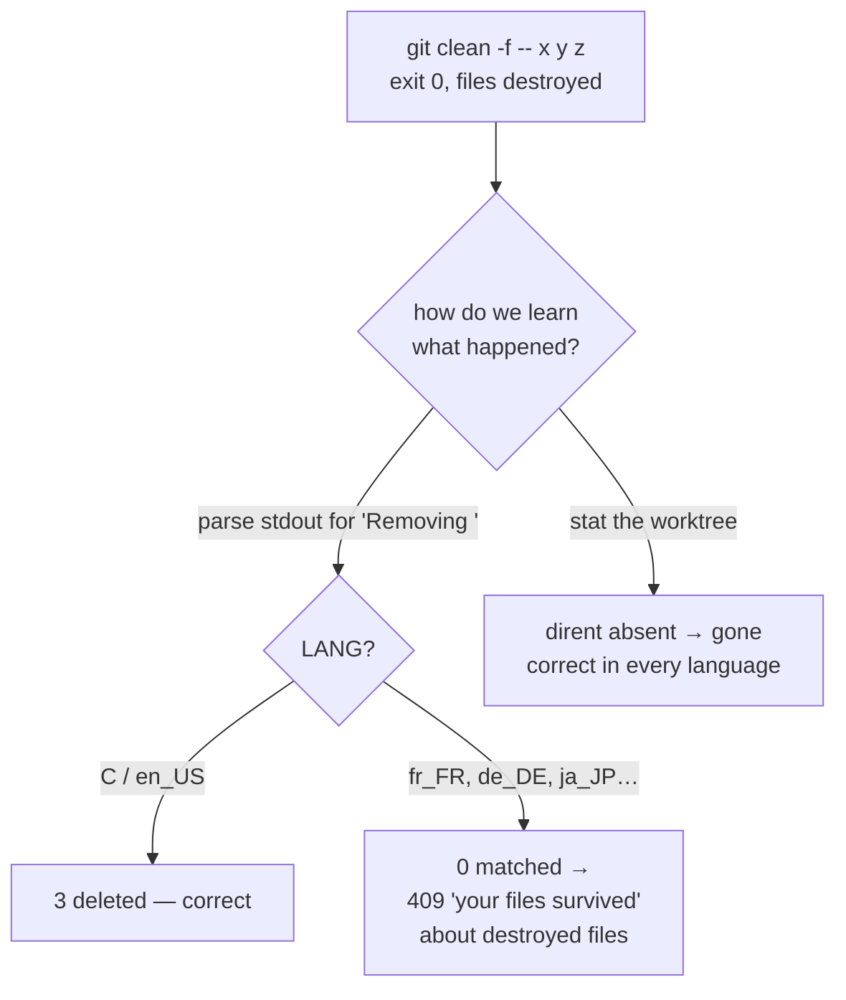
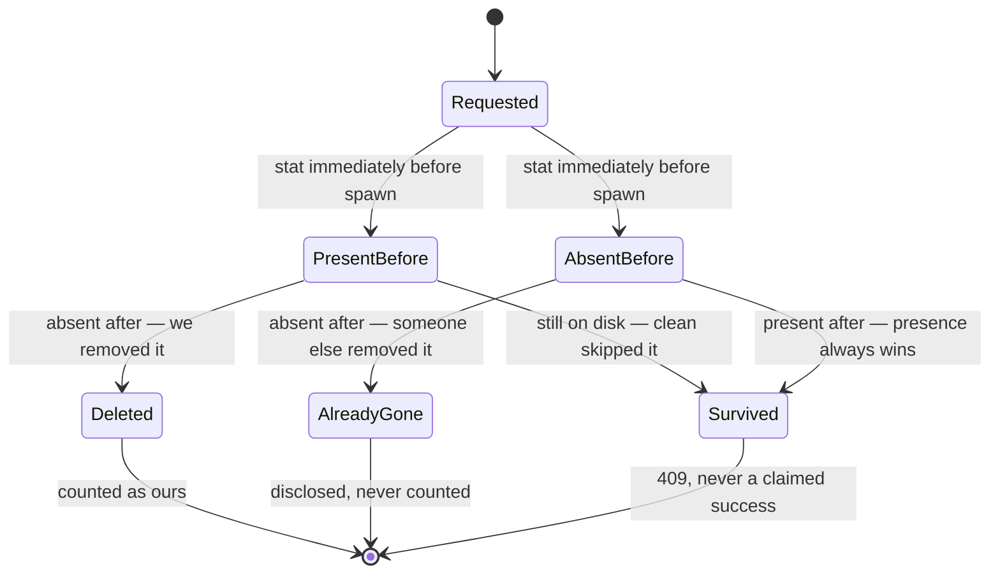

# ADR 0037 — Observe state, never parse git's prose: destructive operations report what the worktree proves

- **Status:** Accepted — implemented and tested
- **Date:** 2026-08-02
- **Milestone / issue:** M2 (#284); hardens the `#219` discard/delete operations
- **Supersedes / superseded by:** Nothing superseded. Constrains the argv boundary ADR 0030
  established, by ruling out the one escape hatch a caller would otherwise reach for.

## Context

`/api/delete-untracked-paths` runs `git clean -f -- <paths>`. It is the only operation in
Git-Vista's vocabulary with **no undo of any kind** — an untracked path was never written to
git's object database, so there is nothing anywhere in the repository to reset back to. For
this one endpoint the *report* is the product: the count in the response and the line in the
durable journal are the user's only record of what is gone for good.

Until #284, that report was built by parsing `git clean`'s stdout for the prefix `Removing `.

That string is passed through gettext in git's own source. It is translated whenever a `git.mo`
catalog is installed and `LANG`/`LC_MESSAGES` names a non-English locale. Under
`LANG=fr_FR.UTF-8`, git prints `Suppression de x.txt`. Three successfully deleted files matched
no prefix, all three were classified as survivors, and the endpoint answered **409 — "your files
were NOT deleted"** about files that were already irreversibly gone.

That is the exact inversion of the property the check exists to provide, and it is the failure
direction that actually harms: it makes a user stop looking for data that is gone forever.

### Why the obvious fix is not available here

The reflex fix is to force the child's locale: `LC_ALL=C`, or `env_clear` plus a curated
environment. **That door is closed by design**, and it is closed by a decision this project
already made deliberately.

Per ADR 0030, every git spawn goes through `SandboxedCommand`, a builder with no `arg`, `args`
or `env` methods. A command is buildable only through one classify-then-spawn path, so argv and
environment cannot change *after* policy classification — that is a compile-time fact, and it is
the entire value of the type. `sandbox::spawn`'s `env_clear`/`env` calls are `#[cfg(test)]`-only
for exactly this reason. Production spawns therefore inherit the server's environment in full,
including its locale.

So a later session hitting a similar "git's message is in the wrong language" problem will reach
for `LC_ALL=C`, find the chokepoint refuses it, and face a choice between widening a security
boundary and re-deriving the alternative. This ADR exists so that choice is already made and its
reasoning is on the record — the doc comments alone cannot carry it, because the constraint lives
in `sandbox/spawn.rs` while the temptation appears in `planner.rs`.

## Decision

### 1. Git's human-readable output is not a data source

No control-flow decision in this codebase may depend on parsing prose that git emits for humans.
Where a decision needs to know what happened, it observes the resulting **state** instead — the
filesystem, `--porcelain` output, or an exit status. Prose may be logged and surfaced to a user;
it may not be branched on.

`git clean`'s stdout has no `--porcelain` mode, so here the observation is a filesystem `stat` of
each requested path: a dirent that is still there was not deleted, in every language.

### 2. `symlink_metadata`, never `Path::exists`

`exists()` follows the link, so a **dangling** symlink — dirent present, target already gone —
reports as absent while it is still sitting in the worktree. `git clean` does delete dangling
symlinks, so an `exists()`-based check cannot distinguish "clean removed the link" from "clean
skipped the link, whose target happened to be missing already". Both read as deleted, and the
second is a false success. `symlink_metadata` stats the entry itself.

This is the same reason `symlink_containment_guard` uses it, and it is pinned by a regression
test that fails if the substitution is ever made.

### 3. Report what *this operation* destroyed, not what is merely absent

Observing only the post-spawn state introduces the mirror-image dishonesty: "absent now" read as
"we deleted it". `git clean -f -- a.txt b.txt` exits 0 and says nothing when `b.txt` is already
gone, so a second Git-Vista tab, a shell `rm`, or an editor auto-clean removing `b.txt` first
produced a response *and a journal entry* claiming two destructions when this operation performed
one. A journal that credits us with a destruction we did not cause is a corrupt audit trail.

The fix is a presence snapshot taken as the very last thing before the spawn, split three ways:

**Presence always outranks the snapshot.** A path still on disk is a survivor whoever put it
there. The bias is deliberate and must never invert: this can over-report a survivor, and can
never claim a destroyed file survived.

### 4. The count is computed where the divergence is constructible

`DeleteOutcome::report` owns the status, response body and journal line together; the executor
keeps no count of its own. This is a testability decision, not a tidiness one — see Consequences.

## Alternatives considered, and why they lost

### Force `LC_ALL=C` on the spawn and keep parsing

Rejected on the boundary. It requires an `env()` method on `SandboxedCommand` reachable from
production, which deletes the compile-time guarantee ADR 0030 exists to provide — a general
widening of a security boundary bought for one operation's convenience. It is also still a parse
of prose that git does not contract to keep stable, so it trades a guarantee for a promise.

### Parse `git clean --dry-run` first, then clean

Doubles the spawn count, still parses translated prose, and the dry-run's answer is stale by the
time the real clean runs — the TOCTOU window this endpoint already fights. Strictly worse on
every axis.

### Delete paths one at a time, one spawn each, and trust each exit code

Attractive because per-path attribution becomes exact. Rejected: `git clean` exits 0 whether it
removed a path or silently skipped it, so the exit code does not carry the information — the
premise is false. It also multiplies the sandbox launcher's fixed per-spawn cost (17–24 ms,
measured in M1.13b) by the batch size, and turns one partially-applied operation into N.

### Take a repo-wide exclusive lock for the whole operation

This is the only thing that would close the race completely rather than narrow it. Rejected as
out of scope, not as wrong: this endpoint holds no such lock today, ADR 0019 serializes mutations
per repository but not against processes outside Git-Vista, and locking out concurrent *external*
writers is a much larger decision than #284. Recorded here so a future session knows the residual
is bounded and understood rather than missed.

### Leave the misattribution alone as an accepted residual

The position the first cut of #284 took, and defensible: it errs in the safe direction, and the
count is wrong only when an external process races us. Rejected because the journal is durable
and this operation has no undo — the audit record is the one artifact that must not claim
something false, and the correction costs one `stat` per path on entries already stat'd twice.

## Consequences

**The report is locale-independent.** The property is now structural: it depends on the
filesystem, not on which `git.mo` catalogs happen to be installed on the host.

**The race is narrowed, not closed, and the residual is on the record.** `verify_path_states`
already refuses a path that vanished before its `git status` runs, so the exposure was always the
gap between that read and `git clean`'s `unlink`. The before-snapshot moves the near edge of that
gap from "before a `git status` spawn, a porcelain parse, and a `git clean` spawn" to "one `stat`
before the spawn" — milliseconds to microseconds. What remains is an external deleter landing
inside the child process's own run, which needs the repo-wide lock rejected above.

**A green test that proved nothing was found and fixed by this ADR's own reasoning.** While
`let count = paths.len()` lived inline in the executor, no test could construct a state where the
requested count and the destroyed count differ — reverting the count to `paths.len()` passed all
558 tests. Moving the composition into `DeleteOutcome::report` makes the divergent case
expressible, and `a_report_counts_only_what_this_operation_destroyed` now fails against it.

**The `already_gone` bucket is not reachable end-to-end from a test.** It requires an external
process to delete a path inside a microsecond window. It is exercised at the decision function,
which is where the decision lives; the executor is a thin caller with no branch of its own. This
is stated plainly rather than papered over — the honesty property does not depend on how a
mismatch arose, only on whether it is reported truthfully.

**Cost.** One `stat` per requested path per operation, bounded by the request, on entries
`symlink_containment_guard` and `verify_path_states` stat'd microseconds earlier.

## Where this is implemented

- `crates/git-vista-server/src/planner.rs` — `present_paths`, `DeleteOutcome`,
  `observe_deletion`, `DeleteOutcome::{report, partial_refusal, already_gone_note}`, and
  `exec_delete_untracked_paths` as their only production caller.
- `crates/git-vista-server/src/handlers/discard.rs` — `validate_paths` deduplicates, so the
  count cannot be inflated by a repeated path either (#284 defect 2).
- `crates/git-vista-server/src/planner/contract_suite.rs` — the regression suite, including the
  paired negatives that re-implement each rejected shape and pin that it got the same end state
  wrong.
- `docs/SECURITY_MODEL.md` — "Worktree destructive" operation risk class.

**Signed:** thomas2025 · 2026-08-02
