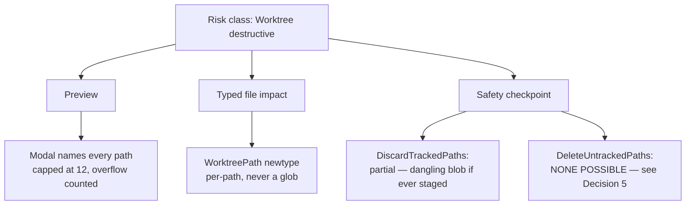
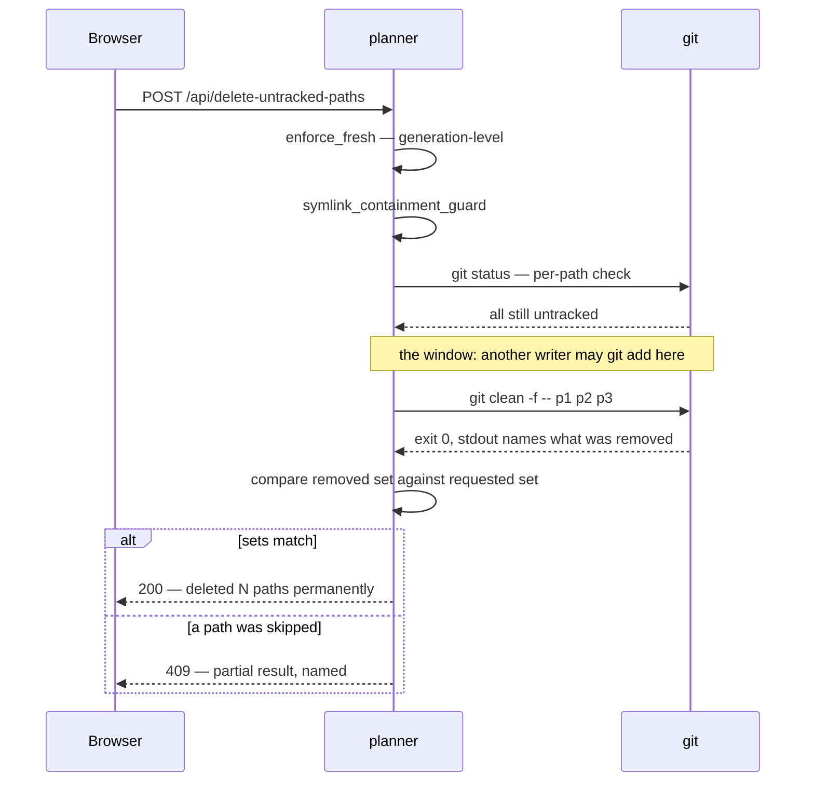
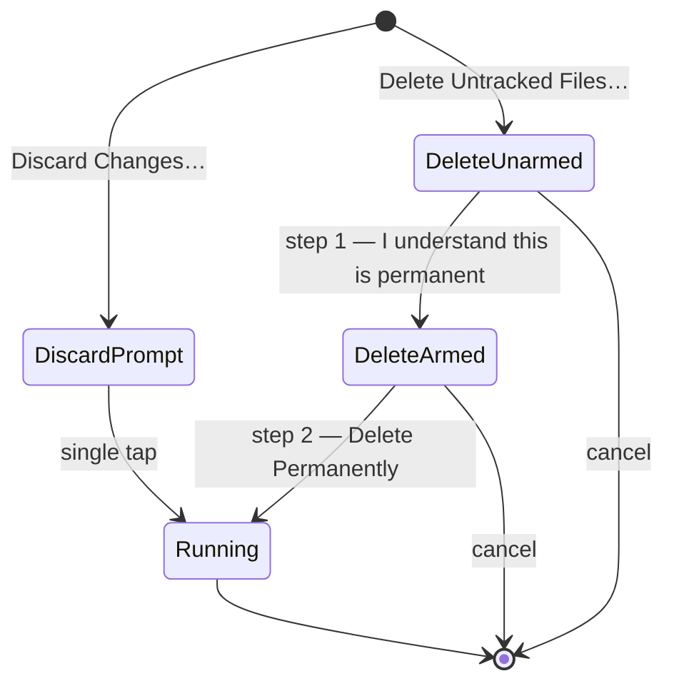

# ADR 0037 — Worktree-destructive operations: a typed per-path impact, a preview that names every file, and one control the risk class asks for that cannot exist

- **Status:** Accepted — implemented and tested.
- **Date:** 2026-08-02.
- **Milestone / issue:** M2.18a/M2.18b, issues [#219](https://github.com/tom2025b/Git-Vista/issues/219)
  (typed operations, server) and [#220](https://github.com/tom2025b/Git-Vista/issues/220)
  (confirmation UI, client). Commits `5793def` (#219) and `c6d9bde` (#220).
- **Implements:** the **Worktree destructive** row of `docs/SECURITY_MODEL.md`'s
  "Operation Risk Classes" table — the last risk class in that table with no
  implemented-annotation. This ADR is what the annotation now points at.
- **Related:** [0015](0015-typed-operation-vocabulary-and-plan-schema.md) (the typed
  operation vocabulary these two variants join), [0016](0016-shared-write-planner.md)
  (the one planner they execute through), [0017](0017-no-arbitrary-argv-from-the-browser.md)
  (why a path arrives as a validated newtype and not as a string),
  [0018](0018-plan-staleness-enforcement.md) (`enforce_fresh`, which these operations
  deliberately re-check *on top of*), [0021](0021-durable-operation-journal-and-recovery-refs.md)
  (`RecoveryStrategy`, which this ADR splits one more way).

## Context

The security model has always classified operations by risk, and named the controls each
class must carry:

| Class | Examples | Required control |
|---|---|---|
| Worktree destructive | Clean, discard, checkout overwrite | **Preview, typed file impact, safety checkpoint** |

Until #219/#220 nothing in the product was in that class. Every write that existed moved a
ref, and a ref that moved can be moved back — that is what
[0021](0021-durable-operation-journal-and-recovery-refs.md)'s recovery refs are for. The
worktree itself was only ever read.

Discarding tracked changes and deleting untracked files break that. They destroy bytes that
may exist nowhere else on the machine, and the second one destroys bytes that have provably
*never* been anywhere else: content that was never `git add`ed was never in the object
database, so there is no dangling blob to fish out and no ref to reset. This is the first
operation in the vocabulary whose effect git cannot help undo.

That makes three questions load-bearing rather than academic, and this ADR records the
answer to each:

1. What does "typed file impact" mean concretely, when the browser is the thing asking?
2. What does "preview" have to show, given a preview the user does not read is not a control?
3. What happens to "safety checkpoint" for the one operation where no checkpoint is possible?

## Decision

### 1. Two operations, not one — and never a glob

`GitOperation` gains `DiscardTrackedPaths { paths }` and `DeleteUntrackedPaths { paths }`.
They are separate variants carrying an explicit list, never a single "clean the worktree"
verb and never a pattern. A pattern is the opposite of a typed file impact: it is a promise
whose expansion is computed somewhere the user cannot see, at a moment that is not the
moment they agreed to it.

`paths` is `Vec<WorktreePath>`, a validated newtype in `git-vista-protocol`. It refuses, at
the wire boundary, anything that is not a worktree-relative path: absolute paths, any `..`
component, an embedded NUL, and option-shaped values starting with `-`. The refusal is
`serde`-level, so a malformed element fails the request rather than reaching a handler that
might be trusted to check. This is [0017](0017-no-arbitrary-argv-from-the-browser.md)'s rule
applied to a new field: the browser names *what*, never *how*.

### 2. `git checkout HEAD --`, not `git checkout --`

The bare form resets the worktree to the **index**, not to HEAD. A path whose only
difference is staged — index ≠ HEAD, worktree = index — is therefore a silent no-op: git
exits 0, the handler returns 200, the journal records "discarded", and the file is left
exactly as it was. This was reproduced against real git before the fix landed; it is not a
theoretical read of the man page.

`git checkout HEAD -- <paths>` resets index and worktree together, which is what "discard
uncommitted changes" means to someone looking at a file, regardless of what they happened
to have staged. The staged blob, if there was one, survives as a dangling object until the
next `git gc` — confirmed with `git fsck --unreachable` — which is what keeps §5's recovery
text honest.

### 3. Per-path re-verification inside the executor, deliberately redundant with `enforce_fresh`

Both executors call `verify_path_states` immediately before running git: every path in a
discard must still be tracked-and-dirty, every path in a delete must still be untracked. A
mismatch is a 409 with the offending path named, and nothing runs.

This is redundant with [0018](0018-plan-staleness-enforcement.md)'s `enforce_fresh`, which
already recomputes the repository generation. The redundancy is the point, and it follows
`exec_stage_selection`'s own precedent: `enforce_fresh` answers "has the repository changed
since this plan was built", which is a *generation*-level question. "Is this specific path
still untracked" is a per-path question, and the whole risk of this class is per-path.

There is a residual window that no amount of re-checking closes, and it is recorded rather
than papered over. `git clean -f -- p1 p2 p3` is **not atomic across a multi-path pathspec**:
if a path becomes tracked between the verification read and the `clean` call — a concurrent
`git add`, an IDE auto-stage, a second git-vista tab — git silently *skips* that path, exits
0, and deletes the rest of the batch. Verified directly against real git.

Closing the window needs a repo-wide exclusive lock this endpoint does not hold. What is
tractable without one is refusing to *report* success that is not true: `git clean` names on
stdout exactly what it removed, and that set is compared against the full requested set
before a 200 is returned. A mismatch is a 409 naming the discrepancy, plus a journal entry.

### 4. Symlink containment, and a refusal of directory targets

Before either operation runs, every path is canonicalized and required to resolve inside the
canonicalized worktree root. A path that escapes through a symlink is a 409. This reuses
`gv-sandbox`'s `resolve_excludes` pattern rather than inventing a second containment idea.

A path that resolves to a real, in-worktree **directory** is also refused. Git's own status
output collapses an untracked directory to a single `dir/` entry, so honouring one would
mean deleting an unknown number of files behind a single line in the preview — which is
precisely the blind "discard all" this class exists to prevent. The client's own path
selectors (`features::status::core`) mirror that refusal, so a directory entry never becomes
a confirmation the user completes and the server then 409s.

### 5. `RecoveryStrategy` splits: "gone forever" is not the same claim as "no undo offered"

`RecoveryStrategy` previously had one tag for both ideas. The two operations here need
different ones, because the difference is a fact about the repository, not a product choice:

- `DiscardTrackedPaths` → **`RecoverableIfStaged`**. git-vista offers no undo, but the
  content may still be a dangling blob until the next `git gc` — true exactly when it was
  `git add`ed at some point.
- `DeleteUntrackedPaths` → **`Irrecoverable`**. The content was never in the object database.
  Nothing in this repository, and nothing in git-vista, holds a copy.

Sharing one tag would have defeated the reason the field is typed at all: a future reader is
meant to switch on it, not re-derive the answer by also matching on `GitOperation`.

**This is the honest answer to "safety checkpoint" for the delete.** The control the risk
class asks for cannot be built. There is no checkpoint to take, because there is nothing to
take it from. What replaces it is not a weaker checkpoint but a different kind of control —
a second deliberate step and copy that refuses to imply a checkpoint exists (§6).

### 6. Two ceremonies, not one modal with two labels

The confirmation is `features::dialogs::core::worktree_confirm` — a pure function, host-tested,
with `dialogs/confirm.rs` as a thin renderer (this crate has no wasm test harness, so decision
logic in a `#[cfg(target_arch = "wasm32")]` file has zero executed coverage).

Three decisions inside that:

- **The body names the files.** Every path, capped at twelve so the confirm button cannot be
  pushed off an iPad screen, with the overflow *counted* — the leading sentence always states
  the full number, so a truncated list can never understate what is about to happen.
- **The delete's confirm button is inert until a separate arm control is pressed.** Two
  deliberate taps, no typed confirmation string: a void `<input>` panics Leptos' CSR node-walk
  on iOS WebKit, and this app is used from an iPad.
- **Both prompts are `danger: true`,** which deviates from #220's written bullets. `danger:
  false` paints the confirm button green, and discarding a worktree-only edit destroys its
  only copy just as permanently as the delete does. Saying "safe" in colour while saying
  "gone" in words is the overclaim the whole slice exists to avoid. A test pins the deviation
  so it reads as a decision rather than a drift.

The copy holds the same line the server's own regression test greps for: nothing in the
delete path says "undo", "restore" or "recover". A host test enforces that with a paired
positive over the *discard* copy — which is allowed the qualified claim and states both its
qualifiers (only if staged, and only until `git gc`) — so the grep is proven capable of firing.

### 7. Disabled-with-reason is a `<button>`, never a ``

Both menu entries are HEAD-gated and appear disabled-with-reason when there is nothing to act
on. That reason exists for the keyboard and screen-reader user #65 was about, and reaching
them requires an element that is focusable *and* whose role honours `aria-label` /
`aria-disabled` — a bare `` is neither. These render as `<button aria-disabled="true">`
with no `prop:disabled` (a natively-disabled button leaves the tab order and takes its own
explanation with it) and no `on:click`, so they are inert by construction. A tripwire over
`menu.rs`'s bytes holds the line.

## Alternatives considered, and why they lost

### A single `CleanWorktree` operation taking a pathspec

Fewer variants, one executor, and it maps directly onto `git clean`'s own interface. It
loses because "typed file impact" then means nothing: the set of files destroyed is computed
server-side from a pattern, after the user agreed to the pattern, and the preview would have
to either re-expand it (racing the executor) or show the pattern itself. A user cannot
consent to a glob.

### Rely on `enforce_fresh` alone, with no per-path re-verification

`enforce_fresh` already refuses a stale plan, and adding a second read costs a `git status`
per request. It loses because generation-level freshness and per-path state are different
properties: a repository can be at exactly the expected generation while the specific path in
the request has just been staged by another process. The class's entire risk is per-path, so
the check has to be too. `exec_stage_selection` had already established the same posture.

### Take a safety checkpoint for the delete by stashing or committing the untracked files first

This would satisfy the risk class's third required control literally: `git stash -u`, or a
temporary commit, would put the content in the object database before deleting it. It loses
on two counts. It silently changes what the user asked for — they asked to delete files, not
to write them into the repository's permanent object store, where a later `git gc` may or may
not remove them and where a `push` might carry them off the machine. And it is dishonest by
construction for the one case that matters: content deliberately kept out of git (a `.env`,
a scratch dump, an oversized artefact) is exactly the content someone deletes, and quietly
committing it first is the last thing they want. Refusing to claim a checkpoint exists is
better than manufacturing one with worse properties than the thing it protects against.

### A typed confirmation string ("type DELETE to continue")

Stronger friction than a second tap, and conventional. It loses on the device this app is
used from: a void `<input>` panics Leptos' CSR template walk on iOS WebKit, so the control
would have to be a `<textarea>` styled to look like a field, and a text entry that demands
exact spelling on a touch keyboard is a usability tax that buys deliberation the arm toggle
already buys. Two separate, differently-labelled taps is the same "not one reflex" property
without the failure mode.

### Reuse `RecoveryStrategy::Irrecoverable` for both operations

One less variant, and both operations are undeniably beyond git-vista's own undo. It loses
because the field is typed so callers can switch on it, and the two cases genuinely differ:
a discarded tracked path *may* still be retrievable by hand from the object database, and a
deleted untracked path never can be. Collapsing them makes the type say less than the
comment beside it — the failure mode a typed field exists to prevent.

## Consequences

- The Worktree-destructive risk class is implemented, and `docs/SECURITY_MODEL.md`'s row now
  carries the annotation pointing here. Two of the three required controls are met as written;
  the third is met for the discard and **documented as impossible** for the delete.
- `git clean`'s non-atomic multi-path pathspec is a **known open window**. The product never
  reports success that did not happen, but a concurrent `git add` in the microseconds before
  `clean` can still produce a partial delete — reported as a 409, not hidden. Closing it needs
  a repo-wide exclusive lock, which is a larger change than this slice.
- `RecoveryStrategy` gained a variant, so every exhaustive match on it had to be revisited.
  That is the intended cost of a typed field.
- The client now depends on `GET /api/status/v2` before either menu item is offered: no live
  status read means the item is disabled-with-reason rather than offered optimistically.
- Directory targets are refused rather than expanded. A user who wants an untracked directory
  gone must select its files, or use a terminal. This is deliberate and may be revisited only
  with a preview that enumerates the directory's contents at confirm time.

## Where this is implemented

| Concern | Location |
|---|---|
| `WorktreePath` newtype and its refusals | `crates/git-vista-protocol/src/newtype.rs` |
| `WorktreePathsRequest` wire body | `crates/git-vista-protocol/src/dto.rs` |
| Operation variants, risk, `RecoveryStrategy` | `crates/git-vista-protocol/src/plan.rs` |
| Executors, `verify_path_states`, `symlink_containment_guard`, `partial_delete_report` | `crates/git-vista-server/src/planner.rs` |
| Endpoints | `crates/git-vista-server/src/handlers/discard.rs` |
| Contract tripwires, including the "never sounds recoverable" grep | `crates/git-vista-server/src/planner/contract_suite.rs` |
| Confirmation copy and ceremony (pure, host-tested) | `crates/git-vista/src/features/dialogs/core.rs` |
| Path selectors mirroring the server's classification | `crates/git-vista/src/features/status/core.rs` |
| Modal renderer | `crates/git-vista/src/dialogs/confirm.rs` |
| Menu entries and their disabled-with-reason form | `crates/git-vista/src/menu.rs` |
| Disabled-item focusability tripwire | `crates/git-vista/src/features/a11y/audit.rs` |

**Signed:** thomas2025 · 2026-08-02T02:15:22-04:00
