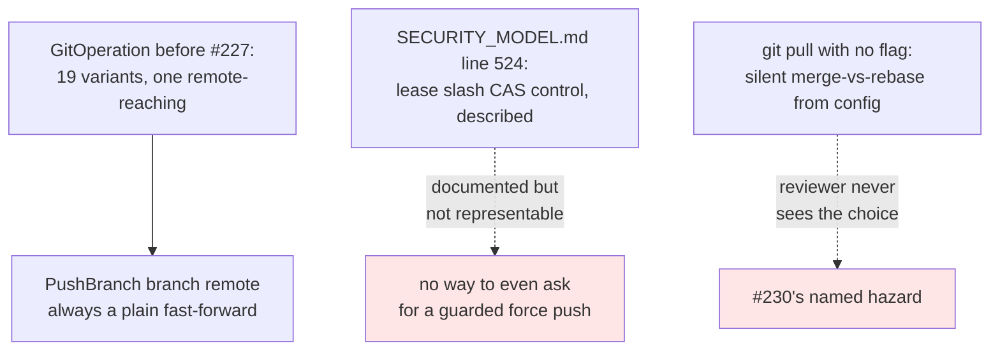
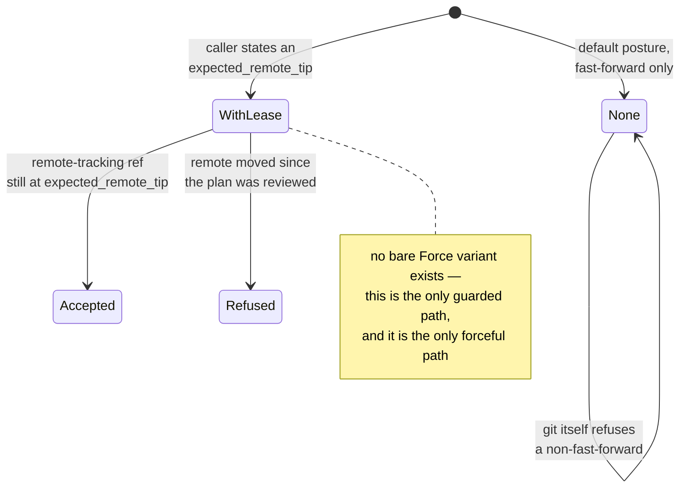
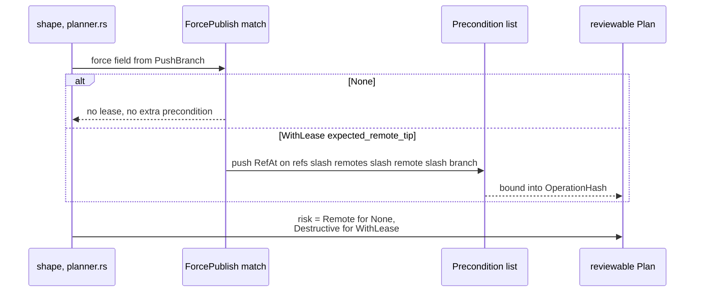
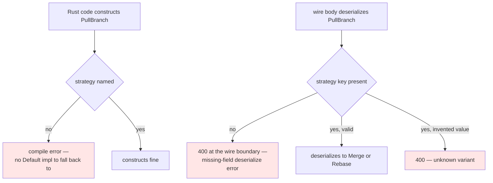
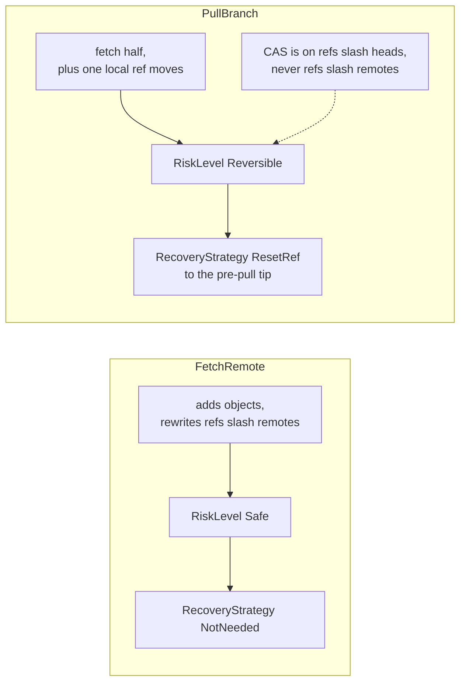
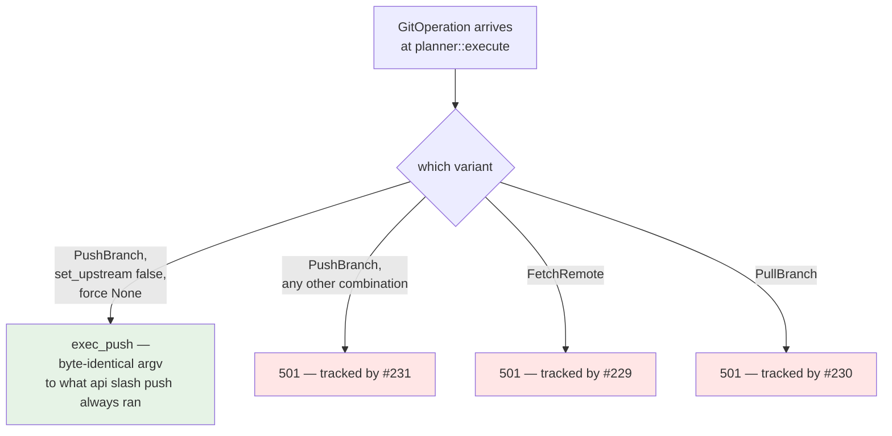
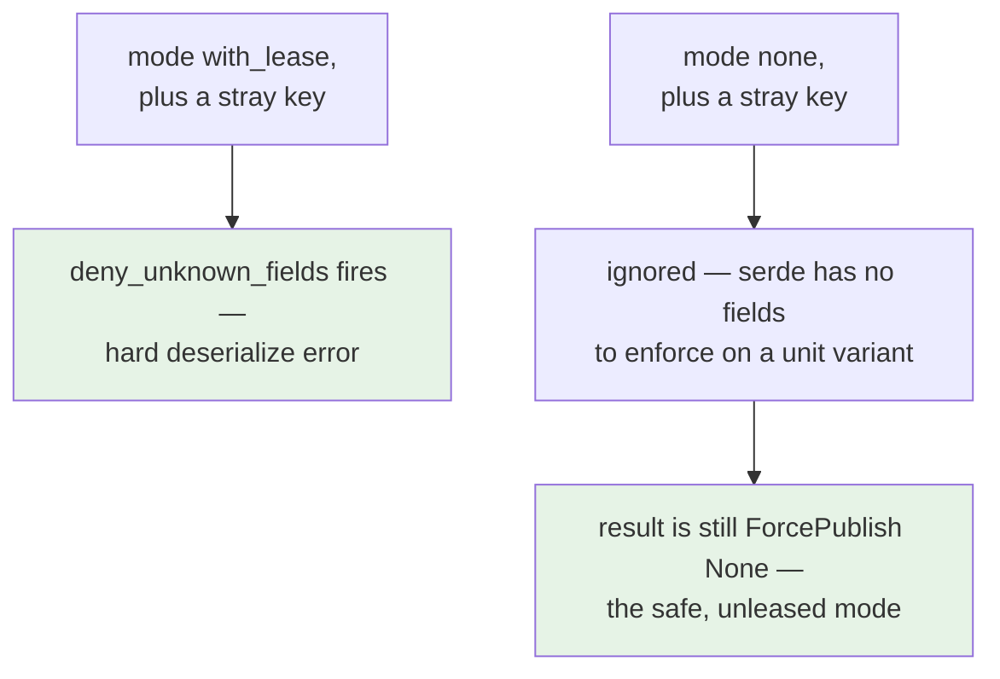

# ADR 0039 — The typed remote-operation vocabulary: `FetchRemote`, `PullBranch`, and a lease-guarded `PushBranch`

> **Numbering note:** numbered against in-flight siblings 0037/0038. Two sibling branches
> each created `docs/adr/0037-*.md`; the coordinated resolution is lane 284 keeps **0037**,
> lane 220 renumbers to **0038**, and this branch takes **0039**. Neither 0037 nor 0038 is
> visible in this worktree at the time of writing — they exist on branches merging before
> this one.

- **Status:** Accepted — typed contract implemented and tested. Execution is explicitly
  **not** wired: fetch (#229), pull (#230), and the force-with-lease/`--set-upstream` push
  combinations (#231) are later slices in the same M2.20 chain.
- **Date:** 2026-08-02.
- **Milestone / issue:** M2.20a, issue #227 ("Typed FetchRemote/PullBranch/PushBranch
  vocabulary + golden fixture + network classification"), child of #73 (M2.20, "Complete
  Remotes, Fetch, Pull, Push, and Upstream Management"). Branch
  `feature/m2.20a-remote-operation-vocabulary`, two commits: `fdf0fab` (the vocabulary) and
  `e75a36a` (a same-branch fix — see Decision §5).
- **Supersedes / superseded by:** Nothing. **Extends** [0015](0015-typed-operation-vocabulary-and-plan-schema.md),
  which established the closed `GitOperation` vocabulary and reviewable `Plan` schema this
  ADR adds three members to (two new variants, one widened).
- **Related:** [0015](0015-typed-operation-vocabulary-and-plan-schema.md) (the vocabulary
  this extends — read that one first), [0036](0036-network-tier-exec-harness-askpass-and-redaction.md)
  (the Network-tier exec harness these operations will route through once #229–#231 wire
  them — **this ADR does not cover that territory**; 0036 is askpass hardening and
  byte-level redaction, this ADR is contract-only, nothing here spawns a process),
  [0018](0018-plan-staleness-enforcement.md) (the `Precondition::RefAt` compare-and-swap
  machinery this ADR reuses rather than re-derives), `docs/SECURITY_MODEL.md`'s "Operation
  Risk Classes" table (annotated by this branch — see the end of Decision).

## Context

M2.20 (#73) is the milestone that completes remote operations in git-vista: fetch, pull,
push with `--force-with-lease` and `--set-upstream`. #227 (M2.20a) is deliberately the
*first* slice in that chain and depends on nothing — every later M2.20 slice edits either
`plan.rs`'s `GitOperation` enum or `planner.rs`'s dispatch match, so #227 lands the
vocabulary and its network classification first and nothing else may start in parallel with
it (the issue's own "Depends on" section says so explicitly).

Before this branch, `GitOperation` ([0015](0015-typed-operation-vocabulary-and-plan-schema.md))
had grown to 19 variants (from the 15 that ADR named at inception). Exactly one of them
reached a remote: `PushBranch { branch, remote }`, always a plain fast-forward push — the
module doc's own table of `POST /api/*` routes had no rows for fetch or pull at all.

`docs/SECURITY_MODEL.md`'s "Operation Risk Classes" table (line 524) has, since it was
written, described a control this codebase did not yet type:

```text
| Remote destructive | Force-push, remote branch delete | Strong warning, lease/CAS, re-auth option |
```

Nothing enforced "lease/CAS" anywhere in the vocabulary — a `PushBranch` had no way to *ask*
for a force push at all, guarded or not, which closed the door on the dangerous case but also
left the documented control unimplemented rather than implemented. Separately, #230 (pull)
carries its own named hazard: `git pull` with no explicit flag resolves merge-vs-rebase from
`pull.rebase` / `branch.<name>.rebase` config — a *silent* choice that lives in a file this
app never shows the user, so two people pulling the same branch can get two different
histories with neither having reviewed which.



This ADR is the decision to close both gaps in the *type*, ahead of any code that executes
them — the same staging posture M2.19a (#222) used for `AmendCommit`: land the vocabulary
and its network classification, get that reviewed as its own slice, and let the code that
actually opens a socket with credentials on it (#229/#230) or actually force-pushes (#231)
be reviewed separately.

## Decision

### 1. Two new variants, one widened — not three new variants

`GitOperation` gains `FetchRemote { remote: RemoteName }` and
`PullBranch { remote: RemoteName, branch: BranchName, strategy: MergeStrategy }`, and
`PushBranch` is **widened** in place rather than given a sibling:

```rust
PushBranch {
    branch: BranchName,
    remote: RemoteName,
    set_upstream: bool,
    force: ForcePublish,
},
```

Widening `PushBranch` instead of adding `PushBranchWithLease` (or similar) was deliberate: a
second "publish" variant would leave two ways to spell a push in a vocabulary whose whole
premise ([0015](0015-typed-operation-vocabulary-and-plan-schema.md)) is one variant per
mutation — and worse, the *plain* one would stay the path of least resistance, so the safety
this adds would be opt-in. Widening makes every caller state both new answers, including the
one production caller today (`handlers::branch::push_branch`, which now pins
`set_upstream: false, force: ForcePublish::None` explicitly — its own posture, not a default
the type supplies, since `ForcePublish` derives no `Default` and the field carries no
`#[serde(default)]`).

The enum is now 21 variants. Only `FetchRemote` and `PullBranch` are new; `PushBranch`'s
variant count is unchanged.

### 2. `ForcePublish`: no bare-force variant exists, so none can be requested

```rust
#[derive(Debug, Clone, PartialEq, Eq, Serialize, Deserialize)]
#[serde(tag = "mode", rename_all = "snake_case", deny_unknown_fields)]
pub enum ForcePublish {
    None,
    WithLease { expected_remote_tip: CommitOid },
}
```

A plain `git push --force` overwrites the remote branch with no regard for what arrived
there since the pusher last looked. `ForcePublish` makes that **structurally
unrepresentable**: there is no variant that means "force, unconditionally," so no handler,
no future refactor, and no deserializable request body can ask for one. The only force
available is `WithLease`, which carries the remote tip the *user reviewed* and turns the
push into a compare-and-swap — this is the typed form of `git push
--force-with-lease=<branch>:<expected-tip>`.



The oid is carried **in the operation** — bound into the plan's `OperationHash`
([0015](0015-typed-operation-vocabulary-and-plan-schema.md)) — rather than re-read from the
remote at execution time. A lease re-derived from a fresh `git ls-remote` would assert only
"the remote is where it was a millisecond ago," which is always true and protects nobody.
The value that makes the lease mean anything is the one the reviewer actually saw.

`shape` (`planner.rs`) turns a `WithLease` into a live `Precondition::RefAt` on the
remote-tracking ref (`refs/remotes/<remote>/<branch>`) — the same compare-and-swap machinery
[0018](0018-plan-staleness-enforcement.md) already uses for local refs, applied here to a
remote-tracking one for the first time:



A lease-force push raises the plan's `RiskLevel` from `Remote` to `Destructive` — recorded
as its own scalar-ranking decision in `plan.rs`'s `RiskLevel` doc comment, because reach
(does it leave the machine) and destructiveness (can something become unreachable) are
independent axes and a single enum has to pick one ranking. It picks the one that scales the
UI's confirmation ceremony *up*.

### 3. `MergeStrategy`: no silent default, enforced at the type

```rust
#[derive(Debug, Clone, Copy, PartialEq, Eq, Serialize, Deserialize)]
#[serde(rename_all = "snake_case")]
pub enum MergeStrategy {
    Merge,
    Rebase,
}
```

This is #230's headline requirement, landed a slice early so the type itself carries it: no
`Auto`/`Default` variant, no `Default` impl, and the `strategy` field on `PullBranch` carries
no `#[serde(default)]`. The consequence is layered:



`a_pull_without_a_strategy_is_a_deserialize_error` (`plan_golden.rs`) pins all three arms:
the omission is a hard error naming the missing field, both real strategies deserialize, and
an invented value (`"auto"`, `"default"`, `"ff_only"`, an empty string) is rejected too — so
the guarantee cannot pass by the field silently accepting anything.

### 4. `FetchRemote` and `PullBranch`: risk classification, and why it is not the reflex answer

**`FetchRemote` is `RiskLevel::Safe` with `RecoveryStrategy::NotNeeded`** — not
`RiskLevel::Remote` and not `Irrecoverable`, both of which are the plausible wrong answers a
later edit would reach for by reflex ("it talks to the network, so…"). A fetch only adds
objects and rewrites refs under `refs/remotes/`, a cache of what the remote said; nothing
under `refs/heads/`, nothing staged, nothing in the working tree. Reach and risk are
independent axes: `FetchRemote` declares `NetworkNeed::Remote` (it opens a socket) while
being `RiskLevel::Safe` (nothing a user owns can be lost). The test
`fetch_remote_shape_is_safe_with_nothing_to_recover` pins both negatives explicitly, not just
the positive answer.

**`PullBranch` is `RiskLevel::Reversible` with `ResetRef` recovery**, built through the same
`head_moves` helper `MergeBranch`/`RebaseOntoBase` already use, so pull cannot quietly drift
from what merge and rebase already do. Its compare-and-swap precondition is on the **local**
checked-out branch (`refs/heads/<branch>`), not the remote-tracking ref — pinning the remote
tip would refuse a pull for the ordinary reason that the remote received a new commit, which
is the entire point of pulling.



### 5. Execution intercepts exactly the pre-existing combination — everything else 501s

`planner::execute` (`planner.rs:1453-1461`) matches `PushBranch` against the literal
pre-existing shape:

```rust
GitOperation::PushBranch {
    branch,
    remote,
    set_upstream: false,
    force: ForcePublish::None,
} => exec_push(repo, need, &branch, &remote).await,
GitOperation::PushBranch { .. } => (
    StatusCode::NOT_IMPLEMENTED,
    "Pushing with --set-upstream or --force-with-lease is not yet wired \
     for execution (tracked by #231) — this plan's contract exists, but \
     nothing executed it.".to_string(),
),
```

`FetchRemote` and `PullBranch` each get their own unconditional `501` arm, present only
because `execute`'s match must stay exhaustive over the closed vocabulary
([0017](0017-no-arbitrary-argv-from-the-browser.md)) — nothing builds either operation today,
so in practice they are unreachable, but reached, they must refuse rather than silently no-op
or run a placeholder git command against a real repository and a real remote.



Why a `501` rather than an arm that ignores the new fields and runs a plain push: that
alternative would execute an operation the user did **not** approve — someone who asked for
`--force-with-lease` would silently get a fast-forward push, then be tempted to resolve its
predictable rejection by hand. The plan's hash binds `force`; execution has to honour it or
refuse, never quietly downgrade it.

This same-branch fix (`e75a36a`) closed a second, independent gap the first commit
(`fdf0fab`) left open: `sandbox::dispatch::variant_name`'s exhaustive match is
**presence-enforcement only** — it forces a contributor to name an arm for a new variant, but
cannot force them to add that variant to the hand-written `every_operation()` census or to
the hand-written `expected` name set. `AmendCommit` shipped exactly that way in M2.19a
(#222): absent from the census, classified with zero coverage, every guard in the file still
green. `e75a36a` adds `every_operation_covers_every_variant_the_enum_declares`, which compares
the census against `variant_names_the_enum_declares()` — a set harvested from serde's own
`unknown variant` deserialize-error message, generated by the derive macro from the enum
definition itself, so it is the one census in the file that cannot go stale in step with the
hand-written ones. Recorded here because it is part of what "the vocabulary is reviewed" now
means for this file, not a drive-by cleanup.

### 6. Network classification: `network_need_for_operation` gains two arms

`network_need_for_operation` (`sandbox/mod.rs`) is the exhaustive, wildcard-free match
[0030](0030-git-process-sandbox.md) built specifically so a new variant cannot be admitted to
the network tier by omission. `FetchRemote` and `PullBranch` both classify
`NetworkNeed::Remote`; `PushBranch` is unchanged (`Remote` regardless of `force`, proven by
`a_lease_force_push_declares_remote_like_every_other_push` — the force mode changes
`RiskLevel`, never the network tier). The build failed here until both new arms existed,
which the module's own doc comment now records as the guarantee observed working rather than
only claimed: *"the guarantee this doc claims, observed working rather than assumed
(`network_need_for_operation` is the only thing in the server that had to change for those
two variants to be admitted to the network tier)."*

This is why classification is load-bearing ahead of execution, and why it belongs in this
slice rather than #229/#230: once #229/#230 wire real spawns, [0036](0036-network-tier-exec-harness-askpass-and-redaction.md)'s
askpass hardening and byte-level redaction apply to *any* call declared `NetworkNeed::Remote`
by construction (`git_cmd::sandboxed`'s branch on `need`) — `FetchRemote` and `PullBranch`
inherit that hardening automatically the moment they execute, because their tier was decided
here, not there.

### 7. The `deny_unknown_fields` caveat serde surfaces on an internally-tagged enum

`ForcePublish` carries `#[serde(tag = "mode", rename_all = "snake_case", deny_unknown_fields)]`.
`deny_unknown_fields` is enforced on the **struct** variant (`WithLease`) — a stray key
alongside `{"mode": "with_lease", …}` is a hard deserialize error, so a misspelled
`expected_remote_tip` cannot silently become a lease that pins nothing. It has **no effect**
on the **unit** variant (`None`): a stray key alongside `{"mode": "none", "expected_remote_tip":
"…"}` is simply ignored, because serde does not consider unknown-field checking meaningful for
a variant with no fields to check against.



The mitigation this branch takes is honest rather than structural: the asymmetry lands on the
**safe** side by construction — the ignored case still yields `ForcePublish::None`, a plain
fast-forward push with no lease precondition, never a force of any kind — and
`no_wire_body_can_request_an_unguarded_force_push` (`plan_golden.rs`) pins both halves
directly rather than trusting the reasoning: it proves every spelling that might reach for an
unguarded force (`"mode": "force"`, `"forced"`, a lease with no oid, a lease plus a stray
`"also_force": true` key, a bare string, `true`, `null`) is a hard error, and separately pins
that a stray key beside `"mode": "none"` degrades to `ForcePublish::None` and nothing else —
so a future encoding change that made the ignored case parse as anything forceful fails this
test rather than shipping quietly.

## Alternatives considered, and why they lost

### A bare `force: bool` field on `PushBranch`
The obvious, minimal-diff shape. **Rejected**: it makes plain, unconditional `--force`
representable again — exactly the capability [0015](0015-typed-operation-vocabulary-and-plan-schema.md)'s
"no catch-all variant" posture and this ADR's `ForcePublish` type both exist to close. A
`bool` also carries no lease oid, so "force, but safely" would need a second field anyway,
at which point the type is doing the same job `ForcePublish` does with fewer illegal states
representable. A `bool` plus a doc comment saying "always pass a lease" is a convention;
`ForcePublish` makes the unsafe state impossible to construct.

### A second `PushBranchWithLease` variant instead of widening `PushBranch`
Keeps each variant's field set small and avoids the "some fields are always default" shape.
**Rejected**: it reintroduces exactly the "two ways to spell the same mutation" problem
[0015](0015-typed-operation-vocabulary-and-plan-schema.md) closed for the two `/api/commit`
paths (which *are* two variants, deliberately, because they differ in mechanics and
preconditions — a lease-force push does not; it differs only in one field). Worse, a second
variant leaves the plain one as the path of least resistance for every caller who does not
specifically reach for the lease-guarded one, so the safety this ADR adds would be opt-in
rather than a property of the type every `PushBranch` construction site has to state.

### A default `MergeStrategy` for `PullBranch` (`Auto`, or a `Default` impl choosing `Merge`)
Would have made `PullBranch { remote, branch }` constructible without deciding anything, and
would have let an omitted `strategy` in a request body fall back silently — exactly the
config-file-decides-and-nobody-reviewed-it hazard #230 exists to remove. **Rejected**
outright; this is the one alternative the issue's acceptance criteria name explicitly as
unacceptable, not merely undesirable.

### Re-reading the remote tip at plan-build time instead of carrying the reviewed oid
Would make `shape`'s `Precondition::RefAt` for a lease-force push assert "the remote is where
a fresh `git ls-remote` just said it is," computed fresh rather than pinned to what the
reviewer saw. **Rejected**: that assertion is true almost by construction — a lease
re-derived milliseconds before use only proves the remote has not moved since the millisecond
before, which protects nobody from the actual race (something landing on the remote between
review and execution). The value that makes a compare-and-swap mean anything is the one bound
into the plan's `OperationHash` at build time, which is what `expected_remote_tip` does.

### Classifying `FetchRemote`/`PullBranch` as `Local` until #229/#230 wire real execution
Tempting because neither operation spawns anything yet — a `Local` placeholder would compile
and every existing test would stay green. **Rejected** as the exact mistake
`network_need_for_operation`'s own doc comment warns against: the declaration is what picks
the sandbox tier for the eventual spawn, so a `Local` placeholder would be a *wrong* answer
sitting in the live data path, and the file that would have to change when #229/#230 land
would be this classification match — the one place [0030](0030-git-process-sandbox.md)
specifically wants a reviewer's eyes on the moment a variant is added, not later under
execution-slice time pressure. Classify by what the operation *is*, not by whether it runs
today.

## Consequences

- **The lease/CAS control `docs/SECURITY_MODEL.md` has described since it was written is now
  typed**, not merely described: `ForcePublish::WithLease` is the only way to request a force
  push, it is structurally impossible to request an unguarded one, and `shape` turns a lease
  into a live `Precondition::RefAt` compare-and-swap bound into the plan's `OperationHash`.
  The SECURITY_MODEL annotation below records exactly this and no more.
- **Execution is still #231's (and #229's, and #230's) to build.** Nothing in this ADR makes
  a real fetch, pull, or force-with-lease push happen. `planner::execute` refuses every
  combination beyond the pre-existing plain push with `501`, and the "strong warning" and
  "re-auth option" halves of the SECURITY_MODEL row remain entirely open scope for those
  later slices.
- **`GitOperation` is now 21 variants**, up from 19 (two new: `FetchRemote`, `PullBranch`;
  `PushBranch` widened, not duplicated). The golden fixture
  (`crates/git-vista-protocol/tests/fixtures/plan_v1.json`) pins the wire shape of all 21,
  including the lease-force push shape pinned separately
  (`a_lease_force_push_pins_its_own_wire_shape`) since the golden set holds only one plan per
  `op` tag.
- **The `deny_unknown_fields` asymmetry on unit vs. struct enum variants is now a documented,
  tested fact about this codebase's serde usage**, not a surprise waiting in a future review.
  Any other internally-tagged enum added later that mixes unit and struct variants inherits
  the same asymmetry and should get the same "prove the ignored path degrades to the safe
  variant" treatment this branch gave `ForcePublish`.
- **The census-drift hole from M2.19a (#222) is closed for this file specifically, not just
  patched around for two more variants.** `every_operation_covers_every_variant_the_enum_declares`
  compares against a set serde's own derive output generates, so it is the one census in
  `dispatch.rs` that cannot go stale in the same commit as the others — a future variant added
  without a sample in `every_operation()` now fails a test naming exactly what is missing,
  rather than shipping with silent zero-coverage classification the way `AmendCommit` did.
- **Network classification for two more operations is proven load-bearing, not merely
  declared.** The module's own doc comment now records that the build failed without the new
  arms — checked directly rather than assumed — and once #229/#230 wire real spawns,
  [0036](0036-network-tier-exec-harness-askpass-and-redaction.md)'s askpass hardening and
  redaction apply to them automatically, because the tier was decided here.

## Where this is implemented

- `crates/git-vista-protocol/src/plan.rs` — `MergeStrategy`, `ForcePublish`,
  `GitOperation::FetchRemote`, `GitOperation::PullBranch`, the widened
  `GitOperation::PushBranch`, and the `RiskLevel` doc-comment updates explaining the
  `Destructive`-vs-`Remote` ranking for a lease-force push.
- `crates/git-vista-protocol/src/lib.rs` — `ForcePublish`/`MergeStrategy` added to the crate's
  public re-exports.
- `crates/git-vista-protocol/tests/fixtures/plan_v1.json` and
  `crates/git-vista-protocol/tests/plan_golden.rs` — the golden set widened to 21 plans;
  `a_lease_force_push_pins_its_own_wire_shape`, `the_pre_m2_20a_push_body_no_longer_deserializes`,
  `no_wire_body_can_request_an_unguarded_force_push`,
  `a_pull_without_a_strategy_is_a_deserialize_error`.
- `crates/git-vista-server/src/planner.rs` — `shape`'s new `FetchRemote`/`PullBranch` arms and
  the widened `PushBranch` arm (the lease-to-`Precondition::RefAt` translation);
  `execute`'s interception at the literal pre-existing `PushBranch` shape (line ~1453) plus
  the `501` arms for every other combination and for `FetchRemote`/`PullBranch`; new tests
  `fetch_remote_shape_is_safe_with_nothing_to_recover`,
  `pull_branch_shape_is_reversible_with_a_local_cas_and_reset_recovery`,
  `only_a_lease_force_push_pins_the_remote_tracking_ref`.
- `crates/git-vista-server/src/sandbox/mod.rs` — `network_need_for_operation`'s new
  `FetchRemote`/`PullBranch` arms.
- `crates/git-vista-server/src/sandbox/dispatch.rs` — `variant_name`'s new arms;
  `every_operation()`/`lease_force_push()` samples; the harvested-census machinery
  (`variant_names_the_enum_declares`, `wire_name`,
  `every_operation_covers_every_variant_the_enum_declares`, its paired negative control, and
  `the_serde_variant_census_is_actually_harvesting_names`) added by the same-branch fix
  (`e75a36a`); `exactly_the_three_remote_operations_declare_a_network_need`,
  `a_lease_force_push_declares_remote_like_every_other_push`,
  `both_pull_strategies_declare_the_same_network_need`,
  `the_remote_declarations_and_their_argvs_agree`.
- `crates/git-vista-server/src/handlers/branch.rs` — `push_branch` pins
  `set_upstream: false, force: ForcePublish::None` explicitly at its one construction site.
- `crates/git-vista-server/src/planner/contract_suite.rs` — `repo_fingerprint`, an
  inertness proof covering refs, `FETCH_HEAD`, the object store, local config, and the
  index/worktree, used to prove the `FetchRemote`/`PullBranch` execution stubs change nothing
  about the repository.
- `docs/SECURITY_MODEL.md` — the "Operation Risk Classes" table's `Remote destructive` row
  (line 524), annotated by this branch; see below.

## SECURITY_MODEL.md annotation

The "Remote destructive" row of the "Operation Risk Classes" table
(`docs/SECURITY_MODEL.md:524`) is annotated with a paragraph immediately following the
table, in the file's established `*(Status: ADR NNNN, #issue — detail.)*` voice (the same
pattern used for the "Redact URL userinfo…" and similar rows in the "Implemented vs.
aspirational" table, and for the bulleted-list annotations elsewhere in this file), stating
plainly that the **type** is done and **execution** is not:

> *(Lease/CAS half typed, not yet executable: ADR 0039, #227 — …)*

Not re-rendering `docs/SECURITY_MODEL.pdf` here; a sibling lane owns that collision.

---

**Signed:** thomas2025 · 2026-08-02T03:21:19-04:00
