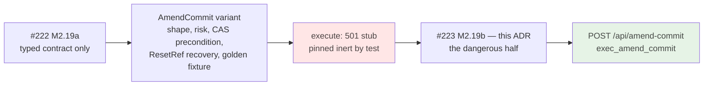
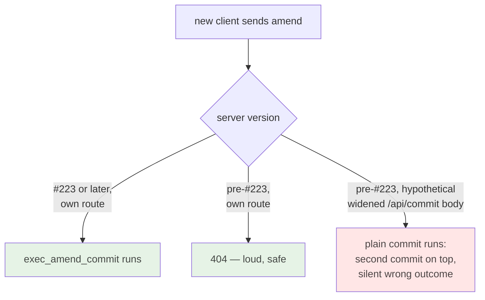
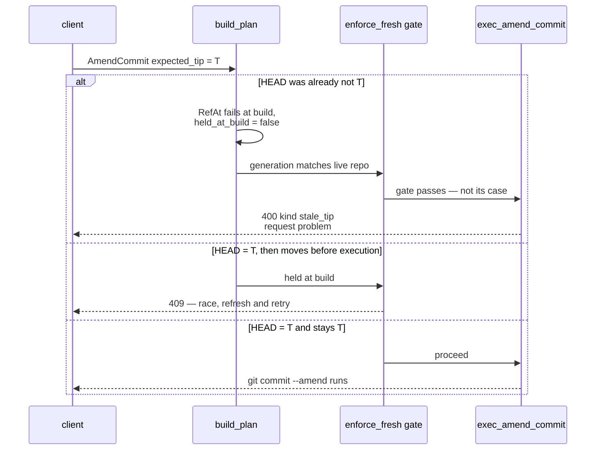
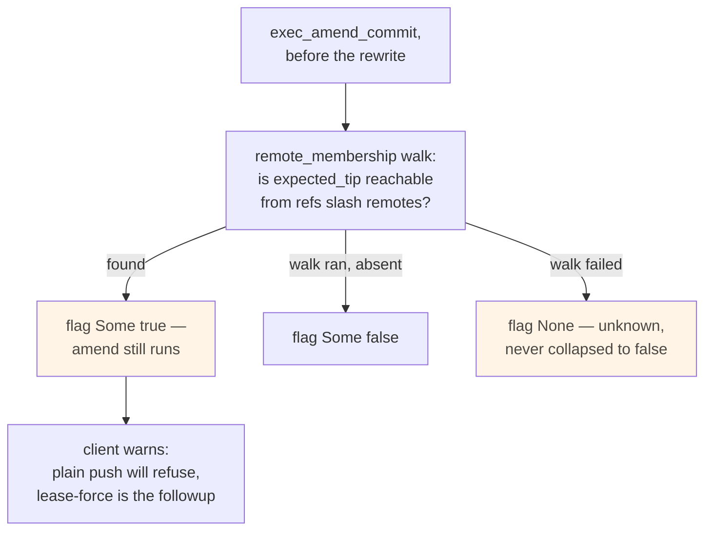
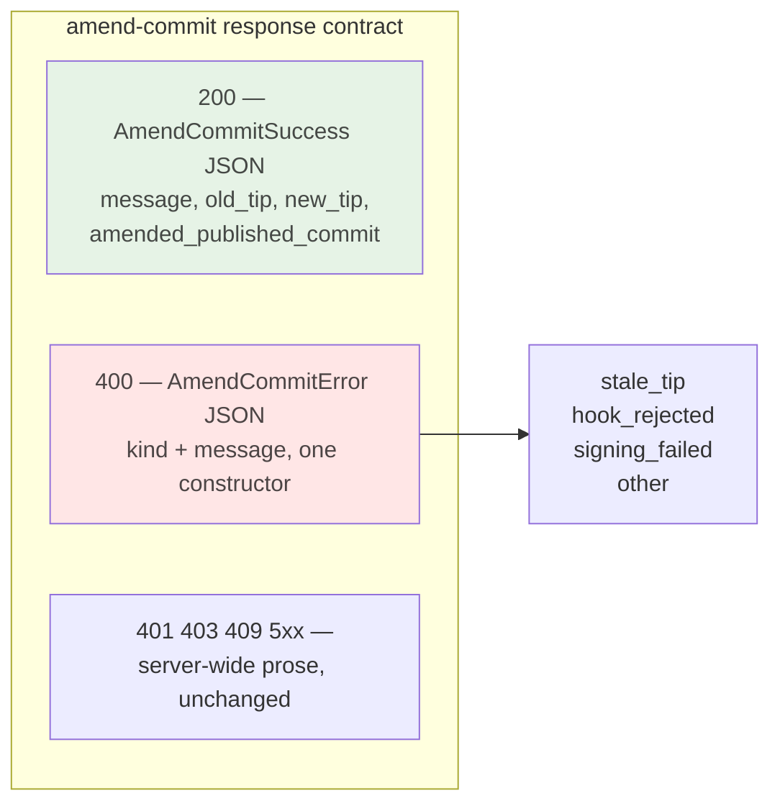
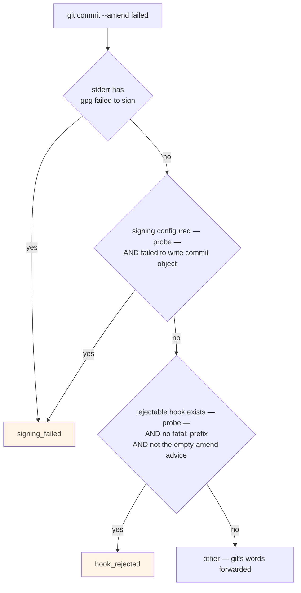
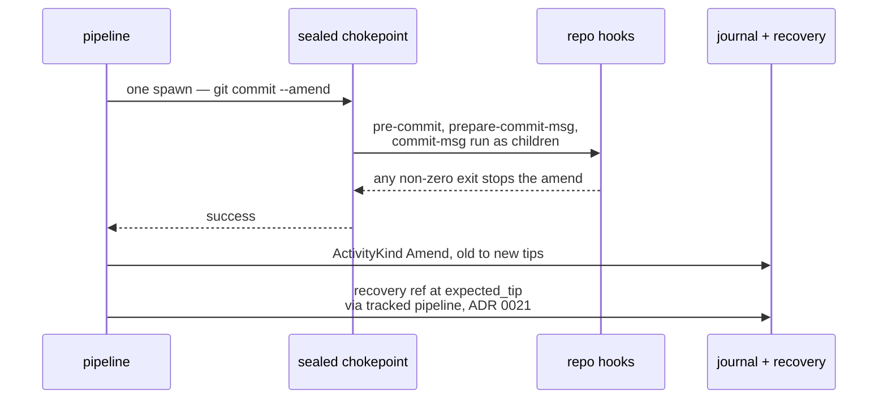

# ADR 0040 — Amend execution: its own route, an executor-level CAS, an advisory published-history flag, and typed failure kinds

- **Status:** Accepted — implemented and tested.
- **Date:** 2026-08-02.
- **Milestone / issue:** M2.19b, issue #223 ("Amend execution: compare-and-swap,
  published-history guard, hook/signing failure classification"), child of #72 (M2.19,
  "Amend commit"). Branch `feature/m2.19b-amend-execution`.
- **Supersedes / superseded by:** Nothing. **Completes** the execution half of the staging
  M2.19a (#222) began: the typed `GitOperation::AmendCommit` contract this ADR wires was
  landed and reviewed there, deliberately without any code that runs git.
- **Related:** [0015](0015-typed-operation-vocabulary-and-plan-schema.md) (the closed
  vocabulary and reviewable `Plan` schema), [0018](0018-plan-staleness-enforcement.md)
  (the `Precondition::RefAt` compare-and-swap machinery and the `enforce_fresh` gate whose
  held-at-build split this ADR's 400-vs-409 distinction rests on),
  [0021](0021-durable-operation-journal-and-recovery-refs.md) (the recovery-ref machinery
  that pins the pre-amend tip), [0030](0030-git-process-sandbox.md) (the sealed spawn
  chokepoint and `HookMode` this ADR's hook classification leans on),
  [0037](0037-observe-state-not-git-prose.md) (the never-branch-on-git's-prose posture this
  ADR knowingly and narrowly relaxes — see Decision §5), `docs/SECURITY_MODEL.md`'s
  "Operation Risk Classes" table, "History rewrite" row (annotated by this branch).

## Context

`git commit --amend` rewrites the checked-out branch's tip **in place**. It is the first
history-rewriting execution in the vocabulary: every operation wired before it either adds
state (commit, branch, merge) or moves refs between states that both keep existing
(checkout, reset — where the reflog and the CAS'd `expected_tip` preserve the old commit
under a ref until the user chooses otherwise). An amend's old commit, by contrast, ends up
on **no ref at all**, surviving only in the reflog and in whatever recovery machinery the
server wrote before acting. A bug here is not an inconvenience; it is silent loss of a
commit that someone else may already have pulled.

M2.19a (#222) landed everything reviewable about the operation without running it: the
`AmendCommit { message, expected_tip, allow_empty }` variant, `RiskLevel::Destructive`,
the `BranchCheckedOut` + `RefAt(expected_tip)` precondition pair, `RecoveryStrategy::ResetRef`
back to `expected_tip`, `NetworkNeed::Local`, the golden plan fixture, and a
`NOT_IMPLEMENTED` stub arm in `planner::execute` proven inert by a pipeline test whose
job was explicitly to be deleted by this slice.

Four questions were left open, on purpose, for this slice to answer with the git
invocation in hand: which route carries the request; where the compare-and-swap actually
refuses and with what status; what happens when the amended commit is already on a
remote; and how execution failures reach a client that must render a hook rejection, a
signing failure, and "git said no" differently.

## Decision

### 1. A new route, `POST /api/amend-commit` — never a widened `/api/commit`

`handlers::commit::amend_commit` is registered as its own POST route rather than folding
`expected_tip` into `CreateCommitRequest`. The deciding argument is **failure shape
against older servers**: a new-client amend sent to a pre-#223 server must fail loudly
(404 — the route does not exist), never be quietly accepted. A widened `/api/commit` body
gets the opposite: a pre-#223 server would either reject the unknown field
(`deny_unknown_fields` — acceptable) or, had the field been added with `serde(default)`
for compatibility, **run a plain commit instead** — creating a second commit on top of the
one the user asked to rewrite, a silently wrong outcome on a history-rewriting request.
The protocol crate had in fact already pointed this way: `AmendCommitRequest` landed in
#222 as its own DTO with its own doc-comment arguing against a shared shape, and both its
and the variant's docs named `POST /api/amend-commit` as the planned route.

The new route ripples through every census that exists to make route additions loud, and
that is the point of those censuses: `route_authz.rs`'s `ROUTE_AUTHZ` table gains the row
(`SessionAndCsrf`, like every mutation) and `EXPECTED_ROUTE_COUNT` moves 40 → 41; the
contract suite's funnel proof gains the POST row and the
`handlers/commit.rs::amend_commit → plan_and_execute` funnel entry.

### 2. The compare-and-swap: 400 at the executor, 409 at the gate — two different failures

`expected_tip` is checked at **two** layers, and they answer differently because they
catch different mistakes:

- **Stale from the start** (the client reviewed an old tip): the plan's
  `RefAt(expected_tip)` precondition already fails at build time, and
  [0018](0018-plan-staleness-enforcement.md)'s `enforce_fresh` deliberately re-verifies
  only preconditions that *held* at build — so the request flows through to
  `exec_amend_commit`'s own guard, which compares the build-time-observed HEAD against
  `expected_tip` and refuses **400** with `kind: stale_tip`. The client's picture of the
  repository is wrong; that is a request problem.
- **Moved while pending** (the race): the precondition held at build, then the repository
  changed. The generation check (and, as backstop, the re-verified `RefAt`) refuses
  **409**, exactly as for every other operation. The client lost a race; retrying after a
  refresh is reasonable.

The executor guard mirrors `exec_empty_commit_on_branch`'s and `exec_reset_branch`'s
posture (never swap on a compare that read nothing — D5's `Obs::Absent` refuses too,
covering the unborn-HEAD case), and adds one refusal of its own: **detached HEAD is
refused outright**. Amend targets the checked-out *branch* by contract, and on detached
HEAD `shape` degrades recovery to `NotNeeded` — honest only as long as nothing executes.
Running there would rewrite history with no branch ref for `ResetRef` to reset; refusal
keeps the recovery story true. Both tips of the CAS remain **local-ref** checks, matching
every other CAS precondition in the vocabulary.

### 3. The published-history guard: an advisory flag, never a block — and the exact walk, not the capped one

Before executing, the server asks whether the commit being amended away is reachable from
any remote-tracking ref, and reports the answer as `amended_published_commit` on the
success body. Three-state, deliberately: `Some(true)` (reachable — local and remote
history have now diverged; the client should warn that a plain push will be refused),
`Some(false)` (the walk ran and found nothing), `None` (the walk failed — **unknown, which
must never be collapsed into `false`**; a shared-history warning that reads unknown as
unpublished fails open, the exact lesson `Obs` encodes server-side, now applied to the
wire).

The flag is **advisory by decision**. The server never refuses to amend published
history: a user may be doing exactly that, knowingly — amend-then-force-push-with-lease
is a legitimate, ordinary workflow — and the confirmation ceremony belongs to the client
(M2.19d), where the warning can be shown *before* the user commits to the action.
Server-side, the flag is defense in depth and after-the-fact truth.

One knowing substitution against the issue's letter, recorded here rather than hidden:
the issue named `read_remote_commits` as the helper to reuse. The implementation reuses
**`remote_membership`** instead — the *same shared walk*, same file
(`git-vista-git/src/history.rs`), same remote-tip seeding, already used twice by
`handlers/read.rs` for its own on-remote flags. The difference is the cap:
`read_remote_commits` keeps only the newest `HISTORY_LIMIT` (5 000) remote commits, which
is right for decorating a bounded activity feed and wrong for *this* question — the tip
being amended is routinely deep below that in remote terms. This repository's own standing
workflow (branches preserved forever after merging) makes "amend the tip of a branch
merged into origin/main long ago" an ordinary case, and there a capped walk answers
`false` about precisely the shared commit the flag exists to warn about. A false negative
is the dangerous direction for a safety flag. `remote_membership` is exact, stops the
moment the requested id is found, and nothing about the remote walk was re-implemented —
which is what the issue's requirement was actually protecting.

### 4. Typed failure kinds on the wire: `AmendFailureKind`, and one 400 body shape

Execution failures reach the client as `AmendCommitError { kind, message }` with
`kind ∈ { stale_tip, hook_rejected, signing_failed, other }` — a typed tag beside git's
own words, so the frontend (M2.19d) branches on a stable enum instead of regex-sniffing
gettext-translated stderr. `stale_tip` is a fourth kind beyond the issue's three: the CAS
refusal is the one failure with a *different* client remedy (refresh and re-review — never
retry-as-is), so it earns its own tag now rather than as a wire-breaking addition later.

The endpoint's body contract is kept parseable by construction: **every 400 from
`/api/amend-commit`** — the handler's request-shape refusals included — is built by the
one constructor `planner::amend_refusal`, so a client can always parse a 400 body as
`AmendCommitError`; a 200 body is always `AmendCommitSuccess` (message, `old_tip`,
`new_tip`, the published flag). Other statuses (401/403/409/5xx) keep the server-wide
prose contract — they are the shared refusals every endpoint answers identically and the
client already handles generically. Both new DTOs are pinned in the dto golden fixture,
including the present-but-null wire posture of the two optionals (for
`amended_published_commit`, the null *is* the payload — see §3).

### 5. Classification: probes first, prose second, and every heuristic written down

Git gives classification almost nothing to work with — verified empirically against
git 2.43 before writing any of this, not assumed:

| Failure | exit | git's own stderr marker |
|---|---|---|
| hook rejects (silent hook) | 1 | **nothing — empty stderr and stdout** |
| hook rejects (chatty hook) | 1 | only the hook's own output |
| gpg signing fails | 128 | `error: gpg failed to sign the data` + `fatal: failed to write commit object` |
| ssh signing key unloadable | 128 | key-specific `error:` line + `fatal: failed to write commit object` |
| would-become-empty refusal | 1 | multi-line advice, **no `fatal:`** |
| git hard errors | 128 | `fatal: …` |

So `classify_amend_failure` is a **pure function** over three inputs — the stderr, and two
locale-independent *probes* taken through the same sealed chokepoint the amend ran
through: whether the repo's config requested signing (`git config --type=bool
commit.gpgsign`), and whether a rejectable hook (`pre-commit`, `prepare-commit-msg`,
`commit-msg`) exists executable in the **effective** hooks directory (`git rev-parse
--git-path hooks`). "Effective" is load-bearing: when the sandbox policy is
`HookMode::Blocked`, every spawn — shim and unsandboxed tier alike — carries
`-c core.hooksPath=<server-owned empty dir>` ([0030](0030-git-process-sandbox.md)), so the
probe sees that same empty directory and a repository whose hooks *cannot run* can never
have a failure blamed on a hook, with no separate policy plumbing to drift.

This is a deliberate, narrow relaxation of [0037](0037-observe-state-not-git-prose.md)'s
never-parse-git's-prose rule, and it stays inside 0037's real line: **no decision
branches on prose** — the amend's success/failure, the repository's state, and the
message shown all come from exit status and probes; prose picks only the *label*, and
every mislabel degrades toward `other`, which promises nothing. The residual heuristic
gaps are documented in the classifier's own doc comment rather than discovered later:
a hook that prints `fatal:` itself classifies `other` (right message, weaker kind); under
a non-English locale the would-become-empty advice is translated, so with a hook present
that one refusal mislabels as `hook_rejected` (the `fatal:`/`error:` prefixes themselves
are hardcoded in git's `die()`/`error()` and never localized, which is what keeps the
main hook leg locale-proof). Every branch and its paired negative — same stderr, one
fact flipped — is unit-tested against the captured real stderr shapes.

### 6. Journal, recovery, and hooks stay on the rails already built

**Journal:** a successful amend appends `ActivityKind::Amend` (a kind the feed machinery
already parses from `commit (amend):` reflog lines and already maps to a reset-back undo
hint) with `old_oid = expected_tip`, `new_oid` = the re-read HEAD — the record that makes
the amend show in `/api/activity` attributed to the app, dedupes its own reflog echo, and
feeds `undo_hint`'s `ResetBranch { to: old, expected_tip: new }` offer with `warn_pushed`
coming from the same remote-set the feed already computes.

**Recovery:** nothing amend-specific was built, deliberately. The tracked pipeline
(`plan_and_execute_tracked`) already persists every plan's `recovery` and writes the
`refs/git-vista/recovery/<operation-id>` ref ([0021](0021-durable-operation-journal-and-recovery-refs.md))
from it; #222's `shape` already pins amend's recovery to
`ResetRef { refs/heads/<branch>, expected_tip }`. The pre-amend commit therefore stays
pinned by a real ref — not only the reflog — for as long as the recovery ref lives.

**Hooks:** run inside the amend's own single sealed spawn, gating it normally (INV-11) —
there is no second hook path to bypass, which `argv_boundary`'s spawn-site census pins
structurally, and which the contract suite additionally proves *live*: a passing
`pre-commit` hook demonstrably executes during the pipeline's amend (marker file), and a
silent rejecting one demonstrably stops it.

## Alternatives considered, and why they lost

### Widening `POST /api/commit` instead of a new route
Fewer routes, one commit endpoint. **Rejected** for the older-server failure shape argued
in Decision §1: a new route fails as a loud 404 against a pre-#223 server, a widened body
risks a *silently wrong* plain commit — and route-count friction is exactly what the
`route_authz` census exists to spend on security-relevant additions. The protocol crate's
own #222-era docs had already committed to the dedicated route.

### Blocking the amend when the commit is published
The "safest" reflex. **Rejected**: amending published history knowingly is a legitimate,
ordinary workflow (amend → force-push-with-lease), and a server-side block would make the
server the wrong place for a UX decision — the warn-and-confirm ceremony belongs in the
client (M2.19d), *before* the action, where the user can still choose. The server's job
is to never lie about the fact; hence the three-state flag rather than a gate.

### Re-implementing the remote reachability walk in the planner
**Rejected** without ceremony: `git-vista-git` already ships the walk twice over
(`read_remote_commits`, `remote_membership`), `handlers/read.rs` already consumes the
membership form, and a third walk would be pure drift surface.

### Using the capped `read_remote_commits`, as the issue's acceptance criterion literally named
**Rejected** — recorded because it contradicts the issue's letter while honoring its
intent (reuse the shared walk; re-implement nothing). The cap (`HISTORY_LIMIT`, 5 000
newest remote commits) false-negatives exactly the amend-a-long-merged-branch-tip case
this repository's own branch-preserving workflow makes routine, and a false negative is
the failure direction a shared-history flag must not have. See Decision §3.

### Classifying failures by matching git's stderr alone, no probes
Simpler — no config read, no hooks-dir stat. **Rejected**: git prints *nothing of its
own* for a hook rejection, so stderr-only "classification" of the hook case is either
vacuous (match hook output that may be empty) or wrong (blame every silent failure on a
hook that may not exist). The probes are the locale-independent facts; prose is demoted to
tie-breaking, which is what keeps this inside 0037's line.

### A blanket `--no-verify` to make amend outcomes deterministic
Never seriously on the table, listed because it is the tempting "fix" the moment a hook
misbehaves in the field. Hooks gate mutations normally in this codebase (INV-11); the
contract suite's marker-file test exists precisely so a future `--no-verify` regression
fails a test that names what broke.

## Consequences

- **The M2.19 arc's dangerous half is done**: `AmendCommit` executes end-to-end, and the
  stub-inertness pipeline test #222 shipped was **deliberately replaced** by a battery of
  ten pipeline tests (real amend, stale-tip CAS, hook-runs proof, hook rejection,
  non-hook-with-hook-present negative, both signer formats, published flag positive with
  a buried-tip leg, sibling-ref safety, detached HEAD, journal evidence) plus the pure
  classifier's branch/negative table. `covered_by`'s exception note now names only
  `FetchRemote`/`PullBranch` as contract-only.
- **M2.19d has a complete wire contract to build against**: `AmendCommitSuccess` /
  `AmendCommitError` / `AmendFailureKind` are exported, golden-pinned, and documented,
  including the 400-is-always-typed rule and the three-state published flag.
- **The `Other` kind is the honest dumping ground.** The classifier's documented residual
  mislabels all degrade there (or into an over-eager `hook_rejected` in one
  translated-locale corner), never into `signing_failed`-when-disk-full or similar
  actively-misleading answers. If field reports ever show the corner cases mattering, the
  classifier is one pure function with its inputs already probed.
- **A route census bump is now part of adding any write endpoint's diff** (41 routes
  pinned), which is working exactly as designed — this branch is the census's first
  post-#227 exercise.
- **`plan.rs`'s vocabulary table has no *(planned)* row for amend anymore**; the two
  remaining contract-only rows (fetch, pull) are #229/#230's to graduate the same way
  this one did.

## Where this is implemented

- `crates/git-vista-protocol/src/dto.rs` — `AmendFailureKind`, `AmendCommitError`,
  `AmendCommitSuccess`; `AmendCommitRequest`'s doc updated to live status.
- `crates/git-vista-protocol/src/lib.rs` — the three new exports.
- `crates/git-vista-protocol/tests/dto_golden.rs` + `tests/fixtures/dto_v1.json` — both
  response bodies pinned (published/unknown-reach success shapes, hook-rejected error
  shape), plus the present-but-null assertions for the success optionals.
- `crates/git-vista-protocol/src/plan.rs` — module table row live; `AmendCommit` variant
  docs updated (staging history, published-history decision).
- `crates/git-vista-server/src/handlers/commit.rs` — `amend_commit` handler.
- `crates/git-vista-server/src/main.rs` — the `/api/amend-commit` route.
- `crates/git-vista-server/src/route_authz.rs` — the classification row;
  `EXPECTED_ROUTE_COUNT` 40 → 41.
- `crates/git-vista-server/src/planner.rs` — `exec_amend_commit`, `amend_refusal`,
  `amended_commit_is_published`, `signing_requested`, `rejectable_hook_present`,
  `classify_amend_failure` (+ its branch/paired-negative unit test); the `execute` arm
  replacing the 501 stub.
- `crates/git-vista-server/src/planner/contract_suite.rs` — the ten-test amend battery
  replacing the stub-inertness test; funnel census rows for the new route.
- `crates/git-vista-server/src/sandbox/mod.rs` — the `AmendCommit` classification note
  updated (`Local` stays truthful under execution).
- `docs/SECURITY_MODEL.md` — "History rewrite" row annotation; see below.

## SECURITY_MODEL.md annotation

The "History rewrite" row of the "Operation Risk Classes" table (`Reset, rebase, amend →
Preview, explicit confirmation, recovery ref`) is annotated in the file's established
`*(…: ADR NNNN, #issue — detail.)*` voice, stating what this slice implements for the
amend member of that row — the CAS + recovery-ref halves and the advisory published flag —
and what remains the client's (M2.19d: preview and explicit confirmation ceremony).

---

**Signed:** thomas2025 · 2026-08-02
