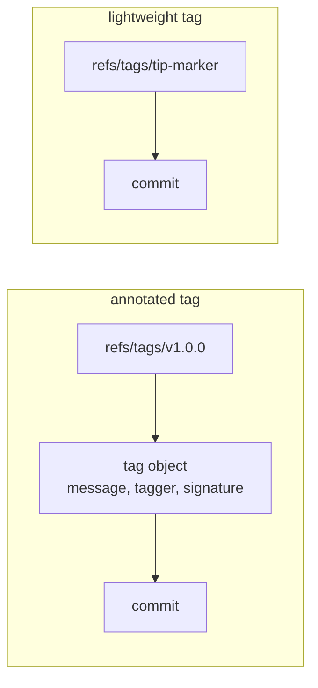
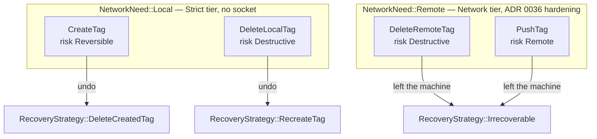
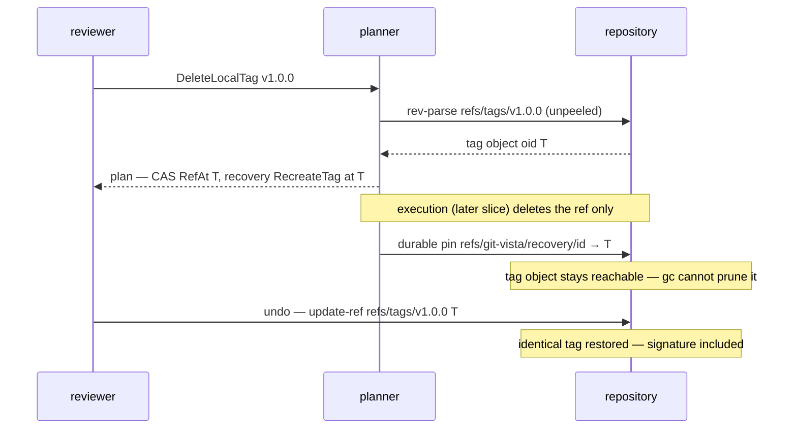

# ADR 0041 — The typed tag vocabulary: four variants, and an undo that restores the exact tag object

- **Status:** Accepted — typed contract implemented and tested. Execution is explicitly
  **not** wired: create, delete (local and remote), and push are later M2.21 slices under
  #74, staged exactly as ADR 0039 staged fetch/pull.
- **Date:** 2026-08-02.
- **Milestone / issue:** M2.21a, issue #235 ("Typed tag operation vocabulary + tag detail
  DTO"), child of #74 (M2.21, "Add Annotated and Signed Tag Management"). Branch
  `feature/m2.21a-tag-vocabulary`.
- **Supersedes / superseded by:** Nothing. **Extends**
  [0015](0015-typed-operation-vocabulary-and-plan-schema.md) (the closed `GitOperation`
  vocabulary this adds four members to, taking it from 21 to 25 variants) and the
  contract-before-execution staging pattern
  [0039](0039-remote-operation-vocabulary.md) established.
- **Related:** [0018](0018-plan-staleness-enforcement.md) (the `Precondition::RefAt`
  compare-and-swap machinery reused here — with one deliberate correction to how ref-shaped
  preconditions resolve, see Decision §5), [0036](0036-network-tier-exec-harness-askpass-and-redaction.md)
  (the Network tier `DeleteRemoteTag`/`PushTag` will route through once executed),
  [0031](0031-adr-format-alternatives-and-rejection-reasoning.md) (why the alternatives
  table below exists). Signing *config* is deliberately out of scope — see Decision §7.

## Context

M2.21 (#74) adds tag management. #235 (M2.21a) is its foundation slice: every later tag
slice edits either `plan.rs`'s `GitOperation` enum or `planner.rs`'s dispatch, so the
vocabulary, risk ranking, recovery answers and network classification land first, reviewed
on their own, before any code runs `git tag` or opens a socket.

Before this branch the vocabulary had 21 variants and nothing tag-shaped. The issue's own
sketch prescribed field shapes for the new variants; two of those shapes turned out to be
reflex answers this ADR overrides deliberately (Decision §2 and §3) — both deviations are
recorded with their reasoning below, per [0031](0031-adr-format-alternatives-and-rejection-reasoning.md).

The one piece of git background every decision below leans on: an **annotated tag** is a
real object (message, tagger, date, optional GPG signature) that `refs/tags/<name>` points
at, which in turn points at the tagged commit; a **lightweight tag** is a bare ref pointing
straight at the commit. `git rev-parse refs/tags/v1` returns the *tag object's* oid for an
annotated tag (the "unpeeled" value); `refs/tags/v1^{}` peels to the commit. `git tag -d`
deletes only the ref — the tag object survives, dangling, until `git gc`.



## Decision

### 1. Four variants, split by *where the effect lands* — not two variants with flags

`CreateTag`, `DeleteLocalTag`, `DeleteRemoteTag`, `PushTag`. The local/remote split across
distinct variants (rather than a `remote: Option<RemoteName>` "where" flag on a delete) is
load-bearing since ADR 0036: `sandbox::network_need_for_operation`'s exhaustive,
wildcard-free match is what routes a spawn through askpass hardening and credential
redaction, and `DeleteRemoteTag`/`PushTag` — both pushes under the hood — declare
`NetworkNeed::Remote` while `CreateTag`/`DeleteLocalTag` declare `Local`. A flag-shaped
design would have made the network need a *data* question answered inside one arm; the
variant split keeps it a *compile-time* question, and the dispatch census tests now pin the
remote set at exactly five operations.



### 2. `CreateTag`: one variant, kind chosen by `Option<TagAnnotation>` — and `sign` lives *inside* the annotation

#235 sketched `CreateTag { name, target, message: Option<TagMessage>, sign: bool }`. That
flat shape makes `sign: true, message: None` representable — a signed lightweight tag,
which git cannot produce (the signature is embedded in the tag object; a lightweight tag
has no object). The standing posture (`ForcePublish`, ADR 0039) is that a state which must
never execute is made *unrepresentable*, not caught by convention, so the shipped shape is:

```rust
CreateTag { name: TagName, target: CommitOid, annotation: Option<TagAnnotation> }
// with
struct TagAnnotation { message: TagMessage, sign: bool }   // deny_unknown_fields, no defaults
```

`annotation: None` ⇒ lightweight (signing inexpressible); `Some` ⇒ annotated, and `sign`
has no serde default, so every annotated request states whether it asks for a signature —
the same "make every caller state the answer" rule M2.20a applied to `set_upstream`/`force`.
One variant rather than two because — unlike #219's discard/delete pair, split for their
differing risk and recovery — lightweight and annotated creation share one risk, one
precondition shape, and one recovery; two variants would be two spellings of one mutation.

### 3. Undoing a local tag delete: `RecreateTag { name, at }` with the **unpeeled** ref value — an exact restoration, not a forgery

The reflex answers, each considered and rejected:

- **`RecoverableIfStaged`** is #219's tag for working-tree content whose fate depends on
  whether it was staged. A tag has no staging question; no analogue applies.
- **`ResetRef`** names a ref that still exists and moves it; deletion-undo is a different
  user-facing story, which is exactly why `RecreateBranch` already exists apart from
  `ResetRef`. Tag-delete mirrors branch-delete: a `Recreate*` variant.
- **#235's sketch, `RecreateTag { name, target, message: Option<TagMessage> }`** — the
  subtle one. Re-running `git tag -a -m <message>` recreates a *look-alike*: new tagger,
  new date, **signature gone forever** (no key this server will ever hold can re-sign as
  the original tagger). It also demotes the recovery of a signed tag to an unsigned one
  silently.

The shipped shape carries instead the one value that makes exact recovery possible: `at` is
whatever `refs/tags/<name>` pointed at before the delete — the tagged commit for a
lightweight tag, the **tag object's own oid** for an annotated one (what `git tag -d`
prints as `(was <oid>)`). `git update-ref refs/tags/<name> <at>` then restores the tag
**byte-identically** — message, tagger, date, GPG signature — because `git tag -d` never
deleted the object, only the ref.

This holds until `git gc` prunes the dangling object, and here the shape pays twice:
`durable::recovery_oid` returns `at`, so the existing recovery pin
(`refs/git-vista/recovery/<operation-id>`) points a real ref at the tag object and keeps it
*reachable* — gc cannot prune it while the pin exists. A message-carrying shape would have
had nothing to pin.



A second recovery variant, `DeleteCreatedTag { name }`, is the undo of `CreateTag` —
`DeleteCreatedBranch`'s tag sibling, separate because a consumer switching on the type must
be able to say "tag", not "branch". #235 did not list it, but `shape` needs an answer for
create and borrowing the branch variant would have typed the name wrongly.

### 4. `DeleteLocalTag` ranks `Destructive`, with `ForceDeleteBranch`'s reasoning

`git branch -d` refuses to delete unmerged work — that guard is why `DeleteBranch` ranks
`Reversible`. `git tag -d` has **no such guard**: it deletes whether or not the tagged
commit is reachable from anything else, and tag refs keep no reflog. A tag that was the
last ref keeping a commit alive takes that commit with it. So the local tag delete is
`-D`-shaped despite its lowercase flag, and ranks `Destructive` exactly as
`ForceDeleteBranch` does — with the same `Recreate*`-carrying recovery.

### 5. Ref-shaped preconditions now resolve **unpeeled** — a latent-bug fix the paired negative forced

The planner's `rev_parse` appends `^{commit}` (peels). Correct for every commit-shaped
caller; exactly wrong for observing a tag ref's value — and the contract suite's paired
negative (`delete_local_tag_recovery_carries_the_unpeeled_tag_object`, written against a
real annotated tag whose two oids provably differ) **failed against the peeling helper on
first run**, which is the test doing its job. The fix is a sibling reader,
`rev_parse_ref_unpeeled` (same D5 three-state honesty: absent ≠ unreadable), used by the
tag observation *and* by `verify_precondition`'s three ref-shaped checks — otherwise a
`RefAt` pinning a tag-object oid would compare it against the peeled commit and refuse
every honest tag CAS as "moved". For every ref those checks guarded before tags existed
(branches, remote-tracking refs, HEAD) the ref's value *is* a commit, so peeled and
unpeeled are the same bytes and nothing changes for them.

### 6. The read contract: `TagDetail`, `TagKind`, `SignatureStatus` — shapes only

`TagDetail { name, kind, target, tag_object, tagger, message, signature }` with `target`
always the peeled commit and `tag_object` the annotated tag's own oid (`Some` exactly when
`kind` is `Annotated` — and the value `RecreateTag` would want). `SignatureStatus` is a
closed five-way vocabulary (`Unsigned` / `Valid` / `Invalid` / `UnknownKey` /
`Unverifiable`) that refuses to collapse "we checked and it failed" into "we could not
check" — the same three-state honesty as `Obs`, because a UI that conflates them either
alarms users over a missing keyring or calls a bad signature good. No verification logic
ships here; M2.21c owns it.

`TagDetail` carries `deny_unknown_fields` even though response DTOs usually omit it (M1.02
additive rule): the DTO lands *before its producer exists*, so every value constructed
today is hand-written and strictness makes a misspelled key a loud error. Loosening later,
when the additive rule first needs to apply, widens the contract compatibly; tightening
after clients exist would not.

### 7. Newtypes, and where signing config lives

`TagName` reuses `require_git_safe` exactly as `BranchName` does. `TagMessage` is non-empty
like `CommitMessage` **and bounded** (`MAX_TAG_MESSAGE_LEN` = 16 KiB) — unlike a commit
message, a tag message rides inside a hashed, journaled operation and (annotated) is
written verbatim into the object database, so unbounded client-chosen bytes are the
"client input grows server-side state" concern the token cap already guards against; 16 KiB
is generous for real release notes.

Where the signing *key and configuration* come from — key selection, gpg program, whose
identity a server-side signature even asserts — is **deferred to #239 (M2.21d)**, on
purpose. The contract carries only the reviewed *intent* (`sign: bool` inside the
annotation); until #239 lands, `execute` refuses every `CreateTag` anyway, so no slice of
this decision is executable prematurely.

## Alternatives considered

| Alternative | Why it lost |
|---|---|
| Two create variants (`CreateLightweightTag` / `CreateAnnotatedTag`) | Same risk, same precondition, same recovery — two spellings of one mutation in a one-variant-per-mutation vocabulary. The state that had to be unrepresentable (signed lightweight) is handled by nesting `sign` inside `TagAnnotation`, not by splitting. |
| #235's flat `message: Option<TagMessage>, sign: bool` | Makes a signed lightweight tag representable; a wire body could ask for what no git argv can honour. Rejected on the `ForcePublish` principle. |
| One `DeleteTag` with a `remote: Option<RemoteName>` flag | Turns the Local/Remote network classification into a data question inside one match arm; the variant split keeps ADR 0036's tier dispatch a compile-time fact. |
| `RecoverableIfStaged` for the tag-delete recovery | #219's tag answers a staging question tags do not have. |
| Reusing `ResetRef` for the tag-delete recovery | Deletion-undo is a recreate, not a move — the exact distinction `RecreateBranch` already encodes; consumers switching on the type need "recreate deleted tag". |
| #235's `RecreateTag { name, target, message }` | Recreates a look-alike: new tagger, new date, signature unrecoverable — and leaves nothing for the durable pin to keep alive. The unpeeled-oid shape restores the original object byte-identically and protects it from gc. |
| `DeleteLocalTag` as `Reversible` (like `DeleteBranch`) | `git tag -d` has no unmerged-work guard and tag refs have no reflog; it is `-D`-shaped. |
| Classifying the unexecuted remote pair `Local` "for now" | The declaration picks the sandbox tier the day execution arrives; a placeholder would be a wrong answer waiting in the live data path — ADR 0039 rejected this by name for fetch/pull. |
| A `TagObjectOid` newtype beside `CommitOid` | Same hex validator, and no consumer switches on the distinction; a doc note on `CommitOid` records the one field that may hold a tag object. |
| Unbounded `TagMessage` (like `CommitMessage`) | Tag messages are hashed, journaled, and stored verbatim in the odb; a cap at the wire boundary is the cheap place to refuse a 100 MB "message". |

## Consequences

- The vocabulary is 25 variants; every exhaustive match (planner `shape`/`execute`,
  `network_need_for_operation`, the dispatch censuses, `covered_by`, `durable::recovery_oid`)
  names all four new variants, and the serde-harvested census pins that none can be
  forgotten. The remote set is now five, asserted as a *set* so a swap cannot hide in a count.
- All four operations refuse with `501` and are proven **inert** against real repositories
  and real (on-disk) remotes — the contract-suite stubs assert byte-identical fingerprints
  and untouched remote refs, with paired positives showing each assertion can fail.
- The golden fixture pins 25 wire shapes; `create_tag`'s annotated form, the unpeeled-oid
  `recreate_tag` recovery, and `TagDetail`'s two kinds are all byte-pinned.
- Later M2.21 slices inherit settled answers: execution slices wire argvs against a
  reviewed contract; the read slice (#74/M2.21c) fills `TagDetail` and owns verification;
  #239 owns signing config. If any of them needs a different shape, that is a deliberate,
  fixture-breaking protocol change — which is the point.
- `verify_precondition` resolving refs unpeeled is a behaviour change only for refs whose
  value is not a commit — today, exactly the tag refs this slice introduces.

**Signed:** thomas2025 · 2026-08-02T09:42:00-04:00
