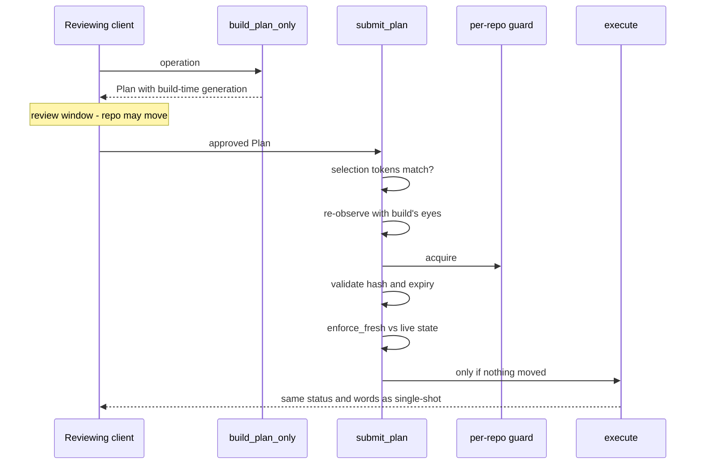
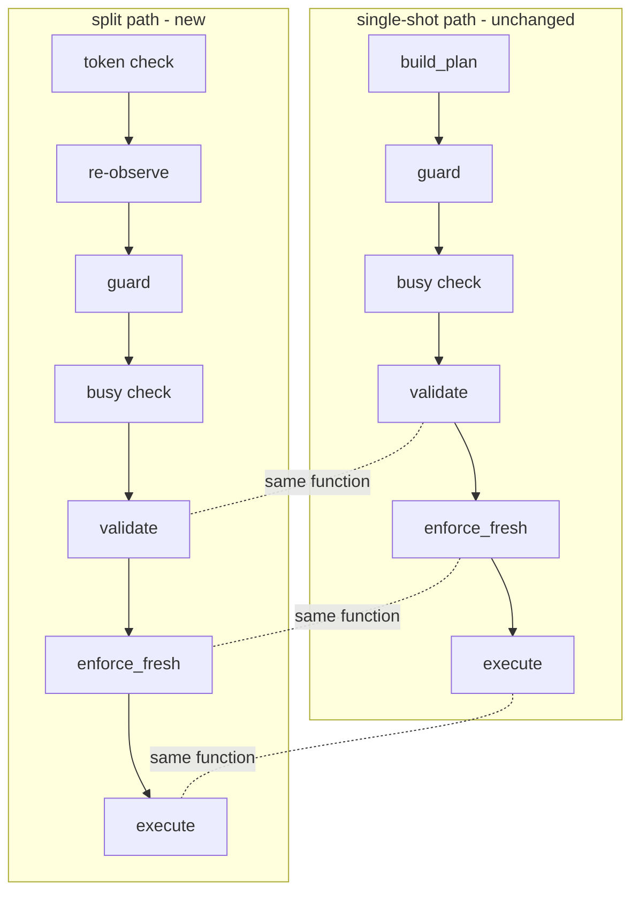
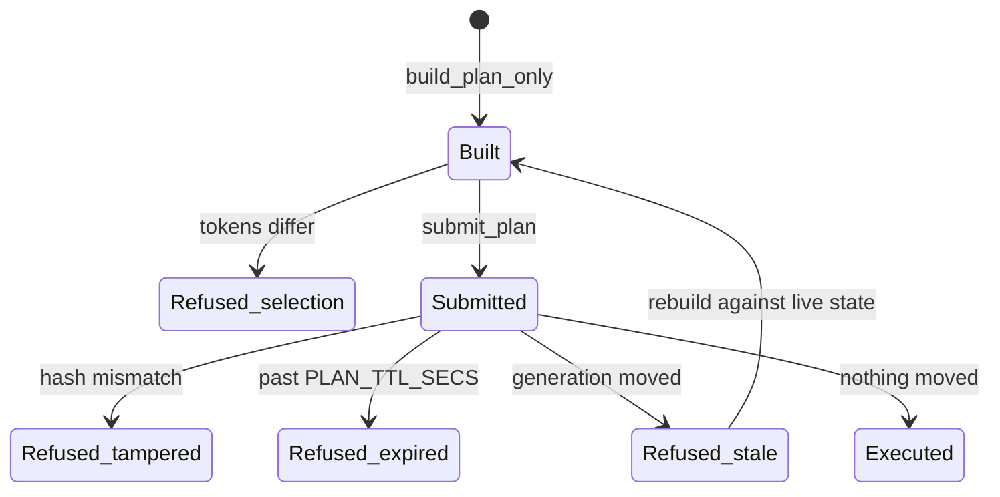

# ADR 0042 — The planner's build / submit seam: two stages, one set of stage functions

- **Status:** Accepted — implemented and tested. The two stages are deliberately **not
  routed yet**: no HTTP endpoint calls them until #248 (MCP plan tools) and #249
  (`execute_plan`); until then the contract suite is their only caller and the split's
  exhaustive-match censuses are what hold the seam closed.
- **Date:** 2026-08-02.
- **Milestone / issue:** M2.23c, issue #247 ("Split the planner into build-only and
  submit-approved-plan stages"), sub-issue of #153. Branch
  `feature/m2.23c-planner-split`.
- **Supersedes / superseded by:** Nothing. **Extends**
  [0016](0016-shared-write-planner.md) (the single funnel this cuts a reviewed seam
  into), [0018](0018-plan-staleness-enforcement.md) (the staleness gate that makes the
  seam safe), and [0019](0019-serialized-mutations-per-repository.md) (the per-repository
  guard whose position on each side of the seam is the load-bearing choice here).
- **Related:** [0015](0015-typed-operation-vocabulary-and-plan-schema.md) (the `Plan`
  wire type, unchanged by this slice — see Decision §4),
  [0031](0031-adr-format-alternatives-and-rejection-reasoning.md) (the alternatives
  table below).

## Context

`plan_and_execute_in` has always composed **build → guard → validate → enforce_fresh →
execute** inside one request. The planner's own module doc called the build/validate
seam "trivial-looking, deliberate": #145 made validation load-bearing precisely so that
a *client review roundtrip* — build a plan, show it to someone, execute only what they
approved — could exist one day without weakening anything. #247 is that day's
infrastructure: #248 wants to hand a `Plan` to an MCP client for review, #249 wants to
execute the plan the client hands back, and both need the pipeline to offer the two
halves as callable stages rather than as regions of one function.

Two constraints shaped everything below:

1. **No browser-facing behavior may change.** The acceptance is that the existing suite
   passes *unchanged* — every write route still calls `plan_and_execute`, every refusal
   keeps its exact status and words.
2. **The suite pins the composed path's body at the source level.**
   `the_production_entry_point_composes_the_tested_stages_in_order` requires
   `plan_and_execute_in`'s **own body** to contain `build_plan( → coordinator::lock( →
   refuse_if_git_busy( → validate( → enforce_fresh( → execute(` in order. A
   `plan_and_execute_in` that delegated its second half to `submit_plan` would fail that
   pin — so "make the old function a literal call of the two new ones" was off the
   table from the start, by the repository's own earlier decision.

The staleness model is what makes a review roundtrip safe at all, and it was settled in
[0018](0018-plan-staleness-enforcement.md): a `Plan` carries the generation observed at
build time, and execution re-verifies against the live repository under the guard. The
seam only works if the submit stage inherits that anchoring exactly.

## Decision

### 1. Two public stages, composed of the *same* private stage functions

- `build_plan_only(repo, op, tokens) -> Plan` — the build stage alone. It is
  `build_plan` minus the `Observed` (which never leaves the server), takes no lock, and
  leaves the repository byte-identical.
- `submit_plan(repo, repo_id, tokens, plan) -> (StatusCode, String)` — everything from
  the guard on: selection check, re-observation, then **guard → busy-check → validate →
  enforce_fresh → execute**, the same private functions `plan_and_execute_in` calls, in
  the same order.

`plan_and_execute_in`'s body is untouched (constraint 2 above), so the two compositions
are necessarily separate function bodies. What keeps them from drifting is the same
mechanism that pinned the first one: a second ordered-needle source test,
`the_submit_stage_composes_the_same_guarded_stages_in_order`, holds `submit_plan` to the
identical stage sequence. Behavior identity is not asserted structurally alone — the
sweep in §5 proves it byte-for-byte per operation kind.

### 2. Building never takes the guard — that is the point, and it is proven by holding it

A client reviewing a plan must not serialize behind (or block) a running mutation, and a
*second* reviewer must be able to build while the first's plan is pending — concurrent
review is the whole reason the seam exists. So `build_plan_only` mirrors the composed
path's deliberate build-before-lock ordering (ADR 0019's double-click argument):
building only reads, and any drift between build and execution is `enforce_fresh`'s to
refuse, not a lock's to prevent.

The test closes both vacuity holes at once
(`building_a_plan_takes_no_guard_and_submitting_takes_the_real_one`): it **holds the
pipeline's own guard for the entire build call** (a build that ever acquires it
deadlocks against the test and times out), asserts the full repository fingerprint and
generation are unchanged, and then — the paired positive proving the held guard is the
real one — shows `submit_plan` for the same plan staying pending against that held
guard and completing the moment it drops. Both legs were mutation-tested: disabling the
guard acquisition in `submit_plan` fails the test with its own diagnostic.

### 3. `submit_plan` re-observes with the same eyes, anchored on the plan's generation

The composed path hands `execute` the observation taken at build time (journal
before-oids, a delete's restore point, the CAS tip). A submitted plan carries no
observation — the `Plan` wire type is the whole interface — so `submit_plan` re-derives
one. Three choices make that safe rather than sloppy:

- **The observation function is shared, not copied.** `build_plan`'s reads were factored
  into `observe_operation` (including the per-operation `branch_tip` — the delete
  restore point that a naive `observe_live` re-derivation would have silently dropped)
  and `held_now`. `observe_for_submission` composes exactly those.
- **Staleness is anchored on the plan's build-time generation, not on the re-read.**
  `enforce_fresh` compares live state to `plan.generation`; any drift between build and
  the guard refuses execution. Whenever `execute` runs, the re-derived observation
  therefore describes the same repository state the plan was built against.
- **`held_at_build` is re-derived too**, which reads one corner differently: a
  precondition that held at build and silently broke during the review window is
  indistinguishable, from the submit seat, from one that never held — possible only for
  the generation-invisible pair (`RemoteConfigured`, `SeedRecorded`; every ref- or
  status-shaped break moves the generation and refuses). It flows to the executor's own
  legacy refusal instead of `enforce_fresh`'s 409. Accepted: both directions fail
  closed, and the alternative (§Alternatives, "re-verify everything") changes
  single-shot-identical behavior for plans that were built stale.

### 4. A plan may only submit against the selection it was built for — and the generation provably cannot enforce that

`submit_plan` refuses, before observing or locking, any plan whose
`repository`/`worktree` tokens differ from the submitting request's selection. This is
the one **new refusal sentence** in the slice ("This plan was built for a different
repository or worktree — rebuild it against the current selection."), and it is new
because the failure mode is new — no single-shot request can ever hit it.

It cannot be left to `enforce_fresh`: the generation token digests HEAD, refs and
status and nothing identifying the repository, so **two clones in byte-identical states
share a generation**. The test
(`a_plan_built_for_another_selection_is_refused_at_submit`) springs that trap on
purpose — its control leg shows the same foreign plan *executing* against a twin once
the tokens are made to match, proving the token check is the only thing standing
between selections. Mutation-tested: with the check disabled, the foreign plan executes
and the test fails.

The `Plan` wire type is untouched — the tokens it has carried since
[0015](0015-typed-operation-vocabulary-and-plan-schema.md) finally do load-bearing
work.

### 5. Both paths are censused, and byte-identity is proven per operation kind

`covered_by`'s wildcard-free exhaustive match already forces every new `GitOperation`
variant to name a single-shot pipeline test. This slice adds its sibling,
`covered_on_split_path` — a second wildcard-free exhaustive match, so a new variant
**fails to compile** until it is classified on both paths. Unlike `covered_by` it is
not injective: the split path shares every executor, so what is new per variant is only
*equivalence*, and one sweep proves it for the whole census —
`the_split_path_is_byte_identical_to_the_single_shot_path` drives every sample from the
(newly shared) `samples()` list through both paths against **twin repositories seeded
into byte-identical states** (author/committer dates pinned, so twins share oids and
even refusals that embed the seed tip compare equal) and asserts equal status and body.
The census test additionally pins that the sweep still iterates `samples()`, so the
table cannot end up vouching for a test that quietly stopped sweeping.

The three refusal legs of the acceptance run through `submit_plan` end-to-end with the
single-shot path's exact words and a mutates-nothing assertion each: tampered
(hash mismatch — "doesn't match"), expired (past `PLAN_TTL_SECS` — "expired"), stale
(generation moved during the review window — "changed while this plan was pending"),
each with its paired positive. No new error vocabulary beyond §4's cross-selection
sentence.

### 6. Not in this slice: routes

#247's issue text also sketches `POST /api/plan` and `POST /api/execute-plan` under
`full_routes`. This slice deliberately stops at the seam: the routes belong to
#248/#249, where their request/response shapes are decided against real MCP callers
(and `main.rs` was explicitly out of this slice's blast radius). Until then the stages
carry `#[cfg_attr(not(test), allow(dead_code))]` markers naming the routing issues —
the markers are the to-do list, and removing them is the first diff line of #249.

## Alternatives considered

| Alternative | Why it lost |
|---|---|
| Expose `validate` as a third public stage | Nothing a client can do with it: hash and expiry are checks *about* a submitted plan, meaningful only at the submit boundary, and `submit_plan` already runs them first under the guard. A public `validate` would invite "pre-validated" plans whose validation is stale by the time they submit. |
| `build_plan_only` takes the per-worktree guard | Defeats concurrent review — a reviewer would block behind a running mutation and serialize against other reviewers — and buys nothing: building only reads, and ADR 0019 already chose build-before-lock for the composed path so that staleness, not locking, referees the review window. |
| `plan_and_execute_in` literally delegates to the two new functions | Fails `the_production_entry_point_composes_the_tested_stages_in_order`, which requires the composed body to contain its stages inline — and editing that pin to accommodate the refactor is exactly the "change the test to fit the change" move the acceptance forbids. Two pinned compositions of shared stage functions preserve the suite untouched. |
| Carry `Observed`/`held_at_build` inside the `Plan` so submit needn't re-observe | Widens the ADR 0015 wire type with server-internal observations (raw tips, porcelain status) that a client could tamper with, for no gain: re-observation behind the build-time generation anchor reconstructs the same values whenever execution is admitted at all. |
| Let the generation token police cross-repository submits | Provably cannot: it digests HEAD/refs/status only, so byte-identical twins collide — demonstrated by the census test's control leg, where a foreign plan executes against a twin the moment tokens match. |
| Re-verify **all** preconditions at submit (treat `held_at_build` as all-true) | Changes behavior for plans built stale: a precondition that never held would refuse with `enforce_fresh`'s 409 instead of flowing to the executor's legacy wording, breaking byte-identity with the single-shot path — the one contract this slice exists to keep. |

## Consequences

- #248 can serve plans for review and #249 can execute approved ones by calling the two
  stages; neither needs to touch the pipeline's internals, and the staleness model they
  inherit is exactly ADR 0018's.
- Every future `GitOperation` variant must be classified on both paths before it
  compiles, and the byte-identity sweep picks it up automatically once it has a
  `samples()` entry.
- Two compositions of the guard sequence now exist in `planner.rs`. The cost is ~15
  duplicated lines; the mitigation is a pin test per composition holding both to the
  same ordered stages. A future consolidation would first have to renegotiate the
  existing source pin — deliberately not done here.
- The review-window corner for generation-invisible precondition drift
  (`RemoteConfigured`/`SeedRecorded`) refuses with the executor's words rather than the
  gate's. Documented in `submit_plan`'s doc; revisit only if a future precondition is
  both generation-invisible and dangerous to let reach its executor.
- `docs/SECURITY_MODEL.md` needs no annotation yet: no security boundary moved — the
  stages are unreachable from any route until #248/#249, which own the loopback-only
  routing decision this seam was shaped for.

---

**Signed:** thomas2025 · 2026-08-02T06:52:31-04:00
