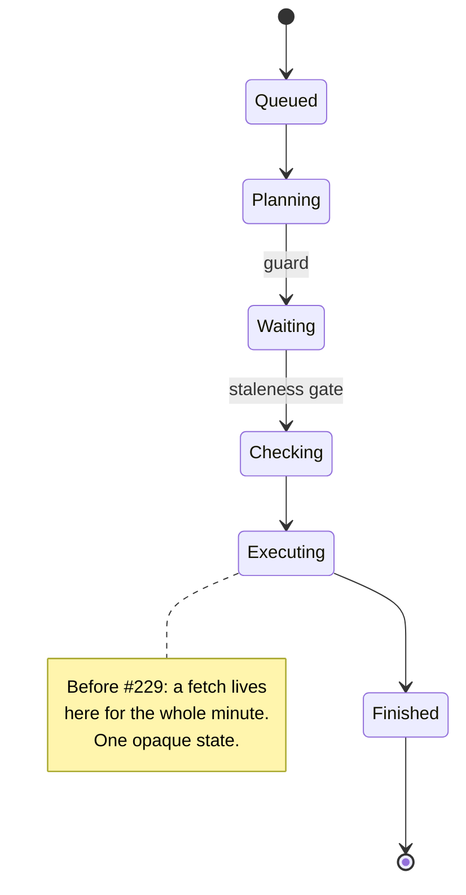
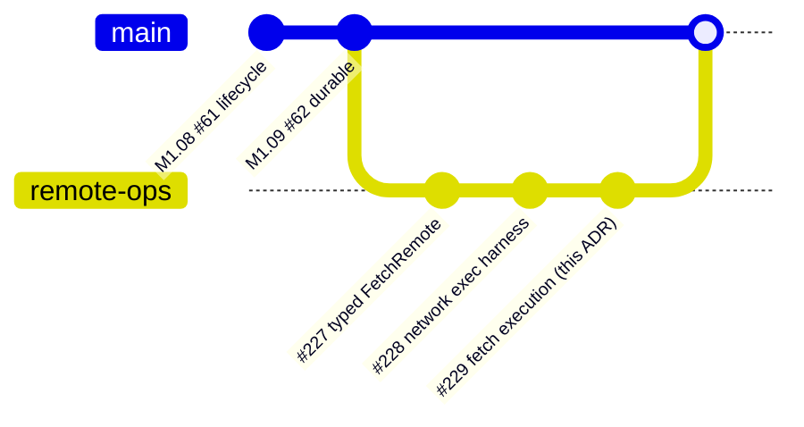
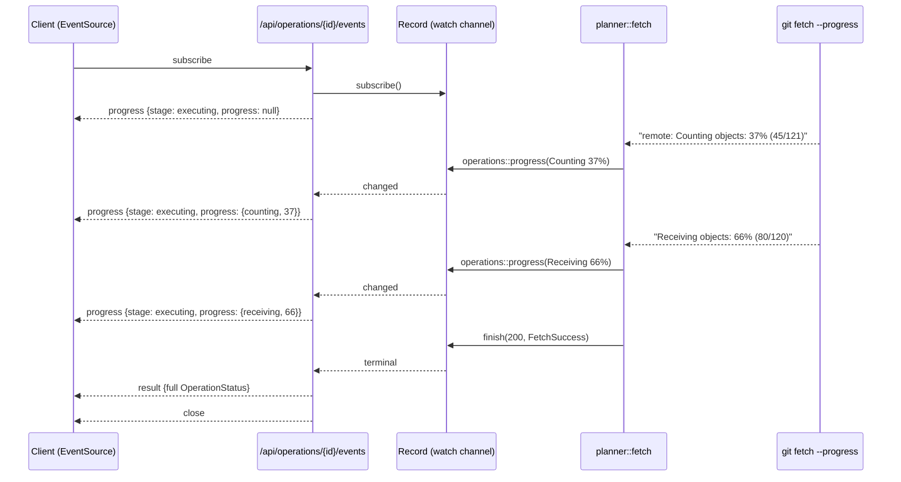
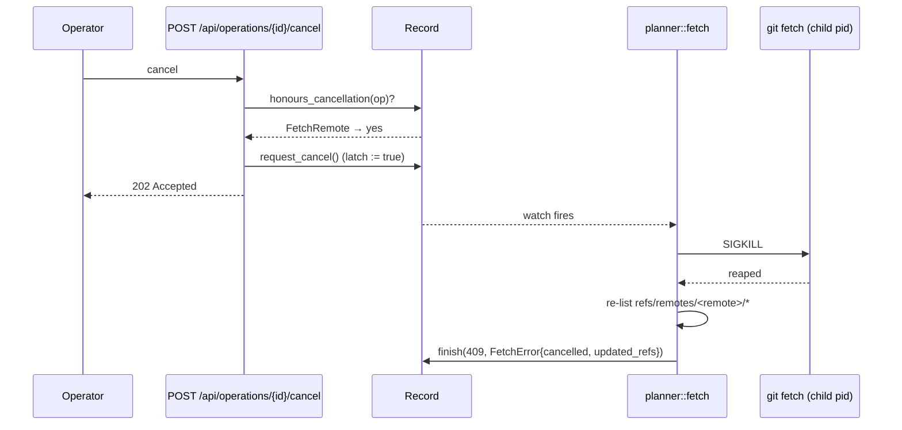
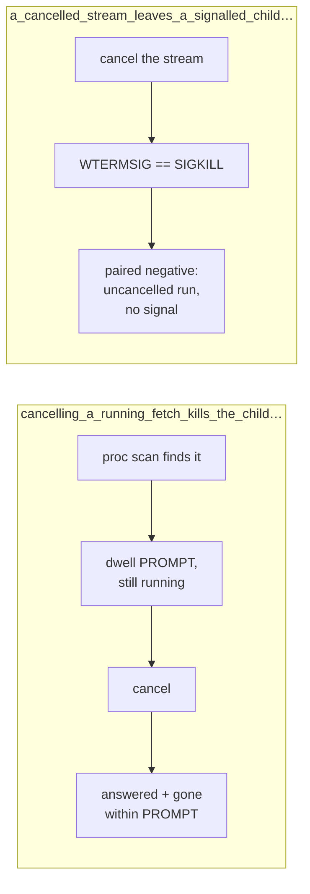
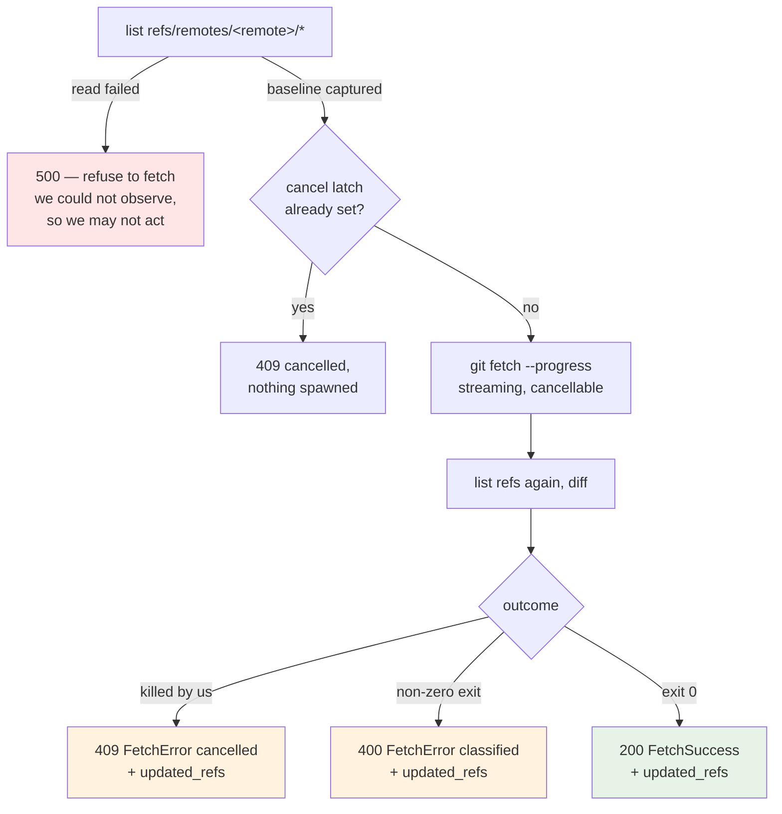
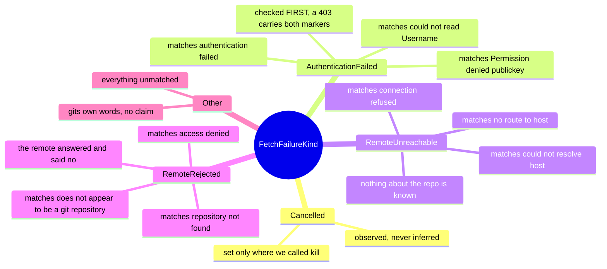
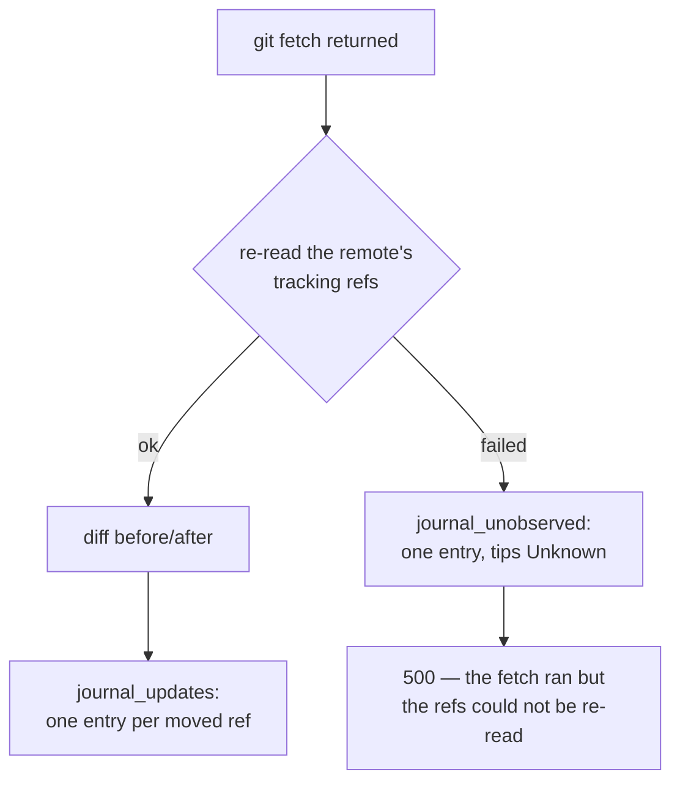

# ADR 0043 — Fetch execution: progress on the lifecycle that already exists, a cancel that kills the child, and an outcome read from refs rather than prose

- **Status:** Accepted — implemented and tested.
- **Date:** 2026-08-02.
- **Milestone / issue:** M2.20c, issue #229 ("Fetch: `POST /api/fetch` with streamed
  progress and cancellation"), child of #73 (M2.20, "Remote operations"). Branch
  `feature/m2.20c-fetch-execution`.
- **Supersedes / superseded by:** Nothing. **Completes** the fetch half of the staging
  M2.20a (#227, ADR 0039) began — the typed `GitOperation::FetchRemote` contract landed
  there deliberately without any code that runs git — and is the first production consumer
  of the Network-tier exec harness M2.20b (#228, ADR 0036) built.
- **Related:** [0036](0036-network-tier-exec-harness-askpass-and-redaction.md) (forced
  `core.askpass=`, byte-level redaction — every spawn here inherits both),
  [0039](0039-remote-operation-vocabulary.md) (the `FetchRemote` variant, its `Safe` risk
  class, its `RemoteConfigured` precondition, and the deliberate absence of prune/tags/
  refspec fields), [0020](0020-idempotent-operation-lifecycles.md) (the operation
  registry, `OperationStatus` watch channel and SSE stream this slice carries progress on,
  rather than building a second mechanism), [0021](0021-durable-operation-journal-and-recovery-refs.md)
  (why transfer progress is deliberately *not* persisted),
  [0037](0037-observe-state-not-git-prose.md) (the posture that decides how a cancelled
  fetch reports what it did), [0028](0028-network-tier-ports-not-hosts.md) (what the
  network tier does and does not constrain), [0030](0030-git-process-sandbox.md) (the
  sealed spawn chokepoint the streaming runner goes through),
  `docs/SECURITY_MODEL.md`'s "Remote and Forge Credentials" section (annotated by this
  branch).

## Context

Every git command this server had run before now finishes in milliseconds. `git fetch` is
the first that does not: against a real remote it is tens of seconds to minutes of a
process holding a socket open, receiving a pack, and writing objects. Two properties that
were previously free stop being free at that duration.

**The user cannot see what it is doing.** The lifecycle layer (M1.08, #61) reports an
`OperationStage` — `Queued → Planning → Waiting → Checking → Executing → Finished` — and a
fetch sits in `Executing` for its entire life. That is not a progress report; it is a
spinner with extra steps.

**The user cannot stop it.** Nothing in the server could terminate a running child. The
detached-pipeline model (M1.08) exists precisely so that a *dropped client* does **not**
kill git — which is right for a commit and exactly wrong for a fetch the user changed
their mind about. Before this slice, the only way to stop a fetch was to stop the server.



M2.20a (#227) landed everything reviewable about the operation without running it, and
M2.20b (#228) landed the harness every remote-reaching spawn must go through — fully
tested, with `exec_push` as its only production caller. This slice is where fetch actually
runs, which makes it the slice that has to answer: what does progress mean on the wire,
what does cancellation mean to a process, and what does a half-finished fetch tell the
user about their repository?



## Decision

### 1. Progress rides the lifecycle stream that already exists — as a payload, not a new stage

The issue's wording ("pushed onto the operation's stream ... stage transitions as fetch
phases change") pointed at two different mechanisms, and only one of them survives contact
with the code.

**What is *not* done: new `OperationStage` variants.** `OperationStage` is a wire enum with
an exhaustive match in the frontend (`features/operations/view.rs::stage_text`). Adding
`Counting`/`Receiving`/… to it would (a) fail to compile the frontend crate the day a
fetch ran, (b) make every *other* operation's stage vocabulary carry five values that can
never occur for it, and (c) still lose the percentage, which is the number a progress bar
needs.

**What is done: a typed `progress` payload on the records that already flow.**
`OperationStatus` and `ProgressEvent` each gain one optional field,
`progress: Option<TransferProgress>`, where

```rust
struct TransferProgress { phase: TransferPhase, percent: Option<u8>,
                          objects: Option<u64>, total_objects: Option<u64> }
enum TransferPhase { Enumerating, Counting, Compressing, Receiving, Resolving }
```

`stage` stays `Executing` for the whole transfer and `progress` is the only thing that
moves. That is the honest description of what is happening: the *pipeline* has not
advanced, the *transfer* has.

No new endpoint and no polling loop. `GET /api/operations/{id}/events` already turns the
registry's `watch<OperationStatus>` into SSE, and `watch` coalesces — which is exactly the
right semantics here, because a progress stream owes a client the *latest* value, not
every value. `Record::set_progress` additionally suppresses a no-change publish, so a
phase that reports the same percentage twice wakes no subscriber.



**Progress is never persisted.** `durable.rs` gets no column for it and rehydrates it as
`None`. Every row `recover()` hands back is terminal (it force-fails whatever a prior
process left running), so a persisted "receiving 62%" would be a live report about a
process that no longer exists.

### 2. Records, not lines — because git separates progress with carriage returns

`git fetch --progress` writes one `\n`-terminated *line* per phase and separates the
updates inside it with `\r`. Verified against git 2.43.0: a single line held ~100
`Counting objects: N%` records. A reader that split on `\n` would deliver one enormous
record when each phase *ended* — i.e. no live progress at all, only a retrospective one.

`git_cmd::git_streamed_for` therefore splits on either byte and hands each record to the
caller's callback as it arrives, redacting it with #228's `redact_url_userinfo` first. The
live callback is a second sink for exactly the same secret shape the collected `Output`
is, and it would have been the hole in that harness's redaction guarantee.

### 3. Streaming needs its own arity, not a flag on `git_output_for`

`git_output_for` collects: nothing downstream sees a byte until the process exits. Widening
it with a callback and a kill switch would put a fetch-shaped API on the helper thirty
other call sites use. `git_streamed_for` is its own function that goes through the **same**
`sandboxed()` chokepoint — inheriting the tier classification and #228's forced
`-c core.askpass=` identically — and applies the same `redact_if_remote` to what it returns.
The sandbox boundary is unchanged; only the reading discipline is new.

### 4. Cancellation is a latch on the record, and it kills the child

`POST /api/operations/{id}/cancel` sets a `watch<bool>` on the registry's `Record`. It
does **not** touch the status snapshot, and it does **not** terminalise anything. Only the
pipeline may write a terminal record, because only the pipeline has observed what happened
to the repository — a cancel that lands one millisecond after `refs/remotes/origin/main`
moved must produce a record that says the ref moved.

The latch is what `git_streamed_for` selects on, `biased` ahead of the read arm so a fetch
receiving objects flat out cannot starve it. When it fires, the runner `start_kill()`s the
child and reaps it. What dies is the **direct child** — the sandbox shim, which has already
`exec`'d git into the same pid — so `git fetch` itself receives SIGKILL.



**The endpoint refuses rather than lying.** Three answers, each to a different question:

| Situation | Answer |
|---|---|
| Unknown or malformed id | `404` — the same answer for both, as the sibling reads already give, because an id is unguessable |
| Record already terminal | `409` "already finished" — a `202` here would claim a cancel took effect on a completed operation |
| Operation has no cancellation point | `409` "cannot be cancelled" |
| Running and cancellable (including a repeat) | `202 Accepted`, idempotent |

`planner::honours_cancellation` is the exhaustive, wildcard-free match behind row 3. A
`true` arm is a **promise** that the executor takes `operations::cancel_signal()` and hands
it to the process it spawns. Today only `FetchRemote` qualifies; the contract suite pins
that census, and additionally asserts that `planner/fetch.rs` really does call
`cancel_signal()` and really does run through `git_streamed_for` — because
`honours_cancellation` returning `true` for an executor that ignored the latch is precisely
the "green test, dead mechanism" shape this repository keeps finding.

#### How "it kills the child" is proved — and how the first attempt did not prove it

Post-review correction (#229 review, finding 1). The original behavioural test asserted
that after a cancel the child is gone from `/proc`. It was vacuous, and measurably so:
deleting `child.start_kill()` from `git_streamed_for` — leaving the latch, the `cancelled`
flag and the loop `break` intact, so the runner stops reading but never kills — left **all
seven tests in `fetch_suite` green**, ~8s slower. The hung `upload-pack` fixture exits on
its own, `child.wait()` returns either way, and every timeout in the file was the same
order of magnitude as the hang, so "the process is gone afterwards" was equally true of a
cancel that merely waited it out.

Two independent proofs replace it, because the property is worth more than one angle:



* **Promptness, made a fair question.** `HANG` (the fixture's sleep) is 20s and `PROMPT`
  (the budget) is 3s. The test dwells `PROMPT` *before* cancelling and asserts the fetch is
  still running and the driver has not answered — establishing on that run, not by
  construction, that the child was not about to exit anyway. It then requires death within
  `PROMPT` of the cancel, with ≥14s of hanging still owed.
* **The mechanism, with no clock involved.** `a_cancelled_stream_leaves_a_signalled_child_not_an_exited_one`
  drives `git_streamed_for` directly and asserts `ExitStatus::signal() == Some(SIGKILL)`.
  `WTERMSIG` is set by the kernel only for a signalled process; a child that ran to the end
  of its sleep reports `None` and a real exit code however patient the runner was. Its
  timeout is deliberately generous so a wait-it-out implementation fails *on the signal*
  rather than on a deadline. The paired negative — same helper, same repository, no cancel
  — must report `cancelled == false` and `signal() == None`, which rules out an
  implementation that claimed `SIGKILL` unconditionally.

Both were re-run against the same mutation and both fail. That is the bar: a cancellation
test that cannot fail when the kill is deleted is worse than no test, because it is cited
as evidence.

### 5. What a fetch did is **observed from refs**, never read out of git's prose

The issue requires the terminal status to state "plainly whether the fetch completed
(remote-tracking refs moved) or was interrupted before any ref update." After a SIGKILL,
git's stderr is a truncated progress line — there is no summary to parse, and parsing one
would be locale-dependent even if there were.

So `planner::fetch` lists `refs/remotes/<remote>/*` with `for-each-ref` **before** the
spawn and **again** afterwards, and the difference is the answer. It reaches the wire as a
typed `Vec<RemoteRefUpdate>` on both the success and the error body, so a client renders
"nothing moved" versus "origin/main moved from X to Y" from data, not from a sentence.

This is ADR 0037's posture applied to the one question a cancelled network operation has to
answer honestly. Its corollary is enforced too: **failing to observe is a refusal, not an
empty list.** If the before-listing cannot be read, the fetch is refused with a 500 rather
than run — an operation whose outcome could not be reported truthfully must not happen.



A cancelled fetch answers **409**, not a success code. The registry derives
`OperationState::Failed` from any non-2xx, and a cancelled fetch recorded as `Succeeded`
is exactly the wrong thing for a reconnecting client to find. The cancel *request* is the
thing that succeeded (`202`); the fetch it stopped did not do what was asked.

### 6. Failure classification: a typed tag beside git's own words, never instead of them

`git fetch` exits 128 for essentially every fatal error, so the exit status carries no
classification, and — unlike an amend — there is no repository state to probe, because the
whole point of the failure is that nothing happened. Stderr is the only source, and it is
gettext-translated and version-dependent.

`FetchFailureKind` is therefore the same trade `AmendFailureKind` (ADR 0040 §5) already
makes, with the same discipline:



Three rules make a mis-tag cheap:

1. **`Cancelled` is observed, not classified.** It is set only on the code path where this
   server called `kill()`. A SIGKILLed child's exit status is indistinguishable from
   several ordinary failures, so a caller that inferred it from `output.status` would
   infer it wrongly.
2. **Unmatched means `Other`.** The classifier never picks the nearest-looking box. A tag
   that is absent costs a hint; a tag that is wrong costs trust.
3. **git's own message is forwarded in every case**, redacted, as `FetchError::message`.
   The tag is an addition to git's explanation, never a replacement for it.

Ordering is deliberate: authentication is checked before rejection, because an HTTPS `403`
routinely carries both an auth marker and an access-denied one, and "your credentials did
not work" is the actionable half.

### 7. The journal records what moved, per ref, and the generation bump is inherited

One `ActivityKind::Fetch` entry per remote-tracking ref that actually moved, with the
observed before/after oids — not one summary entry, because the activity feed is keyed on
refs. Nothing is journaled when nothing moved, the same posture `exec_checkout` takes
towards a no-op checkout. Journaling runs on the cancelled and failed paths too: whatever
landed before the stop is still a thing that happened to the repository.

**Every exit path after the spawn journals, including the one with no diff to report.**
Post-review addition (#229 review, finding 3). There is exactly one exit that is reached
*after* `git fetch` has run and *without* a ref diff: the post-fetch re-read of
`refs/remotes/<remote>/*` failing. As first written it returned a bare `500` and journaled
nothing — so a fetch that genuinely moved `origin/main` and then hit an `EMFILE` on the
re-read left the repository changed and the activity feed silent. That is the same
divergence between what happened and what was recorded that decision 3 observes refs to
avoid, arriving through the back door.

`journal_unobserved` closes it with one entry that **admits** the gap:

| Field | Value | Why |
|---|---|---|
| `ref_name` | `None` | Which ref moved is precisely what is unknown; naming one would be fabrication |
| `old_oid` / `new_oid` | `Obs::Unknown` | Not `Obs::Absent` — D5's whole distinction. `Absent` asserts the ref does not exist; the truth is git could not be read |
| summary | carries "…which remote-tracking refs moved is unknown: `<why>`" | `journal_app_event` turns `Unknown` into an explicit note, so empty oids can never be read as "nothing moved" |



`why` is safe to journal: it comes back through `run_git` under `NetworkNeed::Remote`, so
it has already been through #228's `redact_if_remote`.

The **generation bump is not done in this executor**, deliberately.
`plan_and_execute_tracked` already re-reads the generation after *every* operation and puts
it on the terminal record; a fetch gets it by construction. An executor that also bumped it
would be a second source of truth for a value that must have exactly one.

## Alternatives considered, and why they lost

### Adding fetch phases as `OperationStage` variants

The issue's literal wording. Rejected on three counts: it breaks the frontend's exhaustive
`stage_text` match (a crate this slice does not touch and should not have to), it pollutes
every other operation's stage vocabulary with values that can never occur for it, and it
still cannot carry a percentage — which is the actual payload a progress bar needs. The
optional `progress` field gets all three right and is additive on the wire.

### A dedicated `GET /api/fetch-status` poll endpoint

The clone path (#263/#278/#289) does poll, via `GET /api/clone-status/{key}`, and that is
the closest existing pattern. But it exists because a clone happens *before* a repository
is selected, so there is no operation record to attach to — clone is deliberately outside
the operation registry. A fetch is an ordinary tracked mutation with a record, a watch
channel, and an SSE endpoint already built and already bounded four ways (heartbeat,
lifetime cap, terminal close, process-wide permit cap). Adding a second, unbounded polling
surface for the same information would be new attack surface and a second thing to keep
consistent.

### Cancelling by aborting the pipeline's tokio task

`JoinHandle::abort()` plus `kill_on_drop(true)` would kill the child as a side effect of
dropping the future. Rejected: the drop happens at an arbitrary await point, so the
executor never gets to re-read the refs, and the terminal record would come from
`OperationHandle`'s `Drop` backstop — which says "The operation stopped without finishing",
the generic panic message. That is precisely the sentence the issue's acceptance criterion
forbids: it cannot distinguish "completed" from "interrupted before any ref update". A
cooperative latch keeps the executor alive through its own cleanup.

### Cancelling by killing the process *group*

Would also reap grandchildren (an `ssh` transport, a credential helper). Rejected for this
slice because it requires `setsid`/`process_group` on the spawn, and `SandboxedCommand`
exposes no such setter — deliberately, as the type's whole purpose is that nothing about
the spawn is configurable after `sandbox_argv` classified it (#228, C10 hazard #1).
Widening that surface is an architectural decision that deserves its own review, not a
side effect of this slice. Recorded as a known limitation below.

### Making the cancel endpoint always answer `202`

Simpler, and dishonest. An operator who cancels a `CommitOnHead` and is told "cancelling…"
has been told something false — nothing watches the latch for that operation and nothing
ever will, because the window does not exist. `honours_cancellation`'s exhaustive match
makes the answer a compile-time-forced decision per variant instead.

### Reporting the fetch outcome from git's `From <url> / a1b2..c3d4 main -> origin/main` summary

The obvious source, and it is prose: translated under a non-English locale, absent entirely
after a SIGKILL, and formatted differently for new branches, forced updates, prunes and
tags. ADR 0037 already wrote down why this loses. The before/after ref listing is true
under every locale, every git version, and — critically — after a kill, which is the case
the whole cancellation contract turns on.

### Forcing `LC_ALL=C` on the child so progress parsing and classification are locale-proof

The single change that would most improve both the parser and the classifier. Impossible
here without reopening #228's hazard: `SandboxedCommand` has no production `env` method,
for exactly the same reason it has no `arg` method — `GIT_DIR`, `GIT_SSH_COMMAND` and
`GIT_EXTERNAL_DIFF` make an environment set after classification into an argv change
wearing a different hat. ADR 0036 already reported the identical gap for
`GIT_TERMINAL_PROMPT` and declined to unilaterally widen the surface; this ADR makes the
same call. The degradation is benign in both directions: an unrecognised progress record
produces *no* progress rather than a wrong one, and an unrecognised failure produces
`Other` rather than a wrong tag.

### Accepting a URL in `FetchRequest` instead of a configured remote name

Rejected outright. A request that could name a URL would let any authenticated client point
this server — and whatever credential helper or SSH agent the host offers it — at a host of
the client's choosing. That is the same class of hazard as a request naming a repository
path, which ADR 0002 already refuses. The name is resolved through the repository's own
configuration and gated by `Precondition::RemoteConfigured`.

### Adding `--prune`, `--tags` or a refspec to the request

`FetchRemote` carries a remote and nothing else (#227). A body field with nowhere to land
in the typed operation would be a field the plan's reviewer never sees and the plan's hash
never binds — the exact failure `PushBranch`'s `set_upstream`/`force` staging was designed
to avoid. If pruning is wanted, it is a vocabulary change first.

## Consequences

- **`FetchRemote` executes end-to-end.** The stub-inertness pipeline test #227 shipped is
  **deliberately replaced** by a real-execution battery: a fetch that moves a ref (asserted
  against the repository, not the response), a paired no-op leg that must report *nothing*
  moved, a broken-remote leg that must classify and change nothing, and the cancellation
  census. `covered_by`'s contract-only exception note now names only `PullBranch` and the
  four tag operations.
- **The #228 harness has a second production caller**, and the first one that streams.
  `exec_fetch` → `git_streamed_for` → `sandboxed` → `network_command` is a real chain, not
  a tested-but-unreachable one.
- **`OperationStatus` grew a field, additively.** No protocol version bump: the field is
  `Option` with `#[serde(default)]` and the type already documented that it does not deny
  unknown fields, so an older client keeps parsing. `ProgressEvent` gained the same field
  under the same rule, with a test that an event minted without it still parses.
- **The route census is 43** (41 → 43: `/api/fetch` and
  `/api/operations/{id}/cancel`), and the cancel route is classified in the contract
  suite's POST census as a *non-git* write — a POST that mints no plan and constructs no
  argv — so it does not get a funnel row and cannot silently acquire one.
- **A known limitation, stated rather than hidden:** cancelling kills the direct child.
  A grandchild transport process (`ssh`, a credential helper) is not in a process group
  this server owns and may outlive the kill until it notices its parent is gone. Closing
  that needs a process-group setter on `SandboxedCommand`, which is its own decision.
- **A second known limitation:** progress parsing and failure classification are
  English-marker heuristics. Both degrade to "no claim" rather than to a wrong claim, and
  both are pure functions with paired-negative tests, so tightening them later is a
  one-function change.
- **`fetch_suite` is 7 tests → 11, and each addition was chosen by a mutation that
  survived** (#229 review). The three mutations, and what now kills each:

  | Mutation | Before | Now fails |
  |---|---|---|
  | Delete `child.start_kill()` | all 7 green, ~8s slower | `cancelling_a_running_fetch…` (promptness) **and** `a_cancelled_stream_leaves_a_signalled_child…` (`WTERMSIG`) |
  | Delete the success-path `journal_updates` | all 23 fetch-touching tests in the workspace green | `a_fetch_that_moves_a_ref_journals_it_per_ref` |
  | Delete `journal_unobserved` | the path did not exist | `a_fetch_whose_outcome_cannot_be_observed_is_journaled_as_unknown` |

  The journal legs read back through `journal::read_all` — the same parser `/api/activity`
  uses — and check oids against `git rev-parse`, not against the response body, so they
  cannot pass by comparing a value with itself. `an_up_to_date_fetch_journals_nothing` is
  their paired negative.
- **The unobservable-outcome path is driven, not merely written.** Its fixture installs a
  `reference-transaction` hook that corrupts `.git/packed-refs` at the `committed` stage,
  so `refs/remotes/origin/main` genuinely moves and only then does `for-each-ref` become
  fatal — the real divergence, reproduced, rather than a unit test of a function nothing
  calls.

## Where this is implemented

- `crates/git-vista-protocol/src/operation.rs` — `TransferPhase`, `TransferProgress`, the
  `progress` field on `OperationStatus` and `ProgressEvent`, wire-name pins and the
  older-event-still-parses test.
- `crates/git-vista-protocol/src/dto.rs` — `FetchRequest`, `RemoteRefUpdate`,
  `FetchFailureKind`, `FetchError`, `FetchSuccess`.
- `crates/git-vista-protocol/src/lib.rs` — the new exports.
- `crates/git-vista-protocol/tests/dto_golden.rs` + `tests/fixtures/dto_v1.json` — request,
  both success shapes (with updates, and the up-to-date no-op) and both error shapes (auth,
  cancelled-after-a-ref-moved) pinned.
- `crates/git-vista-server/src/git_cmd.rs` — `git_streamed_for`, `StreamedRun`,
  `wait_for_cancel`, the `\r`/`\n` record splitter and its redaction.
- `crates/git-vista-server/src/operations.rs` — the cancellation latch on `Record`
  (`request_cancel`, `cancel_signal`, `cancel_requested`), `set_progress`, and the
  pipeline-facing `progress()` / `cancel_signal()`.
- `crates/git-vista-server/src/planner/fetch.rs` — `parse_progress`, `classify_failure`,
  `remote_tracking_refs`, `diff_refs`, `exec_fetch`, `cancelled_response`, `error_body`,
  `journal_updates`, `journal_unobserved`. The inline `mod tests` covers the **pure**
  functions here (`parse_progress`, `classify_failure`, `diff_refs`) with paired negatives;
  the journaling and the executor are behavioural and are covered in `fetch_suite.rs`, not
  here. (An earlier revision of this list said "and their unit tests" of the whole
  enumeration, which was not true of `journal_updates` — it had no coverage anywhere until
  the #229 review found it. Corrected rather than quietly dropped, because the inaccurate
  claim is what let the gap survive a read of this file.)
- `crates/git-vista-server/src/planner.rs` — `mod fetch`, the `execute` arm replacing the
  501 stub, `honours_cancellation`, the `fetch_error_body` re-export.
- `crates/git-vista-server/src/handlers/fetch.rs` — the `POST /api/fetch` handler.
- `crates/git-vista-server/src/handlers/operations.rs` — `cancel_operation`, and the
  `progress` field on the encoded `ProgressEvent`.
- `crates/git-vista-server/src/main.rs` — both routes.
- `crates/git-vista-server/src/route_authz.rs` — two classification rows;
  `EXPECTED_ROUTE_COUNT` 41 → 43.
- `crates/git-vista-server/src/durable.rs` — `progress` rehydrated as `None`, with the
  reason.
- `crates/git-vista-server/src/planner/fetch_suite.rs` — the behavioural battery: progress
  with its paired no-op leg, the two cancellation proofs (promptness against `HANG`/
  `PROMPT`, and `WTERMSIG` with its paired negative), the dropped-connection replay, the
  live-path redaction leg, and the three journal legs.
- `crates/git-vista-server/src/planner/contract_suite.rs` — the real-execution battery
  replacing the stub-inertness test, the cancellation census, funnel/POST census rows.
- `docs/SECURITY_MODEL.md` — "Remote and Forge Credentials" annotation; see below.

## SECURITY_MODEL.md annotation

The "Remote and Forge Credentials" section is annotated in the file's established
`*(…: ADR NNNN, #issue — detail.)*` voice, stating that the first production fetch path
runs through the #228 harness (forced `core.askpass=`, redaction applied to the live
stream as well as the collected output), that `FetchRequest` carries a configured remote
*name* and never a URL so a request cannot aim this server's credentials at a host of its
choosing, and that a cancelled fetch's report of what it changed is read from refs rather
than from git's output.

---

**Signed:** thomas2025 · 2026-08-02
