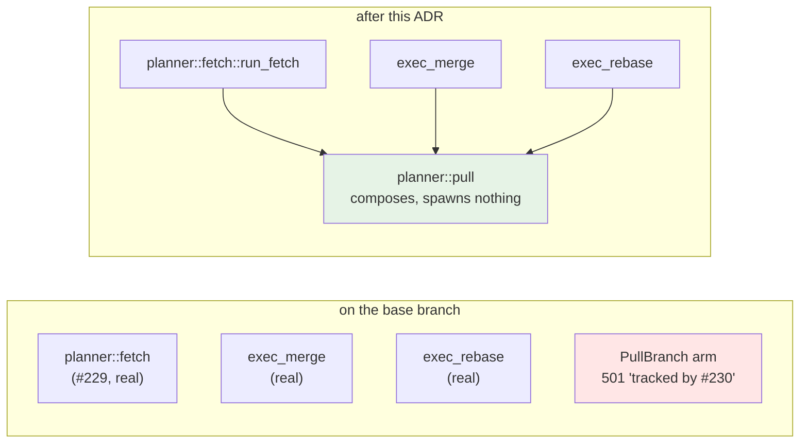
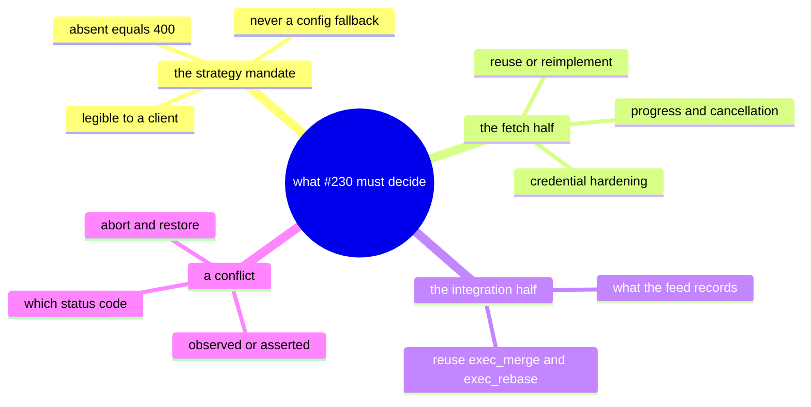
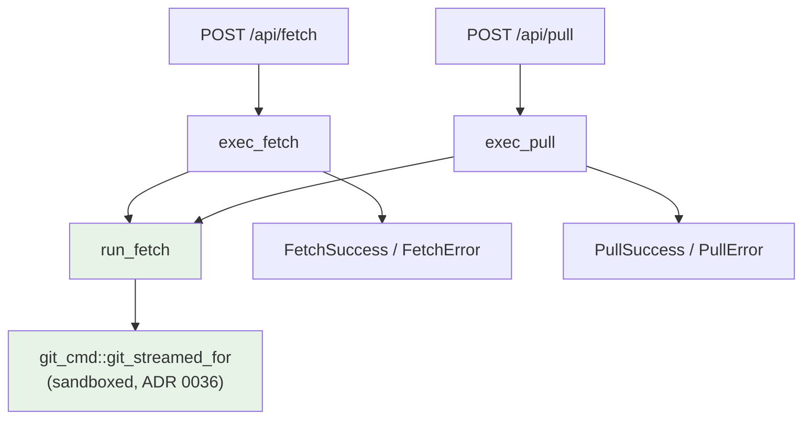
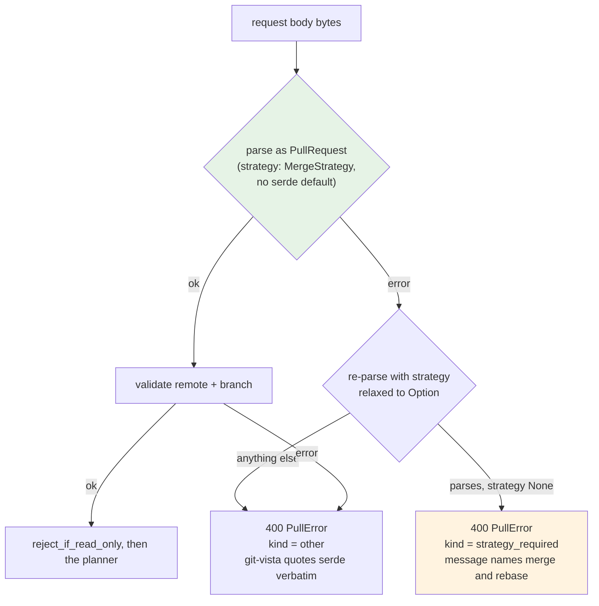
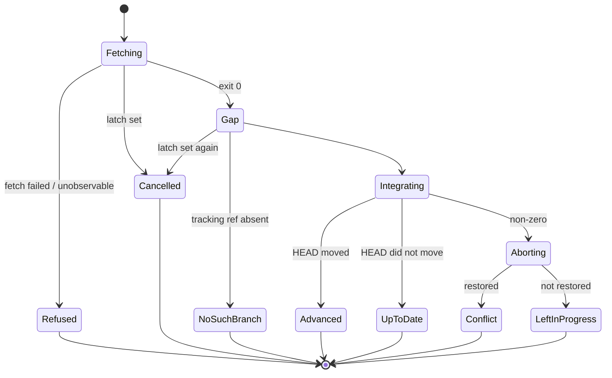
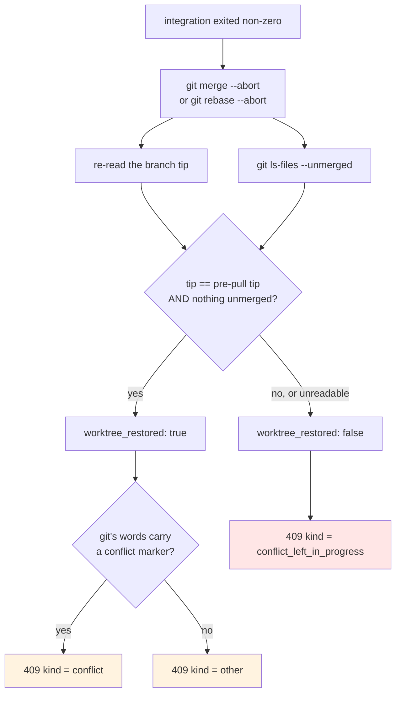
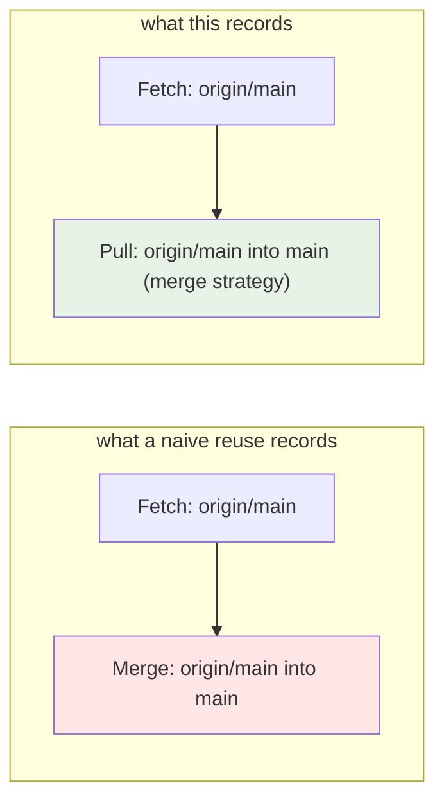

# ADR 0044 — Pull execution: one fetch in the server, a strategy the wire must state, and a conflict that is an outcome rather than an error

- **Status:** Accepted — implemented and tested.
- **Date:** 2026-08-02.
- **Milestone / issue:** M2.20d, issue #230 ("Pull: `POST /api/pull` with mandatory
  merge/rebase strategy, no silent default"), child of #73 (M2.20, "Remote operations").
  Branch `feature/m2.20d-pull-execution`, based on the unmerged
  `feature/m2.20c-fetch-execution`.
- **Supersedes / superseded by:** Nothing. **Completes** the pull half of the staging
  M2.20a (#227, ADR 0039) began — the typed `GitOperation::PullBranch` landed there with
  `planner::execute` deliberately refusing it — and is the second production consumer of
  the fetch executor ADR 0043 built.
- **Related:** [0039](0039-remote-operation-vocabulary.md) (the `PullBranch` variant, its
  `MergeStrategy` with no `Auto` arm, its `Reversible` risk class and `ResetRef` recovery),
  [0043](0043-fetch-execution.md) (the fetch executor this reuses whole — progress,
  cancellation, ref observation), [0036](0036-network-tier-exec-harness-askpass-and-redaction.md)
  (forced `core.askpass=` and byte-level redaction, inherited unchanged because the spawn
  is not duplicated), [0037](0037-observe-state-not-git-prose.md) (why "is the working tree
  usable?" is observed and only "was it a conflict?" is classified),
  [0015](0015-typed-operation-vocabulary-and-plan-schema.md) (why a two-variant enum beats
  a `bool`),
  [0016](0016-shared-write-planner.md) (the single funnel every write takes),
  `docs/SECURITY_MODEL.md`'s "Remote and Forge Credentials" section (annotated by this
  branch).

## Context

`git pull` is two operations wearing one name, and the seam between them is where the
surprises live.

**The first half is a fetch**, which this server learned to run properly in #229: streamed
transfer progress, a cancel that SIGKILLs the child, and an outcome read from
`refs/remotes/<remote>/*` before and after rather than from git's prose.

**The second half is an integration**, which this server has been able to run since long
before either: `exec_merge` behind `POST /api/merge` and `exec_rebase` behind
`POST /api/rebase`, both live, both journaling, both with their own "already up to date"
handling.

So on paper #230 is glue. Three things stop it from being glue.



**One: `git pull` chooses for you, and this app exists so it doesn't.** With no flag, git
consults `pull.rebase` and `branch.<name>.rebase` — settings that live in a file git-vista
never shows anyone. Two people pressing "Pull" on the same branch can therefore get two
different histories, and neither of them reviewed which. #227 already made that
unrepresentable in the *type* (`MergeStrategy` has no `Auto` variant and derives no
`Default`); #230 has to make it unrepresentable on the *wire and at the endpoint* too.

**Two: a pull can leave the working tree broken, and a fetch cannot.** A fetch is purely
additive — objects arrive, remote-tracking refs advance, nothing local is at risk. An
integration can stop half-applied with conflict markers in files the user was editing. A
browser-only user has no shell to run `git merge --abort` in. Whatever this endpoint
answers has to be actionable from a browser.

**Three: there must not be a second `git fetch` in this codebase.** Since ADR 0036, network
classification is load-bearing: `NetworkNeed::Remote` routes a spawn through askpass
hardening and credential redaction. A `planner::pull` that grew its own `git fetch` would
be a second place for a credential to leak from and the first one to drift.



## Decision

### 1. One `git fetch` in the server: the fetch step is split from the fetch *endpoint*

`planner::fetch::exec_fetch` did two jobs — run the fetch, and dress the result in
`/api/fetch`'s response contract. A pull needs the first and emphatically not the second:
its wire shape is `PullSuccess`/`PullError`, not `FetchSuccess`/`FetchError`.

So the module now exposes `run_fetch(repo, need, remote, endpoint) -> FetchStep`, and
`exec_fetch` is the thin mapper it always should have been:

```rust
enum FetchStep {
    Completed   { updated: Vec<RemoteRefUpdate> },
    Cancelled   { updated: Vec<RemoteRefUpdate>, output: Option<Output> },
    Failed      { kind: FetchFailureKind, message: String, updated: Vec<RemoteRefUpdate> },
    CouldNotRun { why: String },
    Unobservable{ why: String },
}
```

Every variant carries `updated` — the observed ref diff — because that is the honest answer
to "what landed?" in all of them, including the ones that failed part-way. `Unobservable`
is the exception precisely because that answer is what could not be obtained; it is the
path ADR 0043 §7 added `journal_unobserved` for, and a pull reaches it through the same
code and journals the same admission.



The reuse is proved two ways rather than asserted. `contract_suite` pins at source level
that `planner/pull.rs` contains `run_fetch(` and contains **neither** `git_streamed_for(`
nor the literal `"fetch"` — a spawn cannot reappear here without the census failing. And
`pull_suite::a_pulls_fetch_half_publishes_transfer_progress` proves it behaviourally: a
pull publishes `TransferProgress` on its operation record, which it can only do by going
through the one code path in this server that parses git's `--progress` records. A quietly
reintroduced second fetch would still fetch, still integrate, and still pass every other
test — and would publish nothing here.

### 2. The strategy mandate is enforced at the endpoint, as a 400 with an instruction

The type already refuses a strategy-less pull in Rust. The wire needs the same refusal, and
it needs to be *legible*.

**Where this endpoint diverges from every other write handler, on purpose.** Every other
one takes `Json<T>` and lets axum reject a malformed body. Axum's rejection is a **422**
whose body is a sentence about serde — so the single most important refusal this endpoint
makes would reach the client as a deserialization complaint rather than as this endpoint's
own error type. #230's whole reason to exist is that the choice is always the caller's,
stated; a feature's refusal has to be actionable.

`pull_branch` therefore takes `Bytes` and deserializes itself:



**"Did the client omit the strategy?" is answered structurally, not by matching serde's
prose.** A second, probe-only struct with `strategy: Option<MergeStrategy>` re-parses the
same bytes; if it parses *and* the field is `None`, the one thing wrong with the request is
the thing #230 requires. The probe keeps `deny_unknown_fields`, so it can only ever
**narrow** a refusal, never widen what is accepted — `{"remote":…,"branch":…,"force":true}`
fails both and gets the generic refusal, and nothing anywhere constructs a `GitOperation`
from the probe. An explicit `"strategy": null` reads as "no strategy chosen" and gets the
actionable refusal; the strict DTO still rejects the body, so nothing is defaulted — the
probe only decides which of two refusals a client reads.

**Ordering: the whole wire gate runs before `reject_if_read_only`**, the reverse of
`/api/fetch`. A malformed request is a statement about the request, not about the
repository, and a Visualize-mode session learns nothing about the repository from being
told its remote name is empty. What that buys is the thing the issue asks for by name: the
mandate is provable *at the HTTP layer*, through a real router with no process-global
selection set. Nothing is weakened — `plan_and_execute` applies the same mode gate again
before any operation executes, and `contract_suite` pins that it does.

`the_strategy_mandate_is_a_400_through_a_real_router` drives the real router, the real
`api_contract` middleware and the real handler. It asserts the 400 (explicitly: *not* the
422 a `Json<PullRequest>` handler would answer), that the body is this endpoint's
`PullError` carrying `strategy_required`, and — the leg that makes the other two mean
anything — that the *same* router with `"strategy": "merge"` added gets past this gate and
fails on the next one instead. A router that refused everything would satisfy the first two
legs.

### 3. The integration is `exec_merge` / `exec_rebase`, dispatched on the reviewed value

No merge or rebase logic is re-derived. `exec_pull` selects between the two live executors
on `strategy` alone, against `<remote>/<branch>` as a `RefName`.



Two small widenings made that honest rather than approximate:

- **`exec_merge` and `run_branch_cmd` now take a `RefName`, not a `BranchName`.**
  `origin/main` is not a local branch, and `RefName`'s own contract names it as one of the
  three shapes it exists for. `impl From<&BranchName> for RefName` makes the four
  branch-named call sites free and total — both newtypes validate with the identical
  `require_git_safe` gate, so no `BranchName` exists that `RefName` would refuse, and the
  conversion needs no `expect` on a constructor that cannot fail. Nothing about what may
  reach an argv changed; only the name of the thing being described did.

- **`IntegrationCaller`**, a two-variant enum passed to both executors, decides what the
  activity feed records. See §5.

**`git rev-parse refs/remotes/<remote>/<branch>` gates the integration**, before it runs. A
fetch that succeeded without producing the ref the caller named is
`PullFailureKind::NoSuchRemoteBranch` — an *observation* of a ref listing, not a
classification of git's "not something we can merge", so it is true under any locale. The
fetch half's work is still reported: the objects arrived, the tracking refs moved, and the
response says so.

### 4. A conflict is aborted, the abort is verified by observation, and the result is a 409



Four decisions are stacked here and each is separable.

**The abort is unconditional and lives in one place.** `exec_rebase` has aborted its own
failures since long before pull existed; `exec_merge` never has, and `/api/merge`'s
behaviour is not this slice's to change. So `exec_pull` runs the strategy's own abort after
*any* failed integration. For rebase that is a harmless second abort (it exits non-zero
against a repository with no rebase in progress and changes nothing); for merge it is the
guarantee. One site rather than one per arm, because a pull whose merge arm quietly lacked
the abort is exactly the asymmetry nobody notices until a user is stuck.

**Whether the abort worked is observed.** The branch tip is re-read and compared to the
pre-pull tip with `Obs::same_observation` (so two unreadable reads are never "the same"),
and `git ls-files --unmerged` is listed. Neither is inferred from the abort command's exit
status — `git merge --abort` exits 0 having done nothing useful in more than one real
situation. **A read that fails answers `false`**: the field exists to let a client tell a
user "nothing happened, choose again", and saying that on the strength of a read that never
happened is precisely D5's failure mode.

**Whether it was a *conflict* is classified from git's words, with `Other` as the
fallback.** This is the one heuristic in the module, and it is the advisory half only. It
has to be a heuristic: merge and rebase both exit 1 for a conflict, for "your local changes
would be overwritten", and for "not something we can merge" — and the state *after* a
successful abort carries nothing, because erasing the evidence is what an abort is. So the
same trade `fetch::classify_failure` makes (ADR 0043 §6): a documented marker set, `Other`
for anything unmatched, git's own words forwarded verbatim in every case. A mis-tag costs a
less specific hint, never a wrong explanation.

| `looks_like_conflict` | restored | `kind` | what the user should do |
|---|---|---|---|
| yes | yes | `conflict` | resolve upstream, or pull with the other strategy — nothing was lost |
| yes | no | `conflict_left_in_progress` | the working tree needs a human |
| no | no | `conflict_left_in_progress` | the working tree needs a human, whatever git called it |
| no | yes | `other` | read git's message — it refused before touching anything |

The fourth row is not a rounding error; it is the row that makes the tag mean something.
`an_integration_that_fails_for_another_reason_is_not_tagged_a_conflict` drives a dirty
working tree whose uncommitted edit the merge would overwrite: git refuses outright, with
words that carry no conflict marker, and the response says `other`. Without that leg,
`looks_like_conflict` could return `true` unconditionally — or not exist at all — and the
conflict test would still pass.

**409, never 500.** The server did not break; the histories disagree. The registry derives
`OperationState::Failed` from any non-2xx, so the operation is correctly not `Succeeded`,
and a client gets a state it can act on rather than an apology.

### 5. The feed records the operation the user approved, not the git command that ran it

A pull's integration half runs `git merge` or `git rebase`. A user who pressed "Pull" never
asked for a merge. A feed showing `Fetch` + `Merge` for one approved `PullBranch` describes
an operation nobody submitted — and its undo hint would offer to undo half of it.

`IntegrationCaller::{Direct, Pull(MergeStrategy)}` is threaded into both executors. `Direct`
produces the exact wording every existing entry already has, so `/api/merge` and
`/api/rebase` are byte-identical to before. `Pull(s)` produces **one**
`ActivityKind::Pull` entry, replacing rather than accompanying it:

> pulled ‘origin/main’ into ‘main’ (merge strategy)

A two-variant enum rather than a `bool` for ADR 0015's reason and one more: the `Pull` arm
has to *carry* the strategy, which a flag could not.



The fetch half's per-ref `Fetch` entries stay: a pull really does move remote-tracking
refs, and that is a different fact from the integration. What does *not* appear is an
integration entry when nothing was integrated — an up-to-date pull journals no `Pull`, and
a conflicted-and-aborted pull journals no `Pull` either, because nothing happened to the
branch and an event claiming otherwise would offer an undo for a commit that does not
exist.

The generation bump is inherited, not re-done: `plan_and_execute_tracked` re-reads the
generation after every operation. An executor that also bumped it would be a second source
of truth for a value that must have exactly one.

### 6. `advanced` is an observation, and failing to observe refuses the pull

`PullSuccess::advanced` answers "did the pull change anything?" — the question the response
exists for. It is computed from the branch tip before and after, not from git's prose and
not from the sub-executor's sentence.

The pre-pull tip is `observed.head_tip`: the value the plan was built against and
`enforce_fresh` re-verified under the repository guard, which the fetch half cannot have
moved (a fetch writes only `refs/remotes/*`). Reusing it keeps one source of truth with
`exec_merge`/`exec_rebase`, which compute their own "already up to date" answers from the
same value. **If either side is `Obs::Unknown`, the pull refuses** rather than integrating
and then guessing.

### 7. One `Box::pin`, and why it is load-bearing

Adding a single `.await` frame to the fetch path — `exec_fetch` awaiting `run_fetch` — took
the fetch suite from green to `fatal runtime error: stack overflow`. The cause was
measurable and had been latent since #229: `git_cmd::git_streamed_for`'s future is ~66 KiB,
and every caller that awaits it inline carries a copy in its own frame, so the whole
`plan_and_execute_in` state machine was **68,104 bytes**. One `Box::pin` in `planner::fetch`
took it to **under 4 KiB**.

`the_planner_pipelines_future_stays_small_enough_for_an_ordinary_stack` pins it with a
16 KiB budget — four times today's value, so ordinary growth never trips it while the
68 KiB regression could not slip through. A size assertion rather than a comment, because
the failure mode is invisible until it is a SIGABRT in an unrelated test: nothing about
awaiting a large future looks wrong at the call site, and the cost lands on whoever happens
to be deepest on the stack.

## What this reused from ADR 0043 versus what is new

| Concern | Reused whole | New here |
|---|---|---|
| `git fetch` spawn, sandbox tier, askpass hardening, redaction | ✅ `run_fetch` → `git_streamed_for` | — |
| Transfer progress parsing and publication | ✅ | — |
| Cancellation during transfer | ✅ | a second latch read between the halves (§8) |
| Ref observation, `journal_unobserved` | ✅ | — |
| Fetch failure taxonomy | ✅ | a total, literal-table mapping into `PullFailureKind` |
| Merge / rebase execution | ✅ `exec_merge` / `exec_rebase` | `IntegrationCaller`; `RefName` targets |
| Conflict abort + restoration check | — | all of it |
| `NoSuchRemoteBranch` observation | — | all of it |
| Wire DTOs | — | `PullRequest` / `PullSuccess` / `PullError` / `PullFailureKind` |
| Endpoint-owned body parsing | — | all of it (§2) |

## Alternatives considered, and why they lost

### Letting `Json<PullRequest>` reject the strategy-less body

The path of least resistance and consistent with every other handler. Rejected because the
resulting refusal is a **422** carrying a sentence about serde, not a `PullError` and not
the `400` the issue asks for — and a client cannot branch on it to prompt for a strategy.
The endpoint whose entire purpose is refusing an unstated choice is the one endpoint where
that refusal must be first-class. Cost accepted: one handler that parses its own body,
documented at its definition.

### Matching serde's error text to detect the missing field

Would have kept `Json<T>` *and* produced a specific tag. Rejected: it makes the endpoint's
headline behaviour rest on a string comparison against a dependency's prose, which is the
exact failure this repository has ADR 0037 about. The relaxed-probe re-parse answers the
same question structurally and cannot silently start accepting anything, because it keeps
`deny_unknown_fields` and constructs no operation.

### A `MergeStrategy::Auto` variant that resolves `pull.rebase` at execution time

The shape `git pull` itself has. Rejected in #227 and re-rejected here: the value would be
one the plan's reviewer never saw, read out of a file this app never shows, and the plan's
`OperationHash` would bind a choice that had not been made yet. Two users on one branch
would get two histories from one approved plan. There is no arm to add it to and no default
to fall back on — that is the feature.

### Re-running `git pull --no-rebase` / `--rebase` as one command

Literally what the issue's title describes, and one spawn instead of two. Rejected on three
counts. It would be a **second `git fetch` in the codebase** wearing a different name — the
one thing §1 exists to prevent, and a second surface for ADR 0036's askpass hardening and
redaction to drift on. It would forfeit the progress and cancellation machinery, since
those live in the fetch executor. And it would make the fetch-succeeded /
integration-failed distinction unobservable: `git pull` reports one exit status for two
operations, so "the objects arrived, only the merge failed" — the fact that makes "retry
with the other strategy" free — could not be stated.

### A widened `/api/fetch` with an optional `integrate` field

One endpoint, one DTO. Rejected: fetch is `RiskLevel::Safe` with `RecoveryStrategy::NotNeeded`
and pull is `Reversible` with `ResetRef`, so a shared body would let one request shape
carry two different risk classes past a reviewer. And the mandatory field would have to be
optional to keep fetch working — which is the silent default, reintroduced through the
request shape.

### Reporting a conflict as a `500`

Rejected flatly. Nothing broke. A `500` tells a user the server is faulty and tells a
client not to show a remedy, when the remedy — resolve upstream, or pull with the other
strategy — is the entire content of the response.

### Leaving a conflicted pull *unaborted* so the user can resolve it in place

Defensible for a desktop git client, and it is what `git pull` itself does. Rejected for
this one: git-vista's user is on an iPad in Safari with no shell, and this app has no
conflict-resolution UI. Leaving the working tree mid-merge would strand them in a state
only a terminal can leave. `PullFailureKind::ConflictLeftInProgress` exists for the case
where the abort *fails* — and it is deliberately a different tag, because "nothing
happened, choose again" and "your working tree needs attention" demand opposite things of
the user. When a conflict-resolution surface exists, this decision is worth revisiting; the
typed field is what makes revisiting it a wire-compatible addition rather than a break.

### Deriving the fetch → pull failure mapping instead of writing it out

`PullFailureKind` could have embedded `FetchFailureKind`. Rejected: the two vocabularies are
genuinely different — a pull has failures a fetch cannot have — and a nested enum on the
wire is harder for a client to switch on than a flat one. The cost is a five-row mapping,
written as a literal table in the test rather than asserted by calling the function that
defines it, so a sixth fetch kind fails the exhaustive match at compile time *and* leaves
the census stale.

## Consequences

**Good.**

- `POST /api/pull` executes, with progress and cancellation inherited rather than rebuilt.
- The no-silent-default posture is now enforced at three layers: the type (no `Auto`, no
  `Default`), the wire (no `serde(default)`), and the endpoint (a `400` naming both legal
  values, proved through a real router).
- A conflicted pull leaves a browser-only user with a clean working tree and a sentence
  they can act on, and says which of the two conflict states they are in.
- The activity feed describes pulls as pulls.
- The pipeline's future shrank 19×, fixing a latent stack-overflow hazard that predated
  this slice.

**Costs and open edges, stated plainly.**

- **The between-halves cancel check is not covered behaviourally.** Reaching it needs a
  cancel that lands after `git fetch` exits and before `git merge` spawns; every way to
  arrange that is a timing race, and a cancel landing a moment earlier is caught by
  `git_streamed_for` instead. Verified by mutation: deleting the check leaves the suite
  green. It stays as defense in depth, and the gap is recorded here, in `planner::pull`, and
  in `contract_suite` rather than left for a reader to discover.
- **A cancel during the integration is not honoured**, and `honours_cancellation` says so:
  `git merge`/`git rebase` are millisecond-scale local commands, and interrupting one is
  how a repository is left half-integrated. The promise is narrower than fetch's on purpose.
- **`looks_like_conflict` is locale-dependent**, inheriting ADR 0043's accepted gap for the
  same reason (`SandboxedCommand` exposes no `env` setter by construction, so `LC_ALL=C`
  cannot be forced). Under a non-English git a genuine conflict degrades to
  `PullFailureKind::Other` with git's own words — a less specific tag, never a wrong
  working-tree claim, because that half is observed.
- **No `--ff-only`, no `--autostash`, no refspec.** `PullBranch` has no field for any of
  them, and a flag with nowhere to land in the typed operation is a flag the plan's reviewer
  never sees and the plan's hash never binds.
- **Every non-2xx body is nested inside the `ApiError` envelope** that
  `middleware::api_contract` wraps non-JSON 4xx/5xx responses in. That is the server-wide
  convention (`/api/fetch` and `/api/amend-commit` are identical) rather than something
  this endpoint chose; the HTTP-layer test unwraps it explicitly so the nesting is recorded
  rather than assumed.
- **No frontend.** `/api/pull` has no caller in the SPA yet; that is a later M2.20 slice.
  The route is registered, classified in the pinned authz table, and reachable by any
  authenticated client.

---

**Signed:** thomas2025 · 2026-08-02T18:45:00-04:00
