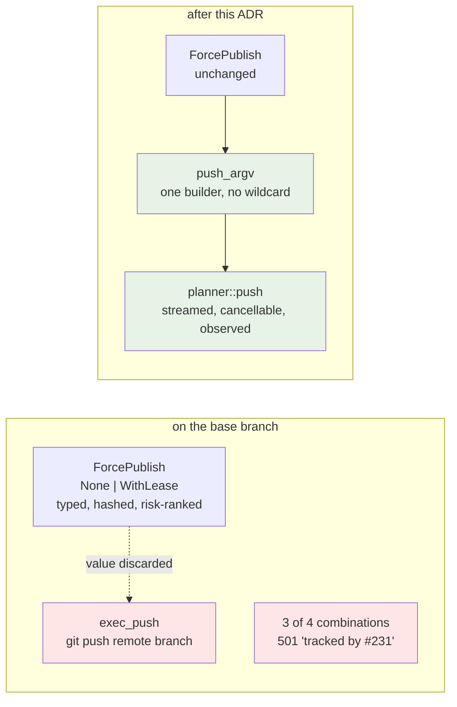
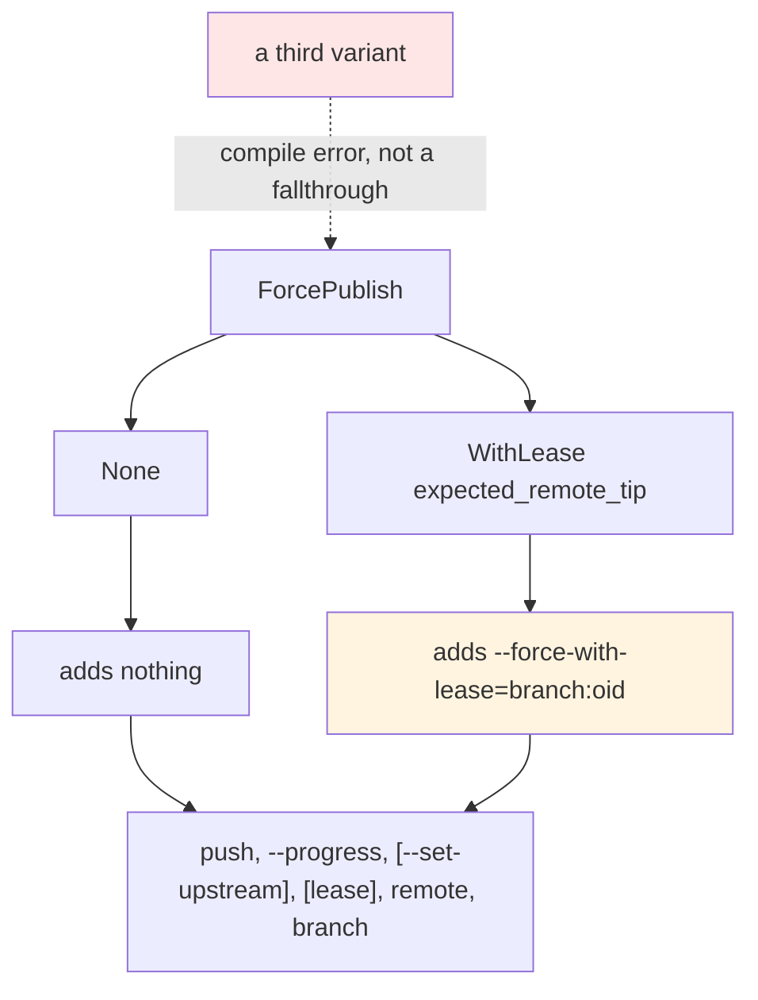
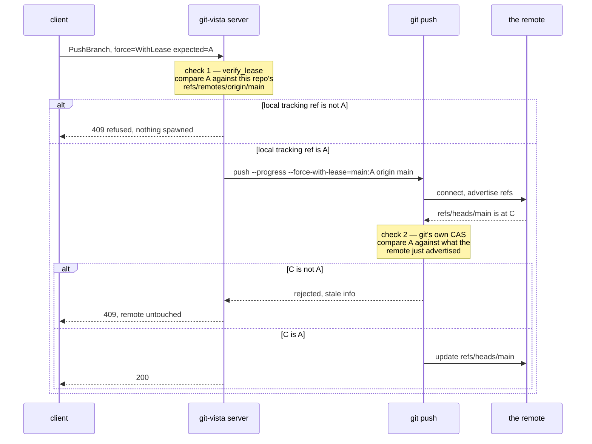
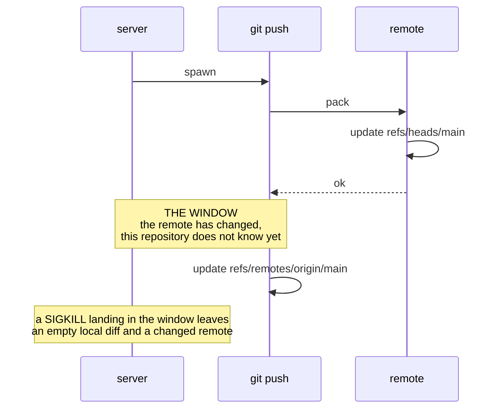
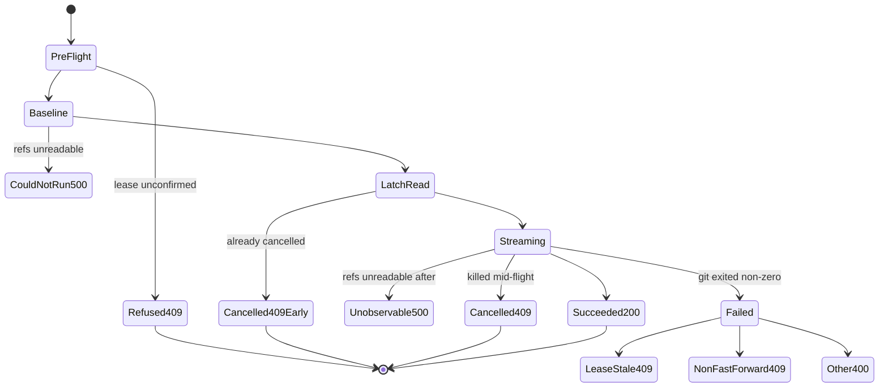
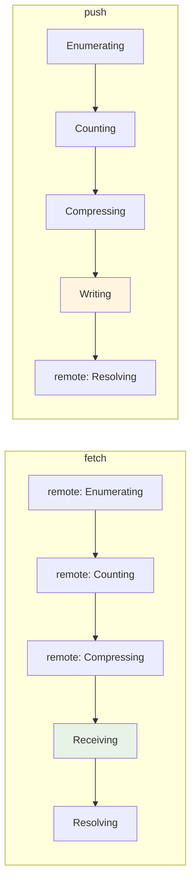
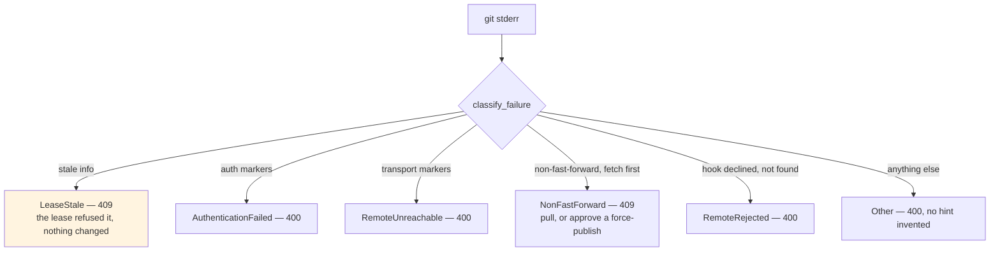
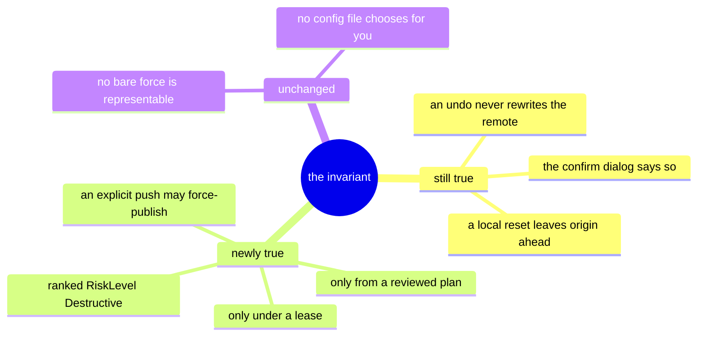
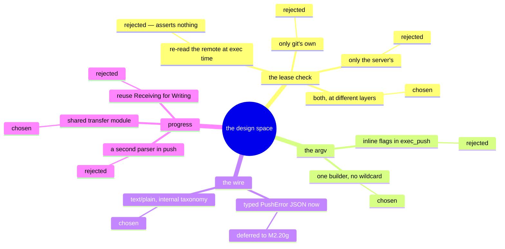
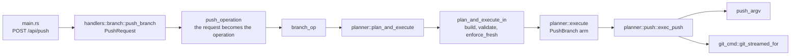

# ADR 0045 — Push execution: a force that cannot be built, a lease checked by two parties, and a cancel that refuses to reassure

- **Status:** Accepted — implemented and tested.
- **Date:** 2026-08-02.
- **Milestone / issue:** M2.20e, issue #231 ("Push: force-with-lease,
  `--set-upstream`, progress/cancellation, and the never-force-pushes wording fix"),
  child of #73 (M2.20, "Remote operations"). Branch
  `feature/m2.20e-push-execution`, based on the unmerged
  `feature/m2.20d-pull-execution`.
- **Supersedes / superseded by:** Nothing. **Completes** the push half of the staging
  M2.20a (#227, ADR 0039) began — the widened `GitOperation::PushBranch` landed there
  with `planner::execute` refusing three of its four combinations with `501` — and
  closes the remote trio ADR 0043 (fetch) and ADR 0044 (pull) opened.
- **Related:** [0039](0039-remote-operation-vocabulary.md) (the `ForcePublish` enum with
  no unguarded variant, the `Precondition::RefAt` lease, the `Destructive` risk class),
  [0043](0043-fetch-execution.md) (the streaming spawn, the progress parser and the
  cancellation latch this reuses whole),
  [0044](0044-pull-execution.md) (the "one spawn, no second copy" posture applied to a
  different pair of halves),
  [0036](0036-network-tier-exec-harness-askpass-and-redaction.md) (forced
  `-c core.askpass=` and byte-level redaction, inherited unchanged because the spawn is
  not duplicated),
  [0037](0037-observe-state-not-git-prose.md) (why the outcome is read from refs and only
  the failure *tag* is classified),
  [0018](0018-plan-staleness-enforcement.md) (the staleness gate this
  executor's own lease check deliberately does not rely on),
  [0016](0016-shared-write-planner.md) (the single funnel every write takes),
  `docs/SECURITY_MODEL.md`'s "Remote and Forge Credentials" and "Operation Risk Classes"
  sections (both annotated by this branch).

---

## Context

Everything else this server does can be undone from this machine. A push cannot. It is
the one operation whose effect lands somewhere nobody here controls, and — in its
force-with-lease form — the one that can make **another person's commits unreachable**.

Three things were true on the base branch, and each of them mattered differently.

**The type was already right.** #227 gave `PushBranch` a `force: ForcePublish` field
whose enum has exactly two variants, `None` and `WithLease { expected_remote_tip }`, and
no third. A bare `git push --force` is not expressible in Rust and not deserializable off
the wire. `planner::shape` turns a lease into a live `Precondition::RefAt` on
`refs/remotes/<remote>/<branch>` and raises the plan's risk to `Destructive`.

**The executor was not.** `exec_push` ran `git push <remote> <branch>` — no `--progress`,
no `--set-upstream`, no `--force-with-lease` — and **ignored the `force` value entirely**.
That was deliberate and correct for #227: rather than silently downgrade a force the user
had approved, `execute` matched only the one combination it could honour and refused the
other three with `501`. But it left the capability as a type nobody could reach.

**And the prose had gone stale.** Three places in the codebase told the user "git-vista
never force-pushes". The day `ForcePublish::WithLease` shipped, that sentence stopped
being true as written — while the invariant it was actually describing (an *undo* never
rewrites the remote) remained perfectly true and worth stating.

So this slice is not "add two flags". It is: carry a guarantee that currently stops at the
type boundary all the way through to an argv, and be honest — in the response, the
journal and the docs — about the one thing that changed.

---

## Decisions

### D1 — There is exactly one push argv builder, and no path through it reaches an unguarded force

`planner::push::push_argv` is the only function in this server that constructs a push
command line. Its `match` over `ForcePublish` has **no wildcard arm**, and the one arm
that emits a force flag emits `--force-with-lease=<branch>:<oid>`.

Why a function rather than three `if`s inline: the failure mode of the inline version is
quiet. A future `ForcePublish` variant falling through to "no flag" silently *downgrades*
a force the user approved; a fallback written the other way silently *upgrades* a
fast-forward. Extracting the builder makes the property assertable over the entire input
space without spawning anything, and the wildcard-free `match` turns a third variant into
a build failure rather than a judgement call.

The assertion is deliberately precise, because the naive one is wrong: `--force` **does**
appear in the argv, as the prefix of `--force-with-lease=`. So the property is *any
element beginning `--force` must begin `--force-with-lease=`, and `-f` must never appear
at all* (`push::tests::no_push_argv_can_carry_a_bare_force`). A source-level tripwire adds
the half a function's own tests cannot see — that no *other* module builds a push argv:
`planner.rs` must no longer contain the literal `"push"`, and `planner/push.rs`'s
production half (the source above `#[cfg(test)]`) must contain the leased flag and none of
the unguarded spellings
(`contract_suite::only_planner_push_builds_a_push_argv_and_it_can_only_build_a_leased_force`).

### D2 — The lease is checked twice, by two parties, against two different things

This is the decision the rest of the slice hangs off, and the temptation was to pick one.

**Neither check subsumes the other**, and the two failures they catch are genuinely
different:

- **Check 1 catches a tip that never matched** — a stale client, a cached plan, a forged
  request body. It runs before any socket exists, so nothing is connected to, no
  credential is offered, and the refusal is a sentence naming both oids rather than git's
  `! [rejected] … (stale info)`.
- **Check 2 catches the case that matters most** — someone else pushed between the plan
  being reviewed and it being submitted. This repository's remote-tracking ref is a
  *local cache*; it still holds the reviewed tip because nothing has fetched. Only the
  remote's own advertisement can see the other party's commit, so only git can refuse
  this one.

A version with only check 1 would hand an unverified oid to git anyway in the common case
and would be worthless against the concurrent-push case. A version with only check 2 would
open a socket for a request the server could already tell was wrong.

**Why check 1 is not just `enforce_fresh`.** ADR 0018's staleness gate already re-verifies
the lease's `Precondition::RefAt` — **but only if it held at build time**, by design: a
precondition that already failed when the plan was built is deliberately left to the
executor's own guard so refusal wording stays per-operation. For every other operation
that guard is git refusing. For a lease push it has to be this function, because
"the precondition never held" is *exactly* the forged/stale case, and letting it fall
through to `--force-with-lease` unchecked is the hole.

### D3 — A lease that cannot be confirmed refuses; it never degrades to an unguarded force

Two ways the pre-flight can fail to confirm, and both refuse `409`:

| Live `refs/remotes/<remote>/<branch>` | Decision |
|---|---|
| holds the reviewed oid | proceed |
| holds a **different** oid | refuse — name both oids, say a fetch is the remedy |
| **does not exist** | refuse — the tip cannot be confirmed |
| **cannot be read** (git did not run) | refuse `500` — D5's rule: an unread ref is evidence about nothing |

The third row is the one that would be easiest to write wrong. Treating "no tracking ref"
as "no lease to check" reads naturally and turns a lease into an unguarded force. It is
pinned by its own test leg.

### D4 — What a push did is observed from refs — and a cancelled push may not claim the remote is unchanged

`refs/remotes/<remote>/*` is listed before and after, and the difference is the answer, for
success, failure and cancellation alike. That is ADR 0037 applied to a push, and it is
cheap here because git updates the remote-tracking ref *only* when the remote reports the
update accepted. It is also why the shared observation helpers moved into
`planner::transfer` rather than being copied.

But the mirror image of ADR 0043's cancelled-fetch guarantee **does not hold**, and
pretending otherwise would be the worst kind of comfortable lie:

A cancelled *fetch* can honestly say nothing arrived: the only machine involved is this
one. A cancelled *push* cannot. So the terminal message states what was observed — the
local remote-tracking ref did or did not move — and explicitly declines to conclude
anything about the remote from it, ending with "Fetch to see where the remote actually
is." `honours_cancellation(PushBranch)` is therefore a promise that *the transfer stops*,
never that nothing was published.

### D5 — `--set-upstream` is *reported* only when it is *observed*

The flag says what was asked for. After a successful push that asked for one, the executor
reads `<branch>@{upstream}` back out of the repository and the success sentence claims an
upstream only if git actually recorded one; otherwise it says so.

This looks like belt-and-braces until you notice what the alternative fails at: a message
built from the request would say "upstream set" for a git that quietly did not, and no test
that only checks the sentence could tell the difference. The observation has its own paired
positive/negative test against a real repository, and a mutation that replaced it with the
plausible constant `origin/<branch>` is caught there and nowhere else.

(A footnote earned the hard way: `git rev-parse --abbrev-ref --quiet <b>@{upstream}` exits
128 for an unresolvable upstream but **echoes the spec back on stdout** while doing it. The
flag is not used, so a failure leaves stdout empty.)

### D6 — One progress parser for both directions, and `Writing` is a new tag rather than a reuse of `Receiving`

A fetch and a push print the same phase names for the work each side does; only which side
does which work differs.

So `parse_progress` moved out of `planner::fetch` into `planner::transfer` and both
executors call it. Two copies would drift, and nothing fails loudly when a progress bar is
subtly wrong — which is precisely why it needs one owner.

`Writing objects:` is the one record shape a push prints and a fetch never does. Before
this slice the parser did not know it, so a pushing user's progress stopped at
`Compressing` and the whole transfer — the part that takes the time — reported nothing.
It gets its **own** `TransferPhase::Writing` rather than being folded into `Receiving`,
because a UI saying "receiving" while a user pushes is telling them the wrong story about
which way their data is going.

### D7 — `/api/push` keeps its `text/plain` contract; the failure taxonomy stays server-internal until the UI lands

Fetch and pull answer typed JSON (`FetchError`, `PullError`). Push does not, and that is a
decision rather than an omission: `/api/push` has always answered `text/plain`, **the live
frontend renders that body to the user verbatim**, and no client parses it. Promoting it to
JSON in this slice would put raw JSON on an iPad screen for zero benefit, because the
client that would parse it is M2.20g's (#232) — the same slice that designs the force-push
confirmation ceremony.

The classification is still real and still load-bearing: an internal `PushFailure` enum
picks the status code and the actionable sentence appended to git's own words.

Ordering is deliberate: `stale info` is checked **first**, because a rejected lease also
prints `failed to push some refs`, and "your lease lost and the remote is untouched" is the
actionable half. `409` for the two "the remote moved under you" cases matches every other
staleness refusal in this server and matches the remedy (fetch, look, resubmit).

### D8 — The request may default; the reviewed operation may not

`PushRequest` gives `set_upstream` and `force` serde defaults, so `{"branch": "main"}` —
every client written before this slice, including the live frontend — keeps getting a plain
fast-forward push, byte for byte. That defaulting lives in the request and **stops there**:
`ForcePublish` still derives no `Default` and `GitOperation::PushBranch`'s fields still
carry no `#[serde(default)]`, so the handler's `force.unwrap_or(ForcePublish::None)` is a
construction site stating its posture out loud, exactly as #227 intended.

The rule that makes this safe to allow at all: **a default may only point at less
capability.** Absent means "do less", never "force".

### D9 — "Never force-pushes" becomes "no undo force-pushes"

Three sites said git-vista never force-pushes. The invariant they were describing is real,
narrower, and now has to be said precisely, because the app *can* force-publish.

Fixed at `git-vista-core/src/activity.rs` (the `Undoable` doc and the reset-undo comment)
and `git-vista/src/dialogs/confirm.rs` (the user-visible undo warning, which now reads
"an undo never force-pushes … Rewriting what origin has is a separate, explicit
force-publish"). `docs/RELEASE_GATES.md` gained a clause distinguishing *this repository's*
branch protection from anything the app does.

The issue also named `git-vista-protocol/src/plan.rs:242` as a fourth site. **That citation
is wrong on this branch, not merely line-drifted**: the file contains no such text
anywhere, and `RiskLevel::Remote`'s doc — the comment the issue meant — already says the
correct thing ("A force push is *not* this tag: `git-vista` cannot express an unguarded
force at all"). It was left alone.

---

## Alternatives considered

**Rely on git's `--force-with-lease` alone; add no server check.** Rejected. Git's check is
authoritative about the remote and cannot be replaced — but it only runs *after* a socket
is open and a credential has been offered, and it says nothing about a tip this server
could already see was wrong. A forged `expected_remote_tip` would reach a real remote
before being refused, and the refusal a user reads would be
`! [rejected] main -> main (stale info)` rather than a sentence naming what did not match.

**Rely on the server's check alone; drop `--force-with-lease` and use `--force`.**
Rejected, emphatically, and it is worth writing down *why* it is tempting: the server check
looks like it does the same job, and the argv would be simpler. It is not the same job. The
remote-tracking ref is a local cache of what this repository last saw; the whole scenario
force-with-lease exists for — a colleague pushing between review and submit — is invisible
to it. This alternative is exactly the "force push with a reassuring label" `ForcePublish`
was designed to make unrepresentable. The mutation that implements it
(`--force-with-lease=…` → `--force`) is caught by four separate tests, one of which is a
behavioural test asserting the other party's commit is still on the remote.

**Re-read the remote at execution time and lease against *that*.** Rejected. It would
assert "the remote has not moved since a millisecond ago", which is always true and
protects nobody. The value that makes a lease mean anything is the one the *user reviewed*,
which is why it lives in the operation and is bound by the plan's hash. (This is ADR 0039's
reasoning, restated because it is exactly what an implementer of the execution layer is
tempted to "fix".)

**Let `enforce_fresh`'s `Precondition::RefAt` be the only server-side lease check.**
Rejected — see D2. It is skipped precisely in the case that needs it.

**Build the flags inline in `exec_push`.** Rejected — see D1. The property becomes
unassertable over the input space, and a future variant fails quietly.

**Promote the failure taxonomy to a typed JSON body now.** Deferred, not rejected — see
D7. It ships with the client that parses it.

**Give push its own progress parser.** Rejected — ADR 0044's D1 reasoning, applied to a
parser rather than a spawn. Two copies of a vocabulary that must match git's output byte
for byte will drift, and a wrong progress bar fails silently.

**Fold `Writing` into `Receiving` as a generic "transferring" phase.** Rejected. The tag's
whole job is to say what git is doing; a UI that says "receiving" during a push is wrong in
the direction users notice.

**Journal every successful push, as the old executor did.** Rejected. The old `exec_push`
journaled unconditionally on exit 0, so an "Everything up-to-date" push left an entry
claiming a change. Journaling per *observed moved ref* matches `planner::fetch` and makes
the feed auditable on the day someone is trying to understand a force-publish. A paired
negative pins that an up-to-date push journals nothing.

**Require `set_upstream` and `force` in `PushRequest` with no defaults, mirroring the
operation vocabulary.** Rejected. It would break every existing client for no safety gain:
the guarantee #227 bought is about the *reviewed operation*, which still has no defaults,
and a request default that points at less capability cannot smuggle a force past anybody.

---

## Consequences

**Good.**

- The capability `ForcePublish` has described since #227 is reachable, and the guarantee it
  encodes now survives all the way to an argv rather than stopping at the type boundary.
- A push reports live transfer progress, including the phase where its objects actually
  leave the host, and can be cancelled — the last of the three remote operations to get
  both.
- The remote trio share one spawn, one progress parser, one ref-observation helper, and one
  set of #228 hardening. There is no second place for a credential to leak from.
- The activity feed distinguishes "pushed", "pushed with `--set-upstream`" and
  "force-published (lease) over `<tip>`", which is the difference a reader needs on the one
  day they care.

**Costs and things a reader should know.**

- **`/api/push` answers prose, not a typed body.** A client cannot branch on the failure
  kind yet. Deliberate (D7), and #232's to close.
- **A cancelled push cannot promise the remote is unchanged** (D4). The message says so;
  there is no way to make it stronger without a round trip this server has stopped making.
- **The kill reaches the direct child only.** ADR 0043's grandchild limitation is inherited
  unchanged: a transport helper git spawned may briefly outlive the SIGKILL.
- **Progress parsing is English-only.** git's phase names are gettext-translated and
  `SandboxedCommand` exposes no `env` setter by construction (#228's C10 hazard #1), so
  `LC_ALL=C` cannot be forced here. Under a non-English locale a push degrades to no
  progress bar, never a wrong one — ADR 0043's accepted gap, inherited.
- **Push tests need a real `git://` remote.** A filesystem-path remote cannot receive a push
  under the sandbox at all (receive-pack's quarantine migration is a cross-directory rename
  and the shim withholds `LANDLOCK_ACCESS_FS_REFER`), so the behavioural suite spins a
  `git daemon` on the arbitrated port 9418 and serializes on `test_ports::PortClaim`. This
  is a real cost in test wall-clock, paid because the alternative is not testing a push.
- **The two ref listings run in the operation's tier, not the tightest one that would do.**
  `transfer::remote_tracking_refs` takes the caller's `NetworkNeed` and a push passes
  `Remote`, so the `git for-each-ref` before and after the transfer lands in `Tier::Network`
  — no bwrap namespaces, git's ports reachable — where `NetworkNeed::Local` would put it in
  `Tier::Strict`. This is inherited behaviour, not something #231 introduced: the helper came
  from `planner::fetch` (#229) already shaped this way, and a fetch and a pull do the same.
  It is reported rather than changed for two reasons. The exposure is not the one ADR 0044 §4
  found on the pull path — that was about **hooks**, which `HookMode::Run` executes in every
  tier, and `for-each-ref` runs none and execs nothing. And tightening it would change fetch
  and pull as well, on a code path with no probe: the namespace test ADR 0044 uses works
  because a hook can `readlink /proc/self/ns/net`, and a command that runs no hooks offers no
  such observation, so the change could not be proved to have happened. Worth doing as its
  own slice, with `need` removed from the helper's signature the way #230 removed it from
  `unmerged_paths` — a structural proof rather than a test — not smuggled in here untested.

---

## Testing, and how each claim was made to fail

Every mechanism below was broken on purpose and the run repeated; the named test is the one
that went red. A test that stays green when its mechanism is deleted is worse than no test,
and this repository has now found ten of those.

| Mutation | Caught by |
|---|---|
| the lease flag is never built | `push::only_a_lease_push_builds_a_force_flag_and_it_names_the_reviewed_tip`; `push_suite::a_correct_lease_force_publishes_and_a_plain_push_of_the_same_branch_does_not` |
| `--force-with-lease=…` replaced by a bare `--force` | `push::no_push_argv_can_carry_a_bare_force`; `contract_suite::only_planner_push_builds_a_push_argv_and_it_can_only_build_a_leased_force`; **`push_suite::a_lease_lost_to_a_concurrent_push_is_refused_and_the_remote_keeps_the_other_commit`** (the behavioural one — the other party's commit is destroyed) |
| the pre-flight lease check is removed | `push_suite::a_lease_tip_that_does_not_match_the_tracking_ref_never_reaches_the_remote`; `contract_suite::every_push_combination_reaches_a_real_executor` |
| `--set-upstream` is never built | `push::set_upstream_is_present_exactly_when_requested`; `push_suite::set_upstream_is_recorded_and_only_when_asked` |
| the `Writing` phase is dropped from the parser | `transfer::every_real_push_progress_record_shape_parses`; `transfer::writing_and_receiving_are_not_the_same_phase`; `push_suite::a_push_publishes_transfer_progress_including_the_writing_phase` |
| the journal write is removed | `push_suite::a_fast_forward_push_reaches_the_remote_and_journals_the_mode` |
| `child.start_kill()` is deleted | `push_suite::cancelling_a_running_push_kills_the_child_and_the_remote_does_not_move`; `push_suite::a_cancelled_push_stream_leaves_a_signalled_child_not_an_exited_one` |
| the pre-spawn cancel latch is removed | `push_suite::a_cancel_that_lands_before_execution_stops_the_push_starting` |
| `upstream_of` returns the plausible constant `origin/<branch>` | `push_suite::the_upstream_is_read_from_the_repository_not_assumed` |
| the cancelled-push message claims the remote is unchanged | `push_suite::cancelling_a_running_push_kills_the_child_and_the_remote_does_not_move` |
| **`/api/push` ignores the request's `force`** (a silent downgrade of every approved force-publish to a fast-forward) | `handlers::branch::tests::the_request_reaches_the_operation_whole`; `…::every_force_mode_the_wire_can_carry_is_exercised_by_the_mapping_table` — **added by the review round below; before it, this mutation left all ~700 tests green** |
| `/api/push` ignores the request's `set_upstream` | `handlers::branch::tests::the_request_reaches_the_operation_whole` |
| the `journal_unobserved` write is removed | `push_suite::a_push_whose_outcome_cannot_be_observed_is_journaled_as_unknown` — **added by the review round below; before it, this call had no coverage at all** |
| `TransferPhase::Writing`'s wire spelling drifts | `operation::tests::transfer_phase_wire_names_are_stable_snake_case` — **added by the review round below; the variant shipped with no pinned wire name** |

### The review round, and the three holes it found

The first pass of this slice proved `planner::push` exhaustively and left three gaps that
only mutation could surface. They are recorded here rather than quietly fixed, because the
*shape* of each is the reusable lesson.

1. **A proven executor reached through an unproven mapping.** `handlers::branch::push_branch`
   destructured `PushRequest` and built `GitOperation::PushBranch` inline, and nothing tested
   that mapping. Replacing `force.unwrap_or(ForcePublish::None)` with a bare
   `ForcePublish::None` — an endpoint that silently downgrades every approved force-publish —
   left the entire crate green. Every property `push_argv` proves is a property of a function
   that was, on that mutation, never reached with a lease. The fix is structural as well as
   test-side: the mapping moved into `push_operation`, which **consumes the request by value
   and destructures it exhaustively**, so the handler has no field left to drop, and the
   mapping is asserted against *literal* operations over the whole request space (a table
   whose right-hand side re-derived values from the request would agree with any mapping,
   including one that swapped the two flags).

2. **A journal write with no coverage.** `push::journal_unobserved` — the one exit path where
   `git push` ran and `refs/remotes/<remote>/*` could not be re-read — had no test. Deleting
   the call was invisible. That is the worst place in this slice for the feed to go quiet: a
   fetch whose outcome is unobservable can be re-observed later from this machine, and a push's
   cannot, because what changed is on the remote. `push_suite::a_push_whose_outcome_cannot_be_observed_is_journaled_as_unknown`
   fills it, using `fetch_suite`'s lever — a `reference-transaction` hook that corrupts
   `packed-refs` once the tracking-ref update commits (verified: git 2.43.0 runs that hook for
   a *push*'s tracking-ref transaction, and `for-each-ref` then exits 128 while the loose ref
   stays on disk). The premise is asserted three ways so the entry cannot be passing over an
   early failure.

3. **A new wire variant with no pinned spelling.** `TransferPhase::Writing` was added to a
   `#[serde(rename_all)]` enum whose contract test is a *list*, and a list stops covering an
   enum the day it grows. The list is now backed by a census through an exhaustive `match`, so
   a seventh variant is a compile error there, and each spelling is asserted in both
   directions — a client reads these as well as writes them.

Three structural notes about the suite itself:

- **The remote is the referee.** Every "was the remote protected?" assertion reads the bare
  repository's own `for-each-ref` / `rev-parse` / `merge-base --is-ancestor` with plain,
  unsandboxed git — never a status code, and never this repository's remote-tracking ref,
  which is a cache.
- **"Nothing was spawned" is an observed absence.** The pre-flight refusal tests use a path
  remote carrying a `pre-receive` hook that writes a sentinel file. The sentinel lives
  *inside* the served repository's tree, and that placement is load-bearing: the hook runs
  as a grandchild of the sandboxed push and inherits its Landlock ruleset, so a sentinel in
  the tempdir root cannot be written **even when the hook ran** — the first version of this
  suite had exactly that bug, and it made the assertions vacuous. The paired positive
  (`a_lease_that_matches_the_tracking_ref_is_let_through_the_pre_flight`) is what keeps it
  honest: it requires the sentinel to actually appear.
- **The force test has an anti-vacuity leg.** Before the lease push, the *same* diverged
  branch is pushed with `ForcePublish::None` and must be refused. Without it, the test would
  pass identically on a fixture where an ordinary fast-forward would have worked — proving
  nothing about forcing at all.

---

## Reachability

Not a hypothetical concern here: #228 shipped a fully-tested harness with zero production
callers, and this project has been paying attention since.

`/api/push` accepts `set_upstream` and `force` on the wire, so the lease path has a real
caller and is not code awaiting a UI. The UI *ceremony* for choosing a force-publish is
#232's; the capability is live and reachable today by any authenticated client.

**Reachability is not only "is there a caller".** The `push_operation` node above is drawn
separately because that link is where this slice's first review round found the chain
broken in a way a call-graph could not see: the caller existed, and dropped a field. A
reachability argument has to cover *what arrives*, not just *that something arrives* — which
is why the mapping is now a pure function with a literal-valued test rather than three lines
inside a handler.

---

## Annotations made by this branch

- `docs/SECURITY_MODEL.md` — "Remote and Forge Credentials" (push adds no new spawn; the
  same chokepoint, askpass hardening and redaction apply, proven by a real leaked-credential
  fixture on the push path) and "Operation Risk Classes" (the lease/CAS row moves from
  "typed, not yet executable" to executable, with both checks described).
- `docs/adr/README.md` — index row for this ADR; ADR 0039's row updated to say the force
  push is no longer unwired.

---

**Signed:** thomas2025 · 2026-08-02T16:03:35-04:00
