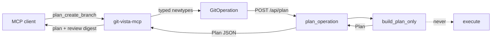
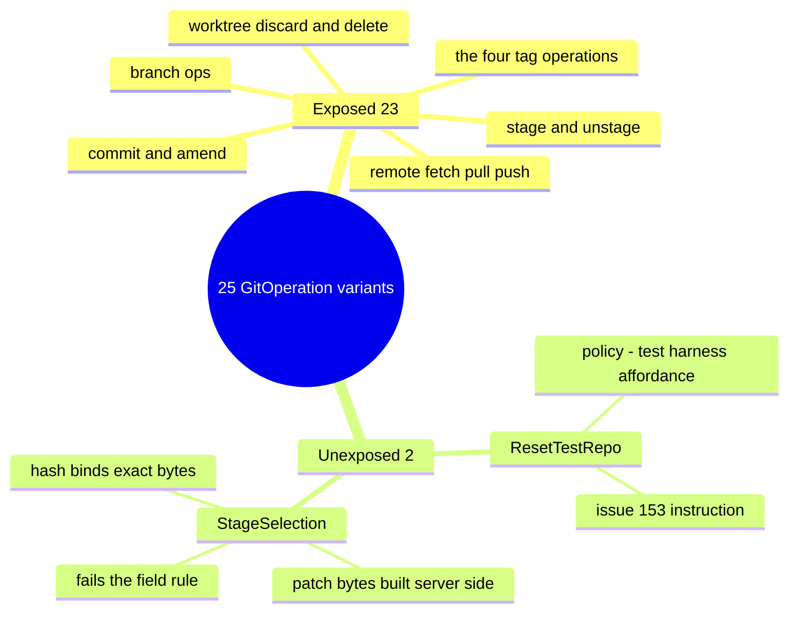
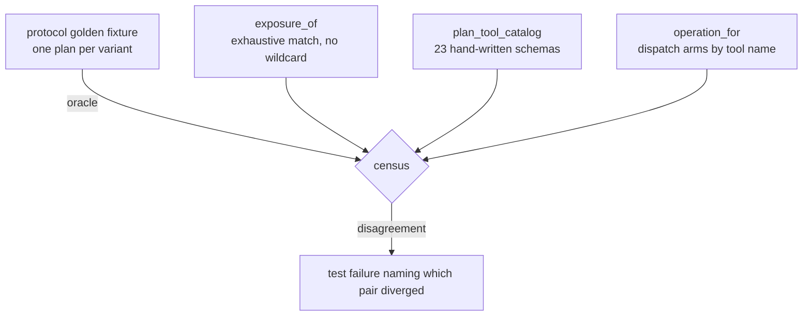
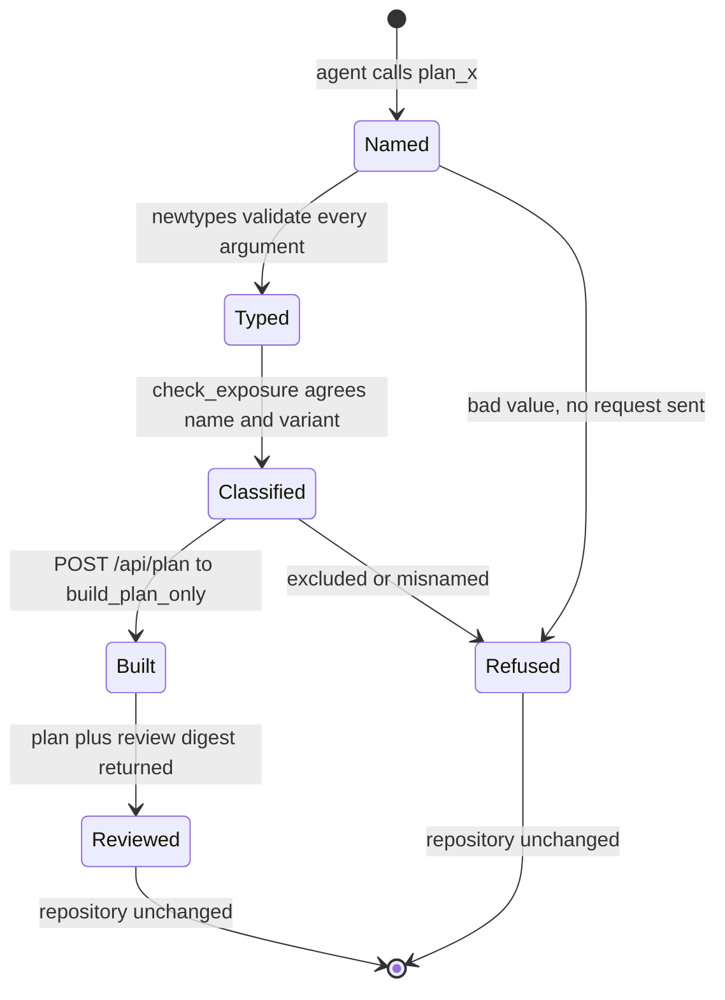

# ADR 0046 — The MCP plan-tool surface: 23 build-only tools, one endpoint, and a variant that cannot be exposed

- **Status:** Accepted — implemented and tested. The surface is **build-only**: no tool
  in it can execute anything, and `POST /api/plan` (this slice's other half) reaches
  only `planner::build_plan_only`. Submitting an approved plan is #249.
- **Date:** 2026-08-02.
- **Milestone / issue:** M2.23d, issue #248 ("MCP `plan_<operation>` tool surface,
  build-only, no execution"), sub-issue of #153. Branch
  `feature/m2.23d-mcp-plan-tools`.
- **Supersedes / superseded by:** Nothing. **Extends**
  [0042](0042-planner-build-submit-split.md) (the build/submit seam this routes the
  build half of), [0016](0016-shared-write-planner.md) (the single funnel), and
  [0005](0005-lan-view-profile.md) (why the new route is loopback-only).
- **Related:** [0015](0015-typed-operation-vocabulary-and-plan-schema.md) (the closed
  `GitOperation` vocabulary and the `Plan` wire type this surface exposes verbatim),
  [0007](0007-selection-scoped-mode.md) (the Visualize/Active gate the plan
  endpoint reuses), [0018](0018-plan-staleness-enforcement.md) (what makes handing a
  plan across a review roundtrip safe),
  [0031](0031-adr-format-alternatives-and-rejection-reasoning.md) (the alternatives
  table below).

## Context

#153's premise is that an agent should drive git-vista the way a person does: through
the same reviewed funnel, never by handing the server an argv. #245 built the stdio
bridge, #246 gave it six read tools, and #247 cut the planner into
`build_plan_only`/`submit_plan` so that "build a plan, show it to someone, execute only
what they approved" became two callable stages instead of two regions of one function.

This slice is the **first half of that roundtrip, and only the first half**. An agent
must be able to ask *what would this operation do* — its risk, its preconditions, the
refs it would move, whether the effect can be undone — and get a real answer without
anything happening to the repository. Deciding to run it is a separate act, in a
separate slice, through a separate endpoint.

Three facts about the base shaped everything below.

**`build_plan_only` was merged but unroutable.** #247 landed it marked
`#[cfg_attr(not(test), allow(dead_code))] // routed by #248` — the contract suite was
its only caller and no HTTP route reached it. #247's own scope-transfer comment moved
"register `POST /api/plan`" to this issue. So this slice owns both halves: the endpoint
and the tools that call it.

**The vocabulary is bigger than #248's text says.** The issue (and its own 2026-07-31
verification note) claims `GitOperation` has 15 variants with `ResetTestRepo` last, so
"14 of 15" get tools. Reading `crates/git-vista-protocol/src/plan.rs` on `main` shows
**25** variants: `ResetTestRepo` is 15th but ten more landed after it — `StageSelection`
(#213), `DiscardTrackedPaths`/`DeleteUntrackedPaths` (#219/#71), `AmendCommit` (M2.19a),
`FetchRemote`/`PullBranch` (M2.20a), and the four tag operations (M2.21a). The real
question was therefore about 24 candidates, not 14, and one of those ten is the variant
that turned out not to be exposable at all.

**Free-form input is the thing being designed against.** #248's binding criterion is
that no tool accepts a command string, an argv array, or a raw ref — every parameter is
one of the protocol's validating newtypes. That is not a style rule; it is the property
that makes the funnel worth having.



## Decision

### 1. One tool per exposable variant, named `plan_<wire tag>`

23 tools, each named `plan_` + the variant's own serde tag, so `CreateBranch` is
`plan_create_branch` and no second naming scheme exists to drift. Each builds exactly
one `GitOperation` and posts it to `POST /api/plan`.

The name mapping is not incidental: a test asserts every exposed variant's tool name
equals `plan_<its wire tag>`, so the catalog cannot acquire a friendly alias that a
reader then has to map back by hand.

### 2. Exposure is decided by one rule, not case by case

> **A variant is exposable exactly when every one of its fields is a validating protocol
> newtype, a `bool`, or a closed enum** — the things a client can legitimately author and
> the wire boundary can legitimately refuse.

Two variants are unexposed, for two different reasons, and both are stated in code
(`plan_tools::exposure_of`) rather than left as an absence:

- **`ResetTestRepo`** — #153's explicit instruction, restated: it restores a `gv --seed`
  fixture repository *and wipes the app journal*. It is a harness affordance, not an
  operation anyone would review and approve. It has no fields at all, so the rule above
  would have admitted it; the exclusion is a policy decision layered on top, and it says
  so.
- **`StageSelection`** — excluded *by the rule*. Its `patch: String` and
  `whole_files: Vec<String>` are not newtypes and are not client-supplied: the server
  builds them from a `PatchPlan` via `patch_build::build_selected_patch`, and the
  operation hash binds those exact bytes. A `plan_stage_selection` tool could only take
  a free-form patch string — the thing #248 forbids — and the bytes would not be the
  ones the staging gate verified. Partial staging over MCP needs a `PatchPlan`-shaped
  surface of its own; that is a different issue, noted in Consequences.



### 3. Three independent sources, censused against each other

The guard is not one list checked against itself. Three artifacts, written separately,
must agree:

1. **`exposure_of`** — an exhaustive `match` over `GitOperation` with **no wildcard
   arm**. A 26th variant fails *this crate's build* until someone classifies it. Same
   mechanism as `contract_suite::covered_by`, applied one crate over.
2. **`plan_tool_catalog()`** — 23 hand-written JSON schemas. Nothing generates these
   from `exposure_of`; each carries its own descriptions, required fields and closed
   `additionalProperties: false` object.
3. **`git-vista-protocol`'s golden fixture** (`tests/fixtures/plan_v1.json`) — one plan
   per variant, written for `plan_golden.rs` and pinned there by an unrelated test. The
   MCP crate's census reads it as an **oracle**, so the vocabulary this crate believes in
   is checked against the vocabulary the wire contract commits to, rather than this crate
   grading its own homework.



### 4. `exposure_of` is a production guard, not a test fixture

The classification is re-checked **on every live call**, in `check_exposure`: the
operation a dispatch arm just built must be the one `exposure_of` says that tool name
exposes. The dispatch arms are keyed by tool name and the classification by variant, so
this is not a tautology — a future edit that gave `ResetTestRepo` a dispatch arm would
satisfy `operation_for` and be refused here, before any request exists. Proven by
mutation: wiring `plan_delete_branch` to build `ForceDeleteBranch` is refused at runtime
with the mismatch named.

This also answers the "tested but unreachable" concern honestly. A census function with
no production caller is a type-level assertion that only tests exercise; giving it a real
job at the call boundary makes it code that runs.

### 5. `POST /api/plan`: body is a bare `GitOperation`, response is the `Plan`

No wrapper DTO, so `git-vista-protocol` grows nothing. `GitOperation` is already the
closed, internally-tagged (`"op"`) wire vocabulary whose every field is a validating
newtype — a malformed branch name, a non-hex oid, a pull with no integration strategy
are deserialize errors at the boundary. A one-field request struct would add a wire shape
to pin in the golden fixture and buy nothing. The symmetry with #249 is deliberate: this
endpoint takes an operation and answers a plan; the execute endpoint takes that plan back.

The route is registered **inside `full_routes`** — loopback only, never built on the LAN
router (ADR 0005) — and classified `SessionAndCsrf` in `route_authz`. Two independent
reasons: `security.rs` keys its gate on HTTP method, so a POST needs CSRF regardless; and
a plan is the front half of a write, not a report.

### 6. Building is refused in Visualize mode

`plan_operation` runs `reject_if_read_only()` first, exactly like every write handler. A
plan is not a read: it carries an `OperationHash` that #249's submit stage accepts as
approval for that exact mutation. Minting one against a look-only selection is the first
half of a write, and refusing at build is the earliest honest moment. See Alternatives.

### 7. The result carries the `Plan` verbatim **and** an agent-readable digest

```json
{ "plan": { ...the exact Plan DTO... }, "review": { "risk": "...", "risk_means": "...", ... } }
```

The `plan` half is the server's bytes, untouched — #249 submits it back and the operation
hash binds it, so a reshaped plan would be a plan that cannot execute. The `review` half
is the digest #248 asks for: `risk` and `recovery` as named values *with their meaning
spelled out in a sentence*, every precondition as a sentence
("`refs/heads/main` must still be exactly at `aaa…` when the plan runs"), every expected
ref change as `ref: before → after`, plus the operation hash, the expiry, and an explicit
`nothing_has_run_yet` note. An agent deciding whether to approve reads the digest; a
client submitting reads the plan.



### 8. What proves "build-only", and where

| Claim | Proof | Where it runs |
|---|---|---|
| A plan tool contacts `/api/plan` and nothing else | `every_plan_tool_posts_only_to_api_plan` captures the path and body of all 23 tools through an injected poster; the path is compared to the literal `"/api/plan"`, the request count pinned at one, the body deserialized back and matched to the expected variant | CI |
| The route's own seam takes no guard and mutates nothing | `every_plan_tool_operation_builds_while_the_mutation_guard_is_held` holds the pipeline's real `coordinator::lock` across `plan_only_in` for **every** operation kind and asserts the full `repo_fingerprint` is unchanged | CI |
| The route's handler cannot execute | `every_git_write_route_reaches_the_planner` classifies `/api/plan` as a build-only row and scans the handler through `argv_boundary::code_only` for the forbidden names `plan_and_execute`, `submit_plan`, `planner::execute`, plus required `build_plan_only(`/`plan_only_in(` | CI |
| A LAN session cannot reach it | `the_lan_router_has_no_write_routes` (404) with `the_loopback_router_still_has_write_routes_registered` (405) as the paired positive | CI |
| Nothing runs against a real repository | `every_plan_tool_leaves_the_repositorys_generation_unchanged` sweeps all 23 tools through the compiled binary against the live server and compares `get_status`'s generation before and after | `--ignored`, human-run |

The last row is `#[ignore]`d for the reason every live test in that file is: the server's
port is a compile-time constant, so a test cannot spawn a private instance. It is #248's
literal acceptance criterion, written and ready; the CI-reachable rows above are what
carry the weight day to day.

## Alternatives considered

| Alternative | Why it lost |
|---|---|
| Expose `StageSelection` with a `patch: String` argument | Directly violates #248's "no free-form string" criterion, and worse, the bytes would not be the ones `/api/staging/preview`'s gate verified — the operation hash binds a patch the reviewer never saw. Partial staging needs a `PatchPlan`-shaped tool, which is a different design. |
| Expose `StageSelection` by having the tool call `/api/staging/preview` first, then plan | Two round trips through a gate whose whole job is to bind a *diff generation* the client is holding, wrapped in a tool that would silently re-derive it. That is a staging-selection design, not a plan-tool design; doing it inside this slice would smuggle a second contract in under the first. |
| Generate the tool catalog from `exposure_of` | Kills the census. One source generating the other means they cannot disagree, which is exactly the property the census exists to check — and the schemas are hand-written anyway (each has different fields, descriptions and required sets). |
| Make `exposure_of` `#[cfg(test)]` (or `allow(dead_code)`) as a pure compile-time guard | The repository's own precedent (`build_plan_only` under `cfg_attr`) is for code awaiting its router, not for a guard that can have a live job. Re-checking the classification per call makes a future rogue dispatch arm a runtime refusal as well as a census failure, and removes a "tested but unreachable" symbol. |
| One `plan_operation` tool taking `{ "op": "...", ... }` | Collapses 23 typed schemas into one that must accept a union — so the boundary can no longer reject a wrong-shaped argument, and an agent loses per-tool descriptions naming the risk. The whole point is that the *tool list itself* is the vocabulary. |
| A `PlanRequest { operation }` wrapper DTO on the wire | Adds a wire shape to pin in the golden fixture for no second field. `GitOperation` is already an internally-tagged, fully-validating request body; wrapping it is ceremony, and the `Plan`-in/`Plan`-out symmetry with #249 is cleaner without it. |
| Return only the raw `Plan`, no review digest | Fails the criterion that risk and recovery be readable "not just embedded JSON it has to parse blind": `{"strategy":"recoverable_if_staged"}` tells an agent nothing about the staged-until-gc nuance that variant exists to express. |
| Return only the digest, reshaping the plan | The operation hash binds the exact operation; a reshaped plan is a plan #249 cannot submit. The DTO travels verbatim and the digest sits beside it. |
| Allow plan building in Visualize mode | A plan is an approval token with a bound operation hash, not a report. Visualize means look-only, and #249's submit would refuse it anyway — refusing at build is the same answer, given earlier and once. The cost is real (an agent cannot preview from a look-only selection) and is recorded in Consequences as the thing to revisit if a "dry-run in Visualize" need appears. |
| Register `/api/plan` on both listeners since it mutates nothing | A plan reveals the live generation, every precondition and every expected ref change, and mints the token that authorizes a mutation. ADR 0005's rule is that the write surface is never *built* on the LAN router; the front half of a write belongs on the same side of that line as the back half. |
| Require the idempotency header, like every mutation | The header exists so a retry can be recognised as a retry and one user action means one git command. Building is idempotent by construction — it runs no git that could double-fire — and demanding a key would make a read-shaped call carry write ceremony for nothing. |

## Consequences

- An agent can now review any of 23 operations before deciding, and cannot execute any of
  them. The bridge still carries no write capability; #249 adds exactly one tool that does.
- **Partial staging is not reachable over MCP** and will not be until a `PatchPlan`-shaped
  surface exists. An agent can `plan_stage_all` but cannot plan a hunk-level selection.
  That is the honest consequence of the field rule in Decision §2 — worth a follow-up
  issue in M2.23f's close-out, not a hole to paper over.
- **Four exposed operations still refuse at execution.** `FetchRemote`, `PullBranch` and
  the four tag operations ship as typed contract only (ADR 0039, ADR 0041) — `execute`
  answers `501` until #229/#230 and the M2.21 slices of #74. Planning them works and is
  useful (the plan's risk and recovery are real); submitting one through #249 will refuse
  until those land. The plan itself does not say so, which is a small honesty gap: the
  risk digest describes the operation, not the server's readiness to run it.
- Every future `GitOperation` variant now fails **three** things until it is classified:
  the server's `covered_by` and `covered_on_split_path` matches, and this crate's
  `exposure_of`. A variant that is genuinely unexposable must say why in code.
- `POST /api/plan` is the first route that is registered with the writes, gated like a
  write, and executes nothing. `route_authz`'s entry says so in words so the next reader
  does not "fix" the classification.
- `planner::selection_tokens` became `pub(crate)` so the plan handler mints tokens through
  the same function `plan_and_execute` does. A parallel derivation would be the one way
  `/api/plan` could hand back a plan `submit_plan` then refuses as "built for a different
  repository or worktree" — a bug visible only across two slices.
- `docs/SECURITY_MODEL.md` needs no new claim: no boundary moved. A new loopback-only,
  session+CSRF-gated POST was added inside the existing write surface, and it is the first
  route whose handler is *proven* not to reach the executor.

---

**Signed:** thomas2025 · 2026-08-02T18:04:55-04:00
