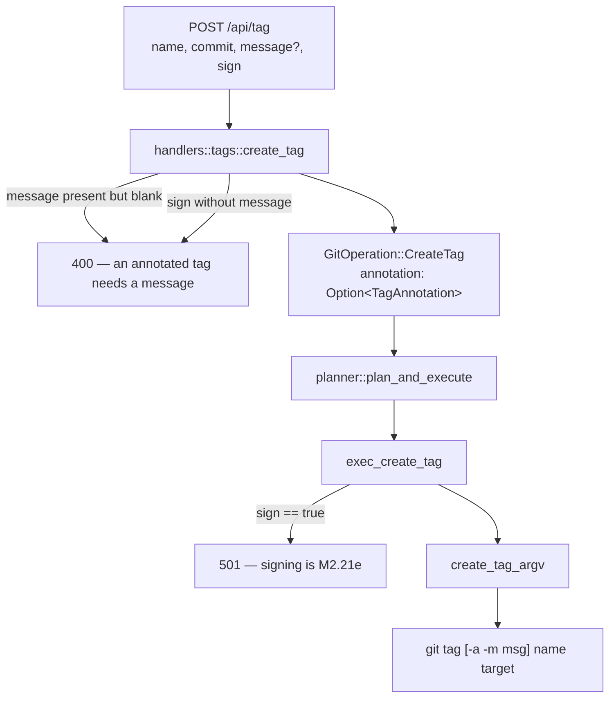
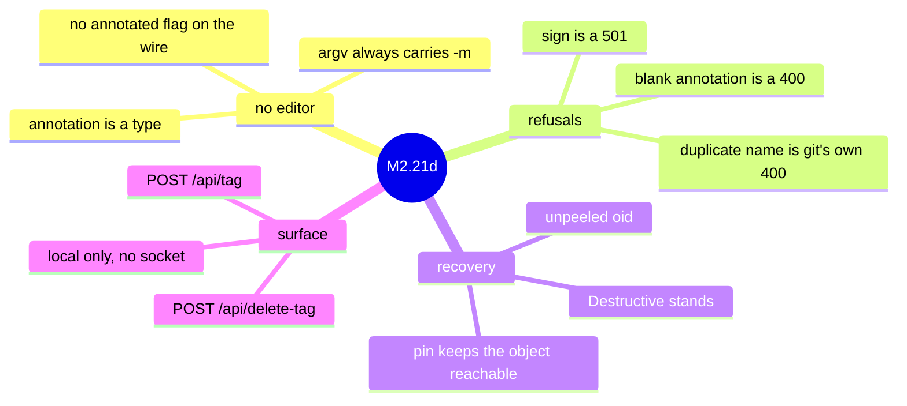
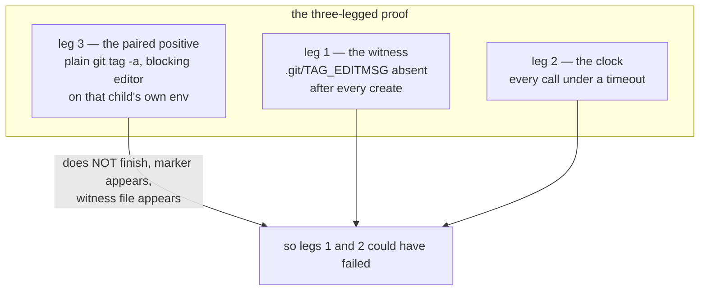
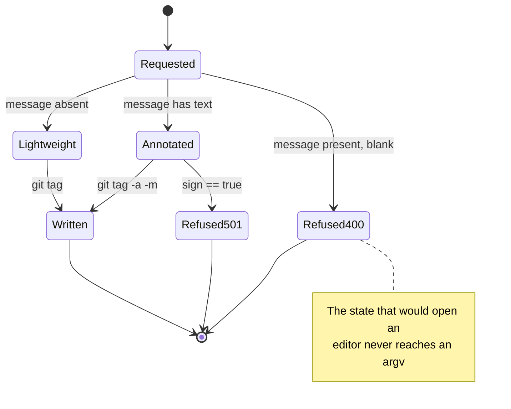
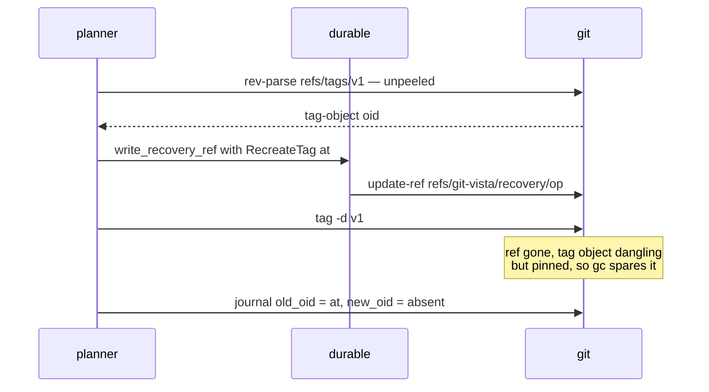
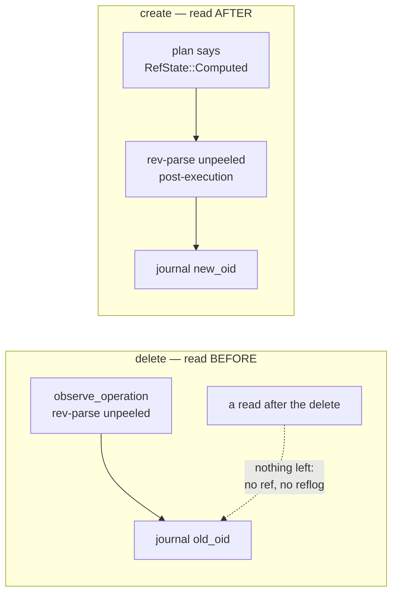

# ADR 0048 — Local tag execution: the annotation that cannot be empty, and the pin that outlives the tag

- **Status:** Accepted — implemented and tested. The two **local** tag operations execute;
  the two remote-reaching ones (`DeleteRemoteTag`, `PushTag`) stay `501`, and signing stays
  `501`, each for its own reason recorded below.
- **Date:** 2026-08-02.
- **Milestone / issue:** M2.21d, issue #238 ("Local tag create/delete (lightweight &
  annotated) through the shared planner"), child of #74 (M2.21, "Add Annotated and Signed
  Tag Management"). Branch `feature/m2.21d-local-tag-exec`, based on
  `feature/m2.21b-tag-listing`.
- **Supersedes / superseded by:** Nothing. **Completes the execution half of**
  [0041](0041-tag-operation-vocabulary.md) for `CreateTag` and `DeleteLocalTag` — the same
  contract-then-execution staging [0040](0040-amend-execution.md) completed for
  `AmendCommit`.
- **Related:** [0016](0016-shared-write-planner.md) (every write goes through the one
  planner), [0017](0017-no-arbitrary-argv-from-the-browser.md) (the argv boundary this
  slice adds two subcommands to), [0021](0021-durable-operation-journal-and-recovery-refs.md)
  (the recovery ref that turns out to be load-bearing here, not decorative),
  [0036](0036-network-tier-exec-harness-askpass-and-redaction.md) (why the local/remote
  split is a compile-time fact), [0031](0031-adr-format-alternatives-and-rejection-reasoning.md)
  (why the alternatives table exists).

## Context

ADR 0041 (#235) landed the typed tag vocabulary and, with it, the complete plan *shape*
for all four tag operations: preconditions, `RefChange`s, risk ranks, and recovery
strategies, proven by contract tests. `planner::execute` refused all four with `501`, and
the contract suite asserted that refusal was **inert** — the repository byte-identical
afterwards.

This slice replaces the two local stubs with real execution and gives them routes. Three
things about tags make that more than a mechanical copy of the branch executors, and each
gets a decision below:

1. **`git tag -a` with no message opens an editor.** There is no editor on a headless
   server and nobody to type into one. `git tag` has no `--no-edit`.
2. **A deleted tag can take a commit with it.** `git tag -d` has no unmerged-work guard,
   and tag refs keep no reflog — so the "recovery" question is not rhetorical.
3. **The annotation is the tag.** Getting an annotated tag's execution subtly wrong
   produces a *lightweight* tag: right name, right commit, and the message, tagger, date
   and signature silently absent.

## Decision

### 1. The no-editor guarantee is a **type**, not a check

`git tag -a` with no `-m` writes `.git/TAG_EDITMSG` and launches `core.editor`. Under this
server that is one of two bad outcomes: the process dies on whatever `$EDITOR` happens to
be, or it waits forever for a human who cannot reach it — and a request that never returns
surfaces on the iPad as the same opaque "Load failed" a dead server does. Since `git tag`
offers no `--no-edit`, there is nothing to switch off after the fact. The only defence is
never building that argv.

So the state is made unrepresentable rather than checked for, at three layers that each
close a different door:

- **The operation.** `TagAnnotation` (ADR 0041) carries a `TagMessage`, which cannot be
  empty. "Annotated" and "has a message" are therefore the *same fact* in the type: there
  is no value of `GitOperation::CreateTag` that means "annotate this, message to follow".
- **The wire.** `CreateTagRequest` has no `annotated: bool`. The kind is chosen by whether
  `message` is present, so `{annotated: true, message: null}` — the body that would ask for
  an editor — has no spelling. A body that sends `annotated` at all is a `400` from
  `deny_unknown_fields`.
- **The argv.** `create_tag_argv` is a pure function whose annotated arm emits `-a` and
  `-m <message>` together, never `--edit`. Being pure is what makes the property
  assertable over the exact bytes that reach `execve`, with no repository and no spawn.

The message rides as `-m`'s **own argv entry**, never glued into one. That is what makes
an option-shaped message (`--edit`, `-f`) safe: git's parser consumes the next element as
the option's value whatever it spells. This is asserted behaviourally — a tag really is
created with the message `--edit`, read back out of the tag object — not merely by
inspecting the vector.

**How it is proven, because "it cannot hang" is unfalsifiable if tested lazily.**
`.git/TAG_EDITMSG` exists if and only if git took the editor path; it is a deterministic
witness needing no environment. Every executor call in the test runs under a timeout, so a
genuine hang fails rather than wedging CI. And the paired positive spawns plain
`git tag -a` (no `-m`) in the *same repository* with a blocking editor set **on that
child's own environment** — no process-wide `set_var`, so it cannot race a parallel test —
and asserts it does *not* finish, that the editor ran, and that the witness appeared.
Without that third leg the first two would pass in a world where nothing could ever hang.

### 2. A blank annotation is **refused**, not downgraded to lightweight

The lenient reading of `{"message": "   "}` is "they didn't really want an annotation —
make a lightweight tag." That is a wrong outcome dressed as forgiveness: the caller asked
for release notes and would get a tag without them, with a `200` saying it worked. The
handler answers `400` with a sentence naming what is missing.

The same reasoning governs `sign: true` with no message: a signature lives *inside* the tag
object, so a signed lightweight tag is not a thing git can make. ADR 0041 made that
unrepresentable in the operation by nesting `sign` inside the annotation; this is the
wire-side half, so a caller gets a sentence instead of watching their flag be dropped.

The decision lives in `annotation_for`, a pure function, for a reason worth stating: the
handler cannot be called in a test without a registered process-global selection
(`state::CURRENT`), so testing this *through* the handler would mean mutating shared state
or not testing it at all. Same split, same reasoning as `git_cmd::redact_if_remote`.

### 3. Signing is refused with `501`, never silently dropped

`TagAnnotation::sign` exists in the vocabulary; M2.21e wires it. Until then
`exec_create_tag` answers `501` **before building any argv**. Dropping the flag and
producing an ordinary annotated tag would hand the user a tag they believe is signed —
a wrong outcome they cannot see, which is the worst kind. A `501` is a wrong outcome they
can see immediately.

`sign` is nonetheless accepted on the wire rather than omitted from the DTO. Omitting it
would make the refusal unreachable from production, and this repository has shipped a
fully-tested mechanism with zero production callers before (#228). A client asking for a
signed tag now gets a clear "not yet" rather than a confusing `400: unknown field sign`.

### 4. The recovery answer: `RecreateTag { at: <unpeeled> }`, and the pin is what makes it true

ADR 0041 chose `RecoveryStrategy::RecreateTag` carrying the **unpeeled** pre-delete ref
value — for an annotated tag, the tag object's own oid — and recorded that the reflex
answer here had been wrong twice (a `{name, target, message}` re-authoring shape, and a
peeled-commit oid). This slice was where that choice had to be *demonstrated* rather than
argued, and doing so surfaced the half of it that prose alone had left implicit.

**The restoration.** `git update-ref refs/tags/<name> <at>` at the unpeeled oid gives back
the original tag object: same message, same tagger, same date, same GPG signature —
byte-identical, verified by comparing `git cat-file tag` output before and after.
Restoring at the *peeled commit* would produce a lightweight tag with the right name on the
right commit and every annotation gone forever, which is the failure mode that looks most
like success. Telling those two apart requires asserting the object **type**, which is why
the tests do.

**Why it is still there to restore.** `git tag -d` deletes only the ref; the tag object
survives, dangling, until `git gc`. And a tag can be the last ref reaching its commit — in
which case the delete orphans the commit too. `durable::write_recovery_ref` points
`refs/git-vista/recovery/<operation-id>` at the recovery oid, which makes the dangling tag
object **reachable**, and transitively the commit under it. The pin is therefore not a
convenience record of the oid; it is the thing that keeps the object alive.

That claim is only worth making if it can fail, so the test builds a tag whose commit **no
branch reaches** and runs both legs: with the pin, `git gc --prune=now` leaves both objects
alive and the restoration is byte-identical; without it, `gc` takes both and there is
nothing left to restore. With the commit also on a branch, "the target commit survives"
would have been true no matter what this code did.

**`DeleteLocalTag` stays `Destructive`** (ADR 0041's rank, not the issue's suggested
`Reversible`): the gc experiment above is exactly why. The recovery exists, but it is a
*recovery*, not the automatic safety `git branch -d`'s unmerged-work guard provides.

### 5. Journalling: `ActivityKind::Other`, and the before-oid is the observation

Both operations journal against `refs/tags/<name>` with `ActivityKind::Other` — the honest
existing bucket, the same one `/api/discard-tracked-paths` uses. `git-vista-core`'s
`ActivityKind` has no tag member; adding one is a core-crate widening with frontend
consequences, not this slice's, and inventing a near-miss kind (`BranchCreated` for a tag)
would be worse than a generic one.

The delete's `old_oid` comes from `observed.branch_tip` — the unpeeled value
`observe_operation` read *before* anything was touched — not from a post-delete read. There
would be nothing left to read: the ref is gone and tag refs keep no reflog. The create's
`new_oid` is read back *after* execution rather than assumed, because for an annotated tag
it is the tag object git just wrote, an oid nothing could have known at plan time — which
is precisely what the plan's `RefState::Computed` said.

### 6. Two routes, `full_routes`-only — beside a listing that is not

`POST /api/tag` and `POST /api/delete-tag`, named to match `/api/branch` and
`/api/delete-branch`. Both are registered only under `full_routes` with the full
`SessionAndCsrf` write posture, while `GET /api/tags` (M2.21b) stays on both listeners.
That is not an inconsistency: ADR 0005 draws the line at what a LAN visualize session may
*see* versus *do*, and a tag listing discloses only committed history while these mutate
refs.

Deleting a tag here is **local only**. A user who expects the remote to follow is wrong, but
wrong in the safe direction: nothing left the machine. `DeleteRemoteTag` is a separate
operation on a route still to come, because it opens a socket with credentials on it —
`network_need_for_operation`'s wildcard-free match is what routes that through ADR 0036's
askpass hardening and redaction, and the local pair declaring `Local` is what pins that the
tag code added here cannot reach a remote at all.

### 7. The inertness tests were **replaced**, not kept

ADR 0041's two stub tests asserted that `CreateTag` and `DeleteLocalTag` left the
repository byte-identical. Those assertions are now the opposite of the contract, so they
are gone, replaced by execution tests that read the repository back with plain `git`. A
test asserting "nothing happened" that survives the wiring it was guarding is not a safety
net; it is a claim the code no longer makes. The two remote-reaching stubs and their
inertness tests are untouched — those *are* still the contract.

## Alternatives considered

| Alternative | Why it lost |
|---|---|
| Passing `GIT_EDITOR=true` (or `core.editor=true`) as the no-editor defence | Turns a hang into a `fatal: no tag message?` — better, but still a failed operation from a request the type system could have refused. It is also environmental: `main.rs` sets `GIT_EDITOR=true` process-wide today, which means the defence would silently depend on a variable any future refactor could move. Kept as defence in depth, not relied on. |
| `annotated: bool` beside `message: Option<String>` on the wire | Makes `{annotated: true, message: null}` representable — the exact request that opens an editor — and then requires a check to reject it. The nested shape has no such spelling, matching `TagAnnotation`'s own reasoning in ADR 0041. |
| Downgrading a blank annotation to a lightweight tag | Answers `200` for a tag the caller did not ask for, with the release notes they typed silently gone. A wrong outcome the user cannot see. |
| Silently ignoring `sign: true` until M2.21e (what #238's text suggested) | Same failure shape, higher stakes: an unsigned tag under a name the user believes is signed. `501` is visible. |
| Dropping `sign` from the request DTO entirely | Makes the refusal unreachable from production — a tested mechanism with no caller, exactly #228's finding — and turns a clear "not yet" into a confusing unknown-field `400`. |
| One `exec_create_tag` per kind (lightweight / annotated) | Everything after the argv is identical, and the plan already tells the reviewer which kind they approved. Two executors would be two places for the `-m` rule to drift out of. |
| Building the annotated argv inline instead of via `create_tag_argv` | The no-editor property would then only be assertable by spawning git against a repository. A pure function makes it checkable over the exact bytes, and the behavioural tests still run. |
| `RecreateTag` at the **peeled commit** | Restores a lightweight look-alike: right name, right commit, message/tagger/signature gone forever. This is the reflex answer ADR 0041 recorded as wrong, and the type-assertion in the recovery test is what tells the two apart. |
| Ranking `DeleteLocalTag` `Reversible`, as #238's text asked | `git tag -d` has no unmerged-work guard and tag refs have no reflog; the gc experiment shows an unpinned delete losing both the tag object and an otherwise-unreachable commit. `Destructive` (ADR 0041) stands. |
| Treating the recovery ref as a bonus record of the oid | It is what keeps the object *reachable*. The paired negative leg — same delete, no pin, `gc --prune=now` — shows both objects gone, so the pin is load-bearing. |
| Adding `ActivityKind::TagCreated` / `TagDeleted` | A `git-vista-core` widening with frontend consequences, outside this slice's files. `Other` is honest and precedented; the summary carries the detail. |
| Keeping ADR 0041's inertness tests alongside the new execution tests | They assert the repository is unchanged, which is now false by design. A green test asserting the opposite of the contract is worse than no test. |
| Reusing `BranchRequest` for the delete body | A tag endpoint whose body key is `branch` invites exactly the copy-paste that deletes the wrong kind of ref. |

## Consequences

- Two of ADR 0041's four tag operations now execute; `planner::execute`'s tag arms are
  two real executors and two remaining `501`s, and the contract suite's exception list
  drops from six operations to four.
- `POST /api/tag` and `POST /api/delete-tag` exist on the loopback router with the
  standard write posture; `EXPECTED_ROUTE_COUNT` 42 → 44.
- The no-editor guarantee is checkable in two independent places: over the argv (pure,
  no spawn) and over `.git/TAG_EDITMSG` (behavioural, real git), with a paired positive
  proving a blocking editor really does hang the process the executor avoids.
- A deleted tag's *undo* is now demonstrated end to end rather than asserted: the exact
  tag object comes back byte-identically after `git gc --prune=now`, and the paired
  negative shows it would not without the recovery pin.
- **No frontend.** #238's acceptance criteria include "New Tag"/"Delete Tag" items in
  `menu.rs`; those files are outside this slice's scope and no UI calls these routes yet.
  The routes are reachable by any HTTP client (and by the MCP bridge), but a user driving
  the app cannot reach them until the menu slice lands.
- **A serde affordance, found here and written down rather than papered over:** a write DTO
  can be filled *positionally* from a JSON array. `argv_boundary`'s "raw argv arrays are
  refused" assertions were passing on arity, not on shape, and a comfortable falsehood was
  one keystroke from being extended to the new DTOs. The claim is now stated precisely and
  the affordance is tested: a positional body is the *same request* — it can name no field
  the object form lacks, add none, and skip no validation — while the smuggling that would
  matter (an extra key) has no positional spelling at all.

## Where this is implemented

- `crates/git-vista-protocol/src/dto.rs` — `CreateTagRequest`, `DeleteTagRequest`, and the
  round-trip/refusal test naming the shape that cannot be expressed.
- `crates/git-vista-protocol/src/lib.rs` — the two new exports.
- `crates/git-vista-protocol/src/plan.rs` — module table rows now name live endpoints;
  `CreateTag`/`DeleteLocalTag`/`TagAnnotation` docs updated from contract-only to executing,
  with the no-editor reasoning recorded on the variant.
- `crates/git-vista-server/src/handlers/tags.rs` — `create_tag`, `delete_tag`, and the pure
  `annotation_for` with its refusal test.
- `crates/git-vista-server/src/main.rs` — the two routes.
- `crates/git-vista-server/src/route_authz.rs` — the two classification rows;
  `EXPECTED_ROUTE_COUNT` 42 → 44.
- `crates/git-vista-server/src/planner.rs` — `create_tag_argv`, `exec_create_tag`,
  `exec_delete_local_tag`, the two `execute` arms replacing the `501` stubs, and the
  argv-property unit test.
- `crates/git-vista-server/src/planner/contract_suite.rs` — the tag execution battery
  replacing the two inertness stubs (create both kinds, duplicate-name refusal, signing
  refusal, the editor battery, delete, missing-tag refusal, the recovery/gc pair test);
  POST-table and funnel census rows for the two routes.
- `crates/git-vista-server/src/argv_boundary.rs` — tag DTO smuggling fixtures, the
  `TagName` gate assertions, the wire-level hostile bodies for `/api/tag`, and the new
  positional-array test with the corrected claim.
- `docs/SECURITY_MODEL.md` — the tag annotation under "Operation Risk Classes"; see below.

## SECURITY_MODEL.md annotation

The ADR 0041 tag paragraph under the "Operation Risk Classes" table said the four tag
operations were typed but not executable, `501` and proven inert. That is now false for two
of them, so the paragraph is amended in the file's established
`*(…: ADR NNNN, #issue — detail.)*` voice: which two execute, that signing and the two
remote-reaching operations still refuse, the no-editor guarantee as a property of the type
rather than a check, and the demonstrated (not merely asserted) gc-survival of a deleted
tag's object and its commit under the recovery pin.

---

**Signed:** thomas2025 · 2026-08-02T20:24:12-04:00
