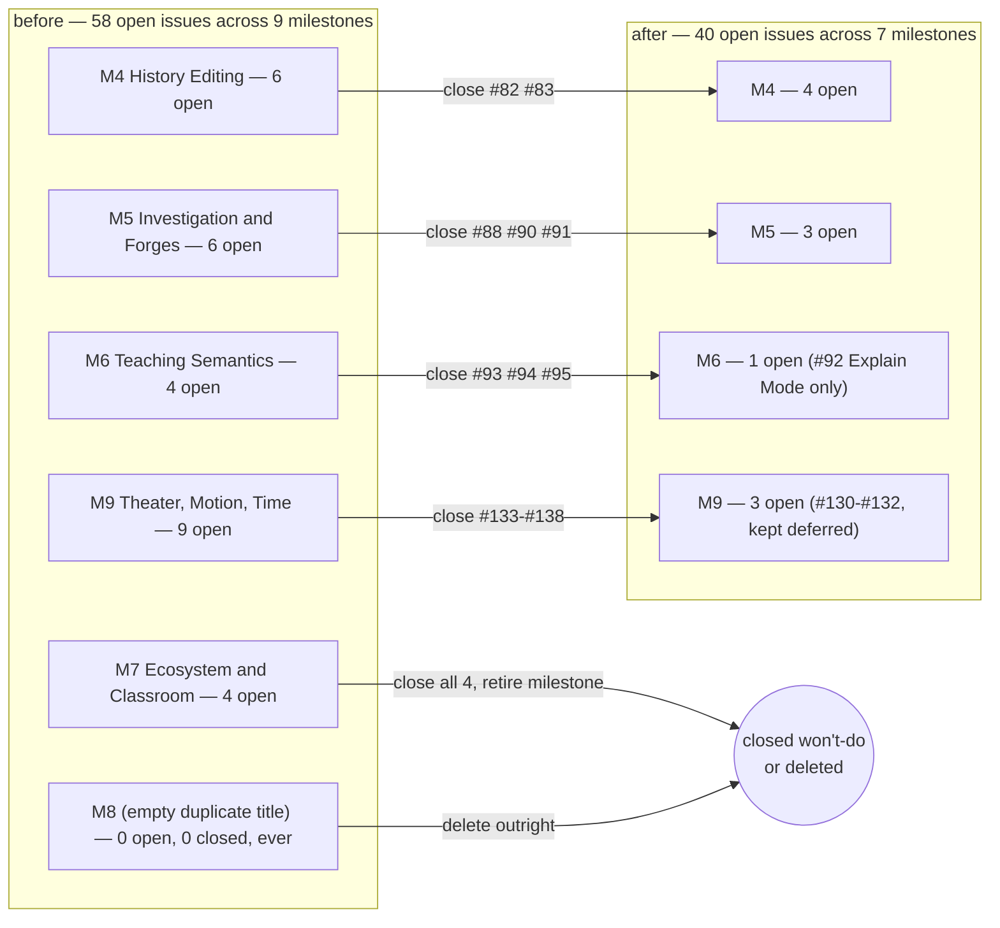
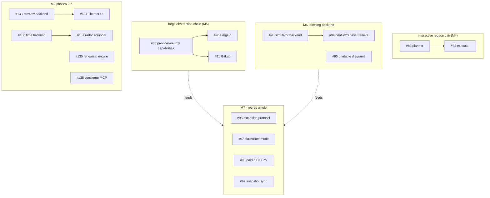

# ADR 0049 — V1 scope freeze: eighteen never-started issues closed as won't-do, M6/M7 retired, M8 deleted

- **Status:** Accepted — tracker changes only; no code or protocol touched.
- **Date:** 2026-08-05.
- **Milestone / issue:** None (a tracker-hygiene decision, not a shipped slice). Applies to
  eighteen issues across M4, M5, M6, M7 and M9; retires milestones M6 and M7; deletes the
  empty duplicate milestone M8.
- **Supersedes / superseded by:** Nothing.
- **Related:** [0031](0031-adr-format-alternatives-and-rejection-reasoning.md) (why the
  alternatives table below exists). Every issue named in this ADR keeps its own text as
  the record of what it originally proposed — this ADR records only the freeze decision
  and the return condition, not a rewrite of eighteen issue bodies.

## Context

Git-Vista is a solo-owned, personal project. As of this freeze the tracker holds **58 open
issues** (55 attached to a milestone, plus three — #218, #308, #316 — that carry none and are
untouched by this ADR) spread across nine milestones, M1 through M9. Two of those
milestones (M6, M7) had never shipped a single issue, a third (M8) had never held one at
all, and a fourth (M9) was nine-tenths speculative: only its first three phases (#130–#132)
had a stated, current reason to exist.

A backlog sized like that stops being a plan and starts being a claim the tracker makes
about the future that nobody is actually working toward. Every open issue reads, to a
later session or a later collaborator, as "this is coming" — M7's `M7.43`–`M7.46` numbering
alone implies four sequenced steps toward an ecosystem-and-classroom future that no one has
touched since the issues were filed. That is a cost independent of whether any individual
idea was good: it is honesty debt on the roadmap, and `./dev roadmap` inherits it every
time it prints a milestone list.

An opus-model sequencing pass was run over the full open backlog to find issues that (a)
have zero implementation — no branch, no PR, no partial code — and (b) sit in a product
direction the owner does not currently intend to build. That pass proposed 18 cuts. Each
one was re-verified in this session, live, before this ADR was written: `gh issue view`
against all 18 (title, state, milestone, and full body — not just the title, per this
project's standing rule that confident citation of unread content has burned it six
times before), a text search of every other open issue's body for a reference to each
cut number (to catch orphaned dependents before closing anything), and a branch/PR search
across the whole repository for any of the 18 numbers (none found — the "never-started"
claim is not asserted, it is demonstrated absent).

## Decision

### 1. Closing is not deleting

Every issue below is closed with the label/state `won't-do`, not deleted. It stays
readable at its permanent URL, keeps its full history and comment thread, and can be
reopened by anyone with write access at any time — there is no ceremony required beyond
reopening it and, ideally, noting what changed. Each closing comment states the specific
condition under which it would return (see the table in §2), so "reopen" is never a bare
guess about what the owner would need to see. This is the whole point of the amnesty
framing: cutting scope should cost nothing to reverse, because the only thing it removes
is the tracker's claim that work is imminent, not the idea itself.

### 2. The eighteen closures, grouped by cut and with a concrete return condition each

All 18 were re-verified live this session (title + full body via `gh issue view`,
dependency search across every other open issue, branch/PR search across the repo).
None has a branch, a PR, or partial code. Every `why_cut` below is this session's own
finding, not a transcription of the owner's rationale.

**M7 — retired whole milestone.** All four M7 issues close; none of M7 survives.

| # | Title | Why cut | Return condition |
|---|---|---|---|
| [#96](https://github.com/tom2025b/Git-Vista/issues/96) | M7.43 Design an Out-of-Process Extension Protocol | Its own acceptance criteria require that “at least two existing adapters fit without privileged escape hatches”, and V1 ships at most one adapter (#89, GitHub) — the issue's own two-adapter precondition cannot be met. | A second real adapter ships beyond #89, making its own two-adapter precondition meetable, and a third party wants to extend without a source change. |
| [#97](https://github.com/tom2025b/Git-Vista/issues/97) | M7.44 Design Classroom Mode as a Separate Service | Multi-tenant instructor/student service with its own identity/authorization/retention model — a different product with a different threat model. Depended on `M6.40`/`M6.41`, also cut here. | A concrete classroom use case appears with someone willing to own the separate-service security model. |
| [#98](https://github.com/tom2025b/Git-Vista/issues/98) | M7.45 Research Paired HTTPS LAN Mode | The SSH tunnel already serves the personal LAN/iPad access need; this was research into an alternative with its own certificate/DNS-rebinding threat surface. | SSH tunneling proves insufficient for an actual access need. |
| [#99](https://github.com/tom2025b/Git-Vista/issues/99) | M7.46 Evaluate Optional Local Snapshot Synchronization | Its own acceptance criteria required "a clear, validated user problem" before implementation — none ever appeared. Depended on `M6.42` (#95), also cut. | A concrete, validated cross-device workflow need appears. |

**M6 teaching product — three of four close; #92 Explain Mode is kept untouched.**

| # | Title | Why cut | Return condition |
|---|---|---|---|
| [#93](https://github.com/tom2025b/Git-Vista/issues/93) | M6.40 Build an Isolated Git Simulator Backend | Foundational backend for the teaching-product line; the whole direction is cut except Explain Mode, which works against real production plans and never needed a simulator. | A concrete teaching/classroom use case returns needing isolated, disposable repos. |
| [#94](https://github.com/tom2025b/Git-Vista/issues/94) | M6.41 Ship Merge-Conflict and Rebase Trainers | Downstream of #93 (cut). The shared conflict/rebase machinery it would have reused (#84, #85) stays for the real app. | Reopens together with #93 if a validated classroom need returns. |
| [#95](https://github.com/tom2025b/Git-Vista/issues/95) | M6.42 Export Printable and Shareable Redacted Diagrams | Handout/presentation export built for the teaching line; the export/redaction feature has no validated need outside teaching use. | A concrete non-classroom need for exporting/redacting diagrams appears. |

**Forge abstraction and non-GitHub adapters — three close; #89 GitHub PR integration is
kept, re-scoped to absorb what it needs from #88.**

| # | Title | Why cut | Return condition |
|---|---|---|---|
| [#88](https://github.com/tom2025b/Git-Vista/issues/88) | M5.35 Define Provider-Neutral Forge Capabilities | V1 stays GitHub-only; a provider-neutral capability layer designed ahead of a second real provider tends to guess the seams wrong. | A second forge provider (Forgejo, GitLab) is actually being built — two real implementations to abstract over instead of one plus a guess. |
| [#90](https://github.com/tom2025b/Git-Vista/issues/90) | M5.37 Add Read-Only Forgejo Change-Request Integration | Depends on #88, also cut. No adapter code exists. | A specific Forgejo user need appears, after #88's capability boundary is rebuilt for a real second provider. |
| [#91](https://github.com/tom2025b/Git-Vista/issues/91) | M5.38 Add GitLab Merge Request Integration | Depends on M5.35 and M5.37 (#88, #90), both cut, plus M5.36 (#89, kept). Never started. | A concrete GitLab request arrives post-V1, once a forge-neutral boundary (if any) has actually shipped. |

**M9 phases 2–6 (Operations Theater / time reconstruction) — six close; #130–#132
(fleet, journal snapshots, stable graph identity) are kept as deferred foundation.**

| # | Title | Why cut | Return condition |
|---|---|---|---|
| [#133](https://github.com/tom2025b/Git-Vista/issues/133) | M9.04 Candidate futures backend (`POST /api/preview`) | Never-started phase 2 of the Theater vision; a consumer of the M9.01–03 foundation, not a prerequisite for it. | #130–#132 ship **and** there is a concrete, current design need for operation preview — not just because the foundation exists. |
| [#134](https://github.com/tom2025b/Git-Vista/issues/134) | M9.05 Operations Theater UI | Phase 3 UI, depends on #133 (cut). | #133 returns first and ships, and there is a live product reason to build the swipeable-cards UI on top of it. |
| [#135](https://github.com/tom2025b/Git-Vista/issues/135) | M9.06 Rehearsal engine (scratch-clone execute-for-real) | Phase 4, never started. | A genuine revival of #133/#134 with a concrete case for rehearse-before-apply that V1's direct-execute model doesn't already cover. |
| [#136](https://github.com/tom2025b/Git-Vista/issues/136) | M9.07 Time reconstruction backend + as-of viewer | Phase 5, ships standalone per its own description but never begun. | A concrete need for as-of/time-travel viewing of history arrives post-V1, independent of the rest of M9 Theater. |
| [#137](https://github.com/tom2025b/Git-Vista/issues/137) | M9.08 Radar-loop scrubber | Phase 6 UI, "Consumes M9.07" (#136, cut). | #136 returns first and ships, and finger-driven scrubbing remains wanted. |
| [#138](https://github.com/tom2025b/Git-Vista/issues/138) | M9.09 Concierge MCP (schedule-driven fleet) | Own body flags it "personal-only, horizon item... requires its own brainstorm + design doc" — the lowest-commitment item in the whole cut set. Requires #130 (kept, deferred) as prerequisite. | #130 ships **and** there is an actual desire to automate fleet scheduling — needs a fresh design pass regardless. |

**Interactive rebase — both close; #84 shared conflict resolution and #85
force-with-lease are kept, since the real app needs them independent of interactive
rebase.**

| # | Title | Why cut | Return condition |
|---|---|---|---|
| [#82](https://github.com/tom2025b/Git-Vista/issues/82) | M4.29 Touch-First Interactive Rebase Planner | Never-started XL planner UI (drag-to-reorder pick/reword/squash/fixup/drop). | Interactive rebase becomes a stated V-next priority; returns together with #83. |
| [#83](https://github.com/tom2025b/Git-Vista/issues/83) | M4.30 Execute and Recover Interactive Rebases | Never-started XL execution engine, depends directly on #82 (cut). | Returns together with #82; #84/#85 stay in place as the infrastructure it would build on. |

### 3. M7 retired; M6 shrinks to its lone survivor

M7 ("Future: Ecosystem & Classroom") had four open issues and zero closed ones; all four
close in this freeze, so nothing remains under it. It is **closed as a milestone on
GitHub** (milestones have an open/closed state and closing is reversible; its title and
description stay as the historical record of what it once proposed) and is no longer
referenced by `./dev roadmap`'s active-milestone framing.

M6 ("Teaching Professional Semantics") keeps exactly one open issue after this freeze:
[#92](https://github.com/tom2025b/Git-Vista/issues/92) Explain Mode, explicitly kept.
**Execution instruction: M6 stays OPEN, holding only #92.** A one-issue milestone is an
honest shape — it says exactly what survives of the teaching direction. Whether #92 should
later be re-homed to a milestone that better reflects "one shipped teaching feature, not a
teaching *product*" is left for a future, separate call; closing M6 with #92 still inside
it would make the issue invisible to milestone-filtered views, which is the lie-class this
tracker cleanup exists to remove.

### 4. M8: deleted outright, not closed with a return condition

M8 carries the **same descriptive title** as M7, differing only in the milestone-number prefix ("M7 — Future: Ecosystem & Classroom" /
"M8 — Future: Ecosystem & Classroom") and has zero issues attached — not zero *open*
issues, zero *ever*: `open_issues: 0, closed_issues: 0`. It is a duplicate milestone
shell with no history to preserve, which is why it is deleted rather than retired
alongside M7: the amnesty (§1) exists to preserve a record of a real proposal that is
being deferred, and M8 never held one.

### 5. What is explicitly not touched

None of the following are in any close list in this ADR, and none should be inferred as
affected by it: everything in M2 and M3, [#92](https://github.com/tom2025b/Git-Vista/issues/92)
(Explain Mode), [#89](https://github.com/tom2025b/Git-Vista/issues/89) (GitHub PR
integration, kept and re-scoped to absorb what it needs from #88),
[#84](https://github.com/tom2025b/Git-Vista/issues/84)/[#85](https://github.com/tom2025b/Git-Vista/issues/85)
(shared conflict resolution, force-with-lease),
[#130](https://github.com/tom2025b/Git-Vista/issues/130)/[#131](https://github.com/tom2025b/Git-Vista/issues/131)/[#132](https://github.com/tom2025b/Git-Vista/issues/132)
(M9 fleet/journal/graph-identity foundation, kept as deferred),
[#238](https://github.com/tom2025b/Git-Vista/issues/238),
[#80](https://github.com/tom2025b/Git-Vista/issues/80)/[#81](https://github.com/tom2025b/Git-Vista/issues/81)/[#86](https://github.com/tom2025b/Git-Vista/issues/86)/[#87](https://github.com/tom2025b/Git-Vista/issues/87),
and [#141](https://github.com/tom2025b/Git-Vista/issues/141). Also untouched: the three
open issues with no milestone at all (#218, #308, #316) — this freeze only reasons about
milestone-attached backlog.

### 6. Two kept issues carry a stale dependency line

Two KEPT issues declare dependencies on issues this freeze closes, and neither blocks it:

- [#89](https://github.com/tom2025b/Git-Vista/issues/89) (kept) says "Depends on: M5.35"
  — that is [#88](https://github.com/tom2025b/Git-Vista/issues/88), cut. Non-blocking
  because #89 is explicitly re-scoped to absorb the parts of #88 it actually needs, with
  GitHub types allowed at the handler boundary.
- [#85](https://github.com/tom2025b/Git-Vista/issues/85) (kept) says "Depends on: M2.20,
  M4.29" — M4.29 is [#82](https://github.com/tom2025b/Git-Vista/issues/82), cut.
  Non-blocking because #85's own Goal needs force-with-lease after amend, which shipped in
  M2.19/M2.20 independent of any interactive-rebase work.

Both issue bodies need their "Depends on" lines edited to match; that follow-up is part of
executing this ADR, not a separate decision.

## Alternatives considered

| Alternative | Why it lost |
|---|---|
| Keep everything open | The status quo the freeze exists to fix: 58 open issues across nine milestones, most never started, reads as a roadmap the tracker cannot honestly back. A solo owner gains nothing from a backlog that outlives its own credibility, and every session that touches `./dev roadmap` inherits the confusion of what's actually intended. |
| Cut more (e.g. close #92, #89, #84/#85, or M3 wholesale) | Rejected per the owner's explicit KEPT list. Each of those has either shipped adjacent infrastructure it depends on (#84/#85 for the real conflict/force-push workflows), is actively re-scoped rather than abandoned (#89 absorbing #88), or is a deliberately-deferred-not-cut foundation (#130–#132). Cutting them would remove work the owner still wants, which is a different decision than clearing dead scope. |
| Milestones-only (retire M6/M7/M9 as milestones, leave every individual issue open and unlabeled) | Leaves the dishonesty at the issue level even after fixing it at the milestone level — an open, unlabeled #96 still reads as "planned" to anyone who filters by label instead of milestone. The tracker's per-issue state is what `gh issue list --state open` and most tooling actually reads; milestone-only cleanup would look done and not be. |
| Delete the 18 issues instead of closing won't-do | Deletion destroys the record and the return condition along with it — the next person (or the owner, eighteen months later) who wonders "did we ever consider Forgejo support" finds nothing instead of a closed issue with a dated, specific answer. Closing preserves exactly what deletion would erase, at zero ongoing cost. |
| Retire M8 with a return condition like the issues, instead of deleting it | M8 never held an issue, open or closed — there is no proposal, no history, and no reasoning to preserve. Treating it like the 18 substantive cuts would manufacture ceremony around an empty shell that was very likely a milestone created twice by mistake. |

## Consequences

- The tracker now shows **40 open issues across 7 active milestones** (M1, M2, M3, M4, M5,
  M6, M9 — M7 gone, M8 deleted), plus the two pre-existing unmilestoned issues (#232,
  #316) this freeze does not touch. `./dev roadmap` reflects this the next time it is run;
  no code change is needed for that, since it reads milestones/issues live from GitHub.
- Reopening any of the 18 is a normal GitHub reopen plus removing/updating the `won't-do`
  state — no special process, no re-filing, no lost text. The closing comment on each
  issue states the specific return condition, so a future reopener does not have to
  re-derive intent from a title.
- M6 is now a one-issue milestone (#92 only). This ADR does not resolve whether that
  milestone should be renamed, folded, or left as-is; flagged here so it isn't
  rediscovered as a surprise later (§3).
- M8's deletion is irreversible in the sense that a deleted milestone cannot be "reopened"
  the way a closed issue can — but since it never held any issue, there is nothing to lose.
  If "Future: Ecosystem & Classroom" work is ever revived, it revives under M7 (retired,
  not deleted, title and description intact) or a fresh milestone, not under a resurrected
  M8.
- Nothing here changes `docs/SECURITY_MODEL.md` — no security boundary moved, no code
  shipped or removed. This is a tracker-state decision exclusively.
- The dependency verification performed for this ADR (live issue bodies, cross-reference
  search, branch/PR search) found no orphaned dependents that block this freeze among the 40 remaining open — two stale dependency lines are recorded in Decision §6 with their non-blocking rationale and a follow-up edit
  issues and no partial implementation anywhere in the 18. If that changes later — someone
  starts a branch against one of these before the tracker catches up — this ADR's
  "never-started" claim for that issue becomes stale and should be corrected via a reopen,
  not by rewriting this record.

**Signed:** thomas2025 · 2026-08-05T04:19:33-04:00
