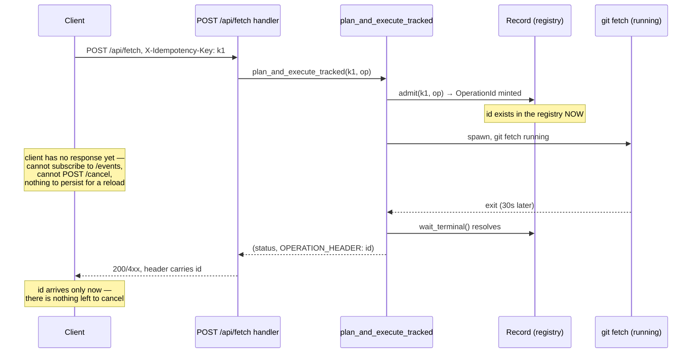
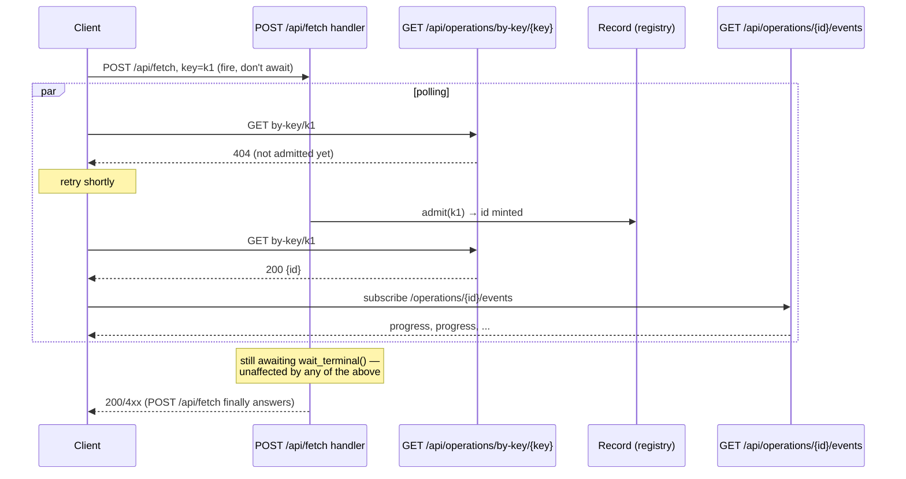
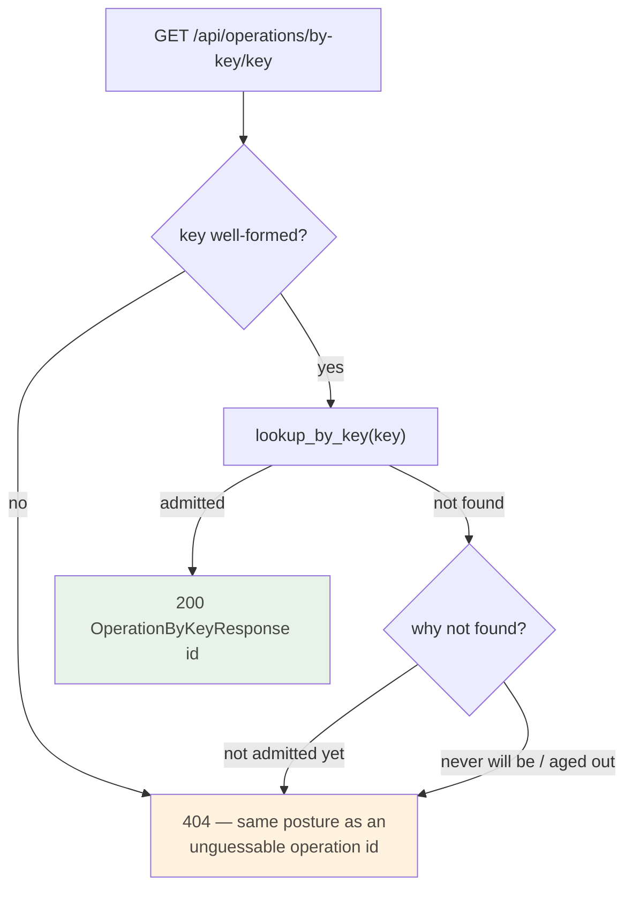

# ADR 0050 — Learning an operation's id before it finishes: an additive `GET /api/operations/by-key/{key}`

- **Status:** Accepted — implemented and tested.
- **Date:** 2026-08-05.
- **Milestone / issue:** M2.20f, issue #232 ("Frontend: fetch/pull controls, progress,
  cancel"), part of M2.20 ("Remote operations", #73). Branch
  `feature/m2.20-f-frontend-fetch-pull-controls-progress`.
- **Supersedes / superseded by:** Nothing. Additive to
  [0043](0043-fetch-execution.md) and [0044](0044-pull-execution.md), which built the
  operation this route lets a client find *before* it answers.
- **Related:** [0020](0020-idempotent-operation-lifecycles.md) (the operation registry,
  `OperationId`, the `watch<OperationStatus>` this route's siblings stream),
  [0043](0043-fetch-execution.md) §4 (cancellation, the reason an id is needed while an
  operation is still running), [0044](0044-pull-execution.md) (the second tracked write
  this affects identically), `docs/SECURITY_MODEL.md`'s route-authorization posture
  (annotated by this branch).

## Context

M2.20's acceptance criteria for the fetch/pull frontend assumed four things worked: a
progress bar during the transfer, a cancel button, a reload that resumes watching an
in-flight operation, and a result rendered when it finishes. The branch that implemented
the frontend against those criteria was fully green — `./dev gate` passed, the contract
suite passed, the frontend's own tests passed — and three of the four did not work.

**How this was found.** Not by the gate. An adversarial review of the already-green branch
walked the acceptance criteria one at a time against what the server actually does, rather
than trusting that green tests implied working criteria. The progress bar, the cancel
button and the reload-resume all depend on the frontend holding an `OperationId` — it is
the argument to `GET /api/operations/{id}/events`, to `POST /api/operations/{id}/cancel`,
and to whatever the frontend persists across a reload. And the frontend cannot get one,
because of a fact sitting in a doc comment in the file the review was reading:

> ADR 0043 (`crates/git-vista-server/src/planner.rs:204`) — `plan_and_execute_tracked` ends
> with `record.wait_terminal().await`. The function that answers `POST /api/fetch` (and
> every other tracked write) **does not return** until the operation it started is
> terminal.

The id is minted long before that — `note_minted` runs immediately after `admit`
(`planner.rs:142`, inside the same function) — but nothing hands it to the client until
the response the id would have ridden on is itself the terminal answer. `OPERATION_HEADER`
is real, and it is on the response body of an operation that has already finished by the
time the client can read it.

So the id that is the handle for cancel, progress and reconnect arrives at exactly the
moment none of those three has anything left to act on. The client held one thing before
it ever POSTed, though: the idempotency key it minted to send the write in the first
place — the same key `admit` keyed the registry row on.

## Decision

Add `GET /api/operations/by-key/{key}`: given an idempotency key, return the
`OperationId` admitted for it, if any. `operations::lookup_by_key`
(`crates/git-vista-server/src/operations.rs:470`) reads `reg.by_key.get(key)` — the same
map `admit` writes into — under the registry's existing mutex; nothing new is stored, and
nothing existing changes shape.

The intended calling pattern: fire `POST /api/fetch` (or any tracked write) with a
freshly-minted key **without awaiting its response body**, and immediately start polling
this route with that same key. The moment it answers, bind the cancel button, the progress
subscription and the reload-recovery state to the id it returns — all three now have
something to act on while the write's own response is still pending.

The write path — `plan_and_execute_tracked`, `wait_terminal`, `OPERATION_HEADER` — is
untouched. This is a second, independent read of state the registry already holds; the
existing contract every tracked write depends on does not change shape or timing.

### A 404 collapses two situations on purpose

`lookup_by_key` returns `None` for both "not admitted yet" (the client is polling faster
than its own POST reached the handler — the expected shape of the intended race) and "never
will be" (a wrong key, a typo, or a record old enough that `evict` already dropped it).
The handler (`handlers/operations.rs::operation_by_key`) answers both with the same 404 and
the same retry-safe body, deliberately not distinguishing them:

A caller cannot act differently on the two cases anyway — both mean "keep polling, or give
up" — and a 404 is safe to retry either way: `lookup_by_key` runs no git and mutates
nothing, so hammering it costs one mutex lock per call. What it deliberately does *not* do
is say why a key is unrecognised, for the same reason `resolve` doesn't for a malformed
operation id: distinguishing "wrong session's key" from "not yet admitted" would leak
whether the server ever minted anything resembling the guess.

## Alternatives considered, and why (b) was chosen

### (a) An early `202` from the tracked write path itself, letting the SSE stream carry the outcome

Change `plan_and_execute_tracked` to answer as soon as `admit` mints the id — a `202` with
`OPERATION_HEADER` set immediately — and let the client learn the eventual result
exclusively from `GET /api/operations/{id}/events`, the same stream `/cancel` and reload-
recovery already use.

This is arguably the better long-term design, and it is being fair to say so: it removes
the retry loop entirely (the id is on the very first response), it makes every tracked
write's timing uniform with how progress and cancellation already work, and it stops asking
"what if the client polls before its own POST is scheduled" as a question at all, because
there is no polling.

It was not chosen here because it is not additive. `wait_terminal().await` is not a detail
of the response format — the doc comment at `planner.rs:175` explains that the durable
write (`crate::durable::persist`) for the terminal record happens *before* `finish`
publishes it, specifically so that a waiter (this one included) can never observe "done"
ahead of the durable write being real. Every existing tracked-write caller — every test in
`fetch_suite.rs`, `contract_suite.rs`, the MCP tool surface (ADR 0046), and whatever the
already-shipped (if reverted) frontend called synchronously against `POST /api/fetch`'s
response body — depends on that response carrying the *final* status code and body, not an
intermediate `202`. Changing it is a wire-contract change to every tracked write in the
system, not a slice-local decision, and it deserves its own ADR, its own protocol-version
consideration, and its own audit of every caller — not a decision folded into unblocking
one frontend's progress bar. Recorded here as the right direction for a future slice that
takes on that full audit.

### (b) This lookup route — chosen

Additive: no existing response's shape, timing, or status code changes. Every caller of
`POST /api/fetch` today gets exactly the guarantee it always got. The cost is a client-side
retry loop for the admit race (bounded by the caller's own timeout, not this server's) and
a second round trip on the wire. Given that the alternative touches a contract every tracked
write already depends on, and this repository's standing rule is to prefer the additive
change when one is available, (b) is the one landed. It is explicitly *not* claimed to be
architecturally cleaner than (a) — see above.

### (c) Doing nothing, and cutting the three affected acceptance criteria

Rejected: cancel, live progress and reload-resume are three of the four criteria #232 was
opened to deliver, and the fourth (a rendered result) already worked without this route.
Cutting three of four to ship the fourth is not what "green gate" should have been standing
in for, which is the whole reason this ADR exists — recording the fix, not just noting the
gap.

## Consequences

- **A second round trip.** The client now makes at least two requests per tracked write
  instead of one: the write itself (fired, not awaited for its body) and one or more polls
  of `by-key`. For a fetch or pull, which already runs tens of seconds, this is
  negligible against the operation's own duration.
- **A bounded retry loop lives in the client, not the server.** This route places no upper
  bound on how long a caller may poll — it is not itself the timeout — so the frontend
  owns a retry budget (bounded by the same kind of ordinary give-up-and-report-an-error
  logic any polling loop needs). A caller that polls forever costs this server one mutex
  lock per call and nothing else.
- **A 404 now means two genuinely different things, deliberately merged.** "Not yet
  admitted" and "never admitted" are indistinguishable from the response, on purpose (see
  above). A future caller that needs to tell them apart cannot get that from this route as
  specified; it would need a different signal (e.g. the write's own response, once it
  arrives) to resolve the ambiguity after the fact.
- **The route census moves.** One new row in `ROUTE_AUTHZ`
  (`crates/git-vista-server/src/route_authz.rs:172`) classified `Authz::SessionRequired` —
  a GET with no CSRF surface, the same posture as the sibling `GET /api/operations/{id}`
  immediately below it — and `EXPECTED_ROUTE_COUNT` moves accordingly
  (`route_authz.rs:199`). Registered on the loopback router only, alongside the writes it
  describes, never on the LAN router (ADR 0005): it describes an in-flight write's
  identity, which is exactly the class of thing a LAN visualize session must never see.
- **`OperationByKeyResponse` is a new, additive wire type**
  (`crates/git-vista-protocol/src/operation.rs:310`) — one field, `id: OperationId` — with
  no change to any existing type's shape.
- **Alternative (a) remains open as future work**, explicitly not foreclosed by this
  decision: nothing here makes the early-`202` design harder to build later, and this
  route does not need to be removed if that slice ever lands — a client could stop polling
  it once the write's own response arrives early enough to make polling unnecessary.

## The security question: this route reveals whether an idempotency key exists

`GET /api/operations/by-key/{key}` sits behind `Authz::SessionRequired`
(`route_authz.rs:172`) — the same gate as every other read of operation state
(`GET /api/operations/{id}`, `GET /api/operations/{id}/events`), and one step lighter than
the write routes it describes (`Authz::SessionAndCsrf`), because a GET carries no CSRF
surface — there is nothing here for a forged cross-origin request to *do*, only to read,
and reading requires the same live session a forged request cannot present.

That is sufficient for what this route actually discloses. `security.rs`'s
`require_auth` gate (the runtime enforcement `route_authz.rs`'s module doc describes as
already correct and not duplicated here) refuses any request without a valid session
before this handler ever runs, so the question is not "can an unauthenticated request use
this route" (it cannot) but "does a session-holding caller learn anything it shouldn't from
a key that isn't theirs." The answer this route gives — 200 with an `OperationId`, or an
undifferentiated 404 — is no more revealing than what `GET /api/operations/{id}` already
discloses to any session holder about *any* operation id it can guess or has been told:
this project's threat model already treats a live session as trusted to observe operation
state broadly (there is no per-operation ownership check anywhere in this registry — see
`operations::lookup`, which likewise takes only an id and returns whatever record exists).
An idempotency key is client-minted and, like an `OperationId`, unguessable by construction
rather than access-controlled per-caller; the session gate is the same boundary the rest of
the operations surface already relies on, and this route adds no new one to reason about.

## Where this is implemented

- `crates/git-vista-protocol/src/operation.rs` — `OperationByKeyResponse`, its wire-name
  pin and round-trip test.
- `crates/git-vista-protocol/src/lib.rs` — the new export.
- `crates/git-vista-server/src/operations.rs` — `lookup_by_key`, reading the same `by_key`
  map `admit` already writes.
- `crates/git-vista-server/src/handlers/operations.rs` — `operation_by_key`, the module
  doc's explanation of the race this route closes.
- `crates/git-vista-server/src/main.rs` — the route, registered with the writes (not the
  reads) for the ADR 0005 reason above.
- `crates/git-vista-server/src/route_authz.rs` — the new classification row and the
  `EXPECTED_ROUTE_COUNT` bump.

---

**Signed:** thomas2025 · 2026-08-05T00:00:00-04:00
