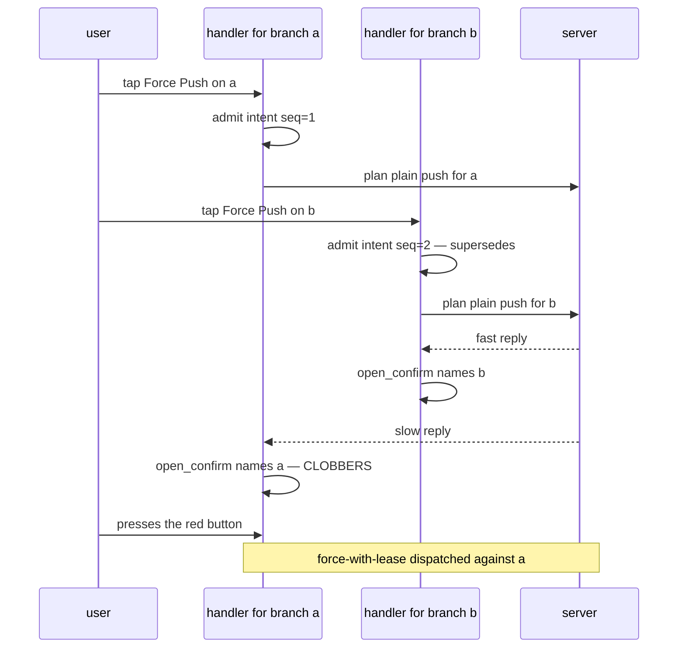
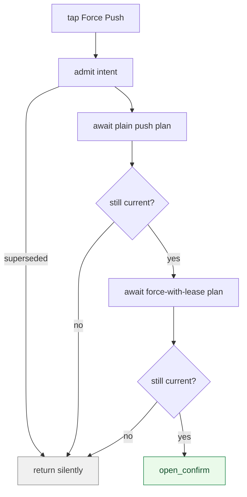

# ADR 0051 — Intent admission belongs *after* every await, not once before them

- **Status:** Accepted — implemented and confirmed by hand on a device. The frontend
  force-with-lease ceremony re-offers its intent after each network round trip; a stale tap
  can no longer overwrite a live tap's confirmation.
- **Date:** 2026-08-07.
- **Milestone / issue:** M2.20g, issue #233 ("Frontend: upstream setup and force-with-lease
  confirmation ceremony"), child of #73 (M2.20). Landed alongside M2.21d / issue #238 on
  `feature/m2.20g-m2.21d-force-lease-and-tags`.
- **Supersedes / superseded by:** Nothing. **Corrects an unwritten assumption** carried by
  every menu item built on the intent-admission machinery introduced for request fencing.
- **Related:** [0048](0048-local-tag-execution.md) (the tag operations this branch ships
  beside), [0016](0016-shared-write-planner.md) (the planner every one of these calls
  reaches), [0021](0021-durable-operation-journal-and-recovery-refs.md) (why dispatching
  against the wrong subject is not merely cosmetic).

## Context

The frontend admits a `PendingIntent` before starting an operation so that a newer user
action supersedes an older one. `Force Push` is the first menu item whose ceremony makes
**two** `/api/plan` round trips before it shows anything: one for a plain push preview, one
for the force-with-lease preview whose risk determines the wording of the confirmation.

The item admitted its intent once, at the top, and then awaited both. That is safe only if
admission is a *lock*. It is not — it is a *comparison*, and the comparison is deliberately
permissive:

```rust
// crates/git-vista/src/features/operations/core.rs:576-581
pub fn latest_wins(current: Option<&PendingIntent>, incoming: &PendingIntent) -> bool {
    match current {
        None => true,
        Some(cur) => incoming.seq >= cur.seq,
    }
}
```

A later tap always wins, by design. Nothing tells the *earlier* handler it has lost — it is
still suspended inside its own `await`, holding a `branch` captured from the menu item that
opened it. And the modal it eventually opens does not check either:

```rust
// crates/git-vista/src/features/shell/signals.rs:405-408
pub fn open_confirm(&self, op: PendingOp) {
    self.present(Overlay::Confirm);
    self.confirm_op.set(Some(op));
}
```

An unconditional write. Last writer wins.

### The failure



Tap `a`, then `b`. `b`'s confirmation appears — correctly named. `a`'s slower plans land,
overwrite it, and the red button dispatches **force-with-lease against `a`**, a branch the
user had moved on from. The dialog is telling the truth at the moment it opens and lying by
the time it is pressed.

For a read this would be a cosmetic glitch. For an irreversible, remote, destructive write
it is the worst class of defect this project has: **the confirmation ceremony confirming
something other than what it performs.**

### Why review missed it and how it was found

Three tracing agents read this code and cleared it. One quoted the item's own comment —
*"see `pull_item`'s identical pattern"* — as justification and never opened `pull_item`.
The comment was wrong: `pull_item` admits **after** its await, the reverse of what the
comment claimed. The defect was found by a refuter working to a "what did the others miss"
mandate, not by any of the tracers.

That is the second time in this repository a stale in-code comment has been treated as
evidence. It is now the standing caution: **a comment is a claim, not a citation.**

## Decision

**Admission is a comparison, so it must be re-offered after every suspension point.**

An intent admitted before an `await` says only "I was the newest when I started." The
question that matters at the moment of committing to UI or to a write is "am I *still* the
newest," and only a fresh comparison answers it.

The fix is a re-checking closure and a guard after each round trip:

```rust
if !operations.admit_intent(&intent) {
    return;
}
// Re-offer after each await; see the ordering
// note above this item for why admitting once,
// up front, does not hold.
let still_current = move || operations.admit_intent(&intent);

let plain = preview_push(/* … */).await;
if !still_current() {
    return;
}

let leased = preview_push(/* … */).await;
if !still_current() {
    return;
}
```



Re-offering is safe precisely because `latest_wins` uses `>=`: an intent compared against
itself still wins, so a handler that has not been superseded passes every re-check.

### The rule this generalizes to

**Any handler that awaits before touching shared UI state must re-check its intent after
each await.** The number of guards equals the number of suspension points, not one. A
handler with no await needs no re-check; a handler with two awaits needs two.

## Alternatives considered

| Alternative | Why not |
|---|---|
| Make `open_confirm` reject a stale write | Puts the check in the wrong place. The modal does not know which intent produced the op, and threading one in would give every caller a new obligation while leaving the underlying "admitted once, then slept" pattern intact everywhere else. |
| Make admission a real lock — first tap wins, later taps rejected | Reverses a deliberate product decision. A user who taps a second branch has changed their mind; the newer action must win. Latest-wins is correct and stays. |
| Cancel the losing handler's in-flight requests | Much larger change (abort plumbing through the API layer) for the same observable result. The requests are cheap previews; letting them complete and discarding the answer costs a round trip nobody is waiting on. |
| Capture the branch and re-verify it at dispatch | Narrows the blast radius but leaves the dialog displaying the wrong branch until the button is pressed. The ceremony's whole job is to be *read* before being pressed. |
| Serialize menu operations behind a queue | Would make the second tap wait on the first — visible latency on every menu action, to fix a case that a comparison already models correctly. |

## Consequences

- **Force Push cannot dispatch against a branch other than the one its dialog names.**
  Confirmed by hand on the testbed: two rapid taps produced two independent, correctly-named
  results — `feature/widget` rejected by its lease, `main` already up to date. Neither
  contaminated the other.
- **A superseded handler now returns silently.** No error, no toast. This is intended: the
  user has already moved on and a message about an action they abandoned is noise.
- **The obligation is per-await and unenforced by the type system.** A future menu item that
  adds a third round trip and forgets a third guard reintroduces the defect. That is a real
  residual risk and is recorded here rather than papered over — a compile-time encoding
  (a "suspendable intent" that must be re-proved to be used) is a plausible future ADR,
  but was not built for this slice.
- **The stale comment was corrected**, not merely worked around. The item now explains why
  admitting once does not hold, so the next reader does not re-derive the same wrong
  conclusion from it.

### Also fixed here

The `NotYetPushed` copy claimed a branch "isn't on origin yet." The planner knows only the
*local remote-tracking ref*, so that sentence asserts a fact about the remote it has not
checked. It now says there is no local record of the branch on origin, that a plain Push
already does everything a force-with-lease would, and to Fetch first if the branch is
expected to be there.

## Where this is implemented

| What | Where |
|---|---|
| The re-checking closure and both guards | `crates/git-vista/src/menu.rs`, `force_push_item` |
| The comparison that makes re-offering safe | `crates/git-vista/src/features/operations/core.rs:576-581`, `latest_wins` |
| The unguarded modal write this protects | `crates/git-vista/src/features/shell/signals.rs:405-408`, `open_confirm` |
| The corrected `NotYetPushed` copy | `crates/git-vista/src/menu.rs` |

## SECURITY_MODEL.md annotation

The model's ceremony requirement for `RiskLevel::Remote` + `RecoveryStrategy::Irrecoverable`
operations is that the user confirms **the specific write that will be performed**. This ADR
records the first case where that requirement was met in the plan layer and broken in the
view layer: the plan was correct, the dialog was correct when opened, and the binding between
them was not stable across a suspension point.

No test reaches this. It requires two taps within the window of one network round trip, and
the ui suite has no wasm event loop. It was found by adversarial review and confirmed by a
human on a device — which is why the device pass remains a gate on this class of change
rather than a formality.
