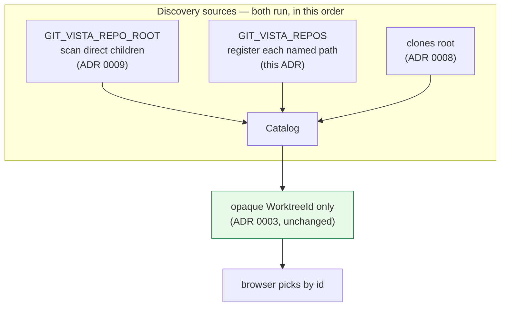

# ADR 0052 — An explicit repo list, because "these four" is not "this folder"

- **Status:** Accepted — implemented and tested.
- **Date:** 2026-08-07.
- **Milestone / issue:** Operator-configuration gap found in use, not from the roadmap.
- **Supersedes / superseded by:** Nothing. **Extends** [0009](0009-configured-root-repo-discovery.md) with a second discovery source; that ADR's root-scan form is unchanged and both run.
- **Related:** [0003](0003-repository-catalog.md) (the catalog's opaque-id contract, which this does not touch), [0017](0017-no-arbitrary-argv-from-the-browser.md) (the same instinct one layer down).

## Context

ADR 0003 established that the browser can never name a path: a request selects a repository by an opaque `WorktreeId`, and the catalog — server-owned — is the only thing that maps an id back to a location. ADR 0009 then answered "how does the server learn about more than one repo" with a single scanned root: `GIT_VISTA_REPO_ROOT`, direct children only.

That covers the case it was designed for. It does not cover the one that turned up in real use.

The operator wanted **four specific repositories** visible. They do not share a parent, and the parent they *do* share — `~/projects` — holds **54** git repositories, including a dozen Git-Vista worktrees and seven testbed checkouts. The root scan offers exactly two options: serve one repo, or serve all fifty-four. There is no way to say "these four."

The attempted workaround is instructive and is why this ADR exists rather than a config note. A directory of symlinks pointing at the four, with the root aimed at that directory, **fails** — and fails *correctly*. `Catalog::register` canonicalizes before checking membership, so each symlink resolves to its real location under `~/projects`, which is outside the declared root, and the allowlist refuses it:

```
git-vista: skipping /home/tom/gv-repos/teacher-thing (outside the allowed roots)
```

That refusal is ADR 0003's escape-prevention working as designed — the check exists precisely so a symlink cannot smuggle a path past the boundary. The workaround was asking the guard to permit the thing it was built to stop.

A second workaround was floated and is worth recording as rejected: make the private repos public on GitHub, clone them, then make them private again. This is both unnecessary (the repositories are already cloned locally; Git-Vista reads directories and never contacts GitHub to enumerate anything) and actively harmful — a repository that is public for even a minute can be cloned, scraped, or cached by infrastructure outside the operator's control.

So the gap is real and neither workaround closes it: **the design says the server owns the list, and then gives the server one clumsy way to build it.**

## Decision

**Add a second discovery source: `GIT_VISTA_REPOS`, a `:`-separated list of absolute repository paths, each registered as its own allowed root.**



Four decisions inside that, each of which could reasonably have gone another way:

**1. Each named path becomes its own allowed root — never its parent.**
This is the whole security substance. `scan_direct_children` allows the *parent* and registers what it finds beneath, which is right for "everything in this folder." An explicit list means the opposite: **these exact repositories and nothing else.** Allowing a shared parent would silently widen the boundary to every sibling — re-creating precisely the fifty-four-repo problem the operator was avoiding by naming four paths.

Mutation-proven rather than asserted: replacing `allow_root(&canonical)` with `allow_root(canonical.parent())` — the naive implementation, and the one you would write without thinking about it — fails `an_explicit_list_allows_only_what_it_names_not_the_siblings`.

**2. The list runs *alongside* the root scan, not instead of it.**
An operator may reasonably want "everything in `~/work`, plus these two elsewhere." Registration is idempotent on identity, so a path named by both sources is admitted once. Order matches startup and rescan so a path reachable by more than one source lands with the same final flags either way.

**3. `:` as the separator, not `,`.**
Matches `PATH` and every other path-list variable on this platform, and `std::env::split_paths` handles it natively. A comma is a legal character in a Unix path; a colon effectively is not. The wrong-separator mistake therefore fails loudly (one absurd path that does not canonicalize) instead of silently producing one wrong path that happens to exist.

**4. A bad entry is skipped and logged, never fatal.**
Same posture the directory scan already takes toward junk children. A typo in one of four paths must not cost the operator the other three, and must not take the server down at boot.

## Alternatives considered

| Alternative | Why not |
|---|---|
| **Let the client send a path** | Directly violates ADR 0003. Anything the browser can name, an attacker reaching the browser can also name — a single hostile page hitting `localhost:8080` could then read arbitrary directories. This is the design's load-bearing refusal, not a limitation to route around. |
| **Point the root at `~/projects` and live with 54** | Works today, and is what the operator ran as a stopgap. But it makes every repository on the machine reachable to satisfy a request for four, which is the wrong default for a tool whose entire posture is minimum exposure. |
| **Make `register` follow symlinks under a scanned root** | This is the workaround that failed, promoted to a feature. It would delete the escape check that ADR 0003 depends on: once a symlink inside an allowed root can register its outside target, any writable directory in the root becomes a way to reach anything on disk. |
| **A config file instead of an env var** | More expressive, and a reasonable future step. Rejected for now because ADR 0009 already established the env-var channel (`gv --root` sets it; systemd units can too), and introducing a second, differently-shaped configuration mechanism for the same job is the complexity that has to earn its place. If a third discovery source appears, revisit. |
| **Recursive scan with a depth limit** | Solves a different problem (nested repos) and not this one — the operator's four are all top-level. It would also make the served set depend on directory layout in a way that is hard to predict from the config alone. |

## Consequences

- **The operator can say "these four."** `GIT_VISTA_REPOS=/path/a:/path/b:/path/c:/path/d`, and nothing else is reachable — not their siblings, not their parent.
- **ADR 0003's contract is untouched.** The browser still receives only opaque ids and still cannot name a path. This widens what the *server* can be told, which was always the intended channel, and narrows what it must be told to serve a specific set.
- **Symlinks resolve to their targets, deliberately.** A named symlink registers the real path, and the real path is what becomes allowed — so the entry holds the canonical location, never an alias. This is why naming paths works where a directory-of-symlinks does not, and the asymmetry is now documented in `register_explicit`'s own doc comment rather than left as a surprise.
- **Two discovery sources now exist, and a reader has to know both.** The mitigation is that they are adjacent in `state.rs`, both logged at startup with their own counts, and cross-referenced in each other's docs. If a third appears, the config-file alternative above becomes the better answer.
- **Still no in-app way to add a repo.** By design — that is ADR 0003. An operator-facing convenience (a `gv --repos` flag writing the env var, say) would be a separate, small change.

## Where this is implemented

| What | Where |
|---|---|
| The registration primitive, one allowed root per named path | `crates/git-vista-server/src/catalog.rs`, `Catalog::register_explicit` |
| Env parsing (`:`-separated, empty entries dropped) | `crates/git-vista-server/src/state.rs`, `repo_list` |
| Catalog wiring, soft-zero on an empty list | `crates/git-vista-server/src/state.rs`, `register_repo_list` |
| Startup registration | `crates/git-vista-server/src/main.rs` |
| `POST /api/rescan` | `crates/git-vista-server/src/handlers/select.rs` |
| Tests, incl. the mutation-proven sibling boundary | `crates/git-vista-server/src/catalog.rs`, `catalog::tests` |

## SECURITY_MODEL.md annotation

This adds a configuration channel, not a capability. The set of servable repositories remains server-owned and fail-closed; the browser's reachable surface is unchanged and is still addressed exclusively by opaque id. The one property worth stating explicitly, because it is the difference between this and pointing a root at a parent: **naming a repository grants access to that repository, never to its directory.**
