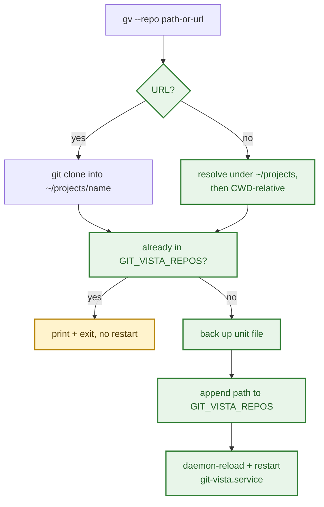

# ADR 0056 — `gv --repo` registers a catalog entry via the boot-time `GIT_VISTA_REPOS` unit var, not the live `/api/clone` endpoint

Date: 2026-08-12
Status: Accepted — implemented

Supersedes nothing.

## Context

Adding a repository to the running Git-Vista catalog meant hand-editing
`GIT_VISTA_REPOS` in `~/.config/systemd/user/git-vista.service` and
restarting the service — no command for it, unlike every other operational
concern the `gv` script already covers (`--token`, `--stop`, `--doctor`,
`--root`, `--lan-view`). Tom asked for a one-liner in the same style:
`gv --repo <path-or-url>`.

Two registration paths already exist server-side, from two different ADRs:

- **ADR 0009** (repo-list form): `GIT_VISTA_REPOS` is a colon-separated env
  var read once at process startup (`state::register_repo_list`,
  `main.rs:200`). Changing it requires a restart.
- **ADR 0008** (persistent clones): `POST /api/clone` clones a repo into an
  XDG-state-backed clones directory at runtime, no restart, and the clone
  is re-registered automatically on the next boot
  (`state::scan_clones_root`).

The live endpoint is the one that avoids downtime, so it was the first
candidate for a CLI wrapper. It doesn't fit one: the route sits behind
`security::require_auth` — session cookie plus CSRF posture, established
through the browser sign-in flow (`bootstrap_cookie` in `main.rs`'s own
tests). There is no bearer-token or service-account path into it. A shell
script would have to either reimplement session bootstrapping (defeating
the point of a one-liner) or shell out to a browser, neither of which is
"short."

## Decision

**`gv --repo <path|url>` edits `GIT_VISTA_REPOS` in the systemd unit and
restarts `git-vista.service`, the same operation Tom was doing by hand.**

- `crates/git-vista` is untouched — this is entirely a `gv` script change,
  no server code, no wire contract.
- A bare name (`gv --repo mcp-fleet`) resolves under `~/projects` first,
  matching where every existing catalog entry actually lives, before
  falling back to CWD-relative.
- A `git@`/`https://`/`ssh://` argument clones into `~/projects/<name>`
  first (skips the clone if the directory already exists), then proceeds
  as a path.
- The unit file is backed up (`.bak-<timestamp>`) before every edit, same
  pattern as the shared-file-backup convention used elsewhere on this box.
- **The restart is skipped when the repo is already listed** — a repeated
  `gv --repo mcp-fleet` is a silent no-op rather than a restart every time,
  since restarting the live server is exactly the kind of action that
  shouldn't happen without a reason (it drops the iPad SSH tunnel for a
  few seconds).

## Alternatives considered

**Wrap `POST /api/clone` instead.** Rejected for this change. It's the
better mechanism in the abstract — no restart, no tunnel blip — but it's
gated behind a browser session + CSRF, and a CLI that has to open a browser
to authenticate itself isn't a one-liner anymore. Left as a real gap: if
this friction matters later, the fix is a service-account/bearer-token path
into that endpoint, not a second script layered on top of it.

**Standalone `gv-repo` script in `~/.local/bin`, separate from `gv`.**
Tried first, then abandoned. It worked, but it's a second binary to
remember, install, and keep in sync with `gv`'s existing conventions
(`--token`-style flags, the same `$REPO`/`$PROJECTS_DIR` resolution `gv`
already computes from its own `BASH_SOURCE`). Folding it into `gv` as
`--repo` means no install step — the existing `gv` PATH symlink already
covers it — and one place carries all of Git-Vista's operational surface.

**Restart unconditionally, every invocation.** Rejected after the first
manual test against an already-registered repo (`mcp-fleet`) would have
restarted the live server for a no-op. Checking `current_val` before
touching the unit file costs one string comparison and avoids an
unnecessary tunnel drop — cheap enough that there's no real tradeoff here.

## Consequences

- Registering a new repo still means a restart — `GIT_VISTA_REPOS` is a
  boot-time env var, and that doesn't change here. The tradeoff is fewer
  restarts than manual editing would produce (idempotent re-adds are free),
  not zero restarts.
- The unit file gets a new timestamped `.bak-*` sibling on every real edit;
  nothing prunes these. Not a problem yet — worth revisiting if the backup
  count grows unbounded.
- `gv --repo` only ever appends. Removing a repo from the catalog is still
  a manual unit-file edit; not built here since it wasn't asked for.
- The clone-URL branch shells out to plain `git clone` with no timeout or
  size guard — an unreachable host or reachable host serving a huge
  repository blocks the script until `git` itself gives up. Acceptable for
  a single-operator tool run interactively; would need hardening before any
  multi-user or unattended use.

## Where this is implemented

| Concern | Location |
| --- | --- |
| `--repo` flag parsing | `gv` (argument loop, `NEXT_IS_REPO`) |
| Clone / path resolution / unit edit / restart | `gv` (`repo_add` function) |
| Idempotent no-restart-on-repeat guard | `gv` (`repo_add`, the `already in GIT_VISTA_REPOS` branch) |
| The env var this edits | `~/.config/systemd/user/git-vista.service` (`Environment=GIT_VISTA_REPOS=...`), read at `crates/git-vista-server/src/main.rs:200` (`state::register_repo_list`) |
| The rejected live-clone alternative | `crates/git-vista-server/src/handlers/clone.rs` (`POST /api/clone`, ADR 0008) |

## SECURITY_MODEL.md annotation

None. This is a local operator convenience script, not a server code or
wire-contract change. It runs with the same trust as the operator already
had by hand-editing the unit file and running `systemctl --user restart`
themselves — no new authority is granted, no new network surface is opened.

---

**Signed:** 2025 · 2026-08-12T19:41:00-04:00
