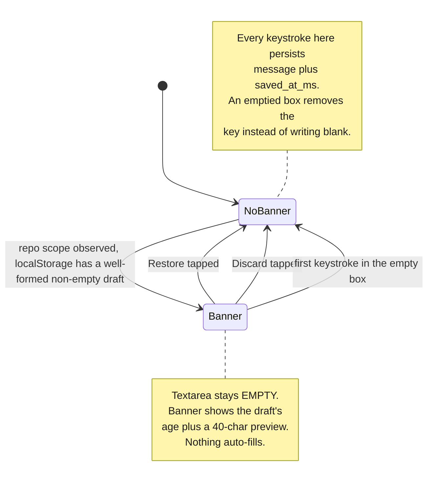

# ADR 0057 — The commit draft moves to `localStorage`, offered back through an aged restore banner, never auto-filled

Date: 2026-08-17

Status: Accepted — implemented

Supersedes the storage half of the decision recorded in #226 (never given its
own ADR at the time — see Context). Does not touch #226's per-repository
scoping, its amend-buffer isolation, or its late-prefill guard; those stand
unchanged.

## Context

Issue #226 (M2.19e) gave the commit dialog a per-repository draft that survives a
tab rebuild by persisting the message to `sessionStorage` on every keystroke,
restoring it silently into the textarea whenever the served repository is
(re)observed. The choice of `sessionStorage` over `localStorage` was
deliberate: the failure being survived was iOS Safari suspending and
rebuilding the tab's WASM module, a same-tab recovery for which tab-scoped
storage was the right size — closing the tab discarding the draft was the
expected outcome, a draft resurfacing days later in a fresh tab was not.

2026-08-17: two hard power losses on Tom's box in one day. A power cut kills
the browser process, not just the tab — `sessionStorage` dies with it.
`localStorage` survives a power cut; `sessionStorage` structurally cannot,
because the storage area itself lives only as long as the process that
created it. Tom's ruling, stated directly: **localStorage, but never
silent.** A stored draft is offered back via a banner showing its age, and is
never auto-filled into the textarea.

The second half of the ruling is the reason this needed a decision, not just
a storage-API swap. Widening the survival window from "seconds to minutes,
same tab" to "hours or days, any future tab" changes what a restored draft
*means*. #226's silent restore was safe under `sessionStorage` precisely
because the window was narrow enough that "whatever was last in the box" was
almost always still what the user wanted. Under `localStorage` that stops
being true — a draft from three days ago, silently dropped into a fresh
session's textarea, is a surprise at best and a wrong commit at worst if the
user doesn't notice it isn't what they just typed. The failure mode Tom named
explicitly: silence.

## Decision

**`localStorage`, plus an explicit offer-and-decide banner; the textarea
itself always starts empty.**

- `crates/git-vista/src/features/dialogs/signals.rs`: `session_storage()` →
  `local_storage()` (`window.localStorage`, same best-effort-`Option` shape —
  private browsing can still refuse it, in which case drafts stay
  in-memory-only, degraded rather than broken).
- The stored value gains a shape: `DraftRecord { message: String,
  saved_at_ms: f64 }`, JSON-encoded (`encode_draft`/`decode_draft` in
  `features/dialogs/commit.rs`, pure and host-tested), where #226 stored the
  bare message string. The age the banner shows has to come from somewhere;
  storing it alongside the text is simpler than reconstructing it from a
  side channel, and decoding is defensive by construction — anything that
  isn't well-formed JSON (including #226's own bare-string format, read by
  code that predates this ADR) decodes to "no draft" rather than panicking
  the banner.
- `Dialogs::set_draft_scope` (fired on every accepted Frame's
  `worktree_id`, i.e. every reload and every repo switch) no longer writes a
  restored value into the live message signal. It decodes whatever is
  stored under the new scope's key into `Dialogs::draft_offer` — a tracked
  `Option<DraftRecord>` the banner renders from — and leaves the textarea
  signal blank, unconditionally.
- The commit dialog view (`crates/git-vista/src/dialogs/commit.rs`) renders
  the banner above the staged-scope review, whenever `draft_offer` is
  `Some` and the open intent uses the draft buffer (never for amend, which
  has never had a persisted draft of its own — see #226's own reasoning,
  restated in `MessageBuffer`'s doc comment). Restore fills the textarea and
  clears the offer; Discard deletes the storage key and clears the offer.
  Both follow the modal's existing `role="status"` and `BUTTON_BASE` +
  `TOUCH_TARGET_STYLE` (#65) conventions.
- Typing into the empty textarea dismisses a still-open offer on the first
  keystroke (`Dialogs::set_message`, gated to the draft buffer only). The
  keystroke has already started overwriting the persisted draft under the
  same key — "last write wins" — so leaving the banner up would describe
  text storage no longer holds.
- An emptied box removes the storage key outright rather than writing an
  empty record, and `decode_draft` independently refuses to offer a
  whitespace-only message back — belt and suspenders against a banner that
  says "Draft from 6 minutes ago" over a blank preview and a Restore button
  that restores nothing. The diagram below is the offer's whole lifecycle —
  every arrow above has a matching transition, and there is no path from
  "stored" to "in the textarea" that skips the banner.

## Alternatives considered

- **Keep `sessionStorage`, accept the power-cut gap.** Rejected outright by
  Tom's ruling — two power losses in one day made the gap not-theoretical.
- **Switch to `localStorage`, keep the silent restore.** This is what #226
  shipped and what this ADR replaces. Rejected because the wider survival
  window makes silent restore actively misleading rather than merely
  convenient — a draft old enough to have been forgotten is a draft the user
  needs to be told about, not one that should reappear as if it were still
  live.
- **A dismiss-only banner (no age, no preview) that just asks "restore a
  draft?".** Rejected: the whole point of surfacing the choice is letting the
  user judge whether the draft is still relevant, and "restore a draft?"
  with no content gives them nothing to judge it by. The age and a preview
  are the minimum that makes Restore/Discard an informed choice rather than
  a coin flip.
- **Auto-restore drafts under some age threshold (e.g. under 5 minutes), only
  banner-offer older ones.** Rejected as an unnecessary second code path for
  a distinction the user can make faster than a threshold can: showing the
  banner every time costs one glance, and a threshold is one more place a
  boundary can be wrong (a 4-minute-59-second draft silently eaten on a
  slower reload).
- **Debounce the persist write.** #226 already rejected this and nothing
  about the storage-API swap changes the argument: a commit message is
  small, `localStorage` writes are synchronous and cheap, and a debounce
  window is exactly the keystrokes a power cut would eat — the entire
  problem this ADR exists to close.

## Consequences

- A draft can now resurface in a browser session that has nothing to do with
  the one that wrote it — a different tab, a different day — which is the
  intended behaviour (surviving a power cut requires exactly this), made
  safe by the fact that it is always an offer, never a fait accompli.
- The stored format changed (bare string → JSON envelope). `decode_draft`'s
  refusal of malformed input means a value written by #226's code (still
  possibly sitting in some session's `sessionStorage`, though that storage
  area is itself gone by definition once this ships and the power-cut gap it
  represents no longer applies) or by a future rollback reads as "nothing to
  offer" rather than crashing the banner — no migration step was needed or
  written.
- `localStorage` has no TTL. A discarded or restored draft's key is removed
  positively (by this code); an *abandoned* draft — never restored, never
  discarded, its repository never revisited — persists indefinitely under
  that worktree id's key. Accepted as a small, bounded cost (one short
  string per repository ever drafted against) rather than adding an
  expiry mechanism nothing has asked for yet.
- Everything #226 already decided about *scope* — per-repository keys, the
  same-repo-reobserved no-op, freezing (not blanking) the scope when a Frame
  goes `None` — is untouched by this ADR and continues to hold.
- The Safari-suspension scenario #226 was originally built for is still
  covered (a suspend/rebuild re-observes the same scope, `localStorage`
  still has the entry, the banner offers it) but its own end-to-end
  verification on real iOS hardware remains descoped, tracked separately as
  #396.

<!-- last_edited_by: max · last_edited_at: 2026-08-17T23:59:00-04:00 -->
