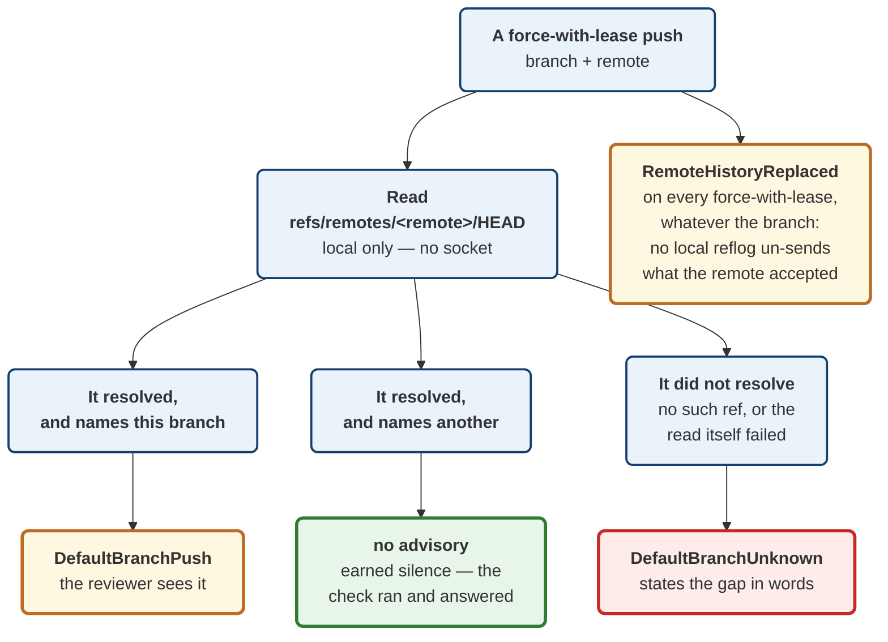

# ADR 0061 — Plans carry advisories, and "could not tell" is one of them

Date: 2026-08-20
Status: Accepted — implemented

Implements the two remaining acceptance criteria of M4.32 (#85): *protected
and default branch warnings exist*, and *recovery guidance never implies
remote undo*. Extends ADR 0043's `ForcePublish` posture — that decision made a
bare force unrepresentable; this one addresses the force that **is**
representable and legitimate, and still deserves a second look at some targets.

## Context

`ForcePublish` already does the hard structural work. There is no
unconditional-force variant, so `git push --force` cannot be constructed by
any handler, request body or future refactor; the only force available is
`WithLease`, which carries the remote tip the user reviewed and turns the push
into a compare-and-swap. Criteria 1–3 of #85 were satisfied by that design
before this ADR: the expected remote ref is in the plan, remote movement
rejects the push, and `--force-with-lease=<branch>:<oid>` names the branch.

What was missing is that **a legitimate force-with-lease is not uniformly
consequential.** Force-pushing a personal topic branch and force-pushing the
branch every collaborator builds on are the same operation, at the same
`RiskLevel::Destructive`, with the same preconditions. Only one of them
warrants a pause, and nothing in the plan could express that difference.

The `Plan` struct had no place to put it. It carries `risk` (which classifies
the operation *kind* — every `PushBranch` gets the same value),
`preconditions` (which *block*), `expected_ref_changes`, and `recovery`. None
of those is the right home for "this is allowed, and you should look at it
anyway".

The existing advisory precedent — `amended_published_commit` on
`AmendCommitSuccess` (#223, ADR 0040) — lives on the **success response**, and
correctly so: whether an amended-away commit was published cannot be known
until the amend runs. A default-branch warning is the opposite case. It is
knowable at build time, and a warning delivered after the push has already
reached the remote is not a warning; it is a receipt.

## Decision

**1. `Plan` gains `advisories: Vec<Advisory>`.** The third category beside
preconditions and risk: true, non-blocking, and specific to *this* target
rather than to the operation kind.

**2. Advisories never block.** Anything that should stop a plan is a
`Precondition`, where it is enforced. An advisory is displayed. Keeping the
two apart matters in both directions — an advisory that quietly blocked would
be an unenforceable rule living in the wrong place, and a precondition
downgraded to an advisory would be a guard that stopped guarding.

**3. Three variants, and the third is the reason this ADR exists.**

- `DefaultBranchPush { branch, remote }` — the target is what
  `refs/remotes/<remote>/HEAD` points at.
- `DefaultBranchUnknown { reason }` — **the default branch could not be
  determined, so this plan does not know whether it targets it.**
- `RemoteHistoryReplaced { branch, remote }` — this push, if it succeeds,
  cannot be undone on the remote by anything this application offers.

**4. Only a force-with-lease earns advisories.** An ordinary push cannot
replace remote history. Warning on it would train users to click through the
warnings that matter — the same argument `FetchRemote`'s docs already make for
refusing to overstate its risk.

**5. Nothing here claims knowledge of forge branch protection.** The variants
speak only about the *default branch*, which is derivable locally from
`refs/remotes/<remote>/HEAD` with no network call.

**6. Protocol 4 → 5, window moved whole.** `Plan` is `deny_unknown_fields` and
the new field has no `#[serde(default)]`, matching `PushBranch`'s added fields.

### Why `DefaultBranchUnknown` is not an empty list

This is the load-bearing decision, and the cheaper design was available: when
`refs/remotes/<remote>/HEAD` cannot be read, emit nothing.

That design is wrong in the direction this estate keeps paying for. **An
absent HEAD ref is the common case, not the exotic one** — `git clone` records
it, but `git remote add` never does, so any repository whose remote was added
by hand has no default branch recorded. Under the cheaper design, a
force-push onto `main` in such a repository produces no advisory, and the
plan's silence is indistinguishable from a plan that checked and found the
target was not the default branch. The check would fail silently, permanently,
in exactly the repositories where nobody would think to look.

The failure mode has a name in this codebase already — it is why `Obs` has an
`Unknown` distinct from `Absent`, why `drift` next door in heraldry reports
`NotCheckable` rather than folding PDFs into a pass, and why `gatehouse`
refuses to certify what it could not observe. The general rule, from the
global notes: *when a monitor cannot represent the failure, its green is not
information.*

The night this was written supplied three fresh instances of the same shape in
the surrounding infrastructure — a build directory symlinked to a disk that no
longer existed, a test configuration pointing at that same dead path, and a
nightly CI job spending real money. All three looked correctly configured.
None of them said a word.

The diagram at the end of this section shows the three outcomes the code must
keep apart.

## Alternatives considered

**Derive the warning in the frontend.** No wire change, no version bump.
Rejected: the *server* would then not be warning, and a warning that lives in
one client is a warning the next client forgets. The MCP server (#248) hands
plans to agents that have no frontend at all.

**Ask the forge for real branch-protection rules.** Accurate, and it would let
the advisory say "protected" rather than "default". Rejected for now: it needs
network, credentials, and a per-forge integration in a deliberately
forge-agnostic client. Asserting "this branch is protected" on the strength of
a local ref would be claiming knowledge never obtained — the precise error
`DefaultBranchUnknown` exists to prevent, committed in the other direction. If
this arrives later it should be a *new* variant carrying the forge's answer,
never a re-interpretation of the local one.

**Fold it into `RiskLevel`.** A `DestructiveDefaultBranch` level. Rejected:
risk classifies the operation kind, and the classification is used for
ceremony that must be predictable per operation. Making one level
target-dependent would mean two pushes with identical shape carrying different
risk, which breaks every consumer that reasons about kinds.

**Put it on the success response, like `amended_published_commit`.** Rejected
on timing: that advisory is genuinely post-hoc, this one is knowable before
the user commits. A default-branch warning delivered after the push is a
receipt, not a warning.

**Emit nothing when HEAD is unreadable.** Covered above — the decision this
ADR is mostly about.

## Consequences

**Good.**

- A reviewer can tell "I checked, it is not the default branch" from "I could
  not check", from the plan alone.
- `RemoteHistoryReplaced` gives the recovery-guidance criterion a home that
  does not distort `RecoveryStrategy`, which describes what git-vista can
  restore *locally* and should keep meaning exactly that.
- Future operations have somewhere to put "legal, but look" — #84's
  conflict-resolution work is the next likely consumer.

**Costs, stated plainly.**

- **A protocol bump is a lockstep break.** `MIN_CLIENT_PROTOCOL` moves with
  it, so a v4 client is refused rather than tolerated. That is deliberate: a
  tolerated v4 client would drop the advisory and still be allowed to submit
  the push, and a warning that vanishes is worse than one never designed.
- **`advisories` is a `Vec`, so "no advisories" and "advisories not computed"
  are the same value on the wire.** The distinction is preserved *within*
  advisory content (`DefaultBranchUnknown`) rather than at the field level.
  Acceptable because the field is populated unconditionally at one site in
  `build_plan`; it would stop being acceptable the moment a second construction
  path could skip it, and that is the thing to watch when one appears.
- **Nothing surfaces these in the UI yet.** The contract and the server half
  land here; the frontend rendering is follow-up work, and until it exists the
  advisories are carried and unread.
- **Advisories are not covered by the operation hash**, so they are not part of
  what #145's tamper detection pins. Correct today — they are derived, not
  approved — but if a future advisory ever becomes something a user
  *acknowledges*, that acknowledgement would need to be in the hash.

**Verification.** Six tests in `planner/advisory_suite.rs`, each driving the
real `build_plan_only` against a real repository with a real bare remote, so
the presence or absence of `refs/remotes/origin/HEAD` is genuine rather than
mocked. Three mutations were run against the committed code and all three
were caught: silencing the unreadable case (1 test red), dropping the
force-with-lease scope guard (1 test red), and inverting the default-branch
comparison (2 tests red). The `Advisory` wire shape is pinned per variant in
`plan_golden.rs`, including that an unknown field inside an advisory is a hard
error. Full workspace: 1,979 tests passing, clippy clean under `-D warnings`.

**Signed:** max · 2026-08-20T04:30:00-04:00
