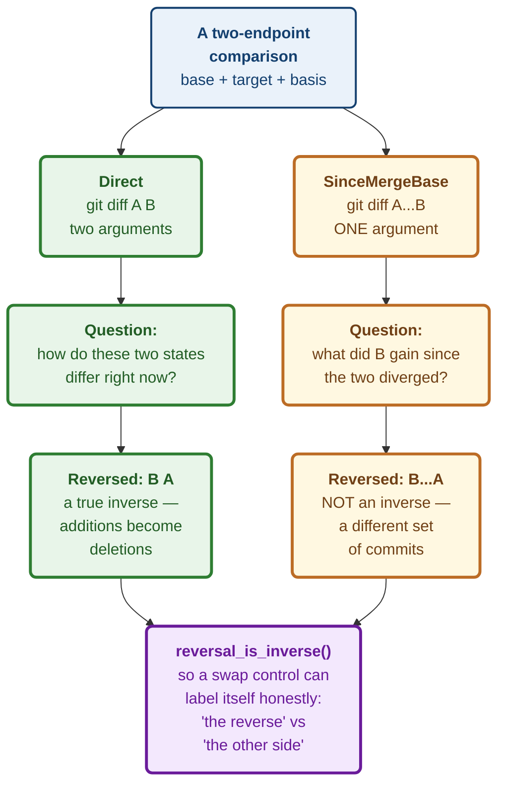

# ADR 0062 — A two-endpoint comparison states which question it asks

Date: 2026-08-20
Status: Accepted — implemented

Implements M4.27 (#80)'s "merge-base context is available" and "reversed
comparisons are correct". Extends ADR 0053 (`SpecDiff` echoes its request) and
the `DiffSpec` vocabulary from #69b, which this decision widens rather than
replaces.

## Context

#80 asks for "a reusable comparison model". Most of that already exists.
`DiffSpec` is a closed four-variant vocabulary of explicit source/target pairs;
`SpecDiff` carries the bounded, capped patch and echoes the spec back as a
staleness guard; `diff_spec_argv_with` maps a spec to argv with `--no-textconv`
and `--no-color` placed before the revisions. The acceptance criterion "results
reuse bounded diff APIs" was satisfied before this ADR.

What was missing is smaller and sharper: **a two-endpoint comparison could not
say which comparison it was.**

```
git diff A B      what differs between the two states, as they are now
git diff A...B    what B gained since the two diverged (merge-base → B)
```

These answer different questions. They come from the same command. They produce
patches in **the same format, with no marker distinguishing them.** Given only
the output, no client can tell which it received. And the two disagree exactly
when it matters most — whenever `base` has moved since the branches split,
which is the normal state of a long-lived branch.

The confusion is not hypothetical or exotic. A forge's pull-request view shows
the three-dot form; a bare `git diff` shows the two-dot form. Users move between
the two daily and are rarely told they have.

## Decision

**1. `ComparisonBasis` rides on the two-endpoint variants.** `Direct` and
`SinceMergeBase`, on `CommitVsCommit` and `RefVsRef`. The field is named
`basis` rather than `mode` because `DiffSpec`'s serde tag is already `mode`.

**2. No `#[serde(default)]`.** A body that omits the basis is a hard 400.
Defaulting to `Direct` would be the obvious convenience and it is precisely
wrong: it reintroduces the ambiguity this field exists to remove, and does it
invisibly, because the resulting patch looks correct either way.

**3. The argv shapes differ in arity, not just in text.** `Direct` pushes two
arguments; `SinceMergeBase` pushes **one** argument containing the literal
`...`. This is isolated in `push_endpoints` with the reasoning attached,
because writing the three-dot form as two arguments silently produces the
two-dot comparison — and both spellings run, exit zero, and return a plausible
patch.

**4. `DiffSpec::reversed()` returns `Option<Self>`.** One-sided modes
(`WorktreeVsIndex`, `IndexVsCommit`) have no second endpoint and no expressible
reversal in git, so they return `None` rather than a spec that could not be
executed — or, worse, an unchanged clone that would make a swap control appear
to work while doing nothing.

**5. Reversal carries the basis through unchanged.** Reversing must never
quietly change *which question* is being asked.

**6. `reversal_is_inverse()` states the asymmetry once.** See below.

**7. Protocol 5 → 6, window moved whole.**

### The asymmetry, which is the reason criterion 3 exists

`git diff A B` reversed is `git diff B A`: the same pair of states seen from
the other side, so every addition becomes a deletion. Reversing twice returns
the original. This is what "reversed diff" means to everyone who has used one.

`git diff A...B` reversed is `git diff B...A`, and **that is not an inverse.**
Both diffs start from the same merge base, but they describe *different sets of
commits*: one is what `B` added since the split, the other is what `A` added.
Neither is the other with its signs flipped. Both are legitimate, and a user
who presses "swap" is entitled to see the other side — but a UI that labels the
result "the reverse" is telling the truth for `Direct` and lying for
`SinceMergeBase`.

That rule now lives in `reversal_is_inverse()` rather than in the head of
whoever writes the next swap button. The honest label for the three-dot case is
"the other side of the divergence".

The diagram at the end of this section shows both bases and what reversing each
one produces.



## Alternatives considered

**Separate `DiffSpec` variants** — `CommitVsCommitSinceMergeBase`, and so on.
Same information, four two-endpoint variants instead of two. Rejected: the
endpoints and their validation are identical between the pair, so the split
would duplicate every match arm that does not care about the basis, and
`reversed()` would need four arms to express one rule.

**Always diff two-dot, and return the merge base alongside as context.**
Cheapest, and it satisfies a literal reading of "merge-base context is
available". Rejected: it makes the *common* comparison — the one a forge shows
for a pull request — unavailable, and leaves each client to reconstruct it.

**Compute and report the merge-base commit in `SpecDiff`.** Genuinely useful,
and probably right eventually. Deliberately deferred: it needs another git
call, and it needs its own honest three-state answer (a merge base exists / the
histories are unrelated / the lookup failed) rather than an `Option` that
conflates the last two. That is a decision of its own and should not be
smuggled into this one. Recorded here so the next session knows it was
considered rather than missed.

**Default the basis to `Direct` when omitted.** Rejected under decision 2
above — this is the one that would have been easiest to accept and hardest to
ever detect.

## Consequences

**Good.**

- A client can always state which comparison it is showing, because
  `SpecDiff` echoes the spec and the spec now carries the answer.
- The three-dot form — what a pull-request view needs — is available through
  the existing bounded, capped, `--no-textconv` path rather than a new one.
- The reversal asymmetry is stated once, in code, instead of being rediscovered
  per client.

**Costs, stated plainly.**

- **A second protocol bump in one night.** v5 (advisories) and now v6. Both
  moved the window whole, so a client must be rebuilt for either. Acceptable
  here because the frontend ships compiled into the same binary, but a
  deployment with independently-versioned clients would feel this.
- **`SinceMergeBase` is undefined for unrelated histories.** Git errors rather
  than inventing a merge base, and this crate does not paper over that — so the
  failure surfaces as a git error through the existing path rather than as a
  typed refusal. Worth revisiting if it proves confusing in practice.
- **Nothing in the UI selects a basis yet.** The contract and the argv mapping
  land here; the picker and the honest swap label are follow-up work. Until
  then every caller passes `Direct`, which is exactly today's behaviour.
- **The merge base itself is still not reported**, per the deferred alternative
  above. A user reading a `SinceMergeBase` diff cannot yet see *which commit*
  it started from.

**Verification.** Five tests in `diff.rs`, covering the argv arity difference,
basis preservation across reversal, double-reversal returning the original,
one-sided modes refusing to reverse, and the omitted-basis deserialize error.
Two mutations run against committed code, both caught: writing the three-dot
form as two arguments (1 test red) and resetting the basis to `Direct` during
reversal (1 test red). Both new bases are pinned in the `diff_spec_v1.json`
golden fixture, regenerated through the documented `REGEN_GOLDEN=1` path.
Full workspace: 1,984 tests passing, clippy clean under `-D warnings`.

**Signed:** max · 2026-08-20T05:05:00-04:00
