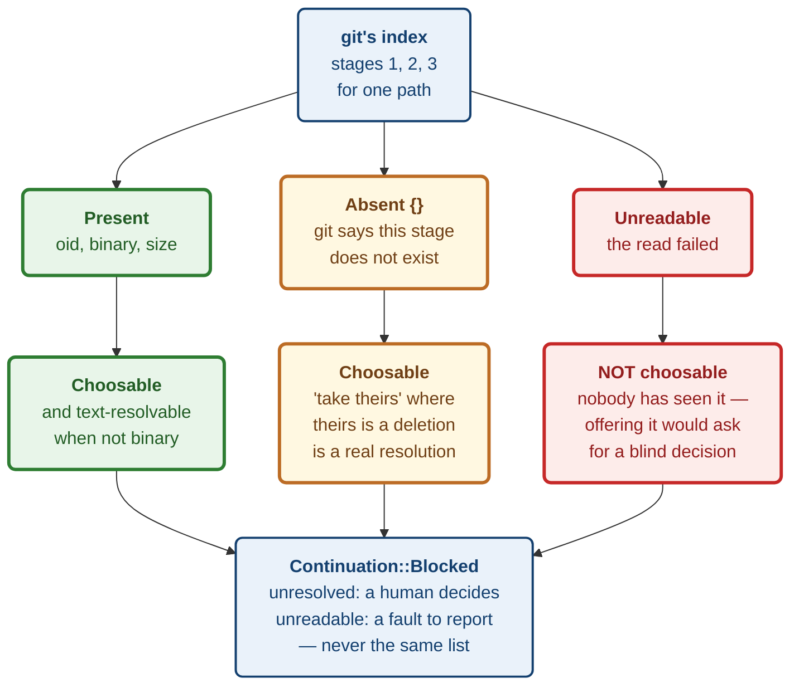

# ADR 0063 — One conflict model for six operations, and three states per side

Date: 2026-08-20
Status: Accepted — implemented (contract and scanner; no endpoint, no UI)

First slice of M4.31 (#84). Reuses `status::ConflictKind` (#68b) rather than
re-deriving it, and follows the staging `build_plan_only` established: the
vocabulary and the git reads land and get reviewed before any route exposes
them.

## Context

#84's goal statement is unusually precise about what it wants: *"model
conflicts independently of the operation that caused them and provide one
resolver for merge, rebase, cherry-pick, revert, stash, and pull."*

That independence is not a stylistic preference, it is a fact about git. All
six operations leave **the same thing** behind — index entries at stages 1, 2
and 3, plus a working tree with markers in it — and git does not record which
operation put them there. `git ls-files -u` looks identical after a failed
merge and after a failed stash pop.

What existed already was `status::ConflictKind`: seven variants derived from
porcelain-v2's `<XY>` codes, telling you *that* a path is conflicted and in
which shape. That is exactly right for a status listing and useless for
resolving one, because resolution needs the three versions git is holding —
and reading blobs on every status response would be a cost nobody asked for.

## Decision

**1. A new `conflict` module, separate from `status`.** `ConflictKind` is
reused verbatim as a field rather than re-derived, so a status listing and a
resolver can never disagree about what kind of conflict a path has.

**2. No operation is named anywhere in the vocabulary.** Six operation-specific
conflict types would be near-copies that drift, and would push a "which
resolver applies here" decision onto every caller for a question with one
answer.

**3. `Stage` has three states and none may collapse into another.**

| state | meaning |
|---|---|
| `Present { oid, binary, size_bytes }` | git returned this version |
| `Absent {}` | git says this stage does not exist |
| `Unreadable { reason }` | the read failed |

**4. `binary` is per stage, not per file.** Replacing a text file with a binary
one is a real conflict shape; a single per-file flag would pick a side and be
wrong about the other.

**5. `Continuation` is a type, not a `bool`.** `Blocked` carries `unresolved`
and `unreadable` as separate lists.

**6. `scan()` returns `Result`, and an `Err` must never become an empty list.**

**7. Rename detection is not attempted.** Git's index records no rename
information for conflicts — rename detection is a diff-time heuristic, not
stored state. `NotTextResolvable::Rename` exists for a caller that has done
that work by other means, rather than this type implying a capability it lacks.

### Why `Absent` is not an empty blob

This is the decision the rest follows from.

"The base is empty" and "there is no base" are different facts, and the
difference decides what a user is looking at. An add/add conflict genuinely has
no common ancestor — both sides created the file. Rendering that as a blank
base pane **invents an ancestor that never existed**, and invites someone to
resolve against it.

The same asymmetry runs the other way for deletions: a `DeletedByThem` conflict
has no stage 3, and "theirs is empty" would present a deletion as an empty
file. Those resolve differently.

And `Unreadable` is a third thing again, kept apart from both for the reason
this estate keeps paying for elsewhere: a pane that looks empty tells the user
that version was blank, when in fact **nobody looked**. `Advisory::DefaultBranchUnknown`
(ADR 0061) and heraldry's `NotCheckable` are the same distinction in different
clothes.

`Stage::is_choosable()` encodes the consequence: `Absent` **is** choosable —
"take theirs" where theirs is a deletion is a legitimate and common resolution,
and barring it would make every delete/modify conflict unresolvable through the
normal path. Only `Unreadable` is barred, because nobody has seen it.

### Why `Absent` is an empty struct variant

`#[serde(deny_unknown_fields)]` is **not enforced for unit variants of an
internally-tagged enum** — serde applies it only to struct variants. As a bare
`Absent`, a body like `{"state":"absent","content":"..."}` would deserialize
happily and silently discard the stray key.

That matters more here than almost anywhere, because this is the variant
asserting *there is nothing on this side*. A body that also carried content is
self-contradictory, and accepting it quietly is how a resolver ends up
displaying a side the type says does not exist. `Absent {}` costs nothing on
the wire — it still serialises as `{"state":"absent"}`, asserted by test — and
makes the stray key a hard error.

`ForcePublish` documents the same serde behaviour, which is how it was caught:
a test asserting the guarantee failed, and the honest fix was to make the type
able to deliver it rather than to delete the test.

The diagram at the end of this section shows the three states and what each
permits.

## Alternatives considered

**Extend `StatusEntry::Conflicted` with the three stages.** No new module, one
type. Rejected: every status response would then carry blob reads nobody asked
for, and status is on the hot path.

**One conflict type per operation.** `MergeConflict`, `RebaseConflict`, and so
on. Rejected on the issue's own goal statement and on git's behaviour — the
index state is identical, so the six types would differ only in a name that
carries no information.

**`Option<Blob>` per stage instead of a three-state enum.** Rejected: `None`
would mean both "no such stage" and "could not read it", which is precisely the
collapse this ADR exists to prevent.

**A `bool` for continuation.** Rejected: `false` would mean both "a human must
decide" and "this application could not read the file", and a UI acting on that
would tell someone to resolve a file it cannot show them.

**Deriving `ConflictKind` from the stage pattern instead of reading status.**
Tempting — it would remove a git call. Rejected because the pattern is
ambiguous: stages 2+3 present with no stage 1 is `BothAdded`, and stages 1+2+3
is `BothModified`, but several delete shapes overlap once a stage is missing
for an unrelated reason. Two readers disagreeing about a conflict's kind would
surface as a resolver showing the wrong UI.

## Consequences

**Good.**

- One vocabulary serves all six operations, and #77's stash-pop and #81's
  cherry-pick both get their continuation gate from it rather than each
  inventing one.
- "Could not read this side" is representable, so a resolver can refuse to ask
  for a decision it has made impossible.
- The scanner is testable against real repositories with real conflicts, with
  no browser and no mocking of git's index.

**Costs, stated plainly.**

- **Nothing routes to this yet.** The module carries
  `#[cfg_attr(not(test), allow(dead_code))]`, the same staging `build_plan_only`
  uses. The attribute stops applying the day a handler wires it up, so it
  cannot quietly cover a genuinely dead function later.
- **`describe_blob` reads each blob twice** — once for size, once to sniff for
  binary content. Two `cat-file` spawns per stage, up to six per conflicted
  path. Fine for the conflict counts a human resolves by hand; it would want
  `cat-file --batch` before anything scans hundreds of paths.
- **The binary sniff reads the whole blob and inspects the first 8000 bytes.**
  Matching git's own heuristic is deliberate — a file git calls binary and this
  scanner calls text would disagree about whether a text resolver may be
  offered — but a large binary is read in full to answer a question the first
  8 KB settles.
- **A path `ls-files -u` reports and `status` did not classify falls back to
  `BothModified`.** That is a disagreement between two git reads, and the
  fallback is a guess. It is reported rather than skipped, because dropping the
  path would hide a conflicted file entirely — but a guessed kind can still
  show the wrong resolver.
- **Criteria 1–3 and 5 of #84 remain open.** Base/ours/theirs/result *views*,
  block and line choices, explicit binary/rename/delete *UX*, and the portrait,
  crash and reconnect flows are all rendering work this slice deliberately does
  not attempt.

**Verification.** Seven protocol tests and six server tests. The server tests
build **real repositories with real unresolved conflicts** — a modify/modify
merge and an add/add merge — and read git's actual index staging; nothing about
the index is mocked, because a mocked index would prove nothing about the
format this module exists to parse. Three mutations were run against committed
code and all three were caught: reporting a missing stage as `Unreadable` (1
test red), returning an empty list from a failed scan (1 test red), and lumping
unreadable paths in with unresolved ones (1 test red). Full workspace: 1,998
tests passing, clippy clean under `-D warnings`.

**Signed:** max · 2026-08-20T06:15:00-04:00
