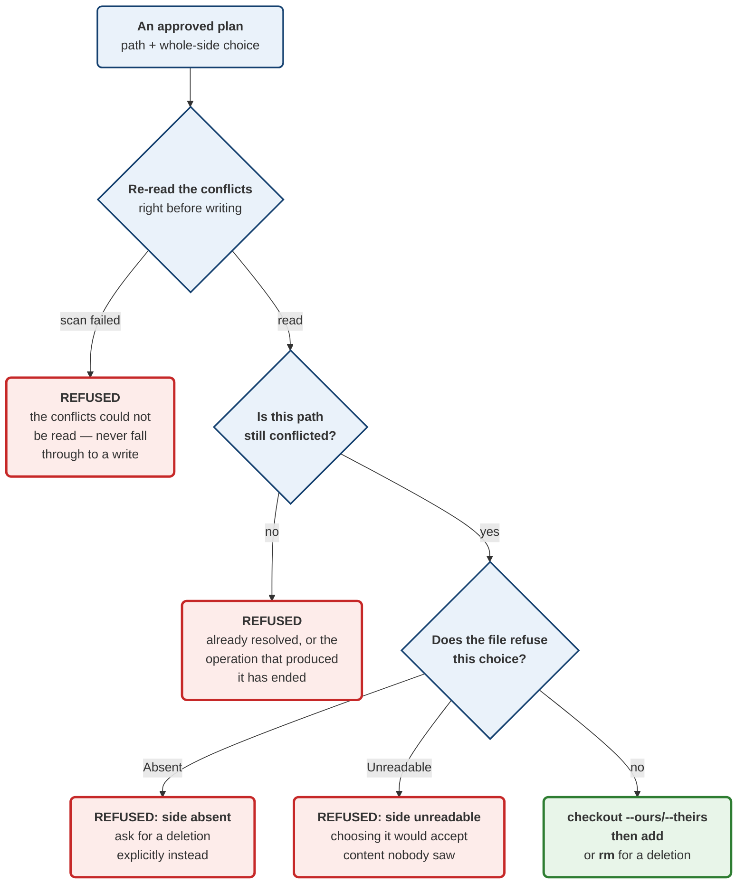

# ADR 0064 — Resolving a conflict is a planned operation, and refusing is half of it

Date: 2026-08-20
Status: Accepted — implemented (contract, planner and executor; no UI)

Second slice of M4.31 (#84), building on ADR 0063's read-only model. Adds the
write path, as a `GitOperation` rather than beside one.

## Context

ADR 0063 gave conflicts a vocabulary and a scanner. Nothing could act on them.

Acting means writing — to the working tree and the index — and in this codebase
every mutation goes through the planner: `shape` classifies it, the mutation
guard serialises it, `enforce_fresh` refuses a stale approval, the executor runs
it, and `durable` journals it with a recovery strategy. A resolution reached
through a side door would have none of that, and would be the first write in the
system that a user could not preview, could not have refused as stale, and could
not find in their own history.

## Decision

**1. `GitOperation::ResolveConflict { path, resolution }`.** One path, one
whole side.

**2. One path per operation.** Resolving is a sequence of judgements a human
makes file by file. Each is separately reviewable, separately journaled and
separately undoable. A batch variant would collapse ten decisions into one
approval, and would make partial failure — "three applied, then the fourth
refused" — a state this vocabulary has no way to describe.

**3. `Resolution` names a side and never carries bytes.** `TakeOurs`,
`TakeTheirs`, `TakeDeletion`. A plan is hashed, reviewed and replayed; putting
file content in one is a real decision belonging to the `patch_plan` machinery
that already solved it for staging selections. #84's "block and line choices"
is deliberately not attempted here.

**4. `TakeDeletion` is separate from taking the side that deleted the file.**
In a delete/modify conflict they reach the same outcome, but they are different
*requests*, and only one of them stays correct if the caller has misread which
side deleted what. So taking a side that is `Absent` is **refused**, not
reinterpreted.

**5. A new `RecoveryStrategy::ConflictRecreatableWhileInProgress`.**

**6. `shape` records no `Precondition`; the executor re-reads instead.**

**7. Excluded from the MCP tool surface.** Choosing a side is a judgement about
file content, made by someone looking at three versions of it. An agent picking
from a tool description has seen none of them. The exclusion is registered in
the reviewed-unexposed list, so it is a decision on record rather than an
omission.

### Why a new recovery strategy rather than `RecoverableIfStaged`

`RecoverableIfStaged` means: *no git-vista-driven undo, but the bytes may
linger as a dangling blob until the next `gc`.* A maybe, about the object store.

Resolving a conflict is not that. `MERGE_HEAD` (or the rebase/cherry-pick
equivalent) still names both sides, and `git checkout --merge -- <path>`
reconstructs the conflict **exactly**. That is a definite, about a mechanism —
git will do it, on request, byte for byte.

Tagging a resolution `RecoverableIfStaged` would understate it, and would tell
a UI to *warn* where it could *offer an undo*. That is the same conflation the
review which created `RecoverableIfStaged` already rejected once: both
operations previously shared the `Irrecoverable` tag, "defeating the point of a
typed field a future reader is expected to switch on rather than re-derive."

The qualifier in the name is load-bearing. **Once the operation concludes or is
aborted, this stops being true.** A caller offering the undo must check the
operation is still in progress rather than trusting the tag alone — which is
why the recovery *centre*, which reads journal rows after the fact, classifies
it `Unsupported` with a new and accurate reason (`OnlyWhileOperationInProgress`)
rather than pretending it can confirm the window is open.

### Why no precondition, and why that is not a gap

The precondition anyone would want is "this path is still conflicted, and the
side I chose is readable". `Precondition` cannot express it: the vocabulary
compares refs and worktree cleanliness, not index stage entries.

The tempting move is to approximate — attach `CleanWorktree`, or a `RefAt` on
`MERGE_HEAD` — so the plan *looks* guarded. That would be worse than nothing:
the plan would display a guarantee it had not made, and a reviewer reading the
preconditions would believe a check had happened that had not.

So the check lives in the executor, immediately before the write, and it is
**stricter** than a precondition could be. It re-runs the scan and asks the
same `refuses` the caller asked, so a side that became unreadable between plan
and execution stops the write — a staleness window a precondition evaluated at
build time would have missed entirely.

The diagram at the end of this section shows the executor's refusal path.

## Alternatives considered

**A batch `ResolveConflicts { Vec<(path, resolution)> }`.** Fewer round trips.
Rejected on partial failure: there is no honest way to report "three of five
applied" in a vocabulary where a plan either ran or did not.

**Carry resolved content in the operation.** Would deliver #84's line-level
criterion immediately. Rejected: a plan is hashed and replayed, and file bytes
in one is a decision about size limits, encoding and idempotency that deserves
its own ADR rather than arriving as a side effect of this one.

**Reuse `RecoverableIfStaged`.** No new variant, no wire change. Rejected
above — it describes a weaker and different promise.

**Approximate the precondition.** Rejected above; a displayed guarantee that
was never checked is worse than a visibly absent one.

**Expose it as an MCP tool.** Rejected: the judgement requires seeing three
versions of a file, and a tool call has seen none.

## Consequences

**Good.**

- Resolution inherits preview, serialisation, staleness refusal, journaling and
  a recovery tag for free, because it is an operation like any other.
- The executor's re-read is a stronger guard than the precondition it replaces
  would have been.
- #77's stash-pop and #81's cherry-pick get a resolution path they do not have
  to invent.

**Costs, stated plainly.**

- **A survived mutation, documented in the code rather than hidden.** Replacing
  the failed-scan arm with `Err(_) => Vec::new()` leaves every test green. The
  fall-through still refuses — the path is simply absent from an empty list —
  so nothing is written and nothing is lost. What breaks is the *answer*: the
  caller is told "not conflicted" when the truth is "the conflicts could not be
  read". Forcing `git ls-files` to fail inside a repository still healthy enough
  to build a plan proved fragile in every form tried, so the gap is recorded at
  the call site instead of covered by a test that does not really test it.
- **No line-level resolution**, so a conflict needing a mix of both sides must
  be resolved outside git-vista and staged. That is #84's criterion 2 and it
  remains open.
- **No rename UX.** `NotTextResolvable::Rename` exists but nothing populates
  it, because git's index records no rename information for conflicts.
- **Two `cat-file` spawns per stage** are inherited from ADR 0063's scanner, and
  the executor's re-read pays them again. Fine for hand-resolved counts.
- **`TakeDeletion` uses `git rm -f`.** The `-f` is required — a conflicted path
  is never "clean" and git refuses without it — but it means the one resolution
  that discards both sides is also the one running git's least cautious flag.
  The refusal path in front of it is what makes that acceptable.

**Verification.** Three end-to-end pipeline tests driving the **full production
path** — plan build, mutation guard, staleness gate, executor — against real
repositories with real merge conflicts: a modify/modify resolution, a refusal on
an unconflicted path, and a refusal on a delete/modify where the chosen side does
not exist. Plus eight protocol tests for the vocabulary.

Three mutations were run against committed code. **Two were caught; one was
not, and one of the catches only exists because a mutation initially survived**:
deleting the executor's `refuses` check left every test green, which exposed
that `refuses` was tested in isolation but never at the point of use. The
missing test was written, and the mutation now takes it down. The mutation that
still survives is the failed-scan fall-through documented above. Skipping the
post-checkout `add` is caught.

Eight census guards fired during this change and each was registered
deliberately rather than worked around: `shape`, `execute`,
`honours_cancellation`, `network_need_for_operation`, the sandbox dispatch
census and its two count tripwires, the contract suite's `covered_by` — which
refused to compile until a real end-to-end test existed — the plan golden
fixture, and the MCP catalog's reviewed-unexposed list. Full workspace: 2,005
tests passing, clippy clean under `-D warnings`.

**Signed:** max · 2026-08-20T07:05:00-04:00
