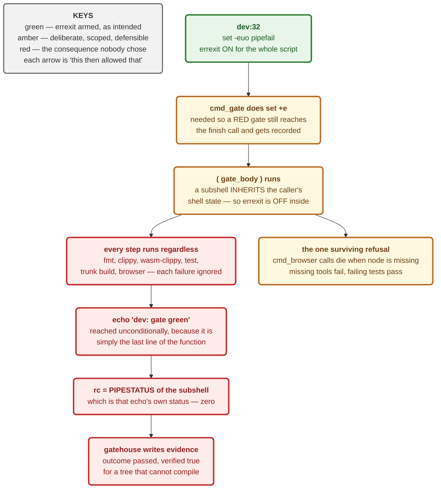

# ADR 0065 — The gate must be able to say no, and a test must prove it can

Date: 2026-08-22
Status: Accepted — implemented (`dev`, `ci/gate_errexit_test.sh`)

Fixes #434. Written because a gate that cannot fail is a contract change
nobody chose, and it stood for three days without anyone noticing.

## Context

`./dev gate` is this project's definition of done, item 1. Every milestone
checklist, every PR, and (since `275652ca`, 2026-08-19) the gatehouse evidence
store treat its verdict as the answer to "is this safe to merge?"

On 2026-08-19 the gate gained the ability to record its own result. To keep a
failing gate from aborting `cmd_gate` before the `finish` call could write that
record, the invocation was wrapped:

```bash
set +e
( gate_body ) 2>&1 | tee "$log"
rc=${PIPESTATUS[0]}
set -e
```

`set +e` disables errexit. A subshell inherits the shell state of its caller.
So errexit was off inside `gate_body`, which meant:

1. every step ran regardless of whether the previous one failed;
2. `gate_body` always reached its final `echo "dev: ✅ gate green"`;
3. `${PIPESTATUS[0]}` was **that echo's** status — `0`.

The comment above `gate_body` said *"`set -e` still applies inside, so the
first failure still aborts the rest."* It asserted the opposite of the
behaviour, which is why reading the file did not reveal the bug.

**The measurement.** The real script, unmodified, run with every build tool
shimmed to exit 101: seven failing tool invocations in the transcript, `dev: ✅
gate green` printed, process exit `0`.

Exactly one enforcement path survived: `cmd_browser`'s prerequisite checks call
`die` (an explicit `exit 1`) when node or the Playwright cache is missing.
**Missing tools failed; failing tests passed.**

The diagram at the end of this section traces the shell state from the line
that arms errexit to the false record that came out the other end.



### The irony, recorded rather than smoothed over

`cmd_gate`'s own header comment says **"Recording must NEVER change whether the
gate passed."** The `set +e` existed to serve recording. It changed whether the
gate could fail at all. The feature broke the precise promise its comment made
— which is worth writing down, because the next person adding a wrapper around
the gate will be reaching for the same tool.

### What this did NOT cause

An initial reading blamed this bug for M4.27's broken wasm build reaching
`main`. **Refuted**, and recorded here so it is not repeated as fact:

- GitHub Actions has been disabled repo-wide since 2026-08-20
  (`actions/permissions` → `{"enabled": false}`).
- `statusCheckRollup` is empty on both PR #426 and PR #427.
- gatehouse holds `no_evidence` for both PR heads and the merge commit.

The broken code did not merge *through* the lying gate. It merged past a gate
that **was never invoked**, under CI that **did not exist**. Two independent
holes, and only one of them is this ADR's subject.

## Decision

**1. `gate_body` runs with errexit explicitly re-armed:**

```bash
( set -e; gate_body ) 2>&1 | tee "$log"
```

`set -e` inside the subshell is not redundant with `dev:32` — it undoes the
`set +e` immediately above, which the subshell would otherwise inherit. The
comments at both sites now say what actually happens and why the other line
exists.

**2. `set +e` in `cmd_gate` stays.** Recording a red gate is the whole point of
the evidence store; the fix is to scope the disablement to `cmd_gate`'s own
control flow, not to remove it and lose the record on every failing run.

**3. The invariant gets a test that drives the real script.** No Rust test can
observe shell errexit state across a function/subshell/pipeline boundary, so
`ci/gate_errexit_test.sh` runs `./dev gate` **unmodified** with the toolchain
shimmed to fail underneath it.

It asserts two things, and the second is the load-bearing one:

| assertion | what it pins |
|---|---|
| the gate exits non-zero | it can say no at all |
| the gate STOPS at the first failing step | errexit actually reaches `gate_body` |

The first alone is insufficient: a naive fix that merely propagated the last
command's status would satisfy it while still running every step. Only the
second can hold if the first failure aborted the rest.

`node` and `npx` are shimmed **present-but-failing** on purpose. Shimming them
absent would route the test through `cmd_browser`'s `die` — a different exit
path, and the one enforcement surface that still worked while the gate was
broken. The test would then have passed for the wrong reason.

## Alternatives considered

**Drop `set +e` and let errexit abort `cmd_gate`.** Simplest diff. Rejected: a
failing gate would then never reach `finish`, so exactly the runs that most
need recording — the red ones — would leave no evidence. The store would fill
with passes and imply a perfect history.

**Check `rc` and re-derive the verdict in `cmd_gate`.** Rejected: it moves the
pass/fail decision away from `gate_body`, so the printed transcript and the
recorded verdict become two independent computations that can disagree. One
source of truth, and it is the shell's own errexit.

**`trap ERR` instead of errexit.** Rejected: `ERR` traps are not inherited by
functions without `set -E`, which is the same class of subtle inheritance rule
that caused this defect. Replacing one inheritance gotcha with another is not a
fix.

**Leave it and rely on CI.** Rejected on the facts: CI has been off since
2026-08-20, and was failing in 3–6 seconds before that. The local gate is
currently the only gate.

## Consequences

**Good.**

- The gate can refuse again, and a committed test fails loudly if it ever
  stops being able to.
- The failure mode is now *loud* rather than silent: a broken gate turns every
  gate run red instead of every gate run green.

**Costs, stated plainly.**

- **The evidence store holds one false certification.** Run
  `b55427b58537-1787394767027833781-423086`, recorded 2026-08-22 06:32 EDT,
  reports `outcome: passed` / `verified: true` for commit `b55427b5` —
  including the `clippy-wasm` and `trunk-build` checks, which that tree cannot
  pass. It is named here rather than deleted: no gatehouse tool to annotate or
  invalidate a stored run was found, so the honest remedy is a later honest run
  on the same work plus this record of what the earlier one meant.
- **Every gate run is red until the M4.27 wasm break is fixed.** That is the
  fix working, not a new defect — `main`'s wasm build genuinely does not
  compile. It does mean no branch can honestly claim "gate green" until that
  lands.
- **Any green believed between 2026-08-19 and 2026-08-22 was unearned.** Only
  one post-bug run was actually recorded, but the gate was worthless as
  enforcement on every branch for those three days.
- **`ci/gate_errexit_test.sh` is not wired into the gate itself.** Running the
  gate inside the gate needs thought about recursion and cost; for now it is
  run by hand and by review. A gate step that runs it is worth considering.

**Verification.** The test passes against the fix. Both mutations were run in a
throwaway worktree — never the live checkout, because a WIP checkpointer owns
this repo's index and has committed a deliberately-broken function mid-mutation
before — and both were **caught**, failing through *different* assertions:

| mutation | tripped |
|---|---|
| `( set -e; gate_body )` → `( gate_body )` (the original bug) | assertion 1 — "the gate exited 0 with every build tool failing" |
| `cargo fmt … ` → `cargo fmt … \|\| true` (errexit intact, one step swallowed) | assertion 2 — "the gate continued past a failing fmt step" |

One mutation would have proved only that the test notices *something*. Two that
fail differently prove each assertion carries its own weight.

**Signed:** max · 2026-08-22T11:35:00-04:00
