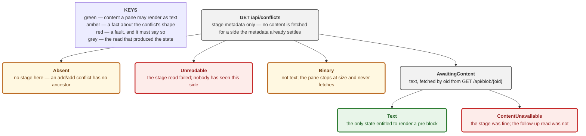

# ADR 0066 — Inspecting a conflict is three reads the LAN listener never sees

Date: 2026-08-22
Status: Accepted — implemented (M4.31a, #428)

Second slice of M4.31 (#84), building on [0063](0063-one-conflict-model-for-six-operations.md)
(the conflict vocabulary) and beside [0064](0064-resolving-a-conflict-is-a-planned-operation.md)
(resolution as a planned operation). **Read-only — adds no write path.**

## Context

ADR 0063 landed the vocabulary and the scanner and stated its own cost plainly:
*"Nothing routes to this yet."* The client showed conflicts as a count and the
word "Conflicted". Nothing could inspect one.

Making a conflict inspectable needs three different reads, and they are
different in kind — which is the whole reason this is an ADR rather than a
routing detail:

| read | what it returns | where it comes from |
|---|---|---|
| `GET /api/conflicts` | every conflicted path's three stages, **metadata only** | `conflicts::scan()` (ADR 0063), unchanged |
| `GET /api/blob/{oid}` | one stage's bounded content | an **index** blob, by object id |
| `GET /api/worktree-file/{*path}` | the working tree's own copy | the filesystem |

## Decision

### 1. All three are `full_routes` only, `Authz::SessionRequired`

Settled on the issue before implementation, deliberately, so it could not be
re-decided cheaply mid-build. Each discloses uncommitted state, which ADR
0005's LAN profile withholds:

- `/api/conflicts` reports the stage entries of an in-progress merge —
  uncommitted index state by definition.
- `/api/blob/{oid}` serves **index** objects. A conflict stage blob need not be
  reachable from any commit, so "it is only a blob" is not the guarantee
  `/api/file/{id}/{*path}` has.
- the worktree read is uncommitted by construction.

They are GETs, so CSRF is not the concern that makes `/api/diff/spec` a
`SessionAndCsrf` POST.

**`/api/blob` is NOT made LAN-safe by checking whether an oid is reachable from
a commit.** That is exactly the by-variant gating `main.rs`'s `/api/diff/spec`
comment rejects — a security boundary inside a runtime check, where the next
caller inherits whichever answer someone forgot to consider. The whole route is
withheld from the LAN listener instead.

### 2. A blob oid is not a revision, and the hex gate is what makes that true

`git cat-file --batch` accepts full revision syntax. Without a gate,
`/api/blob/HEAD:secrets.txt` and `/api/blob/:0:path` are working object reads
through a route that claims to take a bare object id. `CommitOid::new` (40 or
64 lowercase hex) runs **before anything spawns**.

`git_cat_file_batch_oid` is a separate function from `git_cat_file_batch`
rather than a flag on it. That function's shape exists to build `<id>:<path>`
and retry `<id>^:<path>` when the first is missing — correct for a file at a
commit that may have been deleted. A blob oid has no such history: retrying
`<oid>^:` would ask git to treat the oid as a commit and could resolve to a
*different, unrelated* object on a coincidental hit.

### 3. The result pane ships read-only, and says so in its own label

`Pane::label()` returns `"Result (read-only)"`. The promise lives in the string
the renderer already prints, not in a note a caller must remember to add.
Editing arrives in #429.

### 4. A missing worktree file is `Absent`, not a failure

The same distinction ADR 0063 draws between `Stage::Absent` and
`Stage::Unreadable`, one layer out. A delete/modify conflict resolved toward
deletion legitimately leaves nothing on disk; reporting that as a failed read
would announce a fault where git is behaving correctly.

### 5. The pane mapping lives in framework-free, host-tested code

`features/conflicts/core.rs` has no Leptos and no `#[cfg(target_arch =
"wasm32")]`. This is the load-bearing choice of the slice.

Two of #428's four acceptance criteria — *"Absent reads as absent, not as
empty"* and *"Unreadable says so"* — are facts about **rendering**. `cargo
test` never compiles wasm-gated code, so a mapping placed in `menu` or `prefs`
would be pinned by nothing while appearing thoroughly tested. That is not
hypothetical here: it is the documented shape of #68d and #69c, each a
fully-tested core with zero consumers beside a green gate.

Six pane states, none collapsing into another:

### 6. A late or mismatched response can never overwrite a settled pane

`PaneState::with_content` fills only an `AwaitingContent` pane, and only when
the response's oid matches. Without that guard a response landing for a
superseded request would rewrite "there is nothing on this side" into an empty
text pane — ADR 0063's collapse, arriving through the back door of a stale
fetch rather than through the type system.

## Alternatives considered

**Return stage content inline from `/api/conflicts`.** One round trip. Rejected
on `ConflictedFile`'s own contract, which says a caller fetches content
independently — and on cost: a conflict with a 200 MB binary side would
transfer it to render a pane that shows only a size.

**Reuse `/api/file/{id}/{*path}` with the stage's oid as `{id}`.** No new route.
Rejected: that endpoint's `<id>^:<path>` fallback is wrong for a blob (see
Decision 2), and it is registered on the LAN router, which would publish index
content there.

**Gate `/api/blob` by oid reachability instead of withholding it.** Rejected —
see Decision 1.

**Put the pane mapping in the viewer.** Fewer files. Rejected — see Decision 5.

**Model a pane as `Option<String>`.** Rejected for exactly ADR 0063's reason,
one layer out: `None` would mean absent, unreadable, binary and not-yet-fetched
all at once.

## Consequences

**Good.**

- All four views are reachable for a conflicted path, from a real gesture — a
  conflicted row in the Activity panel is now a button.
- The absent/unreadable/failed distinctions survive rendering, and a browser
  test proves it in a real browser rather than in a unit test that cannot see
  the DOM.
- `/api/conflicts` costs one read for a repository full of binary conflicts.

**Costs, stated plainly.**

- **`conflicts::describe_blob` still reads each blob twice and uncapped**, per
  ADR 0063's own cost list — once for size, once to sniff 8000 bytes for NUL.
  This slice makes that path HTTP-reachable without fixing it. It is bounded by
  the user's own repository on a loopback, session-gated route, so it is a
  performance defect rather than a security one, and it wants
  `cat-file --batch` before anything scans hundreds of paths.
- **No generation token.** Every other live read carries one (`status-v1:`,
  `diff-v1:`). Deliberately omitted: nothing here is *acted on*, so there is no
  approval to pin. `conflict-v1:` belongs to #432's editor seed, where content
  becomes an input to a plan.
- **Four sequential fetches per conflict.** `fetch_conflict_panes` awaits each
  in turn. Fine for a human inspecting one file; it would want concurrency if
  something ever opened many.
- **The result pane is read-only**, so a user who spots the answer must still
  resolve elsewhere. #429.

**Verification.** 17 server tests (real repositories with real unresolved
merges — nothing about the index is mocked), 16 host-side pane tests, and 2
browser tests driving a real browser against a genuinely conflicted repository
served alongside the main fixture.

Six mutations were run through `failure-atlas` against committed code. Five
were caught. **One survived and is recorded rather than hidden**: removing
`with_content`'s state guard left every assertion green, because the test only
exercised the `Ok` path and the oid comparison caught the mismatch anyway. The
test was inert for the defect it named. It now exercises the `Err` path too,
where no second guard exists, and the mutation is caught.

The `/api/blob` hex gate was mutated two ways that fail differently — removed
outright, and weakened to a non-empty check — and both were caught by the same
test, which asserts `/api/blob/HEAD:a.txt` is refused. Under either mutation
that request returned real file content.

**Signed:** max · 2026-08-22T12:40:00-04:00
