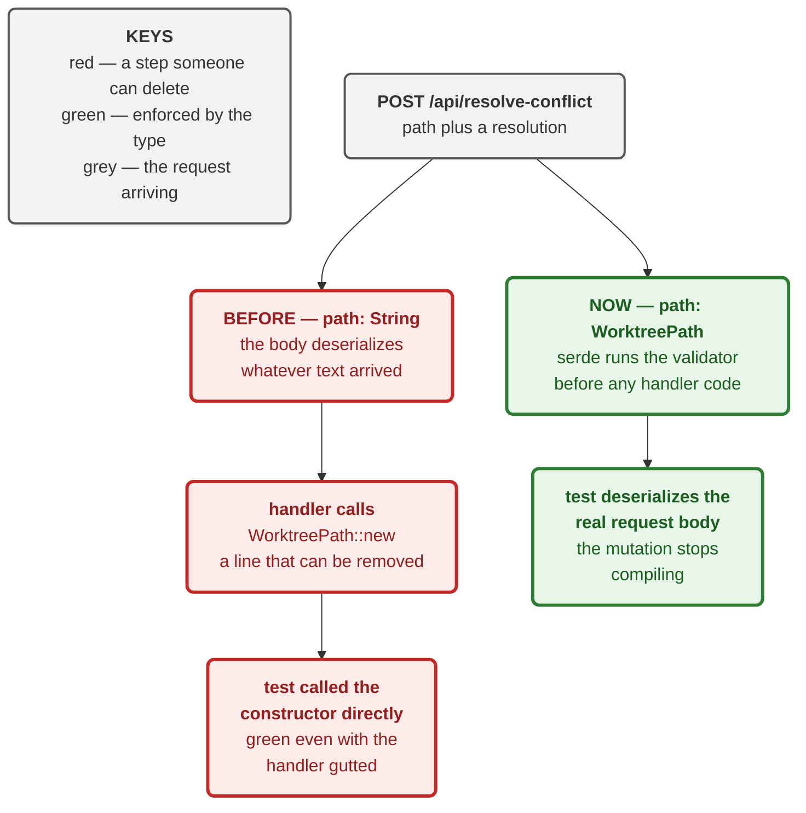

# ADR 0067 — A resolution names one path, and the refusal is the answer

Date: 2026-08-22
Status: Accepted — implemented (M4.31b, #429)

Third slice of M4.31 (#84). Builds on [0064](0064-resolving-a-conflict-is-a-planned-operation.md)
(resolution as a planned operation) and [0066](0066-inspecting-a-conflict-is-three-reads-the-lan-never-sees.md)
(the four panes a user chooses from).

## Context

Everything needed to resolve a conflict already existed. `Resolution` is a
closed three-variant vocabulary, `GitOperation::ResolveConflict` carries it,
`ConflictedFile::refuses` decides admissibility, and
`planner::exec_resolve_conflict` re-runs that check inside the coordinator
lock immediately before the write.

What did not exist was any way to ask. In the issue's own words: *the missing
surface, not a missing mechanism.*

## Decision

### 1. One path per request

`WorktreePathsRequest` takes a list because discarding twenty paths is one
decision made once. Resolving is the opposite: each path is a separate
judgement about whose version is right, and `refuses` answers **per path**.

A batch would have to report *"three of these five were refused, for different
reasons"* — a shape no caller handles well and every caller is tempted to
collapse into "it failed", which is precisely what this slice exists to
prevent. One path also keeps the operation reviewable: the plan names a single
file and a single side, so what was approved and what runs cannot drift.

### 2. The refusal is the payload, and it is rendered inline

`exec_resolve_conflict` already turns `ResolutionRefused` into a sentence
naming *which* side and *why*. The client keeps that sentence whole and
renders it **between the buttons and the panes** — beside the choice it is
about.

Not an alert box. An alert is transient, appears away from the panes, and
invites the caller to substitute its own shorter message. "This file has no
ours side — to remove it, ask for a deletion explicitly" is an instruction;
"Couldn't resolve" is not.

### 3. The handler does not pre-check `refuses`

Tempting, and wrong. A check at the HTTP boundary would be a second copy of
the one that actually protects the write, evaluated earlier and therefore
racier. Two answers that can disagree is worse than one that cannot. ADR 0064
already established why the real check must live inside the coordinator lock:
no precondition can express "still conflicted, and this side is still
readable".

### 4. `path` is a `WorktreePath` on the DTO, not a `String`

This one was learned rather than designed, and the diagram at the end of this
section shows the difference.

The first implementation took a `String` and called `WorktreePath::new` in the
handler, with a test asserting that traversal paths are refused. `mutation_check`
gutted the handler's validation and the test **stayed green** — because it
called `WorktreePath::new` directly. It was testing the protocol crate's
newtype, which has its own tests, and said nothing whatever about the
endpoint.

The newtype already deserializes through its own validator. Typing the field
moves the check from something a handler must remember into something the wire
format enforces: a body naming `../escape.txt` fails in serde, before any
handler code runs. The mutation is not merely detected, it stops compiling.

`WorktreePathsRequest` keeps `Vec<String>` deliberately — it must also
deduplicate, so it needs a validation pass of its own regardless.

### 5. Success refreshes two things, and the second is load-bearing

`status.refetch()` updates the topbar chip's v1 read. The Activity panel's
conflicted list is a **separate** v2 `WorktreeStatus` resource keyed on the
graph epoch (M2.15, #68).

Refetching status alone left the chip saying "1 conflicted" while the panel
still listed two rows — a user resolving a conflict and watching it stay on
screen. Caught by a browser test, invisible to every unit test, because no
unit test has a panel.

## Alternatives considered

**A batched resolve.** Rejected — see Decision 1.

**Return `ResolutionRefused` as typed JSON rather than prose.** Attractive,
and genuinely better for a programmatic caller. Rejected for this slice
because the executor already produces the sentence, the only consumer is a
human reading a pane, and a typed body with no second consumer is a wire
contract maintained for nobody. Worth revisiting when the MCP surface wants
it.

**Pre-check `refuses` in the handler to fail fast.** Rejected — see Decision 3.

**Keep `path: String` and write a better handler test.** Rejected: it would
require driving the handler through the router to notice a missing line, when
the type system can make the line unnecessary.

## Consequences

**Good.**

- All three resolutions are reachable per conflicted path, and the refusal
  names which side and why.
- Path traversal is refused by the wire format, so no future handler on this
  DTO can forget it.
- Resolving goes through the planner like every other mutation (ADR 0016) — it
  does not bypass the plan path.

**Costs, stated plainly.**

- **No confirmation step.** The three buttons act immediately. `TakeDeletion`
  removes a file, and the executor's own `rm -f` is not undoable through the
  journal — this is the same class of operation as `DeleteUntrackedPaths`,
  which *does* get a confirm dialog. A confirm for deletion is a real gap,
  deliberately not smuggled in without the dialog work it needs.
- **One request per path.** Resolving twenty conflicted files is twenty
  round-trips, each with its own plan. Correct, and slow if anyone ever has
  twenty.
- **The refusal is prose, not a typed body** — see Alternatives.
- **`resolve_busy` disables all three buttons together**, so a user cannot
  queue a second resolution while one is in flight. Intentional, but it also
  means a slow write makes the whole toolbar look dead with nothing saying
  why.

**Verification.** 20 server tests, 4 browser tests. The browser tests drive a
real conflicted repository to zero conflicts through the actual buttons —
which is #429's third acceptance criterion (`continuation()` reports `Clear`)
observed from the outside.

Two mutations, failing differently, both now caught:

| mutation | result |
|---|---|
| drop `deny_unknown_fields` from the request body | **caught** — a stray key the caller believes is honoured would be silently dropped |
| loosen `path` back to `String` | **caught** — it no longer compiles; the type is the mechanism |

And one that survived and drove Decision 4: gutting the handler's
`WorktreePath::new` call left every test green, because the test called the
constructor rather than the endpoint.

**Signed:** max · 2026-08-22T13:35:00-04:00
