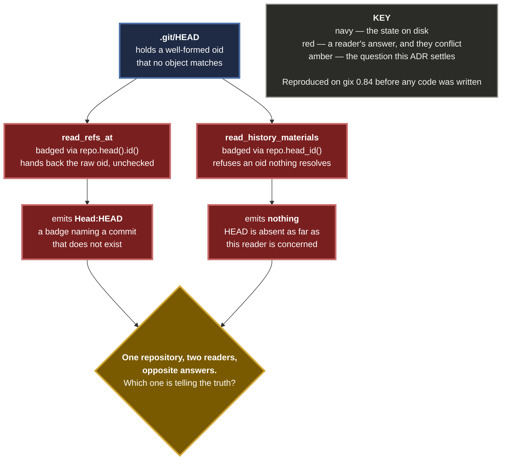
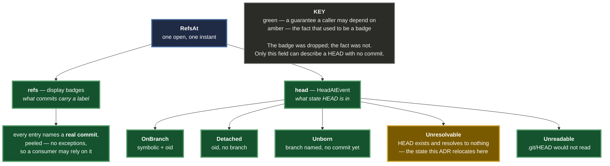

# 0071 — A badge is a claim about a commit, so a HEAD with no commit is recorded, not badged

**Status:** Accepted — implemented and tested
**Date:** 2026-08-24
**Issue:** [#465](https://github.com/tom2025b/Git-Vista/issues/465) · filed as F1 of the #449 design
**Supersedes nothing.** Resolves a disagreement `read_refs_at`'s own doc comment recorded and deferred (ADR 0070's refactor deliberately preserved it).

---

## Context

Two functions read one repository's refs. They gave **opposite answers about whether HEAD exists.**

Reproduced independently before any code was written — `git init`, one commit, then a well-formed 40-hex oid with no object behind it written into `.git/HEAD`, against gix 0.84:

```
read_refs_at            -> ["Head:HEAD", "Branch:main"]   head = Unresolvable
read_history_materials  -> ["Branch:main"]
```

The cause is two gix calls that differ in exactly one state:

| Call | A HEAD holding an oid nothing resolves |
|---|---|
| `repo.head()` → `head.id()` | hands back the **raw, unvalidated** oid |
| `repo.head_id()` | **refuses** it |

`read_refs_at` used the first, `read_history_materials` the second.


**A dangling HEAD is not hypothetical.** It is what a repository looks like mid-recovery, after a bad manual ref write, or when an object has been garbage-collected out from under a detached HEAD — precisely when someone opens this app to find out what state they are in.



---

## Decision

### D1 — HEAD is badged exactly when it resolves to a commit

`read_refs_at` now badges HEAD from `head_id()`, the same resolved id `read_history_materials` has always used. Both readers give one answer in every state they share.

**The reason is not "make them match".** It is that `refs` documents itself as display refs *"each peeled to the commit it ultimately points at"*. **Every entry in that list is a claim about a commit.** A dangling HEAD has no commit, so it has no claim to make there — and a consumer that trusts the list is entitled to trust every entry in it.

### D2 — The fact is relocated, not discarded

A HEAD that points at nothing is still recorded: `RefsAt::head` is `HeadAtEvent::Unresolvable`, which is the field that *can* say so, and which #449 already computes correctly for this exact state.


**Two fields, two jobs.** `refs` answers "what commits carry a label". `head` answers "what state is HEAD in". Only the second can describe a HEAD with no commit, and it does.



### D3 — This is option B for what the user sees, and this ADR says so

#465 offered two readings, and the honest one — *"HEAD exists but is unresolvable"* — was the one it leaned toward. **That reading is implemented in the recorded state and not in anything the user sees**, because no live surface can carry it today:

- `HeadAtEvent` reaches only the **journal-capture** path (#449). It is on no live payload.
- The live history payload carries `head_branch: Option<String>`, where `None` already means *detached* — so it cannot distinguish "detached" from "unresolvable" without a wire change.

So for the graph and history views this is **option B: HEAD does not exist.** Saying otherwise in this ADR would be exactly the laundering #465 objects to.

**No user-visible behaviour is lost.** The badge already never rendered: the frontend attaches refs to graph rows by oid, and a dangling oid matches no row. The badge existed in the payload and nowhere else. What changes is that the payload stops asserting something untrue.

**Surfacing a broken HEAD in the UI is real, and is filed separately** rather than smuggled in here.

### D4 — No shared classification helper

The obvious anti-drift move is one function both readers call. It was rejected: after D1 the readers share the *badge rule*, and only `read_refs_at` produces a `HeadAtEvent`, so such a helper would have exactly one caller.

**The anti-drift mechanism is the test, and it is a stronger one.** `the_two_readers_badge_head_identically_in_every_state_they_share` calls both readers on the same repository and compares their output across four states. A shared function guarantees the same *code* runs; the test guarantees the same *answer* — which is what drifted.

### D5 — The fix is forward-only

The journal is append-only. Any line already written by the old code carries a `Head` ref with an unresolvable target, and nothing rewrites it. **A replayer must tolerate a captured HEAD ref whose target resolves to no object.** On this box that is zero lines — all four journal entries predate #131 — but the guarantee is about the format, not this disk.

---

## Alternatives considered

| Option | Why not |
|---|---|
| **Make `read_history_materials` badge from `repo.head()` instead** | Agreement, achieved by making both readers lie. The list's contract says every entry is peeled to a commit. |
| **Emit the badge and let the UI render "points at nothing"** | The honest reading, and unreachable today — no live payload can carry the distinction. It needs a wire change and a UI affordance, which is a feature, not this fix. Filed separately. |
| **A shared `classify_head` helper** | One caller. See D4 — the cross-reader test is the mechanism with teeth. |
| **Add `head: HeadAtEvent` to `HistoryMaterials`** | Nothing would read it. #449's D7 parks the shared-read-pass question deliberately; an unread field is complexity with no caller. |
| **Leave it, and document the disagreement** | What the previous ADR did. It survived a refactor and a release, and stayed wrong. |

---

## Consequences

**Good**

- Two readers of one repository can no longer contradict each other about whether HEAD exists.
- Every entry in a display-refs list is now a claim about a real commit, without exception — a consumer may rely on that.
- The dangling-HEAD state is still recorded, in the field designed to hold it.
- The blast radius is proven, not assumed: agreement is asserted across four HEAD states, and the whole workspace (908 tests) is green.

**Bad, and accepted**

- A user with a broken HEAD sees no signal in the app. They saw none before either — the badge never rendered — but this ADR is where that gap is now written down instead of hidden behind a payload entry nobody drew.
- `Unreadable` (a corrupt `.git/HEAD`) is outside the agreement: `read_history_materials` hard-errors, `read_refs_at` degrades. That is a difference of **error policy**, documented in `read_refs_at`, and deliberately unchanged here.

---

## Evidence

- Probe reproduced independently before writing code, on gix 0.84, on this machine — not taken from the report that filed it.
- RED watched first: the dangling row disagreed, the other three states already agreed, so the fix's cost is bounded by construction.
- Two mutations, both `caught`, both conclusive, failing **differently**:

| Mutation | Fails on |
|---|---|
| badge from `repo.head()` again | `the_two_readers_badge_head_identically_…` — what is **displayed** |
| classify `(None, None)` as `Detached` | `a_dangling_head_is_still_recorded_…` — what is **recorded** |

- `cargo test --workspace`: 908 passed, 0 failed. No existing test encoded the old behaviour.
